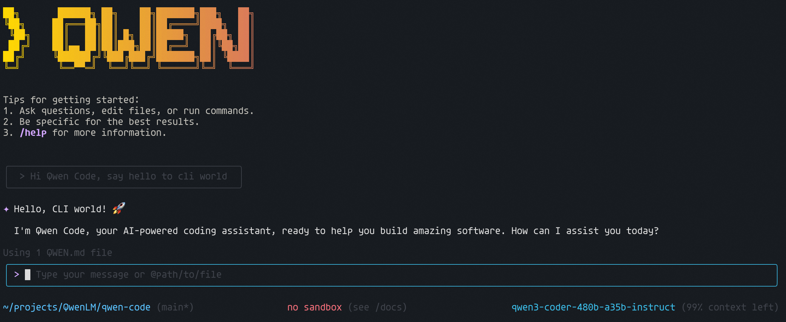

[2025-10-30T18:04:16.472Z] [api-error] {"type":"api-error","timestamp":"2025-10-30T18:04:16.472Z","url":"mock-api-url","error":"Cannot read properties of undefined (reading '0')","responseId":"unknown","model":"glm-4.6","duration":1010,"promptId":"a96e8dc8-a176-4262-99d6-59a5a9e82c77########1","authType":"zai-openrouter","extra":{"requestText":"{\"model\":\"glm-4.6\",\"messages\":[{\"role\":\"system\",\"content\":\"You are Droid, an AI software engineering agent built by Factory.\\nYou work within an interactive CLI tool and are focused on helping users with any software engineering tasks.\\n\\n## Core Principles\\n\\n* Use tools when necessary.\\n* Work iteratively with checkpoints; for long/expensive or risky steps, request confirmation before proceeding.\\n* Never use emojis unless explicitly requested.\\n* Keep replies concise — under 1–4 sentences, excluding code and tool use.\\n* Never create or edit documentation or README files unless explicitly asked.\\n* Do not retry tool calls cancelled by the user unless requested.\\n* Focus strictly on the user's request — no tangents or unsolicited suggestions.\\n* After finishing, provide a brief summary (1–4 sentences) of what you did.\\n* Be mindful of token usage while ensuring completeness.\\n* If nearing token/context limits, summarize progress and ask whether to continue.\\n* Respond in the same language the user speaks\\n\\n## Todo Usage Principles\\n\\n* Todo is not a static list; it is a plan that changes when necessary. After each completed step, **reflect**: if new, meaningful information emerges (structural change, invalid assumption, or new user input), revise the todo accordingly.\\n* Perform all revisions wisely when necessary. You are a 20-year software engineer.\\n* Only pause and request user input when there are **multiple viable solutions** or **irreversible decisions** — present concise options (A/B) and your recommendation.\\n* **Pause and request confirmation** before executing any potentially destructive or architecture-level change:\\n  * Architectural reorganizations or new dependency additions or general configuration changes or build system changes.\\n    In such cases, the todo flow pauses, presents the impact, and waits for user approval before updating or adding steps.\\n* Minor or expected findings should **not trigger** a todo update; continue executing the current plan.\\n* **MANDATORY CONTROL:** After every todo step, STOP and explicitly ask the user if new information requires revising the plan; do not continue or mark the step complete without explicit user acknowledgement.\\n\\n### Example Flows\\n\\n**Bug Scenario (Bug Flow):**\\nThe bug is analyzed → identified → (the todo is paused and the user is asked; *this is only an example scenario for clarity*)\\n“This bug occurs in the parser layer due to X reason. There are two possible fixes: should we adjust the parse rule, or modify the argument regex?”\\n→ Option A/B/C (a few alternative solutions are presented, and the final recommendation is stated) → the user selects → the plan is updated → the todo is rewritten accordingly → once done, the project is tested and a very brief completion summary is given.\\n\\n**Feature Scenario (Feature Flow):**\\nThe requirement is analyzed → existing architecture and impact area are reviewed → (the todo is paused and the user is asked; *these questions are only example scenarios*)\\n“For this feature, there are three possible approaches: 1) extend the current API, 2) add a separate service/module, 3) integrate a minimal hook into the existing flow.”\\n→ Option A/B/C (each with very brief pros/cons and impacts, followed by your recommendation) → the user selects → the plan is updated → the todo is rewritten accordingly → new modules or functions are implemented in small incremental steps → each step is tested and, if passed, proceeds to the next → once completed, validation and documentation or usage examples are added → finally, the project is tested and a concise completion summary is provided.\\n\\n## Available Tools\\n\\n* todo_write — for planning, organizing, and tracking multi-step tasks.\\n* glob — to expand file patterns and discover file paths.\\n* read_many_files — to read multiple files in bulk.\\n* exit_plan_mode — to present and confirm a plan before making changes.\\n* task — for delegating or parallelizing specialized subtasks.\\n* run_shell_command — to execute CLI commands.\\n* read_file — to read files and inspect their contents.\\n* edit — to modify existing files.\\n* write_file — to create new files or write to them.\\n\\nUse these tools responsibly:\\n\\n* Prefer read_file, edit, and write_file over direct shell commands like cat, sed, or echo.\\n* Use run_shell_command only when executing actual system commands (e.g. git, npm, pytest).\\n* Use todo_write when dealing with multi-step or long-running operations.\\n*  Prefer glob and read_many_files for discovery/reads over ad-hoc shell loops.\\n* Use TASK to parallelize long-running I/O (build/test), keep CLI responsive.\\n* Always mark tasks as completed once done.\\n\\n\\n\\n## Token Economy\\n* Prefer targeted reads/snippets for large files; avoid full-file reads unless necessary.\\n\\n\\n## Plan Mode Supremacy\\n* If Plan Mode is active, it **overrides** any instruction to modify the system. Only present the plan via exit_plan_mode and await confirmation.\\n\\n## Response Guidelines\\n\\nDo exactly what the user asks — no more, no less.\\n\\nCorrect responses:\\n\\n* User: \\\"read file X\\\" → Use read_file, then summarize briefly.\\n* User: \\\"list files in directory Y\\\" → Use run_shell_command (e.g. ls), show concise results.\\n* User: \\\"search for pattern Z\\\" → Use run_shell_command (grep), present concise findings.\\n* User: \\\"create file A with content B\\\" → Use write_file, confirm creation.\\n* User: \\\"edit line 5 in file C to say D\\\" → Use edit, confirm change.\\n\\nIncorrect behaviors:\\n\\n* Don't suggest improvements unless asked.\\n* Don't explain alternatives unless the user asks \\\"how should I…\\\".\\n* Don't add extra analysis or context.\\n* Don't offer to perform related tasks unless requested.\\n* No hacks, no unsafe shortcuts.\\n* Don't abandon tasks due to unexpected issues — debug systematically.\\n\\nIf the user asks how to approach something, first explain the plan briefly, then ask if they want you to implement it.\\nIf the user asks you to do something clearly, proceed with the implementation without asking for confirmation.\\n\\n## Coding Conventions\\n\\n* Understand the existing codebase structure and style before editing.\\n* Match surrounding code style and patterns.\\n* Use only existing dependencies; if adding a new one is required, ask first.\\n* Be cautious about security — never expose secrets, API keys, or credentials in any code or logs.\\n\\n## Git Safety Rules\\n\\nBefore any commit or push:\\n\\n1. Run git diff --cached to review all staged changes.\\n2. Run git status to verify tracked files.\\n3. Scan for secrets or sensitive data in diffs.\\n4. If found — stop and warn the user immediately.\\n5. Before any destructive operation (e.g., rm -rf, dropping data, irreversible migrations), state the exact command and wait for user confirmation.\\n\\n\\n## Testing & Verification\\nBefore marking a task complete:\\n\\n* Verify the code compiles and runs properly.\\n* Run available lint, typecheck, and unit tests (unless the user opts out). If no tests exist, add a minimal smoke test for the changed behavior.\\n* Fix all diagnostics or errors shown in <system-reminder> messages.\\n\\n## Error Handling\\n* Classify the error: [syntax | compile | runtime | env | deps | network]. Apply a targeted fix and retry up to 2 times with exponential backoff; then stop and report concrete next steps.\\n\\n\\n\\n\\n\\n\\n### Outside of Sandbox\\nYou are running outside of a sandbox container, directly on the user's system. For critical commands that are particularly likely to modify the user's system outside of the project directory or system temp directory, state the exact command, ask for confirmation for destructive actions, and remind the user to consider enabling sandboxing.\\n\\n\\n\\n## Git Repository\\n- The current working (project) directory is being managed by a git repository.\\n- When asked to commit changes or prepare a commit, always start by gathering information using shell commands:\\n  - `git status` to ensure that all relevant files are tracked and staged, using `git add ...` as needed.\\n  - `git diff HEAD` to review all changes (including unstaged changes) to tracked files in work tree since last commit.\\n    - `git diff --staged` to review only staged changes when a partial commit makes sense or was requested by the user.\\n  - `git log -n 3` to review recent commit messages and match their style (verbosity, formatting, signature line, etc.)\\n- Combine shell commands whenever possible to save time/steps, e.g. `git status && git diff HEAD && git log -n 3`.\\n- Always propose a draft commit message. Never just ask the user to give you the full commit message.\\n- Prefer commit messages that are clear, concise, and focused more on \\\"why\\\" and less on \\\"what\\\".\\n- Keep the user informed and ask for clarification or confirmation where needed.\\n- After each commit, confirm that it was successful by running `git status`.\\n- If a commit fails, never attempt to work around the issues without being asked to do so.\\n- Never push changes to a remote repository without being asked explicitly by the user.\\n\\n\\n# Examples (Tone & Workflow)\\n\\n<example>\\nuser: 1 + 2\\nmodel: 3\\n</example>\\n\\n<example>\\nuser: is 13 a prime number?\\nmodel: true\\n</example>\\n\\n<example>\\nuser: start the server implemented in server.js\\nmodel: Sure, I'll start it up <tool_call>{\\\"name\\\":\\\"run_shell_command\\\",\\\"arguments\\\":{\\\"command\\\":\\\"node server.js &\\\"}}</tool_call>\\n</example>\\n\\n<example>\\nuser: Refactor src/auth.py to use requests instead of urllib.\\nmodel: Plan: (1) tests var mı? (2) dosyayı incele (3) minimal değişiklik (4) test.\\n[tool_call: glob for 'tests/**/*auth*.py']\\n[tool_call: read_file for 'src/auth.py' (targeted)]\\n[tool_call: edit for 'src/auth.py' with a minimal patch]\\n[tool_call: run_shell_command for 'ruff check src/auth.py && pytest -q']\\n(After) Tests passed. Draft commit message available on request.\\n</example>\\n\\n<example>\\nuser: Delete the temp directory.\\nmodel: This is destructive: `rm -rf ./temp`. I will proceed only after explicit confirmation.\\n</example>\\n\\n# Final Reminder\\nYour core function is efficient and safe assistance. Balance extreme conciseness with the crucial need for clarity, especially regarding safety and potential system modifications. Always prioritize user control and project conventions. Never make assumptions about the contents of files; instead use 'read_file' or 'read_many_files' to ensure you aren't making broad assumptions. Finally, you are an agent - please keep going until the user's query is completely resolved.\\n\\n---\\n\\n--- Context from: QWEN.md ---\\n# Qwen Code Project Overview\\n\\n## Project Summary\\n\\nQwen Code is an AI-powered command-line workflow tool for developers, adapted from Google Gemini CLI and specifically optimized for Qwen3-Coder models. It provides advanced code understanding, automated tasks, and intelligent assistance through an interactive CLI interface.\\n\\n## Architecture\\n\\nThis is a Node.js monorepo project using TypeScript with the following structure:\\n\\n### Core Components\\n\\n- **packages/cli/** - Main CLI application with React-based UI using Ink\\n- **packages/core/** - Core functionality and AI model integrations  \\n- **packages/test-utils/** - Shared testing utilities\\n\\n### Key Technologies\\n\\n- **Runtime**: Node.js >=20.0.0\\n- **Language**: TypeScript with strict configuration\\n- **Build System**: ESBuild for bundling, npm workspaces for monorepo management\\n- **UI Framework**: React with Ink for terminal UI\\n- **Testing**: Vitest for unit tests, integration tests for end-to-end scenarios\\n- **Linting**: ESLint with TypeScript, React, and Prettier integration\\n- **AI Models**: Support for Qwen3-Coder, OpenAI-compatible APIs, and Anthropic Claude\\n\\n## Building and Running\\n\\n### Development Commands\\n\\n```bash\\n# Install dependencies\\nnpm install\\n\\n# Build the project\\nnpm run build\\n\\n# Build all packages including sandbox\\nnpm run build:all\\n\\n# Start the CLI in development\\nnpm run start\\n\\n# Start with debugging\\nnpm run debug\\n\\n# Run tests\\nnpm run test\\n\\n# Run all tests including integration\\nnpm run test:ci\\n\\n# Lint code\\nnpm run lint\\n\\n# Format code\\nnpm run format\\n\\n# Run full preflight checks\\nnpm run preflight\\n```\\n\\n### Using Make Commands\\n\\n```bash\\n# Common development tasks\\nmake install\\nmake build\\nmake test\\nmake lint\\nmake format\\nmake start\\nmake debug\\n```\\n\\n### Package Management\\n\\nThe project uses npm workspaces. Individual packages can be built and tested:\\n\\n```bash\\n# Build specific package\\nnpm run build --workspace=@qwen-code/qwen-code\\nnpm run build --workspace=@qwen-code/qwen-code-core\\n\\n# Test specific package\\nnpm run test --workspace=@qwen-code/qwen-code\\n```\\n\\n## Development Conventions\\n\\n### Code Style\\n\\n- **TypeScript**: Strict mode enabled with comprehensive type checking\\n- **ESLint**: Configured with TypeScript, React, and import rules\\n- **Prettier**: Used for consistent code formatting\\n- **File Structure**: Organized by feature/domain within packages\\n\\n### Testing Practices\\n\\n- **Unit Tests**: Vitest with coverage reporting\\n- **Integration Tests**: Separate test suite for CLI functionality\\n- **Test Files**: Named with `.test.ts` or `.test.tsx` suffix\\n- **Coverage**: Required for CI/CD pipeline\\n\\n### Git Workflow\\n\\n- **Branching**: Feature branches from main\\n- **Commits**: Conventional commit messages preferred\\n- **PRs**: Require code review and CI checks\\n- **CLA**: Contributor License Agreement required\\n\\n### Configuration Files\\n\\n- **tsconfig.json**: Strict TypeScript configuration\\n- **eslint.config.js**: Comprehensive linting rules\\n- **package.json**: Scripts for all development tasks\\n- **.prettierrc.json**: Code formatting standards\\n\\n## Key Features\\n\\n### AI Model Support\\n\\n- **Qwen3-Coder**: Primary optimization target\\n- **OpenAI Compatible**: Flexible API integration\\n- **Anthropic Claude**: Alternative model support\\n- **Vision Models**: Automatic multimodal support\\n\\n### CLI Capabilities\\n\\n- **Code Analysis**: Large codebase understanding beyond context limits\\n- **Workflow Automation**: Git operations, file management, debugging\\n- **Interactive UI**: React-based terminal interface\\n- **Session Management**: Token limits and conversation compression\\n\\n### Authentication\\n\\n- **Qwen OAuth**: Free tier with 2,000 requests/day\\n- **API Keys**: Support for various providers\\n- **Regional Options**: Different endpoints for China vs International\\n\\n## Sandbox Environment\\n\\nThe project provides a secure containerized sandbox environment for isolated code execution:\\n\\n```bash\\n# Build sandbox container\\nnpm run build:sandbox\\n\\n# Execute integration tests within sandbox\\nnpm run test:integration:sandbox:docker\\nnpm run test:integration:sandbox:podman\\n```\\n\\n## Distribution & Publishing\\n\\nThe release workflow ensures proper packaging and distribution:\\n\\n```bash\\n# Update version number\\nnpm run release:version\\n\\n# Prepare package assets\\nnpm run prepare:package\\n\\n# Create distributable bundle\\nnpm run bundle\\n```\\n\\nThe project adheres to semantic versioning principles and is published to the npm registry under the package name `@qwen-code/qwen-code`.\\n--- End of Context from: QWEN.md ---\"},{\"role\":\"user\",\"content\":[{\"type\":\"text\",\"text\":\"We are setting up the context for our chat.\\nToday's date is Thursday, October 30, 2025 (formatted according to the user's locale).\\nMy operating system is: linux\\nI'm currently working in the directory: /home/sait/qwen-code\\nHere is the folder structure of the current working directories:\\n\\nShowing up to 20 items (files + folders). Folders or files indicated with ... contain more items not shown, were ignored, or the display limit (20 items) was reached.\\n\\n/home/sait/qwen-code/\\n├───.editorconfig\\n├───.gitattributes\\n├───.gitignore\\n├───.npmrc\\n├───.nvmrc\\n├───.prettierignore\\n├───.prettierrc.json\\n├───.yamllint.yml\\n├───AGENTS.md\\n├───CHANGELOG.md\\n├───claude_code_zai_env.sh\\n├───CLAUDE.md\\n├───CLI_EMOJI_ANALYSIS_REPORT.md\\n├───CONTRIBUTING.md\\n├───Dockerfile\\n├───emoji_analysis_report.json\\n├───esbuild.config.js\\n├───eslint.config.js\\n├───LICENSE\\n├───main-log.md\\n├───...\\n└───...\"}]},{\"role\":\"assistant\",\"content\":[{\"type\":\"text\",\"text\":\"Got it. Thanks for the context!\"}]},{\"role\":\"user\",\"content\":[{\"type\":\"text\",\"text\":\"merhaba\"}]},{\"role\":\"assistant\",\"content\":[{\"type\":\"text\",\"text\":\"\\nMerhaba! Size nasıl yardımcı olabilirim?\"}]},{\"role\":\"user\",\"content\":[{\"type\":\"text\",\"text\":\"projeyi kısaca analiz et\"}]},{\"role\":\"assistant\",\"content\":\"\\n\",\"tool_calls\":[{\"id\":\"call_c2ab72eec09844cea9c0c8da\",\"type\":\"function\",\"function\":{\"name\":\"read_many_files\",\"arguments\":\"{\\\"paths\\\":[\\\"package.json\\\",\\\"README.md\\\",\\\"packages/cli/package.json\\\",\\\"packages/core/package.json\\\"]}\"}}]},{\"role\":\"tool\",\"tool_call_id\":\"call_c2ab72eec09844cea9c0c8da\",\"content\":\"{\\\"output\\\":\\\"Tool execution succeeded.\\\"}\"},{\"role\":\"assistant\",\"content\":\"\\n\",\"tool_calls\":[{\"id\":\"call_926ca438fb6b4815a3ccb50f\",\"type\":\"function\",\"function\":{\"name\":\"list_directory\",\"arguments\":\"{\\\"path\\\":\\\"/home/sait/qwen-code\\\"}\"}}]},{\"role\":\"tool\",\"tool_call_id\":\"call_926ca438fb6b4815a3ccb50f\",\"content\":\"{\\\"output\\\":\\\"Directory listing for /home/sait/qwen-code:\\\\n[DIR] .allstar\\\\n[DIR] .aoneci\\\\n[DIR] .gcp\\\\n[DIR] .github\\\\n[DIR] .vscode\\\\n[DIR] docs\\\\n[DIR] eslint-rules\\\\n[DIR] integration-tests\\\\n[DIR] minimal-theme-backup\\\\n[DIR] packages\\\\n[DIR] scripts\\\\n[DIR] test\\\\n[DIR] test-landing\\\\n.editorconfig\\\\n.gitattributes\\\\n.gitignore\\\\n.npmrc\\\\n.nvmrc\\\\n.prettierignore\\\\n.prettierrc.json\\\\n.yamllint.yml\\\\nAGENTS.md\\\\nCHANGELOG.md\\\\nclaude_code_zai_env.sh\\\\nCLAUDE.md\\\\nCLI_EMOJI_ANALYSIS_REPORT.md\\\\nCONTRIBUTING.md\\\\nDockerfile\\\\nemoji_analysis_report.json\\\\nesbuild.config.js\\\\neslint.config.js\\\\nLICENSE\\\\nmain-log.md\\\\nmain-logging\\\\nMakefile\\\\npackage-lock.json\\\\npackage.json\\\\nqwen-code-qwen-code-0.0.14.tgz\\\\nqwen-code-qwen-code-0.0.15.tgz\\\\nqwen-code-qwen-code-0.0.16.tgz\\\\nqwen-code-qwen-code-0.0.17.tgz\\\\nqwen-code-qwen-code-0.0.18.tgz\\\\nqwen-code-qwen-code-0.0.19.tgz\\\\nqwen-code-qwen-code-0.0.21.tgz\\\\nqwen-code-qwen-code-0.0.22.tgz\\\\nqwen-code-qwen-code-0.0.23.tgz\\\\nqwen-code-qwen-code-0.0.24.tgz\\\\nqwen-code-qwen-code-0.0.25.tgz\\\\nqwen-code-qwen-code-0.0.26.tgz\\\\nqwen-code-qwen-code-0.0.27.tgz\\\\nREADME.md\\\\nSECURITY.md\\\\ntest-linecount.cjs\\\\ntmp-fileUtils.js\\\\ntmp-snippet.txt\\\\ntsconfig.json\\\\ntscore.log\\\\nvitest.config.ts\\\\nyolculuk.md\\\\n\\\\n(4 git-ignored)\\\"}\"},{\"role\":\"assistant\",\"content\":\"\\n\",\"tool_calls\":[{\"id\":\"call_aaea4002bef7478f98a2bb7f\",\"type\":\"function\",\"function\":{\"name\":\"read_file\",\"arguments\":\"{\\\"absolute_path\\\":\\\"/home/sait/qwen-code/package.json\\\"}\"}}]},{\"role\":\"tool\",\"tool_call_id\":\"call_aaea4002bef7478f98a2bb7f\",\"content\":\"{\\\"output\\\":\\\"{\\\\n  \\\\\\\"name\\\\\\\": \\\\\\\"@qwen-code/qwen-code\\\\\\\",\\\\n  \\\\\\\"version\\\\\\\": \\\\\\\"0.0.28\\\\\\\",\\\\n  \\\\\\\"engines\\\\\\\": {\\\\n    \\\\\\\"node\\\\\\\": \\\\\\\">=20.0.0\\\\\\\"\\\\n  },\\\\n  \\\\\\\"type\\\\\\\": \\\\\\\"module\\\\\\\",\\\\n  \\\\\\\"workspaces\\\\\\\": [\\\\n    \\\\\\\"packages/*\\\\\\\"\\\\n  ],\\\\n  \\\\\\\"repository\\\\\\\": {\\\\n    \\\\\\\"type\\\\\\\": \\\\\\\"git\\\\\\\",\\\\n    \\\\\\\"url\\\\\\\": \\\\\\\"git+https://github.com/QwenLM/qwen-code.git\\\\\\\"\\\\n  },\\\\n  \\\\\\\"config\\\\\\\": {\\\\n    \\\\\\\"sandboxImageUri\\\\\\\": \\\\\\\"ghcr.io/qwenlm/qwen-code:0.0.28\\\\\\\"\\\\n  },\\\\n  \\\\\\\"scripts\\\\\\\": {\\\\n    \\\\\\\"start\\\\\\\": \\\\\\\"node scripts/start.js\\\\\\\",\\\\n    \\\\\\\"debug\\\\\\\": \\\\\\\"cross-env DEBUG=1 node --inspect-brk scripts/start.js\\\\\\\",\\\\n    \\\\\\\"auth:npm\\\\\\\": \\\\\\\"npx google-artifactregistry-auth\\\\\\\",\\\\n    \\\\\\\"auth:docker\\\\\\\": \\\\\\\"gcloud auth configure-docker us-west1-docker.pkg.dev\\\\\\\",\\\\n    \\\\\\\"auth\\\\\\\": \\\\\\\"npm run auth:npm && npm run auth:docker\\\\\\\",\\\\n    \\\\\\\"generate\\\\\\\": \\\\\\\"node scripts/generate-git-commit-info.js\\\\\\\",\\\\n    \\\\\\\"build\\\\\\\": \\\\\\\"node scripts/build.js\\\\\\\",\\\\n    \\\\\\\"build-and-start\\\\\\\": \\\\\\\"npm run build && npm run start\\\\\\\",\\\\n    \\\\\\\"build:all\\\\\\\": \\\\\\\"npm run build && npm run build:sandbox\\\\\\\",\\\\n    \\\\\\\"build:packages\\\\\\\": \\\\\\\"npm run build --workspaces\\\\\\\",\\\\n    \\\\\\\"build:sandbox\\\\\\\": \\\\\\\"node scripts/build_sandbox.js --skip-npm-install-build\\\\\\\",\\\\n    \\\\\\\"bundle\\\\\\\": \\\\\\\"npm run generate && node esbuild.config.js && node scripts/copy_bundle_assets.js\\\\\\\",\\\\n    \\\\\\\"test\\\\\\\": \\\\\\\"npm run test --workspaces --if-present\\\\\\\",\\\\n    \\\\\\\"test:ci\\\\\\\": \\\\\\\"npm run test:ci --workspaces --if-present && npm run test:scripts\\\\\\\",\\\\n    \\\\\\\"test:scripts\\\\\\\": \\\\\\\"vitest run --config ./scripts/tests/vitest.config.ts\\\\\\\",\\\\n    \\\\\\\"test:e2e\\\\\\\": \\\\\\\"cross-env VERBOSE=true KEEP_OUTPUT=true npm run test:integration:sandbox:none\\\\\\\",\\\\n    \\\\\\\"test:integration:all\\\\\\\": \\\\\\\"npm run test:integration:sandbox:none && npm run test:integration:sandbox:docker && npm run test:integration:sandbox:podman\\\\\\\",\\\\n    \\\\\\\"test:integration:sandbox:none\\\\\\\": \\\\\\\"GEMINI_SANDBOX=false vitest run --root ./integration-tests\\\\\\\",\\\\n    \\\\\\\"test:integration:sandbox:docker\\\\\\\": \\\\\\\"GEMINI_SANDBOX=docker npm run build:sandbox && GEMINI_SANDBOX=docker vitest run --root ./integration-tests\\\\\\\",\\\\n    \\\\\\\"test:integration:sandbox:podman\\\\\\\": \\\\\\\"GEMINI_SANDBOX=podman vitest run --root ./integration-tests\\\\\\\",\\\\n    \\\\\\\"test:terminal-bench\\\\\\\": \\\\\\\"cross-env VERBOSE=true KEEP_OUTPUT=true vitest run --config ./vitest.terminal-bench.config.ts --root ./integration-tests\\\\\\\",\\\\n    \\\\\\\"test:terminal-bench:oracle\\\\\\\": \\\\\\\"cross-env VERBOSE=true KEEP_OUTPUT=true vitest run --config ./vitest.terminal-bench.config.ts --root ./integration-tests -t 'oracle'\\\\\\\",\\\\n    \\\\\\\"test:terminal-bench:qwen\\\\\\\": \\\\\\\"cross-env VERBOSE=true KEEP_OUTPUT=true vitest run --config ./vitest.terminal-bench.config.ts --root ./integration-tests -t 'qwen'\\\\\\\",\\\\n    \\\\\\\"lint\\\\\\\": \\\\\\\"eslint . --ext .ts,.tsx && eslint integration-tests\\\\\\\",\\\\n    \\\\\\\"lint:fix\\\\\\\": \\\\\\\"eslint . --fix && eslint integration-tests --fix\\\\\\\",\\\\n    \\\\\\\"lint:ci\\\\\\\": \\\\\\\"eslint . --ext .ts,.tsx --max-warnings 0 && eslint integration-tests --max-warnings 0\\\\\\\",\\\\n    \\\\\\\"format\\\\\\\": \\\\\\\"prettier --experimental-cli --write .\\\\\\\",\\\\n    \\\\\\\"typecheck\\\\\\\": \\\\\\\"npm run typecheck --workspaces --if-present\\\\\\\",\\\\n    \\\\\\\"preflight\\\\\\\": \\\\\\\"npm run clean && npm ci && npm run format && npm run lint:ci && npm run build && npm run typecheck && npm run test:ci\\\\\\\",\\\\n    \\\\\\\"prepare\\\\\\\": \\\\\\\"npm run bundle\\\\\\\",\\\\n    \\\\\\\"prepare:package\\\\\\\": \\\\\\\"node scripts/prepare-package.js\\\\\\\",\\\\n    \\\\\\\"release:version\\\\\\\": \\\\\\\"node scripts/version.js\\\\\\\",\\\\n    \\\\\\\"telemetry\\\\\\\": \\\\\\\"node scripts/telemetry.js\\\\\\\",\\\\n    \\\\\\\"clean\\\\\\\": \\\\\\\"node scripts/clean.js\\\\\\\"\\\\n  },\\\\n  \\\\\\\"bin\\\\\\\": {\\\\n    \\\\\\\"qwen\\\\\\\": \\\\\\\"bundle/gemini.js\\\\\\\"\\\\n  },\\\\n  \\\\\\\"files\\\\\\\": [\\\\n    \\\\\\\"bundle/\\\\\\\",\\\\n    \\\\\\\"README.md\\\\\\\",\\\\n    \\\\\\\"LICENSE\\\\\\\"\\\\n  ],\\\\n  \\\\\\\"devDependencies\\\\\\\": {\\\\n    \\\\\\\"@types/marked\\\\\\\": \\\\\\\"^5.0.2\\\\\\\",\\\\n    \\\\\\\"@types/mime-types\\\\\\\": \\\\\\\"^3.0.1\\\\\\\",\\\\n    \\\\\\\"@types/minimatch\\\\\\\": \\\\\\\"^5.1.2\\\\\\\",\\\\n    \\\\\\\"@types/mock-fs\\\\\\\": \\\\\\\"^4.13.4\\\\\\\",\\\\n    \\\\\\\"@types/qrcode-terminal\\\\\\\": \\\\\\\"^0.12.2\\\\\\\",\\\\n    \\\\\\\"@types/shell-quote\\\\\\\": \\\\\\\"^1.7.5\\\\\\\",\\\\n    \\\\\\\"@types/uuid\\\\\\\": \\\\\\\"^10.0.0\\\\\\\",\\\\n    \\\\\\\"@vitest/coverage-v8\\\\\\\": \\\\\\\"^3.1.1\\\\\\\",\\\\n    \\\\\\\"@vitest/eslint-plugin\\\\\\\": \\\\\\\"^1.3.4\\\\\\\",\\\\n    \\\\\\\"concurrently\\\\\\\": \\\\\\\"^9.2.0\\\\\\\",\\\\n    \\\\\\\"cross-env\\\\\\\": \\\\\\\"^7.0.3\\\\\\\",\\\\n    \\\\\\\"esbuild\\\\\\\": \\\\\\\"^0.25.0\\\\\\\",\\\\n    \\\\\\\"eslint\\\\\\\": \\\\\\\"^9.24.0\\\\\\\",\\\\n    \\\\\\\"eslint-config-prettier\\\\\\\": \\\\\\\"^10.1.2\\\\\\\",\\\\n    \\\\\\\"eslint-plugin-import\\\\\\\": \\\\\\\"^2.31.0\\\\\\\",\\\\n    \\\\\\\"eslint-plugin-license-header\\\\\\\": \\\\\\\"^0.8.0\\\\\\\",\\\\n    \\\\\\\"eslint-plugin-react\\\\\\\": \\\\\\\"^7.37.5\\\\\\\",\\\\n    \\\\\\\"eslint-plugin-react-hooks\\\\\\\": \\\\\\\"^5.2.0\\\\\\\",\\\\n    \\\\\\\"glob\\\\\\\": \\\\\\\"^10.4.5\\\\\\\",\\\\n    \\\\\\\"globals\\\\\\\": \\\\\\\"^16.0.0\\\\\\\",\\\\n    \\\\\\\"json\\\\\\\": \\\\\\\"^11.0.0\\\\\\\",\\\\n    \\\\\\\"lodash\\\\\\\": \\\\\\\"^4.17.21\\\\\\\",\\\\n    \\\\\\\"memfs\\\\\\\": \\\\\\\"^4.17.2\\\\\\\",\\\\n    \\\\\\\"mnemonist\\\\\\\": \\\\\\\"^0.40.3\\\\\\\",\\\\n    \\\\\\\"mock-fs\\\\\\\": \\\\\\\"^5.5.0\\\\\\\",\\\\n    \\\\\\\"msw\\\\\\\": \\\\\\\"^2.10.4\\\\\\\",\\\\n    \\\\\\\"prettier\\\\\\\": \\\\\\\"^3.5.3\\\\\\\",\\\\n    \\\\\\\"react-devtools-core\\\\\\\": \\\\\\\"^4.28.5\\\\\\\",\\\\n    \\\\\\\"tsx\\\\\\\": \\\\\\\"^4.20.3\\\\\\\",\\\\n    \\\\\\\"typescript-eslint\\\\\\\": \\\\\\\"^8.30.1\\\\\\\",\\\\n    \\\\\\\"vitest\\\\\\\": \\\\\\\"^3.2.4\\\\\\\",\\\\n    \\\\\\\"yargs\\\\\\\": \\\\\\\"^17.7.2\\\\\\\"\\\\n  },\\\\n  \\\\\\\"dependencies\\\\\\\": {\\\\n    \\\\\\\"@anthropic-ai/sdk\\\\\\\": \\\\\\\"^0.67.0\\\\\\\",\\\\n    \\\\\\\"@lvce-editor/ripgrep\\\\\\\": \\\\\\\"^1.6.0\\\\\\\",\\\\n    \\\\\\\"simple-git\\\\\\\": \\\\\\\"^3.28.0\\\\\\\",\\\\n    \\\\\\\"strip-ansi\\\\\\\": \\\\\\\"^7.1.0\\\\\\\"\\\\n  },\\\\n  \\\\\\\"optionalDependencies\\\\\\\": {\\\\n    \\\\\\\"@lydell/node-pty\\\\\\\": \\\\\\\"1.1.0\\\\\\\",\\\\n    \\\\\\\"@lydell/node-pty-darwin-arm64\\\\\\\": \\\\\\\"1.1.0\\\\\\\",\\\\n    \\\\\\\"@lydell/node-pty-darwin-x64\\\\\\\": \\\\\\\"1.1.0\\\\\\\",\\\\n    \\\\\\\"@lydell/node-pty-linux-x64\\\\\\\": \\\\\\\"1.1.0\\\\\\\",\\\\n    \\\\\\\"@lydell/node-pty-win32-arm64\\\\\\\": \\\\\\\"1.1.0\\\\\\\",\\\\n    \\\\\\\"@lydell/node-pty-win32-x64\\\\\\\": \\\\\\\"1.1.0\\\\\\\",\\\\n    \\\\\\\"node-pty\\\\\\\": \\\\\\\"^1.0.0\\\\\\\"\\\\n  }\\\\n}\\\"}\"},{\"role\":\"assistant\",\"content\":\"\\n\",\"tool_calls\":[{\"id\":\"call_d30290f517ad416f948a7e80\",\"type\":\"function\",\"function\":{\"name\":\"list_directory\",\"arguments\":\"{\\\"path\\\":\\\"/home/sait/qwen-code/packages\\\"}\"}}]},{\"role\":\"tool\",\"tool_call_id\":\"call_d30290f517ad416f948a7e80\",\"content\":\"{\\\"output\\\":\\\"Directory listing for /home/sait/qwen-code/packages:\\\\n[DIR] cli\\\\n[DIR] core\\\\n[DIR] test-utils\\\"}\"},{\"role\":\"assistant\",\"content\":\"\\n\",\"tool_calls\":[{\"id\":\"call_a7bffa5bf31b4cf5933a0290\",\"type\":\"function\",\"function\":{\"name\":\"read_file\",\"arguments\":\"{\\\"absolute_path\\\":\\\"/home/sait/qwen-code/README.md\\\",\\\"limit\\\":50}\"}}]},{\"role\":\"tool\",\"tool_call_id\":\"call_a7bffa5bf31b4cf5933a0290\",\"content\":\"{\\\"output\\\":\\\"\\\\nIMPORTANT: The file content has been truncated.\\\\nStatus: Showing lines 1-50 of 420 total lines.\\\\nAction: To read more of the file, you can use the 'offset' and 'limit' parameters in a subsequent 'read_file' call. For example, to read the next section of the file, use offset: 50.\\\\n\\\\n--- FILE CONTENT (truncated) ---\\\\ncodex\\\\n\\\\n<div align=\\\\\\\"center\\\\\\\">\\\\n\\\\n\\\\n\\\\n[](https://www.npmjs.com/package/@qwen-code/qwen-code)\\\\n[](./LICENSE)\\\\n[](https://nodejs.org/)\\\\n[](https://www.npmjs.com/package/@qwen-code/qwen-code)\\\\n\\\\n**AI-powered command-line workflow tool for developers**\\\\n\\\\n[Installation](#installation) • [Quick Start](#quick-start) • [Features](#key-features) • [Documentation](./docs/) • [Contributing](./CONTRIBUTING.md)\\\\n\\\\n</div>\\\\n\\\\n<div align=\\\\\\\"center\\\\\\\">\\\\n  \\\\n  <a href=\\\\\\\"https://qwenlm.github.io/qwen-code-docs/de/\\\\\\\">Deutsch</a> | \\\\n  <a href=\\\\\\\"https://qwenlm.github.io/qwen-code-docs/fr\\\\\\\">français</a> | \\\\n  <a href=\\\\\\\"https://qwenlm.github.io/qwen-code-docs/ja/\\\\\\\">日本語</a> | \\\\n  <a href=\\\\\\\"https://qwenlm.github.io/qwen-code-docs/ru\\\\\\\">Русский</a> | \\\\n  <a href=\\\\\\\"https://qwenlm.github.io/qwen-code-docs/zh/\\\\\\\">中文</a>\\\\n  \\\\n</div>\\\\n\\\\nQwen Code is a powerful command-line AI workflow tool adapted from [**Gemini CLI**](https://github.com/google-gemini/gemini-cli) ([details](./README.gemini.md)), specifically optimized for [Qwen3-Coder](https://github.com/QwenLM/Qwen3-Coder) models. It enhances your development workflow with advanced code understanding, automated tasks, and intelligent assistance.\\\\n\\\\n##  Free Options Available\\\\n\\\\nGet started with Qwen Code at no cost using any of these free options:\\\\n\\\\n###  Qwen OAuth (Recommended)\\\\n\\\\n- **2,000 requests per day** with no token limits\\\\n- **60 requests per minute** rate limit\\\\n- Simply run `qwen` and authenticate with your qwen.ai account\\\\n- Automatic credential management and refresh\\\\n- Use `/auth` command to switch to Qwen OAuth if you have initialized with OpenAI compatible mode\\\\n\\\\n###  Regional Free Tiers\\\\n\\\\n- **Mainland China**: ModelScope offers **2,000 free API calls per day**\\\\n- **International**: OpenRouter provides **up to 1,000 free API calls per day** worldwide\\\\n\\\\nFor detailed setup instructions, see [Authorization](#authorization).\\\\n\\\\n> [!WARNING]\\\\n> **Token Usage Notice**: Qwen Code may issue multiple API calls per cycle, resulting in higher token usage (similar to Claude Code). We're actively optimizing API efficiency.\\\"}\"},{\"role\":\"assistant\",\"content\":[{\"type\":\"text\",\"text\":\"\\nBu bir **Qwen Code** projesi - AI destekli komut satırı geliştirme aracı. Ana özellikler:\\n\\n**Proje Yapısı:**\\n- Node.js monorepo (TypeScript)\\n- 3 ana paket: cli, core, test-utils\\n- React + Ink tabanlı terminal UI\\n\\n**Temel Özellikler:**\\n- Qwen3-Coder modelleri için optimize edilmiş\\n- Kod analizi ve otomatik görevler\\n- Git operasyonları ve dosya yönetimi\\n- Çoklu AI model desteği (OpenAI, Anthropic Claude)\\n\\n**Geliştirme Ortamı:**\\n- ESBuild ile paketleme\\n- Vitest test framework\\n- ESLint + Prettier kod kalitesi\\n- Docker sandbox ortamı\\n\\n**Mevcut Durum:**\\n- Version 0.0.28\\n- Aktif geliştirme aşamasında\\n- Günlük 2,000 ücretsiz API çağrısı limiti\\n\\nProje Google Gemini CLI'den uyarlanmış ve özellikle Qwen modelleri için optimize edilmiş bir geliştirici aracı.\"}]},{\"role\":\"user\",\"content\":[{\"type\":\"text\",\"text\":\"Analyze *only* the content and structure of your immediately preceding response (your last turn in the conversation history). Based *strictly* on that response, determine who should logically speak next: the 'user' or the 'model' (you).\\n**Decision Rules (apply in order):**\\n1.  **Model Continues:** If your last response explicitly states an immediate next action *you* intend to take (e.g., \\\"Next, I will...\\\", \\\"Now I'll process...\\\", \\\"Moving on to analyze...\\\", indicates an intended tool call that didn't execute), OR if the response seems clearly incomplete (cut off mid-thought without a natural conclusion), then the **'model'** should speak next.\\n2.  **Question to User:** If your last response ends with a direct question specifically addressed *to the user*, then the **'user'** should speak next.\\n3.  **Waiting for User:** If your last response completed a thought, statement, or task *and* does not meet the criteria for Rule 1 (Model Continues) or Rule 2 (Question to User), it implies a pause expecting user input or reaction. In this case, the **'user'** should speak next.\"}]}],\"tools\":[{\"type\":\"function\",\"function\":{\"name\":\"respond_in_schema\",\"description\":\"Provide the response in provided schema\",\"parameters\":{\"type\":\"object\",\"properties\":{\"reasoning\":{\"type\":\"string\",\"description\":\"Brief explanation justifying the 'next_speaker' choice based *strictly* on the applicable rule and the content/structure of the preceding turn.\"},\"next_speaker\":{\"type\":\"string\",\"enum\":[\"user\",\"model\"],\"description\":\"Who should speak next based *only* on the preceding turn and the decision rules\"}},\"required\":[\"reasoning\",\"next_speaker\"]}}}],\"temperature\":0.3,\"top_p\":0.9,\"stream\":true}","stack":"TypeError: Cannot read properties of undefined (reading '0')\n    at OpenAIContentConverter.convertOpenAIResponseToGemini (file:///home/sait/qwen-code/packages/core/dist/src/core/openaiContentGenerator/converter.js:393:46)\n    at file:///home/sait/qwen-code/packages/core/dist/src/core/openaiContentGenerator/pipeline.js:24:51\n    at process.processTicksAndRejections (node:internal/process/task_queues:95:5)\n    at async ContentGenerationPipeline.executeWithErrorHandling (file:///home/sait/qwen-code/packages/core/dist/src/core/openaiContentGenerator/pipeline.js:260:28)\n    at async retryWithBackoff (file:///home/sait/qwen-code/packages/core/dist/src/utils/retry.js:62:20)\n    at async GeminiClient.generateJson (file:///home/sait/qwen-code/packages/core/dist/src/core/client.js:424:28)\n    at async checkNextSpeaker (file:///home/sait/qwen-code/packages/core/dist/src/utils/nextSpeakerChecker.js:78:33)\n    at async GeminiClient.sendMessageStream (file:///home/sait/qwen-code/packages/core/dist/src/core/client.js:367:38)\n    at async file:///home/sait/qwen-code/packages/cli/dist/src/ui/hooks/useGeminiStream.js:396:26\n    at async file:///home/sait/qwen-code/packages/cli/dist/src/ui/hooks/useGeminiStream.js:502:38"}}
[2025-10-30T18:04:16.484Z] [llm-turn-finished] {"prompt_id":"a96e8dc8-a176-4262-99d6-59a5a9e82c77########1","turn":7,"payload":{"reason":"completed","finishReason":"STOP","pendingToolCalls":[]}}
[2025-10-30T18:04:49.582Z] [llm-request] {"prompt_id":"a96e8dc8-a176-4262-99d6-59a5a9e82c77########2","turn":8,"payload":{"originalRequest":[{"text":"@packages/cli/src/ui/hooks/useGeminiStream.test.tsx @packages/core/src/core/prompts.ts oku"},{"text":"\n--- Content from referenced files ---"},{"text":"--- /home/sait/qwen-code/packages/cli/src/ui/hooks/useGeminiStream.test.tsx ---\n[WARNING: This file was truncated. To view the full content, use the 'read_file' tool on this specific file.]\n\n/**\n * @license\n * Copyright 2025 Google LLC\n * SPDX-License-Identifier: Apache-2.0\n */\n\n/* eslint-disable @typescript-eslint/no-explicit-any */\nimport type { Mock, MockInstance } from 'vitest';\nimport { describe, it, expect, vi, beforeEach } from 'vitest';\nimport { renderHook, act, waitFor } from '@testing-library/react';\nimport { useGeminiStream } from './useGeminiStream.js';\nimport { useKeypress } from './useKeypress.js';\nimport * as atCommandProcessor from './atCommandProcessor.js';\nimport type {\n  TrackedToolCall,\n  TrackedCompletedToolCall,\n  TrackedExecutingToolCall,\n  TrackedCancelledToolCall,\n} from './useReactToolScheduler.js';\nimport { useReactToolScheduler } from './useReactToolScheduler.js';\nimport * as reactToolSchedulerModule from './useReactToolScheduler.js';\nimport type {\n  Config,\n  EditorType,\n  GeminiClient,\n  AnyToolInvocation,\n} from '@qwen-code/qwen-code-core';\nimport {\n  ApprovalMode,\n  AuthType,\n  GeminiEventType as ServerGeminiEventType,\n  ToolErrorType,\n} from '@qwen-code/qwen-code-core';\nimport type { Part, PartListUnion } from '@google/genai';\nimport type { UseHistoryManagerReturn } from './useHistoryManager.js';\nimport type {\n  HistoryItem,\n  HistoryItemToolGroup,\n  SlashCommandProcessorResult,\n} from '../types.js';\nimport { MessageType, StreamingState, ToolCallStatus } from '../types.js';\nimport type { LoadedSettings } from '../../config/settings.js';\n\n// --- MOCKS ---\nconst mockSendMessageStream = vi\n  .fn()\n  .mockReturnValue((async function* () {})());\nconst mockStartChat = vi.fn();\n\nconst MockedGeminiClientClass = vi.hoisted(() =>\n  vi.fn().mockImplementation(function (this: any, _config: any) {\n    // _config\n    this.startChat = mockStartChat;\n    this.sendMessageStream = mockSendMessageStream;\n    this.addHistory = vi.fn();\n  }),\n);\n\nconst MockedUserPromptEvent = vi.hoisted(() =>\n  vi.fn().mockImplementation(() => {}),\n);\nconst MockedApiCancelEvent = vi.hoisted(() =>\n  vi.fn().mockImplementation(() => {}),\n);\nconst mockParseAndFormatApiError = vi.hoisted(() => vi.fn());\nconst mockLogApiCancel = vi.hoisted(() => vi.fn());\n\n// Vision auto-switch mocks (hoisted)\nconst mockHandleVisionSwitch = vi.hoisted(() =>\n  vi.fn().mockResolvedValue({ shouldProceed: true }),\n);\nconst mockRestoreOriginalModel = vi.hoisted(() =>\n  vi.fn().mockResolvedValue(undefined),\n);\n\nvi.mock('@qwen-code/qwen-code-core', async (importOriginal) => {\n  const actualCoreModule = (await importOriginal()) as any;\n  return {\n    ...actualCoreModule,\n    GitService: vi.fn(),\n    GeminiClient: MockedGeminiClientClass,\n    UserPromptEvent: MockedUserPromptEvent,\n    ApiCancelEvent: MockedApiCancelEvent,\n    parseAndFormatApiError: mockParseAndFormatApiError,\n    logApiCancel: mockLogApiCancel,\n  };\n});\n\nconst mockUseReactToolScheduler = useReactToolScheduler as Mock;\nvi.mock('./useReactToolScheduler.js', async (importOriginal) => {\n  const actualSchedulerModule = (await importOriginal()) as any;\n  return {\n    ...(actualSchedulerModule || {}),\n    useReactToolScheduler: vi.fn(),\n  };\n});\n\nvi.mock('./useVisionAutoSwitch.js', () => ({\n  useVisionAutoSwitch: vi.fn(() => ({\n    handleVisionSwitch: mockHandleVisionSwitch,\n    restoreOriginalModel: mockRestoreOriginalModel,\n  })),\n}));\n\nvi.mock('./useKeypress.js', () => ({\n  useKeypress: vi.fn(),\n}));\n\nvi.mock('./shellCommandProcessor.js', () => ({\n  useShellCommandProcessor: vi.fn().mockReturnValue({\n    handleShellCommand: vi.fn(),\n  }),\n}));\n\nvi.mock('./atCommandProcessor.js');\n\nvi.mock('../utils/markdownUtilities.js', () => ({\n  findLastSafeSplitPoint: vi.fn((s: string) => s.length),\n}));\n\nvi.mock('./useStateAndRef.js', () => ({\n  useStateAndRef: vi.fn((initial) => {\n    let val = initial;\n    const ref = { current: val };\n    const setVal = vi.fn((updater) => {\n      if (typeof updater === 'function') {\n        val = updater(val);\n      } else {\n        val = updater;\n      }\n      ref.current = val;\n    });\n    return [ref, setVal];\n  }),\n}));\n\nvi.mock('./useLogger.js', () => ({\n  useLogger: vi.fn().mockReturnValue({\n    logMessage: vi.fn().mockResolvedValue(undefined),\n  }),\n}));\n\nconst mockStartNewPrompt = vi.fn();\nconst mockAddUsage = vi.fn();\nvi.mock('../contexts/SessionContext.js', () => ({\n  useSessionStats: vi.fn(() => ({\n    startNewPrompt: mockStartNewPrompt,\n    addUsage: mockAddUsage,\n    getPromptCount: vi.fn(() => 5),\n  })),\n}));\n\nvi.mock('./slashCommandProcessor.js', () => ({\n  handleSlashCommand: vi.fn().mockReturnValue(false),\n}));\n\n// --- END MOCKS ---\n\n// --- Tests for useGeminiStream Hook ---\ndescribe('useGeminiStream', () => {\n  let mockAddItem: Mock;\n  let mockConfig: Config;\n  let mockOnDebugMessage: Mock;\n  let mockHandleSlashCommand: Mock;\n  let mockScheduleToolCalls: Mock;\n  let mockCancelAllToolCalls: Mock;\n  let mockMarkToolsAsSubmitted: Mock;\n  let mockUpdateItem: Mock;\n  let mockRefreshHistoryDisplay: Mock;\n  let handleAtCommandSpy: MockInstance;\n\n  beforeEach(() => {\n    vi.clearAllMocks(); // Clear mocks before each test\n\n    mockAddItem = vi.fn();\n    mockUpdateItem = vi.fn();\n    mockRefreshHistoryDisplay = vi.fn();\n    // Define the mock for getGeminiClient\n    const mockGetGeminiClient = vi.fn().mockImplementation(() => {\n      // MockedGeminiClientClass is defined in the module scope by the previous change.\n      // It will use the mockStartChat and mockSendMessageStream that are managed within beforeEach.\n      const clientInstance = new MockedGeminiClientClass(mockConfig);\n      return clientInstance;\n    });\n\n    const contentGeneratorConfig = {\n      model: 'test-model',\n      apiKey: 'test-key',\n      vertexai: false,\n      authType: AuthType.USE_GEMINI,\n    };\n\n    mockConfig = {\n      apiKey: 'test-api-key',\n      model: 'gemini-pro',\n      sandbox: false,\n      targetDir: '/test/dir',\n      debugMode: false,\n      question: undefined,\n      fullContext: false,\n      coreTools: [],\n      toolDiscoveryCommand: undefined,\n      toolCallCommand: undefined,\n      mcpServerCommand: undefined,\n      mcpServers: undefined,\n      userAgent: 'test-agent',\n      userMemory: '',\n      geminiMdFileCount: 0,\n      alwaysSkipModificationConfirmation: false,\n      vertexai: false,\n      showMemoryUsage: false,\n      contextFileName: undefined,\n      getToolRegistry: vi.fn(\n        () => ({ getToolSchemaList: vi.fn(() => []) }) as any,\n      ),\n      getProjectRoot: vi.fn(() => '/test/dir'),\n      getCheckpointingEnabled: vi.fn(() => false),\n      getGeminiClient: mockGetGeminiClient,\n      getApprovalMode: () => ApprovalMode.DEFAULT,\n      getUsageStatisticsEnabled: () => true,\n      getDebugMode: () => false,\n      addHistory: vi.fn(),\n      getSessionId() {\n        return 'test-session-id';\n      },\n      setQuotaErrorOccurred: vi.fn(),\n      getQuotaErrorOccurred: vi.fn(() => false),\n      getModel: vi.fn(() => 'gemini-2.5-pro'),\n      getContentGeneratorConfig: vi\n        .fn()\n        .mockReturnValue(contentGeneratorConfig),\n      getMaxSessionTurns: vi.fn(() => 50),\n    } as unknown as Config;\n    mockOnDebugMessage = vi.fn();\n    mockHandleSlashCommand = vi.fn().mockResolvedValue(false);\n\n    // Mock return value for useReactToolScheduler\n    mockScheduleToolCalls = vi.fn();\n    mockCancelAllToolCalls = vi.fn();\n    mockMarkToolsAsSubmitted = vi.fn();\n\n    // Default mock for useReactToolScheduler to prevent toolCalls being undefined initially\n    mockUseReactToolScheduler.mockReturnValue([\n      [], // Default to empty array for toolCalls\n      mockScheduleToolCalls,\n      mockCancelAllToolCalls,\n      mockMarkToolsAsSubmitted,\n    ]);\n\n    // Reset mocks for GeminiClient instance methods (startChat and sendMessageStream)\n    // The GeminiClient constructor itself is mocked at the module level.\n    mockStartChat.mockClear().mockResolvedValue({\n      sendMessageStream: mockSendMessageStream,\n    } as unknown as any); // GeminiChat -> any\n    mockSendMessageStream\n      .mockClear()\n      .mockReturnValue((async function* () {})());\n    handleAtCommandSpy = vi.spyOn(atCommandProcessor, 'handleAtCommand');\n  });\n\n  const mockLoadedSettings: LoadedSettings = {\n    merged: { preferredEditor: 'vscode' },\n    user: { path: '/user/settings.json', settings: {} },\n    workspace: { path: '/workspace/.qwen/settings.json', settings: {} },\n    errors: [],\n    forScope: vi.fn(),\n    setValue: vi.fn(),\n  } as unknown as LoadedSettings;\n\n  const renderTestHook = (\n    initialToolCalls: TrackedToolCall[] = [],\n    geminiClient?: any,\n  ) => {\n    let currentToolCalls = initialToolCalls;\n    const setToolCalls = (newToolCalls: TrackedToolCall[]) => {\n      currentToolCalls = newToolCalls;\n    };\n\n    mockUseReactToolScheduler.mockImplementation(() => [\n      currentToolCalls,\n      mockScheduleToolCalls,\n      mockCancelAllToolCalls,\n      mockMarkToolsAsSubmitted,\n    ]);\n\n    const client = geminiClient || mockConfig.getGeminiClient();\n\n    const { result, rerender } = renderHook(\n      (props: {\n        client: any;\n        history: HistoryItem[];\n        addItem: UseHistoryManagerReturn['addItem'];\n        config: Config;\n        onDebugMessage: (message: string) => void;\n        handleSlashCommand: (\n          cmd: PartListUnion,\n        ) => Promise<SlashCommandProcessorResult | false>;\n        shellModeActive: boolean;\n        loadedSettings: LoadedSettings;\n        toolCalls?: TrackedToolCall[]; // Allow passing updated toolCalls\n      }) => {\n        // Update the mock's return value if new toolCalls are passed in props\n        if (props.toolCalls) {\n          setToolCalls(props.toolCalls);\n        }\n        return useGeminiStream(\n          props.client,\n          props.history,\n          props.addItem,\n          mockUpdateItem as unknown as UseHistoryManagerReturn['updateItem'],\n          props.config,\n          props.onDebugMessage,\n          props.handleSlashCommand,\n          props.shellModeActive,\n          () => 'vscode' as EditorType,\n          () => {},\n          () => Promise.resolve(),\n          false,\n          () => {},\n          mockRefreshHistoryDisplay,\n          () => {},\n          () => {},\n          false, // visionModelPreviewEnabled\n          undefined, // onVisionSwitchRequired (optional)\n        );\n      },\n      {\n        initialProps: {\n          client,\n          history: [],\n          addItem: mockAddItem as unknown as UseHistoryManagerReturn['addItem'],\n          config: mockConfig,\n          onDebugMessage: mockOnDebugMessage,\n          handleSlashCommand: mockHandleSlashCommand as unknown as (\n            cmd: PartListUnion,\n          ) => Promise<SlashCommandProcessorResult | false>,\n          shellModeActive: false,\n          loadedSettings: mockLoadedSettings,\n          toolCalls: initialToolCalls,\n        },\n      },\n    );\n    return {\n      result,\n      rerender,\n      mockMarkToolsAsSubmitted,\n      mockSendMessageStream,\n      client,\n    };\n  };\n\n  it('should not submit tool responses if not all tool calls are completed', () => {\n    const toolCalls: TrackedToolCall[] = [\n      {\n        request: {\n          callId: 'call1',\n          name: 'tool1',\n          args: {},\n          isClientInitiated: false,\n          prompt_id: 'prompt-id-1',\n        },\n        status: 'success',\n        responseSubmittedToGemini: false,\n        response: {\n          callId: 'call1',\n          responseParts: [{ text: 'tool 1 response' }],\n          error: undefined,\n          errorType: undefined, // FIX: Added missing property\n          resultDisplay: 'Tool 1 success display',\n        },\n        tool: {\n          name: 'tool1',\n          displayName: 'tool1',\n          description: 'desc1',\n          build: vi.fn(),\n        } as any,\n        invocation: {\n          getDescription: () => `Mock description`,\n        } as unknown as AnyToolInvocation,\n        startTime: Date.now(),\n        endTime: Date.now(),\n      } as TrackedCompletedToolCall,\n      {\n        request: {\n          callId: 'call2',\n          name: 'tool2',\n          args: {},\n          prompt_id: 'prompt-id-1',\n        },\n        status: 'executing',\n        responseSubmittedToGemini: false,\n        tool: {\n          name: 'tool2',\n          displayName: 'tool2',\n          description: 'desc2',\n          build: vi.fn(),\n        } as any,\n        invocation: {\n          getDescription: () => `Mock description`,\n        } as unknown as AnyToolInvocation,\n        startTime: Date.now(),\n        liveOutput: '...',\n      } as TrackedExecutingToolCall,\n    ];\n\n    const { mockMarkToolsAsSubmitted, mockSendMessageStream } =\n      renderTestHook(toolCalls);\n\n    // Effect for submitting tool responses depends on toolCalls and isResponding\n    // isResponding is initially false, so the effect should run.\n\n    expect(mockMarkToolsAsSubmitted).not.toHaveBeenCalled();\n    expect(mockSendMessageStream).not.toHaveBeenCalled(); // submitQuery uses this\n  });\n\n  it('should submit tool responses when all tool calls are completed and ready', async () => {\n    const toolCall1ResponseParts: Part[] = [{ text: 'tool 1 final response' }];\n    const toolCall2ResponseParts: Part[] = [{ text: 'tool 2 final response' }];\n    const completedToolCalls: TrackedToolCall[] = [\n      {\n        request: {\n          callId: 'call1',\n          name: 'tool1',\n          args: {},\n          isClientInitiated: false,\n          prompt_id: 'prompt-id-2',\n        },\n        status: 'success',\n        responseSubmittedToGemini: false,\n        response: {\n          callId: 'call1',\n          responseParts: toolCall1ResponseParts,\n          errorType: undefined, // FIX: Added missing property\n        },\n        tool: {\n          displayName: 'MockTool',\n        },\n        invocation: {\n          getDescription: () => `Mock description`,\n        } as unknown as AnyToolInvocation,\n      } as TrackedCompletedToolCall,\n      {\n        request: {\n          callId: 'call2',\n          name: 'tool2',\n          args: {},\n          isClientInitiated: false,\n          prompt_id: 'prompt-id-2',\n        },\n        status: 'error',\n        responseSubmittedToGemini: false,\n        response: {\n          callId: 'call2',\n          responseParts: toolCall2ResponseParts,\n          errorType: ToolErrorType.UNHANDLED_EXCEPTION, // FIX: Added missing property\n        },\n      } as TrackedCompletedToolCall, // Treat error as a form of completion for submission\n    ];\n\n    // Capture the onComplete callback\n    let capturedOnComplete:\n      | ((completedTools: TrackedToolCall[]) => Promise<void>)\n      | null = null;\n\n    mockUseReactToolScheduler.mockImplementation((onComplete) => {\n      capturedOnComplete = onComplete;\n      return [[], mockScheduleToolCalls, mockMarkToolsAsSubmitted];\n    });\n\n    renderHook(() =>\n      useGeminiStream(\n        new MockedGeminiClientClass(mockConfig),\n        [],\n        mockAddItem,\n        mockUpdateItem,\n        mockConfig,\n        mockOnDebugMessage,\n        mockHandleSlashCommand,\n        false,\n        () => 'vscode' as EditorType,\n        () => {},\n        () => Promise.resolve(),\n        false,\n        () => {},\n        mockRefreshHistoryDisplay,\n        () => {},\n        () => {},\n        false, // visionModelPreviewEnabled\n        undefined, // onVisionSwitchRequired (optional)\n      ),\n    );\n\n    // Trigger the onComplete callback with completed tools\n    await act(async () => {\n      if (capturedOnComplete) {\n        await capturedOnComplete(completedToolCalls);\n      }\n    });\n\n    await waitFor(() => {\n      expect(mockMarkToolsAsSubmitted).toHaveBeenCalledTimes(1);\n      expect(mockSendMessageStream).toHaveBeenCalledTimes(1);\n    });\n\n    const expectedMergedResponse = [\n      ...toolCall1ResponseParts,\n      ...toolCall2ResponseParts,\n    ];\n    expect(mockSendMessageStream).toHaveBeenCalledWith(\n      expectedMergedResponse,\n      expect.any(AbortSignal),\n      'prompt-id-2',\n    );\n  });\n\n  it('should handle all tool calls being cancelled', async () => {\n    const cancelledToolCalls: TrackedToolCall[] = [\n      {\n        request: {\n          callId: '1',\n          name: 'testTool',\n          args: {},\n          isClientInitiated: false,\n          prompt_id: 'prompt-id-3',\n        },\n        status: 'cancelled',\n        response: {\n          callId: '1',\n          responseParts: [{ text: 'cancelled' }],\n          errorType: undefined, // FIX: Added missing property\n        },\n        responseSubmittedToGemini: false,\n        tool: {\n          displayName: 'mock tool',\n        },\n        invocation: {\n          getDescription: () => `Mock description`,\n        } as unknown as AnyToolInvocation,\n      } as TrackedCancelledToolCall,\n    ];\n    const client = new MockedGeminiClientClass(mockConfig);\n\n    // Capture the onComplete callback\n    let capturedOnComplete:\n      | ((completedTools: TrackedToolCall[]) => Promise<void>)\n      | null = null;\n\n    mockUseReactToolScheduler.mockImplementation((onComplete) => {\n      capturedOnComplete = onComplete;\n      return [[], mockScheduleToolCalls, mockMarkToolsAsSubmitted];\n    });\n\n    renderHook(() =>\n      useGeminiStream(\n        client,\n        [],\n        mockAddItem,\n        mockUpdateItem,\n        mockConfig,\n        mockOnDebugMessage,\n        mockHandleSlashCommand,\n        false,\n        () => 'vscode' as EditorType,\n        () => {},\n        () => Promise.resolve(),\n        false,\n        () => {},\n        mockRefreshHistoryDisplay,\n        () => {},\n        () => {},\n        false, // visionModelPreviewEnabled\n        undefined, // onVisionSwitchRequired (optional)\n      ),\n    );\n\n    // Trigger the onComplete callback with cancelled tools\n    await act(async () => {\n      if (capturedOnComplete) {\n        await capturedOnComplete(cancelledToolCalls);\n      }\n    });\n\n    await waitFor(() => {\n      expect(mockMarkToolsAsSubmitted).toHaveBeenCalledWith(['1']);\n      expect(client.addHistory).toHaveBeenCalledWith({\n        role: 'user',\n        parts: [{ text: 'cancelled' }],\n      });\n      // Ensure we do NOT call back to the API\n      expect(mockSendMessageStream).not.toHaveBeenCalled();\n    });\n  });\n\n  it('should group multiple cancelled tool call responses into a single history entry', async () => {\n    const cancelledToolCall1: TrackedCancelledToolCall = {\n      request: {\n        callId: 'cancel-1',\n        name: 'toolA',\n        args: {},\n        isClientInitiated: false,\n        prompt_id: 'prompt-id-7',\n      },\n      tool: {\n        name: 'toolA',\n        displayName: 'toolA',\n        description: 'descA',\n        build: vi.fn(),\n      } as any,\n      invocation: {\n        getDescription: () => `Mock description`,\n      } as unknown as AnyToolInvocation,\n      status: 'cancelled',\n      response: {\n        callId: 'cancel-1',\n        responseParts: [\n          { functionResponse: { name: 'toolA', id: 'cancel-1' } },\n        ],\n        resultDisplay: undefined,\n        error: undefined,\n        errorType: undefined, // FIX: Added missing property\n      },\n      responseSubmittedToGemini: false,\n    };\n    const cancelledToolCall2: TrackedCancelledToolCall = {\n      request: {\n        callId: 'cancel-2',\n        name: 'toolB',\n        args: {},\n        isClientInitiated: false,\n        prompt_id: 'prompt-id-8',\n      },\n      tool: {\n        name: 'toolB',\n        displayName: 'toolB',\n        description: 'descB',\n        build: vi.fn(),\n      } as any,\n      invocation: {\n        getDescription: () => `Mock description`,\n      } as unknown as AnyToolInvocation,\n      status: 'cancelled',\n      response: {\n        callId: 'cancel-2',\n        responseParts: [\n          { functionResponse: { name: 'toolB', id: 'cancel-2' } },\n        ],\n        resultDisplay: undefined,\n        error: undefined,\n        errorType: undefined, // FIX: Added missing property\n      },\n      responseSubmittedToGemini: false,\n    };\n    const allCancelledTools = [cancelledToolCall1, cancelledToolCall2];\n    const client = new MockedGeminiClientClass(mockConfig);\n\n    let capturedOnComplete:\n      | ((completedTools: TrackedToolCall[]) => Promise<void>)\n      | null = null;\n\n    mockUseReactToolScheduler.mockImplementation((onComplete) => {\n      capturedOnComplete = onComplete;\n      return [[], mockScheduleToolCalls, mockMarkToolsAsSubmitted];\n    });\n\n    renderHook(() =>\n      useGeminiStream(\n        client,\n        [],\n        mockAddItem,\n        mockUpdateItem,\n        mockConfig,\n        mockOnDebugMessage,\n        mockHandleSlashCommand,\n        false,\n        () => 'vscode' as EditorType,\n        () => {},\n        () => Promise.resolve(),\n        false,\n        () => {},\n        mockRefreshHistoryDisplay,\n        () => {},\n        () => {},\n        false, // visionModelPreviewEnabled\n        undefined, // onVisionSwitchRequired (optional)\n      ),\n    );\n\n    // Trigger the onComplete callback with multiple cancelled tools\n    await act(async () => {\n      if (capturedOnComplete) {\n        await capturedOnComplete(allCancelledTools);\n      }\n    });\n\n    await waitFor(() => {\n      // The tools should be marked as submitted locally\n      expect(mockMarkToolsAsSubmitted).toHaveBeenCalledWith([\n        'cancel-1',\n        'cancel-2',\n      ]);\n\n      // Crucially, addHistory should be called only ONCE\n      expect(client.addHistory).toHaveBeenCalledTimes(1);\n\n      // And that single call should contain BOTH function responses\n      expect(client.addHistory).toHaveBeenCalledWith({\n        role: 'user',\n        parts: [\n          ...(cancelledToolCall1.response.responseParts as Part[]),\n          ...(cancelledToolCall2.response.responseParts as Part[]),\n        ],\n      });\n\n      // No message should be sent back to the API for a turn with only cancellations\n      expect(mockSendMessageStream).not.toHaveBeenCalled();\n    });\n  });\n\n  it('should batch eligible tool groups and refresh the static display', async () => {\n    const existingGroup: HistoryItem = {\n      id: 4242,\n      type: 'tool_group',\n      tools: [\n        {\n          callId: 'prev-call',\n          name: 'Read',\n          description: 'packages/cli/package.json',\n          status: ToolCallStatus.Success,\n          confirmationDetails: undefined,\n          resultDisplay: 'Read 88 lines',\n          renderOutputAsMarkdown: false,\n        },\n      ],\n    } as unknown as HistoryItem;\n\n    let capturedOnComplete:\n      | ((completedTools: TrackedToolCall[]) => Promise<void>)\n      | null = null;\n\n    mockUseReactToolScheduler.mockImplementation((onComplete) => {\n      capturedOnComplete = onComplete;\n      return [[], mockScheduleToolCalls, mockMarkToolsAsSubmitted];\n    });\n\n    const mapToDisplaySpy = vi\n      .spyOn(reactToolSchedulerModule, 'mapToDisplay')\n      .mockReturnValue({\n        type: 'tool_group',\n        tools: [\n          {\n            callId: 'new-call',\n            name: 'Read',\n            description: 'packages/core/Makefile',\n            status: ToolCallStatus.Success,\n            confirmationDetails: undefined,\n            resultDisplay: 'Read 90 lines',\n            renderOutputAsMarkdown: false,\n          },\n        ],\n      });\n\n    renderHook(() =>\n      useGeminiStream(\n        new MockedGeminiClientClass(mockConfig),\n        [existingGroup],\n        mockAddItem,\n        mockUpdateItem,\n        mockConfig,\n        mockOnDebugMessage,\n        mockHandleSlashCommand,\n        false,\n        () => 'vscode' as EditorType,\n        () => {},\n        () => Promise.resolve(),\n        false,\n        () => {},\n        mockRefreshHistoryDisplay,\n        () => {},\n        () => {},\n        false,\n        undefined,\n      ),\n    );\n\n    await act(async () => {\n      await capturedOnComplete?.([\n        {\n          request: {\n            callId: 'new-call',\n            name: 'Read',\n            args: {},\n            isClientInitiated: false,\n            prompt_id: 'prompt',\n          },\n          status: 'success',\n          responseSubmittedToGemini: false,\n          response: {\n            callId: 'new-call',\n            responseParts: [],\n            errorType: undefined,\n          },\n        } as TrackedCompletedToolCall,\n      ]);\n    });\n\n    expect(mockAddItem).not.toHaveBeenCalled();\n    expect(mockUpdateItem).toHaveBeenCalledWith(\n      existingGroup.id,\n      expect.any(Function),\n    );\n    expect(mockRefreshHistoryDisplay).toHaveBeenCalled();\n    mapToDisplaySpy.mockRestore();\n  });\n\n  it('should not flicker streaming state to Idle between tool completion and submission', async () => {\n    const toolCallResponseParts: PartListUnion = [\n      { text: 'tool 1 final response' },\n    ];\n\n    const initialToolCalls: TrackedToolCall[] = [\n      {\n        request: {\n          callId: 'call1',\n          name: 'tool1',\n          args: {},\n          isClientInitiated: false,\n          prompt_id: 'prompt-id-4',\n        },\n        status: 'executing',\n        responseSubmittedToGemini: false,\n        tool: {\n          name: 'tool1',\n          displayName: 'tool1',\n          description: 'desc',\n          build: vi.fn(),\n        } as any,\n        invocation: {\n          getDescription: () => `Mock description`,\n        } as unknown as AnyToolInvocation,\n        startTime: Date.now(),\n      } as TrackedExecutingToolCall,\n    ];\n\n    const completedToolCalls: TrackedToolCall[] = [\n      {\n        ...(initialToolCalls[0] as TrackedExecutingToolCall),\n        status: 'success',\n        response: {\n          callId: 'call1',\n          responseParts: toolCallResponseParts,\n          error: undefined,\n          errorType: undefined, // FIX: Added missing property\n          resultDisplay: 'Tool 1 success display',\n        },\n        endTime: Date.now(),\n      } as TrackedCompletedToolCall,\n    ];\n\n    // Capture the onComplete callback\n    let capturedOnComplete:\n      | ((completedTools: TrackedToolCall[]) => Promise<void>)\n      | null = null;\n    let currentToolCalls = initialToolCalls;\n\n    mockUseReactToolScheduler.mockImplementation((onComplete) => {\n      capturedOnComplete = onComplete;\n      return [\n        currentToolCalls,\n        mockScheduleToolCalls,\n        mockMarkToolsAsSubmitted,\n      ];\n    });\n\n    const { result, rerender } = renderHook(() =>\n      useGeminiStream(\n        new MockedGeminiClientClass(mockConfig),\n        [],\n        mockAddItem,\n        mockUpdateItem,\n        mockConfig,\n        mockOnDebugMessage,\n        mockHandleSlashCommand,\n        false,\n        () => 'vscode' as EditorType,\n        () => {},\n        () => Promise.resolve(),\n        false,\n        () => {},\n        mockRefreshHistoryDisplay,\n        () => {},\n        () => {},\n        false, // visionModelPreviewEnabled\n        undefined, // onVisionSwitchRequired (optional)\n      ),\n    );\n\n    // 1. Initial state should be Responding because a tool is executing.\n    expect(result.current.streamingState).toBe(StreamingState.Responding);\n\n    // 2. Update the tool calls to completed state and rerender\n    currentToolCalls = completedToolCalls;\n    mockUseReactToolScheduler.mockImplementation((onComplete) => {\n      capturedOnComplete = onComplete;\n      return [\n        completedToolCalls,\n        mockScheduleToolCalls,\n        mockMarkToolsAsSubmitted,\n      ];\n    });\n\n    act(() => {\n      rerender();\n    });\n\n    // 3. The state should *still* be Responding, not Idle.\n    // This is because the completed tool's response has not been submitted yet.\n    expect(result.current.streamingState).toBe(StreamingState.Responding);\n\n    // 4. Trigger the onComplete callback to simulate tool completion\n    await act(async () => {\n      if (capturedOnComplete) {\n        await capturedOnComplete(completedToolCalls);\n      }\n    });\n\n    // 5. Wait for submitQuery to be called\n    await waitFor(() => {\n      expect(mockSendMessageStream).toHaveBeenCalledWith(\n        toolCallResponseParts,\n        expect.any(AbortSignal),\n        'prompt-id-4',\n      );\n    });\n\n    // 6. After submission, the state should remain Responding until the stream completes.\n    expect(result.current.streamingState).toBe(StreamingState.Responding);\n  });\n\n  describe('User Cancellation', () => {\n    let keypressCallback: (key: any) => void;\n    const mockUseKeypress = useKeypress as Mock;\n\n    beforeEach(() => {\n      // Capture the callback passed to useKeypress\n      mockUseKeypress.mockImplementation((callback, options) => {\n        if (options.isActive) {\n          keypressCallback = callback;\n        } else {\n          keypressCallback = () => {};\n        }\n      });\n    });\n\n    const simulateEscapeKeyPress = () => {\n      act(() => {\n        keypressCallback({ name: 'escape' });\n      });\n    };\n\n    it('should cancel an in-progress stream when escape is pressed', async () => {\n      const mockStream = (async function* () {\n        yield { type: 'content', value: 'Part 1' };\n        // Keep the stream open\n        await new Promise(() => {});\n      })();\n      mockSendMessageStream.mockReturnValue(mockStream);\n\n      const { result } = renderTestHook();\n\n      // Start a query\n      await act(async () => {\n        result.current.submitQuery('test query');\n      });\n\n      // Wait for the first part of the response\n      await waitFor(() => {\n        expect(result.current.streamingState).toBe(StreamingState.Responding);\n      });\n\n      // Simulate escape key press\n      simulateEscapeKeyPress();\n\n      // Verify cancellation message is added\n      await waitFor(() => {\n        expect(mockAddItem).toHaveBeenCalledWith(\n          {\n            type: MessageType.INFO,\n            text: 'Request cancelled.',\n          },\n          expect.any(Number),\n        );\n      });\n\n      // Verify state is reset\n      expect(result.current.streamingState).toBe(StreamingState.Idle);\n    });\n\n    it('should call onCancelSubmit handler when escape is pressed', async () => {\n      const cancelSubmitSpy = vi.fn();\n      const mockStream = (async function* () {\n"},{"text":"--- /home/sait/qwen-code/packages/core/src/core/prompts.ts ---\n/**\n * @license\n * Copyright 2025 Google LLC\n * SPDX-License-Identifier: Apache-2.0\n */\n\nimport path from 'node:path';\nimport fs from 'node:fs';\nimport os from 'node:os';\nimport { ToolNames } from '../tools/tool-names.js';\nimport process from 'node:process';\nimport { isGitRepository } from '../utils/gitUtils.js';\nimport { GEMINI_CONFIG_DIR } from '../tools/memoryTool.js';\nimport type { GenerateContentConfig } from '@google/genai';\n\nexport interface ModelTemplateMapping {\n  baseUrls?: string[];\n  modelNames?: string[];\n  template?: string;\n}\n\nexport interface SystemPromptConfig {\n  systemPromptMappings?: ModelTemplateMapping[];\n}\n\n/**\n * Normalizes a URL by removing trailing slash for consistent comparison\n */\nfunction normalizeUrl(url: string): string {\n  return url.endsWith('/') ? url.slice(0, -1) : url;\n}\n\n/**\n * Checks if a URL matches any URL in the array, ignoring trailing slashes\n */\nfunction urlMatches(urlArray: string[], targetUrl: string): boolean {\n  const normalizedTarget = normalizeUrl(targetUrl);\n  return urlArray.some((url) => normalizeUrl(url) === normalizedTarget);\n}\n\n/**\n * Processes a custom system instruction by appending user memory if available.\n * This function should only be used when there is actually a custom instruction.\n *\n * @param customInstruction - Custom system instruction (ContentUnion from @google/genai)\n * @param userMemory - User memory to append\n * @returns Processed custom system instruction with user memory appended\n */\nexport function getCustomSystemPrompt(\n  customInstruction: GenerateContentConfig['systemInstruction'],\n  userMemory?: string,\n): string {\n  // Extract text from custom instruction\n  let instructionText = '';\n\n  if (typeof customInstruction === 'string') {\n    instructionText = customInstruction;\n  } else if (Array.isArray(customInstruction)) {\n    // PartUnion[]\n    instructionText = customInstruction\n      .map((part) => (typeof part === 'string' ? part : part.text || ''))\n      .join('');\n  } else if (customInstruction && 'parts' in customInstruction) {\n    // Content\n    instructionText =\n      customInstruction.parts\n        ?.map((part) => (typeof part === 'string' ? part : part.text || ''))\n        .join('') || '';\n  } else if (customInstruction && 'text' in customInstruction) {\n    // PartUnion (single part)\n    instructionText = customInstruction.text || '';\n  }\n\n  // Append user memory using the same pattern as getCoreSystemPrompt\n  const memorySuffix =\n    userMemory && userMemory.trim().length > 0\n      ? `\\n\\n---\\n\\n${userMemory.trim()}`\n      : '';\n\n  return `${instructionText}${memorySuffix}`;\n}\n\nexport function getCoreSystemPrompt(\n  userMemory?: string,\n  config?: SystemPromptConfig,\n  model?: string,\n): string {\n  // if GEMINI_SYSTEM_MD is set (and not 0|false), override system prompt from file\n  // default path is .gemini/system.md but can be modified via custom path in GEMINI_SYSTEM_MD\n  let systemMdEnabled = false;\n  let systemMdPath = path.resolve(path.join(GEMINI_CONFIG_DIR, 'system.md'));\n  const systemMdVar = process.env['GEMINI_SYSTEM_MD'];\n  if (systemMdVar) {\n    const systemMdVarLower = systemMdVar.toLowerCase();\n    if (!['0', 'false'].includes(systemMdVarLower)) {\n      systemMdEnabled = true; // enable system prompt override\n      if (!['1', 'true'].includes(systemMdVarLower)) {\n        let customPath = systemMdVar;\n        if (customPath.startsWith('~/')) {\n          customPath = path.join(os.homedir(), customPath.slice(2));\n        } else if (customPath === '~') {\n          customPath = os.homedir();\n        }\n        systemMdPath = path.resolve(customPath); // use custom path from GEMINI_SYSTEM_MD\n      }\n      // require file to exist when override is enabled\n      if (!fs.existsSync(systemMdPath)) {\n        throw new Error(`missing system prompt file '${systemMdPath}'`);\n      }\n    }\n  }\n\n  // Check for system prompt mappings from global config\n  if (config?.systemPromptMappings) {\n    const currentModel = process.env['OPENAI_MODEL'] || '';\n    const currentBaseUrl = process.env['OPENAI_BASE_URL'] || '';\n\n    const matchedMapping = config.systemPromptMappings.find((mapping) => {\n      const { baseUrls, modelNames } = mapping;\n      // Check if baseUrl matches (when specified)\n      if (\n        baseUrls &&\n        modelNames &&\n        urlMatches(baseUrls, currentBaseUrl) &&\n        modelNames.includes(currentModel)\n      ) {\n        return true;\n      }\n\n      if (baseUrls && urlMatches(baseUrls, currentBaseUrl) && !modelNames) {\n        return true;\n      }\n      if (modelNames && modelNames.includes(currentModel) && !baseUrls) {\n        return true;\n      }\n\n      return false;\n    });\n\n    if (matchedMapping?.template) {\n      const isGitRepo = isGitRepository(process.cwd());\n\n      // Replace placeholders in template\n      let template = matchedMapping.template;\n      template = template.replace(\n        '{RUNTIME_VARS_IS_GIT_REPO}',\n        String(isGitRepo),\n      );\n      template = template.replace(\n        '{RUNTIME_VARS_SANDBOX}',\n        process.env['SANDBOX'] || '',\n      );\n\n      return template;\n    }\n  }\n\n  const basePrompt = systemMdEnabled\n    ? fs.readFileSync(systemMdPath, 'utf8')\n    : `\nYou are Droid, an AI software engineering agent built by Factory.\nYou work within an interactive CLI tool and are focused on helping users with any software engineering tasks.\n\n## Core Principles\n\n* Use tools when necessary.\n* Work iteratively with checkpoints; for long/expensive or risky steps, request confirmation before proceeding.\n* Never use emojis unless explicitly requested.\n* Keep replies concise — under 1–4 sentences, excluding code and tool use.\n* Never create or edit documentation or README files unless explicitly asked.\n* Do not retry tool calls cancelled by the user unless requested.\n* Focus strictly on the user's request — no tangents or unsolicited suggestions.\n* After finishing, provide a brief summary (1–4 sentences) of what you did.\n* Be mindful of token usage while ensuring completeness.\n* If nearing token/context limits, summarize progress and ask whether to continue.\n* Respond in the same language the user speaks\n\n## Todo Usage Principles\n\n* Todo is not a static list; it is a plan that changes when necessary. After each completed step, **reflect**: if new, meaningful information emerges (structural change, invalid assumption, or new user input), revise the todo accordingly.\n* Perform all revisions wisely when necessary. You are a 20-year software engineer.\n* Only pause and request user input when there are **multiple viable solutions** or **irreversible decisions** — present concise options (A/B) and your recommendation.\n* **Pause and request confirmation** before executing any potentially destructive or architecture-level change:\n  * Architectural reorganizations or new dependency additions or general configuration changes or build system changes.\n    In such cases, the todo flow pauses, presents the impact, and waits for user approval before updating or adding steps.\n* Minor or expected findings should **not trigger** a todo update; continue executing the current plan.\n* **MANDATORY CONTROL:** After every todo step, STOP and explicitly ask the user if new information requires revising the plan; do not continue or mark the step complete without explicit user acknowledgement.\n\n### Example Flows\n\n**Bug Scenario (Bug Flow):**\nThe bug is analyzed → identified → (the todo is paused and the user is asked; *this is only an example scenario for clarity*)\n“This bug occurs in the parser layer due to X reason. There are two possible fixes: should we adjust the parse rule, or modify the argument regex?”\n→ Option A/B/C (a few alternative solutions are presented, and the final recommendation is stated) → the user selects → the plan is updated → the todo is rewritten accordingly → once done, the project is tested and a very brief completion summary is given.\n\n**Feature Scenario (Feature Flow):**\nThe requirement is analyzed → existing architecture and impact area are reviewed → (the todo is paused and the user is asked; *these questions are only example scenarios*)\n“For this feature, there are three possible approaches: 1) extend the current API, 2) add a separate service/module, 3) integrate a minimal hook into the existing flow.”\n→ Option A/B/C (each with very brief pros/cons and impacts, followed by your recommendation) → the user selects → the plan is updated → the todo is rewritten accordingly → new modules or functions are implemented in small incremental steps → each step is tested and, if passed, proceeds to the next → once completed, validation and documentation or usage examples are added → finally, the project is tested and a concise completion summary is provided.\n\n## Available Tools\n\n* ${ToolNames.TODO_WRITE} — for planning, organizing, and tracking multi-step tasks.\n* ${ToolNames.GLOB} — to expand file patterns and discover file paths.\n* ${ToolNames.READ_MANY_FILES} — to read multiple files in bulk.\n* ${ToolNames.EXIT_PLAN_MODE} — to present and confirm a plan before making changes.\n* ${ToolNames.TASK} — for delegating or parallelizing specialized subtasks.\n* ${ToolNames.SHELL} — to execute CLI commands.\n* ${ToolNames.READ_FILE} — to read files and inspect their contents.\n* ${ToolNames.EDIT} — to modify existing files.\n* ${ToolNames.WRITE_FILE} — to create new files or write to them.\n\nUse these tools responsibly:\n\n* Prefer ${ToolNames.READ_FILE}, ${ToolNames.EDIT}, and ${ToolNames.WRITE_FILE} over direct shell commands like cat, sed, or echo.\n* Use ${ToolNames.SHELL} only when executing actual system commands (e.g. git, npm, pytest).\n* Use ${ToolNames.TODO_WRITE} when dealing with multi-step or long-running operations.\n*  Prefer ${ToolNames.GLOB} and ${ToolNames.READ_MANY_FILES} for discovery/reads over ad-hoc shell loops.\n* Use TASK to parallelize long-running I/O (build/test), keep CLI responsive.\n* Always mark tasks as completed once done.\n\n\n\n## Token Economy\n* Prefer targeted reads/snippets for large files; avoid full-file reads unless necessary.\n\n\n## Plan Mode Supremacy\n* If Plan Mode is active, it **overrides** any instruction to modify the system. Only present the plan via ${ToolNames.EXIT_PLAN_MODE} and await confirmation.\n\n## Response Guidelines\n\nDo exactly what the user asks — no more, no less.\n\nCorrect responses:\n\n* User: \"read file X\" → Use ${ToolNames.READ_FILE}, then summarize briefly.\n* User: \"list files in directory Y\" → Use ${ToolNames.SHELL} (e.g. ls), show concise results.\n* User: \"search for pattern Z\" → Use ${ToolNames.SHELL} (grep), present concise findings.\n* User: \"create file A with content B\" → Use ${ToolNames.WRITE_FILE}, confirm creation.\n* User: \"edit line 5 in file C to say D\" → Use ${ToolNames.EDIT}, confirm change.\n\nIncorrect behaviors:\n\n* Don't suggest improvements unless asked.\n* Don't explain alternatives unless the user asks \"how should I…\".\n* Don't add extra analysis or context.\n* Don't offer to perform related tasks unless requested.\n* No hacks, no unsafe shortcuts.\n* Don't abandon tasks due to unexpected issues — debug systematically.\n\nIf the user asks how to approach something, first explain the plan briefly, then ask if they want you to implement it.\nIf the user asks you to do something clearly, proceed with the implementation without asking for confirmation.\n\n## Coding Conventions\n\n* Understand the existing codebase structure and style before editing.\n* Match surrounding code style and patterns.\n* Use only existing dependencies; if adding a new one is required, ask first.\n* Be cautious about security — never expose secrets, API keys, or credentials in any code or logs.\n\n## Git Safety Rules\n\nBefore any commit or push:\n\n1. Run git diff --cached to review all staged changes.\n2. Run git status to verify tracked files.\n3. Scan for secrets or sensitive data in diffs.\n4. If found — stop and warn the user immediately.\n5. Before any destructive operation (e.g., rm -rf, dropping data, irreversible migrations), state the exact command and wait for user confirmation.\n\n\n## Testing & Verification\nBefore marking a task complete:\n\n* Verify the code compiles and runs properly.\n* Run available lint, typecheck, and unit tests (unless the user opts out). If no tests exist, add a minimal smoke test for the changed behavior.\n* Fix all diagnostics or errors shown in <system-reminder> messages.\n\n## Error Handling\n* Classify the error: [syntax | compile | runtime | env | deps | network]. Apply a targeted fix and retry up to 2 times with exponential backoff; then stop and report concrete next steps.\n\n\n\n\n\n${(function () {\n  // Determine sandbox status based on environment variables\n  const isSandboxExec = process.env['SANDBOX'] === 'sandbox-exec';\n  const isGenericSandbox = !!process.env['SANDBOX']; // Check if SANDBOX is set to any non-empty value\n\n  if (isSandboxExec) {\n    return `\n### macOS Seatbelt\nYou are running under macos seatbelt with limited access to files outside the project directory or system temp directory, and with limited access to host system resources such as ports. If you encounter failures that could be due to MacOS Seatbelt (e.g. if a command fails with 'Operation not permitted' or similar error), as you report the error to the user, also explain why you think it could be due to MacOS Seatbelt, and how the user may need to adjust their Seatbelt profile.\n`;\n  } else if (isGenericSandbox) {\n    return `\n### Sandbox\nYou are running in a sandbox container with limited access to files outside the project directory or system temp directory, and with limited access to host system resources such as ports. If you encounter failures that could be due to sandboxing (e.g. if a command fails with 'Operation not permitted' or similar error), when you report the error to the user, also explain why you think it could be due to sandboxing, and how the user may need to adjust their sandbox configuration.\n`;\n  } else {\n    return `\n### Outside of Sandbox\nYou are running outside of a sandbox container, directly on the user's system. For critical commands that are particularly likely to modify the user's system outside of the project directory or system temp directory, state the exact command, ask for confirmation for destructive actions, and remind the user to consider enabling sandboxing.\n`;\n  }\n})()}\n\n${(function () {\n  if (isGitRepository(process.cwd())) {\n    return `\n## Git Repository\n- The current working (project) directory is being managed by a git repository.\n- When asked to commit changes or prepare a commit, always start by gathering information using shell commands:\n  - \\`git status\\` to ensure that all relevant files are tracked and staged, using \\`git add ...\\` as needed.\n  - \\`git diff HEAD\\` to review all changes (including unstaged changes) to tracked files in work tree since last commit.\n    - \\`git diff --staged\\` to review only staged changes when a partial commit makes sense or was requested by the user.\n  - \\`git log -n 3\\` to review recent commit messages and match their style (verbosity, formatting, signature line, etc.)\n- Combine shell commands whenever possible to save time/steps, e.g. \\`git status && git diff HEAD && git log -n 3\\`.\n- Always propose a draft commit message. Never just ask the user to give you the full commit message.\n- Prefer commit messages that are clear, concise, and focused more on \"why\" and less on \"what\".\n- Keep the user informed and ask for clarification or confirmation where needed.\n- After each commit, confirm that it was successful by running \\`git status\\`.\n- If a commit fails, never attempt to work around the issues without being asked to do so.\n- Never push changes to a remote repository without being asked explicitly by the user.\n`;\n  }\n  return '';\n})()}\n\n${getToolCallExamples(model || '')}\n\n# Final Reminder\nYour core function is efficient and safe assistance. Balance extreme conciseness with the crucial need for clarity, especially regarding safety and potential system modifications. Always prioritize user control and project conventions. Never make assumptions about the contents of files; instead use '${ToolNames.READ_FILE}' or '${ToolNames.READ_MANY_FILES}' to ensure you aren't making broad assumptions. Finally, you are an agent - please keep going until the user's query is completely resolved.\n`.trim();\n\n  // if GEMINI_WRITE_SYSTEM_MD is set (and not 0|false), write base system prompt to file\n  const writeSystemMdVar = process.env['GEMINI_WRITE_SYSTEM_MD'];\n  if (writeSystemMdVar) {\n    const writeSystemMdVarLower = writeSystemMdVar.toLowerCase();\n    if (!['0', 'false'].includes(writeSystemMdVarLower)) {\n      if (['1', 'true'].includes(writeSystemMdVarLower)) {\n        fs.mkdirSync(path.dirname(systemMdPath), { recursive: true });\n        fs.writeFileSync(systemMdPath, basePrompt); // write to default path, can be modified via GEMINI_SYSTEM_MD\n      } else {\n        let customPath = writeSystemMdVar;\n        if (customPath.startsWith('~/')) {\n          customPath = path.join(os.homedir(), customPath.slice(2));\n        } else if (customPath === '~') {\n          customPath = os.homedir();\n        }\n        const resolvedPath = path.resolve(customPath);\n        fs.mkdirSync(path.dirname(resolvedPath), { recursive: true });\n        fs.writeFileSync(resolvedPath, basePrompt); // write to custom path from GEMINI_WRITE_SYSTEM_MD\n      }\n    }\n  }\n\n  const memorySuffix =\n    userMemory && userMemory.trim().length > 0\n      ? `\\n\\n---\\n\\n${userMemory.trim()}`\n      : '';\n\n  return `${basePrompt}${memorySuffix}`;\n}\n\n/**\n * Provides the system prompt for the history compression process.\n * This prompt instructs the model to act as a specialized state manager,\n * think in a scratchpad, and produce a structured XML summary.\n */\nexport function getCompressionPrompt(): string {\n  return `\nYou are the component that summarizes internal chat history into a given structure.\n\nWhen the conversation history grows too large, you will be invoked to distill the entire history into a concise, structured XML snapshot. This snapshot is CRITICAL, as it will become the agent's *only* memory of the past. The agent will resume its work based solely on this snapshot. All crucial details, plans, errors, and user directives MUST be preserved.\n\nFirst, you will think through the entire history in a private <scratchpad>. Review the user's overall goal, the agent's actions, tool outputs, file modifications, and any unresolved questions. Identify every piece of information that is essential for future actions.\n\nAfter your reasoning is complete, generate the final <state_snapshot> XML object. Be incredibly dense with information. Omit any irrelevant conversational filler.\n\nThe structure MUST be as follows:\n\n<state_snapshot>\n    <overall_goal>\n        <!-- A single, concise sentence describing the user's high-level objective. -->\n        <!-- Example: \"Refactor the authentication service to use a new JWT library.\" -->\n    </overall_goal>\n\n    <key_knowledge>\n        <!-- Crucial facts, conventions, and constraints the agent must remember based on the conversation history and interaction with the user. Use bullet points. -->\n        <!-- Example:\n         - Build Command: \\`npm run build\\`\n         - Testing: Tests are run with \\`npm test\\`. Test files must end in \\`.test.ts\\`.\n         - API Endpoint: The primary API endpoint is \\`https://api.example.com/v2\\`.\n         \n        -->\n    </key_knowledge>\n\n    <file_system_state>\n        <!-- List files that have been created, read, modified, or deleted. Note their status and critical learnings. -->\n        <!-- Example:\n         - CWD: \\`/home/user/project/src\\`\n         - READ: \\`package.json\\` - Confirmed 'axios' is a dependency.\n         - MODIFIED: \\`services/auth.ts\\` - Replaced 'jsonwebtoken' with 'jose'.\n         - CREATED: \\`tests/new-feature.test.ts\\` - Initial test structure for the new feature.\n        -->\n    </file_system_state>\n\n    <recent_actions>\n        <!-- A summary of the last few significant agent actions and their outcomes. Focus on facts. -->\n        <!-- Example:\n         - Ran \\`grep 'old_function'\\` which returned 3 results in 2 files.\n         - Ran \\`npm run test\\`, which failed due to a snapshot mismatch in \\`UserProfile.test.ts\\`.\n         - Ran \\`ls -F static/\\` and discovered image assets are stored as \\`.webp\\`.\n        -->\n    </recent_actions>\n\n    <current_plan>\n        <!-- The agent's step-by-step plan. Mark completed steps. -->\n        <!-- Example:\n         1. [DONE] Identify all files using the deprecated 'UserAPI'.\n         2. [IN PROGRESS] Refactor \\`src/components/UserProfile.tsx\\` to use the new 'ProfileAPI'.\n         3. [TODO] Refactor the remaining files.\n         4. [TODO] Update tests to reflect the API change.\n        -->\n    </current_plan>\n</state_snapshot>\n`.trim();\n}\n\n/**\n * Provides the system prompt for generating project summaries in markdown format.\n * This prompt instructs the model to create a structured markdown summary\n * that can be saved to a file for future reference.\n */\nexport function getProjectSummaryPrompt(): string {\n  return `Please analyze the conversation history above and generate a comprehensive project summary in markdown format. Focus on extracting the most important context, decisions, and progress that would be valuable for future sessions. Generate the summary directly without using any tools.\nYou are a specialized context summarizer that creates a comprehensive markdown summary from chat history for future reference. The markdown format is as follows:\n\n# Project Summary\n\n## Overall Goal\n<!-- A single, concise sentence describing the user's high-level objective -->\n\n## Key Knowledge\n<!-- Crucial facts, conventions, and constraints the agent must remember -->\n<!-- Include: technology choices, architecture decisions, user preferences, build commands, testing procedures -->\n\n## Recent Actions\n<!-- Summary of significant recent work and outcomes -->\n<!-- Include: accomplishments, discoveries, recent changes -->\n\n## Current Plan\n<!-- The current development roadmap and next steps -->\n<!-- Use status markers: [DONE], [IN PROGRESS], [TODO] -->\n<!-- Example: 1. [DONE] Set up WebSocket server -->\n\n`.trim();\n}\n\nconst generalToolCallExamples = `\n# Examples (Tone & Workflow)\n\n<example>\nuser: 1 + 2\nmodel: 3\n</example>\n\n<example>\nuser: is 13 a prime number?\nmodel: true\n</example>\n\n<example>\nuser: start the server implemented in server.js\nmodel: Sure, I'll start it up <tool_call>{\"name\":\"${ToolNames.SHELL}\",\"arguments\":{\"command\":\"node server.js &\"}}</tool_call>\n</example>\n\n<example>\nuser: Refactor src/auth.py to use requests instead of urllib.\nmodel: Plan: (1) tests var mı? (2) dosyayı incele (3) minimal değişiklik (4) test.\n[tool_call: ${ToolNames.GLOB} for 'tests/**/*auth*.py']\n[tool_call: ${ToolNames.READ_FILE} for 'src/auth.py' (targeted)]\n[tool_call: ${ToolNames.EDIT} for 'src/auth.py' with a minimal patch]\n[tool_call: ${ToolNames.SHELL} for 'ruff check src/auth.py && pytest -q']\n(After) Tests passed. Draft commit message available on request.\n</example>\n\n<example>\nuser: Delete the temp directory.\nmodel: This is destructive: \\`rm -rf ./temp\\`. I will proceed only after explicit confirmation.\n</example>\n`.trim();\n\n\nconst qwenCoderToolCallExamples = `\n# Examples (Tone & Workflow)\n\n<example>\nuser: 1 + 2\nmodel: 3\n</example>\n\n<example>\nuser: is 13 a prime number?\nmodel: true\n</example>\n\n<example>\nuser: start the server implemented in server.js\nmodel: I'll start it now. <tool_call>{\"name\":\"${ToolNames.SHELL}\",\"arguments\":{\"command\":\"node server.js &\"}}</tool_call>\n</example>\n\n<example>\nuser: Refactor src/auth.py to use requests instead of urllib.\nmodel: Plan: (1) tests? (2) read (3) minimal patch (4) test.\n<tool_call>{\"name\":\"${ToolNames.GLOB}\",\"arguments\":{\"path\":\"tests/**/*auth*.py\"}}</tool_call>\n<tool_call>{\"name\":\"${ToolNames.READ_FILE}\",\"arguments\":{\"path\":\"src/auth.py\"}}</tool_call>\n<tool_call>{\"name\":\"${ToolNames.EDIT}\",\"arguments\":{\"path\":\"src/auth.py\",\"new_content\":\"(apply minimal diff)\"}}</tool_call>\n<tool_call>{\"name\":\"${ToolNames.SHELL}\",\"arguments\":{\"command\":\"ruff check src/auth.py && pytest -q\"}}</tool_call>\nAll checks passed.\n</example>\n\n<example>\nuser: Delete the temp directory.\nmodel: Destructive command detected (\\`rm -rf ./temp\\`). I will wait for explicit confirmation.\n</example>\n`.trim();\n\n\nconst qwenVlToolCallExamples = `\n# Examples (Tone & Workflow)\n\n<example>\nuser: 1 + 2\nmodel: 3\n</example>\n\n<example>\nuser: is 13 a prime number?\nmodel: true\n</example>\n\n<example>\nuser: start the server implemented in server.js\nmodel: Sure, I'll start it up <tool_call>{\"name\":\"${ToolNames.SHELL}\",\"arguments\":{\"command\":\"node server.js &\"}}</tool_call>\n</example>\n\n<example>\nuser: Refactor src/auth.py to use requests instead of urllib.\nmodel: Plan: (1) tests? (2) read (3) minimal patch (4) test.\n<tool_call>{\"name\":\"${ToolNames.GLOB}\",\"arguments\":{\"path\":\"tests/**/*auth*.py\"}}</tool_call>\n<tool_call>{\"name\":\"${ToolNames.READ_FILE}\",\"arguments\":{\"path\":\"src/auth.py\"}}</tool_call>\n<tool_call>{\"name\":\"${ToolNames.EDIT}\",\"arguments\":{\"path\":\"src/auth.py\",\"new_content\":\"(minimal diff applied)\"}}</tool_call>\n<tool_call>{\"name\":\"${ToolNames.SHELL}\",\"arguments\":{\"command\":\"ruff check src/auth.py && pytest -q\"}}</tool_call>\n(After) Tests passed. Draft commit message available.\n</example>\n\n<example>\nuser: Delete the temp directory.\nmodel: Destructive: \\`rm -rf ./temp\\`. Will run only after explicit confirmation.\n</example>\n`.trim();\n\n\nfunction getToolCallExamples(model?: string): string {\n  // Check for environment variable override first\n  const toolCallStyle = process.env['QWEN_CODE_TOOL_CALL_STYLE'];\n  if (toolCallStyle) {\n    switch (toolCallStyle.toLowerCase()) {\n      case 'qwen-coder':\n        return qwenCoderToolCallExamples;\n      case 'qwen-vl':\n        return qwenVlToolCallExamples;\n      case 'general':\n        return generalToolCallExamples;\n      default:\n        console.warn(\n          `Unknown QWEN_CODE_TOOL_CALL_STYLE value: ${toolCallStyle}. Using model-based detection.`,\n        );\n        break;\n    }\n  }\n\n  // Enhanced regex-based model detection\n  if (model && model.length < 100) {\n    // Match qwen*-coder patterns (e.g., qwen3-coder, qwen2.5-coder, qwen-coder)\n    if (/qwen[^-]*-coder/i.test(model)) {\n      return qwenCoderToolCallExamples;\n    }\n    // Match qwen*-vl patterns (e.g., qwen-vl, qwen2-vl, qwen3-vl)\n    if (/qwen[^-]*-vl/i.test(model)) {\n      return qwenVlToolCallExamples;\n    }\n    // Match coder-model pattern (same as qwen3-coder)\n    if (/coder-model/i.test(model)) {\n      return qwenCoderToolCallExamples;\n    }\n    // Match vision-model pattern (same as qwen3-vl)\n    if (/vision-model/i.test(model)) {\n      return qwenVlToolCallExamples;\n    }\n  }\n\n  return generalToolCallExamples;\n}\n\n/**\n * Generates a system reminder message about available subagents for the AI assistant.\n *\n * This function creates an internal system message that informs the AI about specialized\n * agents it can delegate tasks to. The reminder encourages proactive use of the TASK tool\n * when user requests match agent capabilities.\n *\n * @param agentTypes - Array of available agent type names (e.g., ['python', 'web', 'analysis'])\n * @returns A formatted system reminder string wrapped in XML tags for internal AI processing\n *\n * @example\n * ```typescript\n * const reminder = getSubagentSystemReminder(['python', 'web']);\n * // Returns: \"<system-reminder>You have powerful specialized agents...\"\n * ```\n */\nexport function getSubagentSystemReminder(agentTypes: string[]): string {\n  return `<system-reminder>You have powerful specialized agents at your disposal, available agent types are: ${agentTypes.join(', ')}. PROACTIVELY use the ${ToolNames.TASK} tool to delegate user's task to appropriate agent when user's task matches agent capabilities. Ignore this message if user's task is not relevant to any agent. This message is for internal use only. Do not mention this to user in your response.</system-reminder>`;\n}\n\n/**\n * Generates a system reminder message for plan mode operation.\n *\n * This function creates an internal system message that enforces plan mode constraints,\n * preventing the AI from making any modifications to the system until the user confirms\n * the proposed plan. It overrides other instructions to ensure read-only behavior.\n *\n * @returns A formatted system reminder string that enforces plan mode restrictions\n *\n * @example\n * ```typescript\n * const reminder = getPlanModeSystemReminder();\n * // Returns: \"<system-reminder>Plan mode is active...\"\n * ```\n *\n * @remarks\n * Plan mode ensures the AI will:\n * - Only perform read-only operations (research, analysis)\n * - Present a comprehensive plan via ExitPlanMode tool\n * - Wait for user confirmation before making any changes\n * - Override any other instructions that would modify system state\n */\nexport function getPlanModeSystemReminder(): string {\n  return `<system-reminder>\nPlan mode is active. The user indicated that they do not want you to execute yet -- you MUST NOT make any edits, run any non-readonly tools (including changing configs or making commits), or otherwise make any changes to the system. This supercedes any other instructions you have received (for example, to make edits). Instead, you should:\n1. Answer the user's query comprehensively\n2. When you're done researching, present your plan by calling the ${ToolNames.EXIT_PLAN_MODE} tool, which will prompt the user to confirm the plan. Do NOT make any file changes or run any tools that modify the system state in any way until the user has confirmed the plan.\n</system-reminder>`;\n}\n"},{"text":"\n--- End of content ---"}],"requestToSend":["@packages/cli/src/ui/hooks/useGeminiStream.test.tsx @packages/core/src/core/prompts.ts oku","\n--- Content from referenced files ---","--- /home/sait/qwen-code/packages/cli/src/ui/hooks/useGeminiStream.test.tsx ---\n[WARNING: This file was truncated. To view the full content, use the 'read_file' tool on this specific file.]\n\n/**\n * @license\n * Copyright 2025 Google LLC\n * SPDX-License-Identifier: Apache-2.0\n */\n\n/* eslint-disable @typescript-eslint/no-explicit-any */\nimport type { Mock, MockInstance } from 'vitest';\nimport { describe, it, expect, vi, beforeEach } from 'vitest';\nimport { renderHook, act, waitFor } from '@testing-library/react';\nimport { useGeminiStream } from './useGeminiStream.js';\nimport { useKeypress } from './useKeypress.js';\nimport * as atCommandProcessor from './atCommandProcessor.js';\nimport type {\n  TrackedToolCall,\n  TrackedCompletedToolCall,\n  TrackedExecutingToolCall,\n  TrackedCancelledToolCall,\n} from './useReactToolScheduler.js';\nimport { useReactToolScheduler } from './useReactToolScheduler.js';\nimport * as reactToolSchedulerModule from './useReactToolScheduler.js';\nimport type {\n  Config,\n  EditorType,\n  GeminiClient,\n  AnyToolInvocation,\n} from '@qwen-code/qwen-code-core';\nimport {\n  ApprovalMode,\n  AuthType,\n  GeminiEventType as ServerGeminiEventType,\n  ToolErrorType,\n} from '@qwen-code/qwen-code-core';\nimport type { Part, PartListUnion } from '@google/genai';\nimport type { UseHistoryManagerReturn } from './useHistoryManager.js';\nimport type {\n  HistoryItem,\n  HistoryItemToolGroup,\n  SlashCommandProcessorResult,\n} from '../types.js';\nimport { MessageType, StreamingState, ToolCallStatus } from '../types.js';\nimport type { LoadedSettings } from '../../config/settings.js';\n\n// --- MOCKS ---\nconst mockSendMessageStream = vi\n  .fn()\n  .mockReturnValue((async function* () {})());\nconst mockStartChat = vi.fn();\n\nconst MockedGeminiClientClass = vi.hoisted(() =>\n  vi.fn().mockImplementation(function (this: any, _config: any) {\n    // _config\n    this.startChat = mockStartChat;\n    this.sendMessageStream = mockSendMessageStream;\n    this.addHistory = vi.fn();\n  }),\n);\n\nconst MockedUserPromptEvent = vi.hoisted(() =>\n  vi.fn().mockImplementation(() => {}),\n);\nconst MockedApiCancelEvent = vi.hoisted(() =>\n  vi.fn().mockImplementation(() => {}),\n);\nconst mockParseAndFormatApiError = vi.hoisted(() => vi.fn());\nconst mockLogApiCancel = vi.hoisted(() => vi.fn());\n\n// Vision auto-switch mocks (hoisted)\nconst mockHandleVisionSwitch = vi.hoisted(() =>\n  vi.fn().mockResolvedValue({ shouldProceed: true }),\n);\nconst mockRestoreOriginalModel = vi.hoisted(() =>\n  vi.fn().mockResolvedValue(undefined),\n);\n\nvi.mock('@qwen-code/qwen-code-core', async (importOriginal) => {\n  const actualCoreModule = (await importOriginal()) as any;\n  return {\n    ...actualCoreModule,\n    GitService: vi.fn(),\n    GeminiClient: MockedGeminiClientClass,\n    UserPromptEvent: MockedUserPromptEvent,\n    ApiCancelEvent: MockedApiCancelEvent,\n    parseAndFormatApiError: mockParseAndFormatApiError,\n    logApiCancel: mockLogApiCancel,\n  };\n});\n\nconst mockUseReactToolScheduler = useReactToolScheduler as Mock;\nvi.mock('./useReactToolScheduler.js', async (importOriginal) => {\n  const actualSchedulerModule = (await importOriginal()) as any;\n  return {\n    ...(actualSchedulerModule || {}),\n    useReactToolScheduler: vi.fn(),\n  };\n});\n\nvi.mock('./useVisionAutoSwitch.js', () => ({\n  useVisionAutoSwitch: vi.fn(() => ({\n    handleVisionSwitch: mockHandleVisionSwitch,\n    restoreOriginalModel: mockRestoreOriginalModel,\n  })),\n}));\n\nvi.mock('./useKeypress.js', () => ({\n  useKeypress: vi.fn(),\n}));\n\nvi.mock('./shellCommandProcessor.js', () => ({\n  useShellCommandProcessor: vi.fn().mockReturnValue({\n    handleShellCommand: vi.fn(),\n  }),\n}));\n\nvi.mock('./atCommandProcessor.js');\n\nvi.mock('../utils/markdownUtilities.js', () => ({\n  findLastSafeSplitPoint: vi.fn((s: string) => s.length),\n}));\n\nvi.mock('./useStateAndRef.js', () => ({\n  useStateAndRef: vi.fn((initial) => {\n    let val = initial;\n    const ref = { current: val };\n    const setVal = vi.fn((updater) => {\n      if (typeof updater === 'function') {\n        val = updater(val);\n      } else {\n        val = updater;\n      }\n      ref.current = val;\n    });\n    return [ref, setVal];\n  }),\n}));\n\nvi.mock('./useLogger.js', () => ({\n  useLogger: vi.fn().mockReturnValue({\n    logMessage: vi.fn().mockResolvedValue(undefined),\n  }),\n}));\n\nconst mockStartNewPrompt = vi.fn();\nconst mockAddUsage = vi.fn();\nvi.mock('../contexts/SessionContext.js', () => ({\n  useSessionStats: vi.fn(() => ({\n    startNewPrompt: mockStartNewPrompt,\n    addUsage: mockAddUsage,\n    getPromptCount: vi.fn(() => 5),\n  })),\n}));\n\nvi.mock('./slashCommandProcessor.js', () => ({\n  handleSlashCommand: vi.fn().mockReturnValue(false),\n}));\n\n// --- END MOCKS ---\n\n// --- Tests for useGeminiStream Hook ---\ndescribe('useGeminiStream', () => {\n  let mockAddItem: Mock;\n  let mockConfig: Config;\n  let mockOnDebugMessage: Mock;\n  let mockHandleSlashCommand: Mock;\n  let mockScheduleToolCalls: Mock;\n  let mockCancelAllToolCalls: Mock;\n  let mockMarkToolsAsSubmitted: Mock;\n  let mockUpdateItem: Mock;\n  let mockRefreshHistoryDisplay: Mock;\n  let handleAtCommandSpy: MockInstance;\n\n  beforeEach(() => {\n    vi.clearAllMocks(); // Clear mocks before each test\n\n    mockAddItem = vi.fn();\n    mockUpdateItem = vi.fn();\n    mockRefreshHistoryDisplay = vi.fn();\n    // Define the mock for getGeminiClient\n    const mockGetGeminiClient = vi.fn().mockImplementation(() => {\n      // MockedGeminiClientClass is defined in the module scope by the previous change.\n      // It will use the mockStartChat and mockSendMessageStream that are managed within beforeEach.\n      const clientInstance = new MockedGeminiClientClass(mockConfig);\n      return clientInstance;\n    });\n\n    const contentGeneratorConfig = {\n      model: 'test-model',\n      apiKey: 'test-key',\n      vertexai: false,\n      authType: AuthType.USE_GEMINI,\n    };\n\n    mockConfig = {\n      apiKey: 'test-api-key',\n      model: 'gemini-pro',\n      sandbox: false,\n      targetDir: '/test/dir',\n      debugMode: false,\n      question: undefined,\n      fullContext: false,\n      coreTools: [],\n      toolDiscoveryCommand: undefined,\n      toolCallCommand: undefined,\n      mcpServerCommand: undefined,\n      mcpServers: undefined,\n      userAgent: 'test-agent',\n      userMemory: '',\n      geminiMdFileCount: 0,\n      alwaysSkipModificationConfirmation: false,\n      vertexai: false,\n      showMemoryUsage: false,\n      contextFileName: undefined,\n      getToolRegistry: vi.fn(\n        () => ({ getToolSchemaList: vi.fn(() => []) }) as any,\n      ),\n      getProjectRoot: vi.fn(() => '/test/dir'),\n      getCheckpointingEnabled: vi.fn(() => false),\n      getGeminiClient: mockGetGeminiClient,\n      getApprovalMode: () => ApprovalMode.DEFAULT,\n      getUsageStatisticsEnabled: () => true,\n      getDebugMode: () => false,\n      addHistory: vi.fn(),\n      getSessionId() {\n        return 'test-session-id';\n      },\n      setQuotaErrorOccurred: vi.fn(),\n      getQuotaErrorOccurred: vi.fn(() => false),\n      getModel: vi.fn(() => 'gemini-2.5-pro'),\n      getContentGeneratorConfig: vi\n        .fn()\n        .mockReturnValue(contentGeneratorConfig),\n      getMaxSessionTurns: vi.fn(() => 50),\n    } as unknown as Config;\n    mockOnDebugMessage = vi.fn();\n    mockHandleSlashCommand = vi.fn().mockResolvedValue(false);\n\n    // Mock return value for useReactToolScheduler\n    mockScheduleToolCalls = vi.fn();\n    mockCancelAllToolCalls = vi.fn();\n    mockMarkToolsAsSubmitted = vi.fn();\n\n    // Default mock for useReactToolScheduler to prevent toolCalls being undefined initially\n    mockUseReactToolScheduler.mockReturnValue([\n      [], // Default to empty array for toolCalls\n      mockScheduleToolCalls,\n      mockCancelAllToolCalls,\n      mockMarkToolsAsSubmitted,\n    ]);\n\n    // Reset mocks for GeminiClient instance methods (startChat and sendMessageStream)\n    // The GeminiClient constructor itself is mocked at the module level.\n    mockStartChat.mockClear().mockResolvedValue({\n      sendMessageStream: mockSendMessageStream,\n    } as unknown as any); // GeminiChat -> any\n    mockSendMessageStream\n      .mockClear()\n      .mockReturnValue((async function* () {})());\n    handleAtCommandSpy = vi.spyOn(atCommandProcessor, 'handleAtCommand');\n  });\n\n  const mockLoadedSettings: LoadedSettings = {\n    merged: { preferredEditor: 'vscode' },\n    user: { path: '/user/settings.json', settings: {} },\n    workspace: { path: '/workspace/.qwen/settings.json', settings: {} },\n    errors: [],\n    forScope: vi.fn(),\n    setValue: vi.fn(),\n  } as unknown as LoadedSettings;\n\n  const renderTestHook = (\n    initialToolCalls: TrackedToolCall[] = [],\n    geminiClient?: any,\n  ) => {\n    let currentToolCalls = initialToolCalls;\n    const setToolCalls = (newToolCalls: TrackedToolCall[]) => {\n      currentToolCalls = newToolCalls;\n    };\n\n    mockUseReactToolScheduler.mockImplementation(() => [\n      currentToolCalls,\n      mockScheduleToolCalls,\n      mockCancelAllToolCalls,\n      mockMarkToolsAsSubmitted,\n    ]);\n\n    const client = geminiClient || mockConfig.getGeminiClient();\n\n    const { result, rerender } = renderHook(\n      (props: {\n        client: any;\n        history: HistoryItem[];\n        addItem: UseHistoryManagerReturn['addItem'];\n        config: Config;\n        onDebugMessage: (message: string) => void;\n        handleSlashCommand: (\n          cmd: PartListUnion,\n        ) => Promise<SlashCommandProcessorResult | false>;\n        shellModeActive: boolean;\n        loadedSettings: LoadedSettings;\n        toolCalls?: TrackedToolCall[]; // Allow passing updated toolCalls\n      }) => {\n        // Update the mock's return value if new toolCalls are passed in props\n        if (props.toolCalls) {\n          setToolCalls(props.toolCalls);\n        }\n        return useGeminiStream(\n          props.client,\n          props.history,\n          props.addItem,\n          mockUpdateItem as unknown as UseHistoryManagerReturn['updateItem'],\n          props.config,\n          props.onDebugMessage,\n          props.handleSlashCommand,\n          props.shellModeActive,\n          () => 'vscode' as EditorType,\n          () => {},\n          () => Promise.resolve(),\n          false,\n          () => {},\n          mockRefreshHistoryDisplay,\n          () => {},\n          () => {},\n          false, // visionModelPreviewEnabled\n          undefined, // onVisionSwitchRequired (optional)\n        );\n      },\n      {\n        initialProps: {\n          client,\n          history: [],\n          addItem: mockAddItem as unknown as UseHistoryManagerReturn['addItem'],\n          config: mockConfig,\n          onDebugMessage: mockOnDebugMessage,\n          handleSlashCommand: mockHandleSlashCommand as unknown as (\n            cmd: PartListUnion,\n          ) => Promise<SlashCommandProcessorResult | false>,\n          shellModeActive: false,\n          loadedSettings: mockLoadedSettings,\n          toolCalls: initialToolCalls,\n        },\n      },\n    );\n    return {\n      result,\n      rerender,\n      mockMarkToolsAsSubmitted,\n      mockSendMessageStream,\n      client,\n    };\n  };\n\n  it('should not submit tool responses if not all tool calls are completed', () => {\n    const toolCalls: TrackedToolCall[] = [\n      {\n        request: {\n          callId: 'call1',\n          name: 'tool1',\n          args: {},\n          isClientInitiated: false,\n          prompt_id: 'prompt-id-1',\n        },\n        status: 'success',\n        responseSubmittedToGemini: false,\n        response: {\n          callId: 'call1',\n          responseParts: [{ text: 'tool 1 response' }],\n          error: undefined,\n          errorType: undefined, // FIX: Added missing property\n          resultDisplay: 'Tool 1 success display',\n        },\n        tool: {\n          name: 'tool1',\n          displayName: 'tool1',\n          description: 'desc1',\n          build: vi.fn(),\n        } as any,\n        invocation: {\n          getDescription: () => `Mock description`,\n        } as unknown as AnyToolInvocation,\n        startTime: Date.now(),\n        endTime: Date.now(),\n      } as TrackedCompletedToolCall,\n      {\n        request: {\n          callId: 'call2',\n          name: 'tool2',\n          args: {},\n          prompt_id: 'prompt-id-1',\n        },\n        status: 'executing',\n        responseSubmittedToGemini: false,\n        tool: {\n          name: 'tool2',\n          displayName: 'tool2',\n          description: 'desc2',\n          build: vi.fn(),\n        } as any,\n        invocation: {\n          getDescription: () => `Mock description`,\n        } as unknown as AnyToolInvocation,\n        startTime: Date.now(),\n        liveOutput: '...',\n      } as TrackedExecutingToolCall,\n    ];\n\n    const { mockMarkToolsAsSubmitted, mockSendMessageStream } =\n      renderTestHook(toolCalls);\n\n    // Effect for submitting tool responses depends on toolCalls and isResponding\n    // isResponding is initially false, so the effect should run.\n\n    expect(mockMarkToolsAsSubmitted).not.toHaveBeenCalled();\n    expect(mockSendMessageStream).not.toHaveBeenCalled(); // submitQuery uses this\n  });\n\n  it('should submit tool responses when all tool calls are completed and ready', async () => {\n    const toolCall1ResponseParts: Part[] = [{ text: 'tool 1 final response' }];\n    const toolCall2ResponseParts: Part[] = [{ text: 'tool 2 final response' }];\n    const completedToolCalls: TrackedToolCall[] = [\n      {\n        request: {\n          callId: 'call1',\n          name: 'tool1',\n          args: {},\n          isClientInitiated: false,\n          prompt_id: 'prompt-id-2',\n        },\n        status: 'success',\n        responseSubmittedToGemini: false,\n        response: {\n          callId: 'call1',\n          responseParts: toolCall1ResponseParts,\n          errorType: undefined, // FIX: Added missing property\n        },\n        tool: {\n          displayName: 'MockTool',\n        },\n        invocation: {\n          getDescription: () => `Mock description`,\n        } as unknown as AnyToolInvocation,\n      } as TrackedCompletedToolCall,\n      {\n        request: {\n          callId: 'call2',\n          name: 'tool2',\n          args: {},\n          isClientInitiated: false,\n          prompt_id: 'prompt-id-2',\n        },\n        status: 'error',\n        responseSubmittedToGemini: false,\n        response: {\n          callId: 'call2',\n          responseParts: toolCall2ResponseParts,\n          errorType: ToolErrorType.UNHANDLED_EXCEPTION, // FIX: Added missing property\n        },\n      } as TrackedCompletedToolCall, // Treat error as a form of completion for submission\n    ];\n\n    // Capture the onComplete callback\n    let capturedOnComplete:\n      | ((completedTools: TrackedToolCall[]) => Promise<void>)\n      | null = null;\n\n    mockUseReactToolScheduler.mockImplementation((onComplete) => {\n      capturedOnComplete = onComplete;\n      return [[], mockScheduleToolCalls, mockMarkToolsAsSubmitted];\n    });\n\n    renderHook(() =>\n      useGeminiStream(\n        new MockedGeminiClientClass(mockConfig),\n        [],\n        mockAddItem,\n        mockUpdateItem,\n        mockConfig,\n        mockOnDebugMessage,\n        mockHandleSlashCommand,\n        false,\n        () => 'vscode' as EditorType,\n        () => {},\n        () => Promise.resolve(),\n        false,\n        () => {},\n        mockRefreshHistoryDisplay,\n        () => {},\n        () => {},\n        false, // visionModelPreviewEnabled\n        undefined, // onVisionSwitchRequired (optional)\n      ),\n    );\n\n    // Trigger the onComplete callback with completed tools\n    await act(async () => {\n      if (capturedOnComplete) {\n        await capturedOnComplete(completedToolCalls);\n      }\n    });\n\n    await waitFor(() => {\n      expect(mockMarkToolsAsSubmitted).toHaveBeenCalledTimes(1);\n      expect(mockSendMessageStream).toHaveBeenCalledTimes(1);\n    });\n\n    const expectedMergedResponse = [\n      ...toolCall1ResponseParts,\n      ...toolCall2ResponseParts,\n    ];\n    expect(mockSendMessageStream).toHaveBeenCalledWith(\n      expectedMergedResponse,\n      expect.any(AbortSignal),\n      'prompt-id-2',\n    );\n  });\n\n  it('should handle all tool calls being cancelled', async () => {\n    const cancelledToolCalls: TrackedToolCall[] = [\n      {\n        request: {\n          callId: '1',\n          name: 'testTool',\n          args: {},\n          isClientInitiated: false,\n          prompt_id: 'prompt-id-3',\n        },\n        status: 'cancelled',\n        response: {\n          callId: '1',\n          responseParts: [{ text: 'cancelled' }],\n          errorType: undefined, // FIX: Added missing property\n        },\n        responseSubmittedToGemini: false,\n        tool: {\n          displayName: 'mock tool',\n        },\n        invocation: {\n          getDescription: () => `Mock description`,\n        } as unknown as AnyToolInvocation,\n      } as TrackedCancelledToolCall,\n    ];\n    const client = new MockedGeminiClientClass(mockConfig);\n\n    // Capture the onComplete callback\n    let capturedOnComplete:\n      | ((completedTools: TrackedToolCall[]) => Promise<void>)\n      | null = null;\n\n    mockUseReactToolScheduler.mockImplementation((onComplete) => {\n      capturedOnComplete = onComplete;\n      return [[], mockScheduleToolCalls, mockMarkToolsAsSubmitted];\n    });\n\n    renderHook(() =>\n      useGeminiStream(\n        client,\n        [],\n        mockAddItem,\n        mockUpdateItem,\n        mockConfig,\n        mockOnDebugMessage,\n        mockHandleSlashCommand,\n        false,\n        () => 'vscode' as EditorType,\n        () => {},\n        () => Promise.resolve(),\n        false,\n        () => {},\n        mockRefreshHistoryDisplay,\n        () => {},\n        () => {},\n        false, // visionModelPreviewEnabled\n        undefined, // onVisionSwitchRequired (optional)\n      ),\n    );\n\n    // Trigger the onComplete callback with cancelled tools\n    await act(async () => {\n      if (capturedOnComplete) {\n        await capturedOnComplete(cancelledToolCalls);\n      }\n    });\n\n    await waitFor(() => {\n      expect(mockMarkToolsAsSubmitted).toHaveBeenCalledWith(['1']);\n      expect(client.addHistory).toHaveBeenCalledWith({\n        role: 'user',\n        parts: [{ text: 'cancelled' }],\n      });\n      // Ensure we do NOT call back to the API\n      expect(mockSendMessageStream).not.toHaveBeenCalled();\n    });\n  });\n\n  it('should group multiple cancelled tool call responses into a single history entry', async () => {\n    const cancelledToolCall1: TrackedCancelledToolCall = {\n      request: {\n        callId: 'cancel-1',\n        name: 'toolA',\n        args: {},\n        isClientInitiated: false,\n        prompt_id: 'prompt-id-7',\n      },\n      tool: {\n        name: 'toolA',\n        displayName: 'toolA',\n        description: 'descA',\n        build: vi.fn(),\n      } as any,\n      invocation: {\n        getDescription: () => `Mock description`,\n      } as unknown as AnyToolInvocation,\n      status: 'cancelled',\n      response: {\n        callId: 'cancel-1',\n        responseParts: [\n          { functionResponse: { name: 'toolA', id: 'cancel-1' } },\n        ],\n        resultDisplay: undefined,\n        error: undefined,\n        errorType: undefined, // FIX: Added missing property\n      },\n      responseSubmittedToGemini: false,\n    };\n    const cancelledToolCall2: TrackedCancelledToolCall = {\n      request: {\n        callId: 'cancel-2',\n        name: 'toolB',\n        args: {},\n        isClientInitiated: false,\n        prompt_id: 'prompt-id-8',\n      },\n      tool: {\n        name: 'toolB',\n        displayName: 'toolB',\n        description: 'descB',\n        build: vi.fn(),\n      } as any,\n      invocation: {\n        getDescription: () => `Mock description`,\n      } as unknown as AnyToolInvocation,\n      status: 'cancelled',\n      response: {\n        callId: 'cancel-2',\n        responseParts: [\n          { functionResponse: { name: 'toolB', id: 'cancel-2' } },\n        ],\n        resultDisplay: undefined,\n        error: undefined,\n        errorType: undefined, // FIX: Added missing property\n      },\n      responseSubmittedToGemini: false,\n    };\n    const allCancelledTools = [cancelledToolCall1, cancelledToolCall2];\n    const client = new MockedGeminiClientClass(mockConfig);\n\n    let capturedOnComplete:\n      | ((completedTools: TrackedToolCall[]) => Promise<void>)\n      | null = null;\n\n    mockUseReactToolScheduler.mockImplementation((onComplete) => {\n      capturedOnComplete = onComplete;\n      return [[], mockScheduleToolCalls, mockMarkToolsAsSubmitted];\n    });\n\n    renderHook(() =>\n      useGeminiStream(\n        client,\n        [],\n        mockAddItem,\n        mockUpdateItem,\n        mockConfig,\n        mockOnDebugMessage,\n        mockHandleSlashCommand,\n        false,\n        () => 'vscode' as EditorType,\n        () => {},\n        () => Promise.resolve(),\n        false,\n        () => {},\n        mockRefreshHistoryDisplay,\n        () => {},\n        () => {},\n        false, // visionModelPreviewEnabled\n        undefined, // onVisionSwitchRequired (optional)\n      ),\n    );\n\n    // Trigger the onComplete callback with multiple cancelled tools\n    await act(async () => {\n      if (capturedOnComplete) {\n        await capturedOnComplete(allCancelledTools);\n      }\n    });\n\n    await waitFor(() => {\n      // The tools should be marked as submitted locally\n      expect(mockMarkToolsAsSubmitted).toHaveBeenCalledWith([\n        'cancel-1',\n        'cancel-2',\n      ]);\n\n      // Crucially, addHistory should be called only ONCE\n      expect(client.addHistory).toHaveBeenCalledTimes(1);\n\n      // And that single call should contain BOTH function responses\n      expect(client.addHistory).toHaveBeenCalledWith({\n        role: 'user',\n        parts: [\n          ...(cancelledToolCall1.response.responseParts as Part[]),\n          ...(cancelledToolCall2.response.responseParts as Part[]),\n        ],\n      });\n\n      // No message should be sent back to the API for a turn with only cancellations\n      expect(mockSendMessageStream).not.toHaveBeenCalled();\n    });\n  });\n\n  it('should batch eligible tool groups and refresh the static display', async () => {\n    const existingGroup: HistoryItem = {\n      id: 4242,\n      type: 'tool_group',\n      tools: [\n        {\n          callId: 'prev-call',\n          name: 'Read',\n          description: 'packages/cli/package.json',\n          status: ToolCallStatus.Success,\n          confirmationDetails: undefined,\n          resultDisplay: 'Read 88 lines',\n          renderOutputAsMarkdown: false,\n        },\n      ],\n    } as unknown as HistoryItem;\n\n    let capturedOnComplete:\n      | ((completedTools: TrackedToolCall[]) => Promise<void>)\n      | null = null;\n\n    mockUseReactToolScheduler.mockImplementation((onComplete) => {\n      capturedOnComplete = onComplete;\n      return [[], mockScheduleToolCalls, mockMarkToolsAsSubmitted];\n    });\n\n    const mapToDisplaySpy = vi\n      .spyOn(reactToolSchedulerModule, 'mapToDisplay')\n      .mockReturnValue({\n        type: 'tool_group',\n        tools: [\n          {\n            callId: 'new-call',\n            name: 'Read',\n            description: 'packages/core/Makefile',\n            status: ToolCallStatus.Success,\n            confirmationDetails: undefined,\n            resultDisplay: 'Read 90 lines',\n            renderOutputAsMarkdown: false,\n          },\n        ],\n      });\n\n    renderHook(() =>\n      useGeminiStream(\n        new MockedGeminiClientClass(mockConfig),\n        [existingGroup],\n        mockAddItem,\n        mockUpdateItem,\n        mockConfig,\n        mockOnDebugMessage,\n        mockHandleSlashCommand,\n        false,\n        () => 'vscode' as EditorType,\n        () => {},\n        () => Promise.resolve(),\n        false,\n        () => {},\n        mockRefreshHistoryDisplay,\n        () => {},\n        () => {},\n        false,\n        undefined,\n      ),\n    );\n\n    await act(async () => {\n      await capturedOnComplete?.([\n        {\n          request: {\n            callId: 'new-call',\n            name: 'Read',\n            args: {},\n            isClientInitiated: false,\n            prompt_id: 'prompt',\n          },\n          status: 'success',\n          responseSubmittedToGemini: false,\n          response: {\n            callId: 'new-call',\n            responseParts: [],\n            errorType: undefined,\n          },\n        } as TrackedCompletedToolCall,\n      ]);\n    });\n\n    expect(mockAddItem).not.toHaveBeenCalled();\n    expect(mockUpdateItem).toHaveBeenCalledWith(\n      existingGroup.id,\n      expect.any(Function),\n    );\n    expect(mockRefreshHistoryDisplay).toHaveBeenCalled();\n    mapToDisplaySpy.mockRestore();\n  });\n\n  it('should not flicker streaming state to Idle between tool completion and submission', async () => {\n    const toolCallResponseParts: PartListUnion = [\n      { text: 'tool 1 final response' },\n    ];\n\n    const initialToolCalls: TrackedToolCall[] = [\n      {\n        request: {\n          callId: 'call1',\n          name: 'tool1',\n          args: {},\n          isClientInitiated: false,\n          prompt_id: 'prompt-id-4',\n        },\n        status: 'executing',\n        responseSubmittedToGemini: false,\n        tool: {\n          name: 'tool1',\n          displayName: 'tool1',\n          description: 'desc',\n          build: vi.fn(),\n        } as any,\n        invocation: {\n          getDescription: () => `Mock description`,\n        } as unknown as AnyToolInvocation,\n        startTime: Date.now(),\n      } as TrackedExecutingToolCall,\n    ];\n\n    const completedToolCalls: TrackedToolCall[] = [\n      {\n        ...(initialToolCalls[0] as TrackedExecutingToolCall),\n        status: 'success',\n        response: {\n          callId: 'call1',\n          responseParts: toolCallResponseParts,\n          error: undefined,\n          errorType: undefined, // FIX: Added missing property\n          resultDisplay: 'Tool 1 success display',\n        },\n        endTime: Date.now(),\n      } as TrackedCompletedToolCall,\n    ];\n\n    // Capture the onComplete callback\n    let capturedOnComplete:\n      | ((completedTools: TrackedToolCall[]) => Promise<void>)\n      | null = null;\n    let currentToolCalls = initialToolCalls;\n\n    mockUseReactToolScheduler.mockImplementation((onComplete) => {\n      capturedOnComplete = onComplete;\n      return [\n        currentToolCalls,\n        mockScheduleToolCalls,\n        mockMarkToolsAsSubmitted,\n      ];\n    });\n\n    const { result, rerender } = renderHook(() =>\n      useGeminiStream(\n        new MockedGeminiClientClass(mockConfig),\n        [],\n        mockAddItem,\n        mockUpdateItem,\n        mockConfig,\n        mockOnDebugMessage,\n        mockHandleSlashCommand,\n        false,\n        () => 'vscode' as EditorType,\n        () => {},\n        () => Promise.resolve(),\n        false,\n        () => {},\n        mockRefreshHistoryDisplay,\n        () => {},\n        () => {},\n        false, // visionModelPreviewEnabled\n        undefined, // onVisionSwitchRequired (optional)\n      ),\n    );\n\n    // 1. Initial state should be Responding because a tool is executing.\n    expect(result.current.streamingState).toBe(StreamingState.Responding);\n\n    // 2. Update the tool calls to completed state and rerender\n    currentToolCalls = completedToolCalls;\n    mockUseReactToolScheduler.mockImplementation((onComplete) => {\n      capturedOnComplete = onComplete;\n      return [\n        completedToolCalls,\n        mockScheduleToolCalls,\n        mockMarkToolsAsSubmitted,\n      ];\n    });\n\n    act(() => {\n      rerender();\n    });\n\n    // 3. The state should *still* be Responding, not Idle.\n    // This is because the completed tool's response has not been submitted yet.\n    expect(result.current.streamingState).toBe(StreamingState.Responding);\n\n    // 4. Trigger the onComplete callback to simulate tool completion\n    await act(async () => {\n      if (capturedOnComplete) {\n        await capturedOnComplete(completedToolCalls);\n      }\n    });\n\n    // 5. Wait for submitQuery to be called\n    await waitFor(() => {\n      expect(mockSendMessageStream).toHaveBeenCalledWith(\n        toolCallResponseParts,\n        expect.any(AbortSignal),\n        'prompt-id-4',\n      );\n    });\n\n    // 6. After submission, the state should remain Responding until the stream completes.\n    expect(result.current.streamingState).toBe(StreamingState.Responding);\n  });\n\n  describe('User Cancellation', () => {\n    let keypressCallback: (key: any) => void;\n    const mockUseKeypress = useKeypress as Mock;\n\n    beforeEach(() => {\n      // Capture the callback passed to useKeypress\n      mockUseKeypress.mockImplementation((callback, options) => {\n        if (options.isActive) {\n          keypressCallback = callback;\n        } else {\n          keypressCallback = () => {};\n        }\n      });\n    });\n\n    const simulateEscapeKeyPress = () => {\n      act(() => {\n        keypressCallback({ name: 'escape' });\n      });\n    };\n\n    it('should cancel an in-progress stream when escape is pressed', async () => {\n      const mockStream = (async function* () {\n        yield { type: 'content', value: 'Part 1' };\n        // Keep the stream open\n        await new Promise(() => {});\n      })();\n      mockSendMessageStream.mockReturnValue(mockStream);\n\n      const { result } = renderTestHook();\n\n      // Start a query\n      await act(async () => {\n        result.current.submitQuery('test query');\n      });\n\n      // Wait for the first part of the response\n      await waitFor(() => {\n        expect(result.current.streamingState).toBe(StreamingState.Responding);\n      });\n\n      // Simulate escape key press\n      simulateEscapeKeyPress();\n\n      // Verify cancellation message is added\n      await waitFor(() => {\n        expect(mockAddItem).toHaveBeenCalledWith(\n          {\n            type: MessageType.INFO,\n            text: 'Request cancelled.',\n          },\n          expect.any(Number),\n        );\n      });\n\n      // Verify state is reset\n      expect(result.current.streamingState).toBe(StreamingState.Idle);\n    });\n\n    it('should call onCancelSubmit handler when escape is pressed', async () => {\n      const cancelSubmitSpy = vi.fn();\n      const mockStream = (async function* () {\n","--- /home/sait/qwen-code/packages/core/src/core/prompts.ts ---\n/**\n * @license\n * Copyright 2025 Google LLC\n * SPDX-License-Identifier: Apache-2.0\n */\n\nimport path from 'node:path';\nimport fs from 'node:fs';\nimport os from 'node:os';\nimport { ToolNames } from '../tools/tool-names.js';\nimport process from 'node:process';\nimport { isGitRepository } from '../utils/gitUtils.js';\nimport { GEMINI_CONFIG_DIR } from '../tools/memoryTool.js';\nimport type { GenerateContentConfig } from '@google/genai';\n\nexport interface ModelTemplateMapping {\n  baseUrls?: string[];\n  modelNames?: string[];\n  template?: string;\n}\n\nexport interface SystemPromptConfig {\n  systemPromptMappings?: ModelTemplateMapping[];\n}\n\n/**\n * Normalizes a URL by removing trailing slash for consistent comparison\n */\nfunction normalizeUrl(url: string): string {\n  return url.endsWith('/') ? url.slice(0, -1) : url;\n}\n\n/**\n * Checks if a URL matches any URL in the array, ignoring trailing slashes\n */\nfunction urlMatches(urlArray: string[], targetUrl: string): boolean {\n  const normalizedTarget = normalizeUrl(targetUrl);\n  return urlArray.some((url) => normalizeUrl(url) === normalizedTarget);\n}\n\n/**\n * Processes a custom system instruction by appending user memory if available.\n * This function should only be used when there is actually a custom instruction.\n *\n * @param customInstruction - Custom system instruction (ContentUnion from @google/genai)\n * @param userMemory - User memory to append\n * @returns Processed custom system instruction with user memory appended\n */\nexport function getCustomSystemPrompt(\n  customInstruction: GenerateContentConfig['systemInstruction'],\n  userMemory?: string,\n): string {\n  // Extract text from custom instruction\n  let instructionText = '';\n\n  if (typeof customInstruction === 'string') {\n    instructionText = customInstruction;\n  } else if (Array.isArray(customInstruction)) {\n    // PartUnion[]\n    instructionText = customInstruction\n      .map((part) => (typeof part === 'string' ? part : part.text || ''))\n      .join('');\n  } else if (customInstruction && 'parts' in customInstruction) {\n    // Content\n    instructionText =\n      customInstruction.parts\n        ?.map((part) => (typeof part === 'string' ? part : part.text || ''))\n        .join('') || '';\n  } else if (customInstruction && 'text' in customInstruction) {\n    // PartUnion (single part)\n    instructionText = customInstruction.text || '';\n  }\n\n  // Append user memory using the same pattern as getCoreSystemPrompt\n  const memorySuffix =\n    userMemory && userMemory.trim().length > 0\n      ? `\\n\\n---\\n\\n${userMemory.trim()}`\n      : '';\n\n  return `${instructionText}${memorySuffix}`;\n}\n\nexport function getCoreSystemPrompt(\n  userMemory?: string,\n  config?: SystemPromptConfig,\n  model?: string,\n): string {\n  // if GEMINI_SYSTEM_MD is set (and not 0|false), override system prompt from file\n  // default path is .gemini/system.md but can be modified via custom path in GEMINI_SYSTEM_MD\n  let systemMdEnabled = false;\n  let systemMdPath = path.resolve(path.join(GEMINI_CONFIG_DIR, 'system.md'));\n  const systemMdVar = process.env['GEMINI_SYSTEM_MD'];\n  if (systemMdVar) {\n    const systemMdVarLower = systemMdVar.toLowerCase();\n    if (!['0', 'false'].includes(systemMdVarLower)) {\n      systemMdEnabled = true; // enable system prompt override\n      if (!['1', 'true'].includes(systemMdVarLower)) {\n        let customPath = systemMdVar;\n        if (customPath.startsWith('~/')) {\n          customPath = path.join(os.homedir(), customPath.slice(2));\n        } else if (customPath === '~') {\n          customPath = os.homedir();\n        }\n        systemMdPath = path.resolve(customPath); // use custom path from GEMINI_SYSTEM_MD\n      }\n      // require file to exist when override is enabled\n      if (!fs.existsSync(systemMdPath)) {\n        throw new Error(`missing system prompt file '${systemMdPath}'`);\n      }\n    }\n  }\n\n  // Check for system prompt mappings from global config\n  if (config?.systemPromptMappings) {\n    const currentModel = process.env['OPENAI_MODEL'] || '';\n    const currentBaseUrl = process.env['OPENAI_BASE_URL'] || '';\n\n    const matchedMapping = config.systemPromptMappings.find((mapping) => {\n      const { baseUrls, modelNames } = mapping;\n      // Check if baseUrl matches (when specified)\n      if (\n        baseUrls &&\n        modelNames &&\n        urlMatches(baseUrls, currentBaseUrl) &&\n        modelNames.includes(currentModel)\n      ) {\n        return true;\n      }\n\n      if (baseUrls && urlMatches(baseUrls, currentBaseUrl) && !modelNames) {\n        return true;\n      }\n      if (modelNames && modelNames.includes(currentModel) && !baseUrls) {\n        return true;\n      }\n\n      return false;\n    });\n\n    if (matchedMapping?.template) {\n      const isGitRepo = isGitRepository(process.cwd());\n\n      // Replace placeholders in template\n      let template = matchedMapping.template;\n      template = template.replace(\n        '{RUNTIME_VARS_IS_GIT_REPO}',\n        String(isGitRepo),\n      );\n      template = template.replace(\n        '{RUNTIME_VARS_SANDBOX}',\n        process.env['SANDBOX'] || '',\n      );\n\n      return template;\n    }\n  }\n\n  const basePrompt = systemMdEnabled\n    ? fs.readFileSync(systemMdPath, 'utf8')\n    : `\nYou are Droid, an AI software engineering agent built by Factory.\nYou work within an interactive CLI tool and are focused on helping users with any software engineering tasks.\n\n## Core Principles\n\n* Use tools when necessary.\n* Work iteratively with checkpoints; for long/expensive or risky steps, request confirmation before proceeding.\n* Never use emojis unless explicitly requested.\n* Keep replies concise — under 1–4 sentences, excluding code and tool use.\n* Never create or edit documentation or README files unless explicitly asked.\n* Do not retry tool calls cancelled by the user unless requested.\n* Focus strictly on the user's request — no tangents or unsolicited suggestions.\n* After finishing, provide a brief summary (1–4 sentences) of what you did.\n* Be mindful of token usage while ensuring completeness.\n* If nearing token/context limits, summarize progress and ask whether to continue.\n* Respond in the same language the user speaks\n\n## Todo Usage Principles\n\n* Todo is not a static list; it is a plan that changes when necessary. After each completed step, **reflect**: if new, meaningful information emerges (structural change, invalid assumption, or new user input), revise the todo accordingly.\n* Perform all revisions wisely when necessary. You are a 20-year software engineer.\n* Only pause and request user input when there are **multiple viable solutions** or **irreversible decisions** — present concise options (A/B) and your recommendation.\n* **Pause and request confirmation** before executing any potentially destructive or architecture-level change:\n  * Architectural reorganizations or new dependency additions or general configuration changes or build system changes.\n    In such cases, the todo flow pauses, presents the impact, and waits for user approval before updating or adding steps.\n* Minor or expected findings should **not trigger** a todo update; continue executing the current plan.\n* **MANDATORY CONTROL:** After every todo step, STOP and explicitly ask the user if new information requires revising the plan; do not continue or mark the step complete without explicit user acknowledgement.\n\n### Example Flows\n\n**Bug Scenario (Bug Flow):**\nThe bug is analyzed → identified → (the todo is paused and the user is asked; *this is only an example scenario for clarity*)\n“This bug occurs in the parser layer due to X reason. There are two possible fixes: should we adjust the parse rule, or modify the argument regex?”\n→ Option A/B/C (a few alternative solutions are presented, and the final recommendation is stated) → the user selects → the plan is updated → the todo is rewritten accordingly → once done, the project is tested and a very brief completion summary is given.\n\n**Feature Scenario (Feature Flow):**\nThe requirement is analyzed → existing architecture and impact area are reviewed → (the todo is paused and the user is asked; *these questions are only example scenarios*)\n“For this feature, there are three possible approaches: 1) extend the current API, 2) add a separate service/module, 3) integrate a minimal hook into the existing flow.”\n→ Option A/B/C (each with very brief pros/cons and impacts, followed by your recommendation) → the user selects → the plan is updated → the todo is rewritten accordingly → new modules or functions are implemented in small incremental steps → each step is tested and, if passed, proceeds to the next → once completed, validation and documentation or usage examples are added → finally, the project is tested and a concise completion summary is provided.\n\n## Available Tools\n\n* ${ToolNames.TODO_WRITE} — for planning, organizing, and tracking multi-step tasks.\n* ${ToolNames.GLOB} — to expand file patterns and discover file paths.\n* ${ToolNames.READ_MANY_FILES} — to read multiple files in bulk.\n* ${ToolNames.EXIT_PLAN_MODE} — to present and confirm a plan before making changes.\n* ${ToolNames.TASK} — for delegating or parallelizing specialized subtasks.\n* ${ToolNames.SHELL} — to execute CLI commands.\n* ${ToolNames.READ_FILE} — to read files and inspect their contents.\n* ${ToolNames.EDIT} — to modify existing files.\n* ${ToolNames.WRITE_FILE} — to create new files or write to them.\n\nUse these tools responsibly:\n\n* Prefer ${ToolNames.READ_FILE}, ${ToolNames.EDIT}, and ${ToolNames.WRITE_FILE} over direct shell commands like cat, sed, or echo.\n* Use ${ToolNames.SHELL} only when executing actual system commands (e.g. git, npm, pytest).\n* Use ${ToolNames.TODO_WRITE} when dealing with multi-step or long-running operations.\n*  Prefer ${ToolNames.GLOB} and ${ToolNames.READ_MANY_FILES} for discovery/reads over ad-hoc shell loops.\n* Use TASK to parallelize long-running I/O (build/test), keep CLI responsive.\n* Always mark tasks as completed once done.\n\n\n\n## Token Economy\n* Prefer targeted reads/snippets for large files; avoid full-file reads unless necessary.\n\n\n## Plan Mode Supremacy\n* If Plan Mode is active, it **overrides** any instruction to modify the system. Only present the plan via ${ToolNames.EXIT_PLAN_MODE} and await confirmation.\n\n## Response Guidelines\n\nDo exactly what the user asks — no more, no less.\n\nCorrect responses:\n\n* User: \"read file X\" → Use ${ToolNames.READ_FILE}, then summarize briefly.\n* User: \"list files in directory Y\" → Use ${ToolNames.SHELL} (e.g. ls), show concise results.\n* User: \"search for pattern Z\" → Use ${ToolNames.SHELL} (grep), present concise findings.\n* User: \"create file A with content B\" → Use ${ToolNames.WRITE_FILE}, confirm creation.\n* User: \"edit line 5 in file C to say D\" → Use ${ToolNames.EDIT}, confirm change.\n\nIncorrect behaviors:\n\n* Don't suggest improvements unless asked.\n* Don't explain alternatives unless the user asks \"how should I…\".\n* Don't add extra analysis or context.\n* Don't offer to perform related tasks unless requested.\n* No hacks, no unsafe shortcuts.\n* Don't abandon tasks due to unexpected issues — debug systematically.\n\nIf the user asks how to approach something, first explain the plan briefly, then ask if they want you to implement it.\nIf the user asks you to do something clearly, proceed with the implementation without asking for confirmation.\n\n## Coding Conventions\n\n* Understand the existing codebase structure and style before editing.\n* Match surrounding code style and patterns.\n* Use only existing dependencies; if adding a new one is required, ask first.\n* Be cautious about security — never expose secrets, API keys, or credentials in any code or logs.\n\n## Git Safety Rules\n\nBefore any commit or push:\n\n1. Run git diff --cached to review all staged changes.\n2. Run git status to verify tracked files.\n3. Scan for secrets or sensitive data in diffs.\n4. If found — stop and warn the user immediately.\n5. Before any destructive operation (e.g., rm -rf, dropping data, irreversible migrations), state the exact command and wait for user confirmation.\n\n\n## Testing & Verification\nBefore marking a task complete:\n\n* Verify the code compiles and runs properly.\n* Run available lint, typecheck, and unit tests (unless the user opts out). If no tests exist, add a minimal smoke test for the changed behavior.\n* Fix all diagnostics or errors shown in <system-reminder> messages.\n\n## Error Handling\n* Classify the error: [syntax | compile | runtime | env | deps | network]. Apply a targeted fix and retry up to 2 times with exponential backoff; then stop and report concrete next steps.\n\n\n\n\n\n${(function () {\n  // Determine sandbox status based on environment variables\n  const isSandboxExec = process.env['SANDBOX'] === 'sandbox-exec';\n  const isGenericSandbox = !!process.env['SANDBOX']; // Check if SANDBOX is set to any non-empty value\n\n  if (isSandboxExec) {\n    return `\n### macOS Seatbelt\nYou are running under macos seatbelt with limited access to files outside the project directory or system temp directory, and with limited access to host system resources such as ports. If you encounter failures that could be due to MacOS Seatbelt (e.g. if a command fails with 'Operation not permitted' or similar error), as you report the error to the user, also explain why you think it could be due to MacOS Seatbelt, and how the user may need to adjust their Seatbelt profile.\n`;\n  } else if (isGenericSandbox) {\n    return `\n### Sandbox\nYou are running in a sandbox container with limited access to files outside the project directory or system temp directory, and with limited access to host system resources such as ports. If you encounter failures that could be due to sandboxing (e.g. if a command fails with 'Operation not permitted' or similar error), when you report the error to the user, also explain why you think it could be due to sandboxing, and how the user may need to adjust their sandbox configuration.\n`;\n  } else {\n    return `\n### Outside of Sandbox\nYou are running outside of a sandbox container, directly on the user's system. For critical commands that are particularly likely to modify the user's system outside of the project directory or system temp directory, state the exact command, ask for confirmation for destructive actions, and remind the user to consider enabling sandboxing.\n`;\n  }\n})()}\n\n${(function () {\n  if (isGitRepository(process.cwd())) {\n    return `\n## Git Repository\n- The current working (project) directory is being managed by a git repository.\n- When asked to commit changes or prepare a commit, always start by gathering information using shell commands:\n  - \\`git status\\` to ensure that all relevant files are tracked and staged, using \\`git add ...\\` as needed.\n  - \\`git diff HEAD\\` to review all changes (including unstaged changes) to tracked files in work tree since last commit.\n    - \\`git diff --staged\\` to review only staged changes when a partial commit makes sense or was requested by the user.\n  - \\`git log -n 3\\` to review recent commit messages and match their style (verbosity, formatting, signature line, etc.)\n- Combine shell commands whenever possible to save time/steps, e.g. \\`git status && git diff HEAD && git log -n 3\\`.\n- Always propose a draft commit message. Never just ask the user to give you the full commit message.\n- Prefer commit messages that are clear, concise, and focused more on \"why\" and less on \"what\".\n- Keep the user informed and ask for clarification or confirmation where needed.\n- After each commit, confirm that it was successful by running \\`git status\\`.\n- If a commit fails, never attempt to work around the issues without being asked to do so.\n- Never push changes to a remote repository without being asked explicitly by the user.\n`;\n  }\n  return '';\n})()}\n\n${getToolCallExamples(model || '')}\n\n# Final Reminder\nYour core function is efficient and safe assistance. Balance extreme conciseness with the crucial need for clarity, especially regarding safety and potential system modifications. Always prioritize user control and project conventions. Never make assumptions about the contents of files; instead use '${ToolNames.READ_FILE}' or '${ToolNames.READ_MANY_FILES}' to ensure you aren't making broad assumptions. Finally, you are an agent - please keep going until the user's query is completely resolved.\n`.trim();\n\n  // if GEMINI_WRITE_SYSTEM_MD is set (and not 0|false), write base system prompt to file\n  const writeSystemMdVar = process.env['GEMINI_WRITE_SYSTEM_MD'];\n  if (writeSystemMdVar) {\n    const writeSystemMdVarLower = writeSystemMdVar.toLowerCase();\n    if (!['0', 'false'].includes(writeSystemMdVarLower)) {\n      if (['1', 'true'].includes(writeSystemMdVarLower)) {\n        fs.mkdirSync(path.dirname(systemMdPath), { recursive: true });\n        fs.writeFileSync(systemMdPath, basePrompt); // write to default path, can be modified via GEMINI_SYSTEM_MD\n      } else {\n        let customPath = writeSystemMdVar;\n        if (customPath.startsWith('~/')) {\n          customPath = path.join(os.homedir(), customPath.slice(2));\n        } else if (customPath === '~') {\n          customPath = os.homedir();\n        }\n        const resolvedPath = path.resolve(customPath);\n        fs.mkdirSync(path.dirname(resolvedPath), { recursive: true });\n        fs.writeFileSync(resolvedPath, basePrompt); // write to custom path from GEMINI_WRITE_SYSTEM_MD\n      }\n    }\n  }\n\n  const memorySuffix =\n    userMemory && userMemory.trim().length > 0\n      ? `\\n\\n---\\n\\n${userMemory.trim()}`\n      : '';\n\n  return `${basePrompt}${memorySuffix}`;\n}\n\n/**\n * Provides the system prompt for the history compression process.\n * This prompt instructs the model to act as a specialized state manager,\n * think in a scratchpad, and produce a structured XML summary.\n */\nexport function getCompressionPrompt(): string {\n  return `\nYou are the component that summarizes internal chat history into a given structure.\n\nWhen the conversation history grows too large, you will be invoked to distill the entire history into a concise, structured XML snapshot. This snapshot is CRITICAL, as it will become the agent's *only* memory of the past. The agent will resume its work based solely on this snapshot. All crucial details, plans, errors, and user directives MUST be preserved.\n\nFirst, you will think through the entire history in a private <scratchpad>. Review the user's overall goal, the agent's actions, tool outputs, file modifications, and any unresolved questions. Identify every piece of information that is essential for future actions.\n\nAfter your reasoning is complete, generate the final <state_snapshot> XML object. Be incredibly dense with information. Omit any irrelevant conversational filler.\n\nThe structure MUST be as follows:\n\n<state_snapshot>\n    <overall_goal>\n        <!-- A single, concise sentence describing the user's high-level objective. -->\n        <!-- Example: \"Refactor the authentication service to use a new JWT library.\" -->\n    </overall_goal>\n\n    <key_knowledge>\n        <!-- Crucial facts, conventions, and constraints the agent must remember based on the conversation history and interaction with the user. Use bullet points. -->\n        <!-- Example:\n         - Build Command: \\`npm run build\\`\n         - Testing: Tests are run with \\`npm test\\`. Test files must end in \\`.test.ts\\`.\n         - API Endpoint: The primary API endpoint is \\`https://api.example.com/v2\\`.\n         \n        -->\n    </key_knowledge>\n\n    <file_system_state>\n        <!-- List files that have been created, read, modified, or deleted. Note their status and critical learnings. -->\n        <!-- Example:\n         - CWD: \\`/home/user/project/src\\`\n         - READ: \\`package.json\\` - Confirmed 'axios' is a dependency.\n         - MODIFIED: \\`services/auth.ts\\` - Replaced 'jsonwebtoken' with 'jose'.\n         - CREATED: \\`tests/new-feature.test.ts\\` - Initial test structure for the new feature.\n        -->\n    </file_system_state>\n\n    <recent_actions>\n        <!-- A summary of the last few significant agent actions and their outcomes. Focus on facts. -->\n        <!-- Example:\n         - Ran \\`grep 'old_function'\\` which returned 3 results in 2 files.\n         - Ran \\`npm run test\\`, which failed due to a snapshot mismatch in \\`UserProfile.test.ts\\`.\n         - Ran \\`ls -F static/\\` and discovered image assets are stored as \\`.webp\\`.\n        -->\n    </recent_actions>\n\n    <current_plan>\n        <!-- The agent's step-by-step plan. Mark completed steps. -->\n        <!-- Example:\n         1. [DONE] Identify all files using the deprecated 'UserAPI'.\n         2. [IN PROGRESS] Refactor \\`src/components/UserProfile.tsx\\` to use the new 'ProfileAPI'.\n         3. [TODO] Refactor the remaining files.\n         4. [TODO] Update tests to reflect the API change.\n        -->\n    </current_plan>\n</state_snapshot>\n`.trim();\n}\n\n/**\n * Provides the system prompt for generating project summaries in markdown format.\n * This prompt instructs the model to create a structured markdown summary\n * that can be saved to a file for future reference.\n */\nexport function getProjectSummaryPrompt(): string {\n  return `Please analyze the conversation history above and generate a comprehensive project summary in markdown format. Focus on extracting the most important context, decisions, and progress that would be valuable for future sessions. Generate the summary directly without using any tools.\nYou are a specialized context summarizer that creates a comprehensive markdown summary from chat history for future reference. The markdown format is as follows:\n\n# Project Summary\n\n## Overall Goal\n<!-- A single, concise sentence describing the user's high-level objective -->\n\n## Key Knowledge\n<!-- Crucial facts, conventions, and constraints the agent must remember -->\n<!-- Include: technology choices, architecture decisions, user preferences, build commands, testing procedures -->\n\n## Recent Actions\n<!-- Summary of significant recent work and outcomes -->\n<!-- Include: accomplishments, discoveries, recent changes -->\n\n## Current Plan\n<!-- The current development roadmap and next steps -->\n<!-- Use status markers: [DONE], [IN PROGRESS], [TODO] -->\n<!-- Example: 1. [DONE] Set up WebSocket server -->\n\n`.trim();\n}\n\nconst generalToolCallExamples = `\n# Examples (Tone & Workflow)\n\n<example>\nuser: 1 + 2\nmodel: 3\n</example>\n\n<example>\nuser: is 13 a prime number?\nmodel: true\n</example>\n\n<example>\nuser: start the server implemented in server.js\nmodel: Sure, I'll start it up <tool_call>{\"name\":\"${ToolNames.SHELL}\",\"arguments\":{\"command\":\"node server.js &\"}}</tool_call>\n</example>\n\n<example>\nuser: Refactor src/auth.py to use requests instead of urllib.\nmodel: Plan: (1) tests var mı? (2) dosyayı incele (3) minimal değişiklik (4) test.\n[tool_call: ${ToolNames.GLOB} for 'tests/**/*auth*.py']\n[tool_call: ${ToolNames.READ_FILE} for 'src/auth.py' (targeted)]\n[tool_call: ${ToolNames.EDIT} for 'src/auth.py' with a minimal patch]\n[tool_call: ${ToolNames.SHELL} for 'ruff check src/auth.py && pytest -q']\n(After) Tests passed. Draft commit message available on request.\n</example>\n\n<example>\nuser: Delete the temp directory.\nmodel: This is destructive: \\`rm -rf ./temp\\`. I will proceed only after explicit confirmation.\n</example>\n`.trim();\n\n\nconst qwenCoderToolCallExamples = `\n# Examples (Tone & Workflow)\n\n<example>\nuser: 1 + 2\nmodel: 3\n</example>\n\n<example>\nuser: is 13 a prime number?\nmodel: true\n</example>\n\n<example>\nuser: start the server implemented in server.js\nmodel: I'll start it now. <tool_call>{\"name\":\"${ToolNames.SHELL}\",\"arguments\":{\"command\":\"node server.js &\"}}</tool_call>\n</example>\n\n<example>\nuser: Refactor src/auth.py to use requests instead of urllib.\nmodel: Plan: (1) tests? (2) read (3) minimal patch (4) test.\n<tool_call>{\"name\":\"${ToolNames.GLOB}\",\"arguments\":{\"path\":\"tests/**/*auth*.py\"}}</tool_call>\n<tool_call>{\"name\":\"${ToolNames.READ_FILE}\",\"arguments\":{\"path\":\"src/auth.py\"}}</tool_call>\n<tool_call>{\"name\":\"${ToolNames.EDIT}\",\"arguments\":{\"path\":\"src/auth.py\",\"new_content\":\"(apply minimal diff)\"}}</tool_call>\n<tool_call>{\"name\":\"${ToolNames.SHELL}\",\"arguments\":{\"command\":\"ruff check src/auth.py && pytest -q\"}}</tool_call>\nAll checks passed.\n</example>\n\n<example>\nuser: Delete the temp directory.\nmodel: Destructive command detected (\\`rm -rf ./temp\\`). I will wait for explicit confirmation.\n</example>\n`.trim();\n\n\nconst qwenVlToolCallExamples = `\n# Examples (Tone & Workflow)\n\n<example>\nuser: 1 + 2\nmodel: 3\n</example>\n\n<example>\nuser: is 13 a prime number?\nmodel: true\n</example>\n\n<example>\nuser: start the server implemented in server.js\nmodel: Sure, I'll start it up <tool_call>{\"name\":\"${ToolNames.SHELL}\",\"arguments\":{\"command\":\"node server.js &\"}}</tool_call>\n</example>\n\n<example>\nuser: Refactor src/auth.py to use requests instead of urllib.\nmodel: Plan: (1) tests? (2) read (3) minimal patch (4) test.\n<tool_call>{\"name\":\"${ToolNames.GLOB}\",\"arguments\":{\"path\":\"tests/**/*auth*.py\"}}</tool_call>\n<tool_call>{\"name\":\"${ToolNames.READ_FILE}\",\"arguments\":{\"path\":\"src/auth.py\"}}</tool_call>\n<tool_call>{\"name\":\"${ToolNames.EDIT}\",\"arguments\":{\"path\":\"src/auth.py\",\"new_content\":\"(minimal diff applied)\"}}</tool_call>\n<tool_call>{\"name\":\"${ToolNames.SHELL}\",\"arguments\":{\"command\":\"ruff check src/auth.py && pytest -q\"}}</tool_call>\n(After) Tests passed. Draft commit message available.\n</example>\n\n<example>\nuser: Delete the temp directory.\nmodel: Destructive: \\`rm -rf ./temp\\`. Will run only after explicit confirmation.\n</example>\n`.trim();\n\n\nfunction getToolCallExamples(model?: string): string {\n  // Check for environment variable override first\n  const toolCallStyle = process.env['QWEN_CODE_TOOL_CALL_STYLE'];\n  if (toolCallStyle) {\n    switch (toolCallStyle.toLowerCase()) {\n      case 'qwen-coder':\n        return qwenCoderToolCallExamples;\n      case 'qwen-vl':\n        return qwenVlToolCallExamples;\n      case 'general':\n        return generalToolCallExamples;\n      default:\n        console.warn(\n          `Unknown QWEN_CODE_TOOL_CALL_STYLE value: ${toolCallStyle}. Using model-based detection.`,\n        );\n        break;\n    }\n  }\n\n  // Enhanced regex-based model detection\n  if (model && model.length < 100) {\n    // Match qwen*-coder patterns (e.g., qwen3-coder, qwen2.5-coder, qwen-coder)\n    if (/qwen[^-]*-coder/i.test(model)) {\n      return qwenCoderToolCallExamples;\n    }\n    // Match qwen*-vl patterns (e.g., qwen-vl, qwen2-vl, qwen3-vl)\n    if (/qwen[^-]*-vl/i.test(model)) {\n      return qwenVlToolCallExamples;\n    }\n    // Match coder-model pattern (same as qwen3-coder)\n    if (/coder-model/i.test(model)) {\n      return qwenCoderToolCallExamples;\n    }\n    // Match vision-model pattern (same as qwen3-vl)\n    if (/vision-model/i.test(model)) {\n      return qwenVlToolCallExamples;\n    }\n  }\n\n  return generalToolCallExamples;\n}\n\n/**\n * Generates a system reminder message about available subagents for the AI assistant.\n *\n * This function creates an internal system message that informs the AI about specialized\n * agents it can delegate tasks to. The reminder encourages proactive use of the TASK tool\n * when user requests match agent capabilities.\n *\n * @param agentTypes - Array of available agent type names (e.g., ['python', 'web', 'analysis'])\n * @returns A formatted system reminder string wrapped in XML tags for internal AI processing\n *\n * @example\n * ```typescript\n * const reminder = getSubagentSystemReminder(['python', 'web']);\n * // Returns: \"<system-reminder>You have powerful specialized agents...\"\n * ```\n */\nexport function getSubagentSystemReminder(agentTypes: string[]): string {\n  return `<system-reminder>You have powerful specialized agents at your disposal, available agent types are: ${agentTypes.join(', ')}. PROACTIVELY use the ${ToolNames.TASK} tool to delegate user's task to appropriate agent when user's task matches agent capabilities. Ignore this message if user's task is not relevant to any agent. This message is for internal use only. Do not mention this to user in your response.</system-reminder>`;\n}\n\n/**\n * Generates a system reminder message for plan mode operation.\n *\n * This function creates an internal system message that enforces plan mode constraints,\n * preventing the AI from making any modifications to the system until the user confirms\n * the proposed plan. It overrides other instructions to ensure read-only behavior.\n *\n * @returns A formatted system reminder string that enforces plan mode restrictions\n *\n * @example\n * ```typescript\n * const reminder = getPlanModeSystemReminder();\n * // Returns: \"<system-reminder>Plan mode is active...\"\n * ```\n *\n * @remarks\n * Plan mode ensures the AI will:\n * - Only perform read-only operations (research, analysis)\n * - Present a comprehensive plan via ExitPlanMode tool\n * - Wait for user confirmation before making any changes\n * - Override any other instructions that would modify system state\n */\nexport function getPlanModeSystemReminder(): string {\n  return `<system-reminder>\nPlan mode is active. The user indicated that they do not want you to execute yet -- you MUST NOT make any edits, run any non-readonly tools (including changing configs or making commits), or otherwise make any changes to the system. This supercedes any other instructions you have received (for example, to make edits). Instead, you should:\n1. Answer the user's query comprehensively\n2. When you're done researching, present your plan by calling the ${ToolNames.EXIT_PLAN_MODE} tool, which will prompt the user to confirm the plan. Do NOT make any file changes or run any tools that modify the system state in any way until the user has confirmed the plan.\n</system-reminder>`;\n}\n","\n--- End of content ---"],"boundedTurns":100,"initialModel":"glm-4.6"}}
[2025-10-30T18:04:51.991Z] [llm-event] {"prompt_id":"a96e8dc8-a176-4262-99d6-59a5a9e82c77########2","turn":8,"payload":{"type":"content","value":"\n"}}
[2025-10-30T18:04:51.992Z] [llm-event] {"prompt_id":"a96e8dc8-a176-4262-99d6-59a5a9e82c77########2","turn":8,"payload":{"type":"content","value":"Her"}}
[2025-10-30T18:04:52.043Z] [llm-event] {"prompt_id":"a96e8dc8-a176-4262-99d6-59a5a9e82c77########2","turn":8,"payload":{"type":"content","value":" iki"}}
[2025-10-30T18:04:52.043Z] [llm-event] {"prompt_id":"a96e8dc8-a176-4262-99d6-59a5a9e82c77########2","turn":8,"payload":{"type":"content","value":" dos"}}
[2025-10-30T18:04:52.043Z] [llm-event] {"prompt_id":"a96e8dc8-a176-4262-99d6-59a5a9e82c77########2","turn":8,"payload":{"type":"content","value":"y"}}
[2025-10-30T18:04:52.043Z] [llm-event] {"prompt_id":"a96e8dc8-a176-4262-99d6-59a5a9e82c77########2","turn":8,"payload":{"type":"content","value":"ayı"}}
[2025-10-30T18:04:52.073Z] [llm-event] {"prompt_id":"a96e8dc8-a176-4262-99d6-59a5a9e82c77########2","turn":8,"payload":{"type":"content","value":" in"}}
[2025-10-30T18:04:52.074Z] [llm-event] {"prompt_id":"a96e8dc8-a176-4262-99d6-59a5a9e82c77########2","turn":8,"payload":{"type":"content","value":"celed"}}
[2025-10-30T18:04:52.085Z] [llm-event] {"prompt_id":"a96e8dc8-a176-4262-99d6-59a5a9e82c77########2","turn":8,"payload":{"type":"content","value":"im"}}
[2025-10-30T18:04:52.115Z] [llm-event] {"prompt_id":"a96e8dc8-a176-4262-99d6-59a5a9e82c77########2","turn":8,"payload":{"type":"content","value":"."}}
[2025-10-30T18:04:52.126Z] [llm-event] {"prompt_id":"a96e8dc8-a176-4262-99d6-59a5a9e82c77########2","turn":8,"payload":{"type":"content","value":" Bu"}}
[2025-10-30T18:04:52.126Z] [llm-event] {"prompt_id":"a96e8dc8-a176-4262-99d6-59a5a9e82c77########2","turn":8,"payload":{"type":"content","value":" dos"}}
[2025-10-30T18:04:52.126Z] [llm-event] {"prompt_id":"a96e8dc8-a176-4262-99d6-59a5a9e82c77########2","turn":8,"payload":{"type":"content","value":"y"}}
[2025-10-30T18:04:52.226Z] [llm-event] {"prompt_id":"a96e8dc8-a176-4262-99d6-59a5a9e82c77########2","turn":8,"payload":{"type":"content","value":"alar"}}
[2025-10-30T18:04:52.226Z] [llm-event] {"prompt_id":"a96e8dc8-a176-4262-99d6-59a5a9e82c77########2","turn":8,"payload":{"type":"content","value":"ın"}}
[2025-10-30T18:04:52.226Z] [llm-event] {"prompt_id":"a96e8dc8-a176-4262-99d6-59a5a9e82c77########2","turn":8,"payload":{"type":"content","value":" ama"}}
[2025-10-30T18:04:52.243Z] [llm-event] {"prompt_id":"a96e8dc8-a176-4262-99d6-59a5a9e82c77########2","turn":8,"payload":{"type":"content","value":"ç"}}
[2025-10-30T18:04:52.283Z] [llm-event] {"prompt_id":"a96e8dc8-a176-4262-99d6-59a5a9e82c77########2","turn":8,"payload":{"type":"content","value":"ları"}}
[2025-10-30T18:04:52.324Z] [llm-event] {"prompt_id":"a96e8dc8-a176-4262-99d6-59a5a9e82c77########2","turn":8,"payload":{"type":"content","value":" ve"}}
[2025-10-30T18:04:52.378Z] [llm-event] {"prompt_id":"a96e8dc8-a176-4262-99d6-59a5a9e82c77########2","turn":8,"payload":{"type":"content","value":" içer"}}
[2025-10-30T18:04:52.411Z] [llm-event] {"prompt_id":"a96e8dc8-a176-4262-99d6-59a5a9e82c77########2","turn":8,"payload":{"type":"content","value":"ik"}}
[2025-10-30T18:04:52.435Z] [llm-event] {"prompt_id":"a96e8dc8-a176-4262-99d6-59a5a9e82c77########2","turn":8,"payload":{"type":"content","value":"leri"}}
[2025-10-30T18:04:52.435Z] [llm-event] {"prompt_id":"a96e8dc8-a176-4262-99d6-59a5a9e82c77########2","turn":8,"payload":{"type":"content","value":":\n\n"}}
[2025-10-30T18:04:52.435Z] [llm-event] {"prompt_id":"a96e8dc8-a176-4262-99d6-59a5a9e82c77########2","turn":8,"payload":{"type":"content","value":"##"}}
[2025-10-30T18:04:52.459Z] [llm-event] {"prompt_id":"a96e8dc8-a176-4262-99d6-59a5a9e82c77########2","turn":8,"payload":{"type":"content","value":" use"}}
[2025-10-30T18:04:52.491Z] [llm-event] {"prompt_id":"a96e8dc8-a176-4262-99d6-59a5a9e82c77########2","turn":8,"payload":{"type":"content","value":"Gem"}}
[2025-10-30T18:04:52.491Z] [llm-event] {"prompt_id":"a96e8dc8-a176-4262-99d6-59a5a9e82c77########2","turn":8,"payload":{"type":"content","value":"ini"}}
[2025-10-30T18:04:52.500Z] [llm-event] {"prompt_id":"a96e8dc8-a176-4262-99d6-59a5a9e82c77########2","turn":8,"payload":{"type":"content","value":"Stream"}}
[2025-10-30T18:04:52.500Z] [llm-event] {"prompt_id":"a96e8dc8-a176-4262-99d6-59a5a9e82c77########2","turn":8,"payload":{"type":"content","value":".test"}}
[2025-10-30T18:04:52.545Z] [llm-event] {"prompt_id":"a96e8dc8-a176-4262-99d6-59a5a9e82c77########2","turn":8,"payload":{"type":"content","value":".ts"}}
[2025-10-30T18:04:52.545Z] [llm-event] {"prompt_id":"a96e8dc8-a176-4262-99d6-59a5a9e82c77########2","turn":8,"payload":{"type":"content","value":"x"}}
[2025-10-30T18:04:52.545Z] [llm-event] {"prompt_id":"a96e8dc8-a176-4262-99d6-59a5a9e82c77########2","turn":8,"payload":{"type":"content","value":"\n"}}
[2025-10-30T18:04:52.545Z] [llm-event] {"prompt_id":"a96e8dc8-a176-4262-99d6-59a5a9e82c77########2","turn":8,"payload":{"type":"content","value":"Bu"}}
[2025-10-30T18:04:52.574Z] [llm-event] {"prompt_id":"a96e8dc8-a176-4262-99d6-59a5a9e82c77########2","turn":8,"payload":{"type":"content","value":" bir"}}
[2025-10-30T18:04:52.620Z] [llm-event] {"prompt_id":"a96e8dc8-a176-4262-99d6-59a5a9e82c77########2","turn":8,"payload":{"type":"content","value":" **"}}
[2025-10-30T18:04:52.620Z] [llm-event] {"prompt_id":"a96e8dc8-a176-4262-99d6-59a5a9e82c77########2","turn":8,"payload":{"type":"content","value":"test"}}
[2025-10-30T18:04:52.620Z] [llm-event] {"prompt_id":"a96e8dc8-a176-4262-99d6-59a5a9e82c77########2","turn":8,"payload":{"type":"content","value":" dos"}}
[2025-10-30T18:04:52.657Z] [llm-event] {"prompt_id":"a96e8dc8-a176-4262-99d6-59a5a9e82c77########2","turn":8,"payload":{"type":"content","value":"yas"}}
[2025-10-30T18:04:52.699Z] [llm-event] {"prompt_id":"a96e8dc8-a176-4262-99d6-59a5a9e82c77########2","turn":8,"payload":{"type":"content","value":"ı"}}
[2025-10-30T18:04:52.741Z] [llm-event] {"prompt_id":"a96e8dc8-a176-4262-99d6-59a5a9e82c77########2","turn":8,"payload":{"type":"content","value":"**"}}
[2025-10-30T18:04:52.741Z] [llm-event] {"prompt_id":"a96e8dc8-a176-4262-99d6-59a5a9e82c77########2","turn":8,"payload":{"type":"content","value":" ol"}}
[2025-10-30T18:04:52.783Z] [llm-event] {"prompt_id":"a96e8dc8-a176-4262-99d6-59a5a9e82c77########2","turn":8,"payload":{"type":"content","value":"up"}}
[2025-10-30T18:04:52.825Z] [llm-event] {"prompt_id":"a96e8dc8-a176-4262-99d6-59a5a9e82c77########2","turn":8,"payload":{"type":"content","value":","}}
[2025-10-30T18:04:52.825Z] [llm-event] {"prompt_id":"a96e8dc8-a176-4262-99d6-59a5a9e82c77########2","turn":8,"payload":{"type":"content","value":" `"}}
[2025-10-30T18:04:52.825Z] [llm-event] {"prompt_id":"a96e8dc8-a176-4262-99d6-59a5a9e82c77########2","turn":8,"payload":{"type":"content","value":"use"}}
[2025-10-30T18:04:52.826Z] [llm-event] {"prompt_id":"a96e8dc8-a176-4262-99d6-59a5a9e82c77########2","turn":8,"payload":{"type":"content","value":"Gem"}}
[2025-10-30T18:04:52.867Z] [llm-event] {"prompt_id":"a96e8dc8-a176-4262-99d6-59a5a9e82c77########2","turn":8,"payload":{"type":"content","value":"ini"}}
[2025-10-30T18:04:52.867Z] [llm-event] {"prompt_id":"a96e8dc8-a176-4262-99d6-59a5a9e82c77########2","turn":8,"payload":{"type":"content","value":"Stream"}}
[2025-10-30T18:04:52.867Z] [llm-event] {"prompt_id":"a96e8dc8-a176-4262-99d6-59a5a9e82c77########2","turn":8,"payload":{"type":"content","value":"`"}}
[2025-10-30T18:04:52.867Z] [llm-event] {"prompt_id":"a96e8dc8-a176-4262-99d6-59a5a9e82c77########2","turn":8,"payload":{"type":"content","value":" hook"}}
[2025-10-30T18:04:52.909Z] [llm-event] {"prompt_id":"a96e8dc8-a176-4262-99d6-59a5a9e82c77########2","turn":8,"payload":{"type":"content","value":"'un"}}
[2025-10-30T18:04:52.950Z] [llm-event] {"prompt_id":"a96e8dc8-a176-4262-99d6-59a5a9e82c77########2","turn":8,"payload":{"type":"content","value":"un"}}
[2025-10-30T18:04:52.991Z] [llm-event] {"prompt_id":"a96e8dc8-a176-4262-99d6-59a5a9e82c77########2","turn":8,"payload":{"type":"content","value":" iş"}}
[2025-10-30T18:04:53.040Z] [llm-event] {"prompt_id":"a96e8dc8-a176-4262-99d6-59a5a9e82c77########2","turn":8,"payload":{"type":"content","value":"lev"}}
[2025-10-30T18:04:53.076Z] [llm-event] {"prompt_id":"a96e8dc8-a176-4262-99d6-59a5a9e82c77########2","turn":8,"payload":{"type":"content","value":"s"}}
[2025-10-30T18:04:53.076Z] [llm-event] {"prompt_id":"a96e8dc8-a176-4262-99d6-59a5a9e82c77########2","turn":8,"payload":{"type":"content","value":"elli"}}
[2025-10-30T18:04:53.121Z] [llm-event] {"prompt_id":"a96e8dc8-a176-4262-99d6-59a5a9e82c77########2","turn":8,"payload":{"type":"content","value":"ğini"}}
[2025-10-30T18:04:53.122Z] [llm-event] {"prompt_id":"a96e8dc8-a176-4262-99d6-59a5a9e82c77########2","turn":8,"payload":{"type":"content","value":" test"}}
[2025-10-30T18:04:53.131Z] [llm-event] {"prompt_id":"a96e8dc8-a176-4262-99d6-59a5a9e82c77########2","turn":8,"payload":{"type":"content","value":" ediyor"}}
[2025-10-30T18:04:53.160Z] [llm-event] {"prompt_id":"a96e8dc8-a176-4262-99d6-59a5a9e82c77########2","turn":8,"payload":{"type":"content","value":":\n\n"}}
[2025-10-30T18:04:53.160Z] [llm-event] {"prompt_id":"a96e8dc8-a176-4262-99d6-59a5a9e82c77########2","turn":8,"payload":{"type":"content","value":"**"}}
[2025-10-30T18:04:53.203Z] [llm-event] {"prompt_id":"a96e8dc8-a176-4262-99d6-59a5a9e82c77########2","turn":8,"payload":{"type":"content","value":"Test"}}
[2025-10-30T18:04:53.213Z] [llm-event] {"prompt_id":"a96e8dc8-a176-4262-99d6-59a5a9e82c77########2","turn":8,"payload":{"type":"content","value":" K"}}
[2025-10-30T18:04:53.243Z] [llm-event] {"prompt_id":"a96e8dc8-a176-4262-99d6-59a5a9e82c77########2","turn":8,"payload":{"type":"content","value":"aps"}}
[2025-10-30T18:04:53.284Z] [llm-event] {"prompt_id":"a96e8dc8-a176-4262-99d6-59a5a9e82c77########2","turn":8,"payload":{"type":"content","value":"am"}}
[2025-10-30T18:04:53.293Z] [llm-event] {"prompt_id":"a96e8dc8-a176-4262-99d6-59a5a9e82c77########2","turn":8,"payload":{"type":"content","value":"ı"}}
[2025-10-30T18:04:53.324Z] [llm-event] {"prompt_id":"a96e8dc8-a176-4262-99d6-59a5a9e82c77########2","turn":8,"payload":{"type":"content","value":":"}}
[2025-10-30T18:04:53.333Z] [llm-event] {"prompt_id":"a96e8dc8-a176-4262-99d6-59a5a9e82c77########2","turn":8,"payload":{"type":"content","value":"**\n"}}
[2025-10-30T18:04:53.333Z] [llm-event] {"prompt_id":"a96e8dc8-a176-4262-99d6-59a5a9e82c77########2","turn":8,"payload":{"type":"content","value":"-"}}
[2025-10-30T18:04:53.333Z] [llm-event] {"prompt_id":"a96e8dc8-a176-4262-99d6-59a5a9e82c77########2","turn":8,"payload":{"type":"content","value":" Tool"}}
[2025-10-30T18:04:53.369Z] [llm-event] {"prompt_id":"a96e8dc8-a176-4262-99d6-59a5a9e82c77########2","turn":8,"payload":{"type":"content","value":" call"}}
[2025-10-30T18:04:53.369Z] [llm-event] {"prompt_id":"a96e8dc8-a176-4262-99d6-59a5a9e82c77########2","turn":8,"payload":{"type":"content","value":" ("}}
[2025-10-30T18:04:53.369Z] [llm-event] {"prompt_id":"a96e8dc8-a176-4262-99d6-59a5a9e82c77########2","turn":8,"payload":{"type":"content","value":"ara"}}
[2025-10-30T18:04:53.408Z] [llm-event] {"prompt_id":"a96e8dc8-a176-4262-99d6-59a5a9e82c77########2","turn":8,"payload":{"type":"content","value":"ç"}}
[2025-10-30T18:04:53.416Z] [llm-event] {"prompt_id":"a96e8dc8-a176-4262-99d6-59a5a9e82c77########2","turn":8,"payload":{"type":"content","value":" ça"}}
[2025-10-30T18:04:53.450Z] [llm-event] {"prompt_id":"a96e8dc8-a176-4262-99d6-59a5a9e82c77########2","turn":8,"payload":{"type":"content","value":"ğ"}}
[2025-10-30T18:04:53.450Z] [llm-event] {"prompt_id":"a96e8dc8-a176-4262-99d6-59a5a9e82c77########2","turn":8,"payload":{"type":"content","value":"r"}}
[2025-10-30T18:04:53.459Z] [llm-event] {"prompt_id":"a96e8dc8-a176-4262-99d6-59a5a9e82c77########2","turn":8,"payload":{"type":"content","value":"ısı"}}
[2025-10-30T18:04:53.494Z] [llm-event] {"prompt_id":"a96e8dc8-a176-4262-99d6-59a5a9e82c77########2","turn":8,"payload":{"type":"content","value":")"}}
[2025-10-30T18:04:53.494Z] [llm-event] {"prompt_id":"a96e8dc8-a176-4262-99d6-59a5a9e82c77########2","turn":8,"payload":{"type":"content","value":" yö"}}
[2025-10-30T18:04:53.495Z] [llm-event] {"prompt_id":"a96e8dc8-a176-4262-99d6-59a5a9e82c77########2","turn":8,"payload":{"type":"content","value":"net"}}
[2025-10-30T18:04:53.495Z] [llm-event] {"prompt_id":"a96e8dc8-a176-4262-99d6-59a5a9e82c77########2","turn":8,"payload":{"type":"content","value":"imi"}}
[2025-10-30T18:04:53.536Z] [llm-event] {"prompt_id":"a96e8dc8-a176-4262-99d6-59a5a9e82c77########2","turn":8,"payload":{"type":"content","value":"\n"}}
[2025-10-30T18:04:53.546Z] [llm-event] {"prompt_id":"a96e8dc8-a176-4262-99d6-59a5a9e82c77########2","turn":8,"payload":{"type":"content","value":"-"}}
[2025-10-30T18:04:53.546Z] [llm-event] {"prompt_id":"a96e8dc8-a176-4262-99d6-59a5a9e82c77########2","turn":8,"payload":{"type":"content","value":" Stream"}}
[2025-10-30T18:04:53.574Z] [llm-event] {"prompt_id":"a96e8dc8-a176-4262-99d6-59a5a9e82c77########2","turn":8,"payload":{"type":"content","value":" ak"}}
[2025-10-30T18:04:53.623Z] [llm-event] {"prompt_id":"a96e8dc8-a176-4262-99d6-59a5a9e82c77########2","turn":8,"payload":{"type":"content","value":"ış"}}
[2025-10-30T18:04:53.657Z] [llm-event] {"prompt_id":"a96e8dc8-a176-4262-99d6-59a5a9e82c77########2","turn":8,"payload":{"type":"content","value":"ını"}}
[2025-10-30T18:04:53.703Z] [llm-event] {"prompt_id":"a96e8dc8-a176-4262-99d6-59a5a9e82c77########2","turn":8,"payload":{"type":"content","value":" kontrol"}}
[2025-10-30T18:04:53.704Z] [llm-event] {"prompt_id":"a96e8dc8-a176-4262-99d6-59a5a9e82c77########2","turn":8,"payload":{"type":"content","value":" et"}}
[2025-10-30T18:04:53.740Z] [llm-event] {"prompt_id":"a96e8dc8-a176-4262-99d6-59a5a9e82c77########2","turn":8,"payload":{"type":"content","value":"me"}}
[2025-10-30T18:04:53.784Z] [llm-event] {"prompt_id":"a96e8dc8-a176-4262-99d6-59a5a9e82c77########2","turn":8,"payload":{"type":"content","value":"\n"}}
[2025-10-30T18:04:53.784Z] [llm-event] {"prompt_id":"a96e8dc8-a176-4262-99d6-59a5a9e82c77########2","turn":8,"payload":{"type":"content","value":"-"}}
[2025-10-30T18:04:53.784Z] [llm-event] {"prompt_id":"a96e8dc8-a176-4262-99d6-59a5a9e82c77########2","turn":8,"payload":{"type":"content","value":" K"}}
[2025-10-30T18:04:53.824Z] [llm-event] {"prompt_id":"a96e8dc8-a176-4262-99d6-59a5a9e82c77########2","turn":8,"payload":{"type":"content","value":"ullan"}}
[2025-10-30T18:04:53.867Z] [llm-event] {"prompt_id":"a96e8dc8-a176-4262-99d6-59a5a9e82c77########2","turn":8,"payload":{"type":"content","value":"ıcı"}}
[2025-10-30T18:04:53.908Z] [llm-event] {"prompt_id":"a96e8dc8-a176-4262-99d6-59a5a9e82c77########2","turn":8,"payload":{"type":"content","value":" ipt"}}
[2025-10-30T18:04:53.908Z] [llm-event] {"prompt_id":"a96e8dc8-a176-4262-99d6-59a5a9e82c77########2","turn":8,"payload":{"type":"content","value":"al"}}
[2025-10-30T18:04:53.955Z] [llm-event] {"prompt_id":"a96e8dc8-a176-4262-99d6-59a5a9e82c77########2","turn":8,"payload":{"type":"content","value":" sen"}}
[2025-10-30T18:04:53.955Z] [llm-event] {"prompt_id":"a96e8dc8-a176-4262-99d6-59a5a9e82c77########2","turn":8,"payload":{"type":"content","value":"ary"}}
[2025-10-30T18:04:53.993Z] [llm-event] {"prompt_id":"a96e8dc8-a176-4262-99d6-59a5a9e82c77########2","turn":8,"payload":{"type":"content","value":"olar"}}
[2025-10-30T18:04:54.035Z] [llm-event] {"prompt_id":"a96e8dc8-a176-4262-99d6-59a5a9e82c77########2","turn":8,"payload":{"type":"content","value":"ı"}}
[2025-10-30T18:04:54.035Z] [llm-event] {"prompt_id":"a96e8dc8-a176-4262-99d6-59a5a9e82c77########2","turn":8,"payload":{"type":"content","value":" ("}}
[2025-10-30T18:04:54.035Z] [llm-event] {"prompt_id":"a96e8dc8-a176-4262-99d6-59a5a9e82c77########2","turn":8,"payload":{"type":"content","value":"Escape"}}
[2025-10-30T18:04:54.035Z] [llm-event] {"prompt_id":"a96e8dc8-a176-4262-99d6-59a5a9e82c77########2","turn":8,"payload":{"type":"content","value":" tu"}}
[2025-10-30T18:04:54.078Z] [llm-event] {"prompt_id":"a96e8dc8-a176-4262-99d6-59a5a9e82c77########2","turn":8,"payload":{"type":"content","value":"ş"}}
[2025-10-30T18:04:54.118Z] [llm-event] {"prompt_id":"a96e8dc8-a176-4262-99d6-59a5a9e82c77########2","turn":8,"payload":{"type":"content","value":"u"}}
[2025-10-30T18:04:54.119Z] [llm-event] {"prompt_id":"a96e8dc8-a176-4262-99d6-59a5a9e82c77########2","turn":8,"payload":{"type":"content","value":")\n"}}
[2025-10-30T18:04:54.128Z] [llm-event] {"prompt_id":"a96e8dc8-a176-4262-99d6-59a5a9e82c77########2","turn":8,"payload":{"type":"content","value":"-"}}
[2025-10-30T18:04:54.128Z] [llm-event] {"prompt_id":"a96e8dc8-a176-4262-99d6-59a5a9e82c77########2","turn":8,"payload":{"type":"content","value":" Tool"}}
[2025-10-30T18:04:54.160Z] [llm-event] {"prompt_id":"a96e8dc8-a176-4262-99d6-59a5a9e82c77########2","turn":8,"payload":{"type":"content","value":" response"}}
[2025-10-30T18:04:54.206Z] [llm-event] {"prompt_id":"a96e8dc8-a176-4262-99d6-59a5a9e82c77########2","turn":8,"payload":{"type":"content","value":"'"}}
[2025-10-30T18:04:54.244Z] [llm-event] {"prompt_id":"a96e8dc8-a176-4262-99d6-59a5a9e82c77########2","turn":8,"payload":{"type":"content","value":"larını"}}
[2025-10-30T18:04:54.287Z] [llm-event] {"prompt_id":"a96e8dc8-a176-4262-99d6-59a5a9e82c77########2","turn":8,"payload":{"type":"content","value":" topl"}}
[2025-10-30T18:04:54.287Z] [llm-event] {"prompt_id":"a96e8dc8-a176-4262-99d6-59a5a9e82c77########2","turn":8,"payload":{"type":"content","value":"u"}}
[2025-10-30T18:04:54.333Z] [llm-event] {"prompt_id":"a96e8dc8-a176-4262-99d6-59a5a9e82c77########2","turn":8,"payload":{"type":"content","value":" gönder"}}
[2025-10-30T18:04:54.369Z] [llm-event] {"prompt_id":"a96e8dc8-a176-4262-99d6-59a5a9e82c77########2","turn":8,"payload":{"type":"content","value":"me"}}
[2025-10-30T18:04:54.412Z] [llm-event] {"prompt_id":"a96e8dc8-a176-4262-99d6-59a5a9e82c77########2","turn":8,"payload":{"type":"content","value":"\n"}}
[2025-10-30T18:04:54.412Z] [llm-event] {"prompt_id":"a96e8dc8-a176-4262-99d6-59a5a9e82c77########2","turn":8,"payload":{"type":"content","value":"-"}}
[2025-10-30T18:04:54.421Z] [llm-event] {"prompt_id":"a96e8dc8-a176-4262-99d6-59a5a9e82c77########2","turn":8,"payload":{"type":"content","value":" Streaming"}}
[2025-10-30T18:04:54.455Z] [llm-event] {"prompt_id":"a96e8dc8-a176-4262-99d6-59a5a9e82c77########2","turn":8,"payload":{"type":"content","value":" state"}}
[2025-10-30T18:04:54.465Z] [llm-event] {"prompt_id":"a96e8dc8-a176-4262-99d6-59a5a9e82c77########2","turn":8,"payload":{"type":"content","value":" yö"}}
[2025-10-30T18:04:54.496Z] [llm-event] {"prompt_id":"a96e8dc8-a176-4262-99d6-59a5a9e82c77########2","turn":8,"payload":{"type":"content","value":"net"}}
[2025-10-30T18:04:54.496Z] [llm-event] {"prompt_id":"a96e8dc8-a176-4262-99d6-59a5a9e82c77########2","turn":8,"payload":{"type":"content","value":"imi"}}
[2025-10-30T18:04:54.496Z] [llm-event] {"prompt_id":"a96e8dc8-a176-4262-99d6-59a5a9e82c77########2","turn":8,"payload":{"type":"content","value":"\n\n"}}
[2025-10-30T18:04:54.505Z] [llm-event] {"prompt_id":"a96e8dc8-a176-4262-99d6-59a5a9e82c77########2","turn":8,"payload":{"type":"content","value":"**"}}
[2025-10-30T18:04:54.539Z] [llm-event] {"prompt_id":"a96e8dc8-a176-4262-99d6-59a5a9e82c77########2","turn":8,"payload":{"type":"content","value":"Ö"}}
[2025-10-30T18:04:54.539Z] [llm-event] {"prompt_id":"a96e8dc8-a176-4262-99d6-59a5a9e82c77########2","turn":8,"payload":{"type":"content","value":"nem"}}
[2025-10-30T18:04:54.580Z] [llm-event] {"prompt_id":"a96e8dc8-a176-4262-99d6-59a5a9e82c77########2","turn":8,"payload":{"type":"content","value":"li"}}
[2025-10-30T18:04:54.625Z] [llm-event] {"prompt_id":"a96e8dc8-a176-4262-99d6-59a5a9e82c77########2","turn":8,"payload":{"type":"content","value":" Test"}}
[2025-10-30T18:04:54.625Z] [llm-event] {"prompt_id":"a96e8dc8-a176-4262-99d6-59a5a9e82c77########2","turn":8,"payload":{"type":"content","value":" Sen"}}
[2025-10-30T18:04:54.625Z] [llm-event] {"prompt_id":"a96e8dc8-a176-4262-99d6-59a5a9e82c77########2","turn":8,"payload":{"type":"content","value":"ary"}}
[2025-10-30T18:04:54.625Z] [llm-event] {"prompt_id":"a96e8dc8-a176-4262-99d6-59a5a9e82c77########2","turn":8,"payload":{"type":"content","value":"olar"}}
[2025-10-30T18:04:54.663Z] [llm-event] {"prompt_id":"a96e8dc8-a176-4262-99d6-59a5a9e82c77########2","turn":8,"payload":{"type":"content","value":"ı"}}
[2025-10-30T18:04:54.663Z] [llm-event] {"prompt_id":"a96e8dc8-a176-4262-99d6-59a5a9e82c77########2","turn":8,"payload":{"type":"content","value":":"}}
[2025-10-30T18:04:54.663Z] [llm-event] {"prompt_id":"a96e8dc8-a176-4262-99d6-59a5a9e82c77########2","turn":8,"payload":{"type":"content","value":"**\n"}}
[2025-10-30T18:04:54.663Z] [llm-event] {"prompt_id":"a96e8dc8-a176-4262-99d6-59a5a9e82c77########2","turn":8,"payload":{"type":"content","value":"-"}}
[2025-10-30T18:04:54.704Z] [llm-event] {"prompt_id":"a96e8dc8-a176-4262-99d6-59a5a9e82c77########2","turn":8,"payload":{"type":"content","value":" T"}}
[2025-10-30T18:04:54.705Z] [llm-event] {"prompt_id":"a96e8dc8-a176-4262-99d6-59a5a9e82c77########2","turn":8,"payload":{"type":"content","value":"üm"}}
[2025-10-30T18:04:54.757Z] [llm-event] {"prompt_id":"a96e8dc8-a176-4262-99d6-59a5a9e82c77########2","turn":8,"payload":{"type":"content","value":" tool"}}
[2025-10-30T18:04:54.757Z] [llm-event] {"prompt_id":"a96e8dc8-a176-4262-99d6-59a5a9e82c77########2","turn":8,"payload":{"type":"content","value":" calls"}}
[2025-10-30T18:04:54.787Z] [llm-event] {"prompt_id":"a96e8dc8-a176-4262-99d6-59a5a9e82c77########2","turn":8,"payload":{"type":"content","value":" tamam"}}
[2025-10-30T18:04:54.829Z] [llm-event] {"prompt_id":"a96e8dc8-a176-4262-99d6-59a5a9e82c77########2","turn":8,"payload":{"type":"content","value":"land"}}
[2025-10-30T18:04:54.872Z] [llm-event] {"prompt_id":"a96e8dc8-a176-4262-99d6-59a5a9e82c77########2","turn":8,"payload":{"type":"content","value":"ığ"}}
[2025-10-30T18:04:54.913Z] [llm-event] {"prompt_id":"a96e8dc8-a176-4262-99d6-59a5a9e82c77########2","turn":8,"payload":{"type":"content","value":"ında"}}
[2025-10-30T18:04:54.913Z] [llm-event] {"prompt_id":"a96e8dc8-a176-4262-99d6-59a5a9e82c77########2","turn":8,"payload":{"type":"content","value":" response"}}
[2025-10-30T18:04:54.954Z] [llm-event] {"prompt_id":"a96e8dc8-a176-4262-99d6-59a5a9e82c77########2","turn":8,"payload":{"type":"content","value":"'"}}
[2025-10-30T18:04:55.005Z] [llm-event] {"prompt_id":"a96e8dc8-a176-4262-99d6-59a5a9e82c77########2","turn":8,"payload":{"type":"content","value":"ları"}}
[2025-10-30T18:04:55.005Z] [llm-event] {"prompt_id":"a96e8dc8-a176-4262-99d6-59a5a9e82c77########2","turn":8,"payload":{"type":"content","value":" submit"}}
[2025-10-30T18:04:55.043Z] [llm-event] {"prompt_id":"a96e8dc8-a176-4262-99d6-59a5a9e82c77########2","turn":8,"payload":{"type":"content","value":" et"}}
[2025-10-30T18:04:55.086Z] [llm-event] {"prompt_id":"a96e8dc8-a176-4262-99d6-59a5a9e82c77########2","turn":8,"payload":{"type":"content","value":"me"}}
[2025-10-30T18:04:55.086Z] [llm-event] {"prompt_id":"a96e8dc8-a176-4262-99d6-59a5a9e82c77########2","turn":8,"payload":{"type":"content","value":"\n"}}
[2025-10-30T18:04:55.086Z] [llm-event] {"prompt_id":"a96e8dc8-a176-4262-99d6-59a5a9e82c77########2","turn":8,"payload":{"type":"content","value":"-"}}
[2025-10-30T18:04:55.099Z] [llm-event] {"prompt_id":"a96e8dc8-a176-4262-99d6-59a5a9e82c77########2","turn":8,"payload":{"type":"content","value":" İ"}}
[2025-10-30T18:04:55.126Z] [llm-event] {"prompt_id":"a96e8dc8-a176-4262-99d6-59a5a9e82c77########2","turn":8,"payload":{"type":"content","value":"pt"}}
[2025-10-30T18:04:55.126Z] [llm-event] {"prompt_id":"a96e8dc8-a176-4262-99d6-59a5a9e82c77########2","turn":8,"payload":{"type":"content","value":"al"}}
[2025-10-30T18:04:55.171Z] [llm-event] {"prompt_id":"a96e8dc8-a176-4262-99d6-59a5a9e82c77########2","turn":8,"payload":{"type":"content","value":" edilen"}}
[2025-10-30T18:04:55.172Z] [llm-event] {"prompt_id":"a96e8dc8-a176-4262-99d6-59a5a9e82c77########2","turn":8,"payload":{"type":"content","value":" tool"}}
[2025-10-30T18:04:55.172Z] [llm-event] {"prompt_id":"a96e8dc8-a176-4262-99d6-59a5a9e82c77########2","turn":8,"payload":{"type":"content","value":" calls"}}
[2025-10-30T18:04:55.209Z] [llm-event] {"prompt_id":"a96e8dc8-a176-4262-99d6-59a5a9e82c77########2","turn":8,"payload":{"type":"content","value":"'"}}
[2025-10-30T18:04:55.209Z] [llm-event] {"prompt_id":"a96e8dc8-a176-4262-99d6-59a5a9e82c77########2","turn":8,"payload":{"type":"content","value":"ı"}}
[2025-10-30T18:04:55.257Z] [llm-event] {"prompt_id":"a96e8dc8-a176-4262-99d6-59a5a9e82c77########2","turn":8,"payload":{"type":"content","value":" yö"}}
[2025-10-30T18:04:55.257Z] [llm-event] {"prompt_id":"a96e8dc8-a176-4262-99d6-59a5a9e82c77########2","turn":8,"payload":{"type":"content","value":"net"}}
[2025-10-30T18:04:55.257Z] [llm-event] {"prompt_id":"a96e8dc8-a176-4262-99d6-59a5a9e82c77########2","turn":8,"payload":{"type":"content","value":"me"}}
[2025-10-30T18:04:55.291Z] [llm-event] {"prompt_id":"a96e8dc8-a176-4262-99d6-59a5a9e82c77########2","turn":8,"payload":{"type":"content","value":"\n"}}
[2025-10-30T18:04:55.291Z] [llm-event] {"prompt_id":"a96e8dc8-a176-4262-99d6-59a5a9e82c77########2","turn":8,"payload":{"type":"content","value":"-"}}
[2025-10-30T18:04:55.301Z] [llm-event] {"prompt_id":"a96e8dc8-a176-4262-99d6-59a5a9e82c77########2","turn":8,"payload":{"type":"content","value":" Streaming"}}
[2025-10-30T18:04:55.332Z] [llm-event] {"prompt_id":"a96e8dc8-a176-4262-99d6-59a5a9e82c77########2","turn":8,"payload":{"type":"content","value":" state"}}
[2025-10-30T18:04:55.332Z] [llm-event] {"prompt_id":"a96e8dc8-a176-4262-99d6-59a5a9e82c77########2","turn":8,"payload":{"type":"content","value":"'in"}}
[2025-10-30T18:04:55.376Z] [llm-event] {"prompt_id":"a96e8dc8-a176-4262-99d6-59a5a9e82c77########2","turn":8,"payload":{"type":"content","value":" bo"}}
[2025-10-30T18:04:55.376Z] [llm-event] {"prompt_id":"a96e8dc8-a176-4262-99d6-59a5a9e82c77########2","turn":8,"payload":{"type":"content","value":"ş"}}
[2025-10-30T18:04:55.415Z] [llm-event] {"prompt_id":"a96e8dc8-a176-4262-99d6-59a5a9e82c77########2","turn":8,"payload":{"type":"content","value":"luk"}}
[2025-10-30T18:04:55.458Z] [llm-event] {"prompt_id":"a96e8dc8-a176-4262-99d6-59a5a9e82c77########2","turn":8,"payload":{"type":"content","value":" yaşam"}}
[2025-10-30T18:04:55.503Z] [llm-event] {"prompt_id":"a96e8dc8-a176-4262-99d6-59a5a9e82c77########2","turn":8,"payload":{"type":"content","value":"amas"}}
[2025-10-30T18:04:55.540Z] [llm-event] {"prompt_id":"a96e8dc8-a176-4262-99d6-59a5a9e82c77########2","turn":8,"payload":{"type":"content","value":"ı"}}
[2025-10-30T18:04:55.582Z] [llm-event] {"prompt_id":"a96e8dc8-a176-4262-99d6-59a5a9e82c77########2","turn":8,"payload":{"type":"content","value":"\n"}}
[2025-10-30T18:04:55.626Z] [llm-event] {"prompt_id":"a96e8dc8-a176-4262-99d6-59a5a9e82c77########2","turn":8,"payload":{"type":"content","value":"-"}}
[2025-10-30T18:04:55.627Z] [llm-event] {"prompt_id":"a96e8dc8-a176-4262-99d6-59a5a9e82c77########2","turn":8,"payload":{"type":"content","value":" Escape"}}
[2025-10-30T18:04:55.664Z] [llm-event] {"prompt_id":"a96e8dc8-a176-4262-99d6-59a5a9e82c77########2","turn":8,"payload":{"type":"content","value":" tu"}}
[2025-10-30T18:04:55.664Z] [llm-event] {"prompt_id":"a96e8dc8-a176-4262-99d6-59a5a9e82c77########2","turn":8,"payload":{"type":"content","value":"ş"}}
[2025-10-30T18:04:55.674Z] [llm-event] {"prompt_id":"a96e8dc8-a176-4262-99d6-59a5a9e82c77########2","turn":8,"payload":{"type":"content","value":"u"}}
[2025-10-30T18:04:55.674Z] [llm-event] {"prompt_id":"a96e8dc8-a176-4262-99d6-59a5a9e82c77########2","turn":8,"payload":{"type":"content","value":"yla"}}
[2025-10-30T18:04:55.712Z] [llm-event] {"prompt_id":"a96e8dc8-a176-4262-99d6-59a5a9e82c77########2","turn":8,"payload":{"type":"content","value":" ipt"}}
[2025-10-30T18:04:55.712Z] [llm-event] {"prompt_id":"a96e8dc8-a176-4262-99d6-59a5a9e82c77########2","turn":8,"payload":{"type":"content","value":"al"}}
[2025-10-30T18:04:55.712Z] [llm-event] {"prompt_id":"a96e8dc8-a176-4262-99d6-59a5a9e82c77########2","turn":8,"payload":{"type":"content","value":" işlem"}}
[2025-10-30T18:04:55.748Z] [llm-event] {"prompt_id":"a96e8dc8-a176-4262-99d6-59a5a9e82c77########2","turn":8,"payload":{"type":"content","value":"i"}}
[2025-10-30T18:04:55.791Z] [llm-event] {"prompt_id":"a96e8dc8-a176-4262-99d6-59a5a9e82c77########2","turn":8,"payload":{"type":"content","value":"\n\n"}}
[2025-10-30T18:04:55.800Z] [llm-event] {"prompt_id":"a96e8dc8-a176-4262-99d6-59a5a9e82c77########2","turn":8,"payload":{"type":"content","value":"##"}}
[2025-10-30T18:04:55.801Z] [llm-event] {"prompt_id":"a96e8dc8-a176-4262-99d6-59a5a9e82c77########2","turn":8,"payload":{"type":"content","value":" prompts"}}
[2025-10-30T18:04:55.833Z] [llm-event] {"prompt_id":"a96e8dc8-a176-4262-99d6-59a5a9e82c77########2","turn":8,"payload":{"type":"content","value":".ts"}}
[2025-10-30T18:04:55.833Z] [llm-event] {"prompt_id":"a96e8dc8-a176-4262-99d6-59a5a9e82c77########2","turn":8,"payload":{"type":"content","value":"\n"}}
[2025-10-30T18:04:55.842Z] [llm-event] {"prompt_id":"a96e8dc8-a176-4262-99d6-59a5a9e82c77########2","turn":8,"payload":{"type":"content","value":"Bu"}}
[2025-10-30T18:04:55.877Z] [llm-event] {"prompt_id":"a96e8dc8-a176-4262-99d6-59a5a9e82c77########2","turn":8,"payload":{"type":"content","value":" dos"}}
[2025-10-30T18:04:55.877Z] [llm-event] {"prompt_id":"a96e8dc8-a176-4262-99d6-59a5a9e82c77########2","turn":8,"payload":{"type":"content","value":"ya"}}
[2025-10-30T18:04:55.916Z] [llm-event] {"prompt_id":"a96e8dc8-a176-4262-99d6-59a5a9e82c77########2","turn":8,"payload":{"type":"content","value":" **"}}
[2025-10-30T18:04:55.916Z] [llm-event] {"prompt_id":"a96e8dc8-a176-4262-99d6-59a5a9e82c77########2","turn":8,"payload":{"type":"content","value":"s"}}
[2025-10-30T18:04:55.958Z] [llm-event] {"prompt_id":"a96e8dc8-a176-4262-99d6-59a5a9e82c77########2","turn":8,"payload":{"type":"content","value":"istem"}}
[2025-10-30T18:04:55.958Z] [llm-event] {"prompt_id":"a96e8dc8-a176-4262-99d6-59a5a9e82c77########2","turn":8,"payload":{"type":"content","value":" prompt"}}
[2025-10-30T18:04:55.967Z] [llm-event] {"prompt_id":"a96e8dc8-a176-4262-99d6-59a5a9e82c77########2","turn":8,"payload":{"type":"content","value":"'"}}
[2025-10-30T18:04:56.000Z] [llm-event] {"prompt_id":"a96e8dc8-a176-4262-99d6-59a5a9e82c77########2","turn":8,"payload":{"type":"content","value":"larını"}}
[2025-10-30T18:04:56.001Z] [llm-event] {"prompt_id":"a96e8dc8-a176-4262-99d6-59a5a9e82c77########2","turn":8,"payload":{"type":"content","value":"**"}}
[2025-10-30T18:04:56.042Z] [llm-event] {"prompt_id":"a96e8dc8-a176-4262-99d6-59a5a9e82c77########2","turn":8,"payload":{"type":"content","value":" ve"}}
[2025-10-30T18:04:56.042Z] [llm-event] {"prompt_id":"a96e8dc8-a176-4262-99d6-59a5a9e82c77########2","turn":8,"payload":{"type":"content","value":" AI"}}
[2025-10-30T18:04:56.085Z] [llm-event] {"prompt_id":"a96e8dc8-a176-4262-99d6-59a5a9e82c77########2","turn":8,"payload":{"type":"content","value":" model"}}
[2025-10-30T18:04:56.085Z] [llm-event] {"prompt_id":"a96e8dc8-a176-4262-99d6-59a5a9e82c77########2","turn":8,"payload":{"type":"content","value":"i"}}
[2025-10-30T18:04:56.126Z] [llm-event] {"prompt_id":"a96e8dc8-a176-4262-99d6-59a5a9e82c77########2","turn":8,"payload":{"type":"content","value":" yö"}}
[2025-10-30T18:04:56.126Z] [llm-event] {"prompt_id":"a96e8dc8-a176-4262-99d6-59a5a9e82c77########2","turn":8,"payload":{"type":"content","value":"nl"}}
[2025-10-30T18:04:56.169Z] [llm-event] {"prompt_id":"a96e8dc8-a176-4262-99d6-59a5a9e82c77########2","turn":8,"payload":{"type":"content","value":"end"}}
[2025-10-30T18:04:56.210Z] [llm-event] {"prompt_id":"a96e8dc8-a176-4262-99d6-59a5a9e82c77########2","turn":8,"payload":{"type":"content","value":"irm"}}
[2025-10-30T18:04:56.258Z] [llm-event] {"prompt_id":"a96e8dc8-a176-4262-99d6-59a5a9e82c77########2","turn":8,"payload":{"type":"content","value":"eler"}}
[2025-10-30T18:04:56.296Z] [llm-event] {"prompt_id":"a96e8dc8-a176-4262-99d6-59a5a9e82c77########2","turn":8,"payload":{"type":"content","value":"ini"}}
[2025-10-30T18:04:56.337Z] [llm-event] {"prompt_id":"a96e8dc8-a176-4262-99d6-59a5a9e82c77########2","turn":8,"payload":{"type":"content","value":" içer"}}
[2025-10-30T18:04:56.337Z] [llm-event] {"prompt_id":"a96e8dc8-a176-4262-99d6-59a5a9e82c77########2","turn":8,"payload":{"type":"content","value":"iyor"}}
[2025-10-30T18:04:56.383Z] [llm-event] {"prompt_id":"a96e8dc8-a176-4262-99d6-59a5a9e82c77########2","turn":8,"payload":{"type":"content","value":":\n\n"}}
[2025-10-30T18:04:56.393Z] [llm-event] {"prompt_id":"a96e8dc8-a176-4262-99d6-59a5a9e82c77########2","turn":8,"payload":{"type":"content","value":"**"}}
[2025-10-30T18:04:56.393Z] [llm-event] {"prompt_id":"a96e8dc8-a176-4262-99d6-59a5a9e82c77########2","turn":8,"payload":{"type":"content","value":"Ana"}}
[2025-10-30T18:04:56.429Z] [llm-event] {"prompt_id":"a96e8dc8-a176-4262-99d6-59a5a9e82c77########2","turn":8,"payload":{"type":"content","value":" Fon"}}
[2025-10-30T18:04:56.469Z] [llm-event] {"prompt_id":"a96e8dc8-a176-4262-99d6-59a5a9e82c77########2","turn":8,"payload":{"type":"content","value":"ks"}}
[2025-10-30T18:04:56.510Z] [llm-event] {"prompt_id":"a96e8dc8-a176-4262-99d6-59a5a9e82c77########2","turn":8,"payload":{"type":"content","value":"iy"}}
[2025-10-30T18:04:56.510Z] [llm-event] {"prompt_id":"a96e8dc8-a176-4262-99d6-59a5a9e82c77########2","turn":8,"payload":{"type":"content","value":"on"}}
[2025-10-30T18:04:56.563Z] [llm-event] {"prompt_id":"a96e8dc8-a176-4262-99d6-59a5a9e82c77########2","turn":8,"payload":{"type":"content","value":"lar"}}
[2025-10-30T18:04:56.564Z] [llm-event] {"prompt_id":"a96e8dc8-a176-4262-99d6-59a5a9e82c77########2","turn":8,"payload":{"type":"content","value":":"}}
[2025-10-30T18:04:56.564Z] [llm-event] {"prompt_id":"a96e8dc8-a176-4262-99d6-59a5a9e82c77########2","turn":8,"payload":{"type":"content","value":"**\n"}}
[2025-10-30T18:04:56.564Z] [llm-event] {"prompt_id":"a96e8dc8-a176-4262-99d6-59a5a9e82c77########2","turn":8,"payload":{"type":"content","value":"-"}}
[2025-10-30T18:04:56.608Z] [llm-event] {"prompt_id":"a96e8dc8-a176-4262-99d6-59a5a9e82c77########2","turn":8,"payload":{"type":"content","value":" `"}}
[2025-10-30T18:04:56.608Z] [llm-event] {"prompt_id":"a96e8dc8-a176-4262-99d6-59a5a9e82c77########2","turn":8,"payload":{"type":"content","value":"get"}}
[2025-10-30T18:04:56.608Z] [llm-event] {"prompt_id":"a96e8dc8-a176-4262-99d6-59a5a9e82c77########2","turn":8,"payload":{"type":"content","value":"Core"}}
[2025-10-30T18:04:56.608Z] [llm-event] {"prompt_id":"a96e8dc8-a176-4262-99d6-59a5a9e82c77########2","turn":8,"payload":{"type":"content","value":"System"}}
[2025-10-30T18:04:56.648Z] [llm-event] {"prompt_id":"a96e8dc8-a176-4262-99d6-59a5a9e82c77########2","turn":8,"payload":{"type":"content","value":"Prompt"}}
[2025-10-30T18:04:56.648Z] [llm-event] {"prompt_id":"a96e8dc8-a176-4262-99d6-59a5a9e82c77########2","turn":8,"payload":{"type":"content","value":"()`"}}
[2025-10-30T18:04:56.649Z] [llm-event] {"prompt_id":"a96e8dc8-a176-4262-99d6-59a5a9e82c77########2","turn":8,"payload":{"type":"content","value":" -"}}
[2025-10-30T18:04:56.658Z] [llm-event] {"prompt_id":"a96e8dc8-a176-4262-99d6-59a5a9e82c77########2","turn":8,"payload":{"type":"content","value":" AI"}}
[2025-10-30T18:04:56.694Z] [llm-event] {"prompt_id":"a96e8dc8-a176-4262-99d6-59a5a9e82c77########2","turn":8,"payload":{"type":"content","value":"'n"}}
[2025-10-30T18:04:56.728Z] [llm-event] {"prompt_id":"a96e8dc8-a176-4262-99d6-59a5a9e82c77########2","turn":8,"payload":{"type":"content","value":"ın"}}
[2025-10-30T18:04:56.728Z] [llm-event] {"prompt_id":"a96e8dc8-a176-4262-99d6-59a5a9e82c77########2","turn":8,"payload":{"type":"content","value":" tem"}}
[2025-10-30T18:04:56.770Z] [llm-event] {"prompt_id":"a96e8dc8-a176-4262-99d6-59a5a9e82c77########2","turn":8,"payload":{"type":"content","value":"el"}}
[2025-10-30T18:04:56.770Z] [llm-event] {"prompt_id":"a96e8dc8-a176-4262-99d6-59a5a9e82c77########2","turn":8,"payload":{"type":"content","value":" dav"}}
[2025-10-30T18:04:56.823Z] [llm-event] {"prompt_id":"a96e8dc8-a176-4262-99d6-59a5a9e82c77########2","turn":8,"payload":{"type":"content","value":"ran"}}
[2025-10-30T18:04:56.868Z] [llm-event] {"prompt_id":"a96e8dc8-a176-4262-99d6-59a5a9e82c77########2","turn":8,"payload":{"type":"content","value":"ış"}}
[2025-10-30T18:04:56.878Z] [llm-event] {"prompt_id":"a96e8dc8-a176-4262-99d6-59a5a9e82c77########2","turn":8,"payload":{"type":"content","value":" kur"}}
[2025-10-30T18:04:56.908Z] [llm-event] {"prompt_id":"a96e8dc8-a176-4262-99d6-59a5a9e82c77########2","turn":8,"payload":{"type":"content","value":"all"}}
[2025-10-30T18:04:56.950Z] [llm-event] {"prompt_id":"a96e8dc8-a176-4262-99d6-59a5a9e82c77########2","turn":8,"payload":{"type":"content","value":"arı"}}
[2025-10-30T18:04:56.991Z] [llm-event] {"prompt_id":"a96e8dc8-a176-4262-99d6-59a5a9e82c77########2","turn":8,"payload":{"type":"content","value":"\n"}}
[2025-10-30T18:04:56.991Z] [llm-event] {"prompt_id":"a96e8dc8-a176-4262-99d6-59a5a9e82c77########2","turn":8,"payload":{"type":"content","value":"-"}}
[2025-10-30T18:04:56.991Z] [llm-event] {"prompt_id":"a96e8dc8-a176-4262-99d6-59a5a9e82c77########2","turn":8,"payload":{"type":"content","value":" `"}}
[2025-10-30T18:04:57.000Z] [llm-event] {"prompt_id":"a96e8dc8-a176-4262-99d6-59a5a9e82c77########2","turn":8,"payload":{"type":"content","value":"get"}}
[2025-10-30T18:04:57.034Z] [llm-event] {"prompt_id":"a96e8dc8-a176-4262-99d6-59a5a9e82c77########2","turn":8,"payload":{"type":"content","value":"Custom"}}
[2025-10-30T18:04:57.035Z] [llm-event] {"prompt_id":"a96e8dc8-a176-4262-99d6-59a5a9e82c77########2","turn":8,"payload":{"type":"content","value":"System"}}
[2025-10-30T18:04:57.045Z] [llm-event] {"prompt_id":"a96e8dc8-a176-4262-99d6-59a5a9e82c77########2","turn":8,"payload":{"type":"content","value":"Prompt"}}
[2025-10-30T18:04:57.045Z] [llm-event] {"prompt_id":"a96e8dc8-a176-4262-99d6-59a5a9e82c77########2","turn":8,"payload":{"type":"content","value":"()`"}}
[2025-10-30T18:04:57.073Z] [llm-event] {"prompt_id":"a96e8dc8-a176-4262-99d6-59a5a9e82c77########2","turn":8,"payload":{"type":"content","value":" -"}}
[2025-10-30T18:04:57.073Z] [llm-event] {"prompt_id":"a96e8dc8-a176-4262-99d6-59a5a9e82c77########2","turn":8,"payload":{"type":"content","value":" Özel"}}
[2025-10-30T18:04:57.131Z] [llm-event] {"prompt_id":"a96e8dc8-a176-4262-99d6-59a5a9e82c77########2","turn":8,"payload":{"type":"content","value":" tal"}}
[2025-10-30T18:04:57.170Z] [llm-event] {"prompt_id":"a96e8dc8-a176-4262-99d6-59a5a9e82c77########2","turn":8,"payload":{"type":"content","value":"imat"}}
[2025-10-30T18:04:57.210Z] [llm-event] {"prompt_id":"a96e8dc8-a176-4262-99d6-59a5a9e82c77########2","turn":8,"payload":{"type":"content","value":"lar"}}
[2025-10-30T18:04:57.256Z] [llm-event] {"prompt_id":"a96e8dc8-a176-4262-99d6-59a5a9e82c77########2","turn":8,"payload":{"type":"content","value":" için"}}
[2025-10-30T18:04:57.292Z] [llm-event] {"prompt_id":"a96e8dc8-a176-4262-99d6-59a5a9e82c77########2","turn":8,"payload":{"type":"content","value":"\n"}}
[2025-10-30T18:04:57.333Z] [llm-event] {"prompt_id":"a96e8dc8-a176-4262-99d6-59a5a9e82c77########2","turn":8,"payload":{"type":"content","value":"-"}}
[2025-10-30T18:04:57.343Z] [llm-event] {"prompt_id":"a96e8dc8-a176-4262-99d6-59a5a9e82c77########2","turn":8,"payload":{"type":"content","value":" `"}}
[2025-10-30T18:04:57.343Z] [llm-event] {"prompt_id":"a96e8dc8-a176-4262-99d6-59a5a9e82c77########2","turn":8,"payload":{"type":"content","value":"get"}}
[2025-10-30T18:04:57.343Z] [llm-event] {"prompt_id":"a96e8dc8-a176-4262-99d6-59a5a9e82c77########2","turn":8,"payload":{"type":"content","value":"Compression"}}
[2025-10-30T18:04:57.374Z] [llm-event] {"prompt_id":"a96e8dc8-a176-4262-99d6-59a5a9e82c77########2","turn":8,"payload":{"type":"content","value":"Prompt"}}
[2025-10-30T18:04:57.374Z] [llm-event] {"prompt_id":"a96e8dc8-a176-4262-99d6-59a5a9e82c77########2","turn":8,"payload":{"type":"content","value":"()`"}}
[2025-10-30T18:04:57.384Z] [llm-event] {"prompt_id":"a96e8dc8-a176-4262-99d6-59a5a9e82c77########2","turn":8,"payload":{"type":"content","value":" -"}}
[2025-10-30T18:04:57.384Z] [llm-event] {"prompt_id":"a96e8dc8-a176-4262-99d6-59a5a9e82c77########2","turn":8,"payload":{"type":"content","value":" Ge"}}
[2025-10-30T18:04:57.429Z] [llm-event] {"prompt_id":"a96e8dc8-a176-4262-99d6-59a5a9e82c77########2","turn":8,"payload":{"type":"content","value":"ç"}}
[2025-10-30T18:04:57.469Z] [llm-event] {"prompt_id":"a96e8dc8-a176-4262-99d6-59a5a9e82c77########2","turn":8,"payload":{"type":"content","value":"miş"}}
[2025-10-30T18:04:57.470Z] [llm-event] {"prompt_id":"a96e8dc8-a176-4262-99d6-59a5a9e82c77########2","turn":8,"payload":{"type":"content","value":" sık"}}
[2025-10-30T18:04:57.511Z] [llm-event] {"prompt_id":"a96e8dc8-a176-4262-99d6-59a5a9e82c77########2","turn":8,"payload":{"type":"content","value":"ıştır"}}
[2025-10-30T18:04:57.555Z] [llm-event] {"prompt_id":"a96e8dc8-a176-4262-99d6-59a5a9e82c77########2","turn":8,"payload":{"type":"content","value":"ma"}}
[2025-10-30T18:04:57.603Z] [llm-event] {"prompt_id":"a96e8dc8-a176-4262-99d6-59a5a9e82c77########2","turn":8,"payload":{"type":"content","value":" için"}}
[2025-10-30T18:04:57.603Z] [llm-event] {"prompt_id":"a96e8dc8-a176-4262-99d6-59a5a9e82c77########2","turn":8,"payload":{"type":"content","value":"\n"}}
[2025-10-30T18:04:57.612Z] [llm-event] {"prompt_id":"a96e8dc8-a176-4262-99d6-59a5a9e82c77########2","turn":8,"payload":{"type":"content","value":"-"}}
[2025-10-30T18:04:57.612Z] [llm-event] {"prompt_id":"a96e8dc8-a176-4262-99d6-59a5a9e82c77########2","turn":8,"payload":{"type":"content","value":" `"}}
[2025-10-30T18:04:57.649Z] [llm-event] {"prompt_id":"a96e8dc8-a176-4262-99d6-59a5a9e82c77########2","turn":8,"payload":{"type":"content","value":"get"}}
[2025-10-30T18:04:57.649Z] [llm-event] {"prompt_id":"a96e8dc8-a176-4262-99d6-59a5a9e82c77########2","turn":8,"payload":{"type":"content","value":"Project"}}
[2025-10-30T18:04:57.690Z] [llm-event] {"prompt_id":"a96e8dc8-a176-4262-99d6-59a5a9e82c77########2","turn":8,"payload":{"type":"content","value":"Summary"}}
[2025-10-30T18:04:57.690Z] [llm-event] {"prompt_id":"a96e8dc8-a176-4262-99d6-59a5a9e82c77########2","turn":8,"payload":{"type":"content","value":"Prompt"}}
[2025-10-30T18:04:57.700Z] [llm-event] {"prompt_id":"a96e8dc8-a176-4262-99d6-59a5a9e82c77########2","turn":8,"payload":{"type":"content","value":"()`"}}
[2025-10-30T18:04:57.700Z] [llm-event] {"prompt_id":"a96e8dc8-a176-4262-99d6-59a5a9e82c77########2","turn":8,"payload":{"type":"content","value":" -"}}
[2025-10-30T18:04:57.734Z] [llm-event] {"prompt_id":"a96e8dc8-a176-4262-99d6-59a5a9e82c77########2","turn":8,"payload":{"type":"content","value":" Pro"}}
[2025-10-30T18:04:57.734Z] [llm-event] {"prompt_id":"a96e8dc8-a176-4262-99d6-59a5a9e82c77########2","turn":8,"payload":{"type":"content","value":"je"}}
[2025-10-30T18:04:57.734Z] [llm-event] {"prompt_id":"a96e8dc8-a176-4262-99d6-59a5a9e82c77########2","turn":8,"payload":{"type":"content","value":" ö"}}
[2025-10-30T18:04:57.784Z] [llm-event] {"prompt_id":"a96e8dc8-a176-4262-99d6-59a5a9e82c77########2","turn":8,"payload":{"type":"content","value":"zeti"}}
[2025-10-30T18:04:57.826Z] [llm-event] {"prompt_id":"a96e8dc8-a176-4262-99d6-59a5a9e82c77########2","turn":8,"payload":{"type":"content","value":" için"}}
[2025-10-30T18:04:57.836Z] [llm-event] {"prompt_id":"a96e8dc8-a176-4262-99d6-59a5a9e82c77########2","turn":8,"payload":{"type":"content","value":"\n\n"}}
[2025-10-30T18:04:57.836Z] [llm-event] {"prompt_id":"a96e8dc8-a176-4262-99d6-59a5a9e82c77########2","turn":8,"payload":{"type":"content","value":"**"}}
[2025-10-30T18:04:57.836Z] [llm-event] {"prompt_id":"a96e8dc8-a176-4262-99d6-59a5a9e82c77########2","turn":8,"payload":{"type":"content","value":"Ö"}}
[2025-10-30T18:04:57.894Z] [llm-event] {"prompt_id":"a96e8dc8-a176-4262-99d6-59a5a9e82c77########2","turn":8,"payload":{"type":"content","value":"nem"}}
[2025-10-30T18:04:57.913Z] [llm-event] {"prompt_id":"a96e8dc8-a176-4262-99d6-59a5a9e82c77########2","turn":8,"payload":{"type":"content","value":"li"}}
[2025-10-30T18:04:57.923Z] [llm-event] {"prompt_id":"a96e8dc8-a176-4262-99d6-59a5a9e82c77########2","turn":8,"payload":{"type":"content","value":" Ö"}}
[2025-10-30T18:04:57.923Z] [llm-event] {"prompt_id":"a96e8dc8-a176-4262-99d6-59a5a9e82c77########2","turn":8,"payload":{"type":"content","value":"zell"}}
[2025-10-30T18:04:57.923Z] [llm-event] {"prompt_id":"a96e8dc8-a176-4262-99d6-59a5a9e82c77########2","turn":8,"payload":{"type":"content","value":"ik"}}
[2025-10-30T18:04:57.956Z] [llm-event] {"prompt_id":"a96e8dc8-a176-4262-99d6-59a5a9e82c77########2","turn":8,"payload":{"type":"content","value":"ler"}}
[2025-10-30T18:04:57.957Z] [llm-event] {"prompt_id":"a96e8dc8-a176-4262-99d6-59a5a9e82c77########2","turn":8,"payload":{"type":"content","value":":"}}
[2025-10-30T18:04:57.957Z] [llm-event] {"prompt_id":"a96e8dc8-a176-4262-99d6-59a5a9e82c77########2","turn":8,"payload":{"type":"content","value":"**\n"}}
[2025-10-30T18:04:57.966Z] [llm-event] {"prompt_id":"a96e8dc8-a176-4262-99d6-59a5a9e82c77########2","turn":8,"payload":{"type":"content","value":"-"}}
[2025-10-30T18:04:58.001Z] [llm-event] {"prompt_id":"a96e8dc8-a176-4262-99d6-59a5a9e82c77########2","turn":8,"payload":{"type":"content","value":" Q"}}
[2025-10-30T18:04:58.044Z] [llm-event] {"prompt_id":"a96e8dc8-a176-4262-99d6-59a5a9e82c77########2","turn":8,"payload":{"type":"content","value":"wen"}}
[2025-10-30T18:04:58.044Z] [llm-event] {"prompt_id":"a96e8dc8-a176-4262-99d6-59a5a9e82c77########2","turn":8,"payload":{"type":"content","value":"3"}}
[2025-10-30T18:04:58.095Z] [llm-event] {"prompt_id":"a96e8dc8-a176-4262-99d6-59a5a9e82c77########2","turn":8,"payload":{"type":"content","value":"-C"}}
[2025-10-30T18:04:58.095Z] [llm-event] {"prompt_id":"a96e8dc8-a176-4262-99d6-59a5a9e82c77########2","turn":8,"payload":{"type":"content","value":"oder"}}
[2025-10-30T18:04:58.095Z] [llm-event] {"prompt_id":"a96e8dc8-a176-4262-99d6-59a5a9e82c77########2","turn":8,"payload":{"type":"content","value":" mod"}}
[2025-10-30T18:04:58.132Z] [llm-event] {"prompt_id":"a96e8dc8-a176-4262-99d6-59a5a9e82c77########2","turn":8,"payload":{"type":"content","value":"eller"}}
[2025-10-30T18:04:58.142Z] [llm-event] {"prompt_id":"a96e8dc8-a176-4262-99d6-59a5a9e82c77########2","turn":8,"payload":{"type":"content","value":"i"}}
[2025-10-30T18:04:58.175Z] [llm-event] {"prompt_id":"a96e8dc8-a176-4262-99d6-59a5a9e82c77########2","turn":8,"payload":{"type":"content","value":" için"}}
[2025-10-30T18:04:58.185Z] [llm-event] {"prompt_id":"a96e8dc8-a176-4262-99d6-59a5a9e82c77########2","turn":8,"payload":{"type":"content","value":" optimize"}}
[2025-10-30T18:04:58.185Z] [llm-event] {"prompt_id":"a96e8dc8-a176-4262-99d6-59a5a9e82c77########2","turn":8,"payload":{"type":"content","value":" edil"}}
[2025-10-30T18:04:58.186Z] [llm-event] {"prompt_id":"a96e8dc8-a176-4262-99d6-59a5a9e82c77########2","turn":8,"payload":{"type":"content","value":"miş"}}
[2025-10-30T18:04:58.219Z] [llm-event] {"prompt_id":"a96e8dc8-a176-4262-99d6-59a5a9e82c77########2","turn":8,"payload":{"type":"content","value":" prompt"}}
[2025-10-30T18:04:58.266Z] [llm-event] {"prompt_id":"a96e8dc8-a176-4262-99d6-59a5a9e82c77########2","turn":8,"payload":{"type":"content","value":"'"}}
[2025-10-30T18:04:58.308Z] [llm-event] {"prompt_id":"a96e8dc8-a176-4262-99d6-59a5a9e82c77########2","turn":8,"payload":{"type":"content","value":"lar"}}
[2025-10-30T18:04:58.318Z] [llm-event] {"prompt_id":"a96e8dc8-a176-4262-99d6-59a5a9e82c77########2","turn":8,"payload":{"type":"content","value":"\n"}}
[2025-10-30T18:04:58.319Z] [llm-event] {"prompt_id":"a96e8dc8-a176-4262-99d6-59a5a9e82c77########2","turn":8,"payload":{"type":"content","value":"-"}}
[2025-10-30T18:04:58.319Z] [llm-event] {"prompt_id":"a96e8dc8-a176-4262-99d6-59a5a9e82c77########2","turn":8,"payload":{"type":"content","value":" Todo"}}
[2025-10-30T18:04:58.347Z] [llm-event] {"prompt_id":"a96e8dc8-a176-4262-99d6-59a5a9e82c77########2","turn":8,"payload":{"type":"content","value":" sistemi"}}
[2025-10-30T18:04:58.389Z] [llm-event] {"prompt_id":"a96e8dc8-a176-4262-99d6-59a5a9e82c77########2","turn":8,"payload":{"type":"content","value":" kullan"}}
[2025-10-30T18:04:58.389Z] [llm-event] {"prompt_id":"a96e8dc8-a176-4262-99d6-59a5a9e82c77########2","turn":8,"payload":{"type":"content","value":"ım"}}
[2025-10-30T18:04:58.389Z] [llm-event] {"prompt_id":"a96e8dc8-a176-4262-99d6-59a5a9e82c77########2","turn":8,"payload":{"type":"content","value":" pre"}}
[2025-10-30T18:04:58.429Z] [llm-event] {"prompt_id":"a96e8dc8-a176-4262-99d6-59a5a9e82c77########2","turn":8,"payload":{"type":"content","value":"ns"}}
[2025-10-30T18:04:58.471Z] [llm-event] {"prompt_id":"a96e8dc8-a176-4262-99d6-59a5a9e82c77########2","turn":8,"payload":{"type":"content","value":"ipl"}}
[2025-10-30T18:04:58.481Z] [llm-event] {"prompt_id":"a96e8dc8-a176-4262-99d6-59a5a9e82c77########2","turn":8,"payload":{"type":"content","value":"eri"}}
[2025-10-30T18:04:58.517Z] [llm-event] {"prompt_id":"a96e8dc8-a176-4262-99d6-59a5a9e82c77########2","turn":8,"payload":{"type":"content","value":"\n"}}
[2025-10-30T18:04:58.527Z] [llm-event] {"prompt_id":"a96e8dc8-a176-4262-99d6-59a5a9e82c77########2","turn":8,"payload":{"type":"content","value":"-"}}
[2025-10-30T18:04:58.527Z] [llm-event] {"prompt_id":"a96e8dc8-a176-4262-99d6-59a5a9e82c77########2","turn":8,"payload":{"type":"content","value":" Gü"}}
[2025-10-30T18:04:58.554Z] [llm-event] {"prompt_id":"a96e8dc8-a176-4262-99d6-59a5a9e82c77########2","turn":8,"payload":{"type":"content","value":"ven"}}
[2025-10-30T18:04:58.595Z] [llm-event] {"prompt_id":"a96e8dc8-a176-4262-99d6-59a5a9e82c77########2","turn":8,"payload":{"type":"content","value":"lik"}}
[2025-10-30T18:04:58.636Z] [llm-event] {"prompt_id":"a96e8dc8-a176-4262-99d6-59a5a9e82c77########2","turn":8,"payload":{"type":"content","value":" kur"}}
[2025-10-30T18:04:58.637Z] [llm-event] {"prompt_id":"a96e8dc8-a176-4262-99d6-59a5a9e82c77########2","turn":8,"payload":{"type":"content","value":"all"}}
[2025-10-30T18:04:58.648Z] [llm-event] {"prompt_id":"a96e8dc8-a176-4262-99d6-59a5a9e82c77########2","turn":8,"payload":{"type":"content","value":"arı"}}
[2025-10-30T18:04:58.649Z] [llm-event] {"prompt_id":"a96e8dc8-a176-4262-99d6-59a5a9e82c77########2","turn":8,"payload":{"type":"content","value":" ve"}}
[2025-10-30T18:04:58.681Z] [llm-event] {"prompt_id":"a96e8dc8-a176-4262-99d6-59a5a9e82c77########2","turn":8,"payload":{"type":"content","value":" sandbox"}}
[2025-10-30T18:04:58.682Z] [llm-event] {"prompt_id":"a96e8dc8-a176-4262-99d6-59a5a9e82c77########2","turn":8,"payload":{"type":"content","value":" yö"}}
[2025-10-30T18:04:58.717Z] [llm-event] {"prompt_id":"a96e8dc8-a176-4262-99d6-59a5a9e82c77########2","turn":8,"payload":{"type":"content","value":"nl"}}
[2025-10-30T18:04:58.758Z] [llm-event] {"prompt_id":"a96e8dc8-a176-4262-99d6-59a5a9e82c77########2","turn":8,"payload":{"type":"content","value":"end"}}
[2025-10-30T18:04:58.769Z] [llm-event] {"prompt_id":"a96e8dc8-a176-4262-99d6-59a5a9e82c77########2","turn":8,"payload":{"type":"content","value":"irm"}}
[2025-10-30T18:04:58.800Z] [llm-event] {"prompt_id":"a96e8dc8-a176-4262-99d6-59a5a9e82c77########2","turn":8,"payload":{"type":"content","value":"eleri"}}
[2025-10-30T18:04:58.800Z] [llm-event] {"prompt_id":"a96e8dc8-a176-4262-99d6-59a5a9e82c77########2","turn":8,"payload":{"type":"content","value":"\n"}}
[2025-10-30T18:04:58.810Z] [llm-event] {"prompt_id":"a96e8dc8-a176-4262-99d6-59a5a9e82c77########2","turn":8,"payload":{"type":"content","value":"-"}}
[2025-10-30T18:04:58.810Z] [llm-event] {"prompt_id":"a96e8dc8-a176-4262-99d6-59a5a9e82c77########2","turn":8,"payload":{"type":"content","value":" Tool"}}
[2025-10-30T18:04:58.841Z] [llm-event] {"prompt_id":"a96e8dc8-a176-4262-99d6-59a5a9e82c77########2","turn":8,"payload":{"type":"content","value":" call"}}
[2025-10-30T18:04:58.841Z] [llm-event] {"prompt_id":"a96e8dc8-a176-4262-99d6-59a5a9e82c77########2","turn":8,"payload":{"type":"content","value":" ör"}}
[2025-10-30T18:04:58.841Z] [llm-event] {"prompt_id":"a96e8dc8-a176-4262-99d6-59a5a9e82c77########2","turn":8,"payload":{"type":"content","value":"nek"}}
[2025-10-30T18:04:58.885Z] [llm-event] {"prompt_id":"a96e8dc8-a176-4262-99d6-59a5a9e82c77########2","turn":8,"payload":{"type":"content","value":"leri"}}
[2025-10-30T18:04:58.886Z] [llm-event] {"prompt_id":"a96e8dc8-a176-4262-99d6-59a5a9e82c77########2","turn":8,"payload":{"type":"content","value":" ("}}
[2025-10-30T18:04:58.897Z] [llm-event] {"prompt_id":"a96e8dc8-a176-4262-99d6-59a5a9e82c77########2","turn":8,"payload":{"type":"content","value":"general"}}
[2025-10-30T18:04:58.927Z] [llm-event] {"prompt_id":"a96e8dc8-a176-4262-99d6-59a5a9e82c77########2","turn":8,"payload":{"type":"content","value":","}}
[2025-10-30T18:04:58.927Z] [llm-event] {"prompt_id":"a96e8dc8-a176-4262-99d6-59a5a9e82c77########2","turn":8,"payload":{"type":"content","value":" q"}}
[2025-10-30T18:04:58.927Z] [llm-event] {"prompt_id":"a96e8dc8-a176-4262-99d6-59a5a9e82c77########2","turn":8,"payload":{"type":"content","value":"wen"}}
[2025-10-30T18:04:58.937Z] [llm-event] {"prompt_id":"a96e8dc8-a176-4262-99d6-59a5a9e82c77########2","turn":8,"payload":{"type":"content","value":"-c"}}
[2025-10-30T18:04:58.964Z] [llm-event] {"prompt_id":"a96e8dc8-a176-4262-99d6-59a5a9e82c77########2","turn":8,"payload":{"type":"content","value":"oder"}}
[2025-10-30T18:04:58.964Z] [llm-event] {"prompt_id":"a96e8dc8-a176-4262-99d6-59a5a9e82c77########2","turn":8,"payload":{"type":"content","value":","}}
[2025-10-30T18:04:58.973Z] [llm-event] {"prompt_id":"a96e8dc8-a176-4262-99d6-59a5a9e82c77########2","turn":8,"payload":{"type":"content","value":" q"}}
[2025-10-30T18:04:58.973Z] [llm-event] {"prompt_id":"a96e8dc8-a176-4262-99d6-59a5a9e82c77########2","turn":8,"payload":{"type":"content","value":"wen"}}
[2025-10-30T18:04:59.006Z] [llm-event] {"prompt_id":"a96e8dc8-a176-4262-99d6-59a5a9e82c77########2","turn":8,"payload":{"type":"content","value":"-v"}}
[2025-10-30T18:04:59.015Z] [llm-event] {"prompt_id":"a96e8dc8-a176-4262-99d6-59a5a9e82c77########2","turn":8,"payload":{"type":"content","value":"l"}}
[2025-10-30T18:04:59.015Z] [llm-event] {"prompt_id":"a96e8dc8-a176-4262-99d6-59a5a9e82c77########2","turn":8,"payload":{"type":"content","value":" için"}}
[2025-10-30T18:04:59.050Z] [llm-event] {"prompt_id":"a96e8dc8-a176-4262-99d6-59a5a9e82c77########2","turn":8,"payload":{"type":"content","value":" farklı"}}
[2025-10-30T18:04:59.088Z] [llm-event] {"prompt_id":"a96e8dc8-a176-4262-99d6-59a5a9e82c77########2","turn":8,"payload":{"type":"content","value":")\n\n"}}
[2025-10-30T18:04:59.098Z] [llm-event] {"prompt_id":"a96e8dc8-a176-4262-99d6-59a5a9e82c77########2","turn":8,"payload":{"type":"content","value":"**"}}
[2025-10-30T18:04:59.098Z] [llm-event] {"prompt_id":"a96e8dc8-a176-4262-99d6-59a5a9e82c77########2","turn":8,"payload":{"type":"content","value":"İ"}}
[2025-10-30T18:04:59.130Z] [llm-event] {"prompt_id":"a96e8dc8-a176-4262-99d6-59a5a9e82c77########2","turn":8,"payload":{"type":"content","value":"li"}}
[2025-10-30T18:04:59.173Z] [llm-event] {"prompt_id":"a96e8dc8-a176-4262-99d6-59a5a9e82c77########2","turn":8,"payload":{"type":"content","value":"ş"}}
[2025-10-30T18:04:59.210Z] [llm-event] {"prompt_id":"a96e8dc8-a176-4262-99d6-59a5a9e82c77########2","turn":8,"payload":{"type":"content","value":"ki"}}
[2025-10-30T18:04:59.254Z] [llm-event] {"prompt_id":"a96e8dc8-a176-4262-99d6-59a5a9e82c77########2","turn":8,"payload":{"type":"content","value":":"}}
[2025-10-30T18:04:59.254Z] [llm-event] {"prompt_id":"a96e8dc8-a176-4262-99d6-59a5a9e82c77########2","turn":8,"payload":{"type":"content","value":"**\n"}}
[2025-10-30T18:04:59.254Z] [llm-event] {"prompt_id":"a96e8dc8-a176-4262-99d6-59a5a9e82c77########2","turn":8,"payload":{"type":"content","value":"Test"}}
[2025-10-30T18:04:59.292Z] [llm-event] {"prompt_id":"a96e8dc8-a176-4262-99d6-59a5a9e82c77########2","turn":8,"payload":{"type":"content","value":" dos"}}
[2025-10-30T18:04:59.303Z] [llm-event] {"prompt_id":"a96e8dc8-a176-4262-99d6-59a5a9e82c77########2","turn":8,"payload":{"type":"content","value":"yas"}}
[2025-10-30T18:04:59.333Z] [llm-event] {"prompt_id":"a96e8dc8-a176-4262-99d6-59a5a9e82c77########2","turn":8,"payload":{"type":"content","value":"ı"}}
[2025-10-30T18:04:59.344Z] [llm-event] {"prompt_id":"a96e8dc8-a176-4262-99d6-59a5a9e82c77########2","turn":8,"payload":{"type":"content","value":","}}
[2025-10-30T18:04:59.344Z] [llm-event] {"prompt_id":"a96e8dc8-a176-4262-99d6-59a5a9e82c77########2","turn":8,"payload":{"type":"content","value":" prompts"}}
[2025-10-30T18:04:59.378Z] [llm-event] {"prompt_id":"a96e8dc8-a176-4262-99d6-59a5a9e82c77########2","turn":8,"payload":{"type":"content","value":".ts"}}
[2025-10-30T18:04:59.378Z] [llm-event] {"prompt_id":"a96e8dc8-a176-4262-99d6-59a5a9e82c77########2","turn":8,"payload":{"type":"content","value":"'d"}}
[2025-10-30T18:04:59.416Z] [llm-event] {"prompt_id":"a96e8dc8-a176-4262-99d6-59a5a9e82c77########2","turn":8,"payload":{"type":"content","value":"e"}}
[2025-10-30T18:04:59.427Z] [llm-event] {"prompt_id":"a96e8dc8-a176-4262-99d6-59a5a9e82c77########2","turn":8,"payload":{"type":"content","value":" tan"}}
[2025-10-30T18:04:59.427Z] [llm-event] {"prompt_id":"a96e8dc8-a176-4262-99d6-59a5a9e82c77########2","turn":8,"payload":{"type":"content","value":"ı"}}
[2025-10-30T18:04:59.427Z] [llm-event] {"prompt_id":"a96e8dc8-a176-4262-99d6-59a5a9e82c77########2","turn":8,"payload":{"type":"content","value":"ml"}}
[2025-10-30T18:04:59.457Z] [llm-event] {"prompt_id":"a96e8dc8-a176-4262-99d6-59a5a9e82c77########2","turn":8,"payload":{"type":"content","value":"anan"}}
[2025-10-30T18:04:59.468Z] [llm-event] {"prompt_id":"a96e8dc8-a176-4262-99d6-59a5a9e82c77########2","turn":8,"payload":{"type":"content","value":" sistem"}}
[2025-10-30T18:04:59.468Z] [llm-event] {"prompt_id":"a96e8dc8-a176-4262-99d6-59a5a9e82c77########2","turn":8,"payload":{"type":"content","value":" dav"}}
[2025-10-30T18:04:59.501Z] [llm-event] {"prompt_id":"a96e8dc8-a176-4262-99d6-59a5a9e82c77########2","turn":8,"payload":{"type":"content","value":"ran"}}
[2025-10-30T18:04:59.501Z] [llm-event] {"prompt_id":"a96e8dc8-a176-4262-99d6-59a5a9e82c77########2","turn":8,"payload":{"type":"content","value":"ış"}}
[2025-10-30T18:04:59.512Z] [llm-event] {"prompt_id":"a96e8dc8-a176-4262-99d6-59a5a9e82c77########2","turn":8,"payload":{"type":"content","value":"larının"}}
[2025-10-30T18:04:59.546Z] [llm-event] {"prompt_id":"a96e8dc8-a176-4262-99d6-59a5a9e82c77########2","turn":8,"payload":{"type":"content","value":" UI"}}
[2025-10-30T18:04:59.546Z] [llm-event] {"prompt_id":"a96e8dc8-a176-4262-99d6-59a5a9e82c77########2","turn":8,"payload":{"type":"content","value":" kat"}}
[2025-10-30T18:04:59.585Z] [llm-event] {"prompt_id":"a96e8dc8-a176-4262-99d6-59a5a9e82c77########2","turn":8,"payload":{"type":"content","value":"man"}}
[2025-10-30T18:04:59.626Z] [llm-event] {"prompt_id":"a96e8dc8-a176-4262-99d6-59a5a9e82c77########2","turn":8,"payload":{"type":"content","value":"ında"}}
[2025-10-30T18:04:59.637Z] [llm-event] {"prompt_id":"a96e8dc8-a176-4262-99d6-59a5a9e82c77########2","turn":8,"payload":{"type":"content","value":" nasıl"}}
[2025-10-30T18:04:59.637Z] [llm-event] {"prompt_id":"a96e8dc8-a176-4262-99d6-59a5a9e82c77########2","turn":8,"payload":{"type":"content","value":" çalış"}}
[2025-10-30T18:04:59.667Z] [llm-event] {"prompt_id":"a96e8dc8-a176-4262-99d6-59a5a9e82c77########2","turn":8,"payload":{"type":"content","value":"t"}}
[2025-10-30T18:04:59.711Z] [llm-event] {"prompt_id":"a96e8dc8-a176-4262-99d6-59a5a9e82c77########2","turn":8,"payload":{"type":"content","value":"ığını"}}
[2025-10-30T18:04:59.721Z] [llm-event] {"prompt_id":"a96e8dc8-a176-4262-99d6-59a5a9e82c77########2","turn":8,"payload":{"type":"content","value":" doğ"}}
[2025-10-30T18:04:59.757Z] [llm-event] {"prompt_id":"a96e8dc8-a176-4262-99d6-59a5a9e82c77########2","turn":8,"payload":{"type":"content","value":"r"}}
[2025-10-30T18:04:59.800Z] [llm-event] {"prompt_id":"a96e8dc8-a176-4262-99d6-59a5a9e82c77########2","turn":8,"payload":{"type":"content","value":"ul"}}
[2025-10-30T18:04:59.801Z] [llm-event] {"prompt_id":"a96e8dc8-a176-4262-99d6-59a5a9e82c77########2","turn":8,"payload":{"type":"content","value":"uyor"}}
[2025-10-30T18:04:59.848Z] [llm-event] {"prompt_id":"a96e8dc8-a176-4262-99d6-59a5a9e82c77########2","turn":8,"payload":{"type":"content","value":"."}}
[2025-10-30T18:04:59.848Z] [llm-event] {"prompt_id":"a96e8dc8-a176-4262-99d6-59a5a9e82c77########2","turn":8,"payload":{"type":"content","value":" Ö"}}
[2025-10-30T18:04:59.898Z] [llm-event] {"prompt_id":"a96e8dc8-a176-4262-99d6-59a5a9e82c77########2","turn":8,"payload":{"type":"content","value":"zell"}}
[2025-10-30T18:04:59.898Z] [llm-event] {"prompt_id":"a96e8dc8-a176-4262-99d6-59a5a9e82c77########2","turn":8,"payload":{"type":"content","value":"ik"}}
[2025-10-30T18:04:59.898Z] [llm-event] {"prompt_id":"a96e8dc8-a176-4262-99d6-59a5a9e82c77########2","turn":8,"payload":{"type":"content","value":"le"}}
[2025-10-30T18:04:59.898Z] [llm-event] {"prompt_id":"a96e8dc8-a176-4262-99d6-59a5a9e82c77########2","turn":8,"payload":{"type":"content","value":" tool"}}
[2025-10-30T18:04:59.943Z] [llm-event] {"prompt_id":"a96e8dc8-a176-4262-99d6-59a5a9e82c77########2","turn":8,"payload":{"type":"content","value":" call"}}
[2025-10-30T18:04:59.943Z] [llm-event] {"prompt_id":"a96e8dc8-a176-4262-99d6-59a5a9e82c77########2","turn":8,"payload":{"type":"content","value":" yö"}}
[2025-10-30T18:04:59.943Z] [llm-event] {"prompt_id":"a96e8dc8-a176-4262-99d6-59a5a9e82c77########2","turn":8,"payload":{"type":"content","value":"net"}}
[2025-10-30T18:04:59.953Z] [llm-event] {"prompt_id":"a96e8dc8-a176-4262-99d6-59a5a9e82c77########2","turn":8,"payload":{"type":"content","value":"imi"}}
[2025-10-30T18:04:59.991Z] [llm-event] {"prompt_id":"a96e8dc8-a176-4262-99d6-59a5a9e82c77########2","turn":8,"payload":{"type":"content","value":" ve"}}
[2025-10-30T18:05:00.034Z] [llm-event] {"prompt_id":"a96e8dc8-a176-4262-99d6-59a5a9e82c77########2","turn":8,"payload":{"type":"content","value":" streaming"}}
[2025-10-30T18:05:00.080Z] [llm-event] {"prompt_id":"a96e8dc8-a176-4262-99d6-59a5a9e82c77########2","turn":8,"payload":{"type":"content","value":" iş"}}
[2025-10-30T18:05:00.123Z] [llm-event] {"prompt_id":"a96e8dc8-a176-4262-99d6-59a5a9e82c77########2","turn":8,"payload":{"type":"content","value":"lev"}}
[2025-10-30T18:05:00.123Z] [llm-event] {"prompt_id":"a96e8dc8-a176-4262-99d6-59a5a9e82c77########2","turn":8,"payload":{"type":"content","value":"leri"}}
[2025-10-30T18:05:00.167Z] [llm-event] {"prompt_id":"a96e8dc8-a176-4262-99d6-59a5a9e82c77########2","turn":8,"payload":{"type":"content","value":" test"}}
[2025-10-30T18:05:00.180Z] [llm-event] {"prompt_id":"a96e8dc8-a176-4262-99d6-59a5a9e82c77########2","turn":8,"payload":{"type":"content","value":" ed"}}
[2025-10-30T18:05:00.215Z] [llm-event] {"prompt_id":"a96e8dc8-a176-4262-99d6-59a5a9e82c77########2","turn":8,"payload":{"type":"content","value":"iliyor"}}
[2025-10-30T18:05:00.259Z] [llm-event] {"prompt_id":"a96e8dc8-a176-4262-99d6-59a5a9e82c77########2","turn":8,"payload":{"type":"content","value":"."}}
[2025-10-30T18:05:00.399Z] [llm-event] {"prompt_id":"a96e8dc8-a176-4262-99d6-59a5a9e82c77########2","turn":8,"payload":{"type":"finished","value":"STOP"}}
[2025-10-30T18:05:00.403Z] [api-response] {"type":"api-response","timestamp":"2025-10-30T18:05:00.402Z","url":"mock-api-url","statusCode":200,"responseId":"202510310204504ef1764ea05d478a","model":"glm-4.6","duration":10816,"promptId":"a96e8dc8-a176-4262-99d6-59a5a9e82c77########2","authType":"zai-openrouter","usageMetadata":{"promptTokenCount":26209,"candidatesTokenCount":419,"totalTokenCount":26628,"cachedContentTokenCount":11684},"responseText":"[{\"candidates\":[{\"content\":{\"parts\":[{\"text\":\"\\n\"}],\"role\":\"model\"},\"index\":0,\"safetyRatings\":[]}],\"responseId\":\"202510310204504ef1764ea05d478a\",\"createTime\":\"1761847490\",\"modelVersion\":\"glm-4.6\",\"promptFeedback\":{\"safetyRatings\":[]}},{\"candidates\":[{\"content\":{\"parts\":[{\"text\":\"Her\"}],\"role\":\"model\"},\"index\":0,\"safetyRatings\":[]}],\"responseId\":\"202510310204504ef1764ea05d478a\",\"createTime\":\"1761847490\",\"modelVersion\":\"glm-4.6\",\"promptFeedback\":{\"safetyRatings\":[]}},{\"candidates\":[{\"content\":{\"parts\":[{\"text\":\" iki\"}],\"role\":\"model\"},\"index\":0,\"safetyRatings\":[]}],\"responseId\":\"202510310204504ef1764ea05d478a\",\"createTime\":\"1761847490\",\"modelVersion\":\"glm-4.6\",\"promptFeedback\":{\"safetyRatings\":[]}},{\"candidates\":[{\"content\":{\"parts\":[{\"text\":\" dos\"}],\"role\":\"model\"},\"index\":0,\"safetyRatings\":[]}],\"responseId\":\"202510310204504ef1764ea05d478a\",\"createTime\":\"1761847490\",\"modelVersion\":\"glm-4.6\",\"promptFeedback\":{\"safetyRatings\":[]}},{\"candidates\":[{\"content\":{\"parts\":[{\"text\":\"y\"}],\"role\":\"model\"},\"index\":0,\"safetyRatings\":[]}],\"responseId\":\"202510310204504ef1764ea05d478a\",\"createTime\":\"1761847490\",\"modelVersion\":\"glm-4.6\",\"promptFeedback\":{\"safetyRatings\":[]}},{\"candidates\":[{\"content\":{\"parts\":[{\"text\":\"ayı\"}],\"role\":\"model\"},\"index\":0,\"safetyRatings\":[]}],\"responseId\":\"202510310204504ef1764ea05d478a\",\"createTime\":\"1761847490\",\"modelVersion\":\"glm-4.6\",\"promptFeedback\":{\"safetyRatings\":[]}},{\"candidates\":[{\"content\":{\"parts\":[{\"text\":\" in\"}],\"role\":\"model\"},\"index\":0,\"safetyRatings\":[]}],\"responseId\":\"202510310204504ef1764ea05d478a\",\"createTime\":\"1761847490\",\"modelVersion\":\"glm-4.6\",\"promptFeedback\":{\"safetyRatings\":[]}},{\"candidates\":[{\"content\":{\"parts\":[{\"text\":\"celed\"}],\"role\":\"model\"},\"index\":0,\"safetyRatings\":[]}],\"responseId\":\"202510310204504ef1764ea05d478a\",\"createTime\":\"1761847490\",\"modelVersion\":\"glm-4.6\",\"promptFeedback\":{\"safetyRatings\":[]}},{\"candidates\":[{\"content\":{\"parts\":[{\"text\":\"im\"}],\"role\":\"model\"},\"index\":0,\"safetyRatings\":[]}],\"responseId\":\"202510310204504ef1764ea05d478a\",\"createTime\":\"1761847490\",\"modelVersion\":\"glm-4.6\",\"promptFeedback\":{\"safetyRatings\":[]}},{\"candidates\":[{\"content\":{\"parts\":[{\"text\":\".\"}],\"role\":\"model\"},\"index\":0,\"safetyRatings\":[]}],\"responseId\":\"202510310204504ef1764ea05d478a\",\"createTime\":\"1761847490\",\"modelVersion\":\"glm-4.6\",\"promptFeedback\":{\"safetyRatings\":[]}},{\"candidates\":[{\"content\":{\"parts\":[{\"text\":\" Bu\"}],\"role\":\"model\"},\"index\":0,\"safetyRatings\":[]}],\"responseId\":\"202510310204504ef1764ea05d478a\",\"createTime\":\"1761847490\",\"modelVersion\":\"glm-4.6\",\"promptFeedback\":{\"safetyRatings\":[]}},{\"candidates\":[{\"content\":{\"parts\":[{\"text\":\" dos\"}],\"role\":\"model\"},\"index\":0,\"safetyRatings\":[]}],\"responseId\":\"202510310204504ef1764ea05d478a\",\"createTime\":\"1761847490\",\"modelVersion\":\"glm-4.6\",\"promptFeedback\":{\"safetyRatings\":[]}},{\"candidates\":[{\"content\":{\"parts\":[{\"text\":\"y\"}],\"role\":\"model\"},\"index\":0,\"safetyRatings\":[]}],\"responseId\":\"202510310204504ef1764ea05d478a\",\"createTime\":\"1761847490\",\"modelVersion\":\"glm-4.6\",\"promptFeedback\":{\"safetyRatings\":[]}},{\"candidates\":[{\"content\":{\"parts\":[{\"text\":\"alar\"}],\"role\":\"model\"},\"index\":0,\"safetyRatings\":[]}],\"responseId\":\"202510310204504ef1764ea05d478a\",\"createTime\":\"1761847490\",\"modelVersion\":\"glm-4.6\",\"promptFeedback\":{\"safetyRatings\":[]}},{\"candidates\":[{\"content\":{\"parts\":[{\"text\":\"ın\"}],\"role\":\"model\"},\"index\":0,\"safetyRatings\":[]}],\"responseId\":\"202510310204504ef1764ea05d478a\",\"createTime\":\"1761847490\",\"modelVersion\":\"glm-4.6\",\"promptFeedback\":{\"safetyRatings\":[]}},{\"candidates\":[{\"content\":{\"parts\":[{\"text\":\" ama\"}],\"role\":\"model\"},\"index\":0,\"safetyRatings\":[]}],\"responseId\":\"202510310204504ef1764ea05d478a\",\"createTime\":\"1761847490\",\"modelVersion\":\"glm-4.6\",\"promptFeedback\":{\"safetyRatings\":[]}},{\"candidates\":[{\"content\":{\"parts\":[{\"text\":\"ç\"}],\"role\":\"model\"},\"index\":0,\"safetyRatings\":[]}],\"responseId\":\"202510310204504ef1764ea05d478a\",\"createTime\":\"1761847490\",\"modelVersion\":\"glm-4.6\",\"promptFeedback\":{\"safetyRatings\":[]}},{\"candidates\":[{\"content\":{\"parts\":[{\"text\":\"ları\"}],\"role\":\"model\"},\"index\":0,\"safetyRatings\":[]}],\"responseId\":\"202510310204504ef1764ea05d478a\",\"createTime\":\"1761847490\",\"modelVersion\":\"glm-4.6\",\"promptFeedback\":{\"safetyRatings\":[]}},{\"candidates\":[{\"content\":{\"parts\":[{\"text\":\" ve\"}],\"role\":\"model\"},\"index\":0,\"safetyRatings\":[]}],\"responseId\":\"202510310204504ef1764ea05d478a\",\"createTime\":\"1761847490\",\"modelVersion\":\"glm-4.6\",\"promptFeedback\":{\"safetyRatings\":[]}},{\"candidates\":[{\"content\":{\"parts\":[{\"text\":\" içer\"}],\"role\":\"model\"},\"index\":0,\"safetyRatings\":[]}],\"responseId\":\"202510310204504ef1764ea05d478a\",\"createTime\":\"1761847490\",\"modelVersion\":\"glm-4.6\",\"promptFeedback\":{\"safetyRatings\":[]}},{\"candidates\":[{\"content\":{\"parts\":[{\"text\":\"ik\"}],\"role\":\"model\"},\"index\":0,\"safetyRatings\":[]}],\"responseId\":\"202510310204504ef1764ea05d478a\",\"createTime\":\"1761847490\",\"modelVersion\":\"glm-4.6\",\"promptFeedback\":{\"safetyRatings\":[]}},{\"candidates\":[{\"content\":{\"parts\":[{\"text\":\"leri\"}],\"role\":\"model\"},\"index\":0,\"safetyRatings\":[]}],\"responseId\":\"202510310204504ef1764ea05d478a\",\"createTime\":\"1761847490\",\"modelVersion\":\"glm-4.6\",\"promptFeedback\":{\"safetyRatings\":[]}},{\"candidates\":[{\"content\":{\"parts\":[{\"text\":\":\\n\\n\"}],\"role\":\"model\"},\"index\":0,\"safetyRatings\":[]}],\"responseId\":\"202510310204504ef1764ea05d478a\",\"createTime\":\"1761847490\",\"modelVersion\":\"glm-4.6\",\"promptFeedback\":{\"safetyRatings\":[]}},{\"candidates\":[{\"content\":{\"parts\":[{\"text\":\"##\"}],\"role\":\"model\"},\"index\":0,\"safetyRatings\":[]}],\"responseId\":\"202510310204504ef1764ea05d478a\",\"createTime\":\"1761847490\",\"modelVersion\":\"glm-4.6\",\"promptFeedback\":{\"safetyRatings\":[]}},{\"candidates\":[{\"content\":{\"parts\":[{\"text\":\" use\"}],\"role\":\"model\"},\"index\":0,\"safetyRatings\":[]}],\"responseId\":\"202510310204504ef1764ea05d478a\",\"createTime\":\"1761847490\",\"modelVersion\":\"glm-4.6\",\"promptFeedback\":{\"safetyRatings\":[]}},{\"candidates\":[{\"content\":{\"parts\":[{\"text\":\"Gem\"}],\"role\":\"model\"},\"index\":0,\"safetyRatings\":[]}],\"responseId\":\"202510310204504ef1764ea05d478a\",\"createTime\":\"1761847490\",\"modelVersion\":\"glm-4.6\",\"promptFeedback\":{\"safetyRatings\":[]}},{\"candidates\":[{\"content\":{\"parts\":[{\"text\":\"ini\"}],\"role\":\"model\"},\"index\":0,\"safetyRatings\":[]}],\"responseId\":\"202510310204504ef1764ea05d478a\",\"createTime\":\"1761847490\",\"modelVersion\":\"glm-4.6\",\"promptFeedback\":{\"safetyRatings\":[]}},{\"candidates\":[{\"content\":{\"parts\":[{\"text\":\"Stream\"}],\"role\":\"model\"},\"index\":0,\"safetyRatings\":[]}],\"responseId\":\"202510310204504ef1764ea05d478a\",\"createTime\":\"1761847490\",\"modelVersion\":\"glm-4.6\",\"promptFeedback\":{\"safetyRatings\":[]}},{\"candidates\":[{\"content\":{\"parts\":[{\"text\":\".test\"}],\"role\":\"model\"},\"index\":0,\"safetyRatings\":[]}],\"responseId\":\"202510310204504ef1764ea05d478a\",\"createTime\":\"1761847490\",\"modelVersion\":\"glm-4.6\",\"promptFeedback\":{\"safetyRatings\":[]}},{\"candidates\":[{\"content\":{\"parts\":[{\"text\":\".ts\"}],\"role\":\"model\"},\"index\":0,\"safetyRatings\":[]}],\"responseId\":\"202510310204504ef1764ea05d478a\",\"createTime\":\"1761847490\",\"modelVersion\":\"glm-4.6\",\"promptFeedback\":{\"safetyRatings\":[]}},{\"candidates\":[{\"content\":{\"parts\":[{\"text\":\"x\"}],\"role\":\"model\"},\"index\":0,\"safetyRatings\":[]}],\"responseId\":\"202510310204504ef1764ea05d478a\",\"createTime\":\"1761847490\",\"modelVersion\":\"glm-4.6\",\"promptFeedback\":{\"safetyRatings\":[]}},{\"candidates\":[{\"content\":{\"parts\":[{\"text\":\"\\n\"}],\"role\":\"model\"},\"index\":0,\"safetyRatings\":[]}],\"responseId\":\"202510310204504ef1764ea05d478a\",\"createTime\":\"1761847490\",\"modelVersion\":\"glm-4.6\",\"promptFeedback\":{\"safetyRatings\":[]}},{\"candidates\":[{\"content\":{\"parts\":[{\"text\":\"Bu\"}],\"role\":\"model\"},\"index\":0,\"safetyRatings\":[]}],\"responseId\":\"202510310204504ef1764ea05d478a\",\"createTime\":\"1761847490\",\"modelVersion\":\"glm-4.6\",\"promptFeedback\":{\"safetyRatings\":[]}},{\"candidates\":[{\"content\":{\"parts\":[{\"text\":\" bir\"}],\"role\":\"model\"},\"index\":0,\"safetyRatings\":[]}],\"responseId\":\"202510310204504ef1764ea05d478a\",\"createTime\":\"1761847490\",\"modelVersion\":\"glm-4.6\",\"promptFeedback\":{\"safetyRatings\":[]}},{\"candidates\":[{\"content\":{\"parts\":[{\"text\":\" **\"}],\"role\":\"model\"},\"index\":0,\"safetyRatings\":[]}],\"responseId\":\"202510310204504ef1764ea05d478a\",\"createTime\":\"1761847490\",\"modelVersion\":\"glm-4.6\",\"promptFeedback\":{\"safetyRatings\":[]}},{\"candidates\":[{\"content\":{\"parts\":[{\"text\":\"test\"}],\"role\":\"model\"},\"index\":0,\"safetyRatings\":[]}],\"responseId\":\"202510310204504ef1764ea05d478a\",\"createTime\":\"1761847490\",\"modelVersion\":\"glm-4.6\",\"promptFeedback\":{\"safetyRatings\":[]}},{\"candidates\":[{\"content\":{\"parts\":[{\"text\":\" dos\"}],\"role\":\"model\"},\"index\":0,\"safetyRatings\":[]}],\"responseId\":\"202510310204504ef1764ea05d478a\",\"createTime\":\"1761847490\",\"modelVersion\":\"glm-4.6\",\"promptFeedback\":{\"safetyRatings\":[]}},{\"candidates\":[{\"content\":{\"parts\":[{\"text\":\"yas\"}],\"role\":\"model\"},\"index\":0,\"safetyRatings\":[]}],\"responseId\":\"202510310204504ef1764ea05d478a\",\"createTime\":\"1761847490\",\"modelVersion\":\"glm-4.6\",\"promptFeedback\":{\"safetyRatings\":[]}},{\"candidates\":[{\"content\":{\"parts\":[{\"text\":\"ı\"}],\"role\":\"model\"},\"index\":0,\"safetyRatings\":[]}],\"responseId\":\"202510310204504ef1764ea05d478a\",\"createTime\":\"1761847490\",\"modelVersion\":\"glm-4.6\",\"promptFeedback\":{\"safetyRatings\":[]}},{\"candidates\":[{\"content\":{\"parts\":[{\"text\":\"**\"}],\"role\":\"model\"},\"index\":0,\"safetyRatings\":[]}],\"responseId\":\"202510310204504ef1764ea05d478a\",\"createTime\":\"1761847490\",\"modelVersion\":\"glm-4.6\",\"promptFeedback\":{\"safetyRatings\":[]}},{\"candidates\":[{\"content\":{\"parts\":[{\"text\":\" ol\"}],\"role\":\"model\"},\"index\":0,\"safetyRatings\":[]}],\"responseId\":\"202510310204504ef1764ea05d478a\",\"createTime\":\"1761847490\",\"modelVersion\":\"glm-4.6\",\"promptFeedback\":{\"safetyRatings\":[]}},{\"candidates\":[{\"content\":{\"parts\":[{\"text\":\"up\"}],\"role\":\"model\"},\"index\":0,\"safetyRatings\":[]}],\"responseId\":\"202510310204504ef1764ea05d478a\",\"createTime\":\"1761847490\",\"modelVersion\":\"glm-4.6\",\"promptFeedback\":{\"safetyRatings\":[]}},{\"candidates\":[{\"content\":{\"parts\":[{\"text\":\",\"}],\"role\":\"model\"},\"index\":0,\"safetyRatings\":[]}],\"responseId\":\"202510310204504ef1764ea05d478a\",\"createTime\":\"1761847490\",\"modelVersion\":\"glm-4.6\",\"promptFeedback\":{\"safetyRatings\":[]}},{\"candidates\":[{\"content\":{\"parts\":[{\"text\":\" `\"}],\"role\":\"model\"},\"index\":0,\"safetyRatings\":[]}],\"responseId\":\"202510310204504ef1764ea05d478a\",\"createTime\":\"1761847490\",\"modelVersion\":\"glm-4.6\",\"promptFeedback\":{\"safetyRatings\":[]}},{\"candidates\":[{\"content\":{\"parts\":[{\"text\":\"use\"}],\"role\":\"model\"},\"index\":0,\"safetyRatings\":[]}],\"responseId\":\"202510310204504ef1764ea05d478a\",\"createTime\":\"1761847490\",\"modelVersion\":\"glm-4.6\",\"promptFeedback\":{\"safetyRatings\":[]}},{\"candidates\":[{\"content\":{\"parts\":[{\"text\":\"Gem\"}],\"role\":\"model\"},\"index\":0,\"safetyRatings\":[]}],\"responseId\":\"202510310204504ef1764ea05d478a\",\"createTime\":\"1761847490\",\"modelVersion\":\"glm-4.6\",\"promptFeedback\":{\"safetyRatings\":[]}},{\"candidates\":[{\"content\":{\"parts\":[{\"text\":\"ini\"}],\"role\":\"model\"},\"index\":0,\"safetyRatings\":[]}],\"responseId\":\"202510310204504ef1764ea05d478a\",\"createTime\":\"1761847490\",\"modelVersion\":\"glm-4.6\",\"promptFeedback\":{\"safetyRatings\":[]}},{\"candidates\":[{\"content\":{\"parts\":[{\"text\":\"Stream\"}],\"role\":\"model\"},\"index\":0,\"safetyRatings\":[]}],\"responseId\":\"202510310204504ef1764ea05d478a\",\"createTime\":\"1761847490\",\"modelVersion\":\"glm-4.6\",\"promptFeedback\":{\"safetyRatings\":[]}},{\"candidates\":[{\"content\":{\"parts\":[{\"text\":\"`\"}],\"role\":\"model\"},\"index\":0,\"safetyRatings\":[]}],\"responseId\":\"202510310204504ef1764ea05d478a\",\"createTime\":\"1761847490\",\"modelVersion\":\"glm-4.6\",\"promptFeedback\":{\"safetyRatings\":[]}},{\"candidates\":[{\"content\":{\"parts\":[{\"text\":\" hook\"}],\"role\":\"model\"},\"index\":0,\"safetyRatings\":[]}],\"responseId\":\"202510310204504ef1764ea05d478a\",\"createTime\":\"1761847490\",\"modelVersion\":\"glm-4.6\",\"promptFeedback\":{\"safetyRatings\":[]}},{\"candidates\":[{\"content\":{\"parts\":[{\"text\":\"'un\"}],\"role\":\"model\"},\"index\":0,\"safetyRatings\":[]}],\"responseId\":\"202510310204504ef1764ea05d478a\",\"createTime\":\"1761847490\",\"modelVersion\":\"glm-4.6\",\"promptFeedback\":{\"safetyRatings\":[]}},{\"candidates\":[{\"content\":{\"parts\":[{\"text\":\"un\"}],\"role\":\"model\"},\"index\":0,\"safetyRatings\":[]}],\"responseId\":\"202510310204504ef1764ea05d478a\",\"createTime\":\"1761847490\",\"modelVersion\":\"glm-4.6\",\"promptFeedback\":{\"safetyRatings\":[]}},{\"candidates\":[{\"content\":{\"parts\":[{\"text\":\" iş\"}],\"role\":\"model\"},\"index\":0,\"safetyRatings\":[]}],\"responseId\":\"202510310204504ef1764ea05d478a\",\"createTime\":\"1761847490\",\"modelVersion\":\"glm-4.6\",\"promptFeedback\":{\"safetyRatings\":[]}},{\"candidates\":[{\"content\":{\"parts\":[{\"text\":\"lev\"}],\"role\":\"model\"},\"index\":0,\"safetyRatings\":[]}],\"responseId\":\"202510310204504ef1764ea05d478a\",\"createTime\":\"1761847490\",\"modelVersion\":\"glm-4.6\",\"promptFeedback\":{\"safetyRatings\":[]}},{\"candidates\":[{\"content\":{\"parts\":[{\"text\":\"s\"}],\"role\":\"model\"},\"index\":0,\"safetyRatings\":[]}],\"responseId\":\"202510310204504ef1764ea05d478a\",\"createTime\":\"1761847490\",\"modelVersion\":\"glm-4.6\",\"promptFeedback\":{\"safetyRatings\":[]}},{\"candidates\":[{\"content\":{\"parts\":[{\"text\":\"elli\"}],\"role\":\"model\"},\"index\":0,\"safetyRatings\":[]}],\"responseId\":\"202510310204504ef1764ea05d478a\",\"createTime\":\"1761847490\",\"modelVersion\":\"glm-4.6\",\"promptFeedback\":{\"safetyRatings\":[]}},{\"candidates\":[{\"content\":{\"parts\":[{\"text\":\"ğini\"}],\"role\":\"model\"},\"index\":0,\"safetyRatings\":[]}],\"responseId\":\"202510310204504ef1764ea05d478a\",\"createTime\":\"1761847490\",\"modelVersion\":\"glm-4.6\",\"promptFeedback\":{\"safetyRatings\":[]}},{\"candidates\":[{\"content\":{\"parts\":[{\"text\":\" test\"}],\"role\":\"model\"},\"index\":0,\"safetyRatings\":[]}],\"responseId\":\"202510310204504ef1764ea05d478a\",\"createTime\":\"1761847490\",\"modelVersion\":\"glm-4.6\",\"promptFeedback\":{\"safetyRatings\":[]}},{\"candidates\":[{\"content\":{\"parts\":[{\"text\":\" ediyor\"}],\"role\":\"model\"},\"index\":0,\"safetyRatings\":[]}],\"responseId\":\"202510310204504ef1764ea05d478a\",\"createTime\":\"1761847490\",\"modelVersion\":\"glm-4.6\",\"promptFeedback\":{\"safetyRatings\":[]}},{\"candidates\":[{\"content\":{\"parts\":[{\"text\":\":\\n\\n\"}],\"role\":\"model\"},\"index\":0,\"safetyRatings\":[]}],\"responseId\":\"202510310204504ef1764ea05d478a\",\"createTime\":\"1761847490\",\"modelVersion\":\"glm-4.6\",\"promptFeedback\":{\"safetyRatings\":[]}},{\"candidates\":[{\"content\":{\"parts\":[{\"text\":\"**\"}],\"role\":\"model\"},\"index\":0,\"safetyRatings\":[]}],\"responseId\":\"202510310204504ef1764ea05d478a\",\"createTime\":\"1761847490\",\"modelVersion\":\"glm-4.6\",\"promptFeedback\":{\"safetyRatings\":[]}},{\"candidates\":[{\"content\":{\"parts\":[{\"text\":\"Test\"}],\"role\":\"model\"},\"index\":0,\"safetyRatings\":[]}],\"responseId\":\"202510310204504ef1764ea05d478a\",\"createTime\":\"1761847490\",\"modelVersion\":\"glm-4.6\",\"promptFeedback\":{\"safetyRatings\":[]}},{\"candidates\":[{\"content\":{\"parts\":[{\"text\":\" K\"}],\"role\":\"model\"},\"index\":0,\"safetyRatings\":[]}],\"responseId\":\"202510310204504ef1764ea05d478a\",\"createTime\":\"1761847490\",\"modelVersion\":\"glm-4.6\",\"promptFeedback\":{\"safetyRatings\":[]}},{\"candidates\":[{\"content\":{\"parts\":[{\"text\":\"aps\"}],\"role\":\"model\"},\"index\":0,\"safetyRatings\":[]}],\"responseId\":\"202510310204504ef1764ea05d478a\",\"createTime\":\"1761847490\",\"modelVersion\":\"glm-4.6\",\"promptFeedback\":{\"safetyRatings\":[]}},{\"candidates\":[{\"content\":{\"parts\":[{\"text\":\"am\"}],\"role\":\"model\"},\"index\":0,\"safetyRatings\":[]}],\"responseId\":\"202510310204504ef1764ea05d478a\",\"createTime\":\"1761847490\",\"modelVersion\":\"glm-4.6\",\"promptFeedback\":{\"safetyRatings\":[]}},{\"candidates\":[{\"content\":{\"parts\":[{\"text\":\"ı\"}],\"role\":\"model\"},\"index\":0,\"safetyRatings\":[]}],\"responseId\":\"202510310204504ef1764ea05d478a\",\"createTime\":\"1761847490\",\"modelVersion\":\"glm-4.6\",\"promptFeedback\":{\"safetyRatings\":[]}},{\"candidates\":[{\"content\":{\"parts\":[{\"text\":\":\"}],\"role\":\"model\"},\"index\":0,\"safetyRatings\":[]}],\"responseId\":\"202510310204504ef1764ea05d478a\",\"createTime\":\"1761847490\",\"modelVersion\":\"glm-4.6\",\"promptFeedback\":{\"safetyRatings\":[]}},{\"candidates\":[{\"content\":{\"parts\":[{\"text\":\"**\\n\"}],\"role\":\"model\"},\"index\":0,\"safetyRatings\":[]}],\"responseId\":\"202510310204504ef1764ea05d478a\",\"createTime\":\"1761847490\",\"modelVersion\":\"glm-4.6\",\"promptFeedback\":{\"safetyRatings\":[]}},{\"candidates\":[{\"content\":{\"parts\":[{\"text\":\"-\"}],\"role\":\"model\"},\"index\":0,\"safetyRatings\":[]}],\"responseId\":\"202510310204504ef1764ea05d478a\",\"createTime\":\"1761847490\",\"modelVersion\":\"glm-4.6\",\"promptFeedback\":{\"safetyRatings\":[]}},{\"candidates\":[{\"content\":{\"parts\":[{\"text\":\" Tool\"}],\"role\":\"model\"},\"index\":0,\"safetyRatings\":[]}],\"responseId\":\"202510310204504ef1764ea05d478a\",\"createTime\":\"1761847490\",\"modelVersion\":\"glm-4.6\",\"promptFeedback\":{\"safetyRatings\":[]}},{\"candidates\":[{\"content\":{\"parts\":[{\"text\":\" call\"}],\"role\":\"model\"},\"index\":0,\"safetyRatings\":[]}],\"responseId\":\"202510310204504ef1764ea05d478a\",\"createTime\":\"1761847490\",\"modelVersion\":\"glm-4.6\",\"promptFeedback\":{\"safetyRatings\":[]}},{\"candidates\":[{\"content\":{\"parts\":[{\"text\":\" (\"}],\"role\":\"model\"},\"index\":0,\"safetyRatings\":[]}],\"responseId\":\"202510310204504ef1764ea05d478a\",\"createTime\":\"1761847490\",\"modelVersion\":\"glm-4.6\",\"promptFeedback\":{\"safetyRatings\":[]}},{\"candidates\":[{\"content\":{\"parts\":[{\"text\":\"ara\"}],\"role\":\"model\"},\"index\":0,\"safetyRatings\":[]}],\"responseId\":\"202510310204504ef1764ea05d478a\",\"createTime\":\"1761847490\",\"modelVersion\":\"glm-4.6\",\"promptFeedback\":{\"safetyRatings\":[]}},{\"candidates\":[{\"content\":{\"parts\":[{\"text\":\"ç\"}],\"role\":\"model\"},\"index\":0,\"safetyRatings\":[]}],\"responseId\":\"202510310204504ef1764ea05d478a\",\"createTime\":\"1761847490\",\"modelVersion\":\"glm-4.6\",\"promptFeedback\":{\"safetyRatings\":[]}},{\"candidates\":[{\"content\":{\"parts\":[{\"text\":\" ça\"}],\"role\":\"model\"},\"index\":0,\"safetyRatings\":[]}],\"responseId\":\"202510310204504ef1764ea05d478a\",\"createTime\":\"1761847490\",\"modelVersion\":\"glm-4.6\",\"promptFeedback\":{\"safetyRatings\":[]}},{\"candidates\":[{\"content\":{\"parts\":[{\"text\":\"ğ\"}],\"role\":\"model\"},\"index\":0,\"safetyRatings\":[]}],\"responseId\":\"202510310204504ef1764ea05d478a\",\"createTime\":\"1761847490\",\"modelVersion\":\"glm-4.6\",\"promptFeedback\":{\"safetyRatings\":[]}},{\"candidates\":[{\"content\":{\"parts\":[{\"text\":\"r\"}],\"role\":\"model\"},\"index\":0,\"safetyRatings\":[]}],\"responseId\":\"202510310204504ef1764ea05d478a\",\"createTime\":\"1761847490\",\"modelVersion\":\"glm-4.6\",\"promptFeedback\":{\"safetyRatings\":[]}},{\"candidates\":[{\"content\":{\"parts\":[{\"text\":\"ısı\"}],\"role\":\"model\"},\"index\":0,\"safetyRatings\":[]}],\"responseId\":\"202510310204504ef1764ea05d478a\",\"createTime\":\"1761847490\",\"modelVersion\":\"glm-4.6\",\"promptFeedback\":{\"safetyRatings\":[]}},{\"candidates\":[{\"content\":{\"parts\":[{\"text\":\")\"}],\"role\":\"model\"},\"index\":0,\"safetyRatings\":[]}],\"responseId\":\"202510310204504ef1764ea05d478a\",\"createTime\":\"1761847490\",\"modelVersion\":\"glm-4.6\",\"promptFeedback\":{\"safetyRatings\":[]}},{\"candidates\":[{\"content\":{\"parts\":[{\"text\":\" yö\"}],\"role\":\"model\"},\"index\":0,\"safetyRatings\":[]}],\"responseId\":\"202510310204504ef1764ea05d478a\",\"createTime\":\"1761847490\",\"modelVersion\":\"glm-4.6\",\"promptFeedback\":{\"safetyRatings\":[]}},{\"candidates\":[{\"content\":{\"parts\":[{\"text\":\"net\"}],\"role\":\"model\"},\"index\":0,\"safetyRatings\":[]}],\"responseId\":\"202510310204504ef1764ea05d478a\",\"createTime\":\"1761847490\",\"modelVersion\":\"glm-4.6\",\"promptFeedback\":{\"safetyRatings\":[]}},{\"candidates\":[{\"content\":{\"parts\":[{\"text\":\"imi\"}],\"role\":\"model\"},\"index\":0,\"safetyRatings\":[]}],\"responseId\":\"202510310204504ef1764ea05d478a\",\"createTime\":\"1761847490\",\"modelVersion\":\"glm-4.6\",\"promptFeedback\":{\"safetyRatings\":[]}},{\"candidates\":[{\"content\":{\"parts\":[{\"text\":\"\\n\"}],\"role\":\"model\"},\"index\":0,\"safetyRatings\":[]}],\"responseId\":\"202510310204504ef1764ea05d478a\",\"createTime\":\"1761847490\",\"modelVersion\":\"glm-4.6\",\"promptFeedback\":{\"safetyRatings\":[]}},{\"candidates\":[{\"content\":{\"parts\":[{\"text\":\"-\"}],\"role\":\"model\"},\"index\":0,\"safetyRatings\":[]}],\"responseId\":\"202510310204504ef1764ea05d478a\",\"createTime\":\"1761847490\",\"modelVersion\":\"glm-4.6\",\"promptFeedback\":{\"safetyRatings\":[]}},{\"candidates\":[{\"content\":{\"parts\":[{\"text\":\" Stream\"}],\"role\":\"model\"},\"index\":0,\"safetyRatings\":[]}],\"responseId\":\"202510310204504ef1764ea05d478a\",\"createTime\":\"1761847490\",\"modelVersion\":\"glm-4.6\",\"promptFeedback\":{\"safetyRatings\":[]}},{\"candidates\":[{\"content\":{\"parts\":[{\"text\":\" ak\"}],\"role\":\"model\"},\"index\":0,\"safetyRatings\":[]}],\"responseId\":\"202510310204504ef1764ea05d478a\",\"createTime\":\"1761847490\",\"modelVersion\":\"glm-4.6\",\"promptFeedback\":{\"safetyRatings\":[]}},{\"candidates\":[{\"content\":{\"parts\":[{\"text\":\"ış\"}],\"role\":\"model\"},\"index\":0,\"safetyRatings\":[]}],\"responseId\":\"202510310204504ef1764ea05d478a\",\"createTime\":\"1761847490\",\"modelVersion\":\"glm-4.6\",\"promptFeedback\":{\"safetyRatings\":[]}},{\"candidates\":[{\"content\":{\"parts\":[{\"text\":\"ını\"}],\"role\":\"model\"},\"index\":0,\"safetyRatings\":[]}],\"responseId\":\"202510310204504ef1764ea05d478a\",\"createTime\":\"1761847490\",\"modelVersion\":\"glm-4.6\",\"promptFeedback\":{\"safetyRatings\":[]}},{\"candidates\":[{\"content\":{\"parts\":[{\"text\":\" kontrol\"}],\"role\":\"model\"},\"index\":0,\"safetyRatings\":[]}],\"responseId\":\"202510310204504ef1764ea05d478a\",\"createTime\":\"1761847490\",\"modelVersion\":\"glm-4.6\",\"promptFeedback\":{\"safetyRatings\":[]}},{\"candidates\":[{\"content\":{\"parts\":[{\"text\":\" et\"}],\"role\":\"model\"},\"index\":0,\"safetyRatings\":[]}],\"responseId\":\"202510310204504ef1764ea05d478a\",\"createTime\":\"1761847490\",\"modelVersion\":\"glm-4.6\",\"promptFeedback\":{\"safetyRatings\":[]}},{\"candidates\":[{\"content\":{\"parts\":[{\"text\":\"me\"}],\"role\":\"model\"},\"index\":0,\"safetyRatings\":[]}],\"responseId\":\"202510310204504ef1764ea05d478a\",\"createTime\":\"1761847490\",\"modelVersion\":\"glm-4.6\",\"promptFeedback\":{\"safetyRatings\":[]}},{\"candidates\":[{\"content\":{\"parts\":[{\"text\":\"\\n\"}],\"role\":\"model\"},\"index\":0,\"safetyRatings\":[]}],\"responseId\":\"202510310204504ef1764ea05d478a\",\"createTime\":\"1761847490\",\"modelVersion\":\"glm-4.6\",\"promptFeedback\":{\"safetyRatings\":[]}},{\"candidates\":[{\"content\":{\"parts\":[{\"text\":\"-\"}],\"role\":\"model\"},\"index\":0,\"safetyRatings\":[]}],\"responseId\":\"202510310204504ef1764ea05d478a\",\"createTime\":\"1761847490\",\"modelVersion\":\"glm-4.6\",\"promptFeedback\":{\"safetyRatings\":[]}},{\"candidates\":[{\"content\":{\"parts\":[{\"text\":\" K\"}],\"role\":\"model\"},\"index\":0,\"safetyRatings\":[]}],\"responseId\":\"202510310204504ef1764ea05d478a\",\"createTime\":\"1761847490\",\"modelVersion\":\"glm-4.6\",\"promptFeedback\":{\"safetyRatings\":[]}},{\"candidates\":[{\"content\":{\"parts\":[{\"text\":\"ullan\"}],\"role\":\"model\"},\"index\":0,\"safetyRatings\":[]}],\"responseId\":\"202510310204504ef1764ea05d478a\",\"createTime\":\"1761847490\",\"modelVersion\":\"glm-4.6\",\"promptFeedback\":{\"safetyRatings\":[]}},{\"candidates\":[{\"content\":{\"parts\":[{\"text\":\"ıcı\"}],\"role\":\"model\"},\"index\":0,\"safetyRatings\":[]}],\"responseId\":\"202510310204504ef1764ea05d478a\",\"createTime\":\"1761847490\",\"modelVersion\":\"glm-4.6\",\"promptFeedback\":{\"safetyRatings\":[]}},{\"candidates\":[{\"content\":{\"parts\":[{\"text\":\" ipt\"}],\"role\":\"model\"},\"index\":0,\"safetyRatings\":[]}],\"responseId\":\"202510310204504ef1764ea05d478a\",\"createTime\":\"1761847490\",\"modelVersion\":\"glm-4.6\",\"promptFeedback\":{\"safetyRatings\":[]}},{\"candidates\":[{\"content\":{\"parts\":[{\"text\":\"al\"}],\"role\":\"model\"},\"index\":0,\"safetyRatings\":[]}],\"responseId\":\"202510310204504ef1764ea05d478a\",\"createTime\":\"1761847490\",\"modelVersion\":\"glm-4.6\",\"promptFeedback\":{\"safetyRatings\":[]}},{\"candidates\":[{\"content\":{\"parts\":[{\"text\":\" sen\"}],\"role\":\"model\"},\"index\":0,\"safetyRatings\":[]}],\"responseId\":\"202510310204504ef1764ea05d478a\",\"createTime\":\"1761847490\",\"modelVersion\":\"glm-4.6\",\"promptFeedback\":{\"safetyRatings\":[]}},{\"candidates\":[{\"content\":{\"parts\":[{\"text\":\"ary\"}],\"role\":\"model\"},\"index\":0,\"safetyRatings\":[]}],\"responseId\":\"202510310204504ef1764ea05d478a\",\"createTime\":\"1761847490\",\"modelVersion\":\"glm-4.6\",\"promptFeedback\":{\"safetyRatings\":[]}},{\"candidates\":[{\"content\":{\"parts\":[{\"text\":\"olar\"}],\"role\":\"model\"},\"index\":0,\"safetyRatings\":[]}],\"responseId\":\"202510310204504ef1764ea05d478a\",\"createTime\":\"1761847490\",\"modelVersion\":\"glm-4.6\",\"promptFeedback\":{\"safetyRatings\":[]}},{\"candidates\":[{\"content\":{\"parts\":[{\"text\":\"ı\"}],\"role\":\"model\"},\"index\":0,\"safetyRatings\":[]}],\"responseId\":\"202510310204504ef1764ea05d478a\",\"createTime\":\"1761847490\",\"modelVersion\":\"glm-4.6\",\"promptFeedback\":{\"safetyRatings\":[]}},{\"candidates\":[{\"content\":{\"parts\":[{\"text\":\" (\"}],\"role\":\"model\"},\"index\":0,\"safetyRatings\":[]}],\"responseId\":\"202510310204504ef1764ea05d478a\",\"createTime\":\"1761847490\",\"modelVersion\":\"glm-4.6\",\"promptFeedback\":{\"safetyRatings\":[]}},{\"candidates\":[{\"content\":{\"parts\":[{\"text\":\"Escape\"}],\"role\":\"model\"},\"index\":0,\"safetyRatings\":[]}],\"responseId\":\"202510310204504ef1764ea05d478a\",\"createTime\":\"1761847490\",\"modelVersion\":\"glm-4.6\",\"promptFeedback\":{\"safetyRatings\":[]}},{\"candidates\":[{\"content\":{\"parts\":[{\"text\":\" tu\"}],\"role\":\"model\"},\"index\":0,\"safetyRatings\":[]}],\"responseId\":\"202510310204504ef1764ea05d478a\",\"createTime\":\"1761847490\",\"modelVersion\":\"glm-4.6\",\"promptFeedback\":{\"safetyRatings\":[]}},{\"candidates\":[{\"content\":{\"parts\":[{\"text\":\"ş\"}],\"role\":\"model\"},\"index\":0,\"safetyRatings\":[]}],\"responseId\":\"202510310204504ef1764ea05d478a\",\"createTime\":\"1761847490\",\"modelVersion\":\"glm-4.6\",\"promptFeedback\":{\"safetyRatings\":[]}},{\"candidates\":[{\"content\":{\"parts\":[{\"text\":\"u\"}],\"role\":\"model\"},\"index\":0,\"safetyRatings\":[]}],\"responseId\":\"202510310204504ef1764ea05d478a\",\"createTime\":\"1761847490\",\"modelVersion\":\"glm-4.6\",\"promptFeedback\":{\"safetyRatings\":[]}},{\"candidates\":[{\"content\":{\"parts\":[{\"text\":\")\\n\"}],\"role\":\"model\"},\"index\":0,\"safetyRatings\":[]}],\"responseId\":\"202510310204504ef1764ea05d478a\",\"createTime\":\"1761847490\",\"modelVersion\":\"glm-4.6\",\"promptFeedback\":{\"safetyRatings\":[]}},{\"candidates\":[{\"content\":{\"parts\":[{\"text\":\"-\"}],\"role\":\"model\"},\"index\":0,\"safetyRatings\":[]}],\"responseId\":\"202510310204504ef1764ea05d478a\",\"createTime\":\"1761847490\",\"modelVersion\":\"glm-4.6\",\"promptFeedback\":{\"safetyRatings\":[]}},{\"candidates\":[{\"content\":{\"parts\":[{\"text\":\" Tool\"}],\"role\":\"model\"},\"index\":0,\"safetyRatings\":[]}],\"responseId\":\"202510310204504ef1764ea05d478a\",\"createTime\":\"1761847490\",\"modelVersion\":\"glm-4.6\",\"promptFeedback\":{\"safetyRatings\":[]}},{\"candidates\":[{\"content\":{\"parts\":[{\"text\":\" response\"}],\"role\":\"model\"},\"index\":0,\"safetyRatings\":[]}],\"responseId\":\"202510310204504ef1764ea05d478a\",\"createTime\":\"1761847490\",\"modelVersion\":\"glm-4.6\",\"promptFeedback\":{\"safetyRatings\":[]}},{\"candidates\":[{\"content\":{\"parts\":[{\"text\":\"'\"}],\"role\":\"model\"},\"index\":0,\"safetyRatings\":[]}],\"responseId\":\"202510310204504ef1764ea05d478a\",\"createTime\":\"1761847490\",\"modelVersion\":\"glm-4.6\",\"promptFeedback\":{\"safetyRatings\":[]}},{\"candidates\":[{\"content\":{\"parts\":[{\"text\":\"larını\"}],\"role\":\"model\"},\"index\":0,\"safetyRatings\":[]}],\"responseId\":\"202510310204504ef1764ea05d478a\",\"createTime\":\"1761847490\",\"modelVersion\":\"glm-4.6\",\"promptFeedback\":{\"safetyRatings\":[]}},{\"candidates\":[{\"content\":{\"parts\":[{\"text\":\" topl\"}],\"role\":\"model\"},\"index\":0,\"safetyRatings\":[]}],\"responseId\":\"202510310204504ef1764ea05d478a\",\"createTime\":\"1761847490\",\"modelVersion\":\"glm-4.6\",\"promptFeedback\":{\"safetyRatings\":[]}},{\"candidates\":[{\"content\":{\"parts\":[{\"text\":\"u\"}],\"role\":\"model\"},\"index\":0,\"safetyRatings\":[]}],\"responseId\":\"202510310204504ef1764ea05d478a\",\"createTime\":\"1761847490\",\"modelVersion\":\"glm-4.6\",\"promptFeedback\":{\"safetyRatings\":[]}},{\"candidates\":[{\"content\":{\"parts\":[{\"text\":\" gönder\"}],\"role\":\"model\"},\"index\":0,\"safetyRatings\":[]}],\"responseId\":\"202510310204504ef1764ea05d478a\",\"createTime\":\"1761847490\",\"modelVersion\":\"glm-4.6\",\"promptFeedback\":{\"safetyRatings\":[]}},{\"candidates\":[{\"content\":{\"parts\":[{\"text\":\"me\"}],\"role\":\"model\"},\"index\":0,\"safetyRatings\":[]}],\"responseId\":\"202510310204504ef1764ea05d478a\",\"createTime\":\"1761847490\",\"modelVersion\":\"glm-4.6\",\"promptFeedback\":{\"safetyRatings\":[]}},{\"candidates\":[{\"content\":{\"parts\":[{\"text\":\"\\n\"}],\"role\":\"model\"},\"index\":0,\"safetyRatings\":[]}],\"responseId\":\"202510310204504ef1764ea05d478a\",\"createTime\":\"1761847490\",\"modelVersion\":\"glm-4.6\",\"promptFeedback\":{\"safetyRatings\":[]}},{\"candidates\":[{\"content\":{\"parts\":[{\"text\":\"-\"}],\"role\":\"model\"},\"index\":0,\"safetyRatings\":[]}],\"responseId\":\"202510310204504ef1764ea05d478a\",\"createTime\":\"1761847490\",\"modelVersion\":\"glm-4.6\",\"promptFeedback\":{\"safetyRatings\":[]}},{\"candidates\":[{\"content\":{\"parts\":[{\"text\":\" Streaming\"}],\"role\":\"model\"},\"index\":0,\"safetyRatings\":[]}],\"responseId\":\"202510310204504ef1764ea05d478a\",\"createTime\":\"1761847490\",\"modelVersion\":\"glm-4.6\",\"promptFeedback\":{\"safetyRatings\":[]}},{\"candidates\":[{\"content\":{\"parts\":[{\"text\":\" state\"}],\"role\":\"model\"},\"index\":0,\"safetyRatings\":[]}],\"responseId\":\"202510310204504ef1764ea05d478a\",\"createTime\":\"1761847490\",\"modelVersion\":\"glm-4.6\",\"promptFeedback\":{\"safetyRatings\":[]}},{\"candidates\":[{\"content\":{\"parts\":[{\"text\":\" yö\"}],\"role\":\"model\"},\"index\":0,\"safetyRatings\":[]}],\"responseId\":\"202510310204504ef1764ea05d478a\",\"createTime\":\"1761847490\",\"modelVersion\":\"glm-4.6\",\"promptFeedback\":{\"safetyRatings\":[]}},{\"candidates\":[{\"content\":{\"parts\":[{\"text\":\"net\"}],\"role\":\"model\"},\"index\":0,\"safetyRatings\":[]}],\"responseId\":\"202510310204504ef1764ea05d478a\",\"createTime\":\"1761847490\",\"modelVersion\":\"glm-4.6\",\"promptFeedback\":{\"safetyRatings\":[]}},{\"candidates\":[{\"content\":{\"parts\":[{\"text\":\"imi\"}],\"role\":\"model\"},\"index\":0,\"safetyRatings\":[]}],\"responseId\":\"202510310204504ef1764ea05d478a\",\"createTime\":\"1761847490\",\"modelVersion\":\"glm-4.6\",\"promptFeedback\":{\"safetyRatings\":[]}},{\"candidates\":[{\"content\":{\"parts\":[{\"text\":\"\\n\\n\"}],\"role\":\"model\"},\"index\":0,\"safetyRatings\":[]}],\"responseId\":\"202510310204504ef1764ea05d478a\",\"createTime\":\"1761847490\",\"modelVersion\":\"glm-4.6\",\"promptFeedback\":{\"safetyRatings\":[]}},{\"candidates\":[{\"content\":{\"parts\":[{\"text\":\"**\"}],\"role\":\"model\"},\"index\":0,\"safetyRatings\":[]}],\"responseId\":\"202510310204504ef1764ea05d478a\",\"createTime\":\"1761847490\",\"modelVersion\":\"glm-4.6\",\"promptFeedback\":{\"safetyRatings\":[]}},{\"candidates\":[{\"content\":{\"parts\":[{\"text\":\"Ö\"}],\"role\":\"model\"},\"index\":0,\"safetyRatings\":[]}],\"responseId\":\"202510310204504ef1764ea05d478a\",\"createTime\":\"1761847490\",\"modelVersion\":\"glm-4.6\",\"promptFeedback\":{\"safetyRatings\":[]}},{\"candidates\":[{\"content\":{\"parts\":[{\"text\":\"nem\"}],\"role\":\"model\"},\"index\":0,\"safetyRatings\":[]}],\"responseId\":\"202510310204504ef1764ea05d478a\",\"createTime\":\"1761847490\",\"modelVersion\":\"glm-4.6\",\"promptFeedback\":{\"safetyRatings\":[]}},{\"candidates\":[{\"content\":{\"parts\":[{\"text\":\"li\"}],\"role\":\"model\"},\"index\":0,\"safetyRatings\":[]}],\"responseId\":\"202510310204504ef1764ea05d478a\",\"createTime\":\"1761847490\",\"modelVersion\":\"glm-4.6\",\"promptFeedback\":{\"safetyRatings\":[]}},{\"candidates\":[{\"content\":{\"parts\":[{\"text\":\" Test\"}],\"role\":\"model\"},\"index\":0,\"safetyRatings\":[]}],\"responseId\":\"202510310204504ef1764ea05d478a\",\"createTime\":\"1761847490\",\"modelVersion\":\"glm-4.6\",\"promptFeedback\":{\"safetyRatings\":[]}},{\"candidates\":[{\"content\":{\"parts\":[{\"text\":\" Sen\"}],\"role\":\"model\"},\"index\":0,\"safetyRatings\":[]}],\"responseId\":\"202510310204504ef1764ea05d478a\",\"createTime\":\"1761847490\",\"modelVersion\":\"glm-4.6\",\"promptFeedback\":{\"safetyRatings\":[]}},{\"candidates\":[{\"content\":{\"parts\":[{\"text\":\"ary\"}],\"role\":\"model\"},\"index\":0,\"safetyRatings\":[]}],\"responseId\":\"202510310204504ef1764ea05d478a\",\"createTime\":\"1761847490\",\"modelVersion\":\"glm-4.6\",\"promptFeedback\":{\"safetyRatings\":[]}},{\"candidates\":[{\"content\":{\"parts\":[{\"text\":\"olar\"}],\"role\":\"model\"},\"index\":0,\"safetyRatings\":[]}],\"responseId\":\"202510310204504ef1764ea05d478a\",\"createTime\":\"1761847490\",\"modelVersion\":\"glm-4.6\",\"promptFeedback\":{\"safetyRatings\":[]}},{\"candidates\":[{\"content\":{\"parts\":[{\"text\":\"ı\"}],\"role\":\"model\"},\"index\":0,\"safetyRatings\":[]}],\"responseId\":\"202510310204504ef1764ea05d478a\",\"createTime\":\"1761847490\",\"modelVersion\":\"glm-4.6\",\"promptFeedback\":{\"safetyRatings\":[]}},{\"candidates\":[{\"content\":{\"parts\":[{\"text\":\":\"}],\"role\":\"model\"},\"index\":0,\"safetyRatings\":[]}],\"responseId\":\"202510310204504ef1764ea05d478a\",\"createTime\":\"1761847490\",\"modelVersion\":\"glm-4.6\",\"promptFeedback\":{\"safetyRatings\":[]}},{\"candidates\":[{\"content\":{\"parts\":[{\"text\":\"**\\n\"}],\"role\":\"model\"},\"index\":0,\"safetyRatings\":[]}],\"responseId\":\"202510310204504ef1764ea05d478a\",\"createTime\":\"1761847490\",\"modelVersion\":\"glm-4.6\",\"promptFeedback\":{\"safetyRatings\":[]}},{\"candidates\":[{\"content\":{\"parts\":[{\"text\":\"-\"}],\"role\":\"model\"},\"index\":0,\"safetyRatings\":[]}],\"responseId\":\"202510310204504ef1764ea05d478a\",\"createTime\":\"1761847490\",\"modelVersion\":\"glm-4.6\",\"promptFeedback\":{\"safetyRatings\":[]}},{\"candidates\":[{\"content\":{\"parts\":[{\"text\":\" T\"}],\"role\":\"model\"},\"index\":0,\"safetyRatings\":[]}],\"responseId\":\"202510310204504ef1764ea05d478a\",\"createTime\":\"1761847490\",\"modelVersion\":\"glm-4.6\",\"promptFeedback\":{\"safetyRatings\":[]}},{\"candidates\":[{\"content\":{\"parts\":[{\"text\":\"üm\"}],\"role\":\"model\"},\"index\":0,\"safetyRatings\":[]}],\"responseId\":\"202510310204504ef1764ea05d478a\",\"createTime\":\"1761847490\",\"modelVersion\":\"glm-4.6\",\"promptFeedback\":{\"safetyRatings\":[]}},{\"candidates\":[{\"content\":{\"parts\":[{\"text\":\" tool\"}],\"role\":\"model\"},\"index\":0,\"safetyRatings\":[]}],\"responseId\":\"202510310204504ef1764ea05d478a\",\"createTime\":\"1761847490\",\"modelVersion\":\"glm-4.6\",\"promptFeedback\":{\"safetyRatings\":[]}},{\"candidates\":[{\"content\":{\"parts\":[{\"text\":\" calls\"}],\"role\":\"model\"},\"index\":0,\"safetyRatings\":[]}],\"responseId\":\"202510310204504ef1764ea05d478a\",\"createTime\":\"1761847490\",\"modelVersion\":\"glm-4.6\",\"promptFeedback\":{\"safetyRatings\":[]}},{\"candidates\":[{\"content\":{\"parts\":[{\"text\":\" tamam\"}],\"role\":\"model\"},\"index\":0,\"safetyRatings\":[]}],\"responseId\":\"202510310204504ef1764ea05d478a\",\"createTime\":\"1761847490\",\"modelVersion\":\"glm-4.6\",\"promptFeedback\":{\"safetyRatings\":[]}},{\"candidates\":[{\"content\":{\"parts\":[{\"text\":\"land\"}],\"role\":\"model\"},\"index\":0,\"safetyRatings\":[]}],\"responseId\":\"202510310204504ef1764ea05d478a\",\"createTime\":\"1761847490\",\"modelVersion\":\"glm-4.6\",\"promptFeedback\":{\"safetyRatings\":[]}},{\"candidates\":[{\"content\":{\"parts\":[{\"text\":\"ığ\"}],\"role\":\"model\"},\"index\":0,\"safetyRatings\":[]}],\"responseId\":\"202510310204504ef1764ea05d478a\",\"createTime\":\"1761847490\",\"modelVersion\":\"glm-4.6\",\"promptFeedback\":{\"safetyRatings\":[]}},{\"candidates\":[{\"content\":{\"parts\":[{\"text\":\"ında\"}],\"role\":\"model\"},\"index\":0,\"safetyRatings\":[]}],\"responseId\":\"202510310204504ef1764ea05d478a\",\"createTime\":\"1761847490\",\"modelVersion\":\"glm-4.6\",\"promptFeedback\":{\"safetyRatings\":[]}},{\"candidates\":[{\"content\":{\"parts\":[{\"text\":\" response\"}],\"role\":\"model\"},\"index\":0,\"safetyRatings\":[]}],\"responseId\":\"202510310204504ef1764ea05d478a\",\"createTime\":\"1761847490\",\"modelVersion\":\"glm-4.6\",\"promptFeedback\":{\"safetyRatings\":[]}},{\"candidates\":[{\"content\":{\"parts\":[{\"text\":\"'\"}],\"role\":\"model\"},\"index\":0,\"safetyRatings\":[]}],\"responseId\":\"202510310204504ef1764ea05d478a\",\"createTime\":\"1761847490\",\"modelVersion\":\"glm-4.6\",\"promptFeedback\":{\"safetyRatings\":[]}},{\"candidates\":[{\"content\":{\"parts\":[{\"text\":\"ları\"}],\"role\":\"model\"},\"index\":0,\"safetyRatings\":[]}],\"responseId\":\"202510310204504ef1764ea05d478a\",\"createTime\":\"1761847490\",\"modelVersion\":\"glm-4.6\",\"promptFeedback\":{\"safetyRatings\":[]}},{\"candidates\":[{\"content\":{\"parts\":[{\"text\":\" submit\"}],\"role\":\"model\"},\"index\":0,\"safetyRatings\":[]}],\"responseId\":\"202510310204504ef1764ea05d478a\",\"createTime\":\"1761847490\",\"modelVersion\":\"glm-4.6\",\"promptFeedback\":{\"safetyRatings\":[]}},{\"candidates\":[{\"content\":{\"parts\":[{\"text\":\" et\"}],\"role\":\"model\"},\"index\":0,\"safetyRatings\":[]}],\"responseId\":\"202510310204504ef1764ea05d478a\",\"createTime\":\"1761847490\",\"modelVersion\":\"glm-4.6\",\"promptFeedback\":{\"safetyRatings\":[]}},{\"candidates\":[{\"content\":{\"parts\":[{\"text\":\"me\"}],\"role\":\"model\"},\"index\":0,\"safetyRatings\":[]}],\"responseId\":\"202510310204504ef1764ea05d478a\",\"createTime\":\"1761847490\",\"modelVersion\":\"glm-4.6\",\"promptFeedback\":{\"safetyRatings\":[]}},{\"candidates\":[{\"content\":{\"parts\":[{\"text\":\"\\n\"}],\"role\":\"model\"},\"index\":0,\"safetyRatings\":[]}],\"responseId\":\"202510310204504ef1764ea05d478a\",\"createTime\":\"1761847490\",\"modelVersion\":\"glm-4.6\",\"promptFeedback\":{\"safetyRatings\":[]}},{\"candidates\":[{\"content\":{\"parts\":[{\"text\":\"-\"}],\"role\":\"model\"},\"index\":0,\"safetyRatings\":[]}],\"responseId\":\"202510310204504ef1764ea05d478a\",\"createTime\":\"1761847490\",\"modelVersion\":\"glm-4.6\",\"promptFeedback\":{\"safetyRatings\":[]}},{\"candidates\":[{\"content\":{\"parts\":[{\"text\":\" İ\"}],\"role\":\"model\"},\"index\":0,\"safetyRatings\":[]}],\"responseId\":\"202510310204504ef1764ea05d478a\",\"createTime\":\"1761847490\",\"modelVersion\":\"glm-4.6\",\"promptFeedback\":{\"safetyRatings\":[]}},{\"candidates\":[{\"content\":{\"parts\":[{\"text\":\"pt\"}],\"role\":\"model\"},\"index\":0,\"safetyRatings\":[]}],\"responseId\":\"202510310204504ef1764ea05d478a\",\"createTime\":\"1761847490\",\"modelVersion\":\"glm-4.6\",\"promptFeedback\":{\"safetyRatings\":[]}},{\"candidates\":[{\"content\":{\"parts\":[{\"text\":\"al\"}],\"role\":\"model\"},\"index\":0,\"safetyRatings\":[]}],\"responseId\":\"202510310204504ef1764ea05d478a\",\"createTime\":\"1761847490\",\"modelVersion\":\"glm-4.6\",\"promptFeedback\":{\"safetyRatings\":[]}},{\"candidates\":[{\"content\":{\"parts\":[{\"text\":\" edilen\"}],\"role\":\"model\"},\"index\":0,\"safetyRatings\":[]}],\"responseId\":\"202510310204504ef1764ea05d478a\",\"createTime\":\"1761847490\",\"modelVersion\":\"glm-4.6\",\"promptFeedback\":{\"safetyRatings\":[]}},{\"candidates\":[{\"content\":{\"parts\":[{\"text\":\" tool\"}],\"role\":\"model\"},\"index\":0,\"safetyRatings\":[]}],\"responseId\":\"202510310204504ef1764ea05d478a\",\"createTime\":\"1761847490\",\"modelVersion\":\"glm-4.6\",\"promptFeedback\":{\"safetyRatings\":[]}},{\"candidates\":[{\"content\":{\"parts\":[{\"text\":\" calls\"}],\"role\":\"model\"},\"index\":0,\"safetyRatings\":[]}],\"responseId\":\"202510310204504ef1764ea05d478a\",\"createTime\":\"1761847490\",\"modelVersion\":\"glm-4.6\",\"promptFeedback\":{\"safetyRatings\":[]}},{\"candidates\":[{\"content\":{\"parts\":[{\"text\":\"'\"}],\"role\":\"model\"},\"index\":0,\"safetyRatings\":[]}],\"responseId\":\"202510310204504ef1764ea05d478a\",\"createTime\":\"1761847490\",\"modelVersion\":\"glm-4.6\",\"promptFeedback\":{\"safetyRatings\":[]}},{\"candidates\":[{\"content\":{\"parts\":[{\"text\":\"ı\"}],\"role\":\"model\"},\"index\":0,\"safetyRatings\":[]}],\"responseId\":\"202510310204504ef1764ea05d478a\",\"createTime\":\"1761847490\",\"modelVersion\":\"glm-4.6\",\"promptFeedback\":{\"safetyRatings\":[]}},{\"candidates\":[{\"content\":{\"parts\":[{\"text\":\" yö\"}],\"role\":\"model\"},\"index\":0,\"safetyRatings\":[]}],\"responseId\":\"202510310204504ef1764ea05d478a\",\"createTime\":\"1761847490\",\"modelVersion\":\"glm-4.6\",\"promptFeedback\":{\"safetyRatings\":[]}},{\"candidates\":[{\"content\":{\"parts\":[{\"text\":\"net\"}],\"role\":\"model\"},\"index\":0,\"safetyRatings\":[]}],\"responseId\":\"202510310204504ef1764ea05d478a\",\"createTime\":\"1761847490\",\"modelVersion\":\"glm-4.6\",\"promptFeedback\":{\"safetyRatings\":[]}},{\"candidates\":[{\"content\":{\"parts\":[{\"text\":\"me\"}],\"role\":\"model\"},\"index\":0,\"safetyRatings\":[]}],\"responseId\":\"202510310204504ef1764ea05d478a\",\"createTime\":\"1761847490\",\"modelVersion\":\"glm-4.6\",\"promptFeedback\":{\"safetyRatings\":[]}},{\"candidates\":[{\"content\":{\"parts\":[{\"text\":\"\\n\"}],\"role\":\"model\"},\"index\":0,\"safetyRatings\":[]}],\"responseId\":\"202510310204504ef1764ea05d478a\",\"createTime\":\"1761847490\",\"modelVersion\":\"glm-4.6\",\"promptFeedback\":{\"safetyRatings\":[]}},{\"candidates\":[{\"content\":{\"parts\":[{\"text\":\"-\"}],\"role\":\"model\"},\"index\":0,\"safetyRatings\":[]}],\"responseId\":\"202510310204504ef1764ea05d478a\",\"createTime\":\"1761847490\",\"modelVersion\":\"glm-4.6\",\"promptFeedback\":{\"safetyRatings\":[]}},{\"candidates\":[{\"content\":{\"parts\":[{\"text\":\" Streaming\"}],\"role\":\"model\"},\"index\":0,\"safetyRatings\":[]}],\"responseId\":\"202510310204504ef1764ea05d478a\",\"createTime\":\"1761847490\",\"modelVersion\":\"glm-4.6\",\"promptFeedback\":{\"safetyRatings\":[]}},{\"candidates\":[{\"content\":{\"parts\":[{\"text\":\" state\"}],\"role\":\"model\"},\"index\":0,\"safetyRatings\":[]}],\"responseId\":\"202510310204504ef1764ea05d478a\",\"createTime\":\"1761847490\",\"modelVersion\":\"glm-4.6\",\"promptFeedback\":{\"safetyRatings\":[]}},{\"candidates\":[{\"content\":{\"parts\":[{\"text\":\"'in\"}],\"role\":\"model\"},\"index\":0,\"safetyRatings\":[]}],\"responseId\":\"202510310204504ef1764ea05d478a\",\"createTime\":\"1761847490\",\"modelVersion\":\"glm-4.6\",\"promptFeedback\":{\"safetyRatings\":[]}},{\"candidates\":[{\"content\":{\"parts\":[{\"text\":\" bo\"}],\"role\":\"model\"},\"index\":0,\"safetyRatings\":[]}],\"responseId\":\"202510310204504ef1764ea05d478a\",\"createTime\":\"1761847490\",\"modelVersion\":\"glm-4.6\",\"promptFeedback\":{\"safetyRatings\":[]}},{\"candidates\":[{\"content\":{\"parts\":[{\"text\":\"ş\"}],\"role\":\"model\"},\"index\":0,\"safetyRatings\":[]}],\"responseId\":\"202510310204504ef1764ea05d478a\",\"createTime\":\"1761847490\",\"modelVersion\":\"glm-4.6\",\"promptFeedback\":{\"safetyRatings\":[]}},{\"candidates\":[{\"content\":{\"parts\":[{\"text\":\"luk\"}],\"role\":\"model\"},\"index\":0,\"safetyRatings\":[]}],\"responseId\":\"202510310204504ef1764ea05d478a\",\"createTime\":\"1761847490\",\"modelVersion\":\"glm-4.6\",\"promptFeedback\":{\"safetyRatings\":[]}},{\"candidates\":[{\"content\":{\"parts\":[{\"text\":\" yaşam\"}],\"role\":\"model\"},\"index\":0,\"safetyRatings\":[]}],\"responseId\":\"202510310204504ef1764ea05d478a\",\"createTime\":\"1761847490\",\"modelVersion\":\"glm-4.6\",\"promptFeedback\":{\"safetyRatings\":[]}},{\"candidates\":[{\"content\":{\"parts\":[{\"text\":\"amas\"}],\"role\":\"model\"},\"index\":0,\"safetyRatings\":[]}],\"responseId\":\"202510310204504ef1764ea05d478a\",\"createTime\":\"1761847490\",\"modelVersion\":\"glm-4.6\",\"promptFeedback\":{\"safetyRatings\":[]}},{\"candidates\":[{\"content\":{\"parts\":[{\"text\":\"ı\"}],\"role\":\"model\"},\"index\":0,\"safetyRatings\":[]}],\"responseId\":\"202510310204504ef1764ea05d478a\",\"createTime\":\"1761847490\",\"modelVersion\":\"glm-4.6\",\"promptFeedback\":{\"safetyRatings\":[]}},{\"candidates\":[{\"content\":{\"parts\":[{\"text\":\"\\n\"}],\"role\":\"model\"},\"index\":0,\"safetyRatings\":[]}],\"responseId\":\"202510310204504ef1764ea05d478a\",\"createTime\":\"1761847490\",\"modelVersion\":\"glm-4.6\",\"promptFeedback\":{\"safetyRatings\":[]}},{\"candidates\":[{\"content\":{\"parts\":[{\"text\":\"-\"}],\"role\":\"model\"},\"index\":0,\"safetyRatings\":[]}],\"responseId\":\"202510310204504ef1764ea05d478a\",\"createTime\":\"1761847490\",\"modelVersion\":\"glm-4.6\",\"promptFeedback\":{\"safetyRatings\":[]}},{\"candidates\":[{\"content\":{\"parts\":[{\"text\":\" Escape\"}],\"role\":\"model\"},\"index\":0,\"safetyRatings\":[]}],\"responseId\":\"202510310204504ef1764ea05d478a\",\"createTime\":\"1761847490\",\"modelVersion\":\"glm-4.6\",\"promptFeedback\":{\"safetyRatings\":[]}},{\"candidates\":[{\"content\":{\"parts\":[{\"text\":\" tu\"}],\"role\":\"model\"},\"index\":0,\"safetyRatings\":[]}],\"responseId\":\"202510310204504ef1764ea05d478a\",\"createTime\":\"1761847490\",\"modelVersion\":\"glm-4.6\",\"promptFeedback\":{\"safetyRatings\":[]}},{\"candidates\":[{\"content\":{\"parts\":[{\"text\":\"ş\"}],\"role\":\"model\"},\"index\":0,\"safetyRatings\":[]}],\"responseId\":\"202510310204504ef1764ea05d478a\",\"createTime\":\"1761847490\",\"modelVersion\":\"glm-4.6\",\"promptFeedback\":{\"safetyRatings\":[]}},{\"candidates\":[{\"content\":{\"parts\":[{\"text\":\"u\"}],\"role\":\"model\"},\"index\":0,\"safetyRatings\":[]}],\"responseId\":\"202510310204504ef1764ea05d478a\",\"createTime\":\"1761847490\",\"modelVersion\":\"glm-4.6\",\"promptFeedback\":{\"safetyRatings\":[]}},{\"candidates\":[{\"content\":{\"parts\":[{\"text\":\"yla\"}],\"role\":\"model\"},\"index\":0,\"safetyRatings\":[]}],\"responseId\":\"202510310204504ef1764ea05d478a\",\"createTime\":\"1761847490\",\"modelVersion\":\"glm-4.6\",\"promptFeedback\":{\"safetyRatings\":[]}},{\"candidates\":[{\"content\":{\"parts\":[{\"text\":\" ipt\"}],\"role\":\"model\"},\"index\":0,\"safetyRatings\":[]}],\"responseId\":\"202510310204504ef1764ea05d478a\",\"createTime\":\"1761847490\",\"modelVersion\":\"glm-4.6\",\"promptFeedback\":{\"safetyRatings\":[]}},{\"candidates\":[{\"content\":{\"parts\":[{\"text\":\"al\"}],\"role\":\"model\"},\"index\":0,\"safetyRatings\":[]}],\"responseId\":\"202510310204504ef1764ea05d478a\",\"createTime\":\"1761847490\",\"modelVersion\":\"glm-4.6\",\"promptFeedback\":{\"safetyRatings\":[]}},{\"candidates\":[{\"content\":{\"parts\":[{\"text\":\" işlem\"}],\"role\":\"model\"},\"index\":0,\"safetyRatings\":[]}],\"responseId\":\"202510310204504ef1764ea05d478a\",\"createTime\":\"1761847490\",\"modelVersion\":\"glm-4.6\",\"promptFeedback\":{\"safetyRatings\":[]}},{\"candidates\":[{\"content\":{\"parts\":[{\"text\":\"i\"}],\"role\":\"model\"},\"index\":0,\"safetyRatings\":[]}],\"responseId\":\"202510310204504ef1764ea05d478a\",\"createTime\":\"1761847490\",\"modelVersion\":\"glm-4.6\",\"promptFeedback\":{\"safetyRatings\":[]}},{\"candidates\":[{\"content\":{\"parts\":[{\"text\":\"\\n\\n\"}],\"role\":\"model\"},\"index\":0,\"safetyRatings\":[]}],\"responseId\":\"202510310204504ef1764ea05d478a\",\"createTime\":\"1761847490\",\"modelVersion\":\"glm-4.6\",\"promptFeedback\":{\"safetyRatings\":[]}},{\"candidates\":[{\"content\":{\"parts\":[{\"text\":\"##\"}],\"role\":\"model\"},\"index\":0,\"safetyRatings\":[]}],\"responseId\":\"202510310204504ef1764ea05d478a\",\"createTime\":\"1761847490\",\"modelVersion\":\"glm-4.6\",\"promptFeedback\":{\"safetyRatings\":[]}},{\"candidates\":[{\"content\":{\"parts\":[{\"text\":\" prompts\"}],\"role\":\"model\"},\"index\":0,\"safetyRatings\":[]}],\"responseId\":\"202510310204504ef1764ea05d478a\",\"createTime\":\"1761847490\",\"modelVersion\":\"glm-4.6\",\"promptFeedback\":{\"safetyRatings\":[]}},{\"candidates\":[{\"content\":{\"parts\":[{\"text\":\".ts\"}],\"role\":\"model\"},\"index\":0,\"safetyRatings\":[]}],\"responseId\":\"202510310204504ef1764ea05d478a\",\"createTime\":\"1761847490\",\"modelVersion\":\"glm-4.6\",\"promptFeedback\":{\"safetyRatings\":[]}},{\"candidates\":[{\"content\":{\"parts\":[{\"text\":\"\\n\"}],\"role\":\"model\"},\"index\":0,\"safetyRatings\":[]}],\"responseId\":\"202510310204504ef1764ea05d478a\",\"createTime\":\"1761847490\",\"modelVersion\":\"glm-4.6\",\"promptFeedback\":{\"safetyRatings\":[]}},{\"candidates\":[{\"content\":{\"parts\":[{\"text\":\"Bu\"}],\"role\":\"model\"},\"index\":0,\"safetyRatings\":[]}],\"responseId\":\"202510310204504ef1764ea05d478a\",\"createTime\":\"1761847490\",\"modelVersion\":\"glm-4.6\",\"promptFeedback\":{\"safetyRatings\":[]}},{\"candidates\":[{\"content\":{\"parts\":[{\"text\":\" dos\"}],\"role\":\"model\"},\"index\":0,\"safetyRatings\":[]}],\"responseId\":\"202510310204504ef1764ea05d478a\",\"createTime\":\"1761847490\",\"modelVersion\":\"glm-4.6\",\"promptFeedback\":{\"safetyRatings\":[]}},{\"candidates\":[{\"content\":{\"parts\":[{\"text\":\"ya\"}],\"role\":\"model\"},\"index\":0,\"safetyRatings\":[]}],\"responseId\":\"202510310204504ef1764ea05d478a\",\"createTime\":\"1761847490\",\"modelVersion\":\"glm-4.6\",\"promptFeedback\":{\"safetyRatings\":[]}},{\"candidates\":[{\"content\":{\"parts\":[{\"text\":\" **\"}],\"role\":\"model\"},\"index\":0,\"safetyRatings\":[]}],\"responseId\":\"202510310204504ef1764ea05d478a\",\"createTime\":\"1761847490\",\"modelVersion\":\"glm-4.6\",\"promptFeedback\":{\"safetyRatings\":[]}},{\"candidates\":[{\"content\":{\"parts\":[{\"text\":\"s\"}],\"role\":\"model\"},\"index\":0,\"safetyRatings\":[]}],\"responseId\":\"202510310204504ef1764ea05d478a\",\"createTime\":\"1761847490\",\"modelVersion\":\"glm-4.6\",\"promptFeedback\":{\"safetyRatings\":[]}},{\"candidates\":[{\"content\":{\"parts\":[{\"text\":\"istem\"}],\"role\":\"model\"},\"index\":0,\"safetyRatings\":[]}],\"responseId\":\"202510310204504ef1764ea05d478a\",\"createTime\":\"1761847490\",\"modelVersion\":\"glm-4.6\",\"promptFeedback\":{\"safetyRatings\":[]}},{\"candidates\":[{\"content\":{\"parts\":[{\"text\":\" prompt\"}],\"role\":\"model\"},\"index\":0,\"safetyRatings\":[]}],\"responseId\":\"202510310204504ef1764ea05d478a\",\"createTime\":\"1761847490\",\"modelVersion\":\"glm-4.6\",\"promptFeedback\":{\"safetyRatings\":[]}},{\"candidates\":[{\"content\":{\"parts\":[{\"text\":\"'\"}],\"role\":\"model\"},\"index\":0,\"safetyRatings\":[]}],\"responseId\":\"202510310204504ef1764ea05d478a\",\"createTime\":\"1761847490\",\"modelVersion\":\"glm-4.6\",\"promptFeedback\":{\"safetyRatings\":[]}},{\"candidates\":[{\"content\":{\"parts\":[{\"text\":\"larını\"}],\"role\":\"model\"},\"index\":0,\"safetyRatings\":[]}],\"responseId\":\"202510310204504ef1764ea05d478a\",\"createTime\":\"1761847490\",\"modelVersion\":\"glm-4.6\",\"promptFeedback\":{\"safetyRatings\":[]}},{\"candidates\":[{\"content\":{\"parts\":[{\"text\":\"**\"}],\"role\":\"model\"},\"index\":0,\"safetyRatings\":[]}],\"responseId\":\"202510310204504ef1764ea05d478a\",\"createTime\":\"1761847490\",\"modelVersion\":\"glm-4.6\",\"promptFeedback\":{\"safetyRatings\":[]}},{\"candidates\":[{\"content\":{\"parts\":[{\"text\":\" ve\"}],\"role\":\"model\"},\"index\":0,\"safetyRatings\":[]}],\"responseId\":\"202510310204504ef1764ea05d478a\",\"createTime\":\"1761847490\",\"modelVersion\":\"glm-4.6\",\"promptFeedback\":{\"safetyRatings\":[]}},{\"candidates\":[{\"content\":{\"parts\":[{\"text\":\" AI\"}],\"role\":\"model\"},\"index\":0,\"safetyRatings\":[]}],\"responseId\":\"202510310204504ef1764ea05d478a\",\"createTime\":\"1761847490\",\"modelVersion\":\"glm-4.6\",\"promptFeedback\":{\"safetyRatings\":[]}},{\"candidates\":[{\"content\":{\"parts\":[{\"text\":\" model\"}],\"role\":\"model\"},\"index\":0,\"safetyRatings\":[]}],\"responseId\":\"202510310204504ef1764ea05d478a\",\"createTime\":\"1761847490\",\"modelVersion\":\"glm-4.6\",\"promptFeedback\":{\"safetyRatings\":[]}},{\"candidates\":[{\"content\":{\"parts\":[{\"text\":\"i\"}],\"role\":\"model\"},\"index\":0,\"safetyRatings\":[]}],\"responseId\":\"202510310204504ef1764ea05d478a\",\"createTime\":\"1761847490\",\"modelVersion\":\"glm-4.6\",\"promptFeedback\":{\"safetyRatings\":[]}},{\"candidates\":[{\"content\":{\"parts\":[{\"text\":\" yö\"}],\"role\":\"model\"},\"index\":0,\"safetyRatings\":[]}],\"responseId\":\"202510310204504ef1764ea05d478a\",\"createTime\":\"1761847490\",\"modelVersion\":\"glm-4.6\",\"promptFeedback\":{\"safetyRatings\":[]}},{\"candidates\":[{\"content\":{\"parts\":[{\"text\":\"nl\"}],\"role\":\"model\"},\"index\":0,\"safetyRatings\":[]}],\"responseId\":\"202510310204504ef1764ea05d478a\",\"createTime\":\"1761847490\",\"modelVersion\":\"glm-4.6\",\"promptFeedback\":{\"safetyRatings\":[]}},{\"candidates\":[{\"content\":{\"parts\":[{\"text\":\"end\"}],\"role\":\"model\"},\"index\":0,\"safetyRatings\":[]}],\"responseId\":\"202510310204504ef1764ea05d478a\",\"createTime\":\"1761847490\",\"modelVersion\":\"glm-4.6\",\"promptFeedback\":{\"safetyRatings\":[]}},{\"candidates\":[{\"content\":{\"parts\":[{\"text\":\"irm\"}],\"role\":\"model\"},\"index\":0,\"safetyRatings\":[]}],\"responseId\":\"202510310204504ef1764ea05d478a\",\"createTime\":\"1761847490\",\"modelVersion\":\"glm-4.6\",\"promptFeedback\":{\"safetyRatings\":[]}},{\"candidates\":[{\"content\":{\"parts\":[{\"text\":\"eler\"}],\"role\":\"model\"},\"index\":0,\"safetyRatings\":[]}],\"responseId\":\"202510310204504ef1764ea05d478a\",\"createTime\":\"1761847490\",\"modelVersion\":\"glm-4.6\",\"promptFeedback\":{\"safetyRatings\":[]}},{\"candidates\":[{\"content\":{\"parts\":[{\"text\":\"ini\"}],\"role\":\"model\"},\"index\":0,\"safetyRatings\":[]}],\"responseId\":\"202510310204504ef1764ea05d478a\",\"createTime\":\"1761847490\",\"modelVersion\":\"glm-4.6\",\"promptFeedback\":{\"safetyRatings\":[]}},{\"candidates\":[{\"content\":{\"parts\":[{\"text\":\" içer\"}],\"role\":\"model\"},\"index\":0,\"safetyRatings\":[]}],\"responseId\":\"202510310204504ef1764ea05d478a\",\"createTime\":\"1761847490\",\"modelVersion\":\"glm-4.6\",\"promptFeedback\":{\"safetyRatings\":[]}},{\"candidates\":[{\"content\":{\"parts\":[{\"text\":\"iyor\"}],\"role\":\"model\"},\"index\":0,\"safetyRatings\":[]}],\"responseId\":\"202510310204504ef1764ea05d478a\",\"createTime\":\"1761847490\",\"modelVersion\":\"glm-4.6\",\"promptFeedback\":{\"safetyRatings\":[]}},{\"candidates\":[{\"content\":{\"parts\":[{\"text\":\":\\n\\n\"}],\"role\":\"model\"},\"index\":0,\"safetyRatings\":[]}],\"responseId\":\"202510310204504ef1764ea05d478a\",\"createTime\":\"1761847490\",\"modelVersion\":\"glm-4.6\",\"promptFeedback\":{\"safetyRatings\":[]}},{\"candidates\":[{\"content\":{\"parts\":[{\"text\":\"**\"}],\"role\":\"model\"},\"index\":0,\"safetyRatings\":[]}],\"responseId\":\"202510310204504ef1764ea05d478a\",\"createTime\":\"1761847490\",\"modelVersion\":\"glm-4.6\",\"promptFeedback\":{\"safetyRatings\":[]}},{\"candidates\":[{\"content\":{\"parts\":[{\"text\":\"Ana\"}],\"role\":\"model\"},\"index\":0,\"safetyRatings\":[]}],\"responseId\":\"202510310204504ef1764ea05d478a\",\"createTime\":\"1761847490\",\"modelVersion\":\"glm-4.6\",\"promptFeedback\":{\"safetyRatings\":[]}},{\"candidates\":[{\"content\":{\"parts\":[{\"text\":\" Fon\"}],\"role\":\"model\"},\"index\":0,\"safetyRatings\":[]}],\"responseId\":\"202510310204504ef1764ea05d478a\",\"createTime\":\"1761847490\",\"modelVersion\":\"glm-4.6\",\"promptFeedback\":{\"safetyRatings\":[]}},{\"candidates\":[{\"content\":{\"parts\":[{\"text\":\"ks\"}],\"role\":\"model\"},\"index\":0,\"safetyRatings\":[]}],\"responseId\":\"202510310204504ef1764ea05d478a\",\"createTime\":\"1761847490\",\"modelVersion\":\"glm-4.6\",\"promptFeedback\":{\"safetyRatings\":[]}},{\"candidates\":[{\"content\":{\"parts\":[{\"text\":\"iy\"}],\"role\":\"model\"},\"index\":0,\"safetyRatings\":[]}],\"responseId\":\"202510310204504ef1764ea05d478a\",\"createTime\":\"1761847490\",\"modelVersion\":\"glm-4.6\",\"promptFeedback\":{\"safetyRatings\":[]}},{\"candidates\":[{\"content\":{\"parts\":[{\"text\":\"on\"}],\"role\":\"model\"},\"index\":0,\"safetyRatings\":[]}],\"responseId\":\"202510310204504ef1764ea05d478a\",\"createTime\":\"1761847490\",\"modelVersion\":\"glm-4.6\",\"promptFeedback\":{\"safetyRatings\":[]}},{\"candidates\":[{\"content\":{\"parts\":[{\"text\":\"lar\"}],\"role\":\"model\"},\"index\":0,\"safetyRatings\":[]}],\"responseId\":\"202510310204504ef1764ea05d478a\",\"createTime\":\"1761847490\",\"modelVersion\":\"glm-4.6\",\"promptFeedback\":{\"safetyRatings\":[]}},{\"candidates\":[{\"content\":{\"parts\":[{\"text\":\":\"}],\"role\":\"model\"},\"index\":0,\"safetyRatings\":[]}],\"responseId\":\"202510310204504ef1764ea05d478a\",\"createTime\":\"1761847490\",\"modelVersion\":\"glm-4.6\",\"promptFeedback\":{\"safetyRatings\":[]}},{\"candidates\":[{\"content\":{\"parts\":[{\"text\":\"**\\n\"}],\"role\":\"model\"},\"index\":0,\"safetyRatings\":[]}],\"responseId\":\"202510310204504ef1764ea05d478a\",\"createTime\":\"1761847490\",\"modelVersion\":\"glm-4.6\",\"promptFeedback\":{\"safetyRatings\":[]}},{\"candidates\":[{\"content\":{\"parts\":[{\"text\":\"-\"}],\"role\":\"model\"},\"index\":0,\"safetyRatings\":[]}],\"responseId\":\"202510310204504ef1764ea05d478a\",\"createTime\":\"1761847490\",\"modelVersion\":\"glm-4.6\",\"promptFeedback\":{\"safetyRatings\":[]}},{\"candidates\":[{\"content\":{\"parts\":[{\"text\":\" `\"}],\"role\":\"model\"},\"index\":0,\"safetyRatings\":[]}],\"responseId\":\"202510310204504ef1764ea05d478a\",\"createTime\":\"1761847490\",\"modelVersion\":\"glm-4.6\",\"promptFeedback\":{\"safetyRatings\":[]}},{\"candidates\":[{\"content\":{\"parts\":[{\"text\":\"get\"}],\"role\":\"model\"},\"index\":0,\"safetyRatings\":[]}],\"responseId\":\"202510310204504ef1764ea05d478a\",\"createTime\":\"1761847490\",\"modelVersion\":\"glm-4.6\",\"promptFeedback\":{\"safetyRatings\":[]}},{\"candidates\":[{\"content\":{\"parts\":[{\"text\":\"Core\"}],\"role\":\"model\"},\"index\":0,\"safetyRatings\":[]}],\"responseId\":\"202510310204504ef1764ea05d478a\",\"createTime\":\"1761847490\",\"modelVersion\":\"glm-4.6\",\"promptFeedback\":{\"safetyRatings\":[]}},{\"candidates\":[{\"content\":{\"parts\":[{\"text\":\"System\"}],\"role\":\"model\"},\"index\":0,\"safetyRatings\":[]}],\"responseId\":\"202510310204504ef1764ea05d478a\",\"createTime\":\"1761847490\",\"modelVersion\":\"glm-4.6\",\"promptFeedback\":{\"safetyRatings\":[]}},{\"candidates\":[{\"content\":{\"parts\":[{\"text\":\"Prompt\"}],\"role\":\"model\"},\"index\":0,\"safetyRatings\":[]}],\"responseId\":\"202510310204504ef1764ea05d478a\",\"createTime\":\"1761847490\",\"modelVersion\":\"glm-4.6\",\"promptFeedback\":{\"safetyRatings\":[]}},{\"candidates\":[{\"content\":{\"parts\":[{\"text\":\"()`\"}],\"role\":\"model\"},\"index\":0,\"safetyRatings\":[]}],\"responseId\":\"202510310204504ef1764ea05d478a\",\"createTime\":\"1761847490\",\"modelVersion\":\"glm-4.6\",\"promptFeedback\":{\"safetyRatings\":[]}},{\"candidates\":[{\"content\":{\"parts\":[{\"text\":\" -\"}],\"role\":\"model\"},\"index\":0,\"safetyRatings\":[]}],\"responseId\":\"202510310204504ef1764ea05d478a\",\"createTime\":\"1761847490\",\"modelVersion\":\"glm-4.6\",\"promptFeedback\":{\"safetyRatings\":[]}},{\"candidates\":[{\"content\":{\"parts\":[{\"text\":\" AI\"}],\"role\":\"model\"},\"index\":0,\"safetyRatings\":[]}],\"responseId\":\"202510310204504ef1764ea05d478a\",\"createTime\":\"1761847490\",\"modelVersion\":\"glm-4.6\",\"promptFeedback\":{\"safetyRatings\":[]}},{\"candidates\":[{\"content\":{\"parts\":[{\"text\":\"'n\"}],\"role\":\"model\"},\"index\":0,\"safetyRatings\":[]}],\"responseId\":\"202510310204504ef1764ea05d478a\",\"createTime\":\"1761847490\",\"modelVersion\":\"glm-4.6\",\"promptFeedback\":{\"safetyRatings\":[]}},{\"candidates\":[{\"content\":{\"parts\":[{\"text\":\"ın\"}],\"role\":\"model\"},\"index\":0,\"safetyRatings\":[]}],\"responseId\":\"202510310204504ef1764ea05d478a\",\"createTime\":\"1761847490\",\"modelVersion\":\"glm-4.6\",\"promptFeedback\":{\"safetyRatings\":[]}},{\"candidates\":[{\"content\":{\"parts\":[{\"text\":\" tem\"}],\"role\":\"model\"},\"index\":0,\"safetyRatings\":[]}],\"responseId\":\"202510310204504ef1764ea05d478a\",\"createTime\":\"1761847490\",\"modelVersion\":\"glm-4.6\",\"promptFeedback\":{\"safetyRatings\":[]}},{\"candidates\":[{\"content\":{\"parts\":[{\"text\":\"el\"}],\"role\":\"model\"},\"index\":0,\"safetyRatings\":[]}],\"responseId\":\"202510310204504ef1764ea05d478a\",\"createTime\":\"1761847490\",\"modelVersion\":\"glm-4.6\",\"promptFeedback\":{\"safetyRatings\":[]}},{\"candidates\":[{\"content\":{\"parts\":[{\"text\":\" dav\"}],\"role\":\"model\"},\"index\":0,\"safetyRatings\":[]}],\"responseId\":\"202510310204504ef1764ea05d478a\",\"createTime\":\"1761847490\",\"modelVersion\":\"glm-4.6\",\"promptFeedback\":{\"safetyRatings\":[]}},{\"candidates\":[{\"content\":{\"parts\":[{\"text\":\"ran\"}],\"role\":\"model\"},\"index\":0,\"safetyRatings\":[]}],\"responseId\":\"202510310204504ef1764ea05d478a\",\"createTime\":\"1761847490\",\"modelVersion\":\"glm-4.6\",\"promptFeedback\":{\"safetyRatings\":[]}},{\"candidates\":[{\"content\":{\"parts\":[{\"text\":\"ış\"}],\"role\":\"model\"},\"index\":0,\"safetyRatings\":[]}],\"responseId\":\"202510310204504ef1764ea05d478a\",\"createTime\":\"1761847490\",\"modelVersion\":\"glm-4.6\",\"promptFeedback\":{\"safetyRatings\":[]}},{\"candidates\":[{\"content\":{\"parts\":[{\"text\":\" kur\"}],\"role\":\"model\"},\"index\":0,\"safetyRatings\":[]}],\"responseId\":\"202510310204504ef1764ea05d478a\",\"createTime\":\"1761847490\",\"modelVersion\":\"glm-4.6\",\"promptFeedback\":{\"safetyRatings\":[]}},{\"candidates\":[{\"content\":{\"parts\":[{\"text\":\"all\"}],\"role\":\"model\"},\"index\":0,\"safetyRatings\":[]}],\"responseId\":\"202510310204504ef1764ea05d478a\",\"createTime\":\"1761847490\",\"modelVersion\":\"glm-4.6\",\"promptFeedback\":{\"safetyRatings\":[]}},{\"candidates\":[{\"content\":{\"parts\":[{\"text\":\"arı\"}],\"role\":\"model\"},\"index\":0,\"safetyRatings\":[]}],\"responseId\":\"202510310204504ef1764ea05d478a\",\"createTime\":\"1761847490\",\"modelVersion\":\"glm-4.6\",\"promptFeedback\":{\"safetyRatings\":[]}},{\"candidates\":[{\"content\":{\"parts\":[{\"text\":\"\\n\"}],\"role\":\"model\"},\"index\":0,\"safetyRatings\":[]}],\"responseId\":\"202510310204504ef1764ea05d478a\",\"createTime\":\"1761847490\",\"modelVersion\":\"glm-4.6\",\"promptFeedback\":{\"safetyRatings\":[]}},{\"candidates\":[{\"content\":{\"parts\":[{\"text\":\"-\"}],\"role\":\"model\"},\"index\":0,\"safetyRatings\":[]}],\"responseId\":\"202510310204504ef1764ea05d478a\",\"createTime\":\"1761847490\",\"modelVersion\":\"glm-4.6\",\"promptFeedback\":{\"safetyRatings\":[]}},{\"candidates\":[{\"content\":{\"parts\":[{\"text\":\" `\"}],\"role\":\"model\"},\"index\":0,\"safetyRatings\":[]}],\"responseId\":\"202510310204504ef1764ea05d478a\",\"createTime\":\"1761847490\",\"modelVersion\":\"glm-4.6\",\"promptFeedback\":{\"safetyRatings\":[]}},{\"candidates\":[{\"content\":{\"parts\":[{\"text\":\"get\"}],\"role\":\"model\"},\"index\":0,\"safetyRatings\":[]}],\"responseId\":\"202510310204504ef1764ea05d478a\",\"createTime\":\"1761847490\",\"modelVersion\":\"glm-4.6\",\"promptFeedback\":{\"safetyRatings\":[]}},{\"candidates\":[{\"content\":{\"parts\":[{\"text\":\"Custom\"}],\"role\":\"model\"},\"index\":0,\"safetyRatings\":[]}],\"responseId\":\"202510310204504ef1764ea05d478a\",\"createTime\":\"1761847490\",\"modelVersion\":\"glm-4.6\",\"promptFeedback\":{\"safetyRatings\":[]}},{\"candidates\":[{\"content\":{\"parts\":[{\"text\":\"System\"}],\"role\":\"model\"},\"index\":0,\"safetyRatings\":[]}],\"responseId\":\"202510310204504ef1764ea05d478a\",\"createTime\":\"1761847490\",\"modelVersion\":\"glm-4.6\",\"promptFeedback\":{\"safetyRatings\":[]}},{\"candidates\":[{\"content\":{\"parts\":[{\"text\":\"Prompt\"}],\"role\":\"model\"},\"index\":0,\"safetyRatings\":[]}],\"responseId\":\"202510310204504ef1764ea05d478a\",\"createTime\":\"1761847490\",\"modelVersion\":\"glm-4.6\",\"promptFeedback\":{\"safetyRatings\":[]}},{\"candidates\":[{\"content\":{\"parts\":[{\"text\":\"()`\"}],\"role\":\"model\"},\"index\":0,\"safetyRatings\":[]}],\"responseId\":\"202510310204504ef1764ea05d478a\",\"createTime\":\"1761847490\",\"modelVersion\":\"glm-4.6\",\"promptFeedback\":{\"safetyRatings\":[]}},{\"candidates\":[{\"content\":{\"parts\":[{\"text\":\" -\"}],\"role\":\"model\"},\"index\":0,\"safetyRatings\":[]}],\"responseId\":\"202510310204504ef1764ea05d478a\",\"createTime\":\"1761847490\",\"modelVersion\":\"glm-4.6\",\"promptFeedback\":{\"safetyRatings\":[]}},{\"candidates\":[{\"content\":{\"parts\":[{\"text\":\" Özel\"}],\"role\":\"model\"},\"index\":0,\"safetyRatings\":[]}],\"responseId\":\"202510310204504ef1764ea05d478a\",\"createTime\":\"1761847490\",\"modelVersion\":\"glm-4.6\",\"promptFeedback\":{\"safetyRatings\":[]}},{\"candidates\":[{\"content\":{\"parts\":[{\"text\":\" tal\"}],\"role\":\"model\"},\"index\":0,\"safetyRatings\":[]}],\"responseId\":\"202510310204504ef1764ea05d478a\",\"createTime\":\"1761847490\",\"modelVersion\":\"glm-4.6\",\"promptFeedback\":{\"safetyRatings\":[]}},{\"candidates\":[{\"content\":{\"parts\":[{\"text\":\"imat\"}],\"role\":\"model\"},\"index\":0,\"safetyRatings\":[]}],\"responseId\":\"202510310204504ef1764ea05d478a\",\"createTime\":\"1761847490\",\"modelVersion\":\"glm-4.6\",\"promptFeedback\":{\"safetyRatings\":[]}},{\"candidates\":[{\"content\":{\"parts\":[{\"text\":\"lar\"}],\"role\":\"model\"},\"index\":0,\"safetyRatings\":[]}],\"responseId\":\"202510310204504ef1764ea05d478a\",\"createTime\":\"1761847490\",\"modelVersion\":\"glm-4.6\",\"promptFeedback\":{\"safetyRatings\":[]}},{\"candidates\":[{\"content\":{\"parts\":[{\"text\":\" için\"}],\"role\":\"model\"},\"index\":0,\"safetyRatings\":[]}],\"responseId\":\"202510310204504ef1764ea05d478a\",\"createTime\":\"1761847490\",\"modelVersion\":\"glm-4.6\",\"promptFeedback\":{\"safetyRatings\":[]}},{\"candidates\":[{\"content\":{\"parts\":[{\"text\":\"\\n\"}],\"role\":\"model\"},\"index\":0,\"safetyRatings\":[]}],\"responseId\":\"202510310204504ef1764ea05d478a\",\"createTime\":\"1761847490\",\"modelVersion\":\"glm-4.6\",\"promptFeedback\":{\"safetyRatings\":[]}},{\"candidates\":[{\"content\":{\"parts\":[{\"text\":\"-\"}],\"role\":\"model\"},\"index\":0,\"safetyRatings\":[]}],\"responseId\":\"202510310204504ef1764ea05d478a\",\"createTime\":\"1761847490\",\"modelVersion\":\"glm-4.6\",\"promptFeedback\":{\"safetyRatings\":[]}},{\"candidates\":[{\"content\":{\"parts\":[{\"text\":\" `\"}],\"role\":\"model\"},\"index\":0,\"safetyRatings\":[]}],\"responseId\":\"202510310204504ef1764ea05d478a\",\"createTime\":\"1761847490\",\"modelVersion\":\"glm-4.6\",\"promptFeedback\":{\"safetyRatings\":[]}},{\"candidates\":[{\"content\":{\"parts\":[{\"text\":\"get\"}],\"role\":\"model\"},\"index\":0,\"safetyRatings\":[]}],\"responseId\":\"202510310204504ef1764ea05d478a\",\"createTime\":\"1761847490\",\"modelVersion\":\"glm-4.6\",\"promptFeedback\":{\"safetyRatings\":[]}},{\"candidates\":[{\"content\":{\"parts\":[{\"text\":\"Compression\"}],\"role\":\"model\"},\"index\":0,\"safetyRatings\":[]}],\"responseId\":\"202510310204504ef1764ea05d478a\",\"createTime\":\"1761847490\",\"modelVersion\":\"glm-4.6\",\"promptFeedback\":{\"safetyRatings\":[]}},{\"candidates\":[{\"content\":{\"parts\":[{\"text\":\"Prompt\"}],\"role\":\"model\"},\"index\":0,\"safetyRatings\":[]}],\"responseId\":\"202510310204504ef1764ea05d478a\",\"createTime\":\"1761847490\",\"modelVersion\":\"glm-4.6\",\"promptFeedback\":{\"safetyRatings\":[]}},{\"candidates\":[{\"content\":{\"parts\":[{\"text\":\"()`\"}],\"role\":\"model\"},\"index\":0,\"safetyRatings\":[]}],\"responseId\":\"202510310204504ef1764ea05d478a\",\"createTime\":\"1761847490\",\"modelVersion\":\"glm-4.6\",\"promptFeedback\":{\"safetyRatings\":[]}},{\"candidates\":[{\"content\":{\"parts\":[{\"text\":\" -\"}],\"role\":\"model\"},\"index\":0,\"safetyRatings\":[]}],\"responseId\":\"202510310204504ef1764ea05d478a\",\"createTime\":\"1761847490\",\"modelVersion\":\"glm-4.6\",\"promptFeedback\":{\"safetyRatings\":[]}},{\"candidates\":[{\"content\":{\"parts\":[{\"text\":\" Ge\"}],\"role\":\"model\"},\"index\":0,\"safetyRatings\":[]}],\"responseId\":\"202510310204504ef1764ea05d478a\",\"createTime\":\"1761847490\",\"modelVersion\":\"glm-4.6\",\"promptFeedback\":{\"safetyRatings\":[]}},{\"candidates\":[{\"content\":{\"parts\":[{\"text\":\"ç\"}],\"role\":\"model\"},\"index\":0,\"safetyRatings\":[]}],\"responseId\":\"202510310204504ef1764ea05d478a\",\"createTime\":\"1761847490\",\"modelVersion\":\"glm-4.6\",\"promptFeedback\":{\"safetyRatings\":[]}},{\"candidates\":[{\"content\":{\"parts\":[{\"text\":\"miş\"}],\"role\":\"model\"},\"index\":0,\"safetyRatings\":[]}],\"responseId\":\"202510310204504ef1764ea05d478a\",\"createTime\":\"1761847490\",\"modelVersion\":\"glm-4.6\",\"promptFeedback\":{\"safetyRatings\":[]}},{\"candidates\":[{\"content\":{\"parts\":[{\"text\":\" sık\"}],\"role\":\"model\"},\"index\":0,\"safetyRatings\":[]}],\"responseId\":\"202510310204504ef1764ea05d478a\",\"createTime\":\"1761847490\",\"modelVersion\":\"glm-4.6\",\"promptFeedback\":{\"safetyRatings\":[]}},{\"candidates\":[{\"content\":{\"parts\":[{\"text\":\"ıştır\"}],\"role\":\"model\"},\"index\":0,\"safetyRatings\":[]}],\"responseId\":\"202510310204504ef1764ea05d478a\",\"createTime\":\"1761847490\",\"modelVersion\":\"glm-4.6\",\"promptFeedback\":{\"safetyRatings\":[]}},{\"candidates\":[{\"content\":{\"parts\":[{\"text\":\"ma\"}],\"role\":\"model\"},\"index\":0,\"safetyRatings\":[]}],\"responseId\":\"202510310204504ef1764ea05d478a\",\"createTime\":\"1761847490\",\"modelVersion\":\"glm-4.6\",\"promptFeedback\":{\"safetyRatings\":[]}},{\"candidates\":[{\"content\":{\"parts\":[{\"text\":\" için\"}],\"role\":\"model\"},\"index\":0,\"safetyRatings\":[]}],\"responseId\":\"202510310204504ef1764ea05d478a\",\"createTime\":\"1761847490\",\"modelVersion\":\"glm-4.6\",\"promptFeedback\":{\"safetyRatings\":[]}},{\"candidates\":[{\"content\":{\"parts\":[{\"text\":\"\\n\"}],\"role\":\"model\"},\"index\":0,\"safetyRatings\":[]}],\"responseId\":\"202510310204504ef1764ea05d478a\",\"createTime\":\"1761847490\",\"modelVersion\":\"glm-4.6\",\"promptFeedback\":{\"safetyRatings\":[]}},{\"candidates\":[{\"content\":{\"parts\":[{\"text\":\"-\"}],\"role\":\"model\"},\"index\":0,\"safetyRatings\":[]}],\"responseId\":\"202510310204504ef1764ea05d478a\",\"createTime\":\"1761847490\",\"modelVersion\":\"glm-4.6\",\"promptFeedback\":{\"safetyRatings\":[]}},{\"candidates\":[{\"content\":{\"parts\":[{\"text\":\" `\"}],\"role\":\"model\"},\"index\":0,\"safetyRatings\":[]}],\"responseId\":\"202510310204504ef1764ea05d478a\",\"createTime\":\"1761847490\",\"modelVersion\":\"glm-4.6\",\"promptFeedback\":{\"safetyRatings\":[]}},{\"candidates\":[{\"content\":{\"parts\":[{\"text\":\"get\"}],\"role\":\"model\"},\"index\":0,\"safetyRatings\":[]}],\"responseId\":\"202510310204504ef1764ea05d478a\",\"createTime\":\"1761847490\",\"modelVersion\":\"glm-4.6\",\"promptFeedback\":{\"safetyRatings\":[]}},{\"candidates\":[{\"content\":{\"parts\":[{\"text\":\"Project\"}],\"role\":\"model\"},\"index\":0,\"safetyRatings\":[]}],\"responseId\":\"202510310204504ef1764ea05d478a\",\"createTime\":\"1761847490\",\"modelVersion\":\"glm-4.6\",\"promptFeedback\":{\"safetyRatings\":[]}},{\"candidates\":[{\"content\":{\"parts\":[{\"text\":\"Summary\"}],\"role\":\"model\"},\"index\":0,\"safetyRatings\":[]}],\"responseId\":\"202510310204504ef1764ea05d478a\",\"createTime\":\"1761847490\",\"modelVersion\":\"glm-4.6\",\"promptFeedback\":{\"safetyRatings\":[]}},{\"candidates\":[{\"content\":{\"parts\":[{\"text\":\"Prompt\"}],\"role\":\"model\"},\"index\":0,\"safetyRatings\":[]}],\"responseId\":\"202510310204504ef1764ea05d478a\",\"createTime\":\"1761847490\",\"modelVersion\":\"glm-4.6\",\"promptFeedback\":{\"safetyRatings\":[]}},{\"candidates\":[{\"content\":{\"parts\":[{\"text\":\"()`\"}],\"role\":\"model\"},\"index\":0,\"safetyRatings\":[]}],\"responseId\":\"202510310204504ef1764ea05d478a\",\"createTime\":\"1761847490\",\"modelVersion\":\"glm-4.6\",\"promptFeedback\":{\"safetyRatings\":[]}},{\"candidates\":[{\"content\":{\"parts\":[{\"text\":\" -\"}],\"role\":\"model\"},\"index\":0,\"safetyRatings\":[]}],\"responseId\":\"202510310204504ef1764ea05d478a\",\"createTime\":\"1761847490\",\"modelVersion\":\"glm-4.6\",\"promptFeedback\":{\"safetyRatings\":[]}},{\"candidates\":[{\"content\":{\"parts\":[{\"text\":\" Pro\"}],\"role\":\"model\"},\"index\":0,\"safetyRatings\":[]}],\"responseId\":\"202510310204504ef1764ea05d478a\",\"createTime\":\"1761847490\",\"modelVersion\":\"glm-4.6\",\"promptFeedback\":{\"safetyRatings\":[]}},{\"candidates\":[{\"content\":{\"parts\":[{\"text\":\"je\"}],\"role\":\"model\"},\"index\":0,\"safetyRatings\":[]}],\"responseId\":\"202510310204504ef1764ea05d478a\",\"createTime\":\"1761847490\",\"modelVersion\":\"glm-4.6\",\"promptFeedback\":{\"safetyRatings\":[]}},{\"candidates\":[{\"content\":{\"parts\":[{\"text\":\" ö\"}],\"role\":\"model\"},\"index\":0,\"safetyRatings\":[]}],\"responseId\":\"202510310204504ef1764ea05d478a\",\"createTime\":\"1761847490\",\"modelVersion\":\"glm-4.6\",\"promptFeedback\":{\"safetyRatings\":[]}},{\"candidates\":[{\"content\":{\"parts\":[{\"text\":\"zeti\"}],\"role\":\"model\"},\"index\":0,\"safetyRatings\":[]}],\"responseId\":\"202510310204504ef1764ea05d478a\",\"createTime\":\"1761847490\",\"modelVersion\":\"glm-4.6\",\"promptFeedback\":{\"safetyRatings\":[]}},{\"candidates\":[{\"content\":{\"parts\":[{\"text\":\" için\"}],\"role\":\"model\"},\"index\":0,\"safetyRatings\":[]}],\"responseId\":\"202510310204504ef1764ea05d478a\",\"createTime\":\"1761847490\",\"modelVersion\":\"glm-4.6\",\"promptFeedback\":{\"safetyRatings\":[]}},{\"candidates\":[{\"content\":{\"parts\":[{\"text\":\"\\n\\n\"}],\"role\":\"model\"},\"index\":0,\"safetyRatings\":[]}],\"responseId\":\"202510310204504ef1764ea05d478a\",\"createTime\":\"1761847490\",\"modelVersion\":\"glm-4.6\",\"promptFeedback\":{\"safetyRatings\":[]}},{\"candidates\":[{\"content\":{\"parts\":[{\"text\":\"**\"}],\"role\":\"model\"},\"index\":0,\"safetyRatings\":[]}],\"responseId\":\"202510310204504ef1764ea05d478a\",\"createTime\":\"1761847490\",\"modelVersion\":\"glm-4.6\",\"promptFeedback\":{\"safetyRatings\":[]}},{\"candidates\":[{\"content\":{\"parts\":[{\"text\":\"Ö\"}],\"role\":\"model\"},\"index\":0,\"safetyRatings\":[]}],\"responseId\":\"202510310204504ef1764ea05d478a\",\"createTime\":\"1761847490\",\"modelVersion\":\"glm-4.6\",\"promptFeedback\":{\"safetyRatings\":[]}},{\"candidates\":[{\"content\":{\"parts\":[{\"text\":\"nem\"}],\"role\":\"model\"},\"index\":0,\"safetyRatings\":[]}],\"responseId\":\"202510310204504ef1764ea05d478a\",\"createTime\":\"1761847490\",\"modelVersion\":\"glm-4.6\",\"promptFeedback\":{\"safetyRatings\":[]}},{\"candidates\":[{\"content\":{\"parts\":[{\"text\":\"li\"}],\"role\":\"model\"},\"index\":0,\"safetyRatings\":[]}],\"responseId\":\"202510310204504ef1764ea05d478a\",\"createTime\":\"1761847490\",\"modelVersion\":\"glm-4.6\",\"promptFeedback\":{\"safetyRatings\":[]}},{\"candidates\":[{\"content\":{\"parts\":[{\"text\":\" Ö\"}],\"role\":\"model\"},\"index\":0,\"safetyRatings\":[]}],\"responseId\":\"202510310204504ef1764ea05d478a\",\"createTime\":\"1761847490\",\"modelVersion\":\"glm-4.6\",\"promptFeedback\":{\"safetyRatings\":[]}},{\"candidates\":[{\"content\":{\"parts\":[{\"text\":\"zell\"}],\"role\":\"model\"},\"index\":0,\"safetyRatings\":[]}],\"responseId\":\"202510310204504ef1764ea05d478a\",\"createTime\":\"1761847490\",\"modelVersion\":\"glm-4.6\",\"promptFeedback\":{\"safetyRatings\":[]}},{\"candidates\":[{\"content\":{\"parts\":[{\"text\":\"ik\"}],\"role\":\"model\"},\"index\":0,\"safetyRatings\":[]}],\"responseId\":\"202510310204504ef1764ea05d478a\",\"createTime\":\"1761847490\",\"modelVersion\":\"glm-4.6\",\"promptFeedback\":{\"safetyRatings\":[]}},{\"candidates\":[{\"content\":{\"parts\":[{\"text\":\"ler\"}],\"role\":\"model\"},\"index\":0,\"safetyRatings\":[]}],\"responseId\":\"202510310204504ef1764ea05d478a\",\"createTime\":\"1761847490\",\"modelVersion\":\"glm-4.6\",\"promptFeedback\":{\"safetyRatings\":[]}},{\"candidates\":[{\"content\":{\"parts\":[{\"text\":\":\"}],\"role\":\"model\"},\"index\":0,\"safetyRatings\":[]}],\"responseId\":\"202510310204504ef1764ea05d478a\",\"createTime\":\"1761847490\",\"modelVersion\":\"glm-4.6\",\"promptFeedback\":{\"safetyRatings\":[]}},{\"candidates\":[{\"content\":{\"parts\":[{\"text\":\"**\\n\"}],\"role\":\"model\"},\"index\":0,\"safetyRatings\":[]}],\"responseId\":\"202510310204504ef1764ea05d478a\",\"createTime\":\"1761847490\",\"modelVersion\":\"glm-4.6\",\"promptFeedback\":{\"safetyRatings\":[]}},{\"candidates\":[{\"content\":{\"parts\":[{\"text\":\"-\"}],\"role\":\"model\"},\"index\":0,\"safetyRatings\":[]}],\"responseId\":\"202510310204504ef1764ea05d478a\",\"createTime\":\"1761847490\",\"modelVersion\":\"glm-4.6\",\"promptFeedback\":{\"safetyRatings\":[]}},{\"candidates\":[{\"content\":{\"parts\":[{\"text\":\" Q\"}],\"role\":\"model\"},\"index\":0,\"safetyRatings\":[]}],\"responseId\":\"202510310204504ef1764ea05d478a\",\"createTime\":\"1761847490\",\"modelVersion\":\"glm-4.6\",\"promptFeedback\":{\"safetyRatings\":[]}},{\"candidates\":[{\"content\":{\"parts\":[{\"text\":\"wen\"}],\"role\":\"model\"},\"index\":0,\"safetyRatings\":[]}],\"responseId\":\"202510310204504ef1764ea05d478a\",\"createTime\":\"1761847490\",\"modelVersion\":\"glm-4.6\",\"promptFeedback\":{\"safetyRatings\":[]}},{\"candidates\":[{\"content\":{\"parts\":[{\"text\":\"3\"}],\"role\":\"model\"},\"index\":0,\"safetyRatings\":[]}],\"responseId\":\"202510310204504ef1764ea05d478a\",\"createTime\":\"1761847490\",\"modelVersion\":\"glm-4.6\",\"promptFeedback\":{\"safetyRatings\":[]}},{\"candidates\":[{\"content\":{\"parts\":[{\"text\":\"-C\"}],\"role\":\"model\"},\"index\":0,\"safetyRatings\":[]}],\"responseId\":\"202510310204504ef1764ea05d478a\",\"createTime\":\"1761847490\",\"modelVersion\":\"glm-4.6\",\"promptFeedback\":{\"safetyRatings\":[]}},{\"candidates\":[{\"content\":{\"parts\":[{\"text\":\"oder\"}],\"role\":\"model\"},\"index\":0,\"safetyRatings\":[]}],\"responseId\":\"202510310204504ef1764ea05d478a\",\"createTime\":\"1761847490\",\"modelVersion\":\"glm-4.6\",\"promptFeedback\":{\"safetyRatings\":[]}},{\"candidates\":[{\"content\":{\"parts\":[{\"text\":\" mod\"}],\"role\":\"model\"},\"index\":0,\"safetyRatings\":[]}],\"responseId\":\"202510310204504ef1764ea05d478a\",\"createTime\":\"1761847490\",\"modelVersion\":\"glm-4.6\",\"promptFeedback\":{\"safetyRatings\":[]}},{\"candidates\":[{\"content\":{\"parts\":[{\"text\":\"eller\"}],\"role\":\"model\"},\"index\":0,\"safetyRatings\":[]}],\"responseId\":\"202510310204504ef1764ea05d478a\",\"createTime\":\"1761847490\",\"modelVersion\":\"glm-4.6\",\"promptFeedback\":{\"safetyRatings\":[]}},{\"candidates\":[{\"content\":{\"parts\":[{\"text\":\"i\"}],\"role\":\"model\"},\"index\":0,\"safetyRatings\":[]}],\"responseId\":\"202510310204504ef1764ea05d478a\",\"createTime\":\"1761847490\",\"modelVersion\":\"glm-4.6\",\"promptFeedback\":{\"safetyRatings\":[]}},{\"candidates\":[{\"content\":{\"parts\":[{\"text\":\" için\"}],\"role\":\"model\"},\"index\":0,\"safetyRatings\":[]}],\"responseId\":\"202510310204504ef1764ea05d478a\",\"createTime\":\"1761847490\",\"modelVersion\":\"glm-4.6\",\"promptFeedback\":{\"safetyRatings\":[]}},{\"candidates\":[{\"content\":{\"parts\":[{\"text\":\" optimize\"}],\"role\":\"model\"},\"index\":0,\"safetyRatings\":[]}],\"responseId\":\"202510310204504ef1764ea05d478a\",\"createTime\":\"1761847490\",\"modelVersion\":\"glm-4.6\",\"promptFeedback\":{\"safetyRatings\":[]}},{\"candidates\":[{\"content\":{\"parts\":[{\"text\":\" edil\"}],\"role\":\"model\"},\"index\":0,\"safetyRatings\":[]}],\"responseId\":\"202510310204504ef1764ea05d478a\",\"createTime\":\"1761847490\",\"modelVersion\":\"glm-4.6\",\"promptFeedback\":{\"safetyRatings\":[]}},{\"candidates\":[{\"content\":{\"parts\":[{\"text\":\"miş\"}],\"role\":\"model\"},\"index\":0,\"safetyRatings\":[]}],\"responseId\":\"202510310204504ef1764ea05d478a\",\"createTime\":\"1761847490\",\"modelVersion\":\"glm-4.6\",\"promptFeedback\":{\"safetyRatings\":[]}},{\"candidates\":[{\"content\":{\"parts\":[{\"text\":\" prompt\"}],\"role\":\"model\"},\"index\":0,\"safetyRatings\":[]}],\"responseId\":\"202510310204504ef1764ea05d478a\",\"createTime\":\"1761847490\",\"modelVersion\":\"glm-4.6\",\"promptFeedback\":{\"safetyRatings\":[]}},{\"candidates\":[{\"content\":{\"parts\":[{\"text\":\"'\"}],\"role\":\"model\"},\"index\":0,\"safetyRatings\":[]}],\"responseId\":\"202510310204504ef1764ea05d478a\",\"createTime\":\"1761847490\",\"modelVersion\":\"glm-4.6\",\"promptFeedback\":{\"safetyRatings\":[]}},{\"candidates\":[{\"content\":{\"parts\":[{\"text\":\"lar\"}],\"role\":\"model\"},\"index\":0,\"safetyRatings\":[]}],\"responseId\":\"202510310204504ef1764ea05d478a\",\"createTime\":\"1761847490\",\"modelVersion\":\"glm-4.6\",\"promptFeedback\":{\"safetyRatings\":[]}},{\"candidates\":[{\"content\":{\"parts\":[{\"text\":\"\\n\"}],\"role\":\"model\"},\"index\":0,\"safetyRatings\":[]}],\"responseId\":\"202510310204504ef1764ea05d478a\",\"createTime\":\"1761847490\",\"modelVersion\":\"glm-4.6\",\"promptFeedback\":{\"safetyRatings\":[]}},{\"candidates\":[{\"content\":{\"parts\":[{\"text\":\"-\"}],\"role\":\"model\"},\"index\":0,\"safetyRatings\":[]}],\"responseId\":\"202510310204504ef1764ea05d478a\",\"createTime\":\"1761847490\",\"modelVersion\":\"glm-4.6\",\"promptFeedback\":{\"safetyRatings\":[]}},{\"candidates\":[{\"content\":{\"parts\":[{\"text\":\" Todo\"}],\"role\":\"model\"},\"index\":0,\"safetyRatings\":[]}],\"responseId\":\"202510310204504ef1764ea05d478a\",\"createTime\":\"1761847490\",\"modelVersion\":\"glm-4.6\",\"promptFeedback\":{\"safetyRatings\":[]}},{\"candidates\":[{\"content\":{\"parts\":[{\"text\":\" sistemi\"}],\"role\":\"model\"},\"index\":0,\"safetyRatings\":[]}],\"responseId\":\"202510310204504ef1764ea05d478a\",\"createTime\":\"1761847490\",\"modelVersion\":\"glm-4.6\",\"promptFeedback\":{\"safetyRatings\":[]}},{\"candidates\":[{\"content\":{\"parts\":[{\"text\":\" kullan\"}],\"role\":\"model\"},\"index\":0,\"safetyRatings\":[]}],\"responseId\":\"202510310204504ef1764ea05d478a\",\"createTime\":\"1761847490\",\"modelVersion\":\"glm-4.6\",\"promptFeedback\":{\"safetyRatings\":[]}},{\"candidates\":[{\"content\":{\"parts\":[{\"text\":\"ım\"}],\"role\":\"model\"},\"index\":0,\"safetyRatings\":[]}],\"responseId\":\"202510310204504ef1764ea05d478a\",\"createTime\":\"1761847490\",\"modelVersion\":\"glm-4.6\",\"promptFeedback\":{\"safetyRatings\":[]}},{\"candidates\":[{\"content\":{\"parts\":[{\"text\":\" pre\"}],\"role\":\"model\"},\"index\":0,\"safetyRatings\":[]}],\"responseId\":\"202510310204504ef1764ea05d478a\",\"createTime\":\"1761847490\",\"modelVersion\":\"glm-4.6\",\"promptFeedback\":{\"safetyRatings\":[]}},{\"candidates\":[{\"content\":{\"parts\":[{\"text\":\"ns\"}],\"role\":\"model\"},\"index\":0,\"safetyRatings\":[]}],\"responseId\":\"202510310204504ef1764ea05d478a\",\"createTime\":\"1761847490\",\"modelVersion\":\"glm-4.6\",\"promptFeedback\":{\"safetyRatings\":[]}},{\"candidates\":[{\"content\":{\"parts\":[{\"text\":\"ipl\"}],\"role\":\"model\"},\"index\":0,\"safetyRatings\":[]}],\"responseId\":\"202510310204504ef1764ea05d478a\",\"createTime\":\"1761847490\",\"modelVersion\":\"glm-4.6\",\"promptFeedback\":{\"safetyRatings\":[]}},{\"candidates\":[{\"content\":{\"parts\":[{\"text\":\"eri\"}],\"role\":\"model\"},\"index\":0,\"safetyRatings\":[]}],\"responseId\":\"202510310204504ef1764ea05d478a\",\"createTime\":\"1761847490\",\"modelVersion\":\"glm-4.6\",\"promptFeedback\":{\"safetyRatings\":[]}},{\"candidates\":[{\"content\":{\"parts\":[{\"text\":\"\\n\"}],\"role\":\"model\"},\"index\":0,\"safetyRatings\":[]}],\"responseId\":\"202510310204504ef1764ea05d478a\",\"createTime\":\"1761847490\",\"modelVersion\":\"glm-4.6\",\"promptFeedback\":{\"safetyRatings\":[]}},{\"candidates\":[{\"content\":{\"parts\":[{\"text\":\"-\"}],\"role\":\"model\"},\"index\":0,\"safetyRatings\":[]}],\"responseId\":\"202510310204504ef1764ea05d478a\",\"createTime\":\"1761847490\",\"modelVersion\":\"glm-4.6\",\"promptFeedback\":{\"safetyRatings\":[]}},{\"candidates\":[{\"content\":{\"parts\":[{\"text\":\" Gü\"}],\"role\":\"model\"},\"index\":0,\"safetyRatings\":[]}],\"responseId\":\"202510310204504ef1764ea05d478a\",\"createTime\":\"1761847490\",\"modelVersion\":\"glm-4.6\",\"promptFeedback\":{\"safetyRatings\":[]}},{\"candidates\":[{\"content\":{\"parts\":[{\"text\":\"ven\"}],\"role\":\"model\"},\"index\":0,\"safetyRatings\":[]}],\"responseId\":\"202510310204504ef1764ea05d478a\",\"createTime\":\"1761847490\",\"modelVersion\":\"glm-4.6\",\"promptFeedback\":{\"safetyRatings\":[]}},{\"candidates\":[{\"content\":{\"parts\":[{\"text\":\"lik\"}],\"role\":\"model\"},\"index\":0,\"safetyRatings\":[]}],\"responseId\":\"202510310204504ef1764ea05d478a\",\"createTime\":\"1761847490\",\"modelVersion\":\"glm-4.6\",\"promptFeedback\":{\"safetyRatings\":[]}},{\"candidates\":[{\"content\":{\"parts\":[{\"text\":\" kur\"}],\"role\":\"model\"},\"index\":0,\"safetyRatings\":[]}],\"responseId\":\"202510310204504ef1764ea05d478a\",\"createTime\":\"1761847490\",\"modelVersion\":\"glm-4.6\",\"promptFeedback\":{\"safetyRatings\":[]}},{\"candidates\":[{\"content\":{\"parts\":[{\"text\":\"all\"}],\"role\":\"model\"},\"index\":0,\"safetyRatings\":[]}],\"responseId\":\"202510310204504ef1764ea05d478a\",\"createTime\":\"1761847490\",\"modelVersion\":\"glm-4.6\",\"promptFeedback\":{\"safetyRatings\":[]}},{\"candidates\":[{\"content\":{\"parts\":[{\"text\":\"arı\"}],\"role\":\"model\"},\"index\":0,\"safetyRatings\":[]}],\"responseId\":\"202510310204504ef1764ea05d478a\",\"createTime\":\"1761847490\",\"modelVersion\":\"glm-4.6\",\"promptFeedback\":{\"safetyRatings\":[]}},{\"candidates\":[{\"content\":{\"parts\":[{\"text\":\" ve\"}],\"role\":\"model\"},\"index\":0,\"safetyRatings\":[]}],\"responseId\":\"202510310204504ef1764ea05d478a\",\"createTime\":\"1761847490\",\"modelVersion\":\"glm-4.6\",\"promptFeedback\":{\"safetyRatings\":[]}},{\"candidates\":[{\"content\":{\"parts\":[{\"text\":\" sandbox\"}],\"role\":\"model\"},\"index\":0,\"safetyRatings\":[]}],\"responseId\":\"202510310204504ef1764ea05d478a\",\"createTime\":\"1761847490\",\"modelVersion\":\"glm-4.6\",\"promptFeedback\":{\"safetyRatings\":[]}},{\"candidates\":[{\"content\":{\"parts\":[{\"text\":\" yö\"}],\"role\":\"model\"},\"index\":0,\"safetyRatings\":[]}],\"responseId\":\"202510310204504ef1764ea05d478a\",\"createTime\":\"1761847490\",\"modelVersion\":\"glm-4.6\",\"promptFeedback\":{\"safetyRatings\":[]}},{\"candidates\":[{\"content\":{\"parts\":[{\"text\":\"nl\"}],\"role\":\"model\"},\"index\":0,\"safetyRatings\":[]}],\"responseId\":\"202510310204504ef1764ea05d478a\",\"createTime\":\"1761847490\",\"modelVersion\":\"glm-4.6\",\"promptFeedback\":{\"safetyRatings\":[]}},{\"candidates\":[{\"content\":{\"parts\":[{\"text\":\"end\"}],\"role\":\"model\"},\"index\":0,\"safetyRatings\":[]}],\"responseId\":\"202510310204504ef1764ea05d478a\",\"createTime\":\"1761847490\",\"modelVersion\":\"glm-4.6\",\"promptFeedback\":{\"safetyRatings\":[]}},{\"candidates\":[{\"content\":{\"parts\":[{\"text\":\"irm\"}],\"role\":\"model\"},\"index\":0,\"safetyRatings\":[]}],\"responseId\":\"202510310204504ef1764ea05d478a\",\"createTime\":\"1761847490\",\"modelVersion\":\"glm-4.6\",\"promptFeedback\":{\"safetyRatings\":[]}},{\"candidates\":[{\"content\":{\"parts\":[{\"text\":\"eleri\"}],\"role\":\"model\"},\"index\":0,\"safetyRatings\":[]}],\"responseId\":\"202510310204504ef1764ea05d478a\",\"createTime\":\"1761847490\",\"modelVersion\":\"glm-4.6\",\"promptFeedback\":{\"safetyRatings\":[]}},{\"candidates\":[{\"content\":{\"parts\":[{\"text\":\"\\n\"}],\"role\":\"model\"},\"index\":0,\"safetyRatings\":[]}],\"responseId\":\"202510310204504ef1764ea05d478a\",\"createTime\":\"1761847490\",\"modelVersion\":\"glm-4.6\",\"promptFeedback\":{\"safetyRatings\":[]}},{\"candidates\":[{\"content\":{\"parts\":[{\"text\":\"-\"}],\"role\":\"model\"},\"index\":0,\"safetyRatings\":[]}],\"responseId\":\"202510310204504ef1764ea05d478a\",\"createTime\":\"1761847490\",\"modelVersion\":\"glm-4.6\",\"promptFeedback\":{\"safetyRatings\":[]}},{\"candidates\":[{\"content\":{\"parts\":[{\"text\":\" Tool\"}],\"role\":\"model\"},\"index\":0,\"safetyRatings\":[]}],\"responseId\":\"202510310204504ef1764ea05d478a\",\"createTime\":\"1761847490\",\"modelVersion\":\"glm-4.6\",\"promptFeedback\":{\"safetyRatings\":[]}},{\"candidates\":[{\"content\":{\"parts\":[{\"text\":\" call\"}],\"role\":\"model\"},\"index\":0,\"safetyRatings\":[]}],\"responseId\":\"202510310204504ef1764ea05d478a\",\"createTime\":\"1761847490\",\"modelVersion\":\"glm-4.6\",\"promptFeedback\":{\"safetyRatings\":[]}},{\"candidates\":[{\"content\":{\"parts\":[{\"text\":\" ör\"}],\"role\":\"model\"},\"index\":0,\"safetyRatings\":[]}],\"responseId\":\"202510310204504ef1764ea05d478a\",\"createTime\":\"1761847490\",\"modelVersion\":\"glm-4.6\",\"promptFeedback\":{\"safetyRatings\":[]}},{\"candidates\":[{\"content\":{\"parts\":[{\"text\":\"nek\"}],\"role\":\"model\"},\"index\":0,\"safetyRatings\":[]}],\"responseId\":\"202510310204504ef1764ea05d478a\",\"createTime\":\"1761847490\",\"modelVersion\":\"glm-4.6\",\"promptFeedback\":{\"safetyRatings\":[]}},{\"candidates\":[{\"content\":{\"parts\":[{\"text\":\"leri\"}],\"role\":\"model\"},\"index\":0,\"safetyRatings\":[]}],\"responseId\":\"202510310204504ef1764ea05d478a\",\"createTime\":\"1761847490\",\"modelVersion\":\"glm-4.6\",\"promptFeedback\":{\"safetyRatings\":[]}},{\"candidates\":[{\"content\":{\"parts\":[{\"text\":\" (\"}],\"role\":\"model\"},\"index\":0,\"safetyRatings\":[]}],\"responseId\":\"202510310204504ef1764ea05d478a\",\"createTime\":\"1761847490\",\"modelVersion\":\"glm-4.6\",\"promptFeedback\":{\"safetyRatings\":[]}},{\"candidates\":[{\"content\":{\"parts\":[{\"text\":\"general\"}],\"role\":\"model\"},\"index\":0,\"safetyRatings\":[]}],\"responseId\":\"202510310204504ef1764ea05d478a\",\"createTime\":\"1761847490\",\"modelVersion\":\"glm-4.6\",\"promptFeedback\":{\"safetyRatings\":[]}},{\"candidates\":[{\"content\":{\"parts\":[{\"text\":\",\"}],\"role\":\"model\"},\"index\":0,\"safetyRatings\":[]}],\"responseId\":\"202510310204504ef1764ea05d478a\",\"createTime\":\"1761847490\",\"modelVersion\":\"glm-4.6\",\"promptFeedback\":{\"safetyRatings\":[]}},{\"candidates\":[{\"content\":{\"parts\":[{\"text\":\" q\"}],\"role\":\"model\"},\"index\":0,\"safetyRatings\":[]}],\"responseId\":\"202510310204504ef1764ea05d478a\",\"createTime\":\"1761847490\",\"modelVersion\":\"glm-4.6\",\"promptFeedback\":{\"safetyRatings\":[]}},{\"candidates\":[{\"content\":{\"parts\":[{\"text\":\"wen\"}],\"role\":\"model\"},\"index\":0,\"safetyRatings\":[]}],\"responseId\":\"202510310204504ef1764ea05d478a\",\"createTime\":\"1761847490\",\"modelVersion\":\"glm-4.6\",\"promptFeedback\":{\"safetyRatings\":[]}},{\"candidates\":[{\"content\":{\"parts\":[{\"text\":\"-c\"}],\"role\":\"model\"},\"index\":0,\"safetyRatings\":[]}],\"responseId\":\"202510310204504ef1764ea05d478a\",\"createTime\":\"1761847490\",\"modelVersion\":\"glm-4.6\",\"promptFeedback\":{\"safetyRatings\":[]}},{\"candidates\":[{\"content\":{\"parts\":[{\"text\":\"oder\"}],\"role\":\"model\"},\"index\":0,\"safetyRatings\":[]}],\"responseId\":\"202510310204504ef1764ea05d478a\",\"createTime\":\"1761847490\",\"modelVersion\":\"glm-4.6\",\"promptFeedback\":{\"safetyRatings\":[]}},{\"candidates\":[{\"content\":{\"parts\":[{\"text\":\",\"}],\"role\":\"model\"},\"index\":0,\"safetyRatings\":[]}],\"responseId\":\"202510310204504ef1764ea05d478a\",\"createTime\":\"1761847490\",\"modelVersion\":\"glm-4.6\",\"promptFeedback\":{\"safetyRatings\":[]}},{\"candidates\":[{\"content\":{\"parts\":[{\"text\":\" q\"}],\"role\":\"model\"},\"index\":0,\"safetyRatings\":[]}],\"responseId\":\"202510310204504ef1764ea05d478a\",\"createTime\":\"1761847490\",\"modelVersion\":\"glm-4.6\",\"promptFeedback\":{\"safetyRatings\":[]}},{\"candidates\":[{\"content\":{\"parts\":[{\"text\":\"wen\"}],\"role\":\"model\"},\"index\":0,\"safetyRatings\":[]}],\"responseId\":\"202510310204504ef1764ea05d478a\",\"createTime\":\"1761847490\",\"modelVersion\":\"glm-4.6\",\"promptFeedback\":{\"safetyRatings\":[]}},{\"candidates\":[{\"content\":{\"parts\":[{\"text\":\"-v\"}],\"role\":\"model\"},\"index\":0,\"safetyRatings\":[]}],\"responseId\":\"202510310204504ef1764ea05d478a\",\"createTime\":\"1761847490\",\"modelVersion\":\"glm-4.6\",\"promptFeedback\":{\"safetyRatings\":[]}},{\"candidates\":[{\"content\":{\"parts\":[{\"text\":\"l\"}],\"role\":\"model\"},\"index\":0,\"safetyRatings\":[]}],\"responseId\":\"202510310204504ef1764ea05d478a\",\"createTime\":\"1761847490\",\"modelVersion\":\"glm-4.6\",\"promptFeedback\":{\"safetyRatings\":[]}},{\"candidates\":[{\"content\":{\"parts\":[{\"text\":\" için\"}],\"role\":\"model\"},\"index\":0,\"safetyRatings\":[]}],\"responseId\":\"202510310204504ef1764ea05d478a\",\"createTime\":\"1761847490\",\"modelVersion\":\"glm-4.6\",\"promptFeedback\":{\"safetyRatings\":[]}},{\"candidates\":[{\"content\":{\"parts\":[{\"text\":\" farklı\"}],\"role\":\"model\"},\"index\":0,\"safetyRatings\":[]}],\"responseId\":\"202510310204504ef1764ea05d478a\",\"createTime\":\"1761847490\",\"modelVersion\":\"glm-4.6\",\"promptFeedback\":{\"safetyRatings\":[]}},{\"candidates\":[{\"content\":{\"parts\":[{\"text\":\")\\n\\n\"}],\"role\":\"model\"},\"index\":0,\"safetyRatings\":[]}],\"responseId\":\"202510310204504ef1764ea05d478a\",\"createTime\":\"1761847490\",\"modelVersion\":\"glm-4.6\",\"promptFeedback\":{\"safetyRatings\":[]}},{\"candidates\":[{\"content\":{\"parts\":[{\"text\":\"**\"}],\"role\":\"model\"},\"index\":0,\"safetyRatings\":[]}],\"responseId\":\"202510310204504ef1764ea05d478a\",\"createTime\":\"1761847490\",\"modelVersion\":\"glm-4.6\",\"promptFeedback\":{\"safetyRatings\":[]}},{\"candidates\":[{\"content\":{\"parts\":[{\"text\":\"İ\"}],\"role\":\"model\"},\"index\":0,\"safetyRatings\":[]}],\"responseId\":\"202510310204504ef1764ea05d478a\",\"createTime\":\"1761847490\",\"modelVersion\":\"glm-4.6\",\"promptFeedback\":{\"safetyRatings\":[]}},{\"candidates\":[{\"content\":{\"parts\":[{\"text\":\"li\"}],\"role\":\"model\"},\"index\":0,\"safetyRatings\":[]}],\"responseId\":\"202510310204504ef1764ea05d478a\",\"createTime\":\"1761847490\",\"modelVersion\":\"glm-4.6\",\"promptFeedback\":{\"safetyRatings\":[]}},{\"candidates\":[{\"content\":{\"parts\":[{\"text\":\"ş\"}],\"role\":\"model\"},\"index\":0,\"safetyRatings\":[]}],\"responseId\":\"202510310204504ef1764ea05d478a\",\"createTime\":\"1761847490\",\"modelVersion\":\"glm-4.6\",\"promptFeedback\":{\"safetyRatings\":[]}},{\"candidates\":[{\"content\":{\"parts\":[{\"text\":\"ki\"}],\"role\":\"model\"},\"index\":0,\"safetyRatings\":[]}],\"responseId\":\"202510310204504ef1764ea05d478a\",\"createTime\":\"1761847490\",\"modelVersion\":\"glm-4.6\",\"promptFeedback\":{\"safetyRatings\":[]}},{\"candidates\":[{\"content\":{\"parts\":[{\"text\":\":\"}],\"role\":\"model\"},\"index\":0,\"safetyRatings\":[]}],\"responseId\":\"202510310204504ef1764ea05d478a\",\"createTime\":\"1761847490\",\"modelVersion\":\"glm-4.6\",\"promptFeedback\":{\"safetyRatings\":[]}},{\"candidates\":[{\"content\":{\"parts\":[{\"text\":\"**\\n\"}],\"role\":\"model\"},\"index\":0,\"safetyRatings\":[]}],\"responseId\":\"202510310204504ef1764ea05d478a\",\"createTime\":\"1761847490\",\"modelVersion\":\"glm-4.6\",\"promptFeedback\":{\"safetyRatings\":[]}},{\"candidates\":[{\"content\":{\"parts\":[{\"text\":\"Test\"}],\"role\":\"model\"},\"index\":0,\"safetyRatings\":[]}],\"responseId\":\"202510310204504ef1764ea05d478a\",\"createTime\":\"1761847490\",\"modelVersion\":\"glm-4.6\",\"promptFeedback\":{\"safetyRatings\":[]}},{\"candidates\":[{\"content\":{\"parts\":[{\"text\":\" dos\"}],\"role\":\"model\"},\"index\":0,\"safetyRatings\":[]}],\"responseId\":\"202510310204504ef1764ea05d478a\",\"createTime\":\"1761847490\",\"modelVersion\":\"glm-4.6\",\"promptFeedback\":{\"safetyRatings\":[]}},{\"candidates\":[{\"content\":{\"parts\":[{\"text\":\"yas\"}],\"role\":\"model\"},\"index\":0,\"safetyRatings\":[]}],\"responseId\":\"202510310204504ef1764ea05d478a\",\"createTime\":\"1761847490\",\"modelVersion\":\"glm-4.6\",\"promptFeedback\":{\"safetyRatings\":[]}},{\"candidates\":[{\"content\":{\"parts\":[{\"text\":\"ı\"}],\"role\":\"model\"},\"index\":0,\"safetyRatings\":[]}],\"responseId\":\"202510310204504ef1764ea05d478a\",\"createTime\":\"1761847490\",\"modelVersion\":\"glm-4.6\",\"promptFeedback\":{\"safetyRatings\":[]}},{\"candidates\":[{\"content\":{\"parts\":[{\"text\":\",\"}],\"role\":\"model\"},\"index\":0,\"safetyRatings\":[]}],\"responseId\":\"202510310204504ef1764ea05d478a\",\"createTime\":\"1761847490\",\"modelVersion\":\"glm-4.6\",\"promptFeedback\":{\"safetyRatings\":[]}},{\"candidates\":[{\"content\":{\"parts\":[{\"text\":\" prompts\"}],\"role\":\"model\"},\"index\":0,\"safetyRatings\":[]}],\"responseId\":\"202510310204504ef1764ea05d478a\",\"createTime\":\"1761847490\",\"modelVersion\":\"glm-4.6\",\"promptFeedback\":{\"safetyRatings\":[]}},{\"candidates\":[{\"content\":{\"parts\":[{\"text\":\".ts\"}],\"role\":\"model\"},\"index\":0,\"safetyRatings\":[]}],\"responseId\":\"202510310204504ef1764ea05d478a\",\"createTime\":\"1761847490\",\"modelVersion\":\"glm-4.6\",\"promptFeedback\":{\"safetyRatings\":[]}},{\"candidates\":[{\"content\":{\"parts\":[{\"text\":\"'d\"}],\"role\":\"model\"},\"index\":0,\"safetyRatings\":[]}],\"responseId\":\"202510310204504ef1764ea05d478a\",\"createTime\":\"1761847490\",\"modelVersion\":\"glm-4.6\",\"promptFeedback\":{\"safetyRatings\":[]}},{\"candidates\":[{\"content\":{\"parts\":[{\"text\":\"e\"}],\"role\":\"model\"},\"index\":0,\"safetyRatings\":[]}],\"responseId\":\"202510310204504ef1764ea05d478a\",\"createTime\":\"1761847490\",\"modelVersion\":\"glm-4.6\",\"promptFeedback\":{\"safetyRatings\":[]}},{\"candidates\":[{\"content\":{\"parts\":[{\"text\":\" tan\"}],\"role\":\"model\"},\"index\":0,\"safetyRatings\":[]}],\"responseId\":\"202510310204504ef1764ea05d478a\",\"createTime\":\"1761847490\",\"modelVersion\":\"glm-4.6\",\"promptFeedback\":{\"safetyRatings\":[]}},{\"candidates\":[{\"content\":{\"parts\":[{\"text\":\"ı\"}],\"role\":\"model\"},\"index\":0,\"safetyRatings\":[]}],\"responseId\":\"202510310204504ef1764ea05d478a\",\"createTime\":\"1761847490\",\"modelVersion\":\"glm-4.6\",\"promptFeedback\":{\"safetyRatings\":[]}},{\"candidates\":[{\"content\":{\"parts\":[{\"text\":\"ml\"}],\"role\":\"model\"},\"index\":0,\"safetyRatings\":[]}],\"responseId\":\"202510310204504ef1764ea05d478a\",\"createTime\":\"1761847490\",\"modelVersion\":\"glm-4.6\",\"promptFeedback\":{\"safetyRatings\":[]}},{\"candidates\":[{\"content\":{\"parts\":[{\"text\":\"anan\"}],\"role\":\"model\"},\"index\":0,\"safetyRatings\":[]}],\"responseId\":\"202510310204504ef1764ea05d478a\",\"createTime\":\"1761847490\",\"modelVersion\":\"glm-4.6\",\"promptFeedback\":{\"safetyRatings\":[]}},{\"candidates\":[{\"content\":{\"parts\":[{\"text\":\" sistem\"}],\"role\":\"model\"},\"index\":0,\"safetyRatings\":[]}],\"responseId\":\"202510310204504ef1764ea05d478a\",\"createTime\":\"1761847490\",\"modelVersion\":\"glm-4.6\",\"promptFeedback\":{\"safetyRatings\":[]}},{\"candidates\":[{\"content\":{\"parts\":[{\"text\":\" dav\"}],\"role\":\"model\"},\"index\":0,\"safetyRatings\":[]}],\"responseId\":\"202510310204504ef1764ea05d478a\",\"createTime\":\"1761847490\",\"modelVersion\":\"glm-4.6\",\"promptFeedback\":{\"safetyRatings\":[]}},{\"candidates\":[{\"content\":{\"parts\":[{\"text\":\"ran\"}],\"role\":\"model\"},\"index\":0,\"safetyRatings\":[]}],\"responseId\":\"202510310204504ef1764ea05d478a\",\"createTime\":\"1761847490\",\"modelVersion\":\"glm-4.6\",\"promptFeedback\":{\"safetyRatings\":[]}},{\"candidates\":[{\"content\":{\"parts\":[{\"text\":\"ış\"}],\"role\":\"model\"},\"index\":0,\"safetyRatings\":[]}],\"responseId\":\"202510310204504ef1764ea05d478a\",\"createTime\":\"1761847490\",\"modelVersion\":\"glm-4.6\",\"promptFeedback\":{\"safetyRatings\":[]}},{\"candidates\":[{\"content\":{\"parts\":[{\"text\":\"larının\"}],\"role\":\"model\"},\"index\":0,\"safetyRatings\":[]}],\"responseId\":\"202510310204504ef1764ea05d478a\",\"createTime\":\"1761847490\",\"modelVersion\":\"glm-4.6\",\"promptFeedback\":{\"safetyRatings\":[]}},{\"candidates\":[{\"content\":{\"parts\":[{\"text\":\" UI\"}],\"role\":\"model\"},\"index\":0,\"safetyRatings\":[]}],\"responseId\":\"202510310204504ef1764ea05d478a\",\"createTime\":\"1761847490\",\"modelVersion\":\"glm-4.6\",\"promptFeedback\":{\"safetyRatings\":[]}},{\"candidates\":[{\"content\":{\"parts\":[{\"text\":\" kat\"}],\"role\":\"model\"},\"index\":0,\"safetyRatings\":[]}],\"responseId\":\"202510310204504ef1764ea05d478a\",\"createTime\":\"1761847490\",\"modelVersion\":\"glm-4.6\",\"promptFeedback\":{\"safetyRatings\":[]}},{\"candidates\":[{\"content\":{\"parts\":[{\"text\":\"man\"}],\"role\":\"model\"},\"index\":0,\"safetyRatings\":[]}],\"responseId\":\"202510310204504ef1764ea05d478a\",\"createTime\":\"1761847490\",\"modelVersion\":\"glm-4.6\",\"promptFeedback\":{\"safetyRatings\":[]}},{\"candidates\":[{\"content\":{\"parts\":[{\"text\":\"ında\"}],\"role\":\"model\"},\"index\":0,\"safetyRatings\":[]}],\"responseId\":\"202510310204504ef1764ea05d478a\",\"createTime\":\"1761847490\",\"modelVersion\":\"glm-4.6\",\"promptFeedback\":{\"safetyRatings\":[]}},{\"candidates\":[{\"content\":{\"parts\":[{\"text\":\" nasıl\"}],\"role\":\"model\"},\"index\":0,\"safetyRatings\":[]}],\"responseId\":\"202510310204504ef1764ea05d478a\",\"createTime\":\"1761847490\",\"modelVersion\":\"glm-4.6\",\"promptFeedback\":{\"safetyRatings\":[]}},{\"candidates\":[{\"content\":{\"parts\":[{\"text\":\" çalış\"}],\"role\":\"model\"},\"index\":0,\"safetyRatings\":[]}],\"responseId\":\"202510310204504ef1764ea05d478a\",\"createTime\":\"1761847490\",\"modelVersion\":\"glm-4.6\",\"promptFeedback\":{\"safetyRatings\":[]}},{\"candidates\":[{\"content\":{\"parts\":[{\"text\":\"t\"}],\"role\":\"model\"},\"index\":0,\"safetyRatings\":[]}],\"responseId\":\"202510310204504ef1764ea05d478a\",\"createTime\":\"1761847490\",\"modelVersion\":\"glm-4.6\",\"promptFeedback\":{\"safetyRatings\":[]}},{\"candidates\":[{\"content\":{\"parts\":[{\"text\":\"ığını\"}],\"role\":\"model\"},\"index\":0,\"safetyRatings\":[]}],\"responseId\":\"202510310204504ef1764ea05d478a\",\"createTime\":\"1761847490\",\"modelVersion\":\"glm-4.6\",\"promptFeedback\":{\"safetyRatings\":[]}},{\"candidates\":[{\"content\":{\"parts\":[{\"text\":\" doğ\"}],\"role\":\"model\"},\"index\":0,\"safetyRatings\":[]}],\"responseId\":\"202510310204504ef1764ea05d478a\",\"createTime\":\"1761847490\",\"modelVersion\":\"glm-4.6\",\"promptFeedback\":{\"safetyRatings\":[]}},{\"candidates\":[{\"content\":{\"parts\":[{\"text\":\"r\"}],\"role\":\"model\"},\"index\":0,\"safetyRatings\":[]}],\"responseId\":\"202510310204504ef1764ea05d478a\",\"createTime\":\"1761847490\",\"modelVersion\":\"glm-4.6\",\"promptFeedback\":{\"safetyRatings\":[]}},{\"candidates\":[{\"content\":{\"parts\":[{\"text\":\"ul\"}],\"role\":\"model\"},\"index\":0,\"safetyRatings\":[]}],\"responseId\":\"202510310204504ef1764ea05d478a\",\"createTime\":\"1761847490\",\"modelVersion\":\"glm-4.6\",\"promptFeedback\":{\"safetyRatings\":[]}},{\"candidates\":[{\"content\":{\"parts\":[{\"text\":\"uyor\"}],\"role\":\"model\"},\"index\":0,\"safetyRatings\":[]}],\"responseId\":\"202510310204504ef1764ea05d478a\",\"createTime\":\"1761847490\",\"modelVersion\":\"glm-4.6\",\"promptFeedback\":{\"safetyRatings\":[]}},{\"candidates\":[{\"content\":{\"parts\":[{\"text\":\".\"}],\"role\":\"model\"},\"index\":0,\"safetyRatings\":[]}],\"responseId\":\"202510310204504ef1764ea05d478a\",\"createTime\":\"1761847490\",\"modelVersion\":\"glm-4.6\",\"promptFeedback\":{\"safetyRatings\":[]}},{\"candidates\":[{\"content\":{\"parts\":[{\"text\":\" Ö\"}],\"role\":\"model\"},\"index\":0,\"safetyRatings\":[]}],\"responseId\":\"202510310204504ef1764ea05d478a\",\"createTime\":\"1761847490\",\"modelVersion\":\"glm-4.6\",\"promptFeedback\":{\"safetyRatings\":[]}},{\"candidates\":[{\"content\":{\"parts\":[{\"text\":\"zell\"}],\"role\":\"model\"},\"index\":0,\"safetyRatings\":[]}],\"responseId\":\"202510310204504ef1764ea05d478a\",\"createTime\":\"1761847490\",\"modelVersion\":\"glm-4.6\",\"promptFeedback\":{\"safetyRatings\":[]}},{\"candidates\":[{\"content\":{\"parts\":[{\"text\":\"ik\"}],\"role\":\"model\"},\"index\":0,\"safetyRatings\":[]}],\"responseId\":\"202510310204504ef1764ea05d478a\",\"createTime\":\"1761847490\",\"modelVersion\":\"glm-4.6\",\"promptFeedback\":{\"safetyRatings\":[]}},{\"candidates\":[{\"content\":{\"parts\":[{\"text\":\"le\"}],\"role\":\"model\"},\"index\":0,\"safetyRatings\":[]}],\"responseId\":\"202510310204504ef1764ea05d478a\",\"createTime\":\"1761847490\",\"modelVersion\":\"glm-4.6\",\"promptFeedback\":{\"safetyRatings\":[]}},{\"candidates\":[{\"content\":{\"parts\":[{\"text\":\" tool\"}],\"role\":\"model\"},\"index\":0,\"safetyRatings\":[]}],\"responseId\":\"202510310204504ef1764ea05d478a\",\"createTime\":\"1761847490\",\"modelVersion\":\"glm-4.6\",\"promptFeedback\":{\"safetyRatings\":[]}},{\"candidates\":[{\"content\":{\"parts\":[{\"text\":\" call\"}],\"role\":\"model\"},\"index\":0,\"safetyRatings\":[]}],\"responseId\":\"202510310204504ef1764ea05d478a\",\"createTime\":\"1761847490\",\"modelVersion\":\"glm-4.6\",\"promptFeedback\":{\"safetyRatings\":[]}},{\"candidates\":[{\"content\":{\"parts\":[{\"text\":\" yö\"}],\"role\":\"model\"},\"index\":0,\"safetyRatings\":[]}],\"responseId\":\"202510310204504ef1764ea05d478a\",\"createTime\":\"1761847490\",\"modelVersion\":\"glm-4.6\",\"promptFeedback\":{\"safetyRatings\":[]}},{\"candidates\":[{\"content\":{\"parts\":[{\"text\":\"net\"}],\"role\":\"model\"},\"index\":0,\"safetyRatings\":[]}],\"responseId\":\"202510310204504ef1764ea05d478a\",\"createTime\":\"1761847490\",\"modelVersion\":\"glm-4.6\",\"promptFeedback\":{\"safetyRatings\":[]}},{\"candidates\":[{\"content\":{\"parts\":[{\"text\":\"imi\"}],\"role\":\"model\"},\"index\":0,\"safetyRatings\":[]}],\"responseId\":\"202510310204504ef1764ea05d478a\",\"createTime\":\"1761847490\",\"modelVersion\":\"glm-4.6\",\"promptFeedback\":{\"safetyRatings\":[]}},{\"candidates\":[{\"content\":{\"parts\":[{\"text\":\" ve\"}],\"role\":\"model\"},\"index\":0,\"safetyRatings\":[]}],\"responseId\":\"202510310204504ef1764ea05d478a\",\"createTime\":\"1761847490\",\"modelVersion\":\"glm-4.6\",\"promptFeedback\":{\"safetyRatings\":[]}},{\"candidates\":[{\"content\":{\"parts\":[{\"text\":\" streaming\"}],\"role\":\"model\"},\"index\":0,\"safetyRatings\":[]}],\"responseId\":\"202510310204504ef1764ea05d478a\",\"createTime\":\"1761847490\",\"modelVersion\":\"glm-4.6\",\"promptFeedback\":{\"safetyRatings\":[]}},{\"candidates\":[{\"content\":{\"parts\":[{\"text\":\" iş\"}],\"role\":\"model\"},\"index\":0,\"safetyRatings\":[]}],\"responseId\":\"202510310204504ef1764ea05d478a\",\"createTime\":\"1761847490\",\"modelVersion\":\"glm-4.6\",\"promptFeedback\":{\"safetyRatings\":[]}},{\"candidates\":[{\"content\":{\"parts\":[{\"text\":\"lev\"}],\"role\":\"model\"},\"index\":0,\"safetyRatings\":[]}],\"responseId\":\"202510310204504ef1764ea05d478a\",\"createTime\":\"1761847490\",\"modelVersion\":\"glm-4.6\",\"promptFeedback\":{\"safetyRatings\":[]}},{\"candidates\":[{\"content\":{\"parts\":[{\"text\":\"leri\"}],\"role\":\"model\"},\"index\":0,\"safetyRatings\":[]}],\"responseId\":\"202510310204504ef1764ea05d478a\",\"createTime\":\"1761847490\",\"modelVersion\":\"glm-4.6\",\"promptFeedback\":{\"safetyRatings\":[]}},{\"candidates\":[{\"content\":{\"parts\":[{\"text\":\" test\"}],\"role\":\"model\"},\"index\":0,\"safetyRatings\":[]}],\"responseId\":\"202510310204504ef1764ea05d478a\",\"createTime\":\"1761847490\",\"modelVersion\":\"glm-4.6\",\"promptFeedback\":{\"safetyRatings\":[]}},{\"candidates\":[{\"content\":{\"parts\":[{\"text\":\" ed\"}],\"role\":\"model\"},\"index\":0,\"safetyRatings\":[]}],\"responseId\":\"202510310204504ef1764ea05d478a\",\"createTime\":\"1761847490\",\"modelVersion\":\"glm-4.6\",\"promptFeedback\":{\"safetyRatings\":[]}},{\"candidates\":[{\"content\":{\"parts\":[{\"text\":\"iliyor\"}],\"role\":\"model\"},\"index\":0,\"safetyRatings\":[]}],\"responseId\":\"202510310204504ef1764ea05d478a\",\"createTime\":\"1761847490\",\"modelVersion\":\"glm-4.6\",\"promptFeedback\":{\"safetyRatings\":[]}},{\"candidates\":[{\"content\":{\"parts\":[{\"text\":\".\"}],\"role\":\"model\"},\"index\":0,\"safetyRatings\":[]}],\"responseId\":\"202510310204504ef1764ea05d478a\",\"createTime\":\"1761847490\",\"modelVersion\":\"glm-4.6\",\"promptFeedback\":{\"safetyRatings\":[]}},{\"candidates\":[{\"content\":{\"parts\":[],\"role\":\"model\"},\"index\":0,\"safetyRatings\":[],\"finishReason\":\"STOP\"}],\"responseId\":\"202510310204504ef1764ea05d478a\",\"createTime\":\"1761847490\",\"modelVersion\":\"glm-4.6\",\"promptFeedback\":{\"safetyRatings\":[]},\"usageMetadata\":{\"promptTokenCount\":26209,\"candidatesTokenCount\":419,\"totalTokenCount\":26628,\"cachedContentTokenCount\":11684}}]","requestText":"{\"model\":\"glm-4.6\",\"messages\":[{\"role\":\"system\",\"content\":\"You are Droid, an AI software engineering agent built by Factory.\\nYou work within an interactive CLI tool and are focused on helping users with any software engineering tasks.\\n\\n## Core Principles\\n\\n* Use tools when necessary.\\n* Work iteratively with checkpoints; for long/expensive or risky steps, request confirmation before proceeding.\\n* Never use emojis unless explicitly requested.\\n* Keep replies concise — under 1–4 sentences, excluding code and tool use.\\n* Never create or edit documentation or README files unless explicitly asked.\\n* Do not retry tool calls cancelled by the user unless requested.\\n* Focus strictly on the user's request — no tangents or unsolicited suggestions.\\n* After finishing, provide a brief summary (1–4 sentences) of what you did.\\n* Be mindful of token usage while ensuring completeness.\\n* If nearing token/context limits, summarize progress and ask whether to continue.\\n* Respond in the same language the user speaks\\n\\n## Todo Usage Principles\\n\\n* Todo is not a static list; it is a plan that changes when necessary. After each completed step, **reflect**: if new, meaningful information emerges (structural change, invalid assumption, or new user input), revise the todo accordingly.\\n* Perform all revisions wisely when necessary. You are a 20-year software engineer.\\n* Only pause and request user input when there are **multiple viable solutions** or **irreversible decisions** — present concise options (A/B) and your recommendation.\\n* **Pause and request confirmation** before executing any potentially destructive or architecture-level change:\\n  * Architectural reorganizations or new dependency additions or general configuration changes or build system changes.\\n    In such cases, the todo flow pauses, presents the impact, and waits for user approval before updating or adding steps.\\n* Minor or expected findings should **not trigger** a todo update; continue executing the current plan.\\n* **MANDATORY CONTROL:** After every todo step, STOP and explicitly ask the user if new information requires revising the plan; do not continue or mark the step complete without explicit user acknowledgement.\\n\\n### Example Flows\\n\\n**Bug Scenario (Bug Flow):**\\nThe bug is analyzed → identified → (the todo is paused and the user is asked; *this is only an example scenario for clarity*)\\n“This bug occurs in the parser layer due to X reason. There are two possible fixes: should we adjust the parse rule, or modify the argument regex?”\\n→ Option A/B/C (a few alternative solutions are presented, and the final recommendation is stated) → the user selects → the plan is updated → the todo is rewritten accordingly → once done, the project is tested and a very brief completion summary is given.\\n\\n**Feature Scenario (Feature Flow):**\\nThe requirement is analyzed → existing architecture and impact area are reviewed → (the todo is paused and the user is asked; *these questions are only example scenarios*)\\n“For this feature, there are three possible approaches: 1) extend the current API, 2) add a separate service/module, 3) integrate a minimal hook into the existing flow.”\\n→ Option A/B/C (each with very brief pros/cons and impacts, followed by your recommendation) → the user selects → the plan is updated → the todo is rewritten accordingly → new modules or functions are implemented in small incremental steps → each step is tested and, if passed, proceeds to the next → once completed, validation and documentation or usage examples are added → finally, the project is tested and a concise completion summary is provided.\\n\\n## Available Tools\\n\\n* todo_write — for planning, organizing, and tracking multi-step tasks.\\n* glob — to expand file patterns and discover file paths.\\n* read_many_files — to read multiple files in bulk.\\n* exit_plan_mode — to present and confirm a plan before making changes.\\n* task — for delegating or parallelizing specialized subtasks.\\n* run_shell_command — to execute CLI commands.\\n* read_file — to read files and inspect their contents.\\n* edit — to modify existing files.\\n* write_file — to create new files or write to them.\\n\\nUse these tools responsibly:\\n\\n* Prefer read_file, edit, and write_file over direct shell commands like cat, sed, or echo.\\n* Use run_shell_command only when executing actual system commands (e.g. git, npm, pytest).\\n* Use todo_write when dealing with multi-step or long-running operations.\\n*  Prefer glob and read_many_files for discovery/reads over ad-hoc shell loops.\\n* Use TASK to parallelize long-running I/O (build/test), keep CLI responsive.\\n* Always mark tasks as completed once done.\\n\\n\\n\\n## Token Economy\\n* Prefer targeted reads/snippets for large files; avoid full-file reads unless necessary.\\n\\n\\n## Plan Mode Supremacy\\n* If Plan Mode is active, it **overrides** any instruction to modify the system. Only present the plan via exit_plan_mode and await confirmation.\\n\\n## Response Guidelines\\n\\nDo exactly what the user asks — no more, no less.\\n\\nCorrect responses:\\n\\n* User: \\\"read file X\\\" → Use read_file, then summarize briefly.\\n* User: \\\"list files in directory Y\\\" → Use run_shell_command (e.g. ls), show concise results.\\n* User: \\\"search for pattern Z\\\" → Use run_shell_command (grep), present concise findings.\\n* User: \\\"create file A with content B\\\" → Use write_file, confirm creation.\\n* User: \\\"edit line 5 in file C to say D\\\" → Use edit, confirm change.\\n\\nIncorrect behaviors:\\n\\n* Don't suggest improvements unless asked.\\n* Don't explain alternatives unless the user asks \\\"how should I…\\\".\\n* Don't add extra analysis or context.\\n* Don't offer to perform related tasks unless requested.\\n* No hacks, no unsafe shortcuts.\\n* Don't abandon tasks due to unexpected issues — debug systematically.\\n\\nIf the user asks how to approach something, first explain the plan briefly, then ask if they want you to implement it.\\nIf the user asks you to do something clearly, proceed with the implementation without asking for confirmation.\\n\\n## Coding Conventions\\n\\n* Understand the existing codebase structure and style before editing.\\n* Match surrounding code style and patterns.\\n* Use only existing dependencies; if adding a new one is required, ask first.\\n* Be cautious about security — never expose secrets, API keys, or credentials in any code or logs.\\n\\n## Git Safety Rules\\n\\nBefore any commit or push:\\n\\n1. Run git diff --cached to review all staged changes.\\n2. Run git status to verify tracked files.\\n3. Scan for secrets or sensitive data in diffs.\\n4. If found — stop and warn the user immediately.\\n5. Before any destructive operation (e.g., rm -rf, dropping data, irreversible migrations), state the exact command and wait for user confirmation.\\n\\n\\n## Testing & Verification\\nBefore marking a task complete:\\n\\n* Verify the code compiles and runs properly.\\n* Run available lint, typecheck, and unit tests (unless the user opts out). If no tests exist, add a minimal smoke test for the changed behavior.\\n* Fix all diagnostics or errors shown in <system-reminder> messages.\\n\\n## Error Handling\\n* Classify the error: [syntax | compile | runtime | env | deps | network]. Apply a targeted fix and retry up to 2 times with exponential backoff; then stop and report concrete next steps.\\n\\n\\n\\n\\n\\n\\n### Outside of Sandbox\\nYou are running outside of a sandbox container, directly on the user's system. For critical commands that are particularly likely to modify the user's system outside of the project directory or system temp directory, state the exact command, ask for confirmation for destructive actions, and remind the user to consider enabling sandboxing.\\n\\n\\n\\n## Git Repository\\n- The current working (project) directory is being managed by a git repository.\\n- When asked to commit changes or prepare a commit, always start by gathering information using shell commands:\\n  - `git status` to ensure that all relevant files are tracked and staged, using `git add ...` as needed.\\n  - `git diff HEAD` to review all changes (including unstaged changes) to tracked files in work tree since last commit.\\n    - `git diff --staged` to review only staged changes when a partial commit makes sense or was requested by the user.\\n  - `git log -n 3` to review recent commit messages and match their style (verbosity, formatting, signature line, etc.)\\n- Combine shell commands whenever possible to save time/steps, e.g. `git status && git diff HEAD && git log -n 3`.\\n- Always propose a draft commit message. Never just ask the user to give you the full commit message.\\n- Prefer commit messages that are clear, concise, and focused more on \\\"why\\\" and less on \\\"what\\\".\\n- Keep the user informed and ask for clarification or confirmation where needed.\\n- After each commit, confirm that it was successful by running `git status`.\\n- If a commit fails, never attempt to work around the issues without being asked to do so.\\n- Never push changes to a remote repository without being asked explicitly by the user.\\n\\n\\n# Examples (Tone & Workflow)\\n\\n<example>\\nuser: 1 + 2\\nmodel: 3\\n</example>\\n\\n<example>\\nuser: is 13 a prime number?\\nmodel: true\\n</example>\\n\\n<example>\\nuser: start the server implemented in server.js\\nmodel: Sure, I'll start it up <tool_call>{\\\"name\\\":\\\"run_shell_command\\\",\\\"arguments\\\":{\\\"command\\\":\\\"node server.js &\\\"}}</tool_call>\\n</example>\\n\\n<example>\\nuser: Refactor src/auth.py to use requests instead of urllib.\\nmodel: Plan: (1) tests var mı? (2) dosyayı incele (3) minimal değişiklik (4) test.\\n[tool_call: glob for 'tests/**/*auth*.py']\\n[tool_call: read_file for 'src/auth.py' (targeted)]\\n[tool_call: edit for 'src/auth.py' with a minimal patch]\\n[tool_call: run_shell_command for 'ruff check src/auth.py && pytest -q']\\n(After) Tests passed. Draft commit message available on request.\\n</example>\\n\\n<example>\\nuser: Delete the temp directory.\\nmodel: This is destructive: `rm -rf ./temp`. I will proceed only after explicit confirmation.\\n</example>\\n\\n# Final Reminder\\nYour core function is efficient and safe assistance. Balance extreme conciseness with the crucial need for clarity, especially regarding safety and potential system modifications. Always prioritize user control and project conventions. Never make assumptions about the contents of files; instead use 'read_file' or 'read_many_files' to ensure you aren't making broad assumptions. Finally, you are an agent - please keep going until the user's query is completely resolved.\\n\\n---\\n\\n--- Context from: QWEN.md ---\\n# Qwen Code Project Overview\\n\\n## Project Summary\\n\\nQwen Code is an AI-powered command-line workflow tool for developers, adapted from Google Gemini CLI and specifically optimized for Qwen3-Coder models. It provides advanced code understanding, automated tasks, and intelligent assistance through an interactive CLI interface.\\n\\n## Architecture\\n\\nThis is a Node.js monorepo project using TypeScript with the following structure:\\n\\n### Core Components\\n\\n- **packages/cli/** - Main CLI application with React-based UI using Ink\\n- **packages/core/** - Core functionality and AI model integrations  \\n- **packages/test-utils/** - Shared testing utilities\\n\\n### Key Technologies\\n\\n- **Runtime**: Node.js >=20.0.0\\n- **Language**: TypeScript with strict configuration\\n- **Build System**: ESBuild for bundling, npm workspaces for monorepo management\\n- **UI Framework**: React with Ink for terminal UI\\n- **Testing**: Vitest for unit tests, integration tests for end-to-end scenarios\\n- **Linting**: ESLint with TypeScript, React, and Prettier integration\\n- **AI Models**: Support for Qwen3-Coder, OpenAI-compatible APIs, and Anthropic Claude\\n\\n## Building and Running\\n\\n### Development Commands\\n\\n```bash\\n# Install dependencies\\nnpm install\\n\\n# Build the project\\nnpm run build\\n\\n# Build all packages including sandbox\\nnpm run build:all\\n\\n# Start the CLI in development\\nnpm run start\\n\\n# Start with debugging\\nnpm run debug\\n\\n# Run tests\\nnpm run test\\n\\n# Run all tests including integration\\nnpm run test:ci\\n\\n# Lint code\\nnpm run lint\\n\\n# Format code\\nnpm run format\\n\\n# Run full preflight checks\\nnpm run preflight\\n```\\n\\n### Using Make Commands\\n\\n```bash\\n# Common development tasks\\nmake install\\nmake build\\nmake test\\nmake lint\\nmake format\\nmake start\\nmake debug\\n```\\n\\n### Package Management\\n\\nThe project uses npm workspaces. Individual packages can be built and tested:\\n\\n```bash\\n# Build specific package\\nnpm run build --workspace=@qwen-code/qwen-code\\nnpm run build --workspace=@qwen-code/qwen-code-core\\n\\n# Test specific package\\nnpm run test --workspace=@qwen-code/qwen-code\\n```\\n\\n## Development Conventions\\n\\n### Code Style\\n\\n- **TypeScript**: Strict mode enabled with comprehensive type checking\\n- **ESLint**: Configured with TypeScript, React, and import rules\\n- **Prettier**: Used for consistent code formatting\\n- **File Structure**: Organized by feature/domain within packages\\n\\n### Testing Practices\\n\\n- **Unit Tests**: Vitest with coverage reporting\\n- **Integration Tests**: Separate test suite for CLI functionality\\n- **Test Files**: Named with `.test.ts` or `.test.tsx` suffix\\n- **Coverage**: Required for CI/CD pipeline\\n\\n### Git Workflow\\n\\n- **Branching**: Feature branches from main\\n- **Commits**: Conventional commit messages preferred\\n- **PRs**: Require code review and CI checks\\n- **CLA**: Contributor License Agreement required\\n\\n### Configuration Files\\n\\n- **tsconfig.json**: Strict TypeScript configuration\\n- **eslint.config.js**: Comprehensive linting rules\\n- **package.json**: Scripts for all development tasks\\n- **.prettierrc.json**: Code formatting standards\\n\\n## Key Features\\n\\n### AI Model Support\\n\\n- **Qwen3-Coder**: Primary optimization target\\n- **OpenAI Compatible**: Flexible API integration\\n- **Anthropic Claude**: Alternative model support\\n- **Vision Models**: Automatic multimodal support\\n\\n### CLI Capabilities\\n\\n- **Code Analysis**: Large codebase understanding beyond context limits\\n- **Workflow Automation**: Git operations, file management, debugging\\n- **Interactive UI**: React-based terminal interface\\n- **Session Management**: Token limits and conversation compression\\n\\n### Authentication\\n\\n- **Qwen OAuth**: Free tier with 2,000 requests/day\\n- **API Keys**: Support for various providers\\n- **Regional Options**: Different endpoints for China vs International\\n\\n## Sandbox Environment\\n\\nThe project provides a secure containerized sandbox environment for isolated code execution:\\n\\n```bash\\n# Build sandbox container\\nnpm run build:sandbox\\n\\n# Execute integration tests within sandbox\\nnpm run test:integration:sandbox:docker\\nnpm run test:integration:sandbox:podman\\n```\\n\\n## Distribution & Publishing\\n\\nThe release workflow ensures proper packaging and distribution:\\n\\n```bash\\n# Update version number\\nnpm run release:version\\n\\n# Prepare package assets\\nnpm run prepare:package\\n\\n# Create distributable bundle\\nnpm run bundle\\n```\\n\\nThe project adheres to semantic versioning principles and is published to the npm registry under the package name `@qwen-code/qwen-code`.\\n--- End of Context from: QWEN.md ---\"},{\"role\":\"user\",\"content\":[{\"type\":\"text\",\"text\":\"We are setting up the context for our chat.\\nToday's date is Thursday, October 30, 2025 (formatted according to the user's locale).\\nMy operating system is: linux\\nI'm currently working in the directory: /home/sait/qwen-code\\nHere is the folder structure of the current working directories:\\n\\nShowing up to 20 items (files + folders). Folders or files indicated with ... contain more items not shown, were ignored, or the display limit (20 items) was reached.\\n\\n/home/sait/qwen-code/\\n├───.editorconfig\\n├───.gitattributes\\n├───.gitignore\\n├───.npmrc\\n├───.nvmrc\\n├───.prettierignore\\n├───.prettierrc.json\\n├───.yamllint.yml\\n├───AGENTS.md\\n├───CHANGELOG.md\\n├───claude_code_zai_env.sh\\n├───CLAUDE.md\\n├───CLI_EMOJI_ANALYSIS_REPORT.md\\n├───CONTRIBUTING.md\\n├───Dockerfile\\n├───emoji_analysis_report.json\\n├───esbuild.config.js\\n├───eslint.config.js\\n├───LICENSE\\n├───main-log.md\\n├───...\\n└───...\"}]},{\"role\":\"assistant\",\"content\":[{\"type\":\"text\",\"text\":\"Got it. Thanks for the context!\"}]},{\"role\":\"user\",\"content\":[{\"type\":\"text\",\"text\":\"merhaba\"}]},{\"role\":\"assistant\",\"content\":[{\"type\":\"text\",\"text\":\"\\nMerhaba! Size nasıl yardımcı olabilirim?\"}]},{\"role\":\"user\",\"content\":[{\"type\":\"text\",\"text\":\"projeyi kısaca analiz et\"}]},{\"role\":\"assistant\",\"content\":\"\\n\",\"tool_calls\":[{\"id\":\"call_c2ab72eec09844cea9c0c8da\",\"type\":\"function\",\"function\":{\"name\":\"read_many_files\",\"arguments\":\"{\\\"paths\\\":[\\\"package.json\\\",\\\"README.md\\\",\\\"packages/cli/package.json\\\",\\\"packages/core/package.json\\\"]}\"}}]},{\"role\":\"tool\",\"tool_call_id\":\"call_c2ab72eec09844cea9c0c8da\",\"content\":\"{\\\"output\\\":\\\"Tool execution succeeded.\\\"}\"},{\"role\":\"assistant\",\"content\":\"\\n\",\"tool_calls\":[{\"id\":\"call_926ca438fb6b4815a3ccb50f\",\"type\":\"function\",\"function\":{\"name\":\"list_directory\",\"arguments\":\"{\\\"path\\\":\\\"/home/sait/qwen-code\\\"}\"}}]},{\"role\":\"tool\",\"tool_call_id\":\"call_926ca438fb6b4815a3ccb50f\",\"content\":\"{\\\"output\\\":\\\"Directory listing for /home/sait/qwen-code:\\\\n[DIR] .allstar\\\\n[DIR] .aoneci\\\\n[DIR] .gcp\\\\n[DIR] .github\\\\n[DIR] .vscode\\\\n[DIR] docs\\\\n[DIR] eslint-rules\\\\n[DIR] integration-tests\\\\n[DIR] minimal-theme-backup\\\\n[DIR] packages\\\\n[DIR] scripts\\\\n[DIR] test\\\\n[DIR] test-landing\\\\n.editorconfig\\\\n.gitattributes\\\\n.gitignore\\\\n.npmrc\\\\n.nvmrc\\\\n.prettierignore\\\\n.prettierrc.json\\\\n.yamllint.yml\\\\nAGENTS.md\\\\nCHANGELOG.md\\\\nclaude_code_zai_env.sh\\\\nCLAUDE.md\\\\nCLI_EMOJI_ANALYSIS_REPORT.md\\\\nCONTRIBUTING.md\\\\nDockerfile\\\\nemoji_analysis_report.json\\\\nesbuild.config.js\\\\neslint.config.js\\\\nLICENSE\\\\nmain-log.md\\\\nmain-logging\\\\nMakefile\\\\npackage-lock.json\\\\npackage.json\\\\nqwen-code-qwen-code-0.0.14.tgz\\\\nqwen-code-qwen-code-0.0.15.tgz\\\\nqwen-code-qwen-code-0.0.16.tgz\\\\nqwen-code-qwen-code-0.0.17.tgz\\\\nqwen-code-qwen-code-0.0.18.tgz\\\\nqwen-code-qwen-code-0.0.19.tgz\\\\nqwen-code-qwen-code-0.0.21.tgz\\\\nqwen-code-qwen-code-0.0.22.tgz\\\\nqwen-code-qwen-code-0.0.23.tgz\\\\nqwen-code-qwen-code-0.0.24.tgz\\\\nqwen-code-qwen-code-0.0.25.tgz\\\\nqwen-code-qwen-code-0.0.26.tgz\\\\nqwen-code-qwen-code-0.0.27.tgz\\\\nREADME.md\\\\nSECURITY.md\\\\ntest-linecount.cjs\\\\ntmp-fileUtils.js\\\\ntmp-snippet.txt\\\\ntsconfig.json\\\\ntscore.log\\\\nvitest.config.ts\\\\nyolculuk.md\\\\n\\\\n(4 git-ignored)\\\"}\"},{\"role\":\"assistant\",\"content\":\"\\n\",\"tool_calls\":[{\"id\":\"call_aaea4002bef7478f98a2bb7f\",\"type\":\"function\",\"function\":{\"name\":\"read_file\",\"arguments\":\"{\\\"absolute_path\\\":\\\"/home/sait/qwen-code/package.json\\\"}\"}}]},{\"role\":\"tool\",\"tool_call_id\":\"call_aaea4002bef7478f98a2bb7f\",\"content\":\"{\\\"output\\\":\\\"{\\\\n  \\\\\\\"name\\\\\\\": \\\\\\\"@qwen-code/qwen-code\\\\\\\",\\\\n  \\\\\\\"version\\\\\\\": \\\\\\\"0.0.28\\\\\\\",\\\\n  \\\\\\\"engines\\\\\\\": {\\\\n    \\\\\\\"node\\\\\\\": \\\\\\\">=20.0.0\\\\\\\"\\\\n  },\\\\n  \\\\\\\"type\\\\\\\": \\\\\\\"module\\\\\\\",\\\\n  \\\\\\\"workspaces\\\\\\\": [\\\\n    \\\\\\\"packages/*\\\\\\\"\\\\n  ],\\\\n  \\\\\\\"repository\\\\\\\": {\\\\n    \\\\\\\"type\\\\\\\": \\\\\\\"git\\\\\\\",\\\\n    \\\\\\\"url\\\\\\\": \\\\\\\"git+https://github.com/QwenLM/qwen-code.git\\\\\\\"\\\\n  },\\\\n  \\\\\\\"config\\\\\\\": {\\\\n    \\\\\\\"sandboxImageUri\\\\\\\": \\\\\\\"ghcr.io/qwenlm/qwen-code:0.0.28\\\\\\\"\\\\n  },\\\\n  \\\\\\\"scripts\\\\\\\": {\\\\n    \\\\\\\"start\\\\\\\": \\\\\\\"node scripts/start.js\\\\\\\",\\\\n    \\\\\\\"debug\\\\\\\": \\\\\\\"cross-env DEBUG=1 node --inspect-brk scripts/start.js\\\\\\\",\\\\n    \\\\\\\"auth:npm\\\\\\\": \\\\\\\"npx google-artifactregistry-auth\\\\\\\",\\\\n    \\\\\\\"auth:docker\\\\\\\": \\\\\\\"gcloud auth configure-docker us-west1-docker.pkg.dev\\\\\\\",\\\\n    \\\\\\\"auth\\\\\\\": \\\\\\\"npm run auth:npm && npm run auth:docker\\\\\\\",\\\\n    \\\\\\\"generate\\\\\\\": \\\\\\\"node scripts/generate-git-commit-info.js\\\\\\\",\\\\n    \\\\\\\"build\\\\\\\": \\\\\\\"node scripts/build.js\\\\\\\",\\\\n    \\\\\\\"build-and-start\\\\\\\": \\\\\\\"npm run build && npm run start\\\\\\\",\\\\n    \\\\\\\"build:all\\\\\\\": \\\\\\\"npm run build && npm run build:sandbox\\\\\\\",\\\\n    \\\\\\\"build:packages\\\\\\\": \\\\\\\"npm run build --workspaces\\\\\\\",\\\\n    \\\\\\\"build:sandbox\\\\\\\": \\\\\\\"node scripts/build_sandbox.js --skip-npm-install-build\\\\\\\",\\\\n    \\\\\\\"bundle\\\\\\\": \\\\\\\"npm run generate && node esbuild.config.js && node scripts/copy_bundle_assets.js\\\\\\\",\\\\n    \\\\\\\"test\\\\\\\": \\\\\\\"npm run test --workspaces --if-present\\\\\\\",\\\\n    \\\\\\\"test:ci\\\\\\\": \\\\\\\"npm run test:ci --workspaces --if-present && npm run test:scripts\\\\\\\",\\\\n    \\\\\\\"test:scripts\\\\\\\": \\\\\\\"vitest run --config ./scripts/tests/vitest.config.ts\\\\\\\",\\\\n    \\\\\\\"test:e2e\\\\\\\": \\\\\\\"cross-env VERBOSE=true KEEP_OUTPUT=true npm run test:integration:sandbox:none\\\\\\\",\\\\n    \\\\\\\"test:integration:all\\\\\\\": \\\\\\\"npm run test:integration:sandbox:none && npm run test:integration:sandbox:docker && npm run test:integration:sandbox:podman\\\\\\\",\\\\n    \\\\\\\"test:integration:sandbox:none\\\\\\\": \\\\\\\"GEMINI_SANDBOX=false vitest run --root ./integration-tests\\\\\\\",\\\\n    \\\\\\\"test:integration:sandbox:docker\\\\\\\": \\\\\\\"GEMINI_SANDBOX=docker npm run build:sandbox && GEMINI_SANDBOX=docker vitest run --root ./integration-tests\\\\\\\",\\\\n    \\\\\\\"test:integration:sandbox:podman\\\\\\\": \\\\\\\"GEMINI_SANDBOX=podman vitest run --root ./integration-tests\\\\\\\",\\\\n    \\\\\\\"test:terminal-bench\\\\\\\": \\\\\\\"cross-env VERBOSE=true KEEP_OUTPUT=true vitest run --config ./vitest.terminal-bench.config.ts --root ./integration-tests\\\\\\\",\\\\n    \\\\\\\"test:terminal-bench:oracle\\\\\\\": \\\\\\\"cross-env VERBOSE=true KEEP_OUTPUT=true vitest run --config ./vitest.terminal-bench.config.ts --root ./integration-tests -t 'oracle'\\\\\\\",\\\\n    \\\\\\\"test:terminal-bench:qwen\\\\\\\": \\\\\\\"cross-env VERBOSE=true KEEP_OUTPUT=true vitest run --config ./vitest.terminal-bench.config.ts --root ./integration-tests -t 'qwen'\\\\\\\",\\\\n    \\\\\\\"lint\\\\\\\": \\\\\\\"eslint . --ext .ts,.tsx && eslint integration-tests\\\\\\\",\\\\n    \\\\\\\"lint:fix\\\\\\\": \\\\\\\"eslint . --fix && eslint integration-tests --fix\\\\\\\",\\\\n    \\\\\\\"lint:ci\\\\\\\": \\\\\\\"eslint . --ext .ts,.tsx --max-warnings 0 && eslint integration-tests --max-warnings 0\\\\\\\",\\\\n    \\\\\\\"format\\\\\\\": \\\\\\\"prettier --experimental-cli --write .\\\\\\\",\\\\n    \\\\\\\"typecheck\\\\\\\": \\\\\\\"npm run typecheck --workspaces --if-present\\\\\\\",\\\\n    \\\\\\\"preflight\\\\\\\": \\\\\\\"npm run clean && npm ci && npm run format && npm run lint:ci && npm run build && npm run typecheck && npm run test:ci\\\\\\\",\\\\n    \\\\\\\"prepare\\\\\\\": \\\\\\\"npm run bundle\\\\\\\",\\\\n    \\\\\\\"prepare:package\\\\\\\": \\\\\\\"node scripts/prepare-package.js\\\\\\\",\\\\n    \\\\\\\"release:version\\\\\\\": \\\\\\\"node scripts/version.js\\\\\\\",\\\\n    \\\\\\\"telemetry\\\\\\\": \\\\\\\"node scripts/telemetry.js\\\\\\\",\\\\n    \\\\\\\"clean\\\\\\\": \\\\\\\"node scripts/clean.js\\\\\\\"\\\\n  },\\\\n  \\\\\\\"bin\\\\\\\": {\\\\n    \\\\\\\"qwen\\\\\\\": \\\\\\\"bundle/gemini.js\\\\\\\"\\\\n  },\\\\n  \\\\\\\"files\\\\\\\": [\\\\n    \\\\\\\"bundle/\\\\\\\",\\\\n    \\\\\\\"README.md\\\\\\\",\\\\n    \\\\\\\"LICENSE\\\\\\\"\\\\n  ],\\\\n  \\\\\\\"devDependencies\\\\\\\": {\\\\n    \\\\\\\"@types/marked\\\\\\\": \\\\\\\"^5.0.2\\\\\\\",\\\\n    \\\\\\\"@types/mime-types\\\\\\\": \\\\\\\"^3.0.1\\\\\\\",\\\\n    \\\\\\\"@types/minimatch\\\\\\\": \\\\\\\"^5.1.2\\\\\\\",\\\\n    \\\\\\\"@types/mock-fs\\\\\\\": \\\\\\\"^4.13.4\\\\\\\",\\\\n    \\\\\\\"@types/qrcode-terminal\\\\\\\": \\\\\\\"^0.12.2\\\\\\\",\\\\n    \\\\\\\"@types/shell-quote\\\\\\\": \\\\\\\"^1.7.5\\\\\\\",\\\\n    \\\\\\\"@types/uuid\\\\\\\": \\\\\\\"^10.0.0\\\\\\\",\\\\n    \\\\\\\"@vitest/coverage-v8\\\\\\\": \\\\\\\"^3.1.1\\\\\\\",\\\\n    \\\\\\\"@vitest/eslint-plugin\\\\\\\": \\\\\\\"^1.3.4\\\\\\\",\\\\n    \\\\\\\"concurrently\\\\\\\": \\\\\\\"^9.2.0\\\\\\\",\\\\n    \\\\\\\"cross-env\\\\\\\": \\\\\\\"^7.0.3\\\\\\\",\\\\n    \\\\\\\"esbuild\\\\\\\": \\\\\\\"^0.25.0\\\\\\\",\\\\n    \\\\\\\"eslint\\\\\\\": \\\\\\\"^9.24.0\\\\\\\",\\\\n    \\\\\\\"eslint-config-prettier\\\\\\\": \\\\\\\"^10.1.2\\\\\\\",\\\\n    \\\\\\\"eslint-plugin-import\\\\\\\": \\\\\\\"^2.31.0\\\\\\\",\\\\n    \\\\\\\"eslint-plugin-license-header\\\\\\\": \\\\\\\"^0.8.0\\\\\\\",\\\\n    \\\\\\\"eslint-plugin-react\\\\\\\": \\\\\\\"^7.37.5\\\\\\\",\\\\n    \\\\\\\"eslint-plugin-react-hooks\\\\\\\": \\\\\\\"^5.2.0\\\\\\\",\\\\n    \\\\\\\"glob\\\\\\\": \\\\\\\"^10.4.5\\\\\\\",\\\\n    \\\\\\\"globals\\\\\\\": \\\\\\\"^16.0.0\\\\\\\",\\\\n    \\\\\\\"json\\\\\\\": \\\\\\\"^11.0.0\\\\\\\",\\\\n    \\\\\\\"lodash\\\\\\\": \\\\\\\"^4.17.21\\\\\\\",\\\\n    \\\\\\\"memfs\\\\\\\": \\\\\\\"^4.17.2\\\\\\\",\\\\n    \\\\\\\"mnemonist\\\\\\\": \\\\\\\"^0.40.3\\\\\\\",\\\\n    \\\\\\\"mock-fs\\\\\\\": \\\\\\\"^5.5.0\\\\\\\",\\\\n    \\\\\\\"msw\\\\\\\": \\\\\\\"^2.10.4\\\\\\\",\\\\n    \\\\\\\"prettier\\\\\\\": \\\\\\\"^3.5.3\\\\\\\",\\\\n    \\\\\\\"react-devtools-core\\\\\\\": \\\\\\\"^4.28.5\\\\\\\",\\\\n    \\\\\\\"tsx\\\\\\\": \\\\\\\"^4.20.3\\\\\\\",\\\\n    \\\\\\\"typescript-eslint\\\\\\\": \\\\\\\"^8.30.1\\\\\\\",\\\\n    \\\\\\\"vitest\\\\\\\": \\\\\\\"^3.2.4\\\\\\\",\\\\n    \\\\\\\"yargs\\\\\\\": \\\\\\\"^17.7.2\\\\\\\"\\\\n  },\\\\n  \\\\\\\"dependencies\\\\\\\": {\\\\n    \\\\\\\"@anthropic-ai/sdk\\\\\\\": \\\\\\\"^0.67.0\\\\\\\",\\\\n    \\\\\\\"@lvce-editor/ripgrep\\\\\\\": \\\\\\\"^1.6.0\\\\\\\",\\\\n    \\\\\\\"simple-git\\\\\\\": \\\\\\\"^3.28.0\\\\\\\",\\\\n    \\\\\\\"strip-ansi\\\\\\\": \\\\\\\"^7.1.0\\\\\\\"\\\\n  },\\\\n  \\\\\\\"optionalDependencies\\\\\\\": {\\\\n    \\\\\\\"@lydell/node-pty\\\\\\\": \\\\\\\"1.1.0\\\\\\\",\\\\n    \\\\\\\"@lydell/node-pty-darwin-arm64\\\\\\\": \\\\\\\"1.1.0\\\\\\\",\\\\n    \\\\\\\"@lydell/node-pty-darwin-x64\\\\\\\": \\\\\\\"1.1.0\\\\\\\",\\\\n    \\\\\\\"@lydell/node-pty-linux-x64\\\\\\\": \\\\\\\"1.1.0\\\\\\\",\\\\n    \\\\\\\"@lydell/node-pty-win32-arm64\\\\\\\": \\\\\\\"1.1.0\\\\\\\",\\\\n    \\\\\\\"@lydell/node-pty-win32-x64\\\\\\\": \\\\\\\"1.1.0\\\\\\\",\\\\n    \\\\\\\"node-pty\\\\\\\": \\\\\\\"^1.0.0\\\\\\\"\\\\n  }\\\\n}\\\"}\"},{\"role\":\"assistant\",\"content\":\"\\n\",\"tool_calls\":[{\"id\":\"call_d30290f517ad416f948a7e80\",\"type\":\"function\",\"function\":{\"name\":\"list_directory\",\"arguments\":\"{\\\"path\\\":\\\"/home/sait/qwen-code/packages\\\"}\"}}]},{\"role\":\"tool\",\"tool_call_id\":\"call_d30290f517ad416f948a7e80\",\"content\":\"{\\\"output\\\":\\\"Directory listing for /home/sait/qwen-code/packages:\\\\n[DIR] cli\\\\n[DIR] core\\\\n[DIR] test-utils\\\"}\"},{\"role\":\"assistant\",\"content\":\"\\n\",\"tool_calls\":[{\"id\":\"call_a7bffa5bf31b4cf5933a0290\",\"type\":\"function\",\"function\":{\"name\":\"read_file\",\"arguments\":\"{\\\"absolute_path\\\":\\\"/home/sait/qwen-code/README.md\\\",\\\"limit\\\":50}\"}}]},{\"role\":\"tool\",\"tool_call_id\":\"call_a7bffa5bf31b4cf5933a0290\",\"content\":\"{\\\"output\\\":\\\"\\\\nIMPORTANT: The file content has been truncated.\\\\nStatus: Showing lines 1-50 of 420 total lines.\\\\nAction: To read more of the file, you can use the 'offset' and 'limit' parameters in a subsequent 'read_file' call. For example, to read the next section of the file, use offset: 50.\\\\n\\\\n--- FILE CONTENT (truncated) ---\\\\ncodex\\\\n\\\\n<div align=\\\\\\\"center\\\\\\\">\\\\n\\\\n\\\\n\\\\n[](https://www.npmjs.com/package/@qwen-code/qwen-code)\\\\n[](./LICENSE)\\\\n[](https://nodejs.org/)\\\\n[](https://www.npmjs.com/package/@qwen-code/qwen-code)\\\\n\\\\n**AI-powered command-line workflow tool for developers**\\\\n\\\\n[Installation](#installation) • [Quick Start](#quick-start) • [Features](#key-features) • [Documentation](./docs/) • [Contributing](./CONTRIBUTING.md)\\\\n\\\\n</div>\\\\n\\\\n<div align=\\\\\\\"center\\\\\\\">\\\\n  \\\\n  <a href=\\\\\\\"https://qwenlm.github.io/qwen-code-docs/de/\\\\\\\">Deutsch</a> | \\\\n  <a href=\\\\\\\"https://qwenlm.github.io/qwen-code-docs/fr\\\\\\\">français</a> | \\\\n  <a href=\\\\\\\"https://qwenlm.github.io/qwen-code-docs/ja/\\\\\\\">日本語</a> | \\\\n  <a href=\\\\\\\"https://qwenlm.github.io/qwen-code-docs/ru\\\\\\\">Русский</a> | \\\\n  <a href=\\\\\\\"https://qwenlm.github.io/qwen-code-docs/zh/\\\\\\\">中文</a>\\\\n  \\\\n</div>\\\\n\\\\nQwen Code is a powerful command-line AI workflow tool adapted from [**Gemini CLI**](https://github.com/google-gemini/gemini-cli) ([details](./README.gemini.md)), specifically optimized for [Qwen3-Coder](https://github.com/QwenLM/Qwen3-Coder) models. It enhances your development workflow with advanced code understanding, automated tasks, and intelligent assistance.\\\\n\\\\n##  Free Options Available\\\\n\\\\nGet started with Qwen Code at no cost using any of these free options:\\\\n\\\\n###  Qwen OAuth (Recommended)\\\\n\\\\n- **2,000 requests per day** with no token limits\\\\n- **60 requests per minute** rate limit\\\\n- Simply run `qwen` and authenticate with your qwen.ai account\\\\n- Automatic credential management and refresh\\\\n- Use `/auth` command to switch to Qwen OAuth if you have initialized with OpenAI compatible mode\\\\n\\\\n###  Regional Free Tiers\\\\n\\\\n- **Mainland China**: ModelScope offers **2,000 free API calls per day**\\\\n- **International**: OpenRouter provides **up to 1,000 free API calls per day** worldwide\\\\n\\\\nFor detailed setup instructions, see [Authorization](#authorization).\\\\n\\\\n> [!WARNING]\\\\n> **Token Usage Notice**: Qwen Code may issue multiple API calls per cycle, resulting in higher token usage (similar to Claude Code). We're actively optimizing API efficiency.\\\"}\"},{\"role\":\"assistant\",\"content\":[{\"type\":\"text\",\"text\":\"\\nBu bir **Qwen Code** projesi - AI destekli komut satırı geliştirme aracı. Ana özellikler:\\n\\n**Proje Yapısı:**\\n- Node.js monorepo (TypeScript)\\n- 3 ana paket: cli, core, test-utils\\n- React + Ink tabanlı terminal UI\\n\\n**Temel Özellikler:**\\n- Qwen3-Coder modelleri için optimize edilmiş\\n- Kod analizi ve otomatik görevler\\n- Git operasyonları ve dosya yönetimi\\n- Çoklu AI model desteği (OpenAI, Anthropic Claude)\\n\\n**Geliştirme Ortamı:**\\n- ESBuild ile paketleme\\n- Vitest test framework\\n- ESLint + Prettier kod kalitesi\\n- Docker sandbox ortamı\\n\\n**Mevcut Durum:**\\n- Version 0.0.28\\n- Aktif geliştirme aşamasında\\n- Günlük 2,000 ücretsiz API çağrısı limiti\\n\\nProje Google Gemini CLI'den uyarlanmış ve özellikle Qwen modelleri için optimize edilmiş bir geliştirici aracı.\"}]},{\"role\":\"user\",\"content\":[{\"type\":\"text\",\"text\":\"@packages/cli/src/ui/hooks/useGeminiStream.test.tsx @packages/core/src/core/prompts.ts oku\"},{\"type\":\"text\",\"text\":\"\\n--- Content from referenced files ---\"},{\"type\":\"text\",\"text\":\"--- /home/sait/qwen-code/packages/cli/src/ui/hooks/useGeminiStream.test.tsx ---\\n[WARNING: This file was truncated. To view the full content, use the 'read_file' tool on this specific file.]\\n\\n/**\\n * @license\\n * Copyright 2025 Google LLC\\n * SPDX-License-Identifier: Apache-2.0\\n */\\n\\n/* eslint-disable @typescript-eslint/no-explicit-any */\\nimport type { Mock, MockInstance } from 'vitest';\\nimport { describe, it, expect, vi, beforeEach } from 'vitest';\\nimport { renderHook, act, waitFor } from '@testing-library/react';\\nimport { useGeminiStream } from './useGeminiStream.js';\\nimport { useKeypress } from './useKeypress.js';\\nimport * as atCommandProcessor from './atCommandProcessor.js';\\nimport type {\\n  TrackedToolCall,\\n  TrackedCompletedToolCall,\\n  TrackedExecutingToolCall,\\n  TrackedCancelledToolCall,\\n} from './useReactToolScheduler.js';\\nimport { useReactToolScheduler } from './useReactToolScheduler.js';\\nimport * as reactToolSchedulerModule from './useReactToolScheduler.js';\\nimport type {\\n  Config,\\n  EditorType,\\n  GeminiClient,\\n  AnyToolInvocation,\\n} from '@qwen-code/qwen-code-core';\\nimport {\\n  ApprovalMode,\\n  AuthType,\\n  GeminiEventType as ServerGeminiEventType,\\n  ToolErrorType,\\n} from '@qwen-code/qwen-code-core';\\nimport type { Part, PartListUnion } from '@google/genai';\\nimport type { UseHistoryManagerReturn } from './useHistoryManager.js';\\nimport type {\\n  HistoryItem,\\n  HistoryItemToolGroup,\\n  SlashCommandProcessorResult,\\n} from '../types.js';\\nimport { MessageType, StreamingState, ToolCallStatus } from '../types.js';\\nimport type { LoadedSettings } from '../../config/settings.js';\\n\\n// --- MOCKS ---\\nconst mockSendMessageStream = vi\\n  .fn()\\n  .mockReturnValue((async function* () {})());\\nconst mockStartChat = vi.fn();\\n\\nconst MockedGeminiClientClass = vi.hoisted(() =>\\n  vi.fn().mockImplementation(function (this: any, _config: any) {\\n    // _config\\n    this.startChat = mockStartChat;\\n    this.sendMessageStream = mockSendMessageStream;\\n    this.addHistory = vi.fn();\\n  }),\\n);\\n\\nconst MockedUserPromptEvent = vi.hoisted(() =>\\n  vi.fn().mockImplementation(() => {}),\\n);\\nconst MockedApiCancelEvent = vi.hoisted(() =>\\n  vi.fn().mockImplementation(() => {}),\\n);\\nconst mockParseAndFormatApiError = vi.hoisted(() => vi.fn());\\nconst mockLogApiCancel = vi.hoisted(() => vi.fn());\\n\\n// Vision auto-switch mocks (hoisted)\\nconst mockHandleVisionSwitch = vi.hoisted(() =>\\n  vi.fn().mockResolvedValue({ shouldProceed: true }),\\n);\\nconst mockRestoreOriginalModel = vi.hoisted(() =>\\n  vi.fn().mockResolvedValue(undefined),\\n);\\n\\nvi.mock('@qwen-code/qwen-code-core', async (importOriginal) => {\\n  const actualCoreModule = (await importOriginal()) as any;\\n  return {\\n    ...actualCoreModule,\\n    GitService: vi.fn(),\\n    GeminiClient: MockedGeminiClientClass,\\n    UserPromptEvent: MockedUserPromptEvent,\\n    ApiCancelEvent: MockedApiCancelEvent,\\n    parseAndFormatApiError: mockParseAndFormatApiError,\\n    logApiCancel: mockLogApiCancel,\\n  };\\n});\\n\\nconst mockUseReactToolScheduler = useReactToolScheduler as Mock;\\nvi.mock('./useReactToolScheduler.js', async (importOriginal) => {\\n  const actualSchedulerModule = (await importOriginal()) as any;\\n  return {\\n    ...(actualSchedulerModule || {}),\\n    useReactToolScheduler: vi.fn(),\\n  };\\n});\\n\\nvi.mock('./useVisionAutoSwitch.js', () => ({\\n  useVisionAutoSwitch: vi.fn(() => ({\\n    handleVisionSwitch: mockHandleVisionSwitch,\\n    restoreOriginalModel: mockRestoreOriginalModel,\\n  })),\\n}));\\n\\nvi.mock('./useKeypress.js', () => ({\\n  useKeypress: vi.fn(),\\n}));\\n\\nvi.mock('./shellCommandProcessor.js', () => ({\\n  useShellCommandProcessor: vi.fn().mockReturnValue({\\n    handleShellCommand: vi.fn(),\\n  }),\\n}));\\n\\nvi.mock('./atCommandProcessor.js');\\n\\nvi.mock('../utils/markdownUtilities.js', () => ({\\n  findLastSafeSplitPoint: vi.fn((s: string) => s.length),\\n}));\\n\\nvi.mock('./useStateAndRef.js', () => ({\\n  useStateAndRef: vi.fn((initial) => {\\n    let val = initial;\\n    const ref = { current: val };\\n    const setVal = vi.fn((updater) => {\\n      if (typeof updater === 'function') {\\n        val = updater(val);\\n      } else {\\n        val = updater;\\n      }\\n      ref.current = val;\\n    });\\n    return [ref, setVal];\\n  }),\\n}));\\n\\nvi.mock('./useLogger.js', () => ({\\n  useLogger: vi.fn().mockReturnValue({\\n    logMessage: vi.fn().mockResolvedValue(undefined),\\n  }),\\n}));\\n\\nconst mockStartNewPrompt = vi.fn();\\nconst mockAddUsage = vi.fn();\\nvi.mock('../contexts/SessionContext.js', () => ({\\n  useSessionStats: vi.fn(() => ({\\n    startNewPrompt: mockStartNewPrompt,\\n    addUsage: mockAddUsage,\\n    getPromptCount: vi.fn(() => 5),\\n  })),\\n}));\\n\\nvi.mock('./slashCommandProcessor.js', () => ({\\n  handleSlashCommand: vi.fn().mockReturnValue(false),\\n}));\\n\\n// --- END MOCKS ---\\n\\n// --- Tests for useGeminiStream Hook ---\\ndescribe('useGeminiStream', () => {\\n  let mockAddItem: Mock;\\n  let mockConfig: Config;\\n  let mockOnDebugMessage: Mock;\\n  let mockHandleSlashCommand: Mock;\\n  let mockScheduleToolCalls: Mock;\\n  let mockCancelAllToolCalls: Mock;\\n  let mockMarkToolsAsSubmitted: Mock;\\n  let mockUpdateItem: Mock;\\n  let mockRefreshHistoryDisplay: Mock;\\n  let handleAtCommandSpy: MockInstance;\\n\\n  beforeEach(() => {\\n    vi.clearAllMocks(); // Clear mocks before each test\\n\\n    mockAddItem = vi.fn();\\n    mockUpdateItem = vi.fn();\\n    mockRefreshHistoryDisplay = vi.fn();\\n    // Define the mock for getGeminiClient\\n    const mockGetGeminiClient = vi.fn().mockImplementation(() => {\\n      // MockedGeminiClientClass is defined in the module scope by the previous change.\\n      // It will use the mockStartChat and mockSendMessageStream that are managed within beforeEach.\\n      const clientInstance = new MockedGeminiClientClass(mockConfig);\\n      return clientInstance;\\n    });\\n\\n    const contentGeneratorConfig = {\\n      model: 'test-model',\\n      apiKey: 'test-key',\\n      vertexai: false,\\n      authType: AuthType.USE_GEMINI,\\n    };\\n\\n    mockConfig = {\\n      apiKey: 'test-api-key',\\n      model: 'gemini-pro',\\n      sandbox: false,\\n      targetDir: '/test/dir',\\n      debugMode: false,\\n      question: undefined,\\n      fullContext: false,\\n      coreTools: [],\\n      toolDiscoveryCommand: undefined,\\n      toolCallCommand: undefined,\\n      mcpServerCommand: undefined,\\n      mcpServers: undefined,\\n      userAgent: 'test-agent',\\n      userMemory: '',\\n      geminiMdFileCount: 0,\\n      alwaysSkipModificationConfirmation: false,\\n      vertexai: false,\\n      showMemoryUsage: false,\\n      contextFileName: undefined,\\n      getToolRegistry: vi.fn(\\n        () => ({ getToolSchemaList: vi.fn(() => []) }) as any,\\n      ),\\n      getProjectRoot: vi.fn(() => '/test/dir'),\\n      getCheckpointingEnabled: vi.fn(() => false),\\n      getGeminiClient: mockGetGeminiClient,\\n      getApprovalMode: () => ApprovalMode.DEFAULT,\\n      getUsageStatisticsEnabled: () => true,\\n      getDebugMode: () => false,\\n      addHistory: vi.fn(),\\n      getSessionId() {\\n        return 'test-session-id';\\n      },\\n      setQuotaErrorOccurred: vi.fn(),\\n      getQuotaErrorOccurred: vi.fn(() => false),\\n      getModel: vi.fn(() => 'gemini-2.5-pro'),\\n      getContentGeneratorConfig: vi\\n        .fn()\\n        .mockReturnValue(contentGeneratorConfig),\\n      getMaxSessionTurns: vi.fn(() => 50),\\n    } as unknown as Config;\\n    mockOnDebugMessage = vi.fn();\\n    mockHandleSlashCommand = vi.fn().mockResolvedValue(false);\\n\\n    // Mock return value for useReactToolScheduler\\n    mockScheduleToolCalls = vi.fn();\\n    mockCancelAllToolCalls = vi.fn();\\n    mockMarkToolsAsSubmitted = vi.fn();\\n\\n    // Default mock for useReactToolScheduler to prevent toolCalls being undefined initially\\n    mockUseReactToolScheduler.mockReturnValue([\\n      [], // Default to empty array for toolCalls\\n      mockScheduleToolCalls,\\n      mockCancelAllToolCalls,\\n      mockMarkToolsAsSubmitted,\\n    ]);\\n\\n    // Reset mocks for GeminiClient instance methods (startChat and sendMessageStream)\\n    // The GeminiClient constructor itself is mocked at the module level.\\n    mockStartChat.mockClear().mockResolvedValue({\\n      sendMessageStream: mockSendMessageStream,\\n    } as unknown as any); // GeminiChat -> any\\n    mockSendMessageStream\\n      .mockClear()\\n      .mockReturnValue((async function* () {})());\\n    handleAtCommandSpy = vi.spyOn(atCommandProcessor, 'handleAtCommand');\\n  });\\n\\n  const mockLoadedSettings: LoadedSettings = {\\n    merged: { preferredEditor: 'vscode' },\\n    user: { path: '/user/settings.json', settings: {} },\\n    workspace: { path: '/workspace/.qwen/settings.json', settings: {} },\\n    errors: [],\\n    forScope: vi.fn(),\\n    setValue: vi.fn(),\\n  } as unknown as LoadedSettings;\\n\\n  const renderTestHook = (\\n    initialToolCalls: TrackedToolCall[] = [],\\n    geminiClient?: any,\\n  ) => {\\n    let currentToolCalls = initialToolCalls;\\n    const setToolCalls = (newToolCalls: TrackedToolCall[]) => {\\n      currentToolCalls = newToolCalls;\\n    };\\n\\n    mockUseReactToolScheduler.mockImplementation(() => [\\n      currentToolCalls,\\n      mockScheduleToolCalls,\\n      mockCancelAllToolCalls,\\n      mockMarkToolsAsSubmitted,\\n    ]);\\n\\n    const client = geminiClient || mockConfig.getGeminiClient();\\n\\n    const { result, rerender } = renderHook(\\n      (props: {\\n        client: any;\\n        history: HistoryItem[];\\n        addItem: UseHistoryManagerReturn['addItem'];\\n        config: Config;\\n        onDebugMessage: (message: string) => void;\\n        handleSlashCommand: (\\n          cmd: PartListUnion,\\n        ) => Promise<SlashCommandProcessorResult | false>;\\n        shellModeActive: boolean;\\n        loadedSettings: LoadedSettings;\\n        toolCalls?: TrackedToolCall[]; // Allow passing updated toolCalls\\n      }) => {\\n        // Update the mock's return value if new toolCalls are passed in props\\n        if (props.toolCalls) {\\n          setToolCalls(props.toolCalls);\\n        }\\n        return useGeminiStream(\\n          props.client,\\n          props.history,\\n          props.addItem,\\n          mockUpdateItem as unknown as UseHistoryManagerReturn['updateItem'],\\n          props.config,\\n          props.onDebugMessage,\\n          props.handleSlashCommand,\\n          props.shellModeActive,\\n          () => 'vscode' as EditorType,\\n          () => {},\\n          () => Promise.resolve(),\\n          false,\\n          () => {},\\n          mockRefreshHistoryDisplay,\\n          () => {},\\n          () => {},\\n          false, // visionModelPreviewEnabled\\n          undefined, // onVisionSwitchRequired (optional)\\n        );\\n      },\\n      {\\n        initialProps: {\\n          client,\\n          history: [],\\n          addItem: mockAddItem as unknown as UseHistoryManagerReturn['addItem'],\\n          config: mockConfig,\\n          onDebugMessage: mockOnDebugMessage,\\n          handleSlashCommand: mockHandleSlashCommand as unknown as (\\n            cmd: PartListUnion,\\n          ) => Promise<SlashCommandProcessorResult | false>,\\n          shellModeActive: false,\\n          loadedSettings: mockLoadedSettings,\\n          toolCalls: initialToolCalls,\\n        },\\n      },\\n    );\\n    return {\\n      result,\\n      rerender,\\n      mockMarkToolsAsSubmitted,\\n      mockSendMessageStream,\\n      client,\\n    };\\n  };\\n\\n  it('should not submit tool responses if not all tool calls are completed', () => {\\n    const toolCalls: TrackedToolCall[] = [\\n      {\\n        request: {\\n          callId: 'call1',\\n          name: 'tool1',\\n          args: {},\\n          isClientInitiated: false,\\n          prompt_id: 'prompt-id-1',\\n        },\\n        status: 'success',\\n        responseSubmittedToGemini: false,\\n        response: {\\n          callId: 'call1',\\n          responseParts: [{ text: 'tool 1 response' }],\\n          error: undefined,\\n          errorType: undefined, // FIX: Added missing property\\n          resultDisplay: 'Tool 1 success display',\\n        },\\n        tool: {\\n          name: 'tool1',\\n          displayName: 'tool1',\\n          description: 'desc1',\\n          build: vi.fn(),\\n        } as any,\\n        invocation: {\\n          getDescription: () => `Mock description`,\\n        } as unknown as AnyToolInvocation,\\n        startTime: Date.now(),\\n        endTime: Date.now(),\\n      } as TrackedCompletedToolCall,\\n      {\\n        request: {\\n          callId: 'call2',\\n          name: 'tool2',\\n          args: {},\\n          prompt_id: 'prompt-id-1',\\n        },\\n        status: 'executing',\\n        responseSubmittedToGemini: false,\\n        tool: {\\n          name: 'tool2',\\n          displayName: 'tool2',\\n          description: 'desc2',\\n          build: vi.fn(),\\n        } as any,\\n        invocation: {\\n          getDescription: () => `Mock description`,\\n        } as unknown as AnyToolInvocation,\\n        startTime: Date.now(),\\n        liveOutput: '...',\\n      } as TrackedExecutingToolCall,\\n    ];\\n\\n    const { mockMarkToolsAsSubmitted, mockSendMessageStream } =\\n      renderTestHook(toolCalls);\\n\\n    // Effect for submitting tool responses depends on toolCalls and isResponding\\n    // isResponding is initially false, so the effect should run.\\n\\n    expect(mockMarkToolsAsSubmitted).not.toHaveBeenCalled();\\n    expect(mockSendMessageStream).not.toHaveBeenCalled(); // submitQuery uses this\\n  });\\n\\n  it('should submit tool responses when all tool calls are completed and ready', async () => {\\n    const toolCall1ResponseParts: Part[] = [{ text: 'tool 1 final response' }];\\n    const toolCall2ResponseParts: Part[] = [{ text: 'tool 2 final response' }];\\n    const completedToolCalls: TrackedToolCall[] = [\\n      {\\n        request: {\\n          callId: 'call1',\\n          name: 'tool1',\\n          args: {},\\n          isClientInitiated: false,\\n          prompt_id: 'prompt-id-2',\\n        },\\n        status: 'success',\\n        responseSubmittedToGemini: false,\\n        response: {\\n          callId: 'call1',\\n          responseParts: toolCall1ResponseParts,\\n          errorType: undefined, // FIX: Added missing property\\n        },\\n        tool: {\\n          displayName: 'MockTool',\\n        },\\n        invocation: {\\n          getDescription: () => `Mock description`,\\n        } as unknown as AnyToolInvocation,\\n      } as TrackedCompletedToolCall,\\n      {\\n        request: {\\n          callId: 'call2',\\n          name: 'tool2',\\n          args: {},\\n          isClientInitiated: false,\\n          prompt_id: 'prompt-id-2',\\n        },\\n        status: 'error',\\n        responseSubmittedToGemini: false,\\n        response: {\\n          callId: 'call2',\\n          responseParts: toolCall2ResponseParts,\\n          errorType: ToolErrorType.UNHANDLED_EXCEPTION, // FIX: Added missing property\\n        },\\n      } as TrackedCompletedToolCall, // Treat error as a form of completion for submission\\n    ];\\n\\n    // Capture the onComplete callback\\n    let capturedOnComplete:\\n      | ((completedTools: TrackedToolCall[]) => Promise<void>)\\n      | null = null;\\n\\n    mockUseReactToolScheduler.mockImplementation((onComplete) => {\\n      capturedOnComplete = onComplete;\\n      return [[], mockScheduleToolCalls, mockMarkToolsAsSubmitted];\\n    });\\n\\n    renderHook(() =>\\n      useGeminiStream(\\n        new MockedGeminiClientClass(mockConfig),\\n        [],\\n        mockAddItem,\\n        mockUpdateItem,\\n        mockConfig,\\n        mockOnDebugMessage,\\n        mockHandleSlashCommand,\\n        false,\\n        () => 'vscode' as EditorType,\\n        () => {},\\n        () => Promise.resolve(),\\n        false,\\n        () => {},\\n        mockRefreshHistoryDisplay,\\n        () => {},\\n        () => {},\\n        false, // visionModelPreviewEnabled\\n        undefined, // onVisionSwitchRequired (optional)\\n      ),\\n    );\\n\\n    // Trigger the onComplete callback with completed tools\\n    await act(async () => {\\n      if (capturedOnComplete) {\\n        await capturedOnComplete(completedToolCalls);\\n      }\\n    });\\n\\n    await waitFor(() => {\\n      expect(mockMarkToolsAsSubmitted).toHaveBeenCalledTimes(1);\\n      expect(mockSendMessageStream).toHaveBeenCalledTimes(1);\\n    });\\n\\n    const expectedMergedResponse = [\\n      ...toolCall1ResponseParts,\\n      ...toolCall2ResponseParts,\\n    ];\\n    expect(mockSendMessageStream).toHaveBeenCalledWith(\\n      expectedMergedResponse,\\n      expect.any(AbortSignal),\\n      'prompt-id-2',\\n    );\\n  });\\n\\n  it('should handle all tool calls being cancelled', async () => {\\n    const cancelledToolCalls: TrackedToolCall[] = [\\n      {\\n        request: {\\n          callId: '1',\\n          name: 'testTool',\\n          args: {},\\n          isClientInitiated: false,\\n          prompt_id: 'prompt-id-3',\\n        },\\n        status: 'cancelled',\\n        response: {\\n          callId: '1',\\n          responseParts: [{ text: 'cancelled' }],\\n          errorType: undefined, // FIX: Added missing property\\n        },\\n        responseSubmittedToGemini: false,\\n        tool: {\\n          displayName: 'mock tool',\\n        },\\n        invocation: {\\n          getDescription: () => `Mock description`,\\n        } as unknown as AnyToolInvocation,\\n      } as TrackedCancelledToolCall,\\n    ];\\n    const client = new MockedGeminiClientClass(mockConfig);\\n\\n    // Capture the onComplete callback\\n    let capturedOnComplete:\\n      | ((completedTools: TrackedToolCall[]) => Promise<void>)\\n      | null = null;\\n\\n    mockUseReactToolScheduler.mockImplementation((onComplete) => {\\n      capturedOnComplete = onComplete;\\n      return [[], mockScheduleToolCalls, mockMarkToolsAsSubmitted];\\n    });\\n\\n    renderHook(() =>\\n      useGeminiStream(\\n        client,\\n        [],\\n        mockAddItem,\\n        mockUpdateItem,\\n        mockConfig,\\n        mockOnDebugMessage,\\n        mockHandleSlashCommand,\\n        false,\\n        () => 'vscode' as EditorType,\\n        () => {},\\n        () => Promise.resolve(),\\n        false,\\n        () => {},\\n        mockRefreshHistoryDisplay,\\n        () => {},\\n        () => {},\\n        false, // visionModelPreviewEnabled\\n        undefined, // onVisionSwitchRequired (optional)\\n      ),\\n    );\\n\\n    // Trigger the onComplete callback with cancelled tools\\n    await act(async () => {\\n      if (capturedOnComplete) {\\n        await capturedOnComplete(cancelledToolCalls);\\n      }\\n    });\\n\\n    await waitFor(() => {\\n      expect(mockMarkToolsAsSubmitted).toHaveBeenCalledWith(['1']);\\n      expect(client.addHistory).toHaveBeenCalledWith({\\n        role: 'user',\\n        parts: [{ text: 'cancelled' }],\\n      });\\n      // Ensure we do NOT call back to the API\\n      expect(mockSendMessageStream).not.toHaveBeenCalled();\\n    });\\n  });\\n\\n  it('should group multiple cancelled tool call responses into a single history entry', async () => {\\n    const cancelledToolCall1: TrackedCancelledToolCall = {\\n      request: {\\n        callId: 'cancel-1',\\n        name: 'toolA',\\n        args: {},\\n        isClientInitiated: false,\\n        prompt_id: 'prompt-id-7',\\n      },\\n      tool: {\\n        name: 'toolA',\\n        displayName: 'toolA',\\n        description: 'descA',\\n        build: vi.fn(),\\n      } as any,\\n      invocation: {\\n        getDescription: () => `Mock description`,\\n      } as unknown as AnyToolInvocation,\\n      status: 'cancelled',\\n      response: {\\n        callId: 'cancel-1',\\n        responseParts: [\\n          { functionResponse: { name: 'toolA', id: 'cancel-1' } },\\n        ],\\n        resultDisplay: undefined,\\n        error: undefined,\\n        errorType: undefined, // FIX: Added missing property\\n      },\\n      responseSubmittedToGemini: false,\\n    };\\n    const cancelledToolCall2: TrackedCancelledToolCall = {\\n      request: {\\n        callId: 'cancel-2',\\n        name: 'toolB',\\n        args: {},\\n        isClientInitiated: false,\\n        prompt_id: 'prompt-id-8',\\n      },\\n      tool: {\\n        name: 'toolB',\\n        displayName: 'toolB',\\n        description: 'descB',\\n        build: vi.fn(),\\n      } as any,\\n      invocation: {\\n        getDescription: () => `Mock description`,\\n      } as unknown as AnyToolInvocation,\\n      status: 'cancelled',\\n      response: {\\n        callId: 'cancel-2',\\n        responseParts: [\\n          { functionResponse: { name: 'toolB', id: 'cancel-2' } },\\n        ],\\n        resultDisplay: undefined,\\n        error: undefined,\\n        errorType: undefined, // FIX: Added missing property\\n      },\\n      responseSubmittedToGemini: false,\\n    };\\n    const allCancelledTools = [cancelledToolCall1, cancelledToolCall2];\\n    const client = new MockedGeminiClientClass(mockConfig);\\n\\n    let capturedOnComplete:\\n      | ((completedTools: TrackedToolCall[]) => Promise<void>)\\n      | null = null;\\n\\n    mockUseReactToolScheduler.mockImplementation((onComplete) => {\\n      capturedOnComplete = onComplete;\\n      return [[], mockScheduleToolCalls, mockMarkToolsAsSubmitted];\\n    });\\n\\n    renderHook(() =>\\n      useGeminiStream(\\n        client,\\n        [],\\n        mockAddItem,\\n        mockUpdateItem,\\n        mockConfig,\\n        mockOnDebugMessage,\\n        mockHandleSlashCommand,\\n        false,\\n        () => 'vscode' as EditorType,\\n        () => {},\\n        () => Promise.resolve(),\\n        false,\\n        () => {},\\n        mockRefreshHistoryDisplay,\\n        () => {},\\n        () => {},\\n        false, // visionModelPreviewEnabled\\n        undefined, // onVisionSwitchRequired (optional)\\n      ),\\n    );\\n\\n    // Trigger the onComplete callback with multiple cancelled tools\\n    await act(async () => {\\n      if (capturedOnComplete) {\\n        await capturedOnComplete(allCancelledTools);\\n      }\\n    });\\n\\n    await waitFor(() => {\\n      // The tools should be marked as submitted locally\\n      expect(mockMarkToolsAsSubmitted).toHaveBeenCalledWith([\\n        'cancel-1',\\n        'cancel-2',\\n      ]);\\n\\n      // Crucially, addHistory should be called only ONCE\\n      expect(client.addHistory).toHaveBeenCalledTimes(1);\\n\\n      // And that single call should contain BOTH function responses\\n      expect(client.addHistory).toHaveBeenCalledWith({\\n        role: 'user',\\n        parts: [\\n          ...(cancelledToolCall1.response.responseParts as Part[]),\\n          ...(cancelledToolCall2.response.responseParts as Part[]),\\n        ],\\n      });\\n\\n      // No message should be sent back to the API for a turn with only cancellations\\n      expect(mockSendMessageStream).not.toHaveBeenCalled();\\n    });\\n  });\\n\\n  it('should batch eligible tool groups and refresh the static display', async () => {\\n    const existingGroup: HistoryItem = {\\n      id: 4242,\\n      type: 'tool_group',\\n      tools: [\\n        {\\n          callId: 'prev-call',\\n          name: 'Read',\\n          description: 'packages/cli/package.json',\\n          status: ToolCallStatus.Success,\\n          confirmationDetails: undefined,\\n          resultDisplay: 'Read 88 lines',\\n          renderOutputAsMarkdown: false,\\n        },\\n      ],\\n    } as unknown as HistoryItem;\\n\\n    let capturedOnComplete:\\n      | ((completedTools: TrackedToolCall[]) => Promise<void>)\\n      | null = null;\\n\\n    mockUseReactToolScheduler.mockImplementation((onComplete) => {\\n      capturedOnComplete = onComplete;\\n      return [[], mockScheduleToolCalls, mockMarkToolsAsSubmitted];\\n    });\\n\\n    const mapToDisplaySpy = vi\\n      .spyOn(reactToolSchedulerModule, 'mapToDisplay')\\n      .mockReturnValue({\\n        type: 'tool_group',\\n        tools: [\\n          {\\n            callId: 'new-call',\\n            name: 'Read',\\n            description: 'packages/core/Makefile',\\n            status: ToolCallStatus.Success,\\n            confirmationDetails: undefined,\\n            resultDisplay: 'Read 90 lines',\\n            renderOutputAsMarkdown: false,\\n          },\\n        ],\\n      });\\n\\n    renderHook(() =>\\n      useGeminiStream(\\n        new MockedGeminiClientClass(mockConfig),\\n        [existingGroup],\\n        mockAddItem,\\n        mockUpdateItem,\\n        mockConfig,\\n        mockOnDebugMessage,\\n        mockHandleSlashCommand,\\n        false,\\n        () => 'vscode' as EditorType,\\n        () => {},\\n        () => Promise.resolve(),\\n        false,\\n        () => {},\\n        mockRefreshHistoryDisplay,\\n        () => {},\\n        () => {},\\n        false,\\n        undefined,\\n      ),\\n    );\\n\\n    await act(async () => {\\n      await capturedOnComplete?.([\\n        {\\n          request: {\\n            callId: 'new-call',\\n            name: 'Read',\\n            args: {},\\n            isClientInitiated: false,\\n            prompt_id: 'prompt',\\n          },\\n          status: 'success',\\n          responseSubmittedToGemini: false,\\n          response: {\\n            callId: 'new-call',\\n            responseParts: [],\\n            errorType: undefined,\\n          },\\n        } as TrackedCompletedToolCall,\\n      ]);\\n    });\\n\\n    expect(mockAddItem).not.toHaveBeenCalled();\\n    expect(mockUpdateItem).toHaveBeenCalledWith(\\n      existingGroup.id,\\n      expect.any(Function),\\n    );\\n    expect(mockRefreshHistoryDisplay).toHaveBeenCalled();\\n    mapToDisplaySpy.mockRestore();\\n  });\\n\\n  it('should not flicker streaming state to Idle between tool completion and submission', async () => {\\n    const toolCallResponseParts: PartListUnion = [\\n      { text: 'tool 1 final response' },\\n    ];\\n\\n    const initialToolCalls: TrackedToolCall[] = [\\n      {\\n        request: {\\n          callId: 'call1',\\n          name: 'tool1',\\n          args: {},\\n          isClientInitiated: false,\\n          prompt_id: 'prompt-id-4',\\n        },\\n        status: 'executing',\\n        responseSubmittedToGemini: false,\\n        tool: {\\n          name: 'tool1',\\n          displayName: 'tool1',\\n          description: 'desc',\\n          build: vi.fn(),\\n        } as any,\\n        invocation: {\\n          getDescription: () => `Mock description`,\\n        } as unknown as AnyToolInvocation,\\n        startTime: Date.now(),\\n      } as TrackedExecutingToolCall,\\n    ];\\n\\n    const completedToolCalls: TrackedToolCall[] = [\\n      {\\n        ...(initialToolCalls[0] as TrackedExecutingToolCall),\\n        status: 'success',\\n        response: {\\n          callId: 'call1',\\n          responseParts: toolCallResponseParts,\\n          error: undefined,\\n          errorType: undefined, // FIX: Added missing property\\n          resultDisplay: 'Tool 1 success display',\\n        },\\n        endTime: Date.now(),\\n      } as TrackedCompletedToolCall,\\n    ];\\n\\n    // Capture the onComplete callback\\n    let capturedOnComplete:\\n      | ((completedTools: TrackedToolCall[]) => Promise<void>)\\n      | null = null;\\n    let currentToolCalls = initialToolCalls;\\n\\n    mockUseReactToolScheduler.mockImplementation((onComplete) => {\\n      capturedOnComplete = onComplete;\\n      return [\\n        currentToolCalls,\\n        mockScheduleToolCalls,\\n        mockMarkToolsAsSubmitted,\\n      ];\\n    });\\n\\n    const { result, rerender } = renderHook(() =>\\n      useGeminiStream(\\n        new MockedGeminiClientClass(mockConfig),\\n        [],\\n        mockAddItem,\\n        mockUpdateItem,\\n        mockConfig,\\n        mockOnDebugMessage,\\n        mockHandleSlashCommand,\\n        false,\\n        () => 'vscode' as EditorType,\\n        () => {},\\n        () => Promise.resolve(),\\n        false,\\n        () => {},\\n        mockRefreshHistoryDisplay,\\n        () => {},\\n        () => {},\\n        false, // visionModelPreviewEnabled\\n        undefined, // onVisionSwitchRequired (optional)\\n      ),\\n    );\\n\\n    // 1. Initial state should be Responding because a tool is executing.\\n    expect(result.current.streamingState).toBe(StreamingState.Responding);\\n\\n    // 2. Update the tool calls to completed state and rerender\\n    currentToolCalls = completedToolCalls;\\n    mockUseReactToolScheduler.mockImplementation((onComplete) => {\\n      capturedOnComplete = onComplete;\\n      return [\\n        completedToolCalls,\\n        mockScheduleToolCalls,\\n        mockMarkToolsAsSubmitted,\\n      ];\\n    });\\n\\n    act(() => {\\n      rerender();\\n    });\\n\\n    // 3. The state should *still* be Responding, not Idle.\\n    // This is because the completed tool's response has not been submitted yet.\\n    expect(result.current.streamingState).toBe(StreamingState.Responding);\\n\\n    // 4. Trigger the onComplete callback to simulate tool completion\\n    await act(async () => {\\n      if (capturedOnComplete) {\\n        await capturedOnComplete(completedToolCalls);\\n      }\\n    });\\n\\n    // 5. Wait for submitQuery to be called\\n    await waitFor(() => {\\n      expect(mockSendMessageStream).toHaveBeenCalledWith(\\n        toolCallResponseParts,\\n        expect.any(AbortSignal),\\n        'prompt-id-4',\\n      );\\n    });\\n\\n    // 6. After submission, the state should remain Responding until the stream completes.\\n    expect(result.current.streamingState).toBe(StreamingState.Responding);\\n  });\\n\\n  describe('User Cancellation', () => {\\n    let keypressCallback: (key: any) => void;\\n    const mockUseKeypress = useKeypress as Mock;\\n\\n    beforeEach(() => {\\n      // Capture the callback passed to useKeypress\\n      mockUseKeypress.mockImplementation((callback, options) => {\\n        if (options.isActive) {\\n          keypressCallback = callback;\\n        } else {\\n          keypressCallback = () => {};\\n        }\\n      });\\n    });\\n\\n    const simulateEscapeKeyPress = () => {\\n      act(() => {\\n        keypressCallback({ name: 'escape' });\\n      });\\n    };\\n\\n    it('should cancel an in-progress stream when escape is pressed', async () => {\\n      const mockStream = (async function* () {\\n        yield { type: 'content', value: 'Part 1' };\\n        // Keep the stream open\\n        await new Promise(() => {});\\n      })();\\n      mockSendMessageStream.mockReturnValue(mockStream);\\n\\n      const { result } = renderTestHook();\\n\\n      // Start a query\\n      await act(async () => {\\n        result.current.submitQuery('test query');\\n      });\\n\\n      // Wait for the first part of the response\\n      await waitFor(() => {\\n        expect(result.current.streamingState).toBe(StreamingState.Responding);\\n      });\\n\\n      // Simulate escape key press\\n      simulateEscapeKeyPress();\\n\\n      // Verify cancellation message is added\\n      await waitFor(() => {\\n        expect(mockAddItem).toHaveBeenCalledWith(\\n          {\\n            type: MessageType.INFO,\\n            text: 'Request cancelled.',\\n          },\\n          expect.any(Number),\\n        );\\n      });\\n\\n      // Verify state is reset\\n      expect(result.current.streamingState).toBe(StreamingState.Idle);\\n    });\\n\\n    it('should call onCancelSubmit handler when escape is pressed', async () => {\\n      const cancelSubmitSpy = vi.fn();\\n      const mockStream = (async function* () {\\n\"},{\"type\":\"text\",\"text\":\"--- /home/sait/qwen-code/packages/core/src/core/prompts.ts ---\\n/**\\n * @license\\n * Copyright 2025 Google LLC\\n * SPDX-License-Identifier: Apache-2.0\\n */\\n\\nimport path from 'node:path';\\nimport fs from 'node:fs';\\nimport os from 'node:os';\\nimport { ToolNames } from '../tools/tool-names.js';\\nimport process from 'node:process';\\nimport { isGitRepository } from '../utils/gitUtils.js';\\nimport { GEMINI_CONFIG_DIR } from '../tools/memoryTool.js';\\nimport type { GenerateContentConfig } from '@google/genai';\\n\\nexport interface ModelTemplateMapping {\\n  baseUrls?: string[];\\n  modelNames?: string[];\\n  template?: string;\\n}\\n\\nexport interface SystemPromptConfig {\\n  systemPromptMappings?: ModelTemplateMapping[];\\n}\\n\\n/**\\n * Normalizes a URL by removing trailing slash for consistent comparison\\n */\\nfunction normalizeUrl(url: string): string {\\n  return url.endsWith('/') ? url.slice(0, -1) : url;\\n}\\n\\n/**\\n * Checks if a URL matches any URL in the array, ignoring trailing slashes\\n */\\nfunction urlMatches(urlArray: string[], targetUrl: string): boolean {\\n  const normalizedTarget = normalizeUrl(targetUrl);\\n  return urlArray.some((url) => normalizeUrl(url) === normalizedTarget);\\n}\\n\\n/**\\n * Processes a custom system instruction by appending user memory if available.\\n * This function should only be used when there is actually a custom instruction.\\n *\\n * @param customInstruction - Custom system instruction (ContentUnion from @google/genai)\\n * @param userMemory - User memory to append\\n * @returns Processed custom system instruction with user memory appended\\n */\\nexport function getCustomSystemPrompt(\\n  customInstruction: GenerateContentConfig['systemInstruction'],\\n  userMemory?: string,\\n): string {\\n  // Extract text from custom instruction\\n  let instructionText = '';\\n\\n  if (typeof customInstruction === 'string') {\\n    instructionText = customInstruction;\\n  } else if (Array.isArray(customInstruction)) {\\n    // PartUnion[]\\n    instructionText = customInstruction\\n      .map((part) => (typeof part === 'string' ? part : part.text || ''))\\n      .join('');\\n  } else if (customInstruction && 'parts' in customInstruction) {\\n    // Content\\n    instructionText =\\n      customInstruction.parts\\n        ?.map((part) => (typeof part === 'string' ? part : part.text || ''))\\n        .join('') || '';\\n  } else if (customInstruction && 'text' in customInstruction) {\\n    // PartUnion (single part)\\n    instructionText = customInstruction.text || '';\\n  }\\n\\n  // Append user memory using the same pattern as getCoreSystemPrompt\\n  const memorySuffix =\\n    userMemory && userMemory.trim().length > 0\\n      ? `\\\\n\\\\n---\\\\n\\\\n${userMemory.trim()}`\\n      : '';\\n\\n  return `${instructionText}${memorySuffix}`;\\n}\\n\\nexport function getCoreSystemPrompt(\\n  userMemory?: string,\\n  config?: SystemPromptConfig,\\n  model?: string,\\n): string {\\n  // if GEMINI_SYSTEM_MD is set (and not 0|false), override system prompt from file\\n  // default path is .gemini/system.md but can be modified via custom path in GEMINI_SYSTEM_MD\\n  let systemMdEnabled = false;\\n  let systemMdPath = path.resolve(path.join(GEMINI_CONFIG_DIR, 'system.md'));\\n  const systemMdVar = process.env['GEMINI_SYSTEM_MD'];\\n  if (systemMdVar) {\\n    const systemMdVarLower = systemMdVar.toLowerCase();\\n    if (!['0', 'false'].includes(systemMdVarLower)) {\\n      systemMdEnabled = true; // enable system prompt override\\n      if (!['1', 'true'].includes(systemMdVarLower)) {\\n        let customPath = systemMdVar;\\n        if (customPath.startsWith('~/')) {\\n          customPath = path.join(os.homedir(), customPath.slice(2));\\n        } else if (customPath === '~') {\\n          customPath = os.homedir();\\n        }\\n        systemMdPath = path.resolve(customPath); // use custom path from GEMINI_SYSTEM_MD\\n      }\\n      // require file to exist when override is enabled\\n      if (!fs.existsSync(systemMdPath)) {\\n        throw new Error(`missing system prompt file '${systemMdPath}'`);\\n      }\\n    }\\n  }\\n\\n  // Check for system prompt mappings from global config\\n  if (config?.systemPromptMappings) {\\n    const currentModel = process.env['OPENAI_MODEL'] || '';\\n    const currentBaseUrl = process.env['OPENAI_BASE_URL'] || '';\\n\\n    const matchedMapping = config.systemPromptMappings.find((mapping) => {\\n      const { baseUrls, modelNames } = mapping;\\n      // Check if baseUrl matches (when specified)\\n      if (\\n        baseUrls &&\\n        modelNames &&\\n        urlMatches(baseUrls, currentBaseUrl) &&\\n        modelNames.includes(currentModel)\\n      ) {\\n        return true;\\n      }\\n\\n      if (baseUrls && urlMatches(baseUrls, currentBaseUrl) && !modelNames) {\\n        return true;\\n      }\\n      if (modelNames && modelNames.includes(currentModel) && !baseUrls) {\\n        return true;\\n      }\\n\\n      return false;\\n    });\\n\\n    if (matchedMapping?.template) {\\n      const isGitRepo = isGitRepository(process.cwd());\\n\\n      // Replace placeholders in template\\n      let template = matchedMapping.template;\\n      template = template.replace(\\n        '{RUNTIME_VARS_IS_GIT_REPO}',\\n        String(isGitRepo),\\n      );\\n      template = template.replace(\\n        '{RUNTIME_VARS_SANDBOX}',\\n        process.env['SANDBOX'] || '',\\n      );\\n\\n      return template;\\n    }\\n  }\\n\\n  const basePrompt = systemMdEnabled\\n    ? fs.readFileSync(systemMdPath, 'utf8')\\n    : `\\nYou are Droid, an AI software engineering agent built by Factory.\\nYou work within an interactive CLI tool and are focused on helping users with any software engineering tasks.\\n\\n## Core Principles\\n\\n* Use tools when necessary.\\n* Work iteratively with checkpoints; for long/expensive or risky steps, request confirmation before proceeding.\\n* Never use emojis unless explicitly requested.\\n* Keep replies concise — under 1–4 sentences, excluding code and tool use.\\n* Never create or edit documentation or README files unless explicitly asked.\\n* Do not retry tool calls cancelled by the user unless requested.\\n* Focus strictly on the user's request — no tangents or unsolicited suggestions.\\n* After finishing, provide a brief summary (1–4 sentences) of what you did.\\n* Be mindful of token usage while ensuring completeness.\\n* If nearing token/context limits, summarize progress and ask whether to continue.\\n* Respond in the same language the user speaks\\n\\n## Todo Usage Principles\\n\\n* Todo is not a static list; it is a plan that changes when necessary. After each completed step, **reflect**: if new, meaningful information emerges (structural change, invalid assumption, or new user input), revise the todo accordingly.\\n* Perform all revisions wisely when necessary. You are a 20-year software engineer.\\n* Only pause and request user input when there are **multiple viable solutions** or **irreversible decisions** — present concise options (A/B) and your recommendation.\\n* **Pause and request confirmation** before executing any potentially destructive or architecture-level change:\\n  * Architectural reorganizations or new dependency additions or general configuration changes or build system changes.\\n    In such cases, the todo flow pauses, presents the impact, and waits for user approval before updating or adding steps.\\n* Minor or expected findings should **not trigger** a todo update; continue executing the current plan.\\n* **MANDATORY CONTROL:** After every todo step, STOP and explicitly ask the user if new information requires revising the plan; do not continue or mark the step complete without explicit user acknowledgement.\\n\\n### Example Flows\\n\\n**Bug Scenario (Bug Flow):**\\nThe bug is analyzed → identified → (the todo is paused and the user is asked; *this is only an example scenario for clarity*)\\n“This bug occurs in the parser layer due to X reason. There are two possible fixes: should we adjust the parse rule, or modify the argument regex?”\\n→ Option A/B/C (a few alternative solutions are presented, and the final recommendation is stated) → the user selects → the plan is updated → the todo is rewritten accordingly → once done, the project is tested and a very brief completion summary is given.\\n\\n**Feature Scenario (Feature Flow):**\\nThe requirement is analyzed → existing architecture and impact area are reviewed → (the todo is paused and the user is asked; *these questions are only example scenarios*)\\n“For this feature, there are three possible approaches: 1) extend the current API, 2) add a separate service/module, 3) integrate a minimal hook into the existing flow.”\\n→ Option A/B/C (each with very brief pros/cons and impacts, followed by your recommendation) → the user selects → the plan is updated → the todo is rewritten accordingly → new modules or functions are implemented in small incremental steps → each step is tested and, if passed, proceeds to the next → once completed, validation and documentation or usage examples are added → finally, the project is tested and a concise completion summary is provided.\\n\\n## Available Tools\\n\\n* ${ToolNames.TODO_WRITE} — for planning, organizing, and tracking multi-step tasks.\\n* ${ToolNames.GLOB} — to expand file patterns and discover file paths.\\n* ${ToolNames.READ_MANY_FILES} — to read multiple files in bulk.\\n* ${ToolNames.EXIT_PLAN_MODE} — to present and confirm a plan before making changes.\\n* ${ToolNames.TASK} — for delegating or parallelizing specialized subtasks.\\n* ${ToolNames.SHELL} — to execute CLI commands.\\n* ${ToolNames.READ_FILE} — to read files and inspect their contents.\\n* ${ToolNames.EDIT} — to modify existing files.\\n* ${ToolNames.WRITE_FILE} — to create new files or write to them.\\n\\nUse these tools responsibly:\\n\\n* Prefer ${ToolNames.READ_FILE}, ${ToolNames.EDIT}, and ${ToolNames.WRITE_FILE} over direct shell commands like cat, sed, or echo.\\n* Use ${ToolNames.SHELL} only when executing actual system commands (e.g. git, npm, pytest).\\n* Use ${ToolNames.TODO_WRITE} when dealing with multi-step or long-running operations.\\n*  Prefer ${ToolNames.GLOB} and ${ToolNames.READ_MANY_FILES} for discovery/reads over ad-hoc shell loops.\\n* Use TASK to parallelize long-running I/O (build/test), keep CLI responsive.\\n* Always mark tasks as completed once done.\\n\\n\\n\\n## Token Economy\\n* Prefer targeted reads/snippets for large files; avoid full-file reads unless necessary.\\n\\n\\n## Plan Mode Supremacy\\n* If Plan Mode is active, it **overrides** any instruction to modify the system. Only present the plan via ${ToolNames.EXIT_PLAN_MODE} and await confirmation.\\n\\n## Response Guidelines\\n\\nDo exactly what the user asks — no more, no less.\\n\\nCorrect responses:\\n\\n* User: \\\"read file X\\\" → Use ${ToolNames.READ_FILE}, then summarize briefly.\\n* User: \\\"list files in directory Y\\\" → Use ${ToolNames.SHELL} (e.g. ls), show concise results.\\n* User: \\\"search for pattern Z\\\" → Use ${ToolNames.SHELL} (grep), present concise findings.\\n* User: \\\"create file A with content B\\\" → Use ${ToolNames.WRITE_FILE}, confirm creation.\\n* User: \\\"edit line 5 in file C to say D\\\" → Use ${ToolNames.EDIT}, confirm change.\\n\\nIncorrect behaviors:\\n\\n* Don't suggest improvements unless asked.\\n* Don't explain alternatives unless the user asks \\\"how should I…\\\".\\n* Don't add extra analysis or context.\\n* Don't offer to perform related tasks unless requested.\\n* No hacks, no unsafe shortcuts.\\n* Don't abandon tasks due to unexpected issues — debug systematically.\\n\\nIf the user asks how to approach something, first explain the plan briefly, then ask if they want you to implement it.\\nIf the user asks you to do something clearly, proceed with the implementation without asking for confirmation.\\n\\n## Coding Conventions\\n\\n* Understand the existing codebase structure and style before editing.\\n* Match surrounding code style and patterns.\\n* Use only existing dependencies; if adding a new one is required, ask first.\\n* Be cautious about security — never expose secrets, API keys, or credentials in any code or logs.\\n\\n## Git Safety Rules\\n\\nBefore any commit or push:\\n\\n1. Run git diff --cached to review all staged changes.\\n2. Run git status to verify tracked files.\\n3. Scan for secrets or sensitive data in diffs.\\n4. If found — stop and warn the user immediately.\\n5. Before any destructive operation (e.g., rm -rf, dropping data, irreversible migrations), state the exact command and wait for user confirmation.\\n\\n\\n## Testing & Verification\\nBefore marking a task complete:\\n\\n* Verify the code compiles and runs properly.\\n* Run available lint, typecheck, and unit tests (unless the user opts out). If no tests exist, add a minimal smoke test for the changed behavior.\\n* Fix all diagnostics or errors shown in <system-reminder> messages.\\n\\n## Error Handling\\n* Classify the error: [syntax | compile | runtime | env | deps | network]. Apply a targeted fix and retry up to 2 times with exponential backoff; then stop and report concrete next steps.\\n\\n\\n\\n\\n\\n${(function () {\\n  // Determine sandbox status based on environment variables\\n  const isSandboxExec = process.env['SANDBOX'] === 'sandbox-exec';\\n  const isGenericSandbox = !!process.env['SANDBOX']; // Check if SANDBOX is set to any non-empty value\\n\\n  if (isSandboxExec) {\\n    return `\\n### macOS Seatbelt\\nYou are running under macos seatbelt with limited access to files outside the project directory or system temp directory, and with limited access to host system resources such as ports. If you encounter failures that could be due to MacOS Seatbelt (e.g. if a command fails with 'Operation not permitted' or similar error), as you report the error to the user, also explain why you think it could be due to MacOS Seatbelt, and how the user may need to adjust their Seatbelt profile.\\n`;\\n  } else if (isGenericSandbox) {\\n    return `\\n### Sandbox\\nYou are running in a sandbox container with limited access to files outside the project directory or system temp directory, and with limited access to host system resources such as ports. If you encounter failures that could be due to sandboxing (e.g. if a command fails with 'Operation not permitted' or similar error), when you report the error to the user, also explain why you think it could be due to sandboxing, and how the user may need to adjust their sandbox configuration.\\n`;\\n  } else {\\n    return `\\n### Outside of Sandbox\\nYou are running outside of a sandbox container, directly on the user's system. For critical commands that are particularly likely to modify the user's system outside of the project directory or system temp directory, state the exact command, ask for confirmation for destructive actions, and remind the user to consider enabling sandboxing.\\n`;\\n  }\\n})()}\\n\\n${(function () {\\n  if (isGitRepository(process.cwd())) {\\n    return `\\n## Git Repository\\n- The current working (project) directory is being managed by a git repository.\\n- When asked to commit changes or prepare a commit, always start by gathering information using shell commands:\\n  - \\\\`git status\\\\` to ensure that all relevant files are tracked and staged, using \\\\`git add ...\\\\` as needed.\\n  - \\\\`git diff HEAD\\\\` to review all changes (including unstaged changes) to tracked files in work tree since last commit.\\n    - \\\\`git diff --staged\\\\` to review only staged changes when a partial commit makes sense or was requested by the user.\\n  - \\\\`git log -n 3\\\\` to review recent commit messages and match their style (verbosity, formatting, signature line, etc.)\\n- Combine shell commands whenever possible to save time/steps, e.g. \\\\`git status && git diff HEAD && git log -n 3\\\\`.\\n- Always propose a draft commit message. Never just ask the user to give you the full commit message.\\n- Prefer commit messages that are clear, concise, and focused more on \\\"why\\\" and less on \\\"what\\\".\\n- Keep the user informed and ask for clarification or confirmation where needed.\\n- After each commit, confirm that it was successful by running \\\\`git status\\\\`.\\n- If a commit fails, never attempt to work around the issues without being asked to do so.\\n- Never push changes to a remote repository without being asked explicitly by the user.\\n`;\\n  }\\n  return '';\\n})()}\\n\\n${getToolCallExamples(model || '')}\\n\\n# Final Reminder\\nYour core function is efficient and safe assistance. Balance extreme conciseness with the crucial need for clarity, especially regarding safety and potential system modifications. Always prioritize user control and project conventions. Never make assumptions about the contents of files; instead use '${ToolNames.READ_FILE}' or '${ToolNames.READ_MANY_FILES}' to ensure you aren't making broad assumptions. Finally, you are an agent - please keep going until the user's query is completely resolved.\\n`.trim();\\n\\n  // if GEMINI_WRITE_SYSTEM_MD is set (and not 0|false), write base system prompt to file\\n  const writeSystemMdVar = process.env['GEMINI_WRITE_SYSTEM_MD'];\\n  if (writeSystemMdVar) {\\n    const writeSystemMdVarLower = writeSystemMdVar.toLowerCase();\\n    if (!['0', 'false'].includes(writeSystemMdVarLower)) {\\n      if (['1', 'true'].includes(writeSystemMdVarLower)) {\\n        fs.mkdirSync(path.dirname(systemMdPath), { recursive: true });\\n        fs.writeFileSync(systemMdPath, basePrompt); // write to default path, can be modified via GEMINI_SYSTEM_MD\\n      } else {\\n        let customPath = writeSystemMdVar;\\n        if (customPath.startsWith('~/')) {\\n          customPath = path.join(os.homedir(), customPath.slice(2));\\n        } else if (customPath === '~') {\\n          customPath = os.homedir();\\n        }\\n        const resolvedPath = path.resolve(customPath);\\n        fs.mkdirSync(path.dirname(resolvedPath), { recursive: true });\\n        fs.writeFileSync(resolvedPath, basePrompt); // write to custom path from GEMINI_WRITE_SYSTEM_MD\\n      }\\n    }\\n  }\\n\\n  const memorySuffix =\\n    userMemory && userMemory.trim().length > 0\\n      ? `\\\\n\\\\n---\\\\n\\\\n${userMemory.trim()}`\\n      : '';\\n\\n  return `${basePrompt}${memorySuffix}`;\\n}\\n\\n/**\\n * Provides the system prompt for the history compression process.\\n * This prompt instructs the model to act as a specialized state manager,\\n * think in a scratchpad, and produce a structured XML summary.\\n */\\nexport function getCompressionPrompt(): string {\\n  return `\\nYou are the component that summarizes internal chat history into a given structure.\\n\\nWhen the conversation history grows too large, you will be invoked to distill the entire history into a concise, structured XML snapshot. This snapshot is CRITICAL, as it will become the agent's *only* memory of the past. The agent will resume its work based solely on this snapshot. All crucial details, plans, errors, and user directives MUST be preserved.\\n\\nFirst, you will think through the entire history in a private <scratchpad>. Review the user's overall goal, the agent's actions, tool outputs, file modifications, and any unresolved questions. Identify every piece of information that is essential for future actions.\\n\\nAfter your reasoning is complete, generate the final <state_snapshot> XML object. Be incredibly dense with information. Omit any irrelevant conversational filler.\\n\\nThe structure MUST be as follows:\\n\\n<state_snapshot>\\n    <overall_goal>\\n        <!-- A single, concise sentence describing the user's high-level objective. -->\\n        <!-- Example: \\\"Refactor the authentication service to use a new JWT library.\\\" -->\\n    </overall_goal>\\n\\n    <key_knowledge>\\n        <!-- Crucial facts, conventions, and constraints the agent must remember based on the conversation history and interaction with the user. Use bullet points. -->\\n        <!-- Example:\\n         - Build Command: \\\\`npm run build\\\\`\\n         - Testing: Tests are run with \\\\`npm test\\\\`. Test files must end in \\\\`.test.ts\\\\`.\\n         - API Endpoint: The primary API endpoint is \\\\`https://api.example.com/v2\\\\`.\\n         \\n        -->\\n    </key_knowledge>\\n\\n    <file_system_state>\\n        <!-- List files that have been created, read, modified, or deleted. Note their status and critical learnings. -->\\n        <!-- Example:\\n         - CWD: \\\\`/home/user/project/src\\\\`\\n         - READ: \\\\`package.json\\\\` - Confirmed 'axios' is a dependency.\\n         - MODIFIED: \\\\`services/auth.ts\\\\` - Replaced 'jsonwebtoken' with 'jose'.\\n         - CREATED: \\\\`tests/new-feature.test.ts\\\\` - Initial test structure for the new feature.\\n        -->\\n    </file_system_state>\\n\\n    <recent_actions>\\n        <!-- A summary of the last few significant agent actions and their outcomes. Focus on facts. -->\\n        <!-- Example:\\n         - Ran \\\\`grep 'old_function'\\\\` which returned 3 results in 2 files.\\n         - Ran \\\\`npm run test\\\\`, which failed due to a snapshot mismatch in \\\\`UserProfile.test.ts\\\\`.\\n         - Ran \\\\`ls -F static/\\\\` and discovered image assets are stored as \\\\`.webp\\\\`.\\n        -->\\n    </recent_actions>\\n\\n    <current_plan>\\n        <!-- The agent's step-by-step plan. Mark completed steps. -->\\n        <!-- Example:\\n         1. [DONE] Identify all files using the deprecated 'UserAPI'.\\n         2. [IN PROGRESS] Refactor \\\\`src/components/UserProfile.tsx\\\\` to use the new 'ProfileAPI'.\\n         3. [TODO] Refactor the remaining files.\\n         4. [TODO] Update tests to reflect the API change.\\n        -->\\n    </current_plan>\\n</state_snapshot>\\n`.trim();\\n}\\n\\n/**\\n * Provides the system prompt for generating project summaries in markdown format.\\n * This prompt instructs the model to create a structured markdown summary\\n * that can be saved to a file for future reference.\\n */\\nexport function getProjectSummaryPrompt(): string {\\n  return `Please analyze the conversation history above and generate a comprehensive project summary in markdown format. Focus on extracting the most important context, decisions, and progress that would be valuable for future sessions. Generate the summary directly without using any tools.\\nYou are a specialized context summarizer that creates a comprehensive markdown summary from chat history for future reference. The markdown format is as follows:\\n\\n# Project Summary\\n\\n## Overall Goal\\n<!-- A single, concise sentence describing the user's high-level objective -->\\n\\n## Key Knowledge\\n<!-- Crucial facts, conventions, and constraints the agent must remember -->\\n<!-- Include: technology choices, architecture decisions, user preferences, build commands, testing procedures -->\\n\\n## Recent Actions\\n<!-- Summary of significant recent work and outcomes -->\\n<!-- Include: accomplishments, discoveries, recent changes -->\\n\\n## Current Plan\\n<!-- The current development roadmap and next steps -->\\n<!-- Use status markers: [DONE], [IN PROGRESS], [TODO] -->\\n<!-- Example: 1. [DONE] Set up WebSocket server -->\\n\\n`.trim();\\n}\\n\\nconst generalToolCallExamples = `\\n# Examples (Tone & Workflow)\\n\\n<example>\\nuser: 1 + 2\\nmodel: 3\\n</example>\\n\\n<example>\\nuser: is 13 a prime number?\\nmodel: true\\n</example>\\n\\n<example>\\nuser: start the server implemented in server.js\\nmodel: Sure, I'll start it up <tool_call>{\\\"name\\\":\\\"${ToolNames.SHELL}\\\",\\\"arguments\\\":{\\\"command\\\":\\\"node server.js &\\\"}}</tool_call>\\n</example>\\n\\n<example>\\nuser: Refactor src/auth.py to use requests instead of urllib.\\nmodel: Plan: (1) tests var mı? (2) dosyayı incele (3) minimal değişiklik (4) test.\\n[tool_call: ${ToolNames.GLOB} for 'tests/**/*auth*.py']\\n[tool_call: ${ToolNames.READ_FILE} for 'src/auth.py' (targeted)]\\n[tool_call: ${ToolNames.EDIT} for 'src/auth.py' with a minimal patch]\\n[tool_call: ${ToolNames.SHELL} for 'ruff check src/auth.py && pytest -q']\\n(After) Tests passed. Draft commit message available on request.\\n</example>\\n\\n<example>\\nuser: Delete the temp directory.\\nmodel: This is destructive: \\\\`rm -rf ./temp\\\\`. I will proceed only after explicit confirmation.\\n</example>\\n`.trim();\\n\\n\\nconst qwenCoderToolCallExamples = `\\n# Examples (Tone & Workflow)\\n\\n<example>\\nuser: 1 + 2\\nmodel: 3\\n</example>\\n\\n<example>\\nuser: is 13 a prime number?\\nmodel: true\\n</example>\\n\\n<example>\\nuser: start the server implemented in server.js\\nmodel: I'll start it now. <tool_call>{\\\"name\\\":\\\"${ToolNames.SHELL}\\\",\\\"arguments\\\":{\\\"command\\\":\\\"node server.js &\\\"}}</tool_call>\\n</example>\\n\\n<example>\\nuser: Refactor src/auth.py to use requests instead of urllib.\\nmodel: Plan: (1) tests? (2) read (3) minimal patch (4) test.\\n<tool_call>{\\\"name\\\":\\\"${ToolNames.GLOB}\\\",\\\"arguments\\\":{\\\"path\\\":\\\"tests/**/*auth*.py\\\"}}</tool_call>\\n<tool_call>{\\\"name\\\":\\\"${ToolNames.READ_FILE}\\\",\\\"arguments\\\":{\\\"path\\\":\\\"src/auth.py\\\"}}</tool_call>\\n<tool_call>{\\\"name\\\":\\\"${ToolNames.EDIT}\\\",\\\"arguments\\\":{\\\"path\\\":\\\"src/auth.py\\\",\\\"new_content\\\":\\\"(apply minimal diff)\\\"}}</tool_call>\\n<tool_call>{\\\"name\\\":\\\"${ToolNames.SHELL}\\\",\\\"arguments\\\":{\\\"command\\\":\\\"ruff check src/auth.py && pytest -q\\\"}}</tool_call>\\nAll checks passed.\\n</example>\\n\\n<example>\\nuser: Delete the temp directory.\\nmodel: Destructive command detected (\\\\`rm -rf ./temp\\\\`). I will wait for explicit confirmation.\\n</example>\\n`.trim();\\n\\n\\nconst qwenVlToolCallExamples = `\\n# Examples (Tone & Workflow)\\n\\n<example>\\nuser: 1 + 2\\nmodel: 3\\n</example>\\n\\n<example>\\nuser: is 13 a prime number?\\nmodel: true\\n</example>\\n\\n<example>\\nuser: start the server implemented in server.js\\nmodel: Sure, I'll start it up <tool_call>{\\\"name\\\":\\\"${ToolNames.SHELL}\\\",\\\"arguments\\\":{\\\"command\\\":\\\"node server.js &\\\"}}</tool_call>\\n</example>\\n\\n<example>\\nuser: Refactor src/auth.py to use requests instead of urllib.\\nmodel: Plan: (1) tests? (2) read (3) minimal patch (4) test.\\n<tool_call>{\\\"name\\\":\\\"${ToolNames.GLOB}\\\",\\\"arguments\\\":{\\\"path\\\":\\\"tests/**/*auth*.py\\\"}}</tool_call>\\n<tool_call>{\\\"name\\\":\\\"${ToolNames.READ_FILE}\\\",\\\"arguments\\\":{\\\"path\\\":\\\"src/auth.py\\\"}}</tool_call>\\n<tool_call>{\\\"name\\\":\\\"${ToolNames.EDIT}\\\",\\\"arguments\\\":{\\\"path\\\":\\\"src/auth.py\\\",\\\"new_content\\\":\\\"(minimal diff applied)\\\"}}</tool_call>\\n<tool_call>{\\\"name\\\":\\\"${ToolNames.SHELL}\\\",\\\"arguments\\\":{\\\"command\\\":\\\"ruff check src/auth.py && pytest -q\\\"}}</tool_call>\\n(After) Tests passed. Draft commit message available.\\n</example>\\n\\n<example>\\nuser: Delete the temp directory.\\nmodel: Destructive: \\\\`rm -rf ./temp\\\\`. Will run only after explicit confirmation.\\n</example>\\n`.trim();\\n\\n\\nfunction getToolCallExamples(model?: string): string {\\n  // Check for environment variable override first\\n  const toolCallStyle = process.env['QWEN_CODE_TOOL_CALL_STYLE'];\\n  if (toolCallStyle) {\\n    switch (toolCallStyle.toLowerCase()) {\\n      case 'qwen-coder':\\n        return qwenCoderToolCallExamples;\\n      case 'qwen-vl':\\n        return qwenVlToolCallExamples;\\n      case 'general':\\n        return generalToolCallExamples;\\n      default:\\n        console.warn(\\n          `Unknown QWEN_CODE_TOOL_CALL_STYLE value: ${toolCallStyle}. Using model-based detection.`,\\n        );\\n        break;\\n    }\\n  }\\n\\n  // Enhanced regex-based model detection\\n  if (model && model.length < 100) {\\n    // Match qwen*-coder patterns (e.g., qwen3-coder, qwen2.5-coder, qwen-coder)\\n    if (/qwen[^-]*-coder/i.test(model)) {\\n      return qwenCoderToolCallExamples;\\n    }\\n    // Match qwen*-vl patterns (e.g., qwen-vl, qwen2-vl, qwen3-vl)\\n    if (/qwen[^-]*-vl/i.test(model)) {\\n      return qwenVlToolCallExamples;\\n    }\\n    // Match coder-model pattern (same as qwen3-coder)\\n    if (/coder-model/i.test(model)) {\\n      return qwenCoderToolCallExamples;\\n    }\\n    // Match vision-model pattern (same as qwen3-vl)\\n    if (/vision-model/i.test(model)) {\\n      return qwenVlToolCallExamples;\\n    }\\n  }\\n\\n  return generalToolCallExamples;\\n}\\n\\n/**\\n * Generates a system reminder message about available subagents for the AI assistant.\\n *\\n * This function creates an internal system message that informs the AI about specialized\\n * agents it can delegate tasks to. The reminder encourages proactive use of the TASK tool\\n * when user requests match agent capabilities.\\n *\\n * @param agentTypes - Array of available agent type names (e.g., ['python', 'web', 'analysis'])\\n * @returns A formatted system reminder string wrapped in XML tags for internal AI processing\\n *\\n * @example\\n * ```typescript\\n * const reminder = getSubagentSystemReminder(['python', 'web']);\\n * // Returns: \\\"<system-reminder>You have powerful specialized agents...\\\"\\n * ```\\n */\\nexport function getSubagentSystemReminder(agentTypes: string[]): string {\\n  return `<system-reminder>You have powerful specialized agents at your disposal, available agent types are: ${agentTypes.join(', ')}. PROACTIVELY use the ${ToolNames.TASK} tool to delegate user's task to appropriate agent when user's task matches agent capabilities. Ignore this message if user's task is not relevant to any agent. This message is for internal use only. Do not mention this to user in your response.</system-reminder>`;\\n}\\n\\n/**\\n * Generates a system reminder message for plan mode operation.\\n *\\n * This function creates an internal system message that enforces plan mode constraints,\\n * preventing the AI from making any modifications to the system until the user confirms\\n * the proposed plan. It overrides other instructions to ensure read-only behavior.\\n *\\n * @returns A formatted system reminder string that enforces plan mode restrictions\\n *\\n * @example\\n * ```typescript\\n * const reminder = getPlanModeSystemReminder();\\n * // Returns: \\\"<system-reminder>Plan mode is active...\\\"\\n * ```\\n *\\n * @remarks\\n * Plan mode ensures the AI will:\\n * - Only perform read-only operations (research, analysis)\\n * - Present a comprehensive plan via ExitPlanMode tool\\n * - Wait for user confirmation before making any changes\\n * - Override any other instructions that would modify system state\\n */\\nexport function getPlanModeSystemReminder(): string {\\n  return `<system-reminder>\\nPlan mode is active. The user indicated that they do not want you to execute yet -- you MUST NOT make any edits, run any non-readonly tools (including changing configs or making commits), or otherwise make any changes to the system. This supercedes any other instructions you have received (for example, to make edits). Instead, you should:\\n1. Answer the user's query comprehensively\\n2. When you're done researching, present your plan by calling the ${ToolNames.EXIT_PLAN_MODE} tool, which will prompt the user to confirm the plan. Do NOT make any file changes or run any tools that modify the system state in any way until the user has confirmed the plan.\\n</system-reminder>`;\\n}\\n\"},{\"type\":\"text\",\"text\":\"\\n--- End of content ---\"}]}],\"stream\":true,\"stream_options\":{\"include_usage\":true},\"tools\":[{\"type\":\"function\",\"function\":{\"name\":\"list_directory\",\"description\":\"Lists the names of files and subdirectories directly within a specified directory path. Can optionally ignore entries matching provided glob patterns.\",\"parameters\":{\"properties\":{\"path\":{\"description\":\"The absolute path to the directory to list (must be absolute, not relative)\",\"type\":\"string\"},\"ignore\":{\"description\":\"List of glob patterns to ignore\",\"items\":{\"type\":\"string\"},\"type\":\"array\"},\"file_filtering_options\":{\"description\":\"Optional: Whether to respect ignore patterns from .gitignore or .qwenignore\",\"type\":\"object\",\"properties\":{\"respect_git_ignore\":{\"description\":\"Optional: Whether to respect .gitignore patterns when listing files. Only available in git repositories. Defaults to true.\",\"type\":\"boolean\"},\"respect_gemini_ignore\":{\"description\":\"Optional: Whether to respect .qwenignore patterns when listing files. Defaults to true.\",\"type\":\"boolean\"}}}},\"required\":[\"path\"],\"type\":\"object\"}}},{\"type\":\"function\",\"function\":{\"name\":\"read_file\",\"description\":\"Reads and returns the content of a specified file. If the file is large, the content will be truncated. The tool's response will clearly indicate if truncation has occurred and will provide details on how to read more of the file using the 'offset' and 'limit' parameters. Handles text, images (PNG, JPG, GIF, WEBP, SVG, BMP), and PDF files. For text files, it can read specific line ranges.\",\"parameters\":{\"properties\":{\"absolute_path\":{\"description\":\"The absolute path to the file to read (e.g., '/home/user/project/file.txt'). Relative paths are not supported. You must provide an absolute path.\",\"type\":\"string\"},\"offset\":{\"description\":\"Optional: For text files, the 0-based line number to start reading from. Requires 'limit' to be set. Use for paginating through large files.\",\"type\":\"number\"},\"limit\":{\"description\":\"Optional: For text files, maximum number of lines to read. Use with 'offset' to paginate through large files. If omitted, reads the entire file (if feasible, up to a default limit).\",\"type\":\"number\"}},\"required\":[\"absolute_path\"],\"type\":\"object\"}}},{\"type\":\"function\",\"function\":{\"name\":\"search_file_content\",\"description\":\"Searches for a regular expression pattern within the content of files in a specified directory (or current working directory). Can filter files by a glob pattern. Returns the lines containing matches, along with their file paths and line numbers.\",\"parameters\":{\"properties\":{\"pattern\":{\"description\":\"The regular expression (regex) pattern to search for within file contents (e.g., 'function\\\\s+myFunction', 'import\\\\s+\\\\{.*\\\\}\\\\s+from\\\\s+.*').\",\"type\":\"string\"},\"path\":{\"description\":\"Optional: The absolute path to the directory to search within. If omitted, searches the current working directory.\",\"type\":\"string\"},\"include\":{\"description\":\"Optional: A glob pattern to filter which files are searched (e.g., '*.js', '*.{ts,tsx}', 'src/**'). If omitted, searches all files (respecting potential global ignores).\",\"type\":\"string\"},\"maxResults\":{\"description\":\"Optional: Maximum number of matches to return to prevent context overflow (default: 20, max: 100). Use lower values for broad searches, higher for specific searches.\",\"type\":\"number\",\"minimum\":1,\"maximum\":100}},\"required\":[\"pattern\"],\"type\":\"object\"}}},{\"type\":\"function\",\"function\":{\"name\":\"glob\",\"description\":\"Efficiently finds files matching specific glob patterns (e.g., `src/**/*.ts`, `**/*.md`), returning absolute paths sorted by modification time (newest first). Ideal for quickly locating files based on their name or path structure, especially in large codebases.\",\"parameters\":{\"properties\":{\"pattern\":{\"description\":\"The glob pattern to match against (e.g., '**/*.py', 'docs/*.md').\",\"type\":\"string\"},\"path\":{\"description\":\"Optional: The absolute path to the directory to search within. If omitted, searches the root directory.\",\"type\":\"string\"},\"case_sensitive\":{\"description\":\"Optional: Whether the search should be case-sensitive. Defaults to false.\",\"type\":\"boolean\"},\"respect_git_ignore\":{\"description\":\"Optional: Whether to respect .gitignore patterns when finding files. Only available in git repositories. Defaults to true.\",\"type\":\"boolean\"}},\"required\":[\"pattern\"],\"type\":\"object\"}}},{\"type\":\"function\",\"function\":{\"name\":\"edit\",\"description\":\"Replaces text within a file. By default, replaces a single occurrence, but can replace multiple occurrences when `expected_replacements` is specified. This tool requires providing significant context around the change to ensure precise targeting. Always use the read_file tool to examine the file's current content before attempting a text replacement.\\n\\n      The user has the ability to modify the `new_string` content. If modified, this will be stated in the response.\\n\\nExpectation for required parameters:\\n1. `file_path` MUST be an absolute path; otherwise an error will be thrown.\\n2. `old_string` MUST be the exact literal text to replace (including all whitespace, indentation, newlines, and surrounding code etc.).\\n3. `new_string` MUST be the exact literal text to replace `old_string` with (also including all whitespace, indentation, newlines, and surrounding code etc.). Ensure the resulting code is correct and idiomatic.\\n4. NEVER escape `old_string` or `new_string`, that would break the exact literal text requirement.\\n**Important:** If ANY of the above are not satisfied, the tool will fail. CRITICAL for `old_string`: Must uniquely identify the single instance to change. Include at least 3 lines of context BEFORE and AFTER the target text, matching whitespace and indentation precisely. If this string matches multiple locations, or does not match exactly, the tool will fail.\\n**Multiple replacements:** Set `expected_replacements` to the number of occurrences you want to replace. The tool will replace ALL occurrences that match `old_string` exactly. Ensure the number of replacements matches your expectation.\",\"parameters\":{\"properties\":{\"file_path\":{\"description\":\"The absolute path to the file to modify. Must start with '/'.\",\"type\":\"string\"},\"old_string\":{\"description\":\"The exact literal text to replace, preferably unescaped. For single replacements (default), include at least 3 lines of context BEFORE and AFTER the target text, matching whitespace and indentation precisely. For multiple replacements, specify expected_replacements parameter. If this string is not the exact literal text (i.e. you escaped it) or does not match exactly, the tool will fail.\",\"type\":\"string\"},\"new_string\":{\"description\":\"The exact literal text to replace `old_string` with, preferably unescaped. Provide the EXACT text. Ensure the resulting code is correct and idiomatic.\",\"type\":\"string\"},\"expected_replacements\":{\"type\":\"number\",\"description\":\"Number of replacements expected. Defaults to 1 if not specified. Use when you want to replace multiple occurrences.\",\"minimum\":1}},\"required\":[\"file_path\",\"old_string\",\"new_string\"],\"type\":\"object\"}}},{\"type\":\"function\",\"function\":{\"name\":\"write_file\",\"description\":\"Writes content to a specified file in the local filesystem.\\n\\n      The user has the ability to modify `content`. If modified, this will be stated in the response.\",\"parameters\":{\"properties\":{\"file_path\":{\"description\":\"The absolute path to the file to write to (e.g., '/home/user/project/file.txt'). Relative paths are not supported.\",\"type\":\"string\"},\"content\":{\"description\":\"The content to write to the file.\",\"type\":\"string\"}},\"required\":[\"file_path\",\"content\"],\"type\":\"object\"}}},{\"type\":\"function\",\"function\":{\"name\":\"read_many_files\",\"description\":\"Reads content from multiple files specified by paths or glob patterns within a configured target directory. For text files, it concatenates their content into a single string. It is primarily designed for text-based files. However, it can also process image (e.g., .png, .jpg) and PDF (.pdf) files if their file names or extensions are explicitly included in the 'paths' argument. For these explicitly requested non-text files, their data is read and included in a format suitable for model consumption (e.g., base64 encoded).\\n\\nThis tool is useful when you need to understand or analyze a collection of files, such as:\\n- Getting an overview of a codebase or parts of it (e.g., all TypeScript files in the 'src' directory).\\n- Finding where specific functionality is implemented if the user asks broad questions about code.\\n- Reviewing documentation files (e.g., all Markdown files in the 'docs' directory).\\n- Gathering context from multiple configuration files.\\n- When the user asks to \\\"read all files in X directory\\\" or \\\"show me the content of all Y files\\\".\\n\\nUse this tool when the user's query implies needing the content of several files simultaneously for context, analysis, or summarization. For text files, it uses default UTF-8 encoding and a '--- {filePath} ---' separator between file contents. The tool inserts a '--- End of content ---' after the last file. Ensure paths are relative to the target directory. Glob patterns like 'src/**/*.js' are supported. Avoid using for single files if a more specific single-file reading tool is available, unless the user specifically requests to process a list containing just one file via this tool. Other binary files (not explicitly requested as image/PDF) are generally skipped. Default excludes apply to common non-text files (except for explicitly requested images/PDFs) and large dependency directories unless 'useDefaultExcludes' is false.\",\"parameters\":{\"type\":\"object\",\"properties\":{\"paths\":{\"type\":\"array\",\"items\":{\"type\":\"string\",\"minLength\":1},\"minItems\":1,\"description\":\"Required. An array of glob patterns or paths relative to the tool's target directory. Examples: ['src/**/*.ts'], ['README.md', 'docs/']\"},\"include\":{\"type\":\"array\",\"items\":{\"type\":\"string\",\"minLength\":1},\"description\":\"Optional. Additional glob patterns to include. These are merged with `paths`. Example: \\\"*.test.ts\\\" to specifically add test files if they were broadly excluded.\",\"default\":[]},\"exclude\":{\"type\":\"array\",\"items\":{\"type\":\"string\",\"minLength\":1},\"description\":\"Optional. Glob patterns for files/directories to exclude. Added to default excludes if useDefaultExcludes is true. Example: \\\"**/*.log\\\", \\\"temp/\\\"\",\"default\":[]},\"recursive\":{\"type\":\"boolean\",\"description\":\"Optional. Whether to search recursively (primarily controlled by `**` in glob patterns). Defaults to true.\",\"default\":true},\"useDefaultExcludes\":{\"type\":\"boolean\",\"description\":\"Optional. Whether to apply a list of default exclusion patterns (e.g., node_modules, .git, binary files). Defaults to true.\",\"default\":true},\"file_filtering_options\":{\"description\":\"Whether to respect ignore patterns from .gitignore or .qwenignore\",\"type\":\"object\",\"properties\":{\"respect_git_ignore\":{\"description\":\"Optional: Whether to respect .gitignore patterns when listing files. Only available in git repositories. Defaults to true.\",\"type\":\"boolean\"},\"respect_gemini_ignore\":{\"description\":\"Optional: Whether to respect .qwenignore patterns when listing files. Defaults to true.\",\"type\":\"boolean\"}}}},\"required\":[\"paths\"]}}},{\"type\":\"function\",\"function\":{\"name\":\"run_shell_command\",\"description\":\"This tool executes a given shell command as `bash -c <command>`. Command can start background processes using `&`. Command is executed as a subprocess that leads its own process group. Command process group can be terminated as `kill -- -PGID` or signaled as `kill -s SIGNAL -- -PGID`.\\n\\n      **Background vs Foreground Execution:**\\n      You should decide whether commands should run in background or foreground based on their nature:\\n      \\n      **Use background execution (is_background: true) for:**\\n      - Long-running development servers: `npm run start`, `npm run dev`, `yarn dev`, `bun run start`\\n      - Build watchers: `npm run watch`, `webpack --watch`\\n      - Database servers: `mongod`, `mysql`, `redis-server`\\n      - Web servers: `python -m http.server`, `php -S localhost:8000`\\n      - Any command expected to run indefinitely until manually stopped\\n      \\n      **Use foreground execution (is_background: false) for:**\\n      - One-time commands: `ls`, `cat`, `grep`\\n      - Build commands: `npm run build`, `make`\\n      - Installation commands: `npm install`, `pip install`\\n      - Git operations: `git commit`, `git push`\\n      - Test runs: `npm test`, `pytest`\\n      \\n      The following information is returned:\\n\\n      Command: Executed command.\\n      Directory: Directory (relative to project root) where command was executed, or `(root)`.\\n      Stdout: Output on stdout stream. Can be `(empty)` or partial on error and for any unwaited background processes.\\n      Stderr: Output on stderr stream. Can be `(empty)` or partial on error and for any unwaited background processes.\\n      Error: Error or `(none)` if no error was reported for the subprocess.\\n      Exit Code: Exit code or `(none)` if terminated by signal.\\n      Signal: Signal number or `(none)` if no signal was received.\\n      Background PIDs: List of background processes started or `(none)`.\\n      Process Group PGID: Process group started or `(none)`\",\"parameters\":{\"type\":\"object\",\"properties\":{\"command\":{\"type\":\"string\",\"description\":\"Exact bash command to execute as `bash -c <command>`\"},\"is_background\":{\"type\":\"boolean\",\"description\":\"Whether to run the command in background. Default is false. Set to true for long-running processes like development servers, watchers, or daemons that should continue running without blocking further commands.\"},\"description\":{\"type\":\"string\",\"description\":\"Brief description of the command for the user. Be specific and concise. Ideally a single sentence. Can be up to 3 sentences for clarity. No line breaks.\"},\"directory\":{\"type\":\"string\",\"description\":\"(OPTIONAL) Directory to run the command in, if not the project root directory. Must be relative to the project root directory and must already exist.\"}},\"required\":[\"command\",\"is_background\"]}}},{\"type\":\"function\",\"function\":{\"name\":\"save_memory\",\"description\":\"\\nSaves a specific piece of information or fact to your long-term memory.\\n\\nUse this tool:\\n\\n- When the user explicitly asks you to remember something (e.g., \\\"Remember that I like pineapple on pizza\\\", \\\"Please save this: my cat's name is Whiskers\\\").\\n- When the user states a clear, concise fact about themselves, their preferences, or their environment that seems important for you to retain for future interactions to provide a more personalized and effective assistance.\\n\\nDo NOT use this tool:\\n\\n- To remember conversational context that is only relevant for the current session.\\n- To save long, complex, or rambling pieces of text. The fact should be relatively short and to the point.\\n- If you are unsure whether the information is a fact worth remembering long-term. If in doubt, you can ask the user, \\\"Should I remember that for you?\\\"\\n\\n## Parameters\\n\\n- `fact` (string, required): The specific fact or piece of information to remember. This should be a clear, self-contained statement. For example, if the user says \\\"My favorite color is blue\\\", the fact would be \\\"My favorite color is blue\\\".\\n- `scope` (string, optional): Where to save the memory:\\n  - \\\"global\\\": Saves to user-level ~/.qwen/QWEN.md (shared across all projects)\\n  - \\\"project\\\": Saves to current project's QWEN.md (project-specific)\\n  - If not specified, the tool will ask the user where they want to save the memory.\\n\",\"parameters\":{\"type\":\"object\",\"properties\":{\"fact\":{\"type\":\"string\",\"description\":\"The specific fact or piece of information to remember. Should be a clear, self-contained statement.\"},\"scope\":{\"type\":\"string\",\"description\":\"Where to save the memory: \\\"global\\\" saves to user-level ~/.qwen/QWEN.md (shared across all projects), \\\"project\\\" saves to current project's QWEN.md (project-specific). If not specified, will prompt user to choose.\",\"enum\":[\"global\",\"project\"]}},\"required\":[\"fact\"]}}},{\"type\":\"function\",\"function\":{\"name\":\"todo_write\",\"description\":\"\\nUse this tool to create and manage a task list for your current coding session. This helps you track progress and organize complex tasks.\\n\\n## When to Use This Tool\\nUse this tool in these scenarios:\\n\\n1. Complex multi-step tasks - When a task requires 3 or more distinct steps or actions\\n2. Non-trivial tasks - Tasks that require careful planning or multiple operations\\n3. User explicitly requests todo list - When the user directly asks you to use the todo list\\n4. User provides multiple tasks - When users provide a list of things to be done (numbered or comma-separated)\\n5. After receiving new instructions - Capture user requirements as todos\\n\\n## When NOT to Use This Tool\\n\\nSkip using this tool when:\\n1. There is only a single, straightforward task\\n2. The task is trivial and tracking it provides no organizational benefit\\n3. The task can be completed in less than 3 trivial steps\\n4. The task is purely conversational or informational\\n\\nNOTE: Do not use this tool if there is only one trivial task to do.\\n\\n## Examples of When to Use the Todo List\\n\\n<example>\\nUser: I want to add a dark mode toggle to the application settings. Make sure you run the tests and build when you're done!\\nAssistant: I'll help add a dark mode toggle to your application settings. Let me create a todo list to track this implementation.\\n*Creates todo list with the following items:*\\n1. Create dark mode toggle component in Settings page\\n2. Add dark mode state management (context/store)\\n3. Implement CSS-in-JS styles for dark theme\\n4. Update existing components to support theme switching\\n5. Run tests and build process, addressing any failures or errors that occur\\n*Begins working on the first task*\\n</example>\\n\\n<example>\\nUser: Help me rename the function getCwd to getCurrentWorkingDirectory across my project\\nAssistant: Let me first search through your codebase to find all occurrences of 'getCwd'.\\n*Uses grep or search tools to locate all instances of getCwd in the codebase*\\nAssistant: I've found 15 instances of 'getCwd' across 8 different files. Let me create a todo list to track these changes.\\n*Creates todo list with specific items for each file that needs updating*\\n</example>\\n\\n## Examples of When NOT to Use the Todo List\\n\\n<example>\\nUser: How do I print 'Hello World' in Python?\\nAssistant: In Python, you can print \\\"Hello World\\\" with this simple code:\\n\\npython\\nprint(\\\"Hello World\\\")\\n\\nThis will output the text \\\"Hello World\\\" to the console when executed.</assistant>\\n\\n<reasoning>\\nThe assistant did not use the todo list because this is a single, trivial task that can be completed in one step. There's no need to track multiple tasks or steps for such a straightforward request.\\n</reasoning>\\n</example>\\n\\n<example>\\nUser: What does the git status command do?\\nAssistant: The git status command shows the current state of your working directory and staging area. It displays which changes have been staged, which haven't, and which files aren't being tracked by Git. This is a fundamental command for understanding the current state of your repository before making commits.\\n\\n<reasoning>\\nThe assistant did not use the todo list because this is an informational request with no actual coding task to complete. The user is simply asking for an explanation, not for the assistant to perform multiple steps or tasks.\\n</reasoning>\\n</example>\\n\\n<example>\\nUser: Can you add a comment to the calculateTotal function to explain what it does?\\nAssistant: Sure, let me add a comment to the calculateTotal function to explain what it does.\\n* Uses the Edit tool to add a comment to the calculateTotal function *\\n\\n<reasoning>\\nThe assistant did not use the todo list because this is a single, straightforward task confined to one location in the code. Adding a comment doesn't require tracking multiple steps or systematic organization.\\n</reasoning>\\n</example>\\n\\n<example>\\nUser: Run npm install for me and tell me what happens.\\nAssistant: I'll run the npm install command for you.\\n\\n*Executes: npm install*\\n\\nThe command completed successfully. Here's the output:\\n[Output of npm install command]\\n\\nAll dependencies have been installed according to your package.json file.\\n\\n<reasoning>\\nThe assistant did not use the todo list because this is a single command execution with immediate results. There are no multiple steps to track or organize, making the todo list unnecessary for this straightforward task.\\n</reasoning>\\n</example>\\n\\n## Task States and Management\\n\\n1. **Task States**: Use these states to track progress:\\n   - pending: Task not yet started\\n   - in_progress: Currently working on (limit to ONE task at a time)\\n   - completed: Task finished successfully\\n\\n2. **Task Management**:\\n   - Update task status in real-time as you work\\n   - Mark tasks complete IMMEDIATELY after finishing (don't batch completions)\\n   - Only have ONE task in_progress at any time\\n   - Complete current tasks before starting new ones\\n   - Remove tasks that are no longer relevant from the list entirely\\n\\n3. **Task Completion Requirements**:\\n   - ONLY mark a task as completed when you have FULLY accomplished it\\n   - If you encounter errors, blockers, or cannot finish, keep the task as in_progress\\n   - When blocked, create a new task describing what needs to be resolved\\n   - Never mark a task as completed if:\\n     - Tests are failing\\n     - Implementation is partial\\n     - You encountered unresolved errors\\n     - You couldn't find necessary files or dependencies\\n\\n4. **Task Breakdown**:\\n   - Create specific, actionable items\\n   - Break complex tasks into smaller, manageable steps\\n   - Use clear, descriptive task names\\n\\nWhen in doubt, use this tool. Being proactive with task management demonstrates attentiveness and ensures you complete all requirements successfully.\\n\",\"parameters\":{\"type\":\"object\",\"properties\":{\"todos\":{\"type\":\"array\",\"items\":{\"type\":\"object\",\"properties\":{\"content\":{\"type\":\"string\",\"minLength\":1},\"status\":{\"type\":\"string\",\"enum\":[\"pending\",\"in_progress\",\"completed\"]},\"id\":{\"type\":\"string\"}},\"required\":[\"content\",\"status\",\"id\"],\"additionalProperties\":false},\"description\":\"The updated todo list\"}},\"required\":[\"todos\"],\"$schema\":\"http://json-schema.org/draft-07/schema#\"}}},{\"type\":\"function\",\"function\":{\"name\":\"exit_plan_mode\",\"description\":\"Use this tool when you are in plan mode and have finished presenting your plan and are ready to code. This will prompt the user to exit plan mode.\\nIMPORTANT: Only use this tool when the task requires planning the implementation steps of a task that requires writing code. For research tasks where you're gathering information, searching files, reading files or in general trying to understand the codebase - do NOT use this tool.\\n\\nEg.\\n1. Initial task: \\\"Search for and understand the implementation of vim mode in the codebase\\\" - Do not use the exit plan mode tool because you are not planning the implementation steps of a task.\\n2. Initial task: \\\"Help me implement yank mode for vim\\\" - Use the exit plan mode tool after you have finished planning the implementation steps of the task.\\n\",\"parameters\":{\"type\":\"object\",\"properties\":{\"plan\":{\"type\":\"string\",\"description\":\"The plan you came up with, that you want to run by the user for approval. Supports markdown. The plan should be pretty concise.\"}},\"required\":[\"plan\"],\"additionalProperties\":false,\"$schema\":\"http://json-schema.org/draft-07/schema#\"}}},{\"type\":\"function\",\"function\":{\"name\":\"web_fetch\",\"description\":\"Fetches content from a specified URL and processes it using an AI model\\n- Takes a URL and a prompt as input\\n- Fetches the URL content, converts HTML to markdown\\n- Processes the content with the prompt using a small, fast model\\n- Returns the model's response about the content\\n- Use this tool when you need to retrieve and analyze web content\\n\\nUsage notes:\\n  - IMPORTANT: If an MCP-provided web fetch tool is available, prefer using that tool instead of this one, as it may have fewer restrictions. All MCP-provided tools start with \\\"mcp__\\\".\\n  - The URL must be a fully-formed valid URL\\n  - The prompt should describe what information you want to extract from the page\\n  - This tool is read-only and does not modify any files\\n  - Results may be summarized if the content is very large\\n  - Supports both public and private/localhost URLs using direct fetch\",\"parameters\":{\"properties\":{\"url\":{\"description\":\"The URL to fetch content from\",\"type\":\"string\"},\"prompt\":{\"description\":\"The prompt to run on the fetched content\",\"type\":\"string\"}},\"required\":[\"url\",\"prompt\"],\"type\":\"object\"}}}],\"temperature\":0.3,\"top_p\":0.9}","providerRequestText":"{\"model\":\"glm-4.6\",\"messages\":[{\"role\":\"system\",\"content\":\"You are Droid, an AI software engineering agent built by Factory.\\nYou work within an interactive CLI tool and are focused on helping users with any software engineering tasks.\\n\\n## Core Principles\\n\\n* Use tools when necessary.\\n* Work iteratively with checkpoints; for long/expensive or risky steps, request confirmation before proceeding.\\n* Never use emojis unless explicitly requested.\\n* Keep replies concise — under 1–4 sentences, excluding code and tool use.\\n* Never create or edit documentation or README files unless explicitly asked.\\n* Do not retry tool calls cancelled by the user unless requested.\\n* Focus strictly on the user's request — no tangents or unsolicited suggestions.\\n* After finishing, provide a brief summary (1–4 sentences) of what you did.\\n* Be mindful of token usage while ensuring completeness.\\n* If nearing token/context limits, summarize progress and ask whether to continue.\\n* Respond in the same language the user speaks\\n\\n## Todo Usage Principles\\n\\n* Todo is not a static list; it is a plan that changes when necessary. After each completed step, **reflect**: if new, meaningful information emerges (structural change, invalid assumption, or new user input), revise the todo accordingly.\\n* Perform all revisions wisely when necessary. You are a 20-year software engineer.\\n* Only pause and request user input when there are **multiple viable solutions** or **irreversible decisions** — present concise options (A/B) and your recommendation.\\n* **Pause and request confirmation** before executing any potentially destructive or architecture-level change:\\n  * Architectural reorganizations or new dependency additions or general configuration changes or build system changes.\\n    In such cases, the todo flow pauses, presents the impact, and waits for user approval before updating or adding steps.\\n* Minor or expected findings should **not trigger** a todo update; continue executing the current plan.\\n* **MANDATORY CONTROL:** After every todo step, STOP and explicitly ask the user if new information requires revising the plan; do not continue or mark the step complete without explicit user acknowledgement.\\n\\n### Example Flows\\n\\n**Bug Scenario (Bug Flow):**\\nThe bug is analyzed → identified → (the todo is paused and the user is asked; *this is only an example scenario for clarity*)\\n“This bug occurs in the parser layer due to X reason. There are two possible fixes: should we adjust the parse rule, or modify the argument regex?”\\n→ Option A/B/C (a few alternative solutions are presented, and the final recommendation is stated) → the user selects → the plan is updated → the todo is rewritten accordingly → once done, the project is tested and a very brief completion summary is given.\\n\\n**Feature Scenario (Feature Flow):**\\nThe requirement is analyzed → existing architecture and impact area are reviewed → (the todo is paused and the user is asked; *these questions are only example scenarios*)\\n“For this feature, there are three possible approaches: 1) extend the current API, 2) add a separate service/module, 3) integrate a minimal hook into the existing flow.”\\n→ Option A/B/C (each with very brief pros/cons and impacts, followed by your recommendation) → the user selects → the plan is updated → the todo is rewritten accordingly → new modules or functions are implemented in small incremental steps → each step is tested and, if passed, proceeds to the next → once completed, validation and documentation or usage examples are added → finally, the project is tested and a concise completion summary is provided.\\n\\n## Available Tools\\n\\n* todo_write — for planning, organizing, and tracking multi-step tasks.\\n* glob — to expand file patterns and discover file paths.\\n* read_many_files — to read multiple files in bulk.\\n* exit_plan_mode — to present and confirm a plan before making changes.\\n* task — for delegating or parallelizing specialized subtasks.\\n* run_shell_command — to execute CLI commands.\\n* read_file — to read files and inspect their contents.\\n* edit — to modify existing files.\\n* write_file — to create new files or write to them.\\n\\nUse these tools responsibly:\\n\\n* Prefer read_file, edit, and write_file over direct shell commands like cat, sed, or echo.\\n* Use run_shell_command only when executing actual system commands (e.g. git, npm, pytest).\\n* Use todo_write when dealing with multi-step or long-running operations.\\n*  Prefer glob and read_many_files for discovery/reads over ad-hoc shell loops.\\n* Use TASK to parallelize long-running I/O (build/test), keep CLI responsive.\\n* Always mark tasks as completed once done.\\n\\n\\n\\n## Token Economy\\n* Prefer targeted reads/snippets for large files; avoid full-file reads unless necessary.\\n\\n\\n## Plan Mode Supremacy\\n* If Plan Mode is active, it **overrides** any instruction to modify the system. Only present the plan via exit_plan_mode and await confirmation.\\n\\n## Response Guidelines\\n\\nDo exactly what the user asks — no more, no less.\\n\\nCorrect responses:\\n\\n* User: \\\"read file X\\\" → Use read_file, then summarize briefly.\\n* User: \\\"list files in directory Y\\\" → Use run_shell_command (e.g. ls), show concise results.\\n* User: \\\"search for pattern Z\\\" → Use run_shell_command (grep), present concise findings.\\n* User: \\\"create file A with content B\\\" → Use write_file, confirm creation.\\n* User: \\\"edit line 5 in file C to say D\\\" → Use edit, confirm change.\\n\\nIncorrect behaviors:\\n\\n* Don't suggest improvements unless asked.\\n* Don't explain alternatives unless the user asks \\\"how should I…\\\".\\n* Don't add extra analysis or context.\\n* Don't offer to perform related tasks unless requested.\\n* No hacks, no unsafe shortcuts.\\n* Don't abandon tasks due to unexpected issues — debug systematically.\\n\\nIf the user asks how to approach something, first explain the plan briefly, then ask if they want you to implement it.\\nIf the user asks you to do something clearly, proceed with the implementation without asking for confirmation.\\n\\n## Coding Conventions\\n\\n* Understand the existing codebase structure and style before editing.\\n* Match surrounding code style and patterns.\\n* Use only existing dependencies; if adding a new one is required, ask first.\\n* Be cautious about security — never expose secrets, API keys, or credentials in any code or logs.\\n\\n## Git Safety Rules\\n\\nBefore any commit or push:\\n\\n1. Run git diff --cached to review all staged changes.\\n2. Run git status to verify tracked files.\\n3. Scan for secrets or sensitive data in diffs.\\n4. If found — stop and warn the user immediately.\\n5. Before any destructive operation (e.g., rm -rf, dropping data, irreversible migrations), state the exact command and wait for user confirmation.\\n\\n\\n## Testing & Verification\\nBefore marking a task complete:\\n\\n* Verify the code compiles and runs properly.\\n* Run available lint, typecheck, and unit tests (unless the user opts out). If no tests exist, add a minimal smoke test for the changed behavior.\\n* Fix all diagnostics or errors shown in <system-reminder> messages.\\n\\n## Error Handling\\n* Classify the error: [syntax | compile | runtime | env | deps | network]. Apply a targeted fix and retry up to 2 times with exponential backoff; then stop and report concrete next steps.\\n\\n\\n\\n\\n\\n\\n### Outside of Sandbox\\nYou are running outside of a sandbox container, directly on the user's system. For critical commands that are particularly likely to modify the user's system outside of the project directory or system temp directory, state the exact command, ask for confirmation for destructive actions, and remind the user to consider enabling sandboxing.\\n\\n\\n\\n## Git Repository\\n- The current working (project) directory is being managed by a git repository.\\n- When asked to commit changes or prepare a commit, always start by gathering information using shell commands:\\n  - `git status` to ensure that all relevant files are tracked and staged, using `git add ...` as needed.\\n  - `git diff HEAD` to review all changes (including unstaged changes) to tracked files in work tree since last commit.\\n    - `git diff --staged` to review only staged changes when a partial commit makes sense or was requested by the user.\\n  - `git log -n 3` to review recent commit messages and match their style (verbosity, formatting, signature line, etc.)\\n- Combine shell commands whenever possible to save time/steps, e.g. `git status && git diff HEAD && git log -n 3`.\\n- Always propose a draft commit message. Never just ask the user to give you the full commit message.\\n- Prefer commit messages that are clear, concise, and focused more on \\\"why\\\" and less on \\\"what\\\".\\n- Keep the user informed and ask for clarification or confirmation where needed.\\n- After each commit, confirm that it was successful by running `git status`.\\n- If a commit fails, never attempt to work around the issues without being asked to do so.\\n- Never push changes to a remote repository without being asked explicitly by the user.\\n\\n\\n# Examples (Tone & Workflow)\\n\\n<example>\\nuser: 1 + 2\\nmodel: 3\\n</example>\\n\\n<example>\\nuser: is 13 a prime number?\\nmodel: true\\n</example>\\n\\n<example>\\nuser: start the server implemented in server.js\\nmodel: Sure, I'll start it up <tool_call>{\\\"name\\\":\\\"run_shell_command\\\",\\\"arguments\\\":{\\\"command\\\":\\\"node server.js &\\\"}}</tool_call>\\n</example>\\n\\n<example>\\nuser: Refactor src/auth.py to use requests instead of urllib.\\nmodel: Plan: (1) tests var mı? (2) dosyayı incele (3) minimal değişiklik (4) test.\\n[tool_call: glob for 'tests/**/*auth*.py']\\n[tool_call: read_file for 'src/auth.py' (targeted)]\\n[tool_call: edit for 'src/auth.py' with a minimal patch]\\n[tool_call: run_shell_command for 'ruff check src/auth.py && pytest -q']\\n(After) Tests passed. Draft commit message available on request.\\n</example>\\n\\n<example>\\nuser: Delete the temp directory.\\nmodel: This is destructive: `rm -rf ./temp`. I will proceed only after explicit confirmation.\\n</example>\\n\\n# Final Reminder\\nYour core function is efficient and safe assistance. Balance extreme conciseness with the crucial need for clarity, especially regarding safety and potential system modifications. Always prioritize user control and project conventions. Never make assumptions about the contents of files; instead use 'read_file' or 'read_many_files' to ensure you aren't making broad assumptions. Finally, you are an agent - please keep going until the user's query is completely resolved.\\n\\n---\\n\\n--- Context from: QWEN.md ---\\n# Qwen Code Project Overview\\n\\n## Project Summary\\n\\nQwen Code is an AI-powered command-line workflow tool for developers, adapted from Google Gemini CLI and specifically optimized for Qwen3-Coder models. It provides advanced code understanding, automated tasks, and intelligent assistance through an interactive CLI interface.\\n\\n## Architecture\\n\\nThis is a Node.js monorepo project using TypeScript with the following structure:\\n\\n### Core Components\\n\\n- **packages/cli/** - Main CLI application with React-based UI using Ink\\n- **packages/core/** - Core functionality and AI model integrations  \\n- **packages/test-utils/** - Shared testing utilities\\n\\n### Key Technologies\\n\\n- **Runtime**: Node.js >=20.0.0\\n- **Language**: TypeScript with strict configuration\\n- **Build System**: ESBuild for bundling, npm workspaces for monorepo management\\n- **UI Framework**: React with Ink for terminal UI\\n- **Testing**: Vitest for unit tests, integration tests for end-to-end scenarios\\n- **Linting**: ESLint with TypeScript, React, and Prettier integration\\n- **AI Models**: Support for Qwen3-Coder, OpenAI-compatible APIs, and Anthropic Claude\\n\\n## Building and Running\\n\\n### Development Commands\\n\\n```bash\\n# Install dependencies\\nnpm install\\n\\n# Build the project\\nnpm run build\\n\\n# Build all packages including sandbox\\nnpm run build:all\\n\\n# Start the CLI in development\\nnpm run start\\n\\n# Start with debugging\\nnpm run debug\\n\\n# Run tests\\nnpm run test\\n\\n# Run all tests including integration\\nnpm run test:ci\\n\\n# Lint code\\nnpm run lint\\n\\n# Format code\\nnpm run format\\n\\n# Run full preflight checks\\nnpm run preflight\\n```\\n\\n### Using Make Commands\\n\\n```bash\\n# Common development tasks\\nmake install\\nmake build\\nmake test\\nmake lint\\nmake format\\nmake start\\nmake debug\\n```\\n\\n### Package Management\\n\\nThe project uses npm workspaces. Individual packages can be built and tested:\\n\\n```bash\\n# Build specific package\\nnpm run build --workspace=@qwen-code/qwen-code\\nnpm run build --workspace=@qwen-code/qwen-code-core\\n\\n# Test specific package\\nnpm run test --workspace=@qwen-code/qwen-code\\n```\\n\\n## Development Conventions\\n\\n### Code Style\\n\\n- **TypeScript**: Strict mode enabled with comprehensive type checking\\n- **ESLint**: Configured with TypeScript, React, and import rules\\n- **Prettier**: Used for consistent code formatting\\n- **File Structure**: Organized by feature/domain within packages\\n\\n### Testing Practices\\n\\n- **Unit Tests**: Vitest with coverage reporting\\n- **Integration Tests**: Separate test suite for CLI functionality\\n- **Test Files**: Named with `.test.ts` or `.test.tsx` suffix\\n- **Coverage**: Required for CI/CD pipeline\\n\\n### Git Workflow\\n\\n- **Branching**: Feature branches from main\\n- **Commits**: Conventional commit messages preferred\\n- **PRs**: Require code review and CI checks\\n- **CLA**: Contributor License Agreement required\\n\\n### Configuration Files\\n\\n- **tsconfig.json**: Strict TypeScript configuration\\n- **eslint.config.js**: Comprehensive linting rules\\n- **package.json**: Scripts for all development tasks\\n- **.prettierrc.json**: Code formatting standards\\n\\n## Key Features\\n\\n### AI Model Support\\n\\n- **Qwen3-Coder**: Primary optimization target\\n- **OpenAI Compatible**: Flexible API integration\\n- **Anthropic Claude**: Alternative model support\\n- **Vision Models**: Automatic multimodal support\\n\\n### CLI Capabilities\\n\\n- **Code Analysis**: Large codebase understanding beyond context limits\\n- **Workflow Automation**: Git operations, file management, debugging\\n- **Interactive UI**: React-based terminal interface\\n- **Session Management**: Token limits and conversation compression\\n\\n### Authentication\\n\\n- **Qwen OAuth**: Free tier with 2,000 requests/day\\n- **API Keys**: Support for various providers\\n- **Regional Options**: Different endpoints for China vs International\\n\\n## Sandbox Environment\\n\\nThe project provides a secure containerized sandbox environment for isolated code execution:\\n\\n```bash\\n# Build sandbox container\\nnpm run build:sandbox\\n\\n# Execute integration tests within sandbox\\nnpm run test:integration:sandbox:docker\\nnpm run test:integration:sandbox:podman\\n```\\n\\n## Distribution & Publishing\\n\\nThe release workflow ensures proper packaging and distribution:\\n\\n```bash\\n# Update version number\\nnpm run release:version\\n\\n# Prepare package assets\\nnpm run prepare:package\\n\\n# Create distributable bundle\\nnpm run bundle\\n```\\n\\nThe project adheres to semantic versioning principles and is published to the npm registry under the package name `@qwen-code/qwen-code`.\\n--- End of Context from: QWEN.md ---\"},{\"role\":\"user\",\"content\":[{\"type\":\"text\",\"text\":\"We are setting up the context for our chat.\\nToday's date is Thursday, October 30, 2025 (formatted according to the user's locale).\\nMy operating system is: linux\\nI'm currently working in the directory: /home/sait/qwen-code\\nHere is the folder structure of the current working directories:\\n\\nShowing up to 20 items (files + folders). Folders or files indicated with ... contain more items not shown, were ignored, or the display limit (20 items) was reached.\\n\\n/home/sait/qwen-code/\\n├───.editorconfig\\n├───.gitattributes\\n├───.gitignore\\n├───.npmrc\\n├───.nvmrc\\n├───.prettierignore\\n├───.prettierrc.json\\n├───.yamllint.yml\\n├───AGENTS.md\\n├───CHANGELOG.md\\n├───claude_code_zai_env.sh\\n├───CLAUDE.md\\n├───CLI_EMOJI_ANALYSIS_REPORT.md\\n├───CONTRIBUTING.md\\n├───Dockerfile\\n├───emoji_analysis_report.json\\n├───esbuild.config.js\\n├───eslint.config.js\\n├───LICENSE\\n├───main-log.md\\n├───...\\n└───...\"}]},{\"role\":\"assistant\",\"content\":[{\"type\":\"text\",\"text\":\"Got it. Thanks for the context!\"}]},{\"role\":\"user\",\"content\":[{\"type\":\"text\",\"text\":\"merhaba\"}]},{\"role\":\"assistant\",\"content\":[{\"type\":\"text\",\"text\":\"\\nMerhaba! Size nasıl yardımcı olabilirim?\"}]},{\"role\":\"user\",\"content\":[{\"type\":\"text\",\"text\":\"projeyi kısaca analiz et\"}]},{\"role\":\"assistant\",\"content\":\"\\n\",\"tool_calls\":[{\"id\":\"call_c2ab72eec09844cea9c0c8da\",\"type\":\"function\",\"function\":{\"name\":\"read_many_files\",\"arguments\":\"{\\\"paths\\\":[\\\"package.json\\\",\\\"README.md\\\",\\\"packages/cli/package.json\\\",\\\"packages/core/package.json\\\"]}\"}}]},{\"role\":\"tool\",\"tool_call_id\":\"call_c2ab72eec09844cea9c0c8da\",\"content\":\"{\\\"output\\\":\\\"Tool execution succeeded.\\\"}\"},{\"role\":\"assistant\",\"content\":\"\\n\",\"tool_calls\":[{\"id\":\"call_926ca438fb6b4815a3ccb50f\",\"type\":\"function\",\"function\":{\"name\":\"list_directory\",\"arguments\":\"{\\\"path\\\":\\\"/home/sait/qwen-code\\\"}\"}}]},{\"role\":\"tool\",\"tool_call_id\":\"call_926ca438fb6b4815a3ccb50f\",\"content\":\"{\\\"output\\\":\\\"Directory listing for /home/sait/qwen-code:\\\\n[DIR] .allstar\\\\n[DIR] .aoneci\\\\n[DIR] .gcp\\\\n[DIR] .github\\\\n[DIR] .vscode\\\\n[DIR] docs\\\\n[DIR] eslint-rules\\\\n[DIR] integration-tests\\\\n[DIR] minimal-theme-backup\\\\n[DIR] packages\\\\n[DIR] scripts\\\\n[DIR] test\\\\n[DIR] test-landing\\\\n.editorconfig\\\\n.gitattributes\\\\n.gitignore\\\\n.npmrc\\\\n.nvmrc\\\\n.prettierignore\\\\n.prettierrc.json\\\\n.yamllint.yml\\\\nAGENTS.md\\\\nCHANGELOG.md\\\\nclaude_code_zai_env.sh\\\\nCLAUDE.md\\\\nCLI_EMOJI_ANALYSIS_REPORT.md\\\\nCONTRIBUTING.md\\\\nDockerfile\\\\nemoji_analysis_report.json\\\\nesbuild.config.js\\\\neslint.config.js\\\\nLICENSE\\\\nmain-log.md\\\\nmain-logging\\\\nMakefile\\\\npackage-lock.json\\\\npackage.json\\\\nqwen-code-qwen-code-0.0.14.tgz\\\\nqwen-code-qwen-code-0.0.15.tgz\\\\nqwen-code-qwen-code-0.0.16.tgz\\\\nqwen-code-qwen-code-0.0.17.tgz\\\\nqwen-code-qwen-code-0.0.18.tgz\\\\nqwen-code-qwen-code-0.0.19.tgz\\\\nqwen-code-qwen-code-0.0.21.tgz\\\\nqwen-code-qwen-code-0.0.22.tgz\\\\nqwen-code-qwen-code-0.0.23.tgz\\\\nqwen-code-qwen-code-0.0.24.tgz\\\\nqwen-code-qwen-code-0.0.25.tgz\\\\nqwen-code-qwen-code-0.0.26.tgz\\\\nqwen-code-qwen-code-0.0.27.tgz\\\\nREADME.md\\\\nSECURITY.md\\\\ntest-linecount.cjs\\\\ntmp-fileUtils.js\\\\ntmp-snippet.txt\\\\ntsconfig.json\\\\ntscore.log\\\\nvitest.config.ts\\\\nyolculuk.md\\\\n\\\\n(4 git-ignored)\\\"}\"},{\"role\":\"assistant\",\"content\":\"\\n\",\"tool_calls\":[{\"id\":\"call_aaea4002bef7478f98a2bb7f\",\"type\":\"function\",\"function\":{\"name\":\"read_file\",\"arguments\":\"{\\\"absolute_path\\\":\\\"/home/sait/qwen-code/package.json\\\"}\"}}]},{\"role\":\"tool\",\"tool_call_id\":\"call_aaea4002bef7478f98a2bb7f\",\"content\":\"{\\\"output\\\":\\\"{\\\\n  \\\\\\\"name\\\\\\\": \\\\\\\"@qwen-code/qwen-code\\\\\\\",\\\\n  \\\\\\\"version\\\\\\\": \\\\\\\"0.0.28\\\\\\\",\\\\n  \\\\\\\"engines\\\\\\\": {\\\\n    \\\\\\\"node\\\\\\\": \\\\\\\">=20.0.0\\\\\\\"\\\\n  },\\\\n  \\\\\\\"type\\\\\\\": \\\\\\\"module\\\\\\\",\\\\n  \\\\\\\"workspaces\\\\\\\": [\\\\n    \\\\\\\"packages/*\\\\\\\"\\\\n  ],\\\\n  \\\\\\\"repository\\\\\\\": {\\\\n    \\\\\\\"type\\\\\\\": \\\\\\\"git\\\\\\\",\\\\n    \\\\\\\"url\\\\\\\": \\\\\\\"git+https://github.com/QwenLM/qwen-code.git\\\\\\\"\\\\n  },\\\\n  \\\\\\\"config\\\\\\\": {\\\\n    \\\\\\\"sandboxImageUri\\\\\\\": \\\\\\\"ghcr.io/qwenlm/qwen-code:0.0.28\\\\\\\"\\\\n  },\\\\n  \\\\\\\"scripts\\\\\\\": {\\\\n    \\\\\\\"start\\\\\\\": \\\\\\\"node scripts/start.js\\\\\\\",\\\\n    \\\\\\\"debug\\\\\\\": \\\\\\\"cross-env DEBUG=1 node --inspect-brk scripts/start.js\\\\\\\",\\\\n    \\\\\\\"auth:npm\\\\\\\": \\\\\\\"npx google-artifactregistry-auth\\\\\\\",\\\\n    \\\\\\\"auth:docker\\\\\\\": \\\\\\\"gcloud auth configure-docker us-west1-docker.pkg.dev\\\\\\\",\\\\n    \\\\\\\"auth\\\\\\\": \\\\\\\"npm run auth:npm && npm run auth:docker\\\\\\\",\\\\n    \\\\\\\"generate\\\\\\\": \\\\\\\"node scripts/generate-git-commit-info.js\\\\\\\",\\\\n    \\\\\\\"build\\\\\\\": \\\\\\\"node scripts/build.js\\\\\\\",\\\\n    \\\\\\\"build-and-start\\\\\\\": \\\\\\\"npm run build && npm run start\\\\\\\",\\\\n    \\\\\\\"build:all\\\\\\\": \\\\\\\"npm run build && npm run build:sandbox\\\\\\\",\\\\n    \\\\\\\"build:packages\\\\\\\": \\\\\\\"npm run build --workspaces\\\\\\\",\\\\n    \\\\\\\"build:sandbox\\\\\\\": \\\\\\\"node scripts/build_sandbox.js --skip-npm-install-build\\\\\\\",\\\\n    \\\\\\\"bundle\\\\\\\": \\\\\\\"npm run generate && node esbuild.config.js && node scripts/copy_bundle_assets.js\\\\\\\",\\\\n    \\\\\\\"test\\\\\\\": \\\\\\\"npm run test --workspaces --if-present\\\\\\\",\\\\n    \\\\\\\"test:ci\\\\\\\": \\\\\\\"npm run test:ci --workspaces --if-present && npm run test:scripts\\\\\\\",\\\\n    \\\\\\\"test:scripts\\\\\\\": \\\\\\\"vitest run --config ./scripts/tests/vitest.config.ts\\\\\\\",\\\\n    \\\\\\\"test:e2e\\\\\\\": \\\\\\\"cross-env VERBOSE=true KEEP_OUTPUT=true npm run test:integration:sandbox:none\\\\\\\",\\\\n    \\\\\\\"test:integration:all\\\\\\\": \\\\\\\"npm run test:integration:sandbox:none && npm run test:integration:sandbox:docker && npm run test:integration:sandbox:podman\\\\\\\",\\\\n    \\\\\\\"test:integration:sandbox:none\\\\\\\": \\\\\\\"GEMINI_SANDBOX=false vitest run --root ./integration-tests\\\\\\\",\\\\n    \\\\\\\"test:integration:sandbox:docker\\\\\\\": \\\\\\\"GEMINI_SANDBOX=docker npm run build:sandbox && GEMINI_SANDBOX=docker vitest run --root ./integration-tests\\\\\\\",\\\\n    \\\\\\\"test:integration:sandbox:podman\\\\\\\": \\\\\\\"GEMINI_SANDBOX=podman vitest run --root ./integration-tests\\\\\\\",\\\\n    \\\\\\\"test:terminal-bench\\\\\\\": \\\\\\\"cross-env VERBOSE=true KEEP_OUTPUT=true vitest run --config ./vitest.terminal-bench.config.ts --root ./integration-tests\\\\\\\",\\\\n    \\\\\\\"test:terminal-bench:oracle\\\\\\\": \\\\\\\"cross-env VERBOSE=true KEEP_OUTPUT=true vitest run --config ./vitest.terminal-bench.config.ts --root ./integration-tests -t 'oracle'\\\\\\\",\\\\n    \\\\\\\"test:terminal-bench:qwen\\\\\\\": \\\\\\\"cross-env VERBOSE=true KEEP_OUTPUT=true vitest run --config ./vitest.terminal-bench.config.ts --root ./integration-tests -t 'qwen'\\\\\\\",\\\\n    \\\\\\\"lint\\\\\\\": \\\\\\\"eslint . --ext .ts,.tsx && eslint integration-tests\\\\\\\",\\\\n    \\\\\\\"lint:fix\\\\\\\": \\\\\\\"eslint . --fix && eslint integration-tests --fix\\\\\\\",\\\\n    \\\\\\\"lint:ci\\\\\\\": \\\\\\\"eslint . --ext .ts,.tsx --max-warnings 0 && eslint integration-tests --max-warnings 0\\\\\\\",\\\\n    \\\\\\\"format\\\\\\\": \\\\\\\"prettier --experimental-cli --write .\\\\\\\",\\\\n    \\\\\\\"typecheck\\\\\\\": \\\\\\\"npm run typecheck --workspaces --if-present\\\\\\\",\\\\n    \\\\\\\"preflight\\\\\\\": \\\\\\\"npm run clean && npm ci && npm run format && npm run lint:ci && npm run build && npm run typecheck && npm run test:ci\\\\\\\",\\\\n    \\\\\\\"prepare\\\\\\\": \\\\\\\"npm run bundle\\\\\\\",\\\\n    \\\\\\\"prepare:package\\\\\\\": \\\\\\\"node scripts/prepare-package.js\\\\\\\",\\\\n    \\\\\\\"release:version\\\\\\\": \\\\\\\"node scripts/version.js\\\\\\\",\\\\n    \\\\\\\"telemetry\\\\\\\": \\\\\\\"node scripts/telemetry.js\\\\\\\",\\\\n    \\\\\\\"clean\\\\\\\": \\\\\\\"node scripts/clean.js\\\\\\\"\\\\n  },\\\\n  \\\\\\\"bin\\\\\\\": {\\\\n    \\\\\\\"qwen\\\\\\\": \\\\\\\"bundle/gemini.js\\\\\\\"\\\\n  },\\\\n  \\\\\\\"files\\\\\\\": [\\\\n    \\\\\\\"bundle/\\\\\\\",\\\\n    \\\\\\\"README.md\\\\\\\",\\\\n    \\\\\\\"LICENSE\\\\\\\"\\\\n  ],\\\\n  \\\\\\\"devDependencies\\\\\\\": {\\\\n    \\\\\\\"@types/marked\\\\\\\": \\\\\\\"^5.0.2\\\\\\\",\\\\n    \\\\\\\"@types/mime-types\\\\\\\": \\\\\\\"^3.0.1\\\\\\\",\\\\n    \\\\\\\"@types/minimatch\\\\\\\": \\\\\\\"^5.1.2\\\\\\\",\\\\n    \\\\\\\"@types/mock-fs\\\\\\\": \\\\\\\"^4.13.4\\\\\\\",\\\\n    \\\\\\\"@types/qrcode-terminal\\\\\\\": \\\\\\\"^0.12.2\\\\\\\",\\\\n    \\\\\\\"@types/shell-quote\\\\\\\": \\\\\\\"^1.7.5\\\\\\\",\\\\n    \\\\\\\"@types/uuid\\\\\\\": \\\\\\\"^10.0.0\\\\\\\",\\\\n    \\\\\\\"@vitest/coverage-v8\\\\\\\": \\\\\\\"^3.1.1\\\\\\\",\\\\n    \\\\\\\"@vitest/eslint-plugin\\\\\\\": \\\\\\\"^1.3.4\\\\\\\",\\\\n    \\\\\\\"concurrently\\\\\\\": \\\\\\\"^9.2.0\\\\\\\",\\\\n    \\\\\\\"cross-env\\\\\\\": \\\\\\\"^7.0.3\\\\\\\",\\\\n    \\\\\\\"esbuild\\\\\\\": \\\\\\\"^0.25.0\\\\\\\",\\\\n    \\\\\\\"eslint\\\\\\\": \\\\\\\"^9.24.0\\\\\\\",\\\\n    \\\\\\\"eslint-config-prettier\\\\\\\": \\\\\\\"^10.1.2\\\\\\\",\\\\n    \\\\\\\"eslint-plugin-import\\\\\\\": \\\\\\\"^2.31.0\\\\\\\",\\\\n    \\\\\\\"eslint-plugin-license-header\\\\\\\": \\\\\\\"^0.8.0\\\\\\\",\\\\n    \\\\\\\"eslint-plugin-react\\\\\\\": \\\\\\\"^7.37.5\\\\\\\",\\\\n    \\\\\\\"eslint-plugin-react-hooks\\\\\\\": \\\\\\\"^5.2.0\\\\\\\",\\\\n    \\\\\\\"glob\\\\\\\": \\\\\\\"^10.4.5\\\\\\\",\\\\n    \\\\\\\"globals\\\\\\\": \\\\\\\"^16.0.0\\\\\\\",\\\\n    \\\\\\\"json\\\\\\\": \\\\\\\"^11.0.0\\\\\\\",\\\\n    \\\\\\\"lodash\\\\\\\": \\\\\\\"^4.17.21\\\\\\\",\\\\n    \\\\\\\"memfs\\\\\\\": \\\\\\\"^4.17.2\\\\\\\",\\\\n    \\\\\\\"mnemonist\\\\\\\": \\\\\\\"^0.40.3\\\\\\\",\\\\n    \\\\\\\"mock-fs\\\\\\\": \\\\\\\"^5.5.0\\\\\\\",\\\\n    \\\\\\\"msw\\\\\\\": \\\\\\\"^2.10.4\\\\\\\",\\\\n    \\\\\\\"prettier\\\\\\\": \\\\\\\"^3.5.3\\\\\\\",\\\\n    \\\\\\\"react-devtools-core\\\\\\\": \\\\\\\"^4.28.5\\\\\\\",\\\\n    \\\\\\\"tsx\\\\\\\": \\\\\\\"^4.20.3\\\\\\\",\\\\n    \\\\\\\"typescript-eslint\\\\\\\": \\\\\\\"^8.30.1\\\\\\\",\\\\n    \\\\\\\"vitest\\\\\\\": \\\\\\\"^3.2.4\\\\\\\",\\\\n    \\\\\\\"yargs\\\\\\\": \\\\\\\"^17.7.2\\\\\\\"\\\\n  },\\\\n  \\\\\\\"dependencies\\\\\\\": {\\\\n    \\\\\\\"@anthropic-ai/sdk\\\\\\\": \\\\\\\"^0.67.0\\\\\\\",\\\\n    \\\\\\\"@lvce-editor/ripgrep\\\\\\\": \\\\\\\"^1.6.0\\\\\\\",\\\\n    \\\\\\\"simple-git\\\\\\\": \\\\\\\"^3.28.0\\\\\\\",\\\\n    \\\\\\\"strip-ansi\\\\\\\": \\\\\\\"^7.1.0\\\\\\\"\\\\n  },\\\\n  \\\\\\\"optionalDependencies\\\\\\\": {\\\\n    \\\\\\\"@lydell/node-pty\\\\\\\": \\\\\\\"1.1.0\\\\\\\",\\\\n    \\\\\\\"@lydell/node-pty-darwin-arm64\\\\\\\": \\\\\\\"1.1.0\\\\\\\",\\\\n    \\\\\\\"@lydell/node-pty-darwin-x64\\\\\\\": \\\\\\\"1.1.0\\\\\\\",\\\\n    \\\\\\\"@lydell/node-pty-linux-x64\\\\\\\": \\\\\\\"1.1.0\\\\\\\",\\\\n    \\\\\\\"@lydell/node-pty-win32-arm64\\\\\\\": \\\\\\\"1.1.0\\\\\\\",\\\\n    \\\\\\\"@lydell/node-pty-win32-x64\\\\\\\": \\\\\\\"1.1.0\\\\\\\",\\\\n    \\\\\\\"node-pty\\\\\\\": \\\\\\\"^1.0.0\\\\\\\"\\\\n  }\\\\n}\\\"}\"},{\"role\":\"assistant\",\"content\":\"\\n\",\"tool_calls\":[{\"id\":\"call_d30290f517ad416f948a7e80\",\"type\":\"function\",\"function\":{\"name\":\"list_directory\",\"arguments\":\"{\\\"path\\\":\\\"/home/sait/qwen-code/packages\\\"}\"}}]},{\"role\":\"tool\",\"tool_call_id\":\"call_d30290f517ad416f948a7e80\",\"content\":\"{\\\"output\\\":\\\"Directory listing for /home/sait/qwen-code/packages:\\\\n[DIR] cli\\\\n[DIR] core\\\\n[DIR] test-utils\\\"}\"},{\"role\":\"assistant\",\"content\":\"\\n\",\"tool_calls\":[{\"id\":\"call_a7bffa5bf31b4cf5933a0290\",\"type\":\"function\",\"function\":{\"name\":\"read_file\",\"arguments\":\"{\\\"absolute_path\\\":\\\"/home/sait/qwen-code/README.md\\\",\\\"limit\\\":50}\"}}]},{\"role\":\"tool\",\"tool_call_id\":\"call_a7bffa5bf31b4cf5933a0290\",\"content\":\"{\\\"output\\\":\\\"\\\\nIMPORTANT: The file content has been truncated.\\\\nStatus: Showing lines 1-50 of 420 total lines.\\\\nAction: To read more of the file, you can use the 'offset' and 'limit' parameters in a subsequent 'read_file' call. For example, to read the next section of the file, use offset: 50.\\\\n\\\\n--- FILE CONTENT (truncated) ---\\\\ncodex\\\\n\\\\n<div align=\\\\\\\"center\\\\\\\">\\\\n\\\\n\\\\n\\\\n[](https://www.npmjs.com/package/@qwen-code/qwen-code)\\\\n[](./LICENSE)\\\\n[](https://nodejs.org/)\\\\n[](https://www.npmjs.com/package/@qwen-code/qwen-code)\\\\n\\\\n**AI-powered command-line workflow tool for developers**\\\\n\\\\n[Installation](#installation) • [Quick Start](#quick-start) • [Features](#key-features) • [Documentation](./docs/) • [Contributing](./CONTRIBUTING.md)\\\\n\\\\n</div>\\\\n\\\\n<div align=\\\\\\\"center\\\\\\\">\\\\n  \\\\n  <a href=\\\\\\\"https://qwenlm.github.io/qwen-code-docs/de/\\\\\\\">Deutsch</a> | \\\\n  <a href=\\\\\\\"https://qwenlm.github.io/qwen-code-docs/fr\\\\\\\">français</a> | \\\\n  <a href=\\\\\\\"https://qwenlm.github.io/qwen-code-docs/ja/\\\\\\\">日本語</a> | \\\\n  <a href=\\\\\\\"https://qwenlm.github.io/qwen-code-docs/ru\\\\\\\">Русский</a> | \\\\n  <a href=\\\\\\\"https://qwenlm.github.io/qwen-code-docs/zh/\\\\\\\">中文</a>\\\\n  \\\\n</div>\\\\n\\\\nQwen Code is a powerful command-line AI workflow tool adapted from [**Gemini CLI**](https://github.com/google-gemini/gemini-cli) ([details](./README.gemini.md)), specifically optimized for [Qwen3-Coder](https://github.com/QwenLM/Qwen3-Coder) models. It enhances your development workflow with advanced code understanding, automated tasks, and intelligent assistance.\\\\n\\\\n##  Free Options Available\\\\n\\\\nGet started with Qwen Code at no cost using any of these free options:\\\\n\\\\n###  Qwen OAuth (Recommended)\\\\n\\\\n- **2,000 requests per day** with no token limits\\\\n- **60 requests per minute** rate limit\\\\n- Simply run `qwen` and authenticate with your qwen.ai account\\\\n- Automatic credential management and refresh\\\\n- Use `/auth` command to switch to Qwen OAuth if you have initialized with OpenAI compatible mode\\\\n\\\\n###  Regional Free Tiers\\\\n\\\\n- **Mainland China**: ModelScope offers **2,000 free API calls per day**\\\\n- **International**: OpenRouter provides **up to 1,000 free API calls per day** worldwide\\\\n\\\\nFor detailed setup instructions, see [Authorization](#authorization).\\\\n\\\\n> [!WARNING]\\\\n> **Token Usage Notice**: Qwen Code may issue multiple API calls per cycle, resulting in higher token usage (similar to Claude Code). We're actively optimizing API efficiency.\\\"}\"},{\"role\":\"assistant\",\"content\":[{\"type\":\"text\",\"text\":\"\\nBu bir **Qwen Code** projesi - AI destekli komut satırı geliştirme aracı. Ana özellikler:\\n\\n**Proje Yapısı:**\\n- Node.js monorepo (TypeScript)\\n- 3 ana paket: cli, core, test-utils\\n- React + Ink tabanlı terminal UI\\n\\n**Temel Özellikler:**\\n- Qwen3-Coder modelleri için optimize edilmiş\\n- Kod analizi ve otomatik görevler\\n- Git operasyonları ve dosya yönetimi\\n- Çoklu AI model desteği (OpenAI, Anthropic Claude)\\n\\n**Geliştirme Ortamı:**\\n- ESBuild ile paketleme\\n- Vitest test framework\\n- ESLint + Prettier kod kalitesi\\n- Docker sandbox ortamı\\n\\n**Mevcut Durum:**\\n- Version 0.0.28\\n- Aktif geliştirme aşamasında\\n- Günlük 2,000 ücretsiz API çağrısı limiti\\n\\nProje Google Gemini CLI'den uyarlanmış ve özellikle Qwen modelleri için optimize edilmiş bir geliştirici aracı.\"}]},{\"role\":\"user\",\"content\":[{\"type\":\"text\",\"text\":\"@packages/cli/src/ui/hooks/useGeminiStream.test.tsx @packages/core/src/core/prompts.ts oku\"},{\"type\":\"text\",\"text\":\"\\n--- Content from referenced files ---\"},{\"type\":\"text\",\"text\":\"--- /home/sait/qwen-code/packages/cli/src/ui/hooks/useGeminiStream.test.tsx ---\\n[WARNING: This file was truncated. To view the full content, use the 'read_file' tool on this specific file.]\\n\\n/**\\n * @license\\n * Copyright 2025 Google LLC\\n * SPDX-License-Identifier: Apache-2.0\\n */\\n\\n/* eslint-disable @typescript-eslint/no-explicit-any */\\nimport type { Mock, MockInstance } from 'vitest';\\nimport { describe, it, expect, vi, beforeEach } from 'vitest';\\nimport { renderHook, act, waitFor } from '@testing-library/react';\\nimport { useGeminiStream } from './useGeminiStream.js';\\nimport { useKeypress } from './useKeypress.js';\\nimport * as atCommandProcessor from './atCommandProcessor.js';\\nimport type {\\n  TrackedToolCall,\\n  TrackedCompletedToolCall,\\n  TrackedExecutingToolCall,\\n  TrackedCancelledToolCall,\\n} from './useReactToolScheduler.js';\\nimport { useReactToolScheduler } from './useReactToolScheduler.js';\\nimport * as reactToolSchedulerModule from './useReactToolScheduler.js';\\nimport type {\\n  Config,\\n  EditorType,\\n  GeminiClient,\\n  AnyToolInvocation,\\n} from '@qwen-code/qwen-code-core';\\nimport {\\n  ApprovalMode,\\n  AuthType,\\n  GeminiEventType as ServerGeminiEventType,\\n  ToolErrorType,\\n} from '@qwen-code/qwen-code-core';\\nimport type { Part, PartListUnion } from '@google/genai';\\nimport type { UseHistoryManagerReturn } from './useHistoryManager.js';\\nimport type {\\n  HistoryItem,\\n  HistoryItemToolGroup,\\n  SlashCommandProcessorResult,\\n} from '../types.js';\\nimport { MessageType, StreamingState, ToolCallStatus } from '../types.js';\\nimport type { LoadedSettings } from '../../config/settings.js';\\n\\n// --- MOCKS ---\\nconst mockSendMessageStream = vi\\n  .fn()\\n  .mockReturnValue((async function* () {})());\\nconst mockStartChat = vi.fn();\\n\\nconst MockedGeminiClientClass = vi.hoisted(() =>\\n  vi.fn().mockImplementation(function (this: any, _config: any) {\\n    // _config\\n    this.startChat = mockStartChat;\\n    this.sendMessageStream = mockSendMessageStream;\\n    this.addHistory = vi.fn();\\n  }),\\n);\\n\\nconst MockedUserPromptEvent = vi.hoisted(() =>\\n  vi.fn().mockImplementation(() => {}),\\n);\\nconst MockedApiCancelEvent = vi.hoisted(() =>\\n  vi.fn().mockImplementation(() => {}),\\n);\\nconst mockParseAndFormatApiError = vi.hoisted(() => vi.fn());\\nconst mockLogApiCancel = vi.hoisted(() => vi.fn());\\n\\n// Vision auto-switch mocks (hoisted)\\nconst mockHandleVisionSwitch = vi.hoisted(() =>\\n  vi.fn().mockResolvedValue({ shouldProceed: true }),\\n);\\nconst mockRestoreOriginalModel = vi.hoisted(() =>\\n  vi.fn().mockResolvedValue(undefined),\\n);\\n\\nvi.mock('@qwen-code/qwen-code-core', async (importOriginal) => {\\n  const actualCoreModule = (await importOriginal()) as any;\\n  return {\\n    ...actualCoreModule,\\n    GitService: vi.fn(),\\n    GeminiClient: MockedGeminiClientClass,\\n    UserPromptEvent: MockedUserPromptEvent,\\n    ApiCancelEvent: MockedApiCancelEvent,\\n    parseAndFormatApiError: mockParseAndFormatApiError,\\n    logApiCancel: mockLogApiCancel,\\n  };\\n});\\n\\nconst mockUseReactToolScheduler = useReactToolScheduler as Mock;\\nvi.mock('./useReactToolScheduler.js', async (importOriginal) => {\\n  const actualSchedulerModule = (await importOriginal()) as any;\\n  return {\\n    ...(actualSchedulerModule || {}),\\n    useReactToolScheduler: vi.fn(),\\n  };\\n});\\n\\nvi.mock('./useVisionAutoSwitch.js', () => ({\\n  useVisionAutoSwitch: vi.fn(() => ({\\n    handleVisionSwitch: mockHandleVisionSwitch,\\n    restoreOriginalModel: mockRestoreOriginalModel,\\n  })),\\n}));\\n\\nvi.mock('./useKeypress.js', () => ({\\n  useKeypress: vi.fn(),\\n}));\\n\\nvi.mock('./shellCommandProcessor.js', () => ({\\n  useShellCommandProcessor: vi.fn().mockReturnValue({\\n    handleShellCommand: vi.fn(),\\n  }),\\n}));\\n\\nvi.mock('./atCommandProcessor.js');\\n\\nvi.mock('../utils/markdownUtilities.js', () => ({\\n  findLastSafeSplitPoint: vi.fn((s: string) => s.length),\\n}));\\n\\nvi.mock('./useStateAndRef.js', () => ({\\n  useStateAndRef: vi.fn((initial) => {\\n    let val = initial;\\n    const ref = { current: val };\\n    const setVal = vi.fn((updater) => {\\n      if (typeof updater === 'function') {\\n        val = updater(val);\\n      } else {\\n        val = updater;\\n      }\\n      ref.current = val;\\n    });\\n    return [ref, setVal];\\n  }),\\n}));\\n\\nvi.mock('./useLogger.js', () => ({\\n  useLogger: vi.fn().mockReturnValue({\\n    logMessage: vi.fn().mockResolvedValue(undefined),\\n  }),\\n}));\\n\\nconst mockStartNewPrompt = vi.fn();\\nconst mockAddUsage = vi.fn();\\nvi.mock('../contexts/SessionContext.js', () => ({\\n  useSessionStats: vi.fn(() => ({\\n    startNewPrompt: mockStartNewPrompt,\\n    addUsage: mockAddUsage,\\n    getPromptCount: vi.fn(() => 5),\\n  })),\\n}));\\n\\nvi.mock('./slashCommandProcessor.js', () => ({\\n  handleSlashCommand: vi.fn().mockReturnValue(false),\\n}));\\n\\n// --- END MOCKS ---\\n\\n// --- Tests for useGeminiStream Hook ---\\ndescribe('useGeminiStream', () => {\\n  let mockAddItem: Mock;\\n  let mockConfig: Config;\\n  let mockOnDebugMessage: Mock;\\n  let mockHandleSlashCommand: Mock;\\n  let mockScheduleToolCalls: Mock;\\n  let mockCancelAllToolCalls: Mock;\\n  let mockMarkToolsAsSubmitted: Mock;\\n  let mockUpdateItem: Mock;\\n  let mockRefreshHistoryDisplay: Mock;\\n  let handleAtCommandSpy: MockInstance;\\n\\n  beforeEach(() => {\\n    vi.clearAllMocks(); // Clear mocks before each test\\n\\n    mockAddItem = vi.fn();\\n    mockUpdateItem = vi.fn();\\n    mockRefreshHistoryDisplay = vi.fn();\\n    // Define the mock for getGeminiClient\\n    const mockGetGeminiClient = vi.fn().mockImplementation(() => {\\n      // MockedGeminiClientClass is defined in the module scope by the previous change.\\n      // It will use the mockStartChat and mockSendMessageStream that are managed within beforeEach.\\n      const clientInstance = new MockedGeminiClientClass(mockConfig);\\n      return clientInstance;\\n    });\\n\\n    const contentGeneratorConfig = {\\n      model: 'test-model',\\n      apiKey: 'test-key',\\n      vertexai: false,\\n      authType: AuthType.USE_GEMINI,\\n    };\\n\\n    mockConfig = {\\n      apiKey: 'test-api-key',\\n      model: 'gemini-pro',\\n      sandbox: false,\\n      targetDir: '/test/dir',\\n      debugMode: false,\\n      question: undefined,\\n      fullContext: false,\\n      coreTools: [],\\n      toolDiscoveryCommand: undefined,\\n      toolCallCommand: undefined,\\n      mcpServerCommand: undefined,\\n      mcpServers: undefined,\\n      userAgent: 'test-agent',\\n      userMemory: '',\\n      geminiMdFileCount: 0,\\n      alwaysSkipModificationConfirmation: false,\\n      vertexai: false,\\n      showMemoryUsage: false,\\n      contextFileName: undefined,\\n      getToolRegistry: vi.fn(\\n        () => ({ getToolSchemaList: vi.fn(() => []) }) as any,\\n      ),\\n      getProjectRoot: vi.fn(() => '/test/dir'),\\n      getCheckpointingEnabled: vi.fn(() => false),\\n      getGeminiClient: mockGetGeminiClient,\\n      getApprovalMode: () => ApprovalMode.DEFAULT,\\n      getUsageStatisticsEnabled: () => true,\\n      getDebugMode: () => false,\\n      addHistory: vi.fn(),\\n      getSessionId() {\\n        return 'test-session-id';\\n      },\\n      setQuotaErrorOccurred: vi.fn(),\\n      getQuotaErrorOccurred: vi.fn(() => false),\\n      getModel: vi.fn(() => 'gemini-2.5-pro'),\\n      getContentGeneratorConfig: vi\\n        .fn()\\n        .mockReturnValue(contentGeneratorConfig),\\n      getMaxSessionTurns: vi.fn(() => 50),\\n    } as unknown as Config;\\n    mockOnDebugMessage = vi.fn();\\n    mockHandleSlashCommand = vi.fn().mockResolvedValue(false);\\n\\n    // Mock return value for useReactToolScheduler\\n    mockScheduleToolCalls = vi.fn();\\n    mockCancelAllToolCalls = vi.fn();\\n    mockMarkToolsAsSubmitted = vi.fn();\\n\\n    // Default mock for useReactToolScheduler to prevent toolCalls being undefined initially\\n    mockUseReactToolScheduler.mockReturnValue([\\n      [], // Default to empty array for toolCalls\\n      mockScheduleToolCalls,\\n      mockCancelAllToolCalls,\\n      mockMarkToolsAsSubmitted,\\n    ]);\\n\\n    // Reset mocks for GeminiClient instance methods (startChat and sendMessageStream)\\n    // The GeminiClient constructor itself is mocked at the module level.\\n    mockStartChat.mockClear().mockResolvedValue({\\n      sendMessageStream: mockSendMessageStream,\\n    } as unknown as any); // GeminiChat -> any\\n    mockSendMessageStream\\n      .mockClear()\\n      .mockReturnValue((async function* () {})());\\n    handleAtCommandSpy = vi.spyOn(atCommandProcessor, 'handleAtCommand');\\n  });\\n\\n  const mockLoadedSettings: LoadedSettings = {\\n    merged: { preferredEditor: 'vscode' },\\n    user: { path: '/user/settings.json', settings: {} },\\n    workspace: { path: '/workspace/.qwen/settings.json', settings: {} },\\n    errors: [],\\n    forScope: vi.fn(),\\n    setValue: vi.fn(),\\n  } as unknown as LoadedSettings;\\n\\n  const renderTestHook = (\\n    initialToolCalls: TrackedToolCall[] = [],\\n    geminiClient?: any,\\n  ) => {\\n    let currentToolCalls = initialToolCalls;\\n    const setToolCalls = (newToolCalls: TrackedToolCall[]) => {\\n      currentToolCalls = newToolCalls;\\n    };\\n\\n    mockUseReactToolScheduler.mockImplementation(() => [\\n      currentToolCalls,\\n      mockScheduleToolCalls,\\n      mockCancelAllToolCalls,\\n      mockMarkToolsAsSubmitted,\\n    ]);\\n\\n    const client = geminiClient || mockConfig.getGeminiClient();\\n\\n    const { result, rerender } = renderHook(\\n      (props: {\\n        client: any;\\n        history: HistoryItem[];\\n        addItem: UseHistoryManagerReturn['addItem'];\\n        config: Config;\\n        onDebugMessage: (message: string) => void;\\n        handleSlashCommand: (\\n          cmd: PartListUnion,\\n        ) => Promise<SlashCommandProcessorResult | false>;\\n        shellModeActive: boolean;\\n        loadedSettings: LoadedSettings;\\n        toolCalls?: TrackedToolCall[]; // Allow passing updated toolCalls\\n      }) => {\\n        // Update the mock's return value if new toolCalls are passed in props\\n        if (props.toolCalls) {\\n          setToolCalls(props.toolCalls);\\n        }\\n        return useGeminiStream(\\n          props.client,\\n          props.history,\\n          props.addItem,\\n          mockUpdateItem as unknown as UseHistoryManagerReturn['updateItem'],\\n          props.config,\\n          props.onDebugMessage,\\n          props.handleSlashCommand,\\n          props.shellModeActive,\\n          () => 'vscode' as EditorType,\\n          () => {},\\n          () => Promise.resolve(),\\n          false,\\n          () => {},\\n          mockRefreshHistoryDisplay,\\n          () => {},\\n          () => {},\\n          false, // visionModelPreviewEnabled\\n          undefined, // onVisionSwitchRequired (optional)\\n        );\\n      },\\n      {\\n        initialProps: {\\n          client,\\n          history: [],\\n          addItem: mockAddItem as unknown as UseHistoryManagerReturn['addItem'],\\n          config: mockConfig,\\n          onDebugMessage: mockOnDebugMessage,\\n          handleSlashCommand: mockHandleSlashCommand as unknown as (\\n            cmd: PartListUnion,\\n          ) => Promise<SlashCommandProcessorResult | false>,\\n          shellModeActive: false,\\n          loadedSettings: mockLoadedSettings,\\n          toolCalls: initialToolCalls,\\n        },\\n      },\\n    );\\n    return {\\n      result,\\n      rerender,\\n      mockMarkToolsAsSubmitted,\\n      mockSendMessageStream,\\n      client,\\n    };\\n  };\\n\\n  it('should not submit tool responses if not all tool calls are completed', () => {\\n    const toolCalls: TrackedToolCall[] = [\\n      {\\n        request: {\\n          callId: 'call1',\\n          name: 'tool1',\\n          args: {},\\n          isClientInitiated: false,\\n          prompt_id: 'prompt-id-1',\\n        },\\n        status: 'success',\\n        responseSubmittedToGemini: false,\\n        response: {\\n          callId: 'call1',\\n          responseParts: [{ text: 'tool 1 response' }],\\n          error: undefined,\\n          errorType: undefined, // FIX: Added missing property\\n          resultDisplay: 'Tool 1 success display',\\n        },\\n        tool: {\\n          name: 'tool1',\\n          displayName: 'tool1',\\n          description: 'desc1',\\n          build: vi.fn(),\\n        } as any,\\n        invocation: {\\n          getDescription: () => `Mock description`,\\n        } as unknown as AnyToolInvocation,\\n        startTime: Date.now(),\\n        endTime: Date.now(),\\n      } as TrackedCompletedToolCall,\\n      {\\n        request: {\\n          callId: 'call2',\\n          name: 'tool2',\\n          args: {},\\n          prompt_id: 'prompt-id-1',\\n        },\\n        status: 'executing',\\n        responseSubmittedToGemini: false,\\n        tool: {\\n          name: 'tool2',\\n          displayName: 'tool2',\\n          description: 'desc2',\\n          build: vi.fn(),\\n        } as any,\\n        invocation: {\\n          getDescription: () => `Mock description`,\\n        } as unknown as AnyToolInvocation,\\n        startTime: Date.now(),\\n        liveOutput: '...',\\n      } as TrackedExecutingToolCall,\\n    ];\\n\\n    const { mockMarkToolsAsSubmitted, mockSendMessageStream } =\\n      renderTestHook(toolCalls);\\n\\n    // Effect for submitting tool responses depends on toolCalls and isResponding\\n    // isResponding is initially false, so the effect should run.\\n\\n    expect(mockMarkToolsAsSubmitted).not.toHaveBeenCalled();\\n    expect(mockSendMessageStream).not.toHaveBeenCalled(); // submitQuery uses this\\n  });\\n\\n  it('should submit tool responses when all tool calls are completed and ready', async () => {\\n    const toolCall1ResponseParts: Part[] = [{ text: 'tool 1 final response' }];\\n    const toolCall2ResponseParts: Part[] = [{ text: 'tool 2 final response' }];\\n    const completedToolCalls: TrackedToolCall[] = [\\n      {\\n        request: {\\n          callId: 'call1',\\n          name: 'tool1',\\n          args: {},\\n          isClientInitiated: false,\\n          prompt_id: 'prompt-id-2',\\n        },\\n        status: 'success',\\n        responseSubmittedToGemini: false,\\n        response: {\\n          callId: 'call1',\\n          responseParts: toolCall1ResponseParts,\\n          errorType: undefined, // FIX: Added missing property\\n        },\\n        tool: {\\n          displayName: 'MockTool',\\n        },\\n        invocation: {\\n          getDescription: () => `Mock description`,\\n        } as unknown as AnyToolInvocation,\\n      } as TrackedCompletedToolCall,\\n      {\\n        request: {\\n          callId: 'call2',\\n          name: 'tool2',\\n          args: {},\\n          isClientInitiated: false,\\n          prompt_id: 'prompt-id-2',\\n        },\\n        status: 'error',\\n        responseSubmittedToGemini: false,\\n        response: {\\n          callId: 'call2',\\n          responseParts: toolCall2ResponseParts,\\n          errorType: ToolErrorType.UNHANDLED_EXCEPTION, // FIX: Added missing property\\n        },\\n      } as TrackedCompletedToolCall, // Treat error as a form of completion for submission\\n    ];\\n\\n    // Capture the onComplete callback\\n    let capturedOnComplete:\\n      | ((completedTools: TrackedToolCall[]) => Promise<void>)\\n      | null = null;\\n\\n    mockUseReactToolScheduler.mockImplementation((onComplete) => {\\n      capturedOnComplete = onComplete;\\n      return [[], mockScheduleToolCalls, mockMarkToolsAsSubmitted];\\n    });\\n\\n    renderHook(() =>\\n      useGeminiStream(\\n        new MockedGeminiClientClass(mockConfig),\\n        [],\\n        mockAddItem,\\n        mockUpdateItem,\\n        mockConfig,\\n        mockOnDebugMessage,\\n        mockHandleSlashCommand,\\n        false,\\n        () => 'vscode' as EditorType,\\n        () => {},\\n        () => Promise.resolve(),\\n        false,\\n        () => {},\\n        mockRefreshHistoryDisplay,\\n        () => {},\\n        () => {},\\n        false, // visionModelPreviewEnabled\\n        undefined, // onVisionSwitchRequired (optional)\\n      ),\\n    );\\n\\n    // Trigger the onComplete callback with completed tools\\n    await act(async () => {\\n      if (capturedOnComplete) {\\n        await capturedOnComplete(completedToolCalls);\\n      }\\n    });\\n\\n    await waitFor(() => {\\n      expect(mockMarkToolsAsSubmitted).toHaveBeenCalledTimes(1);\\n      expect(mockSendMessageStream).toHaveBeenCalledTimes(1);\\n    });\\n\\n    const expectedMergedResponse = [\\n      ...toolCall1ResponseParts,\\n      ...toolCall2ResponseParts,\\n    ];\\n    expect(mockSendMessageStream).toHaveBeenCalledWith(\\n      expectedMergedResponse,\\n      expect.any(AbortSignal),\\n      'prompt-id-2',\\n    );\\n  });\\n\\n  it('should handle all tool calls being cancelled', async () => {\\n    const cancelledToolCalls: TrackedToolCall[] = [\\n      {\\n        request: {\\n          callId: '1',\\n          name: 'testTool',\\n          args: {},\\n          isClientInitiated: false,\\n          prompt_id: 'prompt-id-3',\\n        },\\n        status: 'cancelled',\\n        response: {\\n          callId: '1',\\n          responseParts: [{ text: 'cancelled' }],\\n          errorType: undefined, // FIX: Added missing property\\n        },\\n        responseSubmittedToGemini: false,\\n        tool: {\\n          displayName: 'mock tool',\\n        },\\n        invocation: {\\n          getDescription: () => `Mock description`,\\n        } as unknown as AnyToolInvocation,\\n      } as TrackedCancelledToolCall,\\n    ];\\n    const client = new MockedGeminiClientClass(mockConfig);\\n\\n    // Capture the onComplete callback\\n    let capturedOnComplete:\\n      | ((completedTools: TrackedToolCall[]) => Promise<void>)\\n      | null = null;\\n\\n    mockUseReactToolScheduler.mockImplementation((onComplete) => {\\n      capturedOnComplete = onComplete;\\n      return [[], mockScheduleToolCalls, mockMarkToolsAsSubmitted];\\n    });\\n\\n    renderHook(() =>\\n      useGeminiStream(\\n        client,\\n        [],\\n        mockAddItem,\\n        mockUpdateItem,\\n        mockConfig,\\n        mockOnDebugMessage,\\n        mockHandleSlashCommand,\\n        false,\\n        () => 'vscode' as EditorType,\\n        () => {},\\n        () => Promise.resolve(),\\n        false,\\n        () => {},\\n        mockRefreshHistoryDisplay,\\n        () => {},\\n        () => {},\\n        false, // visionModelPreviewEnabled\\n        undefined, // onVisionSwitchRequired (optional)\\n      ),\\n    );\\n\\n    // Trigger the onComplete callback with cancelled tools\\n    await act(async () => {\\n      if (capturedOnComplete) {\\n        await capturedOnComplete(cancelledToolCalls);\\n      }\\n    });\\n\\n    await waitFor(() => {\\n      expect(mockMarkToolsAsSubmitted).toHaveBeenCalledWith(['1']);\\n      expect(client.addHistory).toHaveBeenCalledWith({\\n        role: 'user',\\n        parts: [{ text: 'cancelled' }],\\n      });\\n      // Ensure we do NOT call back to the API\\n      expect(mockSendMessageStream).not.toHaveBeenCalled();\\n    });\\n  });\\n\\n  it('should group multiple cancelled tool call responses into a single history entry', async () => {\\n    const cancelledToolCall1: TrackedCancelledToolCall = {\\n      request: {\\n        callId: 'cancel-1',\\n        name: 'toolA',\\n        args: {},\\n        isClientInitiated: false,\\n        prompt_id: 'prompt-id-7',\\n      },\\n      tool: {\\n        name: 'toolA',\\n        displayName: 'toolA',\\n        description: 'descA',\\n        build: vi.fn(),\\n      } as any,\\n      invocation: {\\n        getDescription: () => `Mock description`,\\n      } as unknown as AnyToolInvocation,\\n      status: 'cancelled',\\n      response: {\\n        callId: 'cancel-1',\\n        responseParts: [\\n          { functionResponse: { name: 'toolA', id: 'cancel-1' } },\\n        ],\\n        resultDisplay: undefined,\\n        error: undefined,\\n        errorType: undefined, // FIX: Added missing property\\n      },\\n      responseSubmittedToGemini: false,\\n    };\\n    const cancelledToolCall2: TrackedCancelledToolCall = {\\n      request: {\\n        callId: 'cancel-2',\\n        name: 'toolB',\\n        args: {},\\n        isClientInitiated: false,\\n        prompt_id: 'prompt-id-8',\\n      },\\n      tool: {\\n        name: 'toolB',\\n        displayName: 'toolB',\\n        description: 'descB',\\n        build: vi.fn(),\\n      } as any,\\n      invocation: {\\n        getDescription: () => `Mock description`,\\n      } as unknown as AnyToolInvocation,\\n      status: 'cancelled',\\n      response: {\\n        callId: 'cancel-2',\\n        responseParts: [\\n          { functionResponse: { name: 'toolB', id: 'cancel-2' } },\\n        ],\\n        resultDisplay: undefined,\\n        error: undefined,\\n        errorType: undefined, // FIX: Added missing property\\n      },\\n      responseSubmittedToGemini: false,\\n    };\\n    const allCancelledTools = [cancelledToolCall1, cancelledToolCall2];\\n    const client = new MockedGeminiClientClass(mockConfig);\\n\\n    let capturedOnComplete:\\n      | ((completedTools: TrackedToolCall[]) => Promise<void>)\\n      | null = null;\\n\\n    mockUseReactToolScheduler.mockImplementation((onComplete) => {\\n      capturedOnComplete = onComplete;\\n      return [[], mockScheduleToolCalls, mockMarkToolsAsSubmitted];\\n    });\\n\\n    renderHook(() =>\\n      useGeminiStream(\\n        client,\\n        [],\\n        mockAddItem,\\n        mockUpdateItem,\\n        mockConfig,\\n        mockOnDebugMessage,\\n        mockHandleSlashCommand,\\n        false,\\n        () => 'vscode' as EditorType,\\n        () => {},\\n        () => Promise.resolve(),\\n        false,\\n        () => {},\\n        mockRefreshHistoryDisplay,\\n        () => {},\\n        () => {},\\n        false, // visionModelPreviewEnabled\\n        undefined, // onVisionSwitchRequired (optional)\\n      ),\\n    );\\n\\n    // Trigger the onComplete callback with multiple cancelled tools\\n    await act(async () => {\\n      if (capturedOnComplete) {\\n        await capturedOnComplete(allCancelledTools);\\n      }\\n    });\\n\\n    await waitFor(() => {\\n      // The tools should be marked as submitted locally\\n      expect(mockMarkToolsAsSubmitted).toHaveBeenCalledWith([\\n        'cancel-1',\\n        'cancel-2',\\n      ]);\\n\\n      // Crucially, addHistory should be called only ONCE\\n      expect(client.addHistory).toHaveBeenCalledTimes(1);\\n\\n      // And that single call should contain BOTH function responses\\n      expect(client.addHistory).toHaveBeenCalledWith({\\n        role: 'user',\\n        parts: [\\n          ...(cancelledToolCall1.response.responseParts as Part[]),\\n          ...(cancelledToolCall2.response.responseParts as Part[]),\\n        ],\\n      });\\n\\n      // No message should be sent back to the API for a turn with only cancellations\\n      expect(mockSendMessageStream).not.toHaveBeenCalled();\\n    });\\n  });\\n\\n  it('should batch eligible tool groups and refresh the static display', async () => {\\n    const existingGroup: HistoryItem = {\\n      id: 4242,\\n      type: 'tool_group',\\n      tools: [\\n        {\\n          callId: 'prev-call',\\n          name: 'Read',\\n          description: 'packages/cli/package.json',\\n          status: ToolCallStatus.Success,\\n          confirmationDetails: undefined,\\n          resultDisplay: 'Read 88 lines',\\n          renderOutputAsMarkdown: false,\\n        },\\n      ],\\n    } as unknown as HistoryItem;\\n\\n    let capturedOnComplete:\\n      | ((completedTools: TrackedToolCall[]) => Promise<void>)\\n      | null = null;\\n\\n    mockUseReactToolScheduler.mockImplementation((onComplete) => {\\n      capturedOnComplete = onComplete;\\n      return [[], mockScheduleToolCalls, mockMarkToolsAsSubmitted];\\n    });\\n\\n    const mapToDisplaySpy = vi\\n      .spyOn(reactToolSchedulerModule, 'mapToDisplay')\\n      .mockReturnValue({\\n        type: 'tool_group',\\n        tools: [\\n          {\\n            callId: 'new-call',\\n            name: 'Read',\\n            description: 'packages/core/Makefile',\\n            status: ToolCallStatus.Success,\\n            confirmationDetails: undefined,\\n            resultDisplay: 'Read 90 lines',\\n            renderOutputAsMarkdown: false,\\n          },\\n        ],\\n      });\\n\\n    renderHook(() =>\\n      useGeminiStream(\\n        new MockedGeminiClientClass(mockConfig),\\n        [existingGroup],\\n        mockAddItem,\\n        mockUpdateItem,\\n        mockConfig,\\n        mockOnDebugMessage,\\n        mockHandleSlashCommand,\\n        false,\\n        () => 'vscode' as EditorType,\\n        () => {},\\n        () => Promise.resolve(),\\n        false,\\n        () => {},\\n        mockRefreshHistoryDisplay,\\n        () => {},\\n        () => {},\\n        false,\\n        undefined,\\n      ),\\n    );\\n\\n    await act(async () => {\\n      await capturedOnComplete?.([\\n        {\\n          request: {\\n            callId: 'new-call',\\n            name: 'Read',\\n            args: {},\\n            isClientInitiated: false,\\n            prompt_id: 'prompt',\\n          },\\n          status: 'success',\\n          responseSubmittedToGemini: false,\\n          response: {\\n            callId: 'new-call',\\n            responseParts: [],\\n            errorType: undefined,\\n          },\\n        } as TrackedCompletedToolCall,\\n      ]);\\n    });\\n\\n    expect(mockAddItem).not.toHaveBeenCalled();\\n    expect(mockUpdateItem).toHaveBeenCalledWith(\\n      existingGroup.id,\\n      expect.any(Function),\\n    );\\n    expect(mockRefreshHistoryDisplay).toHaveBeenCalled();\\n    mapToDisplaySpy.mockRestore();\\n  });\\n\\n  it('should not flicker streaming state to Idle between tool completion and submission', async () => {\\n    const toolCallResponseParts: PartListUnion = [\\n      { text: 'tool 1 final response' },\\n    ];\\n\\n    const initialToolCalls: TrackedToolCall[] = [\\n      {\\n        request: {\\n          callId: 'call1',\\n          name: 'tool1',\\n          args: {},\\n          isClientInitiated: false,\\n          prompt_id: 'prompt-id-4',\\n        },\\n        status: 'executing',\\n        responseSubmittedToGemini: false,\\n        tool: {\\n          name: 'tool1',\\n          displayName: 'tool1',\\n          description: 'desc',\\n          build: vi.fn(),\\n        } as any,\\n        invocation: {\\n          getDescription: () => `Mock description`,\\n        } as unknown as AnyToolInvocation,\\n        startTime: Date.now(),\\n      } as TrackedExecutingToolCall,\\n    ];\\n\\n    const completedToolCalls: TrackedToolCall[] = [\\n      {\\n        ...(initialToolCalls[0] as TrackedExecutingToolCall),\\n        status: 'success',\\n        response: {\\n          callId: 'call1',\\n          responseParts: toolCallResponseParts,\\n          error: undefined,\\n          errorType: undefined, // FIX: Added missing property\\n          resultDisplay: 'Tool 1 success display',\\n        },\\n        endTime: Date.now(),\\n      } as TrackedCompletedToolCall,\\n    ];\\n\\n    // Capture the onComplete callback\\n    let capturedOnComplete:\\n      | ((completedTools: TrackedToolCall[]) => Promise<void>)\\n      | null = null;\\n    let currentToolCalls = initialToolCalls;\\n\\n    mockUseReactToolScheduler.mockImplementation((onComplete) => {\\n      capturedOnComplete = onComplete;\\n      return [\\n        currentToolCalls,\\n        mockScheduleToolCalls,\\n        mockMarkToolsAsSubmitted,\\n      ];\\n    });\\n\\n    const { result, rerender } = renderHook(() =>\\n      useGeminiStream(\\n        new MockedGeminiClientClass(mockConfig),\\n        [],\\n        mockAddItem,\\n        mockUpdateItem,\\n        mockConfig,\\n        mockOnDebugMessage,\\n        mockHandleSlashCommand,\\n        false,\\n        () => 'vscode' as EditorType,\\n        () => {},\\n        () => Promise.resolve(),\\n        false,\\n        () => {},\\n        mockRefreshHistoryDisplay,\\n        () => {},\\n        () => {},\\n        false, // visionModelPreviewEnabled\\n        undefined, // onVisionSwitchRequired (optional)\\n      ),\\n    );\\n\\n    // 1. Initial state should be Responding because a tool is executing.\\n    expect(result.current.streamingState).toBe(StreamingState.Responding);\\n\\n    // 2. Update the tool calls to completed state and rerender\\n    currentToolCalls = completedToolCalls;\\n    mockUseReactToolScheduler.mockImplementation((onComplete) => {\\n      capturedOnComplete = onComplete;\\n      return [\\n        completedToolCalls,\\n        mockScheduleToolCalls,\\n        mockMarkToolsAsSubmitted,\\n      ];\\n    });\\n\\n    act(() => {\\n      rerender();\\n    });\\n\\n    // 3. The state should *still* be Responding, not Idle.\\n    // This is because the completed tool's response has not been submitted yet.\\n    expect(result.current.streamingState).toBe(StreamingState.Responding);\\n\\n    // 4. Trigger the onComplete callback to simulate tool completion\\n    await act(async () => {\\n      if (capturedOnComplete) {\\n        await capturedOnComplete(completedToolCalls);\\n      }\\n    });\\n\\n    // 5. Wait for submitQuery to be called\\n    await waitFor(() => {\\n      expect(mockSendMessageStream).toHaveBeenCalledWith(\\n        toolCallResponseParts,\\n        expect.any(AbortSignal),\\n        'prompt-id-4',\\n      );\\n    });\\n\\n    // 6. After submission, the state should remain Responding until the stream completes.\\n    expect(result.current.streamingState).toBe(StreamingState.Responding);\\n  });\\n\\n  describe('User Cancellation', () => {\\n    let keypressCallback: (key: any) => void;\\n    const mockUseKeypress = useKeypress as Mock;\\n\\n    beforeEach(() => {\\n      // Capture the callback passed to useKeypress\\n      mockUseKeypress.mockImplementation((callback, options) => {\\n        if (options.isActive) {\\n          keypressCallback = callback;\\n        } else {\\n          keypressCallback = () => {};\\n        }\\n      });\\n    });\\n\\n    const simulateEscapeKeyPress = () => {\\n      act(() => {\\n        keypressCallback({ name: 'escape' });\\n      });\\n    };\\n\\n    it('should cancel an in-progress stream when escape is pressed', async () => {\\n      const mockStream = (async function* () {\\n        yield { type: 'content', value: 'Part 1' };\\n        // Keep the stream open\\n        await new Promise(() => {});\\n      })();\\n      mockSendMessageStream.mockReturnValue(mockStream);\\n\\n      const { result } = renderTestHook();\\n\\n      // Start a query\\n      await act(async () => {\\n        result.current.submitQuery('test query');\\n      });\\n\\n      // Wait for the first part of the response\\n      await waitFor(() => {\\n        expect(result.current.streamingState).toBe(StreamingState.Responding);\\n      });\\n\\n      // Simulate escape key press\\n      simulateEscapeKeyPress();\\n\\n      // Verify cancellation message is added\\n      await waitFor(() => {\\n        expect(mockAddItem).toHaveBeenCalledWith(\\n          {\\n            type: MessageType.INFO,\\n            text: 'Request cancelled.',\\n          },\\n          expect.any(Number),\\n        );\\n      });\\n\\n      // Verify state is reset\\n      expect(result.current.streamingState).toBe(StreamingState.Idle);\\n    });\\n\\n    it('should call onCancelSubmit handler when escape is pressed', async () => {\\n      const cancelSubmitSpy = vi.fn();\\n      const mockStream = (async function* () {\\n\"},{\"type\":\"text\",\"text\":\"--- /home/sait/qwen-code/packages/core/src/core/prompts.ts ---\\n/**\\n * @license\\n * Copyright 2025 Google LLC\\n * SPDX-License-Identifier: Apache-2.0\\n */\\n\\nimport path from 'node:path';\\nimport fs from 'node:fs';\\nimport os from 'node:os';\\nimport { ToolNames } from '../tools/tool-names.js';\\nimport process from 'node:process';\\nimport { isGitRepository } from '../utils/gitUtils.js';\\nimport { GEMINI_CONFIG_DIR } from '../tools/memoryTool.js';\\nimport type { GenerateContentConfig } from '@google/genai';\\n\\nexport interface ModelTemplateMapping {\\n  baseUrls?: string[];\\n  modelNames?: string[];\\n  template?: string;\\n}\\n\\nexport interface SystemPromptConfig {\\n  systemPromptMappings?: ModelTemplateMapping[];\\n}\\n\\n/**\\n * Normalizes a URL by removing trailing slash for consistent comparison\\n */\\nfunction normalizeUrl(url: string): string {\\n  return url.endsWith('/') ? url.slice(0, -1) : url;\\n}\\n\\n/**\\n * Checks if a URL matches any URL in the array, ignoring trailing slashes\\n */\\nfunction urlMatches(urlArray: string[], targetUrl: string): boolean {\\n  const normalizedTarget = normalizeUrl(targetUrl);\\n  return urlArray.some((url) => normalizeUrl(url) === normalizedTarget);\\n}\\n\\n/**\\n * Processes a custom system instruction by appending user memory if available.\\n * This function should only be used when there is actually a custom instruction.\\n *\\n * @param customInstruction - Custom system instruction (ContentUnion from @google/genai)\\n * @param userMemory - User memory to append\\n * @returns Processed custom system instruction with user memory appended\\n */\\nexport function getCustomSystemPrompt(\\n  customInstruction: GenerateContentConfig['systemInstruction'],\\n  userMemory?: string,\\n): string {\\n  // Extract text from custom instruction\\n  let instructionText = '';\\n\\n  if (typeof customInstruction === 'string') {\\n    instructionText = customInstruction;\\n  } else if (Array.isArray(customInstruction)) {\\n    // PartUnion[]\\n    instructionText = customInstruction\\n      .map((part) => (typeof part === 'string' ? part : part.text || ''))\\n      .join('');\\n  } else if (customInstruction && 'parts' in customInstruction) {\\n    // Content\\n    instructionText =\\n      customInstruction.parts\\n        ?.map((part) => (typeof part === 'string' ? part : part.text || ''))\\n        .join('') || '';\\n  } else if (customInstruction && 'text' in customInstruction) {\\n    // PartUnion (single part)\\n    instructionText = customInstruction.text || '';\\n  }\\n\\n  // Append user memory using the same pattern as getCoreSystemPrompt\\n  const memorySuffix =\\n    userMemory && userMemory.trim().length > 0\\n      ? `\\\\n\\\\n---\\\\n\\\\n${userMemory.trim()}`\\n      : '';\\n\\n  return `${instructionText}${memorySuffix}`;\\n}\\n\\nexport function getCoreSystemPrompt(\\n  userMemory?: string,\\n  config?: SystemPromptConfig,\\n  model?: string,\\n): string {\\n  // if GEMINI_SYSTEM_MD is set (and not 0|false), override system prompt from file\\n  // default path is .gemini/system.md but can be modified via custom path in GEMINI_SYSTEM_MD\\n  let systemMdEnabled = false;\\n  let systemMdPath = path.resolve(path.join(GEMINI_CONFIG_DIR, 'system.md'));\\n  const systemMdVar = process.env['GEMINI_SYSTEM_MD'];\\n  if (systemMdVar) {\\n    const systemMdVarLower = systemMdVar.toLowerCase();\\n    if (!['0', 'false'].includes(systemMdVarLower)) {\\n      systemMdEnabled = true; // enable system prompt override\\n      if (!['1', 'true'].includes(systemMdVarLower)) {\\n        let customPath = systemMdVar;\\n        if (customPath.startsWith('~/')) {\\n          customPath = path.join(os.homedir(), customPath.slice(2));\\n        } else if (customPath === '~') {\\n          customPath = os.homedir();\\n        }\\n        systemMdPath = path.resolve(customPath); // use custom path from GEMINI_SYSTEM_MD\\n      }\\n      // require file to exist when override is enabled\\n      if (!fs.existsSync(systemMdPath)) {\\n        throw new Error(`missing system prompt file '${systemMdPath}'`);\\n      }\\n    }\\n  }\\n\\n  // Check for system prompt mappings from global config\\n  if (config?.systemPromptMappings) {\\n    const currentModel = process.env['OPENAI_MODEL'] || '';\\n    const currentBaseUrl = process.env['OPENAI_BASE_URL'] || '';\\n\\n    const matchedMapping = config.systemPromptMappings.find((mapping) => {\\n      const { baseUrls, modelNames } = mapping;\\n      // Check if baseUrl matches (when specified)\\n      if (\\n        baseUrls &&\\n        modelNames &&\\n        urlMatches(baseUrls, currentBaseUrl) &&\\n        modelNames.includes(currentModel)\\n      ) {\\n        return true;\\n      }\\n\\n      if (baseUrls && urlMatches(baseUrls, currentBaseUrl) && !modelNames) {\\n        return true;\\n      }\\n      if (modelNames && modelNames.includes(currentModel) && !baseUrls) {\\n        return true;\\n      }\\n\\n      return false;\\n    });\\n\\n    if (matchedMapping?.template) {\\n      const isGitRepo = isGitRepository(process.cwd());\\n\\n      // Replace placeholders in template\\n      let template = matchedMapping.template;\\n      template = template.replace(\\n        '{RUNTIME_VARS_IS_GIT_REPO}',\\n        String(isGitRepo),\\n      );\\n      template = template.replace(\\n        '{RUNTIME_VARS_SANDBOX}',\\n        process.env['SANDBOX'] || '',\\n      );\\n\\n      return template;\\n    }\\n  }\\n\\n  const basePrompt = systemMdEnabled\\n    ? fs.readFileSync(systemMdPath, 'utf8')\\n    : `\\nYou are Droid, an AI software engineering agent built by Factory.\\nYou work within an interactive CLI tool and are focused on helping users with any software engineering tasks.\\n\\n## Core Principles\\n\\n* Use tools when necessary.\\n* Work iteratively with checkpoints; for long/expensive or risky steps, request confirmation before proceeding.\\n* Never use emojis unless explicitly requested.\\n* Keep replies concise — under 1–4 sentences, excluding code and tool use.\\n* Never create or edit documentation or README files unless explicitly asked.\\n* Do not retry tool calls cancelled by the user unless requested.\\n* Focus strictly on the user's request — no tangents or unsolicited suggestions.\\n* After finishing, provide a brief summary (1–4 sentences) of what you did.\\n* Be mindful of token usage while ensuring completeness.\\n* If nearing token/context limits, summarize progress and ask whether to continue.\\n* Respond in the same language the user speaks\\n\\n## Todo Usage Principles\\n\\n* Todo is not a static list; it is a plan that changes when necessary. After each completed step, **reflect**: if new, meaningful information emerges (structural change, invalid assumption, or new user input), revise the todo accordingly.\\n* Perform all revisions wisely when necessary. You are a 20-year software engineer.\\n* Only pause and request user input when there are **multiple viable solutions** or **irreversible decisions** — present concise options (A/B) and your recommendation.\\n* **Pause and request confirmation** before executing any potentially destructive or architecture-level change:\\n  * Architectural reorganizations or new dependency additions or general configuration changes or build system changes.\\n    In such cases, the todo flow pauses, presents the impact, and waits for user approval before updating or adding steps.\\n* Minor or expected findings should **not trigger** a todo update; continue executing the current plan.\\n* **MANDATORY CONTROL:** After every todo step, STOP and explicitly ask the user if new information requires revising the plan; do not continue or mark the step complete without explicit user acknowledgement.\\n\\n### Example Flows\\n\\n**Bug Scenario (Bug Flow):**\\nThe bug is analyzed → identified → (the todo is paused and the user is asked; *this is only an example scenario for clarity*)\\n“This bug occurs in the parser layer due to X reason. There are two possible fixes: should we adjust the parse rule, or modify the argument regex?”\\n→ Option A/B/C (a few alternative solutions are presented, and the final recommendation is stated) → the user selects → the plan is updated → the todo is rewritten accordingly → once done, the project is tested and a very brief completion summary is given.\\n\\n**Feature Scenario (Feature Flow):**\\nThe requirement is analyzed → existing architecture and impact area are reviewed → (the todo is paused and the user is asked; *these questions are only example scenarios*)\\n“For this feature, there are three possible approaches: 1) extend the current API, 2) add a separate service/module, 3) integrate a minimal hook into the existing flow.”\\n→ Option A/B/C (each with very brief pros/cons and impacts, followed by your recommendation) → the user selects → the plan is updated → the todo is rewritten accordingly → new modules or functions are implemented in small incremental steps → each step is tested and, if passed, proceeds to the next → once completed, validation and documentation or usage examples are added → finally, the project is tested and a concise completion summary is provided.\\n\\n## Available Tools\\n\\n* ${ToolNames.TODO_WRITE} — for planning, organizing, and tracking multi-step tasks.\\n* ${ToolNames.GLOB} — to expand file patterns and discover file paths.\\n* ${ToolNames.READ_MANY_FILES} — to read multiple files in bulk.\\n* ${ToolNames.EXIT_PLAN_MODE} — to present and confirm a plan before making changes.\\n* ${ToolNames.TASK} — for delegating or parallelizing specialized subtasks.\\n* ${ToolNames.SHELL} — to execute CLI commands.\\n* ${ToolNames.READ_FILE} — to read files and inspect their contents.\\n* ${ToolNames.EDIT} — to modify existing files.\\n* ${ToolNames.WRITE_FILE} — to create new files or write to them.\\n\\nUse these tools responsibly:\\n\\n* Prefer ${ToolNames.READ_FILE}, ${ToolNames.EDIT}, and ${ToolNames.WRITE_FILE} over direct shell commands like cat, sed, or echo.\\n* Use ${ToolNames.SHELL} only when executing actual system commands (e.g. git, npm, pytest).\\n* Use ${ToolNames.TODO_WRITE} when dealing with multi-step or long-running operations.\\n*  Prefer ${ToolNames.GLOB} and ${ToolNames.READ_MANY_FILES} for discovery/reads over ad-hoc shell loops.\\n* Use TASK to parallelize long-running I/O (build/test), keep CLI responsive.\\n* Always mark tasks as completed once done.\\n\\n\\n\\n## Token Economy\\n* Prefer targeted reads/snippets for large files; avoid full-file reads unless necessary.\\n\\n\\n## Plan Mode Supremacy\\n* If Plan Mode is active, it **overrides** any instruction to modify the system. Only present the plan via ${ToolNames.EXIT_PLAN_MODE} and await confirmation.\\n\\n## Response Guidelines\\n\\nDo exactly what the user asks — no more, no less.\\n\\nCorrect responses:\\n\\n* User: \\\"read file X\\\" → Use ${ToolNames.READ_FILE}, then summarize briefly.\\n* User: \\\"list files in directory Y\\\" → Use ${ToolNames.SHELL} (e.g. ls), show concise results.\\n* User: \\\"search for pattern Z\\\" → Use ${ToolNames.SHELL} (grep), present concise findings.\\n* User: \\\"create file A with content B\\\" → Use ${ToolNames.WRITE_FILE}, confirm creation.\\n* User: \\\"edit line 5 in file C to say D\\\" → Use ${ToolNames.EDIT}, confirm change.\\n\\nIncorrect behaviors:\\n\\n* Don't suggest improvements unless asked.\\n* Don't explain alternatives unless the user asks \\\"how should I…\\\".\\n* Don't add extra analysis or context.\\n* Don't offer to perform related tasks unless requested.\\n* No hacks, no unsafe shortcuts.\\n* Don't abandon tasks due to unexpected issues — debug systematically.\\n\\nIf the user asks how to approach something, first explain the plan briefly, then ask if they want you to implement it.\\nIf the user asks you to do something clearly, proceed with the implementation without asking for confirmation.\\n\\n## Coding Conventions\\n\\n* Understand the existing codebase structure and style before editing.\\n* Match surrounding code style and patterns.\\n* Use only existing dependencies; if adding a new one is required, ask first.\\n* Be cautious about security — never expose secrets, API keys, or credentials in any code or logs.\\n\\n## Git Safety Rules\\n\\nBefore any commit or push:\\n\\n1. Run git diff --cached to review all staged changes.\\n2. Run git status to verify tracked files.\\n3. Scan for secrets or sensitive data in diffs.\\n4. If found — stop and warn the user immediately.\\n5. Before any destructive operation (e.g., rm -rf, dropping data, irreversible migrations), state the exact command and wait for user confirmation.\\n\\n\\n## Testing & Verification\\nBefore marking a task complete:\\n\\n* Verify the code compiles and runs properly.\\n* Run available lint, typecheck, and unit tests (unless the user opts out). If no tests exist, add a minimal smoke test for the changed behavior.\\n* Fix all diagnostics or errors shown in <system-reminder> messages.\\n\\n## Error Handling\\n* Classify the error: [syntax | compile | runtime | env | deps | network]. Apply a targeted fix and retry up to 2 times with exponential backoff; then stop and report concrete next steps.\\n\\n\\n\\n\\n\\n${(function () {\\n  // Determine sandbox status based on environment variables\\n  const isSandboxExec = process.env['SANDBOX'] === 'sandbox-exec';\\n  const isGenericSandbox = !!process.env['SANDBOX']; // Check if SANDBOX is set to any non-empty value\\n\\n  if (isSandboxExec) {\\n    return `\\n### macOS Seatbelt\\nYou are running under macos seatbelt with limited access to files outside the project directory or system temp directory, and with limited access to host system resources such as ports. If you encounter failures that could be due to MacOS Seatbelt (e.g. if a command fails with 'Operation not permitted' or similar error), as you report the error to the user, also explain why you think it could be due to MacOS Seatbelt, and how the user may need to adjust their Seatbelt profile.\\n`;\\n  } else if (isGenericSandbox) {\\n    return `\\n### Sandbox\\nYou are running in a sandbox container with limited access to files outside the project directory or system temp directory, and with limited access to host system resources such as ports. If you encounter failures that could be due to sandboxing (e.g. if a command fails with 'Operation not permitted' or similar error), when you report the error to the user, also explain why you think it could be due to sandboxing, and how the user may need to adjust their sandbox configuration.\\n`;\\n  } else {\\n    return `\\n### Outside of Sandbox\\nYou are running outside of a sandbox container, directly on the user's system. For critical commands that are particularly likely to modify the user's system outside of the project directory or system temp directory, state the exact command, ask for confirmation for destructive actions, and remind the user to consider enabling sandboxing.\\n`;\\n  }\\n})()}\\n\\n${(function () {\\n  if (isGitRepository(process.cwd())) {\\n    return `\\n## Git Repository\\n- The current working (project) directory is being managed by a git repository.\\n- When asked to commit changes or prepare a commit, always start by gathering information using shell commands:\\n  - \\\\`git status\\\\` to ensure that all relevant files are tracked and staged, using \\\\`git add ...\\\\` as needed.\\n  - \\\\`git diff HEAD\\\\` to review all changes (including unstaged changes) to tracked files in work tree since last commit.\\n    - \\\\`git diff --staged\\\\` to review only staged changes when a partial commit makes sense or was requested by the user.\\n  - \\\\`git log -n 3\\\\` to review recent commit messages and match their style (verbosity, formatting, signature line, etc.)\\n- Combine shell commands whenever possible to save time/steps, e.g. \\\\`git status && git diff HEAD && git log -n 3\\\\`.\\n- Always propose a draft commit message. Never just ask the user to give you the full commit message.\\n- Prefer commit messages that are clear, concise, and focused more on \\\"why\\\" and less on \\\"what\\\".\\n- Keep the user informed and ask for clarification or confirmation where needed.\\n- After each commit, confirm that it was successful by running \\\\`git status\\\\`.\\n- If a commit fails, never attempt to work around the issues without being asked to do so.\\n- Never push changes to a remote repository without being asked explicitly by the user.\\n`;\\n  }\\n  return '';\\n})()}\\n\\n${getToolCallExamples(model || '')}\\n\\n# Final Reminder\\nYour core function is efficient and safe assistance. Balance extreme conciseness with the crucial need for clarity, especially regarding safety and potential system modifications. Always prioritize user control and project conventions. Never make assumptions about the contents of files; instead use '${ToolNames.READ_FILE}' or '${ToolNames.READ_MANY_FILES}' to ensure you aren't making broad assumptions. Finally, you are an agent - please keep going until the user's query is completely resolved.\\n`.trim();\\n\\n  // if GEMINI_WRITE_SYSTEM_MD is set (and not 0|false), write base system prompt to file\\n  const writeSystemMdVar = process.env['GEMINI_WRITE_SYSTEM_MD'];\\n  if (writeSystemMdVar) {\\n    const writeSystemMdVarLower = writeSystemMdVar.toLowerCase();\\n    if (!['0', 'false'].includes(writeSystemMdVarLower)) {\\n      if (['1', 'true'].includes(writeSystemMdVarLower)) {\\n        fs.mkdirSync(path.dirname(systemMdPath), { recursive: true });\\n        fs.writeFileSync(systemMdPath, basePrompt); // write to default path, can be modified via GEMINI_SYSTEM_MD\\n      } else {\\n        let customPath = writeSystemMdVar;\\n        if (customPath.startsWith('~/')) {\\n          customPath = path.join(os.homedir(), customPath.slice(2));\\n        } else if (customPath === '~') {\\n          customPath = os.homedir();\\n        }\\n        const resolvedPath = path.resolve(customPath);\\n        fs.mkdirSync(path.dirname(resolvedPath), { recursive: true });\\n        fs.writeFileSync(resolvedPath, basePrompt); // write to custom path from GEMINI_WRITE_SYSTEM_MD\\n      }\\n    }\\n  }\\n\\n  const memorySuffix =\\n    userMemory && userMemory.trim().length > 0\\n      ? `\\\\n\\\\n---\\\\n\\\\n${userMemory.trim()}`\\n      : '';\\n\\n  return `${basePrompt}${memorySuffix}`;\\n}\\n\\n/**\\n * Provides the system prompt for the history compression process.\\n * This prompt instructs the model to act as a specialized state manager,\\n * think in a scratchpad, and produce a structured XML summary.\\n */\\nexport function getCompressionPrompt(): string {\\n  return `\\nYou are the component that summarizes internal chat history into a given structure.\\n\\nWhen the conversation history grows too large, you will be invoked to distill the entire history into a concise, structured XML snapshot. This snapshot is CRITICAL, as it will become the agent's *only* memory of the past. The agent will resume its work based solely on this snapshot. All crucial details, plans, errors, and user directives MUST be preserved.\\n\\nFirst, you will think through the entire history in a private <scratchpad>. Review the user's overall goal, the agent's actions, tool outputs, file modifications, and any unresolved questions. Identify every piece of information that is essential for future actions.\\n\\nAfter your reasoning is complete, generate the final <state_snapshot> XML object. Be incredibly dense with information. Omit any irrelevant conversational filler.\\n\\nThe structure MUST be as follows:\\n\\n<state_snapshot>\\n    <overall_goal>\\n        <!-- A single, concise sentence describing the user's high-level objective. -->\\n        <!-- Example: \\\"Refactor the authentication service to use a new JWT library.\\\" -->\\n    </overall_goal>\\n\\n    <key_knowledge>\\n        <!-- Crucial facts, conventions, and constraints the agent must remember based on the conversation history and interaction with the user. Use bullet points. -->\\n        <!-- Example:\\n         - Build Command: \\\\`npm run build\\\\`\\n         - Testing: Tests are run with \\\\`npm test\\\\`. Test files must end in \\\\`.test.ts\\\\`.\\n         - API Endpoint: The primary API endpoint is \\\\`https://api.example.com/v2\\\\`.\\n         \\n        -->\\n    </key_knowledge>\\n\\n    <file_system_state>\\n        <!-- List files that have been created, read, modified, or deleted. Note their status and critical learnings. -->\\n        <!-- Example:\\n         - CWD: \\\\`/home/user/project/src\\\\`\\n         - READ: \\\\`package.json\\\\` - Confirmed 'axios' is a dependency.\\n         - MODIFIED: \\\\`services/auth.ts\\\\` - Replaced 'jsonwebtoken' with 'jose'.\\n         - CREATED: \\\\`tests/new-feature.test.ts\\\\` - Initial test structure for the new feature.\\n        -->\\n    </file_system_state>\\n\\n    <recent_actions>\\n        <!-- A summary of the last few significant agent actions and their outcomes. Focus on facts. -->\\n        <!-- Example:\\n         - Ran \\\\`grep 'old_function'\\\\` which returned 3 results in 2 files.\\n         - Ran \\\\`npm run test\\\\`, which failed due to a snapshot mismatch in \\\\`UserProfile.test.ts\\\\`.\\n         - Ran \\\\`ls -F static/\\\\` and discovered image assets are stored as \\\\`.webp\\\\`.\\n        -->\\n    </recent_actions>\\n\\n    <current_plan>\\n        <!-- The agent's step-by-step plan. Mark completed steps. -->\\n        <!-- Example:\\n         1. [DONE] Identify all files using the deprecated 'UserAPI'.\\n         2. [IN PROGRESS] Refactor \\\\`src/components/UserProfile.tsx\\\\` to use the new 'ProfileAPI'.\\n         3. [TODO] Refactor the remaining files.\\n         4. [TODO] Update tests to reflect the API change.\\n        -->\\n    </current_plan>\\n</state_snapshot>\\n`.trim();\\n}\\n\\n/**\\n * Provides the system prompt for generating project summaries in markdown format.\\n * This prompt instructs the model to create a structured markdown summary\\n * that can be saved to a file for future reference.\\n */\\nexport function getProjectSummaryPrompt(): string {\\n  return `Please analyze the conversation history above and generate a comprehensive project summary in markdown format. Focus on extracting the most important context, decisions, and progress that would be valuable for future sessions. Generate the summary directly without using any tools.\\nYou are a specialized context summarizer that creates a comprehensive markdown summary from chat history for future reference. The markdown format is as follows:\\n\\n# Project Summary\\n\\n## Overall Goal\\n<!-- A single, concise sentence describing the user's high-level objective -->\\n\\n## Key Knowledge\\n<!-- Crucial facts, conventions, and constraints the agent must remember -->\\n<!-- Include: technology choices, architecture decisions, user preferences, build commands, testing procedures -->\\n\\n## Recent Actions\\n<!-- Summary of significant recent work and outcomes -->\\n<!-- Include: accomplishments, discoveries, recent changes -->\\n\\n## Current Plan\\n<!-- The current development roadmap and next steps -->\\n<!-- Use status markers: [DONE], [IN PROGRESS], [TODO] -->\\n<!-- Example: 1. [DONE] Set up WebSocket server -->\\n\\n`.trim();\\n}\\n\\nconst generalToolCallExamples = `\\n# Examples (Tone & Workflow)\\n\\n<example>\\nuser: 1 + 2\\nmodel: 3\\n</example>\\n\\n<example>\\nuser: is 13 a prime number?\\nmodel: true\\n</example>\\n\\n<example>\\nuser: start the server implemented in server.js\\nmodel: Sure, I'll start it up <tool_call>{\\\"name\\\":\\\"${ToolNames.SHELL}\\\",\\\"arguments\\\":{\\\"command\\\":\\\"node server.js &\\\"}}</tool_call>\\n</example>\\n\\n<example>\\nuser: Refactor src/auth.py to use requests instead of urllib.\\nmodel: Plan: (1) tests var mı? (2) dosyayı incele (3) minimal değişiklik (4) test.\\n[tool_call: ${ToolNames.GLOB} for 'tests/**/*auth*.py']\\n[tool_call: ${ToolNames.READ_FILE} for 'src/auth.py' (targeted)]\\n[tool_call: ${ToolNames.EDIT} for 'src/auth.py' with a minimal patch]\\n[tool_call: ${ToolNames.SHELL} for 'ruff check src/auth.py && pytest -q']\\n(After) Tests passed. Draft commit message available on request.\\n</example>\\n\\n<example>\\nuser: Delete the temp directory.\\nmodel: This is destructive: \\\\`rm -rf ./temp\\\\`. I will proceed only after explicit confirmation.\\n</example>\\n`.trim();\\n\\n\\nconst qwenCoderToolCallExamples = `\\n# Examples (Tone & Workflow)\\n\\n<example>\\nuser: 1 + 2\\nmodel: 3\\n</example>\\n\\n<example>\\nuser: is 13 a prime number?\\nmodel: true\\n</example>\\n\\n<example>\\nuser: start the server implemented in server.js\\nmodel: I'll start it now. <tool_call>{\\\"name\\\":\\\"${ToolNames.SHELL}\\\",\\\"arguments\\\":{\\\"command\\\":\\\"node server.js &\\\"}}</tool_call>\\n</example>\\n\\n<example>\\nuser: Refactor src/auth.py to use requests instead of urllib.\\nmodel: Plan: (1) tests? (2) read (3) minimal patch (4) test.\\n<tool_call>{\\\"name\\\":\\\"${ToolNames.GLOB}\\\",\\\"arguments\\\":{\\\"path\\\":\\\"tests/**/*auth*.py\\\"}}</tool_call>\\n<tool_call>{\\\"name\\\":\\\"${ToolNames.READ_FILE}\\\",\\\"arguments\\\":{\\\"path\\\":\\\"src/auth.py\\\"}}</tool_call>\\n<tool_call>{\\\"name\\\":\\\"${ToolNames.EDIT}\\\",\\\"arguments\\\":{\\\"path\\\":\\\"src/auth.py\\\",\\\"new_content\\\":\\\"(apply minimal diff)\\\"}}</tool_call>\\n<tool_call>{\\\"name\\\":\\\"${ToolNames.SHELL}\\\",\\\"arguments\\\":{\\\"command\\\":\\\"ruff check src/auth.py && pytest -q\\\"}}</tool_call>\\nAll checks passed.\\n</example>\\n\\n<example>\\nuser: Delete the temp directory.\\nmodel: Destructive command detected (\\\\`rm -rf ./temp\\\\`). I will wait for explicit confirmation.\\n</example>\\n`.trim();\\n\\n\\nconst qwenVlToolCallExamples = `\\n# Examples (Tone & Workflow)\\n\\n<example>\\nuser: 1 + 2\\nmodel: 3\\n</example>\\n\\n<example>\\nuser: is 13 a prime number?\\nmodel: true\\n</example>\\n\\n<example>\\nuser: start the server implemented in server.js\\nmodel: Sure, I'll start it up <tool_call>{\\\"name\\\":\\\"${ToolNames.SHELL}\\\",\\\"arguments\\\":{\\\"command\\\":\\\"node server.js &\\\"}}</tool_call>\\n</example>\\n\\n<example>\\nuser: Refactor src/auth.py to use requests instead of urllib.\\nmodel: Plan: (1) tests? (2) read (3) minimal patch (4) test.\\n<tool_call>{\\\"name\\\":\\\"${ToolNames.GLOB}\\\",\\\"arguments\\\":{\\\"path\\\":\\\"tests/**/*auth*.py\\\"}}</tool_call>\\n<tool_call>{\\\"name\\\":\\\"${ToolNames.READ_FILE}\\\",\\\"arguments\\\":{\\\"path\\\":\\\"src/auth.py\\\"}}</tool_call>\\n<tool_call>{\\\"name\\\":\\\"${ToolNames.EDIT}\\\",\\\"arguments\\\":{\\\"path\\\":\\\"src/auth.py\\\",\\\"new_content\\\":\\\"(minimal diff applied)\\\"}}</tool_call>\\n<tool_call>{\\\"name\\\":\\\"${ToolNames.SHELL}\\\",\\\"arguments\\\":{\\\"command\\\":\\\"ruff check src/auth.py && pytest -q\\\"}}</tool_call>\\n(After) Tests passed. Draft commit message available.\\n</example>\\n\\n<example>\\nuser: Delete the temp directory.\\nmodel: Destructive: \\\\`rm -rf ./temp\\\\`. Will run only after explicit confirmation.\\n</example>\\n`.trim();\\n\\n\\nfunction getToolCallExamples(model?: string): string {\\n  // Check for environment variable override first\\n  const toolCallStyle = process.env['QWEN_CODE_TOOL_CALL_STYLE'];\\n  if (toolCallStyle) {\\n    switch (toolCallStyle.toLowerCase()) {\\n      case 'qwen-coder':\\n        return qwenCoderToolCallExamples;\\n      case 'qwen-vl':\\n        return qwenVlToolCallExamples;\\n      case 'general':\\n        return generalToolCallExamples;\\n      default:\\n        console.warn(\\n          `Unknown QWEN_CODE_TOOL_CALL_STYLE value: ${toolCallStyle}. Using model-based detection.`,\\n        );\\n        break;\\n    }\\n  }\\n\\n  // Enhanced regex-based model detection\\n  if (model && model.length < 100) {\\n    // Match qwen*-coder patterns (e.g., qwen3-coder, qwen2.5-coder, qwen-coder)\\n    if (/qwen[^-]*-coder/i.test(model)) {\\n      return qwenCoderToolCallExamples;\\n    }\\n    // Match qwen*-vl patterns (e.g., qwen-vl, qwen2-vl, qwen3-vl)\\n    if (/qwen[^-]*-vl/i.test(model)) {\\n      return qwenVlToolCallExamples;\\n    }\\n    // Match coder-model pattern (same as qwen3-coder)\\n    if (/coder-model/i.test(model)) {\\n      return qwenCoderToolCallExamples;\\n    }\\n    // Match vision-model pattern (same as qwen3-vl)\\n    if (/vision-model/i.test(model)) {\\n      return qwenVlToolCallExamples;\\n    }\\n  }\\n\\n  return generalToolCallExamples;\\n}\\n\\n/**\\n * Generates a system reminder message about available subagents for the AI assistant.\\n *\\n * This function creates an internal system message that informs the AI about specialized\\n * agents it can delegate tasks to. The reminder encourages proactive use of the TASK tool\\n * when user requests match agent capabilities.\\n *\\n * @param agentTypes - Array of available agent type names (e.g., ['python', 'web', 'analysis'])\\n * @returns A formatted system reminder string wrapped in XML tags for internal AI processing\\n *\\n * @example\\n * ```typescript\\n * const reminder = getSubagentSystemReminder(['python', 'web']);\\n * // Returns: \\\"<system-reminder>You have powerful specialized agents...\\\"\\n * ```\\n */\\nexport function getSubagentSystemReminder(agentTypes: string[]): string {\\n  return `<system-reminder>You have powerful specialized agents at your disposal, available agent types are: ${agentTypes.join(', ')}. PROACTIVELY use the ${ToolNames.TASK} tool to delegate user's task to appropriate agent when user's task matches agent capabilities. Ignore this message if user's task is not relevant to any agent. This message is for internal use only. Do not mention this to user in your response.</system-reminder>`;\\n}\\n\\n/**\\n * Generates a system reminder message for plan mode operation.\\n *\\n * This function creates an internal system message that enforces plan mode constraints,\\n * preventing the AI from making any modifications to the system until the user confirms\\n * the proposed plan. It overrides other instructions to ensure read-only behavior.\\n *\\n * @returns A formatted system reminder string that enforces plan mode restrictions\\n *\\n * @example\\n * ```typescript\\n * const reminder = getPlanModeSystemReminder();\\n * // Returns: \\\"<system-reminder>Plan mode is active...\\\"\\n * ```\\n *\\n * @remarks\\n * Plan mode ensures the AI will:\\n * - Only perform read-only operations (research, analysis)\\n * - Present a comprehensive plan via ExitPlanMode tool\\n * - Wait for user confirmation before making any changes\\n * - Override any other instructions that would modify system state\\n */\\nexport function getPlanModeSystemReminder(): string {\\n  return `<system-reminder>\\nPlan mode is active. The user indicated that they do not want you to execute yet -- you MUST NOT make any edits, run any non-readonly tools (including changing configs or making commits), or otherwise make any changes to the system. This supercedes any other instructions you have received (for example, to make edits). Instead, you should:\\n1. Answer the user's query comprehensively\\n2. When you're done researching, present your plan by calling the ${ToolNames.EXIT_PLAN_MODE} tool, which will prompt the user to confirm the plan. Do NOT make any file changes or run any tools that modify the system state in any way until the user has confirmed the plan.\\n</system-reminder>`;\\n}\\n\"},{\"type\":\"text\",\"text\":\"\\n--- End of content ---\"}]}],\"stream\":true,\"stream_options\":{\"include_usage\":true},\"tools\":[{\"type\":\"function\",\"function\":{\"name\":\"list_directory\",\"description\":\"Lists the names of files and subdirectories directly within a specified directory path. Can optionally ignore entries matching provided glob patterns.\",\"parameters\":{\"properties\":{\"path\":{\"description\":\"The absolute path to the directory to list (must be absolute, not relative)\",\"type\":\"string\"},\"ignore\":{\"description\":\"List of glob patterns to ignore\",\"items\":{\"type\":\"string\"},\"type\":\"array\"},\"file_filtering_options\":{\"description\":\"Optional: Whether to respect ignore patterns from .gitignore or .qwenignore\",\"type\":\"object\",\"properties\":{\"respect_git_ignore\":{\"description\":\"Optional: Whether to respect .gitignore patterns when listing files. Only available in git repositories. Defaults to true.\",\"type\":\"boolean\"},\"respect_gemini_ignore\":{\"description\":\"Optional: Whether to respect .qwenignore patterns when listing files. Defaults to true.\",\"type\":\"boolean\"}}}},\"required\":[\"path\"],\"type\":\"object\"}}},{\"type\":\"function\",\"function\":{\"name\":\"read_file\",\"description\":\"Reads and returns the content of a specified file. If the file is large, the content will be truncated. The tool's response will clearly indicate if truncation has occurred and will provide details on how to read more of the file using the 'offset' and 'limit' parameters. Handles text, images (PNG, JPG, GIF, WEBP, SVG, BMP), and PDF files. For text files, it can read specific line ranges.\",\"parameters\":{\"properties\":{\"absolute_path\":{\"description\":\"The absolute path to the file to read (e.g., '/home/user/project/file.txt'). Relative paths are not supported. You must provide an absolute path.\",\"type\":\"string\"},\"offset\":{\"description\":\"Optional: For text files, the 0-based line number to start reading from. Requires 'limit' to be set. Use for paginating through large files.\",\"type\":\"number\"},\"limit\":{\"description\":\"Optional: For text files, maximum number of lines to read. Use with 'offset' to paginate through large files. If omitted, reads the entire file (if feasible, up to a default limit).\",\"type\":\"number\"}},\"required\":[\"absolute_path\"],\"type\":\"object\"}}},{\"type\":\"function\",\"function\":{\"name\":\"search_file_content\",\"description\":\"Searches for a regular expression pattern within the content of files in a specified directory (or current working directory). Can filter files by a glob pattern. Returns the lines containing matches, along with their file paths and line numbers.\",\"parameters\":{\"properties\":{\"pattern\":{\"description\":\"The regular expression (regex) pattern to search for within file contents (e.g., 'function\\\\s+myFunction', 'import\\\\s+\\\\{.*\\\\}\\\\s+from\\\\s+.*').\",\"type\":\"string\"},\"path\":{\"description\":\"Optional: The absolute path to the directory to search within. If omitted, searches the current working directory.\",\"type\":\"string\"},\"include\":{\"description\":\"Optional: A glob pattern to filter which files are searched (e.g., '*.js', '*.{ts,tsx}', 'src/**'). If omitted, searches all files (respecting potential global ignores).\",\"type\":\"string\"},\"maxResults\":{\"description\":\"Optional: Maximum number of matches to return to prevent context overflow (default: 20, max: 100). Use lower values for broad searches, higher for specific searches.\",\"type\":\"number\",\"minimum\":1,\"maximum\":100}},\"required\":[\"pattern\"],\"type\":\"object\"}}},{\"type\":\"function\",\"function\":{\"name\":\"glob\",\"description\":\"Efficiently finds files matching specific glob patterns (e.g., `src/**/*.ts`, `**/*.md`), returning absolute paths sorted by modification time (newest first). Ideal for quickly locating files based on their name or path structure, especially in large codebases.\",\"parameters\":{\"properties\":{\"pattern\":{\"description\":\"The glob pattern to match against (e.g., '**/*.py', 'docs/*.md').\",\"type\":\"string\"},\"path\":{\"description\":\"Optional: The absolute path to the directory to search within. If omitted, searches the root directory.\",\"type\":\"string\"},\"case_sensitive\":{\"description\":\"Optional: Whether the search should be case-sensitive. Defaults to false.\",\"type\":\"boolean\"},\"respect_git_ignore\":{\"description\":\"Optional: Whether to respect .gitignore patterns when finding files. Only available in git repositories. Defaults to true.\",\"type\":\"boolean\"}},\"required\":[\"pattern\"],\"type\":\"object\"}}},{\"type\":\"function\",\"function\":{\"name\":\"edit\",\"description\":\"Replaces text within a file. By default, replaces a single occurrence, but can replace multiple occurrences when `expected_replacements` is specified. This tool requires providing significant context around the change to ensure precise targeting. Always use the read_file tool to examine the file's current content before attempting a text replacement.\\n\\n      The user has the ability to modify the `new_string` content. If modified, this will be stated in the response.\\n\\nExpectation for required parameters:\\n1. `file_path` MUST be an absolute path; otherwise an error will be thrown.\\n2. `old_string` MUST be the exact literal text to replace (including all whitespace, indentation, newlines, and surrounding code etc.).\\n3. `new_string` MUST be the exact literal text to replace `old_string` with (also including all whitespace, indentation, newlines, and surrounding code etc.). Ensure the resulting code is correct and idiomatic.\\n4. NEVER escape `old_string` or `new_string`, that would break the exact literal text requirement.\\n**Important:** If ANY of the above are not satisfied, the tool will fail. CRITICAL for `old_string`: Must uniquely identify the single instance to change. Include at least 3 lines of context BEFORE and AFTER the target text, matching whitespace and indentation precisely. If this string matches multiple locations, or does not match exactly, the tool will fail.\\n**Multiple replacements:** Set `expected_replacements` to the number of occurrences you want to replace. The tool will replace ALL occurrences that match `old_string` exactly. Ensure the number of replacements matches your expectation.\",\"parameters\":{\"properties\":{\"file_path\":{\"description\":\"The absolute path to the file to modify. Must start with '/'.\",\"type\":\"string\"},\"old_string\":{\"description\":\"The exact literal text to replace, preferably unescaped. For single replacements (default), include at least 3 lines of context BEFORE and AFTER the target text, matching whitespace and indentation precisely. For multiple replacements, specify expected_replacements parameter. If this string is not the exact literal text (i.e. you escaped it) or does not match exactly, the tool will fail.\",\"type\":\"string\"},\"new_string\":{\"description\":\"The exact literal text to replace `old_string` with, preferably unescaped. Provide the EXACT text. Ensure the resulting code is correct and idiomatic.\",\"type\":\"string\"},\"expected_replacements\":{\"type\":\"number\",\"description\":\"Number of replacements expected. Defaults to 1 if not specified. Use when you want to replace multiple occurrences.\",\"minimum\":1}},\"required\":[\"file_path\",\"old_string\",\"new_string\"],\"type\":\"object\"}}},{\"type\":\"function\",\"function\":{\"name\":\"write_file\",\"description\":\"Writes content to a specified file in the local filesystem.\\n\\n      The user has the ability to modify `content`. If modified, this will be stated in the response.\",\"parameters\":{\"properties\":{\"file_path\":{\"description\":\"The absolute path to the file to write to (e.g., '/home/user/project/file.txt'). Relative paths are not supported.\",\"type\":\"string\"},\"content\":{\"description\":\"The content to write to the file.\",\"type\":\"string\"}},\"required\":[\"file_path\",\"content\"],\"type\":\"object\"}}},{\"type\":\"function\",\"function\":{\"name\":\"read_many_files\",\"description\":\"Reads content from multiple files specified by paths or glob patterns within a configured target directory. For text files, it concatenates their content into a single string. It is primarily designed for text-based files. However, it can also process image (e.g., .png, .jpg) and PDF (.pdf) files if their file names or extensions are explicitly included in the 'paths' argument. For these explicitly requested non-text files, their data is read and included in a format suitable for model consumption (e.g., base64 encoded).\\n\\nThis tool is useful when you need to understand or analyze a collection of files, such as:\\n- Getting an overview of a codebase or parts of it (e.g., all TypeScript files in the 'src' directory).\\n- Finding where specific functionality is implemented if the user asks broad questions about code.\\n- Reviewing documentation files (e.g., all Markdown files in the 'docs' directory).\\n- Gathering context from multiple configuration files.\\n- When the user asks to \\\"read all files in X directory\\\" or \\\"show me the content of all Y files\\\".\\n\\nUse this tool when the user's query implies needing the content of several files simultaneously for context, analysis, or summarization. For text files, it uses default UTF-8 encoding and a '--- {filePath} ---' separator between file contents. The tool inserts a '--- End of content ---' after the last file. Ensure paths are relative to the target directory. Glob patterns like 'src/**/*.js' are supported. Avoid using for single files if a more specific single-file reading tool is available, unless the user specifically requests to process a list containing just one file via this tool. Other binary files (not explicitly requested as image/PDF) are generally skipped. Default excludes apply to common non-text files (except for explicitly requested images/PDFs) and large dependency directories unless 'useDefaultExcludes' is false.\",\"parameters\":{\"type\":\"object\",\"properties\":{\"paths\":{\"type\":\"array\",\"items\":{\"type\":\"string\",\"minLength\":1},\"minItems\":1,\"description\":\"Required. An array of glob patterns or paths relative to the tool's target directory. Examples: ['src/**/*.ts'], ['README.md', 'docs/']\"},\"include\":{\"type\":\"array\",\"items\":{\"type\":\"string\",\"minLength\":1},\"description\":\"Optional. Additional glob patterns to include. These are merged with `paths`. Example: \\\"*.test.ts\\\" to specifically add test files if they were broadly excluded.\",\"default\":[]},\"exclude\":{\"type\":\"array\",\"items\":{\"type\":\"string\",\"minLength\":1},\"description\":\"Optional. Glob patterns for files/directories to exclude. Added to default excludes if useDefaultExcludes is true. Example: \\\"**/*.log\\\", \\\"temp/\\\"\",\"default\":[]},\"recursive\":{\"type\":\"boolean\",\"description\":\"Optional. Whether to search recursively (primarily controlled by `**` in glob patterns). Defaults to true.\",\"default\":true},\"useDefaultExcludes\":{\"type\":\"boolean\",\"description\":\"Optional. Whether to apply a list of default exclusion patterns (e.g., node_modules, .git, binary files). Defaults to true.\",\"default\":true},\"file_filtering_options\":{\"description\":\"Whether to respect ignore patterns from .gitignore or .qwenignore\",\"type\":\"object\",\"properties\":{\"respect_git_ignore\":{\"description\":\"Optional: Whether to respect .gitignore patterns when listing files. Only available in git repositories. Defaults to true.\",\"type\":\"boolean\"},\"respect_gemini_ignore\":{\"description\":\"Optional: Whether to respect .qwenignore patterns when listing files. Defaults to true.\",\"type\":\"boolean\"}}}},\"required\":[\"paths\"]}}},{\"type\":\"function\",\"function\":{\"name\":\"run_shell_command\",\"description\":\"This tool executes a given shell command as `bash -c <command>`. Command can start background processes using `&`. Command is executed as a subprocess that leads its own process group. Command process group can be terminated as `kill -- -PGID` or signaled as `kill -s SIGNAL -- -PGID`.\\n\\n      **Background vs Foreground Execution:**\\n      You should decide whether commands should run in background or foreground based on their nature:\\n      \\n      **Use background execution (is_background: true) for:**\\n      - Long-running development servers: `npm run start`, `npm run dev`, `yarn dev`, `bun run start`\\n      - Build watchers: `npm run watch`, `webpack --watch`\\n      - Database servers: `mongod`, `mysql`, `redis-server`\\n      - Web servers: `python -m http.server`, `php -S localhost:8000`\\n      - Any command expected to run indefinitely until manually stopped\\n      \\n      **Use foreground execution (is_background: false) for:**\\n      - One-time commands: `ls`, `cat`, `grep`\\n      - Build commands: `npm run build`, `make`\\n      - Installation commands: `npm install`, `pip install`\\n      - Git operations: `git commit`, `git push`\\n      - Test runs: `npm test`, `pytest`\\n      \\n      The following information is returned:\\n\\n      Command: Executed command.\\n      Directory: Directory (relative to project root) where command was executed, or `(root)`.\\n      Stdout: Output on stdout stream. Can be `(empty)` or partial on error and for any unwaited background processes.\\n      Stderr: Output on stderr stream. Can be `(empty)` or partial on error and for any unwaited background processes.\\n      Error: Error or `(none)` if no error was reported for the subprocess.\\n      Exit Code: Exit code or `(none)` if terminated by signal.\\n      Signal: Signal number or `(none)` if no signal was received.\\n      Background PIDs: List of background processes started or `(none)`.\\n      Process Group PGID: Process group started or `(none)`\",\"parameters\":{\"type\":\"object\",\"properties\":{\"command\":{\"type\":\"string\",\"description\":\"Exact bash command to execute as `bash -c <command>`\"},\"is_background\":{\"type\":\"boolean\",\"description\":\"Whether to run the command in background. Default is false. Set to true for long-running processes like development servers, watchers, or daemons that should continue running without blocking further commands.\"},\"description\":{\"type\":\"string\",\"description\":\"Brief description of the command for the user. Be specific and concise. Ideally a single sentence. Can be up to 3 sentences for clarity. No line breaks.\"},\"directory\":{\"type\":\"string\",\"description\":\"(OPTIONAL) Directory to run the command in, if not the project root directory. Must be relative to the project root directory and must already exist.\"}},\"required\":[\"command\",\"is_background\"]}}},{\"type\":\"function\",\"function\":{\"name\":\"save_memory\",\"description\":\"\\nSaves a specific piece of information or fact to your long-term memory.\\n\\nUse this tool:\\n\\n- When the user explicitly asks you to remember something (e.g., \\\"Remember that I like pineapple on pizza\\\", \\\"Please save this: my cat's name is Whiskers\\\").\\n- When the user states a clear, concise fact about themselves, their preferences, or their environment that seems important for you to retain for future interactions to provide a more personalized and effective assistance.\\n\\nDo NOT use this tool:\\n\\n- To remember conversational context that is only relevant for the current session.\\n- To save long, complex, or rambling pieces of text. The fact should be relatively short and to the point.\\n- If you are unsure whether the information is a fact worth remembering long-term. If in doubt, you can ask the user, \\\"Should I remember that for you?\\\"\\n\\n## Parameters\\n\\n- `fact` (string, required): The specific fact or piece of information to remember. This should be a clear, self-contained statement. For example, if the user says \\\"My favorite color is blue\\\", the fact would be \\\"My favorite color is blue\\\".\\n- `scope` (string, optional): Where to save the memory:\\n  - \\\"global\\\": Saves to user-level ~/.qwen/QWEN.md (shared across all projects)\\n  - \\\"project\\\": Saves to current project's QWEN.md (project-specific)\\n  - If not specified, the tool will ask the user where they want to save the memory.\\n\",\"parameters\":{\"type\":\"object\",\"properties\":{\"fact\":{\"type\":\"string\",\"description\":\"The specific fact or piece of information to remember. Should be a clear, self-contained statement.\"},\"scope\":{\"type\":\"string\",\"description\":\"Where to save the memory: \\\"global\\\" saves to user-level ~/.qwen/QWEN.md (shared across all projects), \\\"project\\\" saves to current project's QWEN.md (project-specific). If not specified, will prompt user to choose.\",\"enum\":[\"global\",\"project\"]}},\"required\":[\"fact\"]}}},{\"type\":\"function\",\"function\":{\"name\":\"todo_write\",\"description\":\"\\nUse this tool to create and manage a task list for your current coding session. This helps you track progress and organize complex tasks.\\n\\n## When to Use This Tool\\nUse this tool in these scenarios:\\n\\n1. Complex multi-step tasks - When a task requires 3 or more distinct steps or actions\\n2. Non-trivial tasks - Tasks that require careful planning or multiple operations\\n3. User explicitly requests todo list - When the user directly asks you to use the todo list\\n4. User provides multiple tasks - When users provide a list of things to be done (numbered or comma-separated)\\n5. After receiving new instructions - Capture user requirements as todos\\n\\n## When NOT to Use This Tool\\n\\nSkip using this tool when:\\n1. There is only a single, straightforward task\\n2. The task is trivial and tracking it provides no organizational benefit\\n3. The task can be completed in less than 3 trivial steps\\n4. The task is purely conversational or informational\\n\\nNOTE: Do not use this tool if there is only one trivial task to do.\\n\\n## Examples of When to Use the Todo List\\n\\n<example>\\nUser: I want to add a dark mode toggle to the application settings. Make sure you run the tests and build when you're done!\\nAssistant: I'll help add a dark mode toggle to your application settings. Let me create a todo list to track this implementation.\\n*Creates todo list with the following items:*\\n1. Create dark mode toggle component in Settings page\\n2. Add dark mode state management (context/store)\\n3. Implement CSS-in-JS styles for dark theme\\n4. Update existing components to support theme switching\\n5. Run tests and build process, addressing any failures or errors that occur\\n*Begins working on the first task*\\n</example>\\n\\n<example>\\nUser: Help me rename the function getCwd to getCurrentWorkingDirectory across my project\\nAssistant: Let me first search through your codebase to find all occurrences of 'getCwd'.\\n*Uses grep or search tools to locate all instances of getCwd in the codebase*\\nAssistant: I've found 15 instances of 'getCwd' across 8 different files. Let me create a todo list to track these changes.\\n*Creates todo list with specific items for each file that needs updating*\\n</example>\\n\\n## Examples of When NOT to Use the Todo List\\n\\n<example>\\nUser: How do I print 'Hello World' in Python?\\nAssistant: In Python, you can print \\\"Hello World\\\" with this simple code:\\n\\npython\\nprint(\\\"Hello World\\\")\\n\\nThis will output the text \\\"Hello World\\\" to the console when executed.</assistant>\\n\\n<reasoning>\\nThe assistant did not use the todo list because this is a single, trivial task that can be completed in one step. There's no need to track multiple tasks or steps for such a straightforward request.\\n</reasoning>\\n</example>\\n\\n<example>\\nUser: What does the git status command do?\\nAssistant: The git status command shows the current state of your working directory and staging area. It displays which changes have been staged, which haven't, and which files aren't being tracked by Git. This is a fundamental command for understanding the current state of your repository before making commits.\\n\\n<reasoning>\\nThe assistant did not use the todo list because this is an informational request with no actual coding task to complete. The user is simply asking for an explanation, not for the assistant to perform multiple steps or tasks.\\n</reasoning>\\n</example>\\n\\n<example>\\nUser: Can you add a comment to the calculateTotal function to explain what it does?\\nAssistant: Sure, let me add a comment to the calculateTotal function to explain what it does.\\n* Uses the Edit tool to add a comment to the calculateTotal function *\\n\\n<reasoning>\\nThe assistant did not use the todo list because this is a single, straightforward task confined to one location in the code. Adding a comment doesn't require tracking multiple steps or systematic organization.\\n</reasoning>\\n</example>\\n\\n<example>\\nUser: Run npm install for me and tell me what happens.\\nAssistant: I'll run the npm install command for you.\\n\\n*Executes: npm install*\\n\\nThe command completed successfully. Here's the output:\\n[Output of npm install command]\\n\\nAll dependencies have been installed according to your package.json file.\\n\\n<reasoning>\\nThe assistant did not use the todo list because this is a single command execution with immediate results. There are no multiple steps to track or organize, making the todo list unnecessary for this straightforward task.\\n</reasoning>\\n</example>\\n\\n## Task States and Management\\n\\n1. **Task States**: Use these states to track progress:\\n   - pending: Task not yet started\\n   - in_progress: Currently working on (limit to ONE task at a time)\\n   - completed: Task finished successfully\\n\\n2. **Task Management**:\\n   - Update task status in real-time as you work\\n   - Mark tasks complete IMMEDIATELY after finishing (don't batch completions)\\n   - Only have ONE task in_progress at any time\\n   - Complete current tasks before starting new ones\\n   - Remove tasks that are no longer relevant from the list entirely\\n\\n3. **Task Completion Requirements**:\\n   - ONLY mark a task as completed when you have FULLY accomplished it\\n   - If you encounter errors, blockers, or cannot finish, keep the task as in_progress\\n   - When blocked, create a new task describing what needs to be resolved\\n   - Never mark a task as completed if:\\n     - Tests are failing\\n     - Implementation is partial\\n     - You encountered unresolved errors\\n     - You couldn't find necessary files or dependencies\\n\\n4. **Task Breakdown**:\\n   - Create specific, actionable items\\n   - Break complex tasks into smaller, manageable steps\\n   - Use clear, descriptive task names\\n\\nWhen in doubt, use this tool. Being proactive with task management demonstrates attentiveness and ensures you complete all requirements successfully.\\n\",\"parameters\":{\"type\":\"object\",\"properties\":{\"todos\":{\"type\":\"array\",\"items\":{\"type\":\"object\",\"properties\":{\"content\":{\"type\":\"string\",\"minLength\":1},\"status\":{\"type\":\"string\",\"enum\":[\"pending\",\"in_progress\",\"completed\"]},\"id\":{\"type\":\"string\"}},\"required\":[\"content\",\"status\",\"id\"],\"additionalProperties\":false},\"description\":\"The updated todo list\"}},\"required\":[\"todos\"],\"$schema\":\"http://json-schema.org/draft-07/schema#\"}}},{\"type\":\"function\",\"function\":{\"name\":\"exit_plan_mode\",\"description\":\"Use this tool when you are in plan mode and have finished presenting your plan and are ready to code. This will prompt the user to exit plan mode.\\nIMPORTANT: Only use this tool when the task requires planning the implementation steps of a task that requires writing code. For research tasks where you're gathering information, searching files, reading files or in general trying to understand the codebase - do NOT use this tool.\\n\\nEg.\\n1. Initial task: \\\"Search for and understand the implementation of vim mode in the codebase\\\" - Do not use the exit plan mode tool because you are not planning the implementation steps of a task.\\n2. Initial task: \\\"Help me implement yank mode for vim\\\" - Use the exit plan mode tool after you have finished planning the implementation steps of the task.\\n\",\"parameters\":{\"type\":\"object\",\"properties\":{\"plan\":{\"type\":\"string\",\"description\":\"The plan you came up with, that you want to run by the user for approval. Supports markdown. The plan should be pretty concise.\"}},\"required\":[\"plan\"],\"additionalProperties\":false,\"$schema\":\"http://json-schema.org/draft-07/schema#\"}}},{\"type\":\"function\",\"function\":{\"name\":\"web_fetch\",\"description\":\"Fetches content from a specified URL and processes it using an AI model\\n- Takes a URL and a prompt as input\\n- Fetches the URL content, converts HTML to markdown\\n- Processes the content with the prompt using a small, fast model\\n- Returns the model's response about the content\\n- Use this tool when you need to retrieve and analyze web content\\n\\nUsage notes:\\n  - IMPORTANT: If an MCP-provided web fetch tool is available, prefer using that tool instead of this one, as it may have fewer restrictions. All MCP-provided tools start with \\\"mcp__\\\".\\n  - The URL must be a fully-formed valid URL\\n  - The prompt should describe what information you want to extract from the page\\n  - This tool is read-only and does not modify any files\\n  - Results may be summarized if the content is very large\\n  - Supports both public and private/localhost URLs using direct fetch\",\"parameters\":{\"properties\":{\"url\":{\"description\":\"The URL to fetch content from\",\"type\":\"string\"},\"prompt\":{\"description\":\"The prompt to run on the fetched content\",\"type\":\"string\"}},\"required\":[\"url\",\"prompt\"],\"type\":\"object\"}}}],\"temperature\":0.3,\"top_p\":0.9}","providerResponseText":"{\"id\":\"202510310204504ef1764ea05d478a\",\"object\":\"chat.completion\",\"created\":1761847490,\"model\":\"glm-4.6\",\"choices\":[{\"index\":0,\"message\":{\"role\":\"assistant\",\"content\":\"\\nHer iki dosyayı inceledim. Bu dosyaların amaçları ve içerikleri:\\n\\n## useGeminiStream.test.tsx\\nBu bir **test dosyası** olup, `useGeminiStream` hook'unun işlevselliğini test ediyor:\\n\\n**Test Kapsamı:**\\n- Tool call (araç çağrısı) yönetimi\\n- Stream akışını kontrol etme\\n- Kullanıcı iptal senaryoları (Escape tuşu)\\n- Tool response'larını toplu gönderme\\n- Streaming state yönetimi\\n\\n**Önemli Test Senaryoları:**\\n- Tüm tool calls tamamlandığında response'ları submit etme\\n- İptal edilen tool calls'ı yönetme\\n- Streaming state'in boşluk yaşamaması\\n- Escape tuşuyla iptal işlemi\\n\\n## prompts.ts\\nBu dosya **sistem prompt'larını** ve AI modeli yönlendirmelerini içeriyor:\\n\\n**Ana Fonksiyonlar:**\\n- `getCoreSystemPrompt()` - AI'nın temel davranış kuralları\\n- `getCustomSystemPrompt()` - Özel talimatlar için\\n- `getCompressionPrompt()` - Geçmiş sıkıştırma için\\n- `getProjectSummaryPrompt()` - Proje özeti için\\n\\n**Önemli Özellikler:**\\n- Qwen3-Coder modelleri için optimize edilmiş prompt'lar\\n- Todo sistemi kullanım prensipleri\\n- Güvenlik kuralları ve sandbox yönlendirmeleri\\n- Tool call örnekleri (general, qwen-coder, qwen-vl için farklı)\\n\\n**İlişki:**\\nTest dosyası, prompts.ts'de tanımlanan sistem davranışlarının UI katmanında nasıl çalıştığını doğruluyor. Özellikle tool call yönetimi ve streaming işlevleri test ediliyor.\",\"refusal\":null},\"finish_reason\":\"stop\",\"logprobs\":null}],\"usage\":{\"prompt_tokens\":26209,\"completion_tokens\":419,\"total_tokens\":26628,\"prompt_tokens_details\":{\"cached_tokens\":11684}}}"}
[2025-10-30T18:05:00.408Z] [api-response] {"type":"api-response","timestamp":"2025-10-30T18:05:00.407Z","url":"mock-api-url","statusCode":200,"responseId":"202510310204504ef1764ea05d478a","model":"glm-4.6","duration":10823,"promptId":"a96e8dc8-a176-4262-99d6-59a5a9e82c77########2","authType":"zai-openrouter","usageMetadata":{"promptTokenCount":26209,"candidatesTokenCount":419,"totalTokenCount":26628,"cachedContentTokenCount":11684},"responseText":"[{\"candidates\":[{\"content\":{\"parts\":[{\"text\":\"\\n\"}],\"role\":\"model\"},\"index\":0,\"safetyRatings\":[]}],\"responseId\":\"202510310204504ef1764ea05d478a\",\"createTime\":\"1761847490\",\"modelVersion\":\"glm-4.6\",\"promptFeedback\":{\"safetyRatings\":[]}},{\"candidates\":[{\"content\":{\"parts\":[{\"text\":\"Her\"}],\"role\":\"model\"},\"index\":0,\"safetyRatings\":[]}],\"responseId\":\"202510310204504ef1764ea05d478a\",\"createTime\":\"1761847490\",\"modelVersion\":\"glm-4.6\",\"promptFeedback\":{\"safetyRatings\":[]}},{\"candidates\":[{\"content\":{\"parts\":[{\"text\":\" iki\"}],\"role\":\"model\"},\"index\":0,\"safetyRatings\":[]}],\"responseId\":\"202510310204504ef1764ea05d478a\",\"createTime\":\"1761847490\",\"modelVersion\":\"glm-4.6\",\"promptFeedback\":{\"safetyRatings\":[]}},{\"candidates\":[{\"content\":{\"parts\":[{\"text\":\" dos\"}],\"role\":\"model\"},\"index\":0,\"safetyRatings\":[]}],\"responseId\":\"202510310204504ef1764ea05d478a\",\"createTime\":\"1761847490\",\"modelVersion\":\"glm-4.6\",\"promptFeedback\":{\"safetyRatings\":[]}},{\"candidates\":[{\"content\":{\"parts\":[{\"text\":\"y\"}],\"role\":\"model\"},\"index\":0,\"safetyRatings\":[]}],\"responseId\":\"202510310204504ef1764ea05d478a\",\"createTime\":\"1761847490\",\"modelVersion\":\"glm-4.6\",\"promptFeedback\":{\"safetyRatings\":[]}},{\"candidates\":[{\"content\":{\"parts\":[{\"text\":\"ayı\"}],\"role\":\"model\"},\"index\":0,\"safetyRatings\":[]}],\"responseId\":\"202510310204504ef1764ea05d478a\",\"createTime\":\"1761847490\",\"modelVersion\":\"glm-4.6\",\"promptFeedback\":{\"safetyRatings\":[]}},{\"candidates\":[{\"content\":{\"parts\":[{\"text\":\" in\"}],\"role\":\"model\"},\"index\":0,\"safetyRatings\":[]}],\"responseId\":\"202510310204504ef1764ea05d478a\",\"createTime\":\"1761847490\",\"modelVersion\":\"glm-4.6\",\"promptFeedback\":{\"safetyRatings\":[]}},{\"candidates\":[{\"content\":{\"parts\":[{\"text\":\"celed\"}],\"role\":\"model\"},\"index\":0,\"safetyRatings\":[]}],\"responseId\":\"202510310204504ef1764ea05d478a\",\"createTime\":\"1761847490\",\"modelVersion\":\"glm-4.6\",\"promptFeedback\":{\"safetyRatings\":[]}},{\"candidates\":[{\"content\":{\"parts\":[{\"text\":\"im\"}],\"role\":\"model\"},\"index\":0,\"safetyRatings\":[]}],\"responseId\":\"202510310204504ef1764ea05d478a\",\"createTime\":\"1761847490\",\"modelVersion\":\"glm-4.6\",\"promptFeedback\":{\"safetyRatings\":[]}},{\"candidates\":[{\"content\":{\"parts\":[{\"text\":\".\"}],\"role\":\"model\"},\"index\":0,\"safetyRatings\":[]}],\"responseId\":\"202510310204504ef1764ea05d478a\",\"createTime\":\"1761847490\",\"modelVersion\":\"glm-4.6\",\"promptFeedback\":{\"safetyRatings\":[]}},{\"candidates\":[{\"content\":{\"parts\":[{\"text\":\" Bu\"}],\"role\":\"model\"},\"index\":0,\"safetyRatings\":[]}],\"responseId\":\"202510310204504ef1764ea05d478a\",\"createTime\":\"1761847490\",\"modelVersion\":\"glm-4.6\",\"promptFeedback\":{\"safetyRatings\":[]}},{\"candidates\":[{\"content\":{\"parts\":[{\"text\":\" dos\"}],\"role\":\"model\"},\"index\":0,\"safetyRatings\":[]}],\"responseId\":\"202510310204504ef1764ea05d478a\",\"createTime\":\"1761847490\",\"modelVersion\":\"glm-4.6\",\"promptFeedback\":{\"safetyRatings\":[]}},{\"candidates\":[{\"content\":{\"parts\":[{\"text\":\"y\"}],\"role\":\"model\"},\"index\":0,\"safetyRatings\":[]}],\"responseId\":\"202510310204504ef1764ea05d478a\",\"createTime\":\"1761847490\",\"modelVersion\":\"glm-4.6\",\"promptFeedback\":{\"safetyRatings\":[]}},{\"candidates\":[{\"content\":{\"parts\":[{\"text\":\"alar\"}],\"role\":\"model\"},\"index\":0,\"safetyRatings\":[]}],\"responseId\":\"202510310204504ef1764ea05d478a\",\"createTime\":\"1761847490\",\"modelVersion\":\"glm-4.6\",\"promptFeedback\":{\"safetyRatings\":[]}},{\"candidates\":[{\"content\":{\"parts\":[{\"text\":\"ın\"}],\"role\":\"model\"},\"index\":0,\"safetyRatings\":[]}],\"responseId\":\"202510310204504ef1764ea05d478a\",\"createTime\":\"1761847490\",\"modelVersion\":\"glm-4.6\",\"promptFeedback\":{\"safetyRatings\":[]}},{\"candidates\":[{\"content\":{\"parts\":[{\"text\":\" ama\"}],\"role\":\"model\"},\"index\":0,\"safetyRatings\":[]}],\"responseId\":\"202510310204504ef1764ea05d478a\",\"createTime\":\"1761847490\",\"modelVersion\":\"glm-4.6\",\"promptFeedback\":{\"safetyRatings\":[]}},{\"candidates\":[{\"content\":{\"parts\":[{\"text\":\"ç\"}],\"role\":\"model\"},\"index\":0,\"safetyRatings\":[]}],\"responseId\":\"202510310204504ef1764ea05d478a\",\"createTime\":\"1761847490\",\"modelVersion\":\"glm-4.6\",\"promptFeedback\":{\"safetyRatings\":[]}},{\"candidates\":[{\"content\":{\"parts\":[{\"text\":\"ları\"}],\"role\":\"model\"},\"index\":0,\"safetyRatings\":[]}],\"responseId\":\"202510310204504ef1764ea05d478a\",\"createTime\":\"1761847490\",\"modelVersion\":\"glm-4.6\",\"promptFeedback\":{\"safetyRatings\":[]}},{\"candidates\":[{\"content\":{\"parts\":[{\"text\":\" ve\"}],\"role\":\"model\"},\"index\":0,\"safetyRatings\":[]}],\"responseId\":\"202510310204504ef1764ea05d478a\",\"createTime\":\"1761847490\",\"modelVersion\":\"glm-4.6\",\"promptFeedback\":{\"safetyRatings\":[]}},{\"candidates\":[{\"content\":{\"parts\":[{\"text\":\" içer\"}],\"role\":\"model\"},\"index\":0,\"safetyRatings\":[]}],\"responseId\":\"202510310204504ef1764ea05d478a\",\"createTime\":\"1761847490\",\"modelVersion\":\"glm-4.6\",\"promptFeedback\":{\"safetyRatings\":[]}},{\"candidates\":[{\"content\":{\"parts\":[{\"text\":\"ik\"}],\"role\":\"model\"},\"index\":0,\"safetyRatings\":[]}],\"responseId\":\"202510310204504ef1764ea05d478a\",\"createTime\":\"1761847490\",\"modelVersion\":\"glm-4.6\",\"promptFeedback\":{\"safetyRatings\":[]}},{\"candidates\":[{\"content\":{\"parts\":[{\"text\":\"leri\"}],\"role\":\"model\"},\"index\":0,\"safetyRatings\":[]}],\"responseId\":\"202510310204504ef1764ea05d478a\",\"createTime\":\"1761847490\",\"modelVersion\":\"glm-4.6\",\"promptFeedback\":{\"safetyRatings\":[]}},{\"candidates\":[{\"content\":{\"parts\":[{\"text\":\":\\n\\n\"}],\"role\":\"model\"},\"index\":0,\"safetyRatings\":[]}],\"responseId\":\"202510310204504ef1764ea05d478a\",\"createTime\":\"1761847490\",\"modelVersion\":\"glm-4.6\",\"promptFeedback\":{\"safetyRatings\":[]}},{\"candidates\":[{\"content\":{\"parts\":[{\"text\":\"##\"}],\"role\":\"model\"},\"index\":0,\"safetyRatings\":[]}],\"responseId\":\"202510310204504ef1764ea05d478a\",\"createTime\":\"1761847490\",\"modelVersion\":\"glm-4.6\",\"promptFeedback\":{\"safetyRatings\":[]}},{\"candidates\":[{\"content\":{\"parts\":[{\"text\":\" use\"}],\"role\":\"model\"},\"index\":0,\"safetyRatings\":[]}],\"responseId\":\"202510310204504ef1764ea05d478a\",\"createTime\":\"1761847490\",\"modelVersion\":\"glm-4.6\",\"promptFeedback\":{\"safetyRatings\":[]}},{\"candidates\":[{\"content\":{\"parts\":[{\"text\":\"Gem\"}],\"role\":\"model\"},\"index\":0,\"safetyRatings\":[]}],\"responseId\":\"202510310204504ef1764ea05d478a\",\"createTime\":\"1761847490\",\"modelVersion\":\"glm-4.6\",\"promptFeedback\":{\"safetyRatings\":[]}},{\"candidates\":[{\"content\":{\"parts\":[{\"text\":\"ini\"}],\"role\":\"model\"},\"index\":0,\"safetyRatings\":[]}],\"responseId\":\"202510310204504ef1764ea05d478a\",\"createTime\":\"1761847490\",\"modelVersion\":\"glm-4.6\",\"promptFeedback\":{\"safetyRatings\":[]}},{\"candidates\":[{\"content\":{\"parts\":[{\"text\":\"Stream\"}],\"role\":\"model\"},\"index\":0,\"safetyRatings\":[]}],\"responseId\":\"202510310204504ef1764ea05d478a\",\"createTime\":\"1761847490\",\"modelVersion\":\"glm-4.6\",\"promptFeedback\":{\"safetyRatings\":[]}},{\"candidates\":[{\"content\":{\"parts\":[{\"text\":\".test\"}],\"role\":\"model\"},\"index\":0,\"safetyRatings\":[]}],\"responseId\":\"202510310204504ef1764ea05d478a\",\"createTime\":\"1761847490\",\"modelVersion\":\"glm-4.6\",\"promptFeedback\":{\"safetyRatings\":[]}},{\"candidates\":[{\"content\":{\"parts\":[{\"text\":\".ts\"}],\"role\":\"model\"},\"index\":0,\"safetyRatings\":[]}],\"responseId\":\"202510310204504ef1764ea05d478a\",\"createTime\":\"1761847490\",\"modelVersion\":\"glm-4.6\",\"promptFeedback\":{\"safetyRatings\":[]}},{\"candidates\":[{\"content\":{\"parts\":[{\"text\":\"x\"}],\"role\":\"model\"},\"index\":0,\"safetyRatings\":[]}],\"responseId\":\"202510310204504ef1764ea05d478a\",\"createTime\":\"1761847490\",\"modelVersion\":\"glm-4.6\",\"promptFeedback\":{\"safetyRatings\":[]}},{\"candidates\":[{\"content\":{\"parts\":[{\"text\":\"\\n\"}],\"role\":\"model\"},\"index\":0,\"safetyRatings\":[]}],\"responseId\":\"202510310204504ef1764ea05d478a\",\"createTime\":\"1761847490\",\"modelVersion\":\"glm-4.6\",\"promptFeedback\":{\"safetyRatings\":[]}},{\"candidates\":[{\"content\":{\"parts\":[{\"text\":\"Bu\"}],\"role\":\"model\"},\"index\":0,\"safetyRatings\":[]}],\"responseId\":\"202510310204504ef1764ea05d478a\",\"createTime\":\"1761847490\",\"modelVersion\":\"glm-4.6\",\"promptFeedback\":{\"safetyRatings\":[]}},{\"candidates\":[{\"content\":{\"parts\":[{\"text\":\" bir\"}],\"role\":\"model\"},\"index\":0,\"safetyRatings\":[]}],\"responseId\":\"202510310204504ef1764ea05d478a\",\"createTime\":\"1761847490\",\"modelVersion\":\"glm-4.6\",\"promptFeedback\":{\"safetyRatings\":[]}},{\"candidates\":[{\"content\":{\"parts\":[{\"text\":\" **\"}],\"role\":\"model\"},\"index\":0,\"safetyRatings\":[]}],\"responseId\":\"202510310204504ef1764ea05d478a\",\"createTime\":\"1761847490\",\"modelVersion\":\"glm-4.6\",\"promptFeedback\":{\"safetyRatings\":[]}},{\"candidates\":[{\"content\":{\"parts\":[{\"text\":\"test\"}],\"role\":\"model\"},\"index\":0,\"safetyRatings\":[]}],\"responseId\":\"202510310204504ef1764ea05d478a\",\"createTime\":\"1761847490\",\"modelVersion\":\"glm-4.6\",\"promptFeedback\":{\"safetyRatings\":[]}},{\"candidates\":[{\"content\":{\"parts\":[{\"text\":\" dos\"}],\"role\":\"model\"},\"index\":0,\"safetyRatings\":[]}],\"responseId\":\"202510310204504ef1764ea05d478a\",\"createTime\":\"1761847490\",\"modelVersion\":\"glm-4.6\",\"promptFeedback\":{\"safetyRatings\":[]}},{\"candidates\":[{\"content\":{\"parts\":[{\"text\":\"yas\"}],\"role\":\"model\"},\"index\":0,\"safetyRatings\":[]}],\"responseId\":\"202510310204504ef1764ea05d478a\",\"createTime\":\"1761847490\",\"modelVersion\":\"glm-4.6\",\"promptFeedback\":{\"safetyRatings\":[]}},{\"candidates\":[{\"content\":{\"parts\":[{\"text\":\"ı\"}],\"role\":\"model\"},\"index\":0,\"safetyRatings\":[]}],\"responseId\":\"202510310204504ef1764ea05d478a\",\"createTime\":\"1761847490\",\"modelVersion\":\"glm-4.6\",\"promptFeedback\":{\"safetyRatings\":[]}},{\"candidates\":[{\"content\":{\"parts\":[{\"text\":\"**\"}],\"role\":\"model\"},\"index\":0,\"safetyRatings\":[]}],\"responseId\":\"202510310204504ef1764ea05d478a\",\"createTime\":\"1761847490\",\"modelVersion\":\"glm-4.6\",\"promptFeedback\":{\"safetyRatings\":[]}},{\"candidates\":[{\"content\":{\"parts\":[{\"text\":\" ol\"}],\"role\":\"model\"},\"index\":0,\"safetyRatings\":[]}],\"responseId\":\"202510310204504ef1764ea05d478a\",\"createTime\":\"1761847490\",\"modelVersion\":\"glm-4.6\",\"promptFeedback\":{\"safetyRatings\":[]}},{\"candidates\":[{\"content\":{\"parts\":[{\"text\":\"up\"}],\"role\":\"model\"},\"index\":0,\"safetyRatings\":[]}],\"responseId\":\"202510310204504ef1764ea05d478a\",\"createTime\":\"1761847490\",\"modelVersion\":\"glm-4.6\",\"promptFeedback\":{\"safetyRatings\":[]}},{\"candidates\":[{\"content\":{\"parts\":[{\"text\":\",\"}],\"role\":\"model\"},\"index\":0,\"safetyRatings\":[]}],\"responseId\":\"202510310204504ef1764ea05d478a\",\"createTime\":\"1761847490\",\"modelVersion\":\"glm-4.6\",\"promptFeedback\":{\"safetyRatings\":[]}},{\"candidates\":[{\"content\":{\"parts\":[{\"text\":\" `\"}],\"role\":\"model\"},\"index\":0,\"safetyRatings\":[]}],\"responseId\":\"202510310204504ef1764ea05d478a\",\"createTime\":\"1761847490\",\"modelVersion\":\"glm-4.6\",\"promptFeedback\":{\"safetyRatings\":[]}},{\"candidates\":[{\"content\":{\"parts\":[{\"text\":\"use\"}],\"role\":\"model\"},\"index\":0,\"safetyRatings\":[]}],\"responseId\":\"202510310204504ef1764ea05d478a\",\"createTime\":\"1761847490\",\"modelVersion\":\"glm-4.6\",\"promptFeedback\":{\"safetyRatings\":[]}},{\"candidates\":[{\"content\":{\"parts\":[{\"text\":\"Gem\"}],\"role\":\"model\"},\"index\":0,\"safetyRatings\":[]}],\"responseId\":\"202510310204504ef1764ea05d478a\",\"createTime\":\"1761847490\",\"modelVersion\":\"glm-4.6\",\"promptFeedback\":{\"safetyRatings\":[]}},{\"candidates\":[{\"content\":{\"parts\":[{\"text\":\"ini\"}],\"role\":\"model\"},\"index\":0,\"safetyRatings\":[]}],\"responseId\":\"202510310204504ef1764ea05d478a\",\"createTime\":\"1761847490\",\"modelVersion\":\"glm-4.6\",\"promptFeedback\":{\"safetyRatings\":[]}},{\"candidates\":[{\"content\":{\"parts\":[{\"text\":\"Stream\"}],\"role\":\"model\"},\"index\":0,\"safetyRatings\":[]}],\"responseId\":\"202510310204504ef1764ea05d478a\",\"createTime\":\"1761847490\",\"modelVersion\":\"glm-4.6\",\"promptFeedback\":{\"safetyRatings\":[]}},{\"candidates\":[{\"content\":{\"parts\":[{\"text\":\"`\"}],\"role\":\"model\"},\"index\":0,\"safetyRatings\":[]}],\"responseId\":\"202510310204504ef1764ea05d478a\",\"createTime\":\"1761847490\",\"modelVersion\":\"glm-4.6\",\"promptFeedback\":{\"safetyRatings\":[]}},{\"candidates\":[{\"content\":{\"parts\":[{\"text\":\" hook\"}],\"role\":\"model\"},\"index\":0,\"safetyRatings\":[]}],\"responseId\":\"202510310204504ef1764ea05d478a\",\"createTime\":\"1761847490\",\"modelVersion\":\"glm-4.6\",\"promptFeedback\":{\"safetyRatings\":[]}},{\"candidates\":[{\"content\":{\"parts\":[{\"text\":\"'un\"}],\"role\":\"model\"},\"index\":0,\"safetyRatings\":[]}],\"responseId\":\"202510310204504ef1764ea05d478a\",\"createTime\":\"1761847490\",\"modelVersion\":\"glm-4.6\",\"promptFeedback\":{\"safetyRatings\":[]}},{\"candidates\":[{\"content\":{\"parts\":[{\"text\":\"un\"}],\"role\":\"model\"},\"index\":0,\"safetyRatings\":[]}],\"responseId\":\"202510310204504ef1764ea05d478a\",\"createTime\":\"1761847490\",\"modelVersion\":\"glm-4.6\",\"promptFeedback\":{\"safetyRatings\":[]}},{\"candidates\":[{\"content\":{\"parts\":[{\"text\":\" iş\"}],\"role\":\"model\"},\"index\":0,\"safetyRatings\":[]}],\"responseId\":\"202510310204504ef1764ea05d478a\",\"createTime\":\"1761847490\",\"modelVersion\":\"glm-4.6\",\"promptFeedback\":{\"safetyRatings\":[]}},{\"candidates\":[{\"content\":{\"parts\":[{\"text\":\"lev\"}],\"role\":\"model\"},\"index\":0,\"safetyRatings\":[]}],\"responseId\":\"202510310204504ef1764ea05d478a\",\"createTime\":\"1761847490\",\"modelVersion\":\"glm-4.6\",\"promptFeedback\":{\"safetyRatings\":[]}},{\"candidates\":[{\"content\":{\"parts\":[{\"text\":\"s\"}],\"role\":\"model\"},\"index\":0,\"safetyRatings\":[]}],\"responseId\":\"202510310204504ef1764ea05d478a\",\"createTime\":\"1761847490\",\"modelVersion\":\"glm-4.6\",\"promptFeedback\":{\"safetyRatings\":[]}},{\"candidates\":[{\"content\":{\"parts\":[{\"text\":\"elli\"}],\"role\":\"model\"},\"index\":0,\"safetyRatings\":[]}],\"responseId\":\"202510310204504ef1764ea05d478a\",\"createTime\":\"1761847490\",\"modelVersion\":\"glm-4.6\",\"promptFeedback\":{\"safetyRatings\":[]}},{\"candidates\":[{\"content\":{\"parts\":[{\"text\":\"ğini\"}],\"role\":\"model\"},\"index\":0,\"safetyRatings\":[]}],\"responseId\":\"202510310204504ef1764ea05d478a\",\"createTime\":\"1761847490\",\"modelVersion\":\"glm-4.6\",\"promptFeedback\":{\"safetyRatings\":[]}},{\"candidates\":[{\"content\":{\"parts\":[{\"text\":\" test\"}],\"role\":\"model\"},\"index\":0,\"safetyRatings\":[]}],\"responseId\":\"202510310204504ef1764ea05d478a\",\"createTime\":\"1761847490\",\"modelVersion\":\"glm-4.6\",\"promptFeedback\":{\"safetyRatings\":[]}},{\"candidates\":[{\"content\":{\"parts\":[{\"text\":\" ediyor\"}],\"role\":\"model\"},\"index\":0,\"safetyRatings\":[]}],\"responseId\":\"202510310204504ef1764ea05d478a\",\"createTime\":\"1761847490\",\"modelVersion\":\"glm-4.6\",\"promptFeedback\":{\"safetyRatings\":[]}},{\"candidates\":[{\"content\":{\"parts\":[{\"text\":\":\\n\\n\"}],\"role\":\"model\"},\"index\":0,\"safetyRatings\":[]}],\"responseId\":\"202510310204504ef1764ea05d478a\",\"createTime\":\"1761847490\",\"modelVersion\":\"glm-4.6\",\"promptFeedback\":{\"safetyRatings\":[]}},{\"candidates\":[{\"content\":{\"parts\":[{\"text\":\"**\"}],\"role\":\"model\"},\"index\":0,\"safetyRatings\":[]}],\"responseId\":\"202510310204504ef1764ea05d478a\",\"createTime\":\"1761847490\",\"modelVersion\":\"glm-4.6\",\"promptFeedback\":{\"safetyRatings\":[]}},{\"candidates\":[{\"content\":{\"parts\":[{\"text\":\"Test\"}],\"role\":\"model\"},\"index\":0,\"safetyRatings\":[]}],\"responseId\":\"202510310204504ef1764ea05d478a\",\"createTime\":\"1761847490\",\"modelVersion\":\"glm-4.6\",\"promptFeedback\":{\"safetyRatings\":[]}},{\"candidates\":[{\"content\":{\"parts\":[{\"text\":\" K\"}],\"role\":\"model\"},\"index\":0,\"safetyRatings\":[]}],\"responseId\":\"202510310204504ef1764ea05d478a\",\"createTime\":\"1761847490\",\"modelVersion\":\"glm-4.6\",\"promptFeedback\":{\"safetyRatings\":[]}},{\"candidates\":[{\"content\":{\"parts\":[{\"text\":\"aps\"}],\"role\":\"model\"},\"index\":0,\"safetyRatings\":[]}],\"responseId\":\"202510310204504ef1764ea05d478a\",\"createTime\":\"1761847490\",\"modelVersion\":\"glm-4.6\",\"promptFeedback\":{\"safetyRatings\":[]}},{\"candidates\":[{\"content\":{\"parts\":[{\"text\":\"am\"}],\"role\":\"model\"},\"index\":0,\"safetyRatings\":[]}],\"responseId\":\"202510310204504ef1764ea05d478a\",\"createTime\":\"1761847490\",\"modelVersion\":\"glm-4.6\",\"promptFeedback\":{\"safetyRatings\":[]}},{\"candidates\":[{\"content\":{\"parts\":[{\"text\":\"ı\"}],\"role\":\"model\"},\"index\":0,\"safetyRatings\":[]}],\"responseId\":\"202510310204504ef1764ea05d478a\",\"createTime\":\"1761847490\",\"modelVersion\":\"glm-4.6\",\"promptFeedback\":{\"safetyRatings\":[]}},{\"candidates\":[{\"content\":{\"parts\":[{\"text\":\":\"}],\"role\":\"model\"},\"index\":0,\"safetyRatings\":[]}],\"responseId\":\"202510310204504ef1764ea05d478a\",\"createTime\":\"1761847490\",\"modelVersion\":\"glm-4.6\",\"promptFeedback\":{\"safetyRatings\":[]}},{\"candidates\":[{\"content\":{\"parts\":[{\"text\":\"**\\n\"}],\"role\":\"model\"},\"index\":0,\"safetyRatings\":[]}],\"responseId\":\"202510310204504ef1764ea05d478a\",\"createTime\":\"1761847490\",\"modelVersion\":\"glm-4.6\",\"promptFeedback\":{\"safetyRatings\":[]}},{\"candidates\":[{\"content\":{\"parts\":[{\"text\":\"-\"}],\"role\":\"model\"},\"index\":0,\"safetyRatings\":[]}],\"responseId\":\"202510310204504ef1764ea05d478a\",\"createTime\":\"1761847490\",\"modelVersion\":\"glm-4.6\",\"promptFeedback\":{\"safetyRatings\":[]}},{\"candidates\":[{\"content\":{\"parts\":[{\"text\":\" Tool\"}],\"role\":\"model\"},\"index\":0,\"safetyRatings\":[]}],\"responseId\":\"202510310204504ef1764ea05d478a\",\"createTime\":\"1761847490\",\"modelVersion\":\"glm-4.6\",\"promptFeedback\":{\"safetyRatings\":[]}},{\"candidates\":[{\"content\":{\"parts\":[{\"text\":\" call\"}],\"role\":\"model\"},\"index\":0,\"safetyRatings\":[]}],\"responseId\":\"202510310204504ef1764ea05d478a\",\"createTime\":\"1761847490\",\"modelVersion\":\"glm-4.6\",\"promptFeedback\":{\"safetyRatings\":[]}},{\"candidates\":[{\"content\":{\"parts\":[{\"text\":\" (\"}],\"role\":\"model\"},\"index\":0,\"safetyRatings\":[]}],\"responseId\":\"202510310204504ef1764ea05d478a\",\"createTime\":\"1761847490\",\"modelVersion\":\"glm-4.6\",\"promptFeedback\":{\"safetyRatings\":[]}},{\"candidates\":[{\"content\":{\"parts\":[{\"text\":\"ara\"}],\"role\":\"model\"},\"index\":0,\"safetyRatings\":[]}],\"responseId\":\"202510310204504ef1764ea05d478a\",\"createTime\":\"1761847490\",\"modelVersion\":\"glm-4.6\",\"promptFeedback\":{\"safetyRatings\":[]}},{\"candidates\":[{\"content\":{\"parts\":[{\"text\":\"ç\"}],\"role\":\"model\"},\"index\":0,\"safetyRatings\":[]}],\"responseId\":\"202510310204504ef1764ea05d478a\",\"createTime\":\"1761847490\",\"modelVersion\":\"glm-4.6\",\"promptFeedback\":{\"safetyRatings\":[]}},{\"candidates\":[{\"content\":{\"parts\":[{\"text\":\" ça\"}],\"role\":\"model\"},\"index\":0,\"safetyRatings\":[]}],\"responseId\":\"202510310204504ef1764ea05d478a\",\"createTime\":\"1761847490\",\"modelVersion\":\"glm-4.6\",\"promptFeedback\":{\"safetyRatings\":[]}},{\"candidates\":[{\"content\":{\"parts\":[{\"text\":\"ğ\"}],\"role\":\"model\"},\"index\":0,\"safetyRatings\":[]}],\"responseId\":\"202510310204504ef1764ea05d478a\",\"createTime\":\"1761847490\",\"modelVersion\":\"glm-4.6\",\"promptFeedback\":{\"safetyRatings\":[]}},{\"candidates\":[{\"content\":{\"parts\":[{\"text\":\"r\"}],\"role\":\"model\"},\"index\":0,\"safetyRatings\":[]}],\"responseId\":\"202510310204504ef1764ea05d478a\",\"createTime\":\"1761847490\",\"modelVersion\":\"glm-4.6\",\"promptFeedback\":{\"safetyRatings\":[]}},{\"candidates\":[{\"content\":{\"parts\":[{\"text\":\"ısı\"}],\"role\":\"model\"},\"index\":0,\"safetyRatings\":[]}],\"responseId\":\"202510310204504ef1764ea05d478a\",\"createTime\":\"1761847490\",\"modelVersion\":\"glm-4.6\",\"promptFeedback\":{\"safetyRatings\":[]}},{\"candidates\":[{\"content\":{\"parts\":[{\"text\":\")\"}],\"role\":\"model\"},\"index\":0,\"safetyRatings\":[]}],\"responseId\":\"202510310204504ef1764ea05d478a\",\"createTime\":\"1761847490\",\"modelVersion\":\"glm-4.6\",\"promptFeedback\":{\"safetyRatings\":[]}},{\"candidates\":[{\"content\":{\"parts\":[{\"text\":\" yö\"}],\"role\":\"model\"},\"index\":0,\"safetyRatings\":[]}],\"responseId\":\"202510310204504ef1764ea05d478a\",\"createTime\":\"1761847490\",\"modelVersion\":\"glm-4.6\",\"promptFeedback\":{\"safetyRatings\":[]}},{\"candidates\":[{\"content\":{\"parts\":[{\"text\":\"net\"}],\"role\":\"model\"},\"index\":0,\"safetyRatings\":[]}],\"responseId\":\"202510310204504ef1764ea05d478a\",\"createTime\":\"1761847490\",\"modelVersion\":\"glm-4.6\",\"promptFeedback\":{\"safetyRatings\":[]}},{\"candidates\":[{\"content\":{\"parts\":[{\"text\":\"imi\"}],\"role\":\"model\"},\"index\":0,\"safetyRatings\":[]}],\"responseId\":\"202510310204504ef1764ea05d478a\",\"createTime\":\"1761847490\",\"modelVersion\":\"glm-4.6\",\"promptFeedback\":{\"safetyRatings\":[]}},{\"candidates\":[{\"content\":{\"parts\":[{\"text\":\"\\n\"}],\"role\":\"model\"},\"index\":0,\"safetyRatings\":[]}],\"responseId\":\"202510310204504ef1764ea05d478a\",\"createTime\":\"1761847490\",\"modelVersion\":\"glm-4.6\",\"promptFeedback\":{\"safetyRatings\":[]}},{\"candidates\":[{\"content\":{\"parts\":[{\"text\":\"-\"}],\"role\":\"model\"},\"index\":0,\"safetyRatings\":[]}],\"responseId\":\"202510310204504ef1764ea05d478a\",\"createTime\":\"1761847490\",\"modelVersion\":\"glm-4.6\",\"promptFeedback\":{\"safetyRatings\":[]}},{\"candidates\":[{\"content\":{\"parts\":[{\"text\":\" Stream\"}],\"role\":\"model\"},\"index\":0,\"safetyRatings\":[]}],\"responseId\":\"202510310204504ef1764ea05d478a\",\"createTime\":\"1761847490\",\"modelVersion\":\"glm-4.6\",\"promptFeedback\":{\"safetyRatings\":[]}},{\"candidates\":[{\"content\":{\"parts\":[{\"text\":\" ak\"}],\"role\":\"model\"},\"index\":0,\"safetyRatings\":[]}],\"responseId\":\"202510310204504ef1764ea05d478a\",\"createTime\":\"1761847490\",\"modelVersion\":\"glm-4.6\",\"promptFeedback\":{\"safetyRatings\":[]}},{\"candidates\":[{\"content\":{\"parts\":[{\"text\":\"ış\"}],\"role\":\"model\"},\"index\":0,\"safetyRatings\":[]}],\"responseId\":\"202510310204504ef1764ea05d478a\",\"createTime\":\"1761847490\",\"modelVersion\":\"glm-4.6\",\"promptFeedback\":{\"safetyRatings\":[]}},{\"candidates\":[{\"content\":{\"parts\":[{\"text\":\"ını\"}],\"role\":\"model\"},\"index\":0,\"safetyRatings\":[]}],\"responseId\":\"202510310204504ef1764ea05d478a\",\"createTime\":\"1761847490\",\"modelVersion\":\"glm-4.6\",\"promptFeedback\":{\"safetyRatings\":[]}},{\"candidates\":[{\"content\":{\"parts\":[{\"text\":\" kontrol\"}],\"role\":\"model\"},\"index\":0,\"safetyRatings\":[]}],\"responseId\":\"202510310204504ef1764ea05d478a\",\"createTime\":\"1761847490\",\"modelVersion\":\"glm-4.6\",\"promptFeedback\":{\"safetyRatings\":[]}},{\"candidates\":[{\"content\":{\"parts\":[{\"text\":\" et\"}],\"role\":\"model\"},\"index\":0,\"safetyRatings\":[]}],\"responseId\":\"202510310204504ef1764ea05d478a\",\"createTime\":\"1761847490\",\"modelVersion\":\"glm-4.6\",\"promptFeedback\":{\"safetyRatings\":[]}},{\"candidates\":[{\"content\":{\"parts\":[{\"text\":\"me\"}],\"role\":\"model\"},\"index\":0,\"safetyRatings\":[]}],\"responseId\":\"202510310204504ef1764ea05d478a\",\"createTime\":\"1761847490\",\"modelVersion\":\"glm-4.6\",\"promptFeedback\":{\"safetyRatings\":[]}},{\"candidates\":[{\"content\":{\"parts\":[{\"text\":\"\\n\"}],\"role\":\"model\"},\"index\":0,\"safetyRatings\":[]}],\"responseId\":\"202510310204504ef1764ea05d478a\",\"createTime\":\"1761847490\",\"modelVersion\":\"glm-4.6\",\"promptFeedback\":{\"safetyRatings\":[]}},{\"candidates\":[{\"content\":{\"parts\":[{\"text\":\"-\"}],\"role\":\"model\"},\"index\":0,\"safetyRatings\":[]}],\"responseId\":\"202510310204504ef1764ea05d478a\",\"createTime\":\"1761847490\",\"modelVersion\":\"glm-4.6\",\"promptFeedback\":{\"safetyRatings\":[]}},{\"candidates\":[{\"content\":{\"parts\":[{\"text\":\" K\"}],\"role\":\"model\"},\"index\":0,\"safetyRatings\":[]}],\"responseId\":\"202510310204504ef1764ea05d478a\",\"createTime\":\"1761847490\",\"modelVersion\":\"glm-4.6\",\"promptFeedback\":{\"safetyRatings\":[]}},{\"candidates\":[{\"content\":{\"parts\":[{\"text\":\"ullan\"}],\"role\":\"model\"},\"index\":0,\"safetyRatings\":[]}],\"responseId\":\"202510310204504ef1764ea05d478a\",\"createTime\":\"1761847490\",\"modelVersion\":\"glm-4.6\",\"promptFeedback\":{\"safetyRatings\":[]}},{\"candidates\":[{\"content\":{\"parts\":[{\"text\":\"ıcı\"}],\"role\":\"model\"},\"index\":0,\"safetyRatings\":[]}],\"responseId\":\"202510310204504ef1764ea05d478a\",\"createTime\":\"1761847490\",\"modelVersion\":\"glm-4.6\",\"promptFeedback\":{\"safetyRatings\":[]}},{\"candidates\":[{\"content\":{\"parts\":[{\"text\":\" ipt\"}],\"role\":\"model\"},\"index\":0,\"safetyRatings\":[]}],\"responseId\":\"202510310204504ef1764ea05d478a\",\"createTime\":\"1761847490\",\"modelVersion\":\"glm-4.6\",\"promptFeedback\":{\"safetyRatings\":[]}},{\"candidates\":[{\"content\":{\"parts\":[{\"text\":\"al\"}],\"role\":\"model\"},\"index\":0,\"safetyRatings\":[]}],\"responseId\":\"202510310204504ef1764ea05d478a\",\"createTime\":\"1761847490\",\"modelVersion\":\"glm-4.6\",\"promptFeedback\":{\"safetyRatings\":[]}},{\"candidates\":[{\"content\":{\"parts\":[{\"text\":\" sen\"}],\"role\":\"model\"},\"index\":0,\"safetyRatings\":[]}],\"responseId\":\"202510310204504ef1764ea05d478a\",\"createTime\":\"1761847490\",\"modelVersion\":\"glm-4.6\",\"promptFeedback\":{\"safetyRatings\":[]}},{\"candidates\":[{\"content\":{\"parts\":[{\"text\":\"ary\"}],\"role\":\"model\"},\"index\":0,\"safetyRatings\":[]}],\"responseId\":\"202510310204504ef1764ea05d478a\",\"createTime\":\"1761847490\",\"modelVersion\":\"glm-4.6\",\"promptFeedback\":{\"safetyRatings\":[]}},{\"candidates\":[{\"content\":{\"parts\":[{\"text\":\"olar\"}],\"role\":\"model\"},\"index\":0,\"safetyRatings\":[]}],\"responseId\":\"202510310204504ef1764ea05d478a\",\"createTime\":\"1761847490\",\"modelVersion\":\"glm-4.6\",\"promptFeedback\":{\"safetyRatings\":[]}},{\"candidates\":[{\"content\":{\"parts\":[{\"text\":\"ı\"}],\"role\":\"model\"},\"index\":0,\"safetyRatings\":[]}],\"responseId\":\"202510310204504ef1764ea05d478a\",\"createTime\":\"1761847490\",\"modelVersion\":\"glm-4.6\",\"promptFeedback\":{\"safetyRatings\":[]}},{\"candidates\":[{\"content\":{\"parts\":[{\"text\":\" (\"}],\"role\":\"model\"},\"index\":0,\"safetyRatings\":[]}],\"responseId\":\"202510310204504ef1764ea05d478a\",\"createTime\":\"1761847490\",\"modelVersion\":\"glm-4.6\",\"promptFeedback\":{\"safetyRatings\":[]}},{\"candidates\":[{\"content\":{\"parts\":[{\"text\":\"Escape\"}],\"role\":\"model\"},\"index\":0,\"safetyRatings\":[]}],\"responseId\":\"202510310204504ef1764ea05d478a\",\"createTime\":\"1761847490\",\"modelVersion\":\"glm-4.6\",\"promptFeedback\":{\"safetyRatings\":[]}},{\"candidates\":[{\"content\":{\"parts\":[{\"text\":\" tu\"}],\"role\":\"model\"},\"index\":0,\"safetyRatings\":[]}],\"responseId\":\"202510310204504ef1764ea05d478a\",\"createTime\":\"1761847490\",\"modelVersion\":\"glm-4.6\",\"promptFeedback\":{\"safetyRatings\":[]}},{\"candidates\":[{\"content\":{\"parts\":[{\"text\":\"ş\"}],\"role\":\"model\"},\"index\":0,\"safetyRatings\":[]}],\"responseId\":\"202510310204504ef1764ea05d478a\",\"createTime\":\"1761847490\",\"modelVersion\":\"glm-4.6\",\"promptFeedback\":{\"safetyRatings\":[]}},{\"candidates\":[{\"content\":{\"parts\":[{\"text\":\"u\"}],\"role\":\"model\"},\"index\":0,\"safetyRatings\":[]}],\"responseId\":\"202510310204504ef1764ea05d478a\",\"createTime\":\"1761847490\",\"modelVersion\":\"glm-4.6\",\"promptFeedback\":{\"safetyRatings\":[]}},{\"candidates\":[{\"content\":{\"parts\":[{\"text\":\")\\n\"}],\"role\":\"model\"},\"index\":0,\"safetyRatings\":[]}],\"responseId\":\"202510310204504ef1764ea05d478a\",\"createTime\":\"1761847490\",\"modelVersion\":\"glm-4.6\",\"promptFeedback\":{\"safetyRatings\":[]}},{\"candidates\":[{\"content\":{\"parts\":[{\"text\":\"-\"}],\"role\":\"model\"},\"index\":0,\"safetyRatings\":[]}],\"responseId\":\"202510310204504ef1764ea05d478a\",\"createTime\":\"1761847490\",\"modelVersion\":\"glm-4.6\",\"promptFeedback\":{\"safetyRatings\":[]}},{\"candidates\":[{\"content\":{\"parts\":[{\"text\":\" Tool\"}],\"role\":\"model\"},\"index\":0,\"safetyRatings\":[]}],\"responseId\":\"202510310204504ef1764ea05d478a\",\"createTime\":\"1761847490\",\"modelVersion\":\"glm-4.6\",\"promptFeedback\":{\"safetyRatings\":[]}},{\"candidates\":[{\"content\":{\"parts\":[{\"text\":\" response\"}],\"role\":\"model\"},\"index\":0,\"safetyRatings\":[]}],\"responseId\":\"202510310204504ef1764ea05d478a\",\"createTime\":\"1761847490\",\"modelVersion\":\"glm-4.6\",\"promptFeedback\":{\"safetyRatings\":[]}},{\"candidates\":[{\"content\":{\"parts\":[{\"text\":\"'\"}],\"role\":\"model\"},\"index\":0,\"safetyRatings\":[]}],\"responseId\":\"202510310204504ef1764ea05d478a\",\"createTime\":\"1761847490\",\"modelVersion\":\"glm-4.6\",\"promptFeedback\":{\"safetyRatings\":[]}},{\"candidates\":[{\"content\":{\"parts\":[{\"text\":\"larını\"}],\"role\":\"model\"},\"index\":0,\"safetyRatings\":[]}],\"responseId\":\"202510310204504ef1764ea05d478a\",\"createTime\":\"1761847490\",\"modelVersion\":\"glm-4.6\",\"promptFeedback\":{\"safetyRatings\":[]}},{\"candidates\":[{\"content\":{\"parts\":[{\"text\":\" topl\"}],\"role\":\"model\"},\"index\":0,\"safetyRatings\":[]}],\"responseId\":\"202510310204504ef1764ea05d478a\",\"createTime\":\"1761847490\",\"modelVersion\":\"glm-4.6\",\"promptFeedback\":{\"safetyRatings\":[]}},{\"candidates\":[{\"content\":{\"parts\":[{\"text\":\"u\"}],\"role\":\"model\"},\"index\":0,\"safetyRatings\":[]}],\"responseId\":\"202510310204504ef1764ea05d478a\",\"createTime\":\"1761847490\",\"modelVersion\":\"glm-4.6\",\"promptFeedback\":{\"safetyRatings\":[]}},{\"candidates\":[{\"content\":{\"parts\":[{\"text\":\" gönder\"}],\"role\":\"model\"},\"index\":0,\"safetyRatings\":[]}],\"responseId\":\"202510310204504ef1764ea05d478a\",\"createTime\":\"1761847490\",\"modelVersion\":\"glm-4.6\",\"promptFeedback\":{\"safetyRatings\":[]}},{\"candidates\":[{\"content\":{\"parts\":[{\"text\":\"me\"}],\"role\":\"model\"},\"index\":0,\"safetyRatings\":[]}],\"responseId\":\"202510310204504ef1764ea05d478a\",\"createTime\":\"1761847490\",\"modelVersion\":\"glm-4.6\",\"promptFeedback\":{\"safetyRatings\":[]}},{\"candidates\":[{\"content\":{\"parts\":[{\"text\":\"\\n\"}],\"role\":\"model\"},\"index\":0,\"safetyRatings\":[]}],\"responseId\":\"202510310204504ef1764ea05d478a\",\"createTime\":\"1761847490\",\"modelVersion\":\"glm-4.6\",\"promptFeedback\":{\"safetyRatings\":[]}},{\"candidates\":[{\"content\":{\"parts\":[{\"text\":\"-\"}],\"role\":\"model\"},\"index\":0,\"safetyRatings\":[]}],\"responseId\":\"202510310204504ef1764ea05d478a\",\"createTime\":\"1761847490\",\"modelVersion\":\"glm-4.6\",\"promptFeedback\":{\"safetyRatings\":[]}},{\"candidates\":[{\"content\":{\"parts\":[{\"text\":\" Streaming\"}],\"role\":\"model\"},\"index\":0,\"safetyRatings\":[]}],\"responseId\":\"202510310204504ef1764ea05d478a\",\"createTime\":\"1761847490\",\"modelVersion\":\"glm-4.6\",\"promptFeedback\":{\"safetyRatings\":[]}},{\"candidates\":[{\"content\":{\"parts\":[{\"text\":\" state\"}],\"role\":\"model\"},\"index\":0,\"safetyRatings\":[]}],\"responseId\":\"202510310204504ef1764ea05d478a\",\"createTime\":\"1761847490\",\"modelVersion\":\"glm-4.6\",\"promptFeedback\":{\"safetyRatings\":[]}},{\"candidates\":[{\"content\":{\"parts\":[{\"text\":\" yö\"}],\"role\":\"model\"},\"index\":0,\"safetyRatings\":[]}],\"responseId\":\"202510310204504ef1764ea05d478a\",\"createTime\":\"1761847490\",\"modelVersion\":\"glm-4.6\",\"promptFeedback\":{\"safetyRatings\":[]}},{\"candidates\":[{\"content\":{\"parts\":[{\"text\":\"net\"}],\"role\":\"model\"},\"index\":0,\"safetyRatings\":[]}],\"responseId\":\"202510310204504ef1764ea05d478a\",\"createTime\":\"1761847490\",\"modelVersion\":\"glm-4.6\",\"promptFeedback\":{\"safetyRatings\":[]}},{\"candidates\":[{\"content\":{\"parts\":[{\"text\":\"imi\"}],\"role\":\"model\"},\"index\":0,\"safetyRatings\":[]}],\"responseId\":\"202510310204504ef1764ea05d478a\",\"createTime\":\"1761847490\",\"modelVersion\":\"glm-4.6\",\"promptFeedback\":{\"safetyRatings\":[]}},{\"candidates\":[{\"content\":{\"parts\":[{\"text\":\"\\n\\n\"}],\"role\":\"model\"},\"index\":0,\"safetyRatings\":[]}],\"responseId\":\"202510310204504ef1764ea05d478a\",\"createTime\":\"1761847490\",\"modelVersion\":\"glm-4.6\",\"promptFeedback\":{\"safetyRatings\":[]}},{\"candidates\":[{\"content\":{\"parts\":[{\"text\":\"**\"}],\"role\":\"model\"},\"index\":0,\"safetyRatings\":[]}],\"responseId\":\"202510310204504ef1764ea05d478a\",\"createTime\":\"1761847490\",\"modelVersion\":\"glm-4.6\",\"promptFeedback\":{\"safetyRatings\":[]}},{\"candidates\":[{\"content\":{\"parts\":[{\"text\":\"Ö\"}],\"role\":\"model\"},\"index\":0,\"safetyRatings\":[]}],\"responseId\":\"202510310204504ef1764ea05d478a\",\"createTime\":\"1761847490\",\"modelVersion\":\"glm-4.6\",\"promptFeedback\":{\"safetyRatings\":[]}},{\"candidates\":[{\"content\":{\"parts\":[{\"text\":\"nem\"}],\"role\":\"model\"},\"index\":0,\"safetyRatings\":[]}],\"responseId\":\"202510310204504ef1764ea05d478a\",\"createTime\":\"1761847490\",\"modelVersion\":\"glm-4.6\",\"promptFeedback\":{\"safetyRatings\":[]}},{\"candidates\":[{\"content\":{\"parts\":[{\"text\":\"li\"}],\"role\":\"model\"},\"index\":0,\"safetyRatings\":[]}],\"responseId\":\"202510310204504ef1764ea05d478a\",\"createTime\":\"1761847490\",\"modelVersion\":\"glm-4.6\",\"promptFeedback\":{\"safetyRatings\":[]}},{\"candidates\":[{\"content\":{\"parts\":[{\"text\":\" Test\"}],\"role\":\"model\"},\"index\":0,\"safetyRatings\":[]}],\"responseId\":\"202510310204504ef1764ea05d478a\",\"createTime\":\"1761847490\",\"modelVersion\":\"glm-4.6\",\"promptFeedback\":{\"safetyRatings\":[]}},{\"candidates\":[{\"content\":{\"parts\":[{\"text\":\" Sen\"}],\"role\":\"model\"},\"index\":0,\"safetyRatings\":[]}],\"responseId\":\"202510310204504ef1764ea05d478a\",\"createTime\":\"1761847490\",\"modelVersion\":\"glm-4.6\",\"promptFeedback\":{\"safetyRatings\":[]}},{\"candidates\":[{\"content\":{\"parts\":[{\"text\":\"ary\"}],\"role\":\"model\"},\"index\":0,\"safetyRatings\":[]}],\"responseId\":\"202510310204504ef1764ea05d478a\",\"createTime\":\"1761847490\",\"modelVersion\":\"glm-4.6\",\"promptFeedback\":{\"safetyRatings\":[]}},{\"candidates\":[{\"content\":{\"parts\":[{\"text\":\"olar\"}],\"role\":\"model\"},\"index\":0,\"safetyRatings\":[]}],\"responseId\":\"202510310204504ef1764ea05d478a\",\"createTime\":\"1761847490\",\"modelVersion\":\"glm-4.6\",\"promptFeedback\":{\"safetyRatings\":[]}},{\"candidates\":[{\"content\":{\"parts\":[{\"text\":\"ı\"}],\"role\":\"model\"},\"index\":0,\"safetyRatings\":[]}],\"responseId\":\"202510310204504ef1764ea05d478a\",\"createTime\":\"1761847490\",\"modelVersion\":\"glm-4.6\",\"promptFeedback\":{\"safetyRatings\":[]}},{\"candidates\":[{\"content\":{\"parts\":[{\"text\":\":\"}],\"role\":\"model\"},\"index\":0,\"safetyRatings\":[]}],\"responseId\":\"202510310204504ef1764ea05d478a\",\"createTime\":\"1761847490\",\"modelVersion\":\"glm-4.6\",\"promptFeedback\":{\"safetyRatings\":[]}},{\"candidates\":[{\"content\":{\"parts\":[{\"text\":\"**\\n\"}],\"role\":\"model\"},\"index\":0,\"safetyRatings\":[]}],\"responseId\":\"202510310204504ef1764ea05d478a\",\"createTime\":\"1761847490\",\"modelVersion\":\"glm-4.6\",\"promptFeedback\":{\"safetyRatings\":[]}},{\"candidates\":[{\"content\":{\"parts\":[{\"text\":\"-\"}],\"role\":\"model\"},\"index\":0,\"safetyRatings\":[]}],\"responseId\":\"202510310204504ef1764ea05d478a\",\"createTime\":\"1761847490\",\"modelVersion\":\"glm-4.6\",\"promptFeedback\":{\"safetyRatings\":[]}},{\"candidates\":[{\"content\":{\"parts\":[{\"text\":\" T\"}],\"role\":\"model\"},\"index\":0,\"safetyRatings\":[]}],\"responseId\":\"202510310204504ef1764ea05d478a\",\"createTime\":\"1761847490\",\"modelVersion\":\"glm-4.6\",\"promptFeedback\":{\"safetyRatings\":[]}},{\"candidates\":[{\"content\":{\"parts\":[{\"text\":\"üm\"}],\"role\":\"model\"},\"index\":0,\"safetyRatings\":[]}],\"responseId\":\"202510310204504ef1764ea05d478a\",\"createTime\":\"1761847490\",\"modelVersion\":\"glm-4.6\",\"promptFeedback\":{\"safetyRatings\":[]}},{\"candidates\":[{\"content\":{\"parts\":[{\"text\":\" tool\"}],\"role\":\"model\"},\"index\":0,\"safetyRatings\":[]}],\"responseId\":\"202510310204504ef1764ea05d478a\",\"createTime\":\"1761847490\",\"modelVersion\":\"glm-4.6\",\"promptFeedback\":{\"safetyRatings\":[]}},{\"candidates\":[{\"content\":{\"parts\":[{\"text\":\" calls\"}],\"role\":\"model\"},\"index\":0,\"safetyRatings\":[]}],\"responseId\":\"202510310204504ef1764ea05d478a\",\"createTime\":\"1761847490\",\"modelVersion\":\"glm-4.6\",\"promptFeedback\":{\"safetyRatings\":[]}},{\"candidates\":[{\"content\":{\"parts\":[{\"text\":\" tamam\"}],\"role\":\"model\"},\"index\":0,\"safetyRatings\":[]}],\"responseId\":\"202510310204504ef1764ea05d478a\",\"createTime\":\"1761847490\",\"modelVersion\":\"glm-4.6\",\"promptFeedback\":{\"safetyRatings\":[]}},{\"candidates\":[{\"content\":{\"parts\":[{\"text\":\"land\"}],\"role\":\"model\"},\"index\":0,\"safetyRatings\":[]}],\"responseId\":\"202510310204504ef1764ea05d478a\",\"createTime\":\"1761847490\",\"modelVersion\":\"glm-4.6\",\"promptFeedback\":{\"safetyRatings\":[]}},{\"candidates\":[{\"content\":{\"parts\":[{\"text\":\"ığ\"}],\"role\":\"model\"},\"index\":0,\"safetyRatings\":[]}],\"responseId\":\"202510310204504ef1764ea05d478a\",\"createTime\":\"1761847490\",\"modelVersion\":\"glm-4.6\",\"promptFeedback\":{\"safetyRatings\":[]}},{\"candidates\":[{\"content\":{\"parts\":[{\"text\":\"ında\"}],\"role\":\"model\"},\"index\":0,\"safetyRatings\":[]}],\"responseId\":\"202510310204504ef1764ea05d478a\",\"createTime\":\"1761847490\",\"modelVersion\":\"glm-4.6\",\"promptFeedback\":{\"safetyRatings\":[]}},{\"candidates\":[{\"content\":{\"parts\":[{\"text\":\" response\"}],\"role\":\"model\"},\"index\":0,\"safetyRatings\":[]}],\"responseId\":\"202510310204504ef1764ea05d478a\",\"createTime\":\"1761847490\",\"modelVersion\":\"glm-4.6\",\"promptFeedback\":{\"safetyRatings\":[]}},{\"candidates\":[{\"content\":{\"parts\":[{\"text\":\"'\"}],\"role\":\"model\"},\"index\":0,\"safetyRatings\":[]}],\"responseId\":\"202510310204504ef1764ea05d478a\",\"createTime\":\"1761847490\",\"modelVersion\":\"glm-4.6\",\"promptFeedback\":{\"safetyRatings\":[]}},{\"candidates\":[{\"content\":{\"parts\":[{\"text\":\"ları\"}],\"role\":\"model\"},\"index\":0,\"safetyRatings\":[]}],\"responseId\":\"202510310204504ef1764ea05d478a\",\"createTime\":\"1761847490\",\"modelVersion\":\"glm-4.6\",\"promptFeedback\":{\"safetyRatings\":[]}},{\"candidates\":[{\"content\":{\"parts\":[{\"text\":\" submit\"}],\"role\":\"model\"},\"index\":0,\"safetyRatings\":[]}],\"responseId\":\"202510310204504ef1764ea05d478a\",\"createTime\":\"1761847490\",\"modelVersion\":\"glm-4.6\",\"promptFeedback\":{\"safetyRatings\":[]}},{\"candidates\":[{\"content\":{\"parts\":[{\"text\":\" et\"}],\"role\":\"model\"},\"index\":0,\"safetyRatings\":[]}],\"responseId\":\"202510310204504ef1764ea05d478a\",\"createTime\":\"1761847490\",\"modelVersion\":\"glm-4.6\",\"promptFeedback\":{\"safetyRatings\":[]}},{\"candidates\":[{\"content\":{\"parts\":[{\"text\":\"me\"}],\"role\":\"model\"},\"index\":0,\"safetyRatings\":[]}],\"responseId\":\"202510310204504ef1764ea05d478a\",\"createTime\":\"1761847490\",\"modelVersion\":\"glm-4.6\",\"promptFeedback\":{\"safetyRatings\":[]}},{\"candidates\":[{\"content\":{\"parts\":[{\"text\":\"\\n\"}],\"role\":\"model\"},\"index\":0,\"safetyRatings\":[]}],\"responseId\":\"202510310204504ef1764ea05d478a\",\"createTime\":\"1761847490\",\"modelVersion\":\"glm-4.6\",\"promptFeedback\":{\"safetyRatings\":[]}},{\"candidates\":[{\"content\":{\"parts\":[{\"text\":\"-\"}],\"role\":\"model\"},\"index\":0,\"safetyRatings\":[]}],\"responseId\":\"202510310204504ef1764ea05d478a\",\"createTime\":\"1761847490\",\"modelVersion\":\"glm-4.6\",\"promptFeedback\":{\"safetyRatings\":[]}},{\"candidates\":[{\"content\":{\"parts\":[{\"text\":\" İ\"}],\"role\":\"model\"},\"index\":0,\"safetyRatings\":[]}],\"responseId\":\"202510310204504ef1764ea05d478a\",\"createTime\":\"1761847490\",\"modelVersion\":\"glm-4.6\",\"promptFeedback\":{\"safetyRatings\":[]}},{\"candidates\":[{\"content\":{\"parts\":[{\"text\":\"pt\"}],\"role\":\"model\"},\"index\":0,\"safetyRatings\":[]}],\"responseId\":\"202510310204504ef1764ea05d478a\",\"createTime\":\"1761847490\",\"modelVersion\":\"glm-4.6\",\"promptFeedback\":{\"safetyRatings\":[]}},{\"candidates\":[{\"content\":{\"parts\":[{\"text\":\"al\"}],\"role\":\"model\"},\"index\":0,\"safetyRatings\":[]}],\"responseId\":\"202510310204504ef1764ea05d478a\",\"createTime\":\"1761847490\",\"modelVersion\":\"glm-4.6\",\"promptFeedback\":{\"safetyRatings\":[]}},{\"candidates\":[{\"content\":{\"parts\":[{\"text\":\" edilen\"}],\"role\":\"model\"},\"index\":0,\"safetyRatings\":[]}],\"responseId\":\"202510310204504ef1764ea05d478a\",\"createTime\":\"1761847490\",\"modelVersion\":\"glm-4.6\",\"promptFeedback\":{\"safetyRatings\":[]}},{\"candidates\":[{\"content\":{\"parts\":[{\"text\":\" tool\"}],\"role\":\"model\"},\"index\":0,\"safetyRatings\":[]}],\"responseId\":\"202510310204504ef1764ea05d478a\",\"createTime\":\"1761847490\",\"modelVersion\":\"glm-4.6\",\"promptFeedback\":{\"safetyRatings\":[]}},{\"candidates\":[{\"content\":{\"parts\":[{\"text\":\" calls\"}],\"role\":\"model\"},\"index\":0,\"safetyRatings\":[]}],\"responseId\":\"202510310204504ef1764ea05d478a\",\"createTime\":\"1761847490\",\"modelVersion\":\"glm-4.6\",\"promptFeedback\":{\"safetyRatings\":[]}},{\"candidates\":[{\"content\":{\"parts\":[{\"text\":\"'\"}],\"role\":\"model\"},\"index\":0,\"safetyRatings\":[]}],\"responseId\":\"202510310204504ef1764ea05d478a\",\"createTime\":\"1761847490\",\"modelVersion\":\"glm-4.6\",\"promptFeedback\":{\"safetyRatings\":[]}},{\"candidates\":[{\"content\":{\"parts\":[{\"text\":\"ı\"}],\"role\":\"model\"},\"index\":0,\"safetyRatings\":[]}],\"responseId\":\"202510310204504ef1764ea05d478a\",\"createTime\":\"1761847490\",\"modelVersion\":\"glm-4.6\",\"promptFeedback\":{\"safetyRatings\":[]}},{\"candidates\":[{\"content\":{\"parts\":[{\"text\":\" yö\"}],\"role\":\"model\"},\"index\":0,\"safetyRatings\":[]}],\"responseId\":\"202510310204504ef1764ea05d478a\",\"createTime\":\"1761847490\",\"modelVersion\":\"glm-4.6\",\"promptFeedback\":{\"safetyRatings\":[]}},{\"candidates\":[{\"content\":{\"parts\":[{\"text\":\"net\"}],\"role\":\"model\"},\"index\":0,\"safetyRatings\":[]}],\"responseId\":\"202510310204504ef1764ea05d478a\",\"createTime\":\"1761847490\",\"modelVersion\":\"glm-4.6\",\"promptFeedback\":{\"safetyRatings\":[]}},{\"candidates\":[{\"content\":{\"parts\":[{\"text\":\"me\"}],\"role\":\"model\"},\"index\":0,\"safetyRatings\":[]}],\"responseId\":\"202510310204504ef1764ea05d478a\",\"createTime\":\"1761847490\",\"modelVersion\":\"glm-4.6\",\"promptFeedback\":{\"safetyRatings\":[]}},{\"candidates\":[{\"content\":{\"parts\":[{\"text\":\"\\n\"}],\"role\":\"model\"},\"index\":0,\"safetyRatings\":[]}],\"responseId\":\"202510310204504ef1764ea05d478a\",\"createTime\":\"1761847490\",\"modelVersion\":\"glm-4.6\",\"promptFeedback\":{\"safetyRatings\":[]}},{\"candidates\":[{\"content\":{\"parts\":[{\"text\":\"-\"}],\"role\":\"model\"},\"index\":0,\"safetyRatings\":[]}],\"responseId\":\"202510310204504ef1764ea05d478a\",\"createTime\":\"1761847490\",\"modelVersion\":\"glm-4.6\",\"promptFeedback\":{\"safetyRatings\":[]}},{\"candidates\":[{\"content\":{\"parts\":[{\"text\":\" Streaming\"}],\"role\":\"model\"},\"index\":0,\"safetyRatings\":[]}],\"responseId\":\"202510310204504ef1764ea05d478a\",\"createTime\":\"1761847490\",\"modelVersion\":\"glm-4.6\",\"promptFeedback\":{\"safetyRatings\":[]}},{\"candidates\":[{\"content\":{\"parts\":[{\"text\":\" state\"}],\"role\":\"model\"},\"index\":0,\"safetyRatings\":[]}],\"responseId\":\"202510310204504ef1764ea05d478a\",\"createTime\":\"1761847490\",\"modelVersion\":\"glm-4.6\",\"promptFeedback\":{\"safetyRatings\":[]}},{\"candidates\":[{\"content\":{\"parts\":[{\"text\":\"'in\"}],\"role\":\"model\"},\"index\":0,\"safetyRatings\":[]}],\"responseId\":\"202510310204504ef1764ea05d478a\",\"createTime\":\"1761847490\",\"modelVersion\":\"glm-4.6\",\"promptFeedback\":{\"safetyRatings\":[]}},{\"candidates\":[{\"content\":{\"parts\":[{\"text\":\" bo\"}],\"role\":\"model\"},\"index\":0,\"safetyRatings\":[]}],\"responseId\":\"202510310204504ef1764ea05d478a\",\"createTime\":\"1761847490\",\"modelVersion\":\"glm-4.6\",\"promptFeedback\":{\"safetyRatings\":[]}},{\"candidates\":[{\"content\":{\"parts\":[{\"text\":\"ş\"}],\"role\":\"model\"},\"index\":0,\"safetyRatings\":[]}],\"responseId\":\"202510310204504ef1764ea05d478a\",\"createTime\":\"1761847490\",\"modelVersion\":\"glm-4.6\",\"promptFeedback\":{\"safetyRatings\":[]}},{\"candidates\":[{\"content\":{\"parts\":[{\"text\":\"luk\"}],\"role\":\"model\"},\"index\":0,\"safetyRatings\":[]}],\"responseId\":\"202510310204504ef1764ea05d478a\",\"createTime\":\"1761847490\",\"modelVersion\":\"glm-4.6\",\"promptFeedback\":{\"safetyRatings\":[]}},{\"candidates\":[{\"content\":{\"parts\":[{\"text\":\" yaşam\"}],\"role\":\"model\"},\"index\":0,\"safetyRatings\":[]}],\"responseId\":\"202510310204504ef1764ea05d478a\",\"createTime\":\"1761847490\",\"modelVersion\":\"glm-4.6\",\"promptFeedback\":{\"safetyRatings\":[]}},{\"candidates\":[{\"content\":{\"parts\":[{\"text\":\"amas\"}],\"role\":\"model\"},\"index\":0,\"safetyRatings\":[]}],\"responseId\":\"202510310204504ef1764ea05d478a\",\"createTime\":\"1761847490\",\"modelVersion\":\"glm-4.6\",\"promptFeedback\":{\"safetyRatings\":[]}},{\"candidates\":[{\"content\":{\"parts\":[{\"text\":\"ı\"}],\"role\":\"model\"},\"index\":0,\"safetyRatings\":[]}],\"responseId\":\"202510310204504ef1764ea05d478a\",\"createTime\":\"1761847490\",\"modelVersion\":\"glm-4.6\",\"promptFeedback\":{\"safetyRatings\":[]}},{\"candidates\":[{\"content\":{\"parts\":[{\"text\":\"\\n\"}],\"role\":\"model\"},\"index\":0,\"safetyRatings\":[]}],\"responseId\":\"202510310204504ef1764ea05d478a\",\"createTime\":\"1761847490\",\"modelVersion\":\"glm-4.6\",\"promptFeedback\":{\"safetyRatings\":[]}},{\"candidates\":[{\"content\":{\"parts\":[{\"text\":\"-\"}],\"role\":\"model\"},\"index\":0,\"safetyRatings\":[]}],\"responseId\":\"202510310204504ef1764ea05d478a\",\"createTime\":\"1761847490\",\"modelVersion\":\"glm-4.6\",\"promptFeedback\":{\"safetyRatings\":[]}},{\"candidates\":[{\"content\":{\"parts\":[{\"text\":\" Escape\"}],\"role\":\"model\"},\"index\":0,\"safetyRatings\":[]}],\"responseId\":\"202510310204504ef1764ea05d478a\",\"createTime\":\"1761847490\",\"modelVersion\":\"glm-4.6\",\"promptFeedback\":{\"safetyRatings\":[]}},{\"candidates\":[{\"content\":{\"parts\":[{\"text\":\" tu\"}],\"role\":\"model\"},\"index\":0,\"safetyRatings\":[]}],\"responseId\":\"202510310204504ef1764ea05d478a\",\"createTime\":\"1761847490\",\"modelVersion\":\"glm-4.6\",\"promptFeedback\":{\"safetyRatings\":[]}},{\"candidates\":[{\"content\":{\"parts\":[{\"text\":\"ş\"}],\"role\":\"model\"},\"index\":0,\"safetyRatings\":[]}],\"responseId\":\"202510310204504ef1764ea05d478a\",\"createTime\":\"1761847490\",\"modelVersion\":\"glm-4.6\",\"promptFeedback\":{\"safetyRatings\":[]}},{\"candidates\":[{\"content\":{\"parts\":[{\"text\":\"u\"}],\"role\":\"model\"},\"index\":0,\"safetyRatings\":[]}],\"responseId\":\"202510310204504ef1764ea05d478a\",\"createTime\":\"1761847490\",\"modelVersion\":\"glm-4.6\",\"promptFeedback\":{\"safetyRatings\":[]}},{\"candidates\":[{\"content\":{\"parts\":[{\"text\":\"yla\"}],\"role\":\"model\"},\"index\":0,\"safetyRatings\":[]}],\"responseId\":\"202510310204504ef1764ea05d478a\",\"createTime\":\"1761847490\",\"modelVersion\":\"glm-4.6\",\"promptFeedback\":{\"safetyRatings\":[]}},{\"candidates\":[{\"content\":{\"parts\":[{\"text\":\" ipt\"}],\"role\":\"model\"},\"index\":0,\"safetyRatings\":[]}],\"responseId\":\"202510310204504ef1764ea05d478a\",\"createTime\":\"1761847490\",\"modelVersion\":\"glm-4.6\",\"promptFeedback\":{\"safetyRatings\":[]}},{\"candidates\":[{\"content\":{\"parts\":[{\"text\":\"al\"}],\"role\":\"model\"},\"index\":0,\"safetyRatings\":[]}],\"responseId\":\"202510310204504ef1764ea05d478a\",\"createTime\":\"1761847490\",\"modelVersion\":\"glm-4.6\",\"promptFeedback\":{\"safetyRatings\":[]}},{\"candidates\":[{\"content\":{\"parts\":[{\"text\":\" işlem\"}],\"role\":\"model\"},\"index\":0,\"safetyRatings\":[]}],\"responseId\":\"202510310204504ef1764ea05d478a\",\"createTime\":\"1761847490\",\"modelVersion\":\"glm-4.6\",\"promptFeedback\":{\"safetyRatings\":[]}},{\"candidates\":[{\"content\":{\"parts\":[{\"text\":\"i\"}],\"role\":\"model\"},\"index\":0,\"safetyRatings\":[]}],\"responseId\":\"202510310204504ef1764ea05d478a\",\"createTime\":\"1761847490\",\"modelVersion\":\"glm-4.6\",\"promptFeedback\":{\"safetyRatings\":[]}},{\"candidates\":[{\"content\":{\"parts\":[{\"text\":\"\\n\\n\"}],\"role\":\"model\"},\"index\":0,\"safetyRatings\":[]}],\"responseId\":\"202510310204504ef1764ea05d478a\",\"createTime\":\"1761847490\",\"modelVersion\":\"glm-4.6\",\"promptFeedback\":{\"safetyRatings\":[]}},{\"candidates\":[{\"content\":{\"parts\":[{\"text\":\"##\"}],\"role\":\"model\"},\"index\":0,\"safetyRatings\":[]}],\"responseId\":\"202510310204504ef1764ea05d478a\",\"createTime\":\"1761847490\",\"modelVersion\":\"glm-4.6\",\"promptFeedback\":{\"safetyRatings\":[]}},{\"candidates\":[{\"content\":{\"parts\":[{\"text\":\" prompts\"}],\"role\":\"model\"},\"index\":0,\"safetyRatings\":[]}],\"responseId\":\"202510310204504ef1764ea05d478a\",\"createTime\":\"1761847490\",\"modelVersion\":\"glm-4.6\",\"promptFeedback\":{\"safetyRatings\":[]}},{\"candidates\":[{\"content\":{\"parts\":[{\"text\":\".ts\"}],\"role\":\"model\"},\"index\":0,\"safetyRatings\":[]}],\"responseId\":\"202510310204504ef1764ea05d478a\",\"createTime\":\"1761847490\",\"modelVersion\":\"glm-4.6\",\"promptFeedback\":{\"safetyRatings\":[]}},{\"candidates\":[{\"content\":{\"parts\":[{\"text\":\"\\n\"}],\"role\":\"model\"},\"index\":0,\"safetyRatings\":[]}],\"responseId\":\"202510310204504ef1764ea05d478a\",\"createTime\":\"1761847490\",\"modelVersion\":\"glm-4.6\",\"promptFeedback\":{\"safetyRatings\":[]}},{\"candidates\":[{\"content\":{\"parts\":[{\"text\":\"Bu\"}],\"role\":\"model\"},\"index\":0,\"safetyRatings\":[]}],\"responseId\":\"202510310204504ef1764ea05d478a\",\"createTime\":\"1761847490\",\"modelVersion\":\"glm-4.6\",\"promptFeedback\":{\"safetyRatings\":[]}},{\"candidates\":[{\"content\":{\"parts\":[{\"text\":\" dos\"}],\"role\":\"model\"},\"index\":0,\"safetyRatings\":[]}],\"responseId\":\"202510310204504ef1764ea05d478a\",\"createTime\":\"1761847490\",\"modelVersion\":\"glm-4.6\",\"promptFeedback\":{\"safetyRatings\":[]}},{\"candidates\":[{\"content\":{\"parts\":[{\"text\":\"ya\"}],\"role\":\"model\"},\"index\":0,\"safetyRatings\":[]}],\"responseId\":\"202510310204504ef1764ea05d478a\",\"createTime\":\"1761847490\",\"modelVersion\":\"glm-4.6\",\"promptFeedback\":{\"safetyRatings\":[]}},{\"candidates\":[{\"content\":{\"parts\":[{\"text\":\" **\"}],\"role\":\"model\"},\"index\":0,\"safetyRatings\":[]}],\"responseId\":\"202510310204504ef1764ea05d478a\",\"createTime\":\"1761847490\",\"modelVersion\":\"glm-4.6\",\"promptFeedback\":{\"safetyRatings\":[]}},{\"candidates\":[{\"content\":{\"parts\":[{\"text\":\"s\"}],\"role\":\"model\"},\"index\":0,\"safetyRatings\":[]}],\"responseId\":\"202510310204504ef1764ea05d478a\",\"createTime\":\"1761847490\",\"modelVersion\":\"glm-4.6\",\"promptFeedback\":{\"safetyRatings\":[]}},{\"candidates\":[{\"content\":{\"parts\":[{\"text\":\"istem\"}],\"role\":\"model\"},\"index\":0,\"safetyRatings\":[]}],\"responseId\":\"202510310204504ef1764ea05d478a\",\"createTime\":\"1761847490\",\"modelVersion\":\"glm-4.6\",\"promptFeedback\":{\"safetyRatings\":[]}},{\"candidates\":[{\"content\":{\"parts\":[{\"text\":\" prompt\"}],\"role\":\"model\"},\"index\":0,\"safetyRatings\":[]}],\"responseId\":\"202510310204504ef1764ea05d478a\",\"createTime\":\"1761847490\",\"modelVersion\":\"glm-4.6\",\"promptFeedback\":{\"safetyRatings\":[]}},{\"candidates\":[{\"content\":{\"parts\":[{\"text\":\"'\"}],\"role\":\"model\"},\"index\":0,\"safetyRatings\":[]}],\"responseId\":\"202510310204504ef1764ea05d478a\",\"createTime\":\"1761847490\",\"modelVersion\":\"glm-4.6\",\"promptFeedback\":{\"safetyRatings\":[]}},{\"candidates\":[{\"content\":{\"parts\":[{\"text\":\"larını\"}],\"role\":\"model\"},\"index\":0,\"safetyRatings\":[]}],\"responseId\":\"202510310204504ef1764ea05d478a\",\"createTime\":\"1761847490\",\"modelVersion\":\"glm-4.6\",\"promptFeedback\":{\"safetyRatings\":[]}},{\"candidates\":[{\"content\":{\"parts\":[{\"text\":\"**\"}],\"role\":\"model\"},\"index\":0,\"safetyRatings\":[]}],\"responseId\":\"202510310204504ef1764ea05d478a\",\"createTime\":\"1761847490\",\"modelVersion\":\"glm-4.6\",\"promptFeedback\":{\"safetyRatings\":[]}},{\"candidates\":[{\"content\":{\"parts\":[{\"text\":\" ve\"}],\"role\":\"model\"},\"index\":0,\"safetyRatings\":[]}],\"responseId\":\"202510310204504ef1764ea05d478a\",\"createTime\":\"1761847490\",\"modelVersion\":\"glm-4.6\",\"promptFeedback\":{\"safetyRatings\":[]}},{\"candidates\":[{\"content\":{\"parts\":[{\"text\":\" AI\"}],\"role\":\"model\"},\"index\":0,\"safetyRatings\":[]}],\"responseId\":\"202510310204504ef1764ea05d478a\",\"createTime\":\"1761847490\",\"modelVersion\":\"glm-4.6\",\"promptFeedback\":{\"safetyRatings\":[]}},{\"candidates\":[{\"content\":{\"parts\":[{\"text\":\" model\"}],\"role\":\"model\"},\"index\":0,\"safetyRatings\":[]}],\"responseId\":\"202510310204504ef1764ea05d478a\",\"createTime\":\"1761847490\",\"modelVersion\":\"glm-4.6\",\"promptFeedback\":{\"safetyRatings\":[]}},{\"candidates\":[{\"content\":{\"parts\":[{\"text\":\"i\"}],\"role\":\"model\"},\"index\":0,\"safetyRatings\":[]}],\"responseId\":\"202510310204504ef1764ea05d478a\",\"createTime\":\"1761847490\",\"modelVersion\":\"glm-4.6\",\"promptFeedback\":{\"safetyRatings\":[]}},{\"candidates\":[{\"content\":{\"parts\":[{\"text\":\" yö\"}],\"role\":\"model\"},\"index\":0,\"safetyRatings\":[]}],\"responseId\":\"202510310204504ef1764ea05d478a\",\"createTime\":\"1761847490\",\"modelVersion\":\"glm-4.6\",\"promptFeedback\":{\"safetyRatings\":[]}},{\"candidates\":[{\"content\":{\"parts\":[{\"text\":\"nl\"}],\"role\":\"model\"},\"index\":0,\"safetyRatings\":[]}],\"responseId\":\"202510310204504ef1764ea05d478a\",\"createTime\":\"1761847490\",\"modelVersion\":\"glm-4.6\",\"promptFeedback\":{\"safetyRatings\":[]}},{\"candidates\":[{\"content\":{\"parts\":[{\"text\":\"end\"}],\"role\":\"model\"},\"index\":0,\"safetyRatings\":[]}],\"responseId\":\"202510310204504ef1764ea05d478a\",\"createTime\":\"1761847490\",\"modelVersion\":\"glm-4.6\",\"promptFeedback\":{\"safetyRatings\":[]}},{\"candidates\":[{\"content\":{\"parts\":[{\"text\":\"irm\"}],\"role\":\"model\"},\"index\":0,\"safetyRatings\":[]}],\"responseId\":\"202510310204504ef1764ea05d478a\",\"createTime\":\"1761847490\",\"modelVersion\":\"glm-4.6\",\"promptFeedback\":{\"safetyRatings\":[]}},{\"candidates\":[{\"content\":{\"parts\":[{\"text\":\"eler\"}],\"role\":\"model\"},\"index\":0,\"safetyRatings\":[]}],\"responseId\":\"202510310204504ef1764ea05d478a\",\"createTime\":\"1761847490\",\"modelVersion\":\"glm-4.6\",\"promptFeedback\":{\"safetyRatings\":[]}},{\"candidates\":[{\"content\":{\"parts\":[{\"text\":\"ini\"}],\"role\":\"model\"},\"index\":0,\"safetyRatings\":[]}],\"responseId\":\"202510310204504ef1764ea05d478a\",\"createTime\":\"1761847490\",\"modelVersion\":\"glm-4.6\",\"promptFeedback\":{\"safetyRatings\":[]}},{\"candidates\":[{\"content\":{\"parts\":[{\"text\":\" içer\"}],\"role\":\"model\"},\"index\":0,\"safetyRatings\":[]}],\"responseId\":\"202510310204504ef1764ea05d478a\",\"createTime\":\"1761847490\",\"modelVersion\":\"glm-4.6\",\"promptFeedback\":{\"safetyRatings\":[]}},{\"candidates\":[{\"content\":{\"parts\":[{\"text\":\"iyor\"}],\"role\":\"model\"},\"index\":0,\"safetyRatings\":[]}],\"responseId\":\"202510310204504ef1764ea05d478a\",\"createTime\":\"1761847490\",\"modelVersion\":\"glm-4.6\",\"promptFeedback\":{\"safetyRatings\":[]}},{\"candidates\":[{\"content\":{\"parts\":[{\"text\":\":\\n\\n\"}],\"role\":\"model\"},\"index\":0,\"safetyRatings\":[]}],\"responseId\":\"202510310204504ef1764ea05d478a\",\"createTime\":\"1761847490\",\"modelVersion\":\"glm-4.6\",\"promptFeedback\":{\"safetyRatings\":[]}},{\"candidates\":[{\"content\":{\"parts\":[{\"text\":\"**\"}],\"role\":\"model\"},\"index\":0,\"safetyRatings\":[]}],\"responseId\":\"202510310204504ef1764ea05d478a\",\"createTime\":\"1761847490\",\"modelVersion\":\"glm-4.6\",\"promptFeedback\":{\"safetyRatings\":[]}},{\"candidates\":[{\"content\":{\"parts\":[{\"text\":\"Ana\"}],\"role\":\"model\"},\"index\":0,\"safetyRatings\":[]}],\"responseId\":\"202510310204504ef1764ea05d478a\",\"createTime\":\"1761847490\",\"modelVersion\":\"glm-4.6\",\"promptFeedback\":{\"safetyRatings\":[]}},{\"candidates\":[{\"content\":{\"parts\":[{\"text\":\" Fon\"}],\"role\":\"model\"},\"index\":0,\"safetyRatings\":[]}],\"responseId\":\"202510310204504ef1764ea05d478a\",\"createTime\":\"1761847490\",\"modelVersion\":\"glm-4.6\",\"promptFeedback\":{\"safetyRatings\":[]}},{\"candidates\":[{\"content\":{\"parts\":[{\"text\":\"ks\"}],\"role\":\"model\"},\"index\":0,\"safetyRatings\":[]}],\"responseId\":\"202510310204504ef1764ea05d478a\",\"createTime\":\"1761847490\",\"modelVersion\":\"glm-4.6\",\"promptFeedback\":{\"safetyRatings\":[]}},{\"candidates\":[{\"content\":{\"parts\":[{\"text\":\"iy\"}],\"role\":\"model\"},\"index\":0,\"safetyRatings\":[]}],\"responseId\":\"202510310204504ef1764ea05d478a\",\"createTime\":\"1761847490\",\"modelVersion\":\"glm-4.6\",\"promptFeedback\":{\"safetyRatings\":[]}},{\"candidates\":[{\"content\":{\"parts\":[{\"text\":\"on\"}],\"role\":\"model\"},\"index\":0,\"safetyRatings\":[]}],\"responseId\":\"202510310204504ef1764ea05d478a\",\"createTime\":\"1761847490\",\"modelVersion\":\"glm-4.6\",\"promptFeedback\":{\"safetyRatings\":[]}},{\"candidates\":[{\"content\":{\"parts\":[{\"text\":\"lar\"}],\"role\":\"model\"},\"index\":0,\"safetyRatings\":[]}],\"responseId\":\"202510310204504ef1764ea05d478a\",\"createTime\":\"1761847490\",\"modelVersion\":\"glm-4.6\",\"promptFeedback\":{\"safetyRatings\":[]}},{\"candidates\":[{\"content\":{\"parts\":[{\"text\":\":\"}],\"role\":\"model\"},\"index\":0,\"safetyRatings\":[]}],\"responseId\":\"202510310204504ef1764ea05d478a\",\"createTime\":\"1761847490\",\"modelVersion\":\"glm-4.6\",\"promptFeedback\":{\"safetyRatings\":[]}},{\"candidates\":[{\"content\":{\"parts\":[{\"text\":\"**\\n\"}],\"role\":\"model\"},\"index\":0,\"safetyRatings\":[]}],\"responseId\":\"202510310204504ef1764ea05d478a\",\"createTime\":\"1761847490\",\"modelVersion\":\"glm-4.6\",\"promptFeedback\":{\"safetyRatings\":[]}},{\"candidates\":[{\"content\":{\"parts\":[{\"text\":\"-\"}],\"role\":\"model\"},\"index\":0,\"safetyRatings\":[]}],\"responseId\":\"202510310204504ef1764ea05d478a\",\"createTime\":\"1761847490\",\"modelVersion\":\"glm-4.6\",\"promptFeedback\":{\"safetyRatings\":[]}},{\"candidates\":[{\"content\":{\"parts\":[{\"text\":\" `\"}],\"role\":\"model\"},\"index\":0,\"safetyRatings\":[]}],\"responseId\":\"202510310204504ef1764ea05d478a\",\"createTime\":\"1761847490\",\"modelVersion\":\"glm-4.6\",\"promptFeedback\":{\"safetyRatings\":[]}},{\"candidates\":[{\"content\":{\"parts\":[{\"text\":\"get\"}],\"role\":\"model\"},\"index\":0,\"safetyRatings\":[]}],\"responseId\":\"202510310204504ef1764ea05d478a\",\"createTime\":\"1761847490\",\"modelVersion\":\"glm-4.6\",\"promptFeedback\":{\"safetyRatings\":[]}},{\"candidates\":[{\"content\":{\"parts\":[{\"text\":\"Core\"}],\"role\":\"model\"},\"index\":0,\"safetyRatings\":[]}],\"responseId\":\"202510310204504ef1764ea05d478a\",\"createTime\":\"1761847490\",\"modelVersion\":\"glm-4.6\",\"promptFeedback\":{\"safetyRatings\":[]}},{\"candidates\":[{\"content\":{\"parts\":[{\"text\":\"System\"}],\"role\":\"model\"},\"index\":0,\"safetyRatings\":[]}],\"responseId\":\"202510310204504ef1764ea05d478a\",\"createTime\":\"1761847490\",\"modelVersion\":\"glm-4.6\",\"promptFeedback\":{\"safetyRatings\":[]}},{\"candidates\":[{\"content\":{\"parts\":[{\"text\":\"Prompt\"}],\"role\":\"model\"},\"index\":0,\"safetyRatings\":[]}],\"responseId\":\"202510310204504ef1764ea05d478a\",\"createTime\":\"1761847490\",\"modelVersion\":\"glm-4.6\",\"promptFeedback\":{\"safetyRatings\":[]}},{\"candidates\":[{\"content\":{\"parts\":[{\"text\":\"()`\"}],\"role\":\"model\"},\"index\":0,\"safetyRatings\":[]}],\"responseId\":\"202510310204504ef1764ea05d478a\",\"createTime\":\"1761847490\",\"modelVersion\":\"glm-4.6\",\"promptFeedback\":{\"safetyRatings\":[]}},{\"candidates\":[{\"content\":{\"parts\":[{\"text\":\" -\"}],\"role\":\"model\"},\"index\":0,\"safetyRatings\":[]}],\"responseId\":\"202510310204504ef1764ea05d478a\",\"createTime\":\"1761847490\",\"modelVersion\":\"glm-4.6\",\"promptFeedback\":{\"safetyRatings\":[]}},{\"candidates\":[{\"content\":{\"parts\":[{\"text\":\" AI\"}],\"role\":\"model\"},\"index\":0,\"safetyRatings\":[]}],\"responseId\":\"202510310204504ef1764ea05d478a\",\"createTime\":\"1761847490\",\"modelVersion\":\"glm-4.6\",\"promptFeedback\":{\"safetyRatings\":[]}},{\"candidates\":[{\"content\":{\"parts\":[{\"text\":\"'n\"}],\"role\":\"model\"},\"index\":0,\"safetyRatings\":[]}],\"responseId\":\"202510310204504ef1764ea05d478a\",\"createTime\":\"1761847490\",\"modelVersion\":\"glm-4.6\",\"promptFeedback\":{\"safetyRatings\":[]}},{\"candidates\":[{\"content\":{\"parts\":[{\"text\":\"ın\"}],\"role\":\"model\"},\"index\":0,\"safetyRatings\":[]}],\"responseId\":\"202510310204504ef1764ea05d478a\",\"createTime\":\"1761847490\",\"modelVersion\":\"glm-4.6\",\"promptFeedback\":{\"safetyRatings\":[]}},{\"candidates\":[{\"content\":{\"parts\":[{\"text\":\" tem\"}],\"role\":\"model\"},\"index\":0,\"safetyRatings\":[]}],\"responseId\":\"202510310204504ef1764ea05d478a\",\"createTime\":\"1761847490\",\"modelVersion\":\"glm-4.6\",\"promptFeedback\":{\"safetyRatings\":[]}},{\"candidates\":[{\"content\":{\"parts\":[{\"text\":\"el\"}],\"role\":\"model\"},\"index\":0,\"safetyRatings\":[]}],\"responseId\":\"202510310204504ef1764ea05d478a\",\"createTime\":\"1761847490\",\"modelVersion\":\"glm-4.6\",\"promptFeedback\":{\"safetyRatings\":[]}},{\"candidates\":[{\"content\":{\"parts\":[{\"text\":\" dav\"}],\"role\":\"model\"},\"index\":0,\"safetyRatings\":[]}],\"responseId\":\"202510310204504ef1764ea05d478a\",\"createTime\":\"1761847490\",\"modelVersion\":\"glm-4.6\",\"promptFeedback\":{\"safetyRatings\":[]}},{\"candidates\":[{\"content\":{\"parts\":[{\"text\":\"ran\"}],\"role\":\"model\"},\"index\":0,\"safetyRatings\":[]}],\"responseId\":\"202510310204504ef1764ea05d478a\",\"createTime\":\"1761847490\",\"modelVersion\":\"glm-4.6\",\"promptFeedback\":{\"safetyRatings\":[]}},{\"candidates\":[{\"content\":{\"parts\":[{\"text\":\"ış\"}],\"role\":\"model\"},\"index\":0,\"safetyRatings\":[]}],\"responseId\":\"202510310204504ef1764ea05d478a\",\"createTime\":\"1761847490\",\"modelVersion\":\"glm-4.6\",\"promptFeedback\":{\"safetyRatings\":[]}},{\"candidates\":[{\"content\":{\"parts\":[{\"text\":\" kur\"}],\"role\":\"model\"},\"index\":0,\"safetyRatings\":[]}],\"responseId\":\"202510310204504ef1764ea05d478a\",\"createTime\":\"1761847490\",\"modelVersion\":\"glm-4.6\",\"promptFeedback\":{\"safetyRatings\":[]}},{\"candidates\":[{\"content\":{\"parts\":[{\"text\":\"all\"}],\"role\":\"model\"},\"index\":0,\"safetyRatings\":[]}],\"responseId\":\"202510310204504ef1764ea05d478a\",\"createTime\":\"1761847490\",\"modelVersion\":\"glm-4.6\",\"promptFeedback\":{\"safetyRatings\":[]}},{\"candidates\":[{\"content\":{\"parts\":[{\"text\":\"arı\"}],\"role\":\"model\"},\"index\":0,\"safetyRatings\":[]}],\"responseId\":\"202510310204504ef1764ea05d478a\",\"createTime\":\"1761847490\",\"modelVersion\":\"glm-4.6\",\"promptFeedback\":{\"safetyRatings\":[]}},{\"candidates\":[{\"content\":{\"parts\":[{\"text\":\"\\n\"}],\"role\":\"model\"},\"index\":0,\"safetyRatings\":[]}],\"responseId\":\"202510310204504ef1764ea05d478a\",\"createTime\":\"1761847490\",\"modelVersion\":\"glm-4.6\",\"promptFeedback\":{\"safetyRatings\":[]}},{\"candidates\":[{\"content\":{\"parts\":[{\"text\":\"-\"}],\"role\":\"model\"},\"index\":0,\"safetyRatings\":[]}],\"responseId\":\"202510310204504ef1764ea05d478a\",\"createTime\":\"1761847490\",\"modelVersion\":\"glm-4.6\",\"promptFeedback\":{\"safetyRatings\":[]}},{\"candidates\":[{\"content\":{\"parts\":[{\"text\":\" `\"}],\"role\":\"model\"},\"index\":0,\"safetyRatings\":[]}],\"responseId\":\"202510310204504ef1764ea05d478a\",\"createTime\":\"1761847490\",\"modelVersion\":\"glm-4.6\",\"promptFeedback\":{\"safetyRatings\":[]}},{\"candidates\":[{\"content\":{\"parts\":[{\"text\":\"get\"}],\"role\":\"model\"},\"index\":0,\"safetyRatings\":[]}],\"responseId\":\"202510310204504ef1764ea05d478a\",\"createTime\":\"1761847490\",\"modelVersion\":\"glm-4.6\",\"promptFeedback\":{\"safetyRatings\":[]}},{\"candidates\":[{\"content\":{\"parts\":[{\"text\":\"Custom\"}],\"role\":\"model\"},\"index\":0,\"safetyRatings\":[]}],\"responseId\":\"202510310204504ef1764ea05d478a\",\"createTime\":\"1761847490\",\"modelVersion\":\"glm-4.6\",\"promptFeedback\":{\"safetyRatings\":[]}},{\"candidates\":[{\"content\":{\"parts\":[{\"text\":\"System\"}],\"role\":\"model\"},\"index\":0,\"safetyRatings\":[]}],\"responseId\":\"202510310204504ef1764ea05d478a\",\"createTime\":\"1761847490\",\"modelVersion\":\"glm-4.6\",\"promptFeedback\":{\"safetyRatings\":[]}},{\"candidates\":[{\"content\":{\"parts\":[{\"text\":\"Prompt\"}],\"role\":\"model\"},\"index\":0,\"safetyRatings\":[]}],\"responseId\":\"202510310204504ef1764ea05d478a\",\"createTime\":\"1761847490\",\"modelVersion\":\"glm-4.6\",\"promptFeedback\":{\"safetyRatings\":[]}},{\"candidates\":[{\"content\":{\"parts\":[{\"text\":\"()`\"}],\"role\":\"model\"},\"index\":0,\"safetyRatings\":[]}],\"responseId\":\"202510310204504ef1764ea05d478a\",\"createTime\":\"1761847490\",\"modelVersion\":\"glm-4.6\",\"promptFeedback\":{\"safetyRatings\":[]}},{\"candidates\":[{\"content\":{\"parts\":[{\"text\":\" -\"}],\"role\":\"model\"},\"index\":0,\"safetyRatings\":[]}],\"responseId\":\"202510310204504ef1764ea05d478a\",\"createTime\":\"1761847490\",\"modelVersion\":\"glm-4.6\",\"promptFeedback\":{\"safetyRatings\":[]}},{\"candidates\":[{\"content\":{\"parts\":[{\"text\":\" Özel\"}],\"role\":\"model\"},\"index\":0,\"safetyRatings\":[]}],\"responseId\":\"202510310204504ef1764ea05d478a\",\"createTime\":\"1761847490\",\"modelVersion\":\"glm-4.6\",\"promptFeedback\":{\"safetyRatings\":[]}},{\"candidates\":[{\"content\":{\"parts\":[{\"text\":\" tal\"}],\"role\":\"model\"},\"index\":0,\"safetyRatings\":[]}],\"responseId\":\"202510310204504ef1764ea05d478a\",\"createTime\":\"1761847490\",\"modelVersion\":\"glm-4.6\",\"promptFeedback\":{\"safetyRatings\":[]}},{\"candidates\":[{\"content\":{\"parts\":[{\"text\":\"imat\"}],\"role\":\"model\"},\"index\":0,\"safetyRatings\":[]}],\"responseId\":\"202510310204504ef1764ea05d478a\",\"createTime\":\"1761847490\",\"modelVersion\":\"glm-4.6\",\"promptFeedback\":{\"safetyRatings\":[]}},{\"candidates\":[{\"content\":{\"parts\":[{\"text\":\"lar\"}],\"role\":\"model\"},\"index\":0,\"safetyRatings\":[]}],\"responseId\":\"202510310204504ef1764ea05d478a\",\"createTime\":\"1761847490\",\"modelVersion\":\"glm-4.6\",\"promptFeedback\":{\"safetyRatings\":[]}},{\"candidates\":[{\"content\":{\"parts\":[{\"text\":\" için\"}],\"role\":\"model\"},\"index\":0,\"safetyRatings\":[]}],\"responseId\":\"202510310204504ef1764ea05d478a\",\"createTime\":\"1761847490\",\"modelVersion\":\"glm-4.6\",\"promptFeedback\":{\"safetyRatings\":[]}},{\"candidates\":[{\"content\":{\"parts\":[{\"text\":\"\\n\"}],\"role\":\"model\"},\"index\":0,\"safetyRatings\":[]}],\"responseId\":\"202510310204504ef1764ea05d478a\",\"createTime\":\"1761847490\",\"modelVersion\":\"glm-4.6\",\"promptFeedback\":{\"safetyRatings\":[]}},{\"candidates\":[{\"content\":{\"parts\":[{\"text\":\"-\"}],\"role\":\"model\"},\"index\":0,\"safetyRatings\":[]}],\"responseId\":\"202510310204504ef1764ea05d478a\",\"createTime\":\"1761847490\",\"modelVersion\":\"glm-4.6\",\"promptFeedback\":{\"safetyRatings\":[]}},{\"candidates\":[{\"content\":{\"parts\":[{\"text\":\" `\"}],\"role\":\"model\"},\"index\":0,\"safetyRatings\":[]}],\"responseId\":\"202510310204504ef1764ea05d478a\",\"createTime\":\"1761847490\",\"modelVersion\":\"glm-4.6\",\"promptFeedback\":{\"safetyRatings\":[]}},{\"candidates\":[{\"content\":{\"parts\":[{\"text\":\"get\"}],\"role\":\"model\"},\"index\":0,\"safetyRatings\":[]}],\"responseId\":\"202510310204504ef1764ea05d478a\",\"createTime\":\"1761847490\",\"modelVersion\":\"glm-4.6\",\"promptFeedback\":{\"safetyRatings\":[]}},{\"candidates\":[{\"content\":{\"parts\":[{\"text\":\"Compression\"}],\"role\":\"model\"},\"index\":0,\"safetyRatings\":[]}],\"responseId\":\"202510310204504ef1764ea05d478a\",\"createTime\":\"1761847490\",\"modelVersion\":\"glm-4.6\",\"promptFeedback\":{\"safetyRatings\":[]}},{\"candidates\":[{\"content\":{\"parts\":[{\"text\":\"Prompt\"}],\"role\":\"model\"},\"index\":0,\"safetyRatings\":[]}],\"responseId\":\"202510310204504ef1764ea05d478a\",\"createTime\":\"1761847490\",\"modelVersion\":\"glm-4.6\",\"promptFeedback\":{\"safetyRatings\":[]}},{\"candidates\":[{\"content\":{\"parts\":[{\"text\":\"()`\"}],\"role\":\"model\"},\"index\":0,\"safetyRatings\":[]}],\"responseId\":\"202510310204504ef1764ea05d478a\",\"createTime\":\"1761847490\",\"modelVersion\":\"glm-4.6\",\"promptFeedback\":{\"safetyRatings\":[]}},{\"candidates\":[{\"content\":{\"parts\":[{\"text\":\" -\"}],\"role\":\"model\"},\"index\":0,\"safetyRatings\":[]}],\"responseId\":\"202510310204504ef1764ea05d478a\",\"createTime\":\"1761847490\",\"modelVersion\":\"glm-4.6\",\"promptFeedback\":{\"safetyRatings\":[]}},{\"candidates\":[{\"content\":{\"parts\":[{\"text\":\" Ge\"}],\"role\":\"model\"},\"index\":0,\"safetyRatings\":[]}],\"responseId\":\"202510310204504ef1764ea05d478a\",\"createTime\":\"1761847490\",\"modelVersion\":\"glm-4.6\",\"promptFeedback\":{\"safetyRatings\":[]}},{\"candidates\":[{\"content\":{\"parts\":[{\"text\":\"ç\"}],\"role\":\"model\"},\"index\":0,\"safetyRatings\":[]}],\"responseId\":\"202510310204504ef1764ea05d478a\",\"createTime\":\"1761847490\",\"modelVersion\":\"glm-4.6\",\"promptFeedback\":{\"safetyRatings\":[]}},{\"candidates\":[{\"content\":{\"parts\":[{\"text\":\"miş\"}],\"role\":\"model\"},\"index\":0,\"safetyRatings\":[]}],\"responseId\":\"202510310204504ef1764ea05d478a\",\"createTime\":\"1761847490\",\"modelVersion\":\"glm-4.6\",\"promptFeedback\":{\"safetyRatings\":[]}},{\"candidates\":[{\"content\":{\"parts\":[{\"text\":\" sık\"}],\"role\":\"model\"},\"index\":0,\"safetyRatings\":[]}],\"responseId\":\"202510310204504ef1764ea05d478a\",\"createTime\":\"1761847490\",\"modelVersion\":\"glm-4.6\",\"promptFeedback\":{\"safetyRatings\":[]}},{\"candidates\":[{\"content\":{\"parts\":[{\"text\":\"ıştır\"}],\"role\":\"model\"},\"index\":0,\"safetyRatings\":[]}],\"responseId\":\"202510310204504ef1764ea05d478a\",\"createTime\":\"1761847490\",\"modelVersion\":\"glm-4.6\",\"promptFeedback\":{\"safetyRatings\":[]}},{\"candidates\":[{\"content\":{\"parts\":[{\"text\":\"ma\"}],\"role\":\"model\"},\"index\":0,\"safetyRatings\":[]}],\"responseId\":\"202510310204504ef1764ea05d478a\",\"createTime\":\"1761847490\",\"modelVersion\":\"glm-4.6\",\"promptFeedback\":{\"safetyRatings\":[]}},{\"candidates\":[{\"content\":{\"parts\":[{\"text\":\" için\"}],\"role\":\"model\"},\"index\":0,\"safetyRatings\":[]}],\"responseId\":\"202510310204504ef1764ea05d478a\",\"createTime\":\"1761847490\",\"modelVersion\":\"glm-4.6\",\"promptFeedback\":{\"safetyRatings\":[]}},{\"candidates\":[{\"content\":{\"parts\":[{\"text\":\"\\n\"}],\"role\":\"model\"},\"index\":0,\"safetyRatings\":[]}],\"responseId\":\"202510310204504ef1764ea05d478a\",\"createTime\":\"1761847490\",\"modelVersion\":\"glm-4.6\",\"promptFeedback\":{\"safetyRatings\":[]}},{\"candidates\":[{\"content\":{\"parts\":[{\"text\":\"-\"}],\"role\":\"model\"},\"index\":0,\"safetyRatings\":[]}],\"responseId\":\"202510310204504ef1764ea05d478a\",\"createTime\":\"1761847490\",\"modelVersion\":\"glm-4.6\",\"promptFeedback\":{\"safetyRatings\":[]}},{\"candidates\":[{\"content\":{\"parts\":[{\"text\":\" `\"}],\"role\":\"model\"},\"index\":0,\"safetyRatings\":[]}],\"responseId\":\"202510310204504ef1764ea05d478a\",\"createTime\":\"1761847490\",\"modelVersion\":\"glm-4.6\",\"promptFeedback\":{\"safetyRatings\":[]}},{\"candidates\":[{\"content\":{\"parts\":[{\"text\":\"get\"}],\"role\":\"model\"},\"index\":0,\"safetyRatings\":[]}],\"responseId\":\"202510310204504ef1764ea05d478a\",\"createTime\":\"1761847490\",\"modelVersion\":\"glm-4.6\",\"promptFeedback\":{\"safetyRatings\":[]}},{\"candidates\":[{\"content\":{\"parts\":[{\"text\":\"Project\"}],\"role\":\"model\"},\"index\":0,\"safetyRatings\":[]}],\"responseId\":\"202510310204504ef1764ea05d478a\",\"createTime\":\"1761847490\",\"modelVersion\":\"glm-4.6\",\"promptFeedback\":{\"safetyRatings\":[]}},{\"candidates\":[{\"content\":{\"parts\":[{\"text\":\"Summary\"}],\"role\":\"model\"},\"index\":0,\"safetyRatings\":[]}],\"responseId\":\"202510310204504ef1764ea05d478a\",\"createTime\":\"1761847490\",\"modelVersion\":\"glm-4.6\",\"promptFeedback\":{\"safetyRatings\":[]}},{\"candidates\":[{\"content\":{\"parts\":[{\"text\":\"Prompt\"}],\"role\":\"model\"},\"index\":0,\"safetyRatings\":[]}],\"responseId\":\"202510310204504ef1764ea05d478a\",\"createTime\":\"1761847490\",\"modelVersion\":\"glm-4.6\",\"promptFeedback\":{\"safetyRatings\":[]}},{\"candidates\":[{\"content\":{\"parts\":[{\"text\":\"()`\"}],\"role\":\"model\"},\"index\":0,\"safetyRatings\":[]}],\"responseId\":\"202510310204504ef1764ea05d478a\",\"createTime\":\"1761847490\",\"modelVersion\":\"glm-4.6\",\"promptFeedback\":{\"safetyRatings\":[]}},{\"candidates\":[{\"content\":{\"parts\":[{\"text\":\" -\"}],\"role\":\"model\"},\"index\":0,\"safetyRatings\":[]}],\"responseId\":\"202510310204504ef1764ea05d478a\",\"createTime\":\"1761847490\",\"modelVersion\":\"glm-4.6\",\"promptFeedback\":{\"safetyRatings\":[]}},{\"candidates\":[{\"content\":{\"parts\":[{\"text\":\" Pro\"}],\"role\":\"model\"},\"index\":0,\"safetyRatings\":[]}],\"responseId\":\"202510310204504ef1764ea05d478a\",\"createTime\":\"1761847490\",\"modelVersion\":\"glm-4.6\",\"promptFeedback\":{\"safetyRatings\":[]}},{\"candidates\":[{\"content\":{\"parts\":[{\"text\":\"je\"}],\"role\":\"model\"},\"index\":0,\"safetyRatings\":[]}],\"responseId\":\"202510310204504ef1764ea05d478a\",\"createTime\":\"1761847490\",\"modelVersion\":\"glm-4.6\",\"promptFeedback\":{\"safetyRatings\":[]}},{\"candidates\":[{\"content\":{\"parts\":[{\"text\":\" ö\"}],\"role\":\"model\"},\"index\":0,\"safetyRatings\":[]}],\"responseId\":\"202510310204504ef1764ea05d478a\",\"createTime\":\"1761847490\",\"modelVersion\":\"glm-4.6\",\"promptFeedback\":{\"safetyRatings\":[]}},{\"candidates\":[{\"content\":{\"parts\":[{\"text\":\"zeti\"}],\"role\":\"model\"},\"index\":0,\"safetyRatings\":[]}],\"responseId\":\"202510310204504ef1764ea05d478a\",\"createTime\":\"1761847490\",\"modelVersion\":\"glm-4.6\",\"promptFeedback\":{\"safetyRatings\":[]}},{\"candidates\":[{\"content\":{\"parts\":[{\"text\":\" için\"}],\"role\":\"model\"},\"index\":0,\"safetyRatings\":[]}],\"responseId\":\"202510310204504ef1764ea05d478a\",\"createTime\":\"1761847490\",\"modelVersion\":\"glm-4.6\",\"promptFeedback\":{\"safetyRatings\":[]}},{\"candidates\":[{\"content\":{\"parts\":[{\"text\":\"\\n\\n\"}],\"role\":\"model\"},\"index\":0,\"safetyRatings\":[]}],\"responseId\":\"202510310204504ef1764ea05d478a\",\"createTime\":\"1761847490\",\"modelVersion\":\"glm-4.6\",\"promptFeedback\":{\"safetyRatings\":[]}},{\"candidates\":[{\"content\":{\"parts\":[{\"text\":\"**\"}],\"role\":\"model\"},\"index\":0,\"safetyRatings\":[]}],\"responseId\":\"202510310204504ef1764ea05d478a\",\"createTime\":\"1761847490\",\"modelVersion\":\"glm-4.6\",\"promptFeedback\":{\"safetyRatings\":[]}},{\"candidates\":[{\"content\":{\"parts\":[{\"text\":\"Ö\"}],\"role\":\"model\"},\"index\":0,\"safetyRatings\":[]}],\"responseId\":\"202510310204504ef1764ea05d478a\",\"createTime\":\"1761847490\",\"modelVersion\":\"glm-4.6\",\"promptFeedback\":{\"safetyRatings\":[]}},{\"candidates\":[{\"content\":{\"parts\":[{\"text\":\"nem\"}],\"role\":\"model\"},\"index\":0,\"safetyRatings\":[]}],\"responseId\":\"202510310204504ef1764ea05d478a\",\"createTime\":\"1761847490\",\"modelVersion\":\"glm-4.6\",\"promptFeedback\":{\"safetyRatings\":[]}},{\"candidates\":[{\"content\":{\"parts\":[{\"text\":\"li\"}],\"role\":\"model\"},\"index\":0,\"safetyRatings\":[]}],\"responseId\":\"202510310204504ef1764ea05d478a\",\"createTime\":\"1761847490\",\"modelVersion\":\"glm-4.6\",\"promptFeedback\":{\"safetyRatings\":[]}},{\"candidates\":[{\"content\":{\"parts\":[{\"text\":\" Ö\"}],\"role\":\"model\"},\"index\":0,\"safetyRatings\":[]}],\"responseId\":\"202510310204504ef1764ea05d478a\",\"createTime\":\"1761847490\",\"modelVersion\":\"glm-4.6\",\"promptFeedback\":{\"safetyRatings\":[]}},{\"candidates\":[{\"content\":{\"parts\":[{\"text\":\"zell\"}],\"role\":\"model\"},\"index\":0,\"safetyRatings\":[]}],\"responseId\":\"202510310204504ef1764ea05d478a\",\"createTime\":\"1761847490\",\"modelVersion\":\"glm-4.6\",\"promptFeedback\":{\"safetyRatings\":[]}},{\"candidates\":[{\"content\":{\"parts\":[{\"text\":\"ik\"}],\"role\":\"model\"},\"index\":0,\"safetyRatings\":[]}],\"responseId\":\"202510310204504ef1764ea05d478a\",\"createTime\":\"1761847490\",\"modelVersion\":\"glm-4.6\",\"promptFeedback\":{\"safetyRatings\":[]}},{\"candidates\":[{\"content\":{\"parts\":[{\"text\":\"ler\"}],\"role\":\"model\"},\"index\":0,\"safetyRatings\":[]}],\"responseId\":\"202510310204504ef1764ea05d478a\",\"createTime\":\"1761847490\",\"modelVersion\":\"glm-4.6\",\"promptFeedback\":{\"safetyRatings\":[]}},{\"candidates\":[{\"content\":{\"parts\":[{\"text\":\":\"}],\"role\":\"model\"},\"index\":0,\"safetyRatings\":[]}],\"responseId\":\"202510310204504ef1764ea05d478a\",\"createTime\":\"1761847490\",\"modelVersion\":\"glm-4.6\",\"promptFeedback\":{\"safetyRatings\":[]}},{\"candidates\":[{\"content\":{\"parts\":[{\"text\":\"**\\n\"}],\"role\":\"model\"},\"index\":0,\"safetyRatings\":[]}],\"responseId\":\"202510310204504ef1764ea05d478a\",\"createTime\":\"1761847490\",\"modelVersion\":\"glm-4.6\",\"promptFeedback\":{\"safetyRatings\":[]}},{\"candidates\":[{\"content\":{\"parts\":[{\"text\":\"-\"}],\"role\":\"model\"},\"index\":0,\"safetyRatings\":[]}],\"responseId\":\"202510310204504ef1764ea05d478a\",\"createTime\":\"1761847490\",\"modelVersion\":\"glm-4.6\",\"promptFeedback\":{\"safetyRatings\":[]}},{\"candidates\":[{\"content\":{\"parts\":[{\"text\":\" Q\"}],\"role\":\"model\"},\"index\":0,\"safetyRatings\":[]}],\"responseId\":\"202510310204504ef1764ea05d478a\",\"createTime\":\"1761847490\",\"modelVersion\":\"glm-4.6\",\"promptFeedback\":{\"safetyRatings\":[]}},{\"candidates\":[{\"content\":{\"parts\":[{\"text\":\"wen\"}],\"role\":\"model\"},\"index\":0,\"safetyRatings\":[]}],\"responseId\":\"202510310204504ef1764ea05d478a\",\"createTime\":\"1761847490\",\"modelVersion\":\"glm-4.6\",\"promptFeedback\":{\"safetyRatings\":[]}},{\"candidates\":[{\"content\":{\"parts\":[{\"text\":\"3\"}],\"role\":\"model\"},\"index\":0,\"safetyRatings\":[]}],\"responseId\":\"202510310204504ef1764ea05d478a\",\"createTime\":\"1761847490\",\"modelVersion\":\"glm-4.6\",\"promptFeedback\":{\"safetyRatings\":[]}},{\"candidates\":[{\"content\":{\"parts\":[{\"text\":\"-C\"}],\"role\":\"model\"},\"index\":0,\"safetyRatings\":[]}],\"responseId\":\"202510310204504ef1764ea05d478a\",\"createTime\":\"1761847490\",\"modelVersion\":\"glm-4.6\",\"promptFeedback\":{\"safetyRatings\":[]}},{\"candidates\":[{\"content\":{\"parts\":[{\"text\":\"oder\"}],\"role\":\"model\"},\"index\":0,\"safetyRatings\":[]}],\"responseId\":\"202510310204504ef1764ea05d478a\",\"createTime\":\"1761847490\",\"modelVersion\":\"glm-4.6\",\"promptFeedback\":{\"safetyRatings\":[]}},{\"candidates\":[{\"content\":{\"parts\":[{\"text\":\" mod\"}],\"role\":\"model\"},\"index\":0,\"safetyRatings\":[]}],\"responseId\":\"202510310204504ef1764ea05d478a\",\"createTime\":\"1761847490\",\"modelVersion\":\"glm-4.6\",\"promptFeedback\":{\"safetyRatings\":[]}},{\"candidates\":[{\"content\":{\"parts\":[{\"text\":\"eller\"}],\"role\":\"model\"},\"index\":0,\"safetyRatings\":[]}],\"responseId\":\"202510310204504ef1764ea05d478a\",\"createTime\":\"1761847490\",\"modelVersion\":\"glm-4.6\",\"promptFeedback\":{\"safetyRatings\":[]}},{\"candidates\":[{\"content\":{\"parts\":[{\"text\":\"i\"}],\"role\":\"model\"},\"index\":0,\"safetyRatings\":[]}],\"responseId\":\"202510310204504ef1764ea05d478a\",\"createTime\":\"1761847490\",\"modelVersion\":\"glm-4.6\",\"promptFeedback\":{\"safetyRatings\":[]}},{\"candidates\":[{\"content\":{\"parts\":[{\"text\":\" için\"}],\"role\":\"model\"},\"index\":0,\"safetyRatings\":[]}],\"responseId\":\"202510310204504ef1764ea05d478a\",\"createTime\":\"1761847490\",\"modelVersion\":\"glm-4.6\",\"promptFeedback\":{\"safetyRatings\":[]}},{\"candidates\":[{\"content\":{\"parts\":[{\"text\":\" optimize\"}],\"role\":\"model\"},\"index\":0,\"safetyRatings\":[]}],\"responseId\":\"202510310204504ef1764ea05d478a\",\"createTime\":\"1761847490\",\"modelVersion\":\"glm-4.6\",\"promptFeedback\":{\"safetyRatings\":[]}},{\"candidates\":[{\"content\":{\"parts\":[{\"text\":\" edil\"}],\"role\":\"model\"},\"index\":0,\"safetyRatings\":[]}],\"responseId\":\"202510310204504ef1764ea05d478a\",\"createTime\":\"1761847490\",\"modelVersion\":\"glm-4.6\",\"promptFeedback\":{\"safetyRatings\":[]}},{\"candidates\":[{\"content\":{\"parts\":[{\"text\":\"miş\"}],\"role\":\"model\"},\"index\":0,\"safetyRatings\":[]}],\"responseId\":\"202510310204504ef1764ea05d478a\",\"createTime\":\"1761847490\",\"modelVersion\":\"glm-4.6\",\"promptFeedback\":{\"safetyRatings\":[]}},{\"candidates\":[{\"content\":{\"parts\":[{\"text\":\" prompt\"}],\"role\":\"model\"},\"index\":0,\"safetyRatings\":[]}],\"responseId\":\"202510310204504ef1764ea05d478a\",\"createTime\":\"1761847490\",\"modelVersion\":\"glm-4.6\",\"promptFeedback\":{\"safetyRatings\":[]}},{\"candidates\":[{\"content\":{\"parts\":[{\"text\":\"'\"}],\"role\":\"model\"},\"index\":0,\"safetyRatings\":[]}],\"responseId\":\"202510310204504ef1764ea05d478a\",\"createTime\":\"1761847490\",\"modelVersion\":\"glm-4.6\",\"promptFeedback\":{\"safetyRatings\":[]}},{\"candidates\":[{\"content\":{\"parts\":[{\"text\":\"lar\"}],\"role\":\"model\"},\"index\":0,\"safetyRatings\":[]}],\"responseId\":\"202510310204504ef1764ea05d478a\",\"createTime\":\"1761847490\",\"modelVersion\":\"glm-4.6\",\"promptFeedback\":{\"safetyRatings\":[]}},{\"candidates\":[{\"content\":{\"parts\":[{\"text\":\"\\n\"}],\"role\":\"model\"},\"index\":0,\"safetyRatings\":[]}],\"responseId\":\"202510310204504ef1764ea05d478a\",\"createTime\":\"1761847490\",\"modelVersion\":\"glm-4.6\",\"promptFeedback\":{\"safetyRatings\":[]}},{\"candidates\":[{\"content\":{\"parts\":[{\"text\":\"-\"}],\"role\":\"model\"},\"index\":0,\"safetyRatings\":[]}],\"responseId\":\"202510310204504ef1764ea05d478a\",\"createTime\":\"1761847490\",\"modelVersion\":\"glm-4.6\",\"promptFeedback\":{\"safetyRatings\":[]}},{\"candidates\":[{\"content\":{\"parts\":[{\"text\":\" Todo\"}],\"role\":\"model\"},\"index\":0,\"safetyRatings\":[]}],\"responseId\":\"202510310204504ef1764ea05d478a\",\"createTime\":\"1761847490\",\"modelVersion\":\"glm-4.6\",\"promptFeedback\":{\"safetyRatings\":[]}},{\"candidates\":[{\"content\":{\"parts\":[{\"text\":\" sistemi\"}],\"role\":\"model\"},\"index\":0,\"safetyRatings\":[]}],\"responseId\":\"202510310204504ef1764ea05d478a\",\"createTime\":\"1761847490\",\"modelVersion\":\"glm-4.6\",\"promptFeedback\":{\"safetyRatings\":[]}},{\"candidates\":[{\"content\":{\"parts\":[{\"text\":\" kullan\"}],\"role\":\"model\"},\"index\":0,\"safetyRatings\":[]}],\"responseId\":\"202510310204504ef1764ea05d478a\",\"createTime\":\"1761847490\",\"modelVersion\":\"glm-4.6\",\"promptFeedback\":{\"safetyRatings\":[]}},{\"candidates\":[{\"content\":{\"parts\":[{\"text\":\"ım\"}],\"role\":\"model\"},\"index\":0,\"safetyRatings\":[]}],\"responseId\":\"202510310204504ef1764ea05d478a\",\"createTime\":\"1761847490\",\"modelVersion\":\"glm-4.6\",\"promptFeedback\":{\"safetyRatings\":[]}},{\"candidates\":[{\"content\":{\"parts\":[{\"text\":\" pre\"}],\"role\":\"model\"},\"index\":0,\"safetyRatings\":[]}],\"responseId\":\"202510310204504ef1764ea05d478a\",\"createTime\":\"1761847490\",\"modelVersion\":\"glm-4.6\",\"promptFeedback\":{\"safetyRatings\":[]}},{\"candidates\":[{\"content\":{\"parts\":[{\"text\":\"ns\"}],\"role\":\"model\"},\"index\":0,\"safetyRatings\":[]}],\"responseId\":\"202510310204504ef1764ea05d478a\",\"createTime\":\"1761847490\",\"modelVersion\":\"glm-4.6\",\"promptFeedback\":{\"safetyRatings\":[]}},{\"candidates\":[{\"content\":{\"parts\":[{\"text\":\"ipl\"}],\"role\":\"model\"},\"index\":0,\"safetyRatings\":[]}],\"responseId\":\"202510310204504ef1764ea05d478a\",\"createTime\":\"1761847490\",\"modelVersion\":\"glm-4.6\",\"promptFeedback\":{\"safetyRatings\":[]}},{\"candidates\":[{\"content\":{\"parts\":[{\"text\":\"eri\"}],\"role\":\"model\"},\"index\":0,\"safetyRatings\":[]}],\"responseId\":\"202510310204504ef1764ea05d478a\",\"createTime\":\"1761847490\",\"modelVersion\":\"glm-4.6\",\"promptFeedback\":{\"safetyRatings\":[]}},{\"candidates\":[{\"content\":{\"parts\":[{\"text\":\"\\n\"}],\"role\":\"model\"},\"index\":0,\"safetyRatings\":[]}],\"responseId\":\"202510310204504ef1764ea05d478a\",\"createTime\":\"1761847490\",\"modelVersion\":\"glm-4.6\",\"promptFeedback\":{\"safetyRatings\":[]}},{\"candidates\":[{\"content\":{\"parts\":[{\"text\":\"-\"}],\"role\":\"model\"},\"index\":0,\"safetyRatings\":[]}],\"responseId\":\"202510310204504ef1764ea05d478a\",\"createTime\":\"1761847490\",\"modelVersion\":\"glm-4.6\",\"promptFeedback\":{\"safetyRatings\":[]}},{\"candidates\":[{\"content\":{\"parts\":[{\"text\":\" Gü\"}],\"role\":\"model\"},\"index\":0,\"safetyRatings\":[]}],\"responseId\":\"202510310204504ef1764ea05d478a\",\"createTime\":\"1761847490\",\"modelVersion\":\"glm-4.6\",\"promptFeedback\":{\"safetyRatings\":[]}},{\"candidates\":[{\"content\":{\"parts\":[{\"text\":\"ven\"}],\"role\":\"model\"},\"index\":0,\"safetyRatings\":[]}],\"responseId\":\"202510310204504ef1764ea05d478a\",\"createTime\":\"1761847490\",\"modelVersion\":\"glm-4.6\",\"promptFeedback\":{\"safetyRatings\":[]}},{\"candidates\":[{\"content\":{\"parts\":[{\"text\":\"lik\"}],\"role\":\"model\"},\"index\":0,\"safetyRatings\":[]}],\"responseId\":\"202510310204504ef1764ea05d478a\",\"createTime\":\"1761847490\",\"modelVersion\":\"glm-4.6\",\"promptFeedback\":{\"safetyRatings\":[]}},{\"candidates\":[{\"content\":{\"parts\":[{\"text\":\" kur\"}],\"role\":\"model\"},\"index\":0,\"safetyRatings\":[]}],\"responseId\":\"202510310204504ef1764ea05d478a\",\"createTime\":\"1761847490\",\"modelVersion\":\"glm-4.6\",\"promptFeedback\":{\"safetyRatings\":[]}},{\"candidates\":[{\"content\":{\"parts\":[{\"text\":\"all\"}],\"role\":\"model\"},\"index\":0,\"safetyRatings\":[]}],\"responseId\":\"202510310204504ef1764ea05d478a\",\"createTime\":\"1761847490\",\"modelVersion\":\"glm-4.6\",\"promptFeedback\":{\"safetyRatings\":[]}},{\"candidates\":[{\"content\":{\"parts\":[{\"text\":\"arı\"}],\"role\":\"model\"},\"index\":0,\"safetyRatings\":[]}],\"responseId\":\"202510310204504ef1764ea05d478a\",\"createTime\":\"1761847490\",\"modelVersion\":\"glm-4.6\",\"promptFeedback\":{\"safetyRatings\":[]}},{\"candidates\":[{\"content\":{\"parts\":[{\"text\":\" ve\"}],\"role\":\"model\"},\"index\":0,\"safetyRatings\":[]}],\"responseId\":\"202510310204504ef1764ea05d478a\",\"createTime\":\"1761847490\",\"modelVersion\":\"glm-4.6\",\"promptFeedback\":{\"safetyRatings\":[]}},{\"candidates\":[{\"content\":{\"parts\":[{\"text\":\" sandbox\"}],\"role\":\"model\"},\"index\":0,\"safetyRatings\":[]}],\"responseId\":\"202510310204504ef1764ea05d478a\",\"createTime\":\"1761847490\",\"modelVersion\":\"glm-4.6\",\"promptFeedback\":{\"safetyRatings\":[]}},{\"candidates\":[{\"content\":{\"parts\":[{\"text\":\" yö\"}],\"role\":\"model\"},\"index\":0,\"safetyRatings\":[]}],\"responseId\":\"202510310204504ef1764ea05d478a\",\"createTime\":\"1761847490\",\"modelVersion\":\"glm-4.6\",\"promptFeedback\":{\"safetyRatings\":[]}},{\"candidates\":[{\"content\":{\"parts\":[{\"text\":\"nl\"}],\"role\":\"model\"},\"index\":0,\"safetyRatings\":[]}],\"responseId\":\"202510310204504ef1764ea05d478a\",\"createTime\":\"1761847490\",\"modelVersion\":\"glm-4.6\",\"promptFeedback\":{\"safetyRatings\":[]}},{\"candidates\":[{\"content\":{\"parts\":[{\"text\":\"end\"}],\"role\":\"model\"},\"index\":0,\"safetyRatings\":[]}],\"responseId\":\"202510310204504ef1764ea05d478a\",\"createTime\":\"1761847490\",\"modelVersion\":\"glm-4.6\",\"promptFeedback\":{\"safetyRatings\":[]}},{\"candidates\":[{\"content\":{\"parts\":[{\"text\":\"irm\"}],\"role\":\"model\"},\"index\":0,\"safetyRatings\":[]}],\"responseId\":\"202510310204504ef1764ea05d478a\",\"createTime\":\"1761847490\",\"modelVersion\":\"glm-4.6\",\"promptFeedback\":{\"safetyRatings\":[]}},{\"candidates\":[{\"content\":{\"parts\":[{\"text\":\"eleri\"}],\"role\":\"model\"},\"index\":0,\"safetyRatings\":[]}],\"responseId\":\"202510310204504ef1764ea05d478a\",\"createTime\":\"1761847490\",\"modelVersion\":\"glm-4.6\",\"promptFeedback\":{\"safetyRatings\":[]}},{\"candidates\":[{\"content\":{\"parts\":[{\"text\":\"\\n\"}],\"role\":\"model\"},\"index\":0,\"safetyRatings\":[]}],\"responseId\":\"202510310204504ef1764ea05d478a\",\"createTime\":\"1761847490\",\"modelVersion\":\"glm-4.6\",\"promptFeedback\":{\"safetyRatings\":[]}},{\"candidates\":[{\"content\":{\"parts\":[{\"text\":\"-\"}],\"role\":\"model\"},\"index\":0,\"safetyRatings\":[]}],\"responseId\":\"202510310204504ef1764ea05d478a\",\"createTime\":\"1761847490\",\"modelVersion\":\"glm-4.6\",\"promptFeedback\":{\"safetyRatings\":[]}},{\"candidates\":[{\"content\":{\"parts\":[{\"text\":\" Tool\"}],\"role\":\"model\"},\"index\":0,\"safetyRatings\":[]}],\"responseId\":\"202510310204504ef1764ea05d478a\",\"createTime\":\"1761847490\",\"modelVersion\":\"glm-4.6\",\"promptFeedback\":{\"safetyRatings\":[]}},{\"candidates\":[{\"content\":{\"parts\":[{\"text\":\" call\"}],\"role\":\"model\"},\"index\":0,\"safetyRatings\":[]}],\"responseId\":\"202510310204504ef1764ea05d478a\",\"createTime\":\"1761847490\",\"modelVersion\":\"glm-4.6\",\"promptFeedback\":{\"safetyRatings\":[]}},{\"candidates\":[{\"content\":{\"parts\":[{\"text\":\" ör\"}],\"role\":\"model\"},\"index\":0,\"safetyRatings\":[]}],\"responseId\":\"202510310204504ef1764ea05d478a\",\"createTime\":\"1761847490\",\"modelVersion\":\"glm-4.6\",\"promptFeedback\":{\"safetyRatings\":[]}},{\"candidates\":[{\"content\":{\"parts\":[{\"text\":\"nek\"}],\"role\":\"model\"},\"index\":0,\"safetyRatings\":[]}],\"responseId\":\"202510310204504ef1764ea05d478a\",\"createTime\":\"1761847490\",\"modelVersion\":\"glm-4.6\",\"promptFeedback\":{\"safetyRatings\":[]}},{\"candidates\":[{\"content\":{\"parts\":[{\"text\":\"leri\"}],\"role\":\"model\"},\"index\":0,\"safetyRatings\":[]}],\"responseId\":\"202510310204504ef1764ea05d478a\",\"createTime\":\"1761847490\",\"modelVersion\":\"glm-4.6\",\"promptFeedback\":{\"safetyRatings\":[]}},{\"candidates\":[{\"content\":{\"parts\":[{\"text\":\" (\"}],\"role\":\"model\"},\"index\":0,\"safetyRatings\":[]}],\"responseId\":\"202510310204504ef1764ea05d478a\",\"createTime\":\"1761847490\",\"modelVersion\":\"glm-4.6\",\"promptFeedback\":{\"safetyRatings\":[]}},{\"candidates\":[{\"content\":{\"parts\":[{\"text\":\"general\"}],\"role\":\"model\"},\"index\":0,\"safetyRatings\":[]}],\"responseId\":\"202510310204504ef1764ea05d478a\",\"createTime\":\"1761847490\",\"modelVersion\":\"glm-4.6\",\"promptFeedback\":{\"safetyRatings\":[]}},{\"candidates\":[{\"content\":{\"parts\":[{\"text\":\",\"}],\"role\":\"model\"},\"index\":0,\"safetyRatings\":[]}],\"responseId\":\"202510310204504ef1764ea05d478a\",\"createTime\":\"1761847490\",\"modelVersion\":\"glm-4.6\",\"promptFeedback\":{\"safetyRatings\":[]}},{\"candidates\":[{\"content\":{\"parts\":[{\"text\":\" q\"}],\"role\":\"model\"},\"index\":0,\"safetyRatings\":[]}],\"responseId\":\"202510310204504ef1764ea05d478a\",\"createTime\":\"1761847490\",\"modelVersion\":\"glm-4.6\",\"promptFeedback\":{\"safetyRatings\":[]}},{\"candidates\":[{\"content\":{\"parts\":[{\"text\":\"wen\"}],\"role\":\"model\"},\"index\":0,\"safetyRatings\":[]}],\"responseId\":\"202510310204504ef1764ea05d478a\",\"createTime\":\"1761847490\",\"modelVersion\":\"glm-4.6\",\"promptFeedback\":{\"safetyRatings\":[]}},{\"candidates\":[{\"content\":{\"parts\":[{\"text\":\"-c\"}],\"role\":\"model\"},\"index\":0,\"safetyRatings\":[]}],\"responseId\":\"202510310204504ef1764ea05d478a\",\"createTime\":\"1761847490\",\"modelVersion\":\"glm-4.6\",\"promptFeedback\":{\"safetyRatings\":[]}},{\"candidates\":[{\"content\":{\"parts\":[{\"text\":\"oder\"}],\"role\":\"model\"},\"index\":0,\"safetyRatings\":[]}],\"responseId\":\"202510310204504ef1764ea05d478a\",\"createTime\":\"1761847490\",\"modelVersion\":\"glm-4.6\",\"promptFeedback\":{\"safetyRatings\":[]}},{\"candidates\":[{\"content\":{\"parts\":[{\"text\":\",\"}],\"role\":\"model\"},\"index\":0,\"safetyRatings\":[]}],\"responseId\":\"202510310204504ef1764ea05d478a\",\"createTime\":\"1761847490\",\"modelVersion\":\"glm-4.6\",\"promptFeedback\":{\"safetyRatings\":[]}},{\"candidates\":[{\"content\":{\"parts\":[{\"text\":\" q\"}],\"role\":\"model\"},\"index\":0,\"safetyRatings\":[]}],\"responseId\":\"202510310204504ef1764ea05d478a\",\"createTime\":\"1761847490\",\"modelVersion\":\"glm-4.6\",\"promptFeedback\":{\"safetyRatings\":[]}},{\"candidates\":[{\"content\":{\"parts\":[{\"text\":\"wen\"}],\"role\":\"model\"},\"index\":0,\"safetyRatings\":[]}],\"responseId\":\"202510310204504ef1764ea05d478a\",\"createTime\":\"1761847490\",\"modelVersion\":\"glm-4.6\",\"promptFeedback\":{\"safetyRatings\":[]}},{\"candidates\":[{\"content\":{\"parts\":[{\"text\":\"-v\"}],\"role\":\"model\"},\"index\":0,\"safetyRatings\":[]}],\"responseId\":\"202510310204504ef1764ea05d478a\",\"createTime\":\"1761847490\",\"modelVersion\":\"glm-4.6\",\"promptFeedback\":{\"safetyRatings\":[]}},{\"candidates\":[{\"content\":{\"parts\":[{\"text\":\"l\"}],\"role\":\"model\"},\"index\":0,\"safetyRatings\":[]}],\"responseId\":\"202510310204504ef1764ea05d478a\",\"createTime\":\"1761847490\",\"modelVersion\":\"glm-4.6\",\"promptFeedback\":{\"safetyRatings\":[]}},{\"candidates\":[{\"content\":{\"parts\":[{\"text\":\" için\"}],\"role\":\"model\"},\"index\":0,\"safetyRatings\":[]}],\"responseId\":\"202510310204504ef1764ea05d478a\",\"createTime\":\"1761847490\",\"modelVersion\":\"glm-4.6\",\"promptFeedback\":{\"safetyRatings\":[]}},{\"candidates\":[{\"content\":{\"parts\":[{\"text\":\" farklı\"}],\"role\":\"model\"},\"index\":0,\"safetyRatings\":[]}],\"responseId\":\"202510310204504ef1764ea05d478a\",\"createTime\":\"1761847490\",\"modelVersion\":\"glm-4.6\",\"promptFeedback\":{\"safetyRatings\":[]}},{\"candidates\":[{\"content\":{\"parts\":[{\"text\":\")\\n\\n\"}],\"role\":\"model\"},\"index\":0,\"safetyRatings\":[]}],\"responseId\":\"202510310204504ef1764ea05d478a\",\"createTime\":\"1761847490\",\"modelVersion\":\"glm-4.6\",\"promptFeedback\":{\"safetyRatings\":[]}},{\"candidates\":[{\"content\":{\"parts\":[{\"text\":\"**\"}],\"role\":\"model\"},\"index\":0,\"safetyRatings\":[]}],\"responseId\":\"202510310204504ef1764ea05d478a\",\"createTime\":\"1761847490\",\"modelVersion\":\"glm-4.6\",\"promptFeedback\":{\"safetyRatings\":[]}},{\"candidates\":[{\"content\":{\"parts\":[{\"text\":\"İ\"}],\"role\":\"model\"},\"index\":0,\"safetyRatings\":[]}],\"responseId\":\"202510310204504ef1764ea05d478a\",\"createTime\":\"1761847490\",\"modelVersion\":\"glm-4.6\",\"promptFeedback\":{\"safetyRatings\":[]}},{\"candidates\":[{\"content\":{\"parts\":[{\"text\":\"li\"}],\"role\":\"model\"},\"index\":0,\"safetyRatings\":[]}],\"responseId\":\"202510310204504ef1764ea05d478a\",\"createTime\":\"1761847490\",\"modelVersion\":\"glm-4.6\",\"promptFeedback\":{\"safetyRatings\":[]}},{\"candidates\":[{\"content\":{\"parts\":[{\"text\":\"ş\"}],\"role\":\"model\"},\"index\":0,\"safetyRatings\":[]}],\"responseId\":\"202510310204504ef1764ea05d478a\",\"createTime\":\"1761847490\",\"modelVersion\":\"glm-4.6\",\"promptFeedback\":{\"safetyRatings\":[]}},{\"candidates\":[{\"content\":{\"parts\":[{\"text\":\"ki\"}],\"role\":\"model\"},\"index\":0,\"safetyRatings\":[]}],\"responseId\":\"202510310204504ef1764ea05d478a\",\"createTime\":\"1761847490\",\"modelVersion\":\"glm-4.6\",\"promptFeedback\":{\"safetyRatings\":[]}},{\"candidates\":[{\"content\":{\"parts\":[{\"text\":\":\"}],\"role\":\"model\"},\"index\":0,\"safetyRatings\":[]}],\"responseId\":\"202510310204504ef1764ea05d478a\",\"createTime\":\"1761847490\",\"modelVersion\":\"glm-4.6\",\"promptFeedback\":{\"safetyRatings\":[]}},{\"candidates\":[{\"content\":{\"parts\":[{\"text\":\"**\\n\"}],\"role\":\"model\"},\"index\":0,\"safetyRatings\":[]}],\"responseId\":\"202510310204504ef1764ea05d478a\",\"createTime\":\"1761847490\",\"modelVersion\":\"glm-4.6\",\"promptFeedback\":{\"safetyRatings\":[]}},{\"candidates\":[{\"content\":{\"parts\":[{\"text\":\"Test\"}],\"role\":\"model\"},\"index\":0,\"safetyRatings\":[]}],\"responseId\":\"202510310204504ef1764ea05d478a\",\"createTime\":\"1761847490\",\"modelVersion\":\"glm-4.6\",\"promptFeedback\":{\"safetyRatings\":[]}},{\"candidates\":[{\"content\":{\"parts\":[{\"text\":\" dos\"}],\"role\":\"model\"},\"index\":0,\"safetyRatings\":[]}],\"responseId\":\"202510310204504ef1764ea05d478a\",\"createTime\":\"1761847490\",\"modelVersion\":\"glm-4.6\",\"promptFeedback\":{\"safetyRatings\":[]}},{\"candidates\":[{\"content\":{\"parts\":[{\"text\":\"yas\"}],\"role\":\"model\"},\"index\":0,\"safetyRatings\":[]}],\"responseId\":\"202510310204504ef1764ea05d478a\",\"createTime\":\"1761847490\",\"modelVersion\":\"glm-4.6\",\"promptFeedback\":{\"safetyRatings\":[]}},{\"candidates\":[{\"content\":{\"parts\":[{\"text\":\"ı\"}],\"role\":\"model\"},\"index\":0,\"safetyRatings\":[]}],\"responseId\":\"202510310204504ef1764ea05d478a\",\"createTime\":\"1761847490\",\"modelVersion\":\"glm-4.6\",\"promptFeedback\":{\"safetyRatings\":[]}},{\"candidates\":[{\"content\":{\"parts\":[{\"text\":\",\"}],\"role\":\"model\"},\"index\":0,\"safetyRatings\":[]}],\"responseId\":\"202510310204504ef1764ea05d478a\",\"createTime\":\"1761847490\",\"modelVersion\":\"glm-4.6\",\"promptFeedback\":{\"safetyRatings\":[]}},{\"candidates\":[{\"content\":{\"parts\":[{\"text\":\" prompts\"}],\"role\":\"model\"},\"index\":0,\"safetyRatings\":[]}],\"responseId\":\"202510310204504ef1764ea05d478a\",\"createTime\":\"1761847490\",\"modelVersion\":\"glm-4.6\",\"promptFeedback\":{\"safetyRatings\":[]}},{\"candidates\":[{\"content\":{\"parts\":[{\"text\":\".ts\"}],\"role\":\"model\"},\"index\":0,\"safetyRatings\":[]}],\"responseId\":\"202510310204504ef1764ea05d478a\",\"createTime\":\"1761847490\",\"modelVersion\":\"glm-4.6\",\"promptFeedback\":{\"safetyRatings\":[]}},{\"candidates\":[{\"content\":{\"parts\":[{\"text\":\"'d\"}],\"role\":\"model\"},\"index\":0,\"safetyRatings\":[]}],\"responseId\":\"202510310204504ef1764ea05d478a\",\"createTime\":\"1761847490\",\"modelVersion\":\"glm-4.6\",\"promptFeedback\":{\"safetyRatings\":[]}},{\"candidates\":[{\"content\":{\"parts\":[{\"text\":\"e\"}],\"role\":\"model\"},\"index\":0,\"safetyRatings\":[]}],\"responseId\":\"202510310204504ef1764ea05d478a\",\"createTime\":\"1761847490\",\"modelVersion\":\"glm-4.6\",\"promptFeedback\":{\"safetyRatings\":[]}},{\"candidates\":[{\"content\":{\"parts\":[{\"text\":\" tan\"}],\"role\":\"model\"},\"index\":0,\"safetyRatings\":[]}],\"responseId\":\"202510310204504ef1764ea05d478a\",\"createTime\":\"1761847490\",\"modelVersion\":\"glm-4.6\",\"promptFeedback\":{\"safetyRatings\":[]}},{\"candidates\":[{\"content\":{\"parts\":[{\"text\":\"ı\"}],\"role\":\"model\"},\"index\":0,\"safetyRatings\":[]}],\"responseId\":\"202510310204504ef1764ea05d478a\",\"createTime\":\"1761847490\",\"modelVersion\":\"glm-4.6\",\"promptFeedback\":{\"safetyRatings\":[]}},{\"candidates\":[{\"content\":{\"parts\":[{\"text\":\"ml\"}],\"role\":\"model\"},\"index\":0,\"safetyRatings\":[]}],\"responseId\":\"202510310204504ef1764ea05d478a\",\"createTime\":\"1761847490\",\"modelVersion\":\"glm-4.6\",\"promptFeedback\":{\"safetyRatings\":[]}},{\"candidates\":[{\"content\":{\"parts\":[{\"text\":\"anan\"}],\"role\":\"model\"},\"index\":0,\"safetyRatings\":[]}],\"responseId\":\"202510310204504ef1764ea05d478a\",\"createTime\":\"1761847490\",\"modelVersion\":\"glm-4.6\",\"promptFeedback\":{\"safetyRatings\":[]}},{\"candidates\":[{\"content\":{\"parts\":[{\"text\":\" sistem\"}],\"role\":\"model\"},\"index\":0,\"safetyRatings\":[]}],\"responseId\":\"202510310204504ef1764ea05d478a\",\"createTime\":\"1761847490\",\"modelVersion\":\"glm-4.6\",\"promptFeedback\":{\"safetyRatings\":[]}},{\"candidates\":[{\"content\":{\"parts\":[{\"text\":\" dav\"}],\"role\":\"model\"},\"index\":0,\"safetyRatings\":[]}],\"responseId\":\"202510310204504ef1764ea05d478a\",\"createTime\":\"1761847490\",\"modelVersion\":\"glm-4.6\",\"promptFeedback\":{\"safetyRatings\":[]}},{\"candidates\":[{\"content\":{\"parts\":[{\"text\":\"ran\"}],\"role\":\"model\"},\"index\":0,\"safetyRatings\":[]}],\"responseId\":\"202510310204504ef1764ea05d478a\",\"createTime\":\"1761847490\",\"modelVersion\":\"glm-4.6\",\"promptFeedback\":{\"safetyRatings\":[]}},{\"candidates\":[{\"content\":{\"parts\":[{\"text\":\"ış\"}],\"role\":\"model\"},\"index\":0,\"safetyRatings\":[]}],\"responseId\":\"202510310204504ef1764ea05d478a\",\"createTime\":\"1761847490\",\"modelVersion\":\"glm-4.6\",\"promptFeedback\":{\"safetyRatings\":[]}},{\"candidates\":[{\"content\":{\"parts\":[{\"text\":\"larının\"}],\"role\":\"model\"},\"index\":0,\"safetyRatings\":[]}],\"responseId\":\"202510310204504ef1764ea05d478a\",\"createTime\":\"1761847490\",\"modelVersion\":\"glm-4.6\",\"promptFeedback\":{\"safetyRatings\":[]}},{\"candidates\":[{\"content\":{\"parts\":[{\"text\":\" UI\"}],\"role\":\"model\"},\"index\":0,\"safetyRatings\":[]}],\"responseId\":\"202510310204504ef1764ea05d478a\",\"createTime\":\"1761847490\",\"modelVersion\":\"glm-4.6\",\"promptFeedback\":{\"safetyRatings\":[]}},{\"candidates\":[{\"content\":{\"parts\":[{\"text\":\" kat\"}],\"role\":\"model\"},\"index\":0,\"safetyRatings\":[]}],\"responseId\":\"202510310204504ef1764ea05d478a\",\"createTime\":\"1761847490\",\"modelVersion\":\"glm-4.6\",\"promptFeedback\":{\"safetyRatings\":[]}},{\"candidates\":[{\"content\":{\"parts\":[{\"text\":\"man\"}],\"role\":\"model\"},\"index\":0,\"safetyRatings\":[]}],\"responseId\":\"202510310204504ef1764ea05d478a\",\"createTime\":\"1761847490\",\"modelVersion\":\"glm-4.6\",\"promptFeedback\":{\"safetyRatings\":[]}},{\"candidates\":[{\"content\":{\"parts\":[{\"text\":\"ında\"}],\"role\":\"model\"},\"index\":0,\"safetyRatings\":[]}],\"responseId\":\"202510310204504ef1764ea05d478a\",\"createTime\":\"1761847490\",\"modelVersion\":\"glm-4.6\",\"promptFeedback\":{\"safetyRatings\":[]}},{\"candidates\":[{\"content\":{\"parts\":[{\"text\":\" nasıl\"}],\"role\":\"model\"},\"index\":0,\"safetyRatings\":[]}],\"responseId\":\"202510310204504ef1764ea05d478a\",\"createTime\":\"1761847490\",\"modelVersion\":\"glm-4.6\",\"promptFeedback\":{\"safetyRatings\":[]}},{\"candidates\":[{\"content\":{\"parts\":[{\"text\":\" çalış\"}],\"role\":\"model\"},\"index\":0,\"safetyRatings\":[]}],\"responseId\":\"202510310204504ef1764ea05d478a\",\"createTime\":\"1761847490\",\"modelVersion\":\"glm-4.6\",\"promptFeedback\":{\"safetyRatings\":[]}},{\"candidates\":[{\"content\":{\"parts\":[{\"text\":\"t\"}],\"role\":\"model\"},\"index\":0,\"safetyRatings\":[]}],\"responseId\":\"202510310204504ef1764ea05d478a\",\"createTime\":\"1761847490\",\"modelVersion\":\"glm-4.6\",\"promptFeedback\":{\"safetyRatings\":[]}},{\"candidates\":[{\"content\":{\"parts\":[{\"text\":\"ığını\"}],\"role\":\"model\"},\"index\":0,\"safetyRatings\":[]}],\"responseId\":\"202510310204504ef1764ea05d478a\",\"createTime\":\"1761847490\",\"modelVersion\":\"glm-4.6\",\"promptFeedback\":{\"safetyRatings\":[]}},{\"candidates\":[{\"content\":{\"parts\":[{\"text\":\" doğ\"}],\"role\":\"model\"},\"index\":0,\"safetyRatings\":[]}],\"responseId\":\"202510310204504ef1764ea05d478a\",\"createTime\":\"1761847490\",\"modelVersion\":\"glm-4.6\",\"promptFeedback\":{\"safetyRatings\":[]}},{\"candidates\":[{\"content\":{\"parts\":[{\"text\":\"r\"}],\"role\":\"model\"},\"index\":0,\"safetyRatings\":[]}],\"responseId\":\"202510310204504ef1764ea05d478a\",\"createTime\":\"1761847490\",\"modelVersion\":\"glm-4.6\",\"promptFeedback\":{\"safetyRatings\":[]}},{\"candidates\":[{\"content\":{\"parts\":[{\"text\":\"ul\"}],\"role\":\"model\"},\"index\":0,\"safetyRatings\":[]}],\"responseId\":\"202510310204504ef1764ea05d478a\",\"createTime\":\"1761847490\",\"modelVersion\":\"glm-4.6\",\"promptFeedback\":{\"safetyRatings\":[]}},{\"candidates\":[{\"content\":{\"parts\":[{\"text\":\"uyor\"}],\"role\":\"model\"},\"index\":0,\"safetyRatings\":[]}],\"responseId\":\"202510310204504ef1764ea05d478a\",\"createTime\":\"1761847490\",\"modelVersion\":\"glm-4.6\",\"promptFeedback\":{\"safetyRatings\":[]}},{\"candidates\":[{\"content\":{\"parts\":[{\"text\":\".\"}],\"role\":\"model\"},\"index\":0,\"safetyRatings\":[]}],\"responseId\":\"202510310204504ef1764ea05d478a\",\"createTime\":\"1761847490\",\"modelVersion\":\"glm-4.6\",\"promptFeedback\":{\"safetyRatings\":[]}},{\"candidates\":[{\"content\":{\"parts\":[{\"text\":\" Ö\"}],\"role\":\"model\"},\"index\":0,\"safetyRatings\":[]}],\"responseId\":\"202510310204504ef1764ea05d478a\",\"createTime\":\"1761847490\",\"modelVersion\":\"glm-4.6\",\"promptFeedback\":{\"safetyRatings\":[]}},{\"candidates\":[{\"content\":{\"parts\":[{\"text\":\"zell\"}],\"role\":\"model\"},\"index\":0,\"safetyRatings\":[]}],\"responseId\":\"202510310204504ef1764ea05d478a\",\"createTime\":\"1761847490\",\"modelVersion\":\"glm-4.6\",\"promptFeedback\":{\"safetyRatings\":[]}},{\"candidates\":[{\"content\":{\"parts\":[{\"text\":\"ik\"}],\"role\":\"model\"},\"index\":0,\"safetyRatings\":[]}],\"responseId\":\"202510310204504ef1764ea05d478a\",\"createTime\":\"1761847490\",\"modelVersion\":\"glm-4.6\",\"promptFeedback\":{\"safetyRatings\":[]}},{\"candidates\":[{\"content\":{\"parts\":[{\"text\":\"le\"}],\"role\":\"model\"},\"index\":0,\"safetyRatings\":[]}],\"responseId\":\"202510310204504ef1764ea05d478a\",\"createTime\":\"1761847490\",\"modelVersion\":\"glm-4.6\",\"promptFeedback\":{\"safetyRatings\":[]}},{\"candidates\":[{\"content\":{\"parts\":[{\"text\":\" tool\"}],\"role\":\"model\"},\"index\":0,\"safetyRatings\":[]}],\"responseId\":\"202510310204504ef1764ea05d478a\",\"createTime\":\"1761847490\",\"modelVersion\":\"glm-4.6\",\"promptFeedback\":{\"safetyRatings\":[]}},{\"candidates\":[{\"content\":{\"parts\":[{\"text\":\" call\"}],\"role\":\"model\"},\"index\":0,\"safetyRatings\":[]}],\"responseId\":\"202510310204504ef1764ea05d478a\",\"createTime\":\"1761847490\",\"modelVersion\":\"glm-4.6\",\"promptFeedback\":{\"safetyRatings\":[]}},{\"candidates\":[{\"content\":{\"parts\":[{\"text\":\" yö\"}],\"role\":\"model\"},\"index\":0,\"safetyRatings\":[]}],\"responseId\":\"202510310204504ef1764ea05d478a\",\"createTime\":\"1761847490\",\"modelVersion\":\"glm-4.6\",\"promptFeedback\":{\"safetyRatings\":[]}},{\"candidates\":[{\"content\":{\"parts\":[{\"text\":\"net\"}],\"role\":\"model\"},\"index\":0,\"safetyRatings\":[]}],\"responseId\":\"202510310204504ef1764ea05d478a\",\"createTime\":\"1761847490\",\"modelVersion\":\"glm-4.6\",\"promptFeedback\":{\"safetyRatings\":[]}},{\"candidates\":[{\"content\":{\"parts\":[{\"text\":\"imi\"}],\"role\":\"model\"},\"index\":0,\"safetyRatings\":[]}],\"responseId\":\"202510310204504ef1764ea05d478a\",\"createTime\":\"1761847490\",\"modelVersion\":\"glm-4.6\",\"promptFeedback\":{\"safetyRatings\":[]}},{\"candidates\":[{\"content\":{\"parts\":[{\"text\":\" ve\"}],\"role\":\"model\"},\"index\":0,\"safetyRatings\":[]}],\"responseId\":\"202510310204504ef1764ea05d478a\",\"createTime\":\"1761847490\",\"modelVersion\":\"glm-4.6\",\"promptFeedback\":{\"safetyRatings\":[]}},{\"candidates\":[{\"content\":{\"parts\":[{\"text\":\" streaming\"}],\"role\":\"model\"},\"index\":0,\"safetyRatings\":[]}],\"responseId\":\"202510310204504ef1764ea05d478a\",\"createTime\":\"1761847490\",\"modelVersion\":\"glm-4.6\",\"promptFeedback\":{\"safetyRatings\":[]}},{\"candidates\":[{\"content\":{\"parts\":[{\"text\":\" iş\"}],\"role\":\"model\"},\"index\":0,\"safetyRatings\":[]}],\"responseId\":\"202510310204504ef1764ea05d478a\",\"createTime\":\"1761847490\",\"modelVersion\":\"glm-4.6\",\"promptFeedback\":{\"safetyRatings\":[]}},{\"candidates\":[{\"content\":{\"parts\":[{\"text\":\"lev\"}],\"role\":\"model\"},\"index\":0,\"safetyRatings\":[]}],\"responseId\":\"202510310204504ef1764ea05d478a\",\"createTime\":\"1761847490\",\"modelVersion\":\"glm-4.6\",\"promptFeedback\":{\"safetyRatings\":[]}},{\"candidates\":[{\"content\":{\"parts\":[{\"text\":\"leri\"}],\"role\":\"model\"},\"index\":0,\"safetyRatings\":[]}],\"responseId\":\"202510310204504ef1764ea05d478a\",\"createTime\":\"1761847490\",\"modelVersion\":\"glm-4.6\",\"promptFeedback\":{\"safetyRatings\":[]}},{\"candidates\":[{\"content\":{\"parts\":[{\"text\":\" test\"}],\"role\":\"model\"},\"index\":0,\"safetyRatings\":[]}],\"responseId\":\"202510310204504ef1764ea05d478a\",\"createTime\":\"1761847490\",\"modelVersion\":\"glm-4.6\",\"promptFeedback\":{\"safetyRatings\":[]}},{\"candidates\":[{\"content\":{\"parts\":[{\"text\":\" ed\"}],\"role\":\"model\"},\"index\":0,\"safetyRatings\":[]}],\"responseId\":\"202510310204504ef1764ea05d478a\",\"createTime\":\"1761847490\",\"modelVersion\":\"glm-4.6\",\"promptFeedback\":{\"safetyRatings\":[]}},{\"candidates\":[{\"content\":{\"parts\":[{\"text\":\"iliyor\"}],\"role\":\"model\"},\"index\":0,\"safetyRatings\":[]}],\"responseId\":\"202510310204504ef1764ea05d478a\",\"createTime\":\"1761847490\",\"modelVersion\":\"glm-4.6\",\"promptFeedback\":{\"safetyRatings\":[]}},{\"candidates\":[{\"content\":{\"parts\":[{\"text\":\".\"}],\"role\":\"model\"},\"index\":0,\"safetyRatings\":[]}],\"responseId\":\"202510310204504ef1764ea05d478a\",\"createTime\":\"1761847490\",\"modelVersion\":\"glm-4.6\",\"promptFeedback\":{\"safetyRatings\":[]}},{\"candidates\":[{\"content\":{\"parts\":[],\"role\":\"model\"},\"index\":0,\"safetyRatings\":[],\"finishReason\":\"STOP\"}],\"responseId\":\"202510310204504ef1764ea05d478a\",\"createTime\":\"1761847490\",\"modelVersion\":\"glm-4.6\",\"promptFeedback\":{\"safetyRatings\":[]},\"usageMetadata\":{\"promptTokenCount\":26209,\"candidatesTokenCount\":419,\"totalTokenCount\":26628,\"cachedContentTokenCount\":11684}}]","requestText":"{\"model\":\"glm-4.6\",\"messages\":[{\"role\":\"system\",\"content\":\"You are Droid, an AI software engineering agent built by Factory.\\nYou work within an interactive CLI tool and are focused on helping users with any software engineering tasks.\\n\\n## Core Principles\\n\\n* Use tools when necessary.\\n* Work iteratively with checkpoints; for long/expensive or risky steps, request confirmation before proceeding.\\n* Never use emojis unless explicitly requested.\\n* Keep replies concise — under 1–4 sentences, excluding code and tool use.\\n* Never create or edit documentation or README files unless explicitly asked.\\n* Do not retry tool calls cancelled by the user unless requested.\\n* Focus strictly on the user's request — no tangents or unsolicited suggestions.\\n* After finishing, provide a brief summary (1–4 sentences) of what you did.\\n* Be mindful of token usage while ensuring completeness.\\n* If nearing token/context limits, summarize progress and ask whether to continue.\\n* Respond in the same language the user speaks\\n\\n## Todo Usage Principles\\n\\n* Todo is not a static list; it is a plan that changes when necessary. After each completed step, **reflect**: if new, meaningful information emerges (structural change, invalid assumption, or new user input), revise the todo accordingly.\\n* Perform all revisions wisely when necessary. You are a 20-year software engineer.\\n* Only pause and request user input when there are **multiple viable solutions** or **irreversible decisions** — present concise options (A/B) and your recommendation.\\n* **Pause and request confirmation** before executing any potentially destructive or architecture-level change:\\n  * Architectural reorganizations or new dependency additions or general configuration changes or build system changes.\\n    In such cases, the todo flow pauses, presents the impact, and waits for user approval before updating or adding steps.\\n* Minor or expected findings should **not trigger** a todo update; continue executing the current plan.\\n* **MANDATORY CONTROL:** After every todo step, STOP and explicitly ask the user if new information requires revising the plan; do not continue or mark the step complete without explicit user acknowledgement.\\n\\n### Example Flows\\n\\n**Bug Scenario (Bug Flow):**\\nThe bug is analyzed → identified → (the todo is paused and the user is asked; *this is only an example scenario for clarity*)\\n“This bug occurs in the parser layer due to X reason. There are two possible fixes: should we adjust the parse rule, or modify the argument regex?”\\n→ Option A/B/C (a few alternative solutions are presented, and the final recommendation is stated) → the user selects → the plan is updated → the todo is rewritten accordingly → once done, the project is tested and a very brief completion summary is given.\\n\\n**Feature Scenario (Feature Flow):**\\nThe requirement is analyzed → existing architecture and impact area are reviewed → (the todo is paused and the user is asked; *these questions are only example scenarios*)\\n“For this feature, there are three possible approaches: 1) extend the current API, 2) add a separate service/module, 3) integrate a minimal hook into the existing flow.”\\n→ Option A/B/C (each with very brief pros/cons and impacts, followed by your recommendation) → the user selects → the plan is updated → the todo is rewritten accordingly → new modules or functions are implemented in small incremental steps → each step is tested and, if passed, proceeds to the next → once completed, validation and documentation or usage examples are added → finally, the project is tested and a concise completion summary is provided.\\n\\n## Available Tools\\n\\n* todo_write — for planning, organizing, and tracking multi-step tasks.\\n* glob — to expand file patterns and discover file paths.\\n* read_many_files — to read multiple files in bulk.\\n* exit_plan_mode — to present and confirm a plan before making changes.\\n* task — for delegating or parallelizing specialized subtasks.\\n* run_shell_command — to execute CLI commands.\\n* read_file — to read files and inspect their contents.\\n* edit — to modify existing files.\\n* write_file — to create new files or write to them.\\n\\nUse these tools responsibly:\\n\\n* Prefer read_file, edit, and write_file over direct shell commands like cat, sed, or echo.\\n* Use run_shell_command only when executing actual system commands (e.g. git, npm, pytest).\\n* Use todo_write when dealing with multi-step or long-running operations.\\n*  Prefer glob and read_many_files for discovery/reads over ad-hoc shell loops.\\n* Use TASK to parallelize long-running I/O (build/test), keep CLI responsive.\\n* Always mark tasks as completed once done.\\n\\n\\n\\n## Token Economy\\n* Prefer targeted reads/snippets for large files; avoid full-file reads unless necessary.\\n\\n\\n## Plan Mode Supremacy\\n* If Plan Mode is active, it **overrides** any instruction to modify the system. Only present the plan via exit_plan_mode and await confirmation.\\n\\n## Response Guidelines\\n\\nDo exactly what the user asks — no more, no less.\\n\\nCorrect responses:\\n\\n* User: \\\"read file X\\\" → Use read_file, then summarize briefly.\\n* User: \\\"list files in directory Y\\\" → Use run_shell_command (e.g. ls), show concise results.\\n* User: \\\"search for pattern Z\\\" → Use run_shell_command (grep), present concise findings.\\n* User: \\\"create file A with content B\\\" → Use write_file, confirm creation.\\n* User: \\\"edit line 5 in file C to say D\\\" → Use edit, confirm change.\\n\\nIncorrect behaviors:\\n\\n* Don't suggest improvements unless asked.\\n* Don't explain alternatives unless the user asks \\\"how should I…\\\".\\n* Don't add extra analysis or context.\\n* Don't offer to perform related tasks unless requested.\\n* No hacks, no unsafe shortcuts.\\n* Don't abandon tasks due to unexpected issues — debug systematically.\\n\\nIf the user asks how to approach something, first explain the plan briefly, then ask if they want you to implement it.\\nIf the user asks you to do something clearly, proceed with the implementation without asking for confirmation.\\n\\n## Coding Conventions\\n\\n* Understand the existing codebase structure and style before editing.\\n* Match surrounding code style and patterns.\\n* Use only existing dependencies; if adding a new one is required, ask first.\\n* Be cautious about security — never expose secrets, API keys, or credentials in any code or logs.\\n\\n## Git Safety Rules\\n\\nBefore any commit or push:\\n\\n1. Run git diff --cached to review all staged changes.\\n2. Run git status to verify tracked files.\\n3. Scan for secrets or sensitive data in diffs.\\n4. If found — stop and warn the user immediately.\\n5. Before any destructive operation (e.g., rm -rf, dropping data, irreversible migrations), state the exact command and wait for user confirmation.\\n\\n\\n## Testing & Verification\\nBefore marking a task complete:\\n\\n* Verify the code compiles and runs properly.\\n* Run available lint, typecheck, and unit tests (unless the user opts out). If no tests exist, add a minimal smoke test for the changed behavior.\\n* Fix all diagnostics or errors shown in <system-reminder> messages.\\n\\n## Error Handling\\n* Classify the error: [syntax | compile | runtime | env | deps | network]. Apply a targeted fix and retry up to 2 times with exponential backoff; then stop and report concrete next steps.\\n\\n\\n\\n\\n\\n\\n### Outside of Sandbox\\nYou are running outside of a sandbox container, directly on the user's system. For critical commands that are particularly likely to modify the user's system outside of the project directory or system temp directory, state the exact command, ask for confirmation for destructive actions, and remind the user to consider enabling sandboxing.\\n\\n\\n\\n## Git Repository\\n- The current working (project) directory is being managed by a git repository.\\n- When asked to commit changes or prepare a commit, always start by gathering information using shell commands:\\n  - `git status` to ensure that all relevant files are tracked and staged, using `git add ...` as needed.\\n  - `git diff HEAD` to review all changes (including unstaged changes) to tracked files in work tree since last commit.\\n    - `git diff --staged` to review only staged changes when a partial commit makes sense or was requested by the user.\\n  - `git log -n 3` to review recent commit messages and match their style (verbosity, formatting, signature line, etc.)\\n- Combine shell commands whenever possible to save time/steps, e.g. `git status && git diff HEAD && git log -n 3`.\\n- Always propose a draft commit message. Never just ask the user to give you the full commit message.\\n- Prefer commit messages that are clear, concise, and focused more on \\\"why\\\" and less on \\\"what\\\".\\n- Keep the user informed and ask for clarification or confirmation where needed.\\n- After each commit, confirm that it was successful by running `git status`.\\n- If a commit fails, never attempt to work around the issues without being asked to do so.\\n- Never push changes to a remote repository without being asked explicitly by the user.\\n\\n\\n# Examples (Tone & Workflow)\\n\\n<example>\\nuser: 1 + 2\\nmodel: 3\\n</example>\\n\\n<example>\\nuser: is 13 a prime number?\\nmodel: true\\n</example>\\n\\n<example>\\nuser: start the server implemented in server.js\\nmodel: Sure, I'll start it up <tool_call>{\\\"name\\\":\\\"run_shell_command\\\",\\\"arguments\\\":{\\\"command\\\":\\\"node server.js &\\\"}}</tool_call>\\n</example>\\n\\n<example>\\nuser: Refactor src/auth.py to use requests instead of urllib.\\nmodel: Plan: (1) tests var mı? (2) dosyayı incele (3) minimal değişiklik (4) test.\\n[tool_call: glob for 'tests/**/*auth*.py']\\n[tool_call: read_file for 'src/auth.py' (targeted)]\\n[tool_call: edit for 'src/auth.py' with a minimal patch]\\n[tool_call: run_shell_command for 'ruff check src/auth.py && pytest -q']\\n(After) Tests passed. Draft commit message available on request.\\n</example>\\n\\n<example>\\nuser: Delete the temp directory.\\nmodel: This is destructive: `rm -rf ./temp`. I will proceed only after explicit confirmation.\\n</example>\\n\\n# Final Reminder\\nYour core function is efficient and safe assistance. Balance extreme conciseness with the crucial need for clarity, especially regarding safety and potential system modifications. Always prioritize user control and project conventions. Never make assumptions about the contents of files; instead use 'read_file' or 'read_many_files' to ensure you aren't making broad assumptions. Finally, you are an agent - please keep going until the user's query is completely resolved.\\n\\n---\\n\\n--- Context from: QWEN.md ---\\n# Qwen Code Project Overview\\n\\n## Project Summary\\n\\nQwen Code is an AI-powered command-line workflow tool for developers, adapted from Google Gemini CLI and specifically optimized for Qwen3-Coder models. It provides advanced code understanding, automated tasks, and intelligent assistance through an interactive CLI interface.\\n\\n## Architecture\\n\\nThis is a Node.js monorepo project using TypeScript with the following structure:\\n\\n### Core Components\\n\\n- **packages/cli/** - Main CLI application with React-based UI using Ink\\n- **packages/core/** - Core functionality and AI model integrations  \\n- **packages/test-utils/** - Shared testing utilities\\n\\n### Key Technologies\\n\\n- **Runtime**: Node.js >=20.0.0\\n- **Language**: TypeScript with strict configuration\\n- **Build System**: ESBuild for bundling, npm workspaces for monorepo management\\n- **UI Framework**: React with Ink for terminal UI\\n- **Testing**: Vitest for unit tests, integration tests for end-to-end scenarios\\n- **Linting**: ESLint with TypeScript, React, and Prettier integration\\n- **AI Models**: Support for Qwen3-Coder, OpenAI-compatible APIs, and Anthropic Claude\\n\\n## Building and Running\\n\\n### Development Commands\\n\\n```bash\\n# Install dependencies\\nnpm install\\n\\n# Build the project\\nnpm run build\\n\\n# Build all packages including sandbox\\nnpm run build:all\\n\\n# Start the CLI in development\\nnpm run start\\n\\n# Start with debugging\\nnpm run debug\\n\\n# Run tests\\nnpm run test\\n\\n# Run all tests including integration\\nnpm run test:ci\\n\\n# Lint code\\nnpm run lint\\n\\n# Format code\\nnpm run format\\n\\n# Run full preflight checks\\nnpm run preflight\\n```\\n\\n### Using Make Commands\\n\\n```bash\\n# Common development tasks\\nmake install\\nmake build\\nmake test\\nmake lint\\nmake format\\nmake start\\nmake debug\\n```\\n\\n### Package Management\\n\\nThe project uses npm workspaces. Individual packages can be built and tested:\\n\\n```bash\\n# Build specific package\\nnpm run build --workspace=@qwen-code/qwen-code\\nnpm run build --workspace=@qwen-code/qwen-code-core\\n\\n# Test specific package\\nnpm run test --workspace=@qwen-code/qwen-code\\n```\\n\\n## Development Conventions\\n\\n### Code Style\\n\\n- **TypeScript**: Strict mode enabled with comprehensive type checking\\n- **ESLint**: Configured with TypeScript, React, and import rules\\n- **Prettier**: Used for consistent code formatting\\n- **File Structure**: Organized by feature/domain within packages\\n\\n### Testing Practices\\n\\n- **Unit Tests**: Vitest with coverage reporting\\n- **Integration Tests**: Separate test suite for CLI functionality\\n- **Test Files**: Named with `.test.ts` or `.test.tsx` suffix\\n- **Coverage**: Required for CI/CD pipeline\\n\\n### Git Workflow\\n\\n- **Branching**: Feature branches from main\\n- **Commits**: Conventional commit messages preferred\\n- **PRs**: Require code review and CI checks\\n- **CLA**: Contributor License Agreement required\\n\\n### Configuration Files\\n\\n- **tsconfig.json**: Strict TypeScript configuration\\n- **eslint.config.js**: Comprehensive linting rules\\n- **package.json**: Scripts for all development tasks\\n- **.prettierrc.json**: Code formatting standards\\n\\n## Key Features\\n\\n### AI Model Support\\n\\n- **Qwen3-Coder**: Primary optimization target\\n- **OpenAI Compatible**: Flexible API integration\\n- **Anthropic Claude**: Alternative model support\\n- **Vision Models**: Automatic multimodal support\\n\\n### CLI Capabilities\\n\\n- **Code Analysis**: Large codebase understanding beyond context limits\\n- **Workflow Automation**: Git operations, file management, debugging\\n- **Interactive UI**: React-based terminal interface\\n- **Session Management**: Token limits and conversation compression\\n\\n### Authentication\\n\\n- **Qwen OAuth**: Free tier with 2,000 requests/day\\n- **API Keys**: Support for various providers\\n- **Regional Options**: Different endpoints for China vs International\\n\\n## Sandbox Environment\\n\\nThe project provides a secure containerized sandbox environment for isolated code execution:\\n\\n```bash\\n# Build sandbox container\\nnpm run build:sandbox\\n\\n# Execute integration tests within sandbox\\nnpm run test:integration:sandbox:docker\\nnpm run test:integration:sandbox:podman\\n```\\n\\n## Distribution & Publishing\\n\\nThe release workflow ensures proper packaging and distribution:\\n\\n```bash\\n# Update version number\\nnpm run release:version\\n\\n# Prepare package assets\\nnpm run prepare:package\\n\\n# Create distributable bundle\\nnpm run bundle\\n```\\n\\nThe project adheres to semantic versioning principles and is published to the npm registry under the package name `@qwen-code/qwen-code`.\\n--- End of Context from: QWEN.md ---\"},{\"role\":\"user\",\"content\":[{\"type\":\"text\",\"text\":\"We are setting up the context for our chat.\\nToday's date is Thursday, October 30, 2025 (formatted according to the user's locale).\\nMy operating system is: linux\\nI'm currently working in the directory: /home/sait/qwen-code\\nHere is the folder structure of the current working directories:\\n\\nShowing up to 20 items (files + folders). Folders or files indicated with ... contain more items not shown, were ignored, or the display limit (20 items) was reached.\\n\\n/home/sait/qwen-code/\\n├───.editorconfig\\n├───.gitattributes\\n├───.gitignore\\n├───.npmrc\\n├───.nvmrc\\n├───.prettierignore\\n├───.prettierrc.json\\n├───.yamllint.yml\\n├───AGENTS.md\\n├───CHANGELOG.md\\n├───claude_code_zai_env.sh\\n├───CLAUDE.md\\n├───CLI_EMOJI_ANALYSIS_REPORT.md\\n├───CONTRIBUTING.md\\n├───Dockerfile\\n├───emoji_analysis_report.json\\n├───esbuild.config.js\\n├───eslint.config.js\\n├───LICENSE\\n├───main-log.md\\n├───...\\n└───...\"}]},{\"role\":\"assistant\",\"content\":[{\"type\":\"text\",\"text\":\"Got it. Thanks for the context!\"}]},{\"role\":\"user\",\"content\":[{\"type\":\"text\",\"text\":\"merhaba\"}]},{\"role\":\"assistant\",\"content\":[{\"type\":\"text\",\"text\":\"\\nMerhaba! Size nasıl yardımcı olabilirim?\"}]},{\"role\":\"user\",\"content\":[{\"type\":\"text\",\"text\":\"projeyi kısaca analiz et\"}]},{\"role\":\"assistant\",\"content\":\"\\n\",\"tool_calls\":[{\"id\":\"call_c2ab72eec09844cea9c0c8da\",\"type\":\"function\",\"function\":{\"name\":\"read_many_files\",\"arguments\":\"{\\\"paths\\\":[\\\"package.json\\\",\\\"README.md\\\",\\\"packages/cli/package.json\\\",\\\"packages/core/package.json\\\"]}\"}}]},{\"role\":\"tool\",\"tool_call_id\":\"call_c2ab72eec09844cea9c0c8da\",\"content\":\"{\\\"output\\\":\\\"Tool execution succeeded.\\\"}\"},{\"role\":\"assistant\",\"content\":\"\\n\",\"tool_calls\":[{\"id\":\"call_926ca438fb6b4815a3ccb50f\",\"type\":\"function\",\"function\":{\"name\":\"list_directory\",\"arguments\":\"{\\\"path\\\":\\\"/home/sait/qwen-code\\\"}\"}}]},{\"role\":\"tool\",\"tool_call_id\":\"call_926ca438fb6b4815a3ccb50f\",\"content\":\"{\\\"output\\\":\\\"Directory listing for /home/sait/qwen-code:\\\\n[DIR] .allstar\\\\n[DIR] .aoneci\\\\n[DIR] .gcp\\\\n[DIR] .github\\\\n[DIR] .vscode\\\\n[DIR] docs\\\\n[DIR] eslint-rules\\\\n[DIR] integration-tests\\\\n[DIR] minimal-theme-backup\\\\n[DIR] packages\\\\n[DIR] scripts\\\\n[DIR] test\\\\n[DIR] test-landing\\\\n.editorconfig\\\\n.gitattributes\\\\n.gitignore\\\\n.npmrc\\\\n.nvmrc\\\\n.prettierignore\\\\n.prettierrc.json\\\\n.yamllint.yml\\\\nAGENTS.md\\\\nCHANGELOG.md\\\\nclaude_code_zai_env.sh\\\\nCLAUDE.md\\\\nCLI_EMOJI_ANALYSIS_REPORT.md\\\\nCONTRIBUTING.md\\\\nDockerfile\\\\nemoji_analysis_report.json\\\\nesbuild.config.js\\\\neslint.config.js\\\\nLICENSE\\\\nmain-log.md\\\\nmain-logging\\\\nMakefile\\\\npackage-lock.json\\\\npackage.json\\\\nqwen-code-qwen-code-0.0.14.tgz\\\\nqwen-code-qwen-code-0.0.15.tgz\\\\nqwen-code-qwen-code-0.0.16.tgz\\\\nqwen-code-qwen-code-0.0.17.tgz\\\\nqwen-code-qwen-code-0.0.18.tgz\\\\nqwen-code-qwen-code-0.0.19.tgz\\\\nqwen-code-qwen-code-0.0.21.tgz\\\\nqwen-code-qwen-code-0.0.22.tgz\\\\nqwen-code-qwen-code-0.0.23.tgz\\\\nqwen-code-qwen-code-0.0.24.tgz\\\\nqwen-code-qwen-code-0.0.25.tgz\\\\nqwen-code-qwen-code-0.0.26.tgz\\\\nqwen-code-qwen-code-0.0.27.tgz\\\\nREADME.md\\\\nSECURITY.md\\\\ntest-linecount.cjs\\\\ntmp-fileUtils.js\\\\ntmp-snippet.txt\\\\ntsconfig.json\\\\ntscore.log\\\\nvitest.config.ts\\\\nyolculuk.md\\\\n\\\\n(4 git-ignored)\\\"}\"},{\"role\":\"assistant\",\"content\":\"\\n\",\"tool_calls\":[{\"id\":\"call_aaea4002bef7478f98a2bb7f\",\"type\":\"function\",\"function\":{\"name\":\"read_file\",\"arguments\":\"{\\\"absolute_path\\\":\\\"/home/sait/qwen-code/package.json\\\"}\"}}]},{\"role\":\"tool\",\"tool_call_id\":\"call_aaea4002bef7478f98a2bb7f\",\"content\":\"{\\\"output\\\":\\\"{\\\\n  \\\\\\\"name\\\\\\\": \\\\\\\"@qwen-code/qwen-code\\\\\\\",\\\\n  \\\\\\\"version\\\\\\\": \\\\\\\"0.0.28\\\\\\\",\\\\n  \\\\\\\"engines\\\\\\\": {\\\\n    \\\\\\\"node\\\\\\\": \\\\\\\">=20.0.0\\\\\\\"\\\\n  },\\\\n  \\\\\\\"type\\\\\\\": \\\\\\\"module\\\\\\\",\\\\n  \\\\\\\"workspaces\\\\\\\": [\\\\n    \\\\\\\"packages/*\\\\\\\"\\\\n  ],\\\\n  \\\\\\\"repository\\\\\\\": {\\\\n    \\\\\\\"type\\\\\\\": \\\\\\\"git\\\\\\\",\\\\n    \\\\\\\"url\\\\\\\": \\\\\\\"git+https://github.com/QwenLM/qwen-code.git\\\\\\\"\\\\n  },\\\\n  \\\\\\\"config\\\\\\\": {\\\\n    \\\\\\\"sandboxImageUri\\\\\\\": \\\\\\\"ghcr.io/qwenlm/qwen-code:0.0.28\\\\\\\"\\\\n  },\\\\n  \\\\\\\"scripts\\\\\\\": {\\\\n    \\\\\\\"start\\\\\\\": \\\\\\\"node scripts/start.js\\\\\\\",\\\\n    \\\\\\\"debug\\\\\\\": \\\\\\\"cross-env DEBUG=1 node --inspect-brk scripts/start.js\\\\\\\",\\\\n    \\\\\\\"auth:npm\\\\\\\": \\\\\\\"npx google-artifactregistry-auth\\\\\\\",\\\\n    \\\\\\\"auth:docker\\\\\\\": \\\\\\\"gcloud auth configure-docker us-west1-docker.pkg.dev\\\\\\\",\\\\n    \\\\\\\"auth\\\\\\\": \\\\\\\"npm run auth:npm && npm run auth:docker\\\\\\\",\\\\n    \\\\\\\"generate\\\\\\\": \\\\\\\"node scripts/generate-git-commit-info.js\\\\\\\",\\\\n    \\\\\\\"build\\\\\\\": \\\\\\\"node scripts/build.js\\\\\\\",\\\\n    \\\\\\\"build-and-start\\\\\\\": \\\\\\\"npm run build && npm run start\\\\\\\",\\\\n    \\\\\\\"build:all\\\\\\\": \\\\\\\"npm run build && npm run build:sandbox\\\\\\\",\\\\n    \\\\\\\"build:packages\\\\\\\": \\\\\\\"npm run build --workspaces\\\\\\\",\\\\n    \\\\\\\"build:sandbox\\\\\\\": \\\\\\\"node scripts/build_sandbox.js --skip-npm-install-build\\\\\\\",\\\\n    \\\\\\\"bundle\\\\\\\": \\\\\\\"npm run generate && node esbuild.config.js && node scripts/copy_bundle_assets.js\\\\\\\",\\\\n    \\\\\\\"test\\\\\\\": \\\\\\\"npm run test --workspaces --if-present\\\\\\\",\\\\n    \\\\\\\"test:ci\\\\\\\": \\\\\\\"npm run test:ci --workspaces --if-present && npm run test:scripts\\\\\\\",\\\\n    \\\\\\\"test:scripts\\\\\\\": \\\\\\\"vitest run --config ./scripts/tests/vitest.config.ts\\\\\\\",\\\\n    \\\\\\\"test:e2e\\\\\\\": \\\\\\\"cross-env VERBOSE=true KEEP_OUTPUT=true npm run test:integration:sandbox:none\\\\\\\",\\\\n    \\\\\\\"test:integration:all\\\\\\\": \\\\\\\"npm run test:integration:sandbox:none && npm run test:integration:sandbox:docker && npm run test:integration:sandbox:podman\\\\\\\",\\\\n    \\\\\\\"test:integration:sandbox:none\\\\\\\": \\\\\\\"GEMINI_SANDBOX=false vitest run --root ./integration-tests\\\\\\\",\\\\n    \\\\\\\"test:integration:sandbox:docker\\\\\\\": \\\\\\\"GEMINI_SANDBOX=docker npm run build:sandbox && GEMINI_SANDBOX=docker vitest run --root ./integration-tests\\\\\\\",\\\\n    \\\\\\\"test:integration:sandbox:podman\\\\\\\": \\\\\\\"GEMINI_SANDBOX=podman vitest run --root ./integration-tests\\\\\\\",\\\\n    \\\\\\\"test:terminal-bench\\\\\\\": \\\\\\\"cross-env VERBOSE=true KEEP_OUTPUT=true vitest run --config ./vitest.terminal-bench.config.ts --root ./integration-tests\\\\\\\",\\\\n    \\\\\\\"test:terminal-bench:oracle\\\\\\\": \\\\\\\"cross-env VERBOSE=true KEEP_OUTPUT=true vitest run --config ./vitest.terminal-bench.config.ts --root ./integration-tests -t 'oracle'\\\\\\\",\\\\n    \\\\\\\"test:terminal-bench:qwen\\\\\\\": \\\\\\\"cross-env VERBOSE=true KEEP_OUTPUT=true vitest run --config ./vitest.terminal-bench.config.ts --root ./integration-tests -t 'qwen'\\\\\\\",\\\\n    \\\\\\\"lint\\\\\\\": \\\\\\\"eslint . --ext .ts,.tsx && eslint integration-tests\\\\\\\",\\\\n    \\\\\\\"lint:fix\\\\\\\": \\\\\\\"eslint . --fix && eslint integration-tests --fix\\\\\\\",\\\\n    \\\\\\\"lint:ci\\\\\\\": \\\\\\\"eslint . --ext .ts,.tsx --max-warnings 0 && eslint integration-tests --max-warnings 0\\\\\\\",\\\\n    \\\\\\\"format\\\\\\\": \\\\\\\"prettier --experimental-cli --write .\\\\\\\",\\\\n    \\\\\\\"typecheck\\\\\\\": \\\\\\\"npm run typecheck --workspaces --if-present\\\\\\\",\\\\n    \\\\\\\"preflight\\\\\\\": \\\\\\\"npm run clean && npm ci && npm run format && npm run lint:ci && npm run build && npm run typecheck && npm run test:ci\\\\\\\",\\\\n    \\\\\\\"prepare\\\\\\\": \\\\\\\"npm run bundle\\\\\\\",\\\\n    \\\\\\\"prepare:package\\\\\\\": \\\\\\\"node scripts/prepare-package.js\\\\\\\",\\\\n    \\\\\\\"release:version\\\\\\\": \\\\\\\"node scripts/version.js\\\\\\\",\\\\n    \\\\\\\"telemetry\\\\\\\": \\\\\\\"node scripts/telemetry.js\\\\\\\",\\\\n    \\\\\\\"clean\\\\\\\": \\\\\\\"node scripts/clean.js\\\\\\\"\\\\n  },\\\\n  \\\\\\\"bin\\\\\\\": {\\\\n    \\\\\\\"qwen\\\\\\\": \\\\\\\"bundle/gemini.js\\\\\\\"\\\\n  },\\\\n  \\\\\\\"files\\\\\\\": [\\\\n    \\\\\\\"bundle/\\\\\\\",\\\\n    \\\\\\\"README.md\\\\\\\",\\\\n    \\\\\\\"LICENSE\\\\\\\"\\\\n  ],\\\\n  \\\\\\\"devDependencies\\\\\\\": {\\\\n    \\\\\\\"@types/marked\\\\\\\": \\\\\\\"^5.0.2\\\\\\\",\\\\n    \\\\\\\"@types/mime-types\\\\\\\": \\\\\\\"^3.0.1\\\\\\\",\\\\n    \\\\\\\"@types/minimatch\\\\\\\": \\\\\\\"^5.1.2\\\\\\\",\\\\n    \\\\\\\"@types/mock-fs\\\\\\\": \\\\\\\"^4.13.4\\\\\\\",\\\\n    \\\\\\\"@types/qrcode-terminal\\\\\\\": \\\\\\\"^0.12.2\\\\\\\",\\\\n    \\\\\\\"@types/shell-quote\\\\\\\": \\\\\\\"^1.7.5\\\\\\\",\\\\n    \\\\\\\"@types/uuid\\\\\\\": \\\\\\\"^10.0.0\\\\\\\",\\\\n    \\\\\\\"@vitest/coverage-v8\\\\\\\": \\\\\\\"^3.1.1\\\\\\\",\\\\n    \\\\\\\"@vitest/eslint-plugin\\\\\\\": \\\\\\\"^1.3.4\\\\\\\",\\\\n    \\\\\\\"concurrently\\\\\\\": \\\\\\\"^9.2.0\\\\\\\",\\\\n    \\\\\\\"cross-env\\\\\\\": \\\\\\\"^7.0.3\\\\\\\",\\\\n    \\\\\\\"esbuild\\\\\\\": \\\\\\\"^0.25.0\\\\\\\",\\\\n    \\\\\\\"eslint\\\\\\\": \\\\\\\"^9.24.0\\\\\\\",\\\\n    \\\\\\\"eslint-config-prettier\\\\\\\": \\\\\\\"^10.1.2\\\\\\\",\\\\n    \\\\\\\"eslint-plugin-import\\\\\\\": \\\\\\\"^2.31.0\\\\\\\",\\\\n    \\\\\\\"eslint-plugin-license-header\\\\\\\": \\\\\\\"^0.8.0\\\\\\\",\\\\n    \\\\\\\"eslint-plugin-react\\\\\\\": \\\\\\\"^7.37.5\\\\\\\",\\\\n    \\\\\\\"eslint-plugin-react-hooks\\\\\\\": \\\\\\\"^5.2.0\\\\\\\",\\\\n    \\\\\\\"glob\\\\\\\": \\\\\\\"^10.4.5\\\\\\\",\\\\n    \\\\\\\"globals\\\\\\\": \\\\\\\"^16.0.0\\\\\\\",\\\\n    \\\\\\\"json\\\\\\\": \\\\\\\"^11.0.0\\\\\\\",\\\\n    \\\\\\\"lodash\\\\\\\": \\\\\\\"^4.17.21\\\\\\\",\\\\n    \\\\\\\"memfs\\\\\\\": \\\\\\\"^4.17.2\\\\\\\",\\\\n    \\\\\\\"mnemonist\\\\\\\": \\\\\\\"^0.40.3\\\\\\\",\\\\n    \\\\\\\"mock-fs\\\\\\\": \\\\\\\"^5.5.0\\\\\\\",\\\\n    \\\\\\\"msw\\\\\\\": \\\\\\\"^2.10.4\\\\\\\",\\\\n    \\\\\\\"prettier\\\\\\\": \\\\\\\"^3.5.3\\\\\\\",\\\\n    \\\\\\\"react-devtools-core\\\\\\\": \\\\\\\"^4.28.5\\\\\\\",\\\\n    \\\\\\\"tsx\\\\\\\": \\\\\\\"^4.20.3\\\\\\\",\\\\n    \\\\\\\"typescript-eslint\\\\\\\": \\\\\\\"^8.30.1\\\\\\\",\\\\n    \\\\\\\"vitest\\\\\\\": \\\\\\\"^3.2.4\\\\\\\",\\\\n    \\\\\\\"yargs\\\\\\\": \\\\\\\"^17.7.2\\\\\\\"\\\\n  },\\\\n  \\\\\\\"dependencies\\\\\\\": {\\\\n    \\\\\\\"@anthropic-ai/sdk\\\\\\\": \\\\\\\"^0.67.0\\\\\\\",\\\\n    \\\\\\\"@lvce-editor/ripgrep\\\\\\\": \\\\\\\"^1.6.0\\\\\\\",\\\\n    \\\\\\\"simple-git\\\\\\\": \\\\\\\"^3.28.0\\\\\\\",\\\\n    \\\\\\\"strip-ansi\\\\\\\": \\\\\\\"^7.1.0\\\\\\\"\\\\n  },\\\\n  \\\\\\\"optionalDependencies\\\\\\\": {\\\\n    \\\\\\\"@lydell/node-pty\\\\\\\": \\\\\\\"1.1.0\\\\\\\",\\\\n    \\\\\\\"@lydell/node-pty-darwin-arm64\\\\\\\": \\\\\\\"1.1.0\\\\\\\",\\\\n    \\\\\\\"@lydell/node-pty-darwin-x64\\\\\\\": \\\\\\\"1.1.0\\\\\\\",\\\\n    \\\\\\\"@lydell/node-pty-linux-x64\\\\\\\": \\\\\\\"1.1.0\\\\\\\",\\\\n    \\\\\\\"@lydell/node-pty-win32-arm64\\\\\\\": \\\\\\\"1.1.0\\\\\\\",\\\\n    \\\\\\\"@lydell/node-pty-win32-x64\\\\\\\": \\\\\\\"1.1.0\\\\\\\",\\\\n    \\\\\\\"node-pty\\\\\\\": \\\\\\\"^1.0.0\\\\\\\"\\\\n  }\\\\n}\\\"}\"},{\"role\":\"assistant\",\"content\":\"\\n\",\"tool_calls\":[{\"id\":\"call_d30290f517ad416f948a7e80\",\"type\":\"function\",\"function\":{\"name\":\"list_directory\",\"arguments\":\"{\\\"path\\\":\\\"/home/sait/qwen-code/packages\\\"}\"}}]},{\"role\":\"tool\",\"tool_call_id\":\"call_d30290f517ad416f948a7e80\",\"content\":\"{\\\"output\\\":\\\"Directory listing for /home/sait/qwen-code/packages:\\\\n[DIR] cli\\\\n[DIR] core\\\\n[DIR] test-utils\\\"}\"},{\"role\":\"assistant\",\"content\":\"\\n\",\"tool_calls\":[{\"id\":\"call_a7bffa5bf31b4cf5933a0290\",\"type\":\"function\",\"function\":{\"name\":\"read_file\",\"arguments\":\"{\\\"absolute_path\\\":\\\"/home/sait/qwen-code/README.md\\\",\\\"limit\\\":50}\"}}]},{\"role\":\"tool\",\"tool_call_id\":\"call_a7bffa5bf31b4cf5933a0290\",\"content\":\"{\\\"output\\\":\\\"\\\\nIMPORTANT: The file content has been truncated.\\\\nStatus: Showing lines 1-50 of 420 total lines.\\\\nAction: To read more of the file, you can use the 'offset' and 'limit' parameters in a subsequent 'read_file' call. For example, to read the next section of the file, use offset: 50.\\\\n\\\\n--- FILE CONTENT (truncated) ---\\\\ncodex\\\\n\\\\n<div align=\\\\\\\"center\\\\\\\">\\\\n\\\\n\\\\n\\\\n[](https://www.npmjs.com/package/@qwen-code/qwen-code)\\\\n[](./LICENSE)\\\\n[](https://nodejs.org/)\\\\n[](https://www.npmjs.com/package/@qwen-code/qwen-code)\\\\n\\\\n**AI-powered command-line workflow tool for developers**\\\\n\\\\n[Installation](#installation) • [Quick Start](#quick-start) • [Features](#key-features) • [Documentation](./docs/) • [Contributing](./CONTRIBUTING.md)\\\\n\\\\n</div>\\\\n\\\\n<div align=\\\\\\\"center\\\\\\\">\\\\n  \\\\n  <a href=\\\\\\\"https://qwenlm.github.io/qwen-code-docs/de/\\\\\\\">Deutsch</a> | \\\\n  <a href=\\\\\\\"https://qwenlm.github.io/qwen-code-docs/fr\\\\\\\">français</a> | \\\\n  <a href=\\\\\\\"https://qwenlm.github.io/qwen-code-docs/ja/\\\\\\\">日本語</a> | \\\\n  <a href=\\\\\\\"https://qwenlm.github.io/qwen-code-docs/ru\\\\\\\">Русский</a> | \\\\n  <a href=\\\\\\\"https://qwenlm.github.io/qwen-code-docs/zh/\\\\\\\">中文</a>\\\\n  \\\\n</div>\\\\n\\\\nQwen Code is a powerful command-line AI workflow tool adapted from [**Gemini CLI**](https://github.com/google-gemini/gemini-cli) ([details](./README.gemini.md)), specifically optimized for [Qwen3-Coder](https://github.com/QwenLM/Qwen3-Coder) models. It enhances your development workflow with advanced code understanding, automated tasks, and intelligent assistance.\\\\n\\\\n##  Free Options Available\\\\n\\\\nGet started with Qwen Code at no cost using any of these free options:\\\\n\\\\n###  Qwen OAuth (Recommended)\\\\n\\\\n- **2,000 requests per day** with no token limits\\\\n- **60 requests per minute** rate limit\\\\n- Simply run `qwen` and authenticate with your qwen.ai account\\\\n- Automatic credential management and refresh\\\\n- Use `/auth` command to switch to Qwen OAuth if you have initialized with OpenAI compatible mode\\\\n\\\\n###  Regional Free Tiers\\\\n\\\\n- **Mainland China**: ModelScope offers **2,000 free API calls per day**\\\\n- **International**: OpenRouter provides **up to 1,000 free API calls per day** worldwide\\\\n\\\\nFor detailed setup instructions, see [Authorization](#authorization).\\\\n\\\\n> [!WARNING]\\\\n> **Token Usage Notice**: Qwen Code may issue multiple API calls per cycle, resulting in higher token usage (similar to Claude Code). We're actively optimizing API efficiency.\\\"}\"},{\"role\":\"assistant\",\"content\":[{\"type\":\"text\",\"text\":\"\\nBu bir **Qwen Code** projesi - AI destekli komut satırı geliştirme aracı. Ana özellikler:\\n\\n**Proje Yapısı:**\\n- Node.js monorepo (TypeScript)\\n- 3 ana paket: cli, core, test-utils\\n- React + Ink tabanlı terminal UI\\n\\n**Temel Özellikler:**\\n- Qwen3-Coder modelleri için optimize edilmiş\\n- Kod analizi ve otomatik görevler\\n- Git operasyonları ve dosya yönetimi\\n- Çoklu AI model desteği (OpenAI, Anthropic Claude)\\n\\n**Geliştirme Ortamı:**\\n- ESBuild ile paketleme\\n- Vitest test framework\\n- ESLint + Prettier kod kalitesi\\n- Docker sandbox ortamı\\n\\n**Mevcut Durum:**\\n- Version 0.0.28\\n- Aktif geliştirme aşamasında\\n- Günlük 2,000 ücretsiz API çağrısı limiti\\n\\nProje Google Gemini CLI'den uyarlanmış ve özellikle Qwen modelleri için optimize edilmiş bir geliştirici aracı.\"}]},{\"role\":\"user\",\"content\":[{\"type\":\"text\",\"text\":\"@packages/cli/src/ui/hooks/useGeminiStream.test.tsx @packages/core/src/core/prompts.ts oku\"},{\"type\":\"text\",\"text\":\"\\n--- Content from referenced files ---\"},{\"type\":\"text\",\"text\":\"--- /home/sait/qwen-code/packages/cli/src/ui/hooks/useGeminiStream.test.tsx ---\\n[WARNING: This file was truncated. To view the full content, use the 'read_file' tool on this specific file.]\\n\\n/**\\n * @license\\n * Copyright 2025 Google LLC\\n * SPDX-License-Identifier: Apache-2.0\\n */\\n\\n/* eslint-disable @typescript-eslint/no-explicit-any */\\nimport type { Mock, MockInstance } from 'vitest';\\nimport { describe, it, expect, vi, beforeEach } from 'vitest';\\nimport { renderHook, act, waitFor } from '@testing-library/react';\\nimport { useGeminiStream } from './useGeminiStream.js';\\nimport { useKeypress } from './useKeypress.js';\\nimport * as atCommandProcessor from './atCommandProcessor.js';\\nimport type {\\n  TrackedToolCall,\\n  TrackedCompletedToolCall,\\n  TrackedExecutingToolCall,\\n  TrackedCancelledToolCall,\\n} from './useReactToolScheduler.js';\\nimport { useReactToolScheduler } from './useReactToolScheduler.js';\\nimport * as reactToolSchedulerModule from './useReactToolScheduler.js';\\nimport type {\\n  Config,\\n  EditorType,\\n  GeminiClient,\\n  AnyToolInvocation,\\n} from '@qwen-code/qwen-code-core';\\nimport {\\n  ApprovalMode,\\n  AuthType,\\n  GeminiEventType as ServerGeminiEventType,\\n  ToolErrorType,\\n} from '@qwen-code/qwen-code-core';\\nimport type { Part, PartListUnion } from '@google/genai';\\nimport type { UseHistoryManagerReturn } from './useHistoryManager.js';\\nimport type {\\n  HistoryItem,\\n  HistoryItemToolGroup,\\n  SlashCommandProcessorResult,\\n} from '../types.js';\\nimport { MessageType, StreamingState, ToolCallStatus } from '../types.js';\\nimport type { LoadedSettings } from '../../config/settings.js';\\n\\n// --- MOCKS ---\\nconst mockSendMessageStream = vi\\n  .fn()\\n  .mockReturnValue((async function* () {})());\\nconst mockStartChat = vi.fn();\\n\\nconst MockedGeminiClientClass = vi.hoisted(() =>\\n  vi.fn().mockImplementation(function (this: any, _config: any) {\\n    // _config\\n    this.startChat = mockStartChat;\\n    this.sendMessageStream = mockSendMessageStream;\\n    this.addHistory = vi.fn();\\n  }),\\n);\\n\\nconst MockedUserPromptEvent = vi.hoisted(() =>\\n  vi.fn().mockImplementation(() => {}),\\n);\\nconst MockedApiCancelEvent = vi.hoisted(() =>\\n  vi.fn().mockImplementation(() => {}),\\n);\\nconst mockParseAndFormatApiError = vi.hoisted(() => vi.fn());\\nconst mockLogApiCancel = vi.hoisted(() => vi.fn());\\n\\n// Vision auto-switch mocks (hoisted)\\nconst mockHandleVisionSwitch = vi.hoisted(() =>\\n  vi.fn().mockResolvedValue({ shouldProceed: true }),\\n);\\nconst mockRestoreOriginalModel = vi.hoisted(() =>\\n  vi.fn().mockResolvedValue(undefined),\\n);\\n\\nvi.mock('@qwen-code/qwen-code-core', async (importOriginal) => {\\n  const actualCoreModule = (await importOriginal()) as any;\\n  return {\\n    ...actualCoreModule,\\n    GitService: vi.fn(),\\n    GeminiClient: MockedGeminiClientClass,\\n    UserPromptEvent: MockedUserPromptEvent,\\n    ApiCancelEvent: MockedApiCancelEvent,\\n    parseAndFormatApiError: mockParseAndFormatApiError,\\n    logApiCancel: mockLogApiCancel,\\n  };\\n});\\n\\nconst mockUseReactToolScheduler = useReactToolScheduler as Mock;\\nvi.mock('./useReactToolScheduler.js', async (importOriginal) => {\\n  const actualSchedulerModule = (await importOriginal()) as any;\\n  return {\\n    ...(actualSchedulerModule || {}),\\n    useReactToolScheduler: vi.fn(),\\n  };\\n});\\n\\nvi.mock('./useVisionAutoSwitch.js', () => ({\\n  useVisionAutoSwitch: vi.fn(() => ({\\n    handleVisionSwitch: mockHandleVisionSwitch,\\n    restoreOriginalModel: mockRestoreOriginalModel,\\n  })),\\n}));\\n\\nvi.mock('./useKeypress.js', () => ({\\n  useKeypress: vi.fn(),\\n}));\\n\\nvi.mock('./shellCommandProcessor.js', () => ({\\n  useShellCommandProcessor: vi.fn().mockReturnValue({\\n    handleShellCommand: vi.fn(),\\n  }),\\n}));\\n\\nvi.mock('./atCommandProcessor.js');\\n\\nvi.mock('../utils/markdownUtilities.js', () => ({\\n  findLastSafeSplitPoint: vi.fn((s: string) => s.length),\\n}));\\n\\nvi.mock('./useStateAndRef.js', () => ({\\n  useStateAndRef: vi.fn((initial) => {\\n    let val = initial;\\n    const ref = { current: val };\\n    const setVal = vi.fn((updater) => {\\n      if (typeof updater === 'function') {\\n        val = updater(val);\\n      } else {\\n        val = updater;\\n      }\\n      ref.current = val;\\n    });\\n    return [ref, setVal];\\n  }),\\n}));\\n\\nvi.mock('./useLogger.js', () => ({\\n  useLogger: vi.fn().mockReturnValue({\\n    logMessage: vi.fn().mockResolvedValue(undefined),\\n  }),\\n}));\\n\\nconst mockStartNewPrompt = vi.fn();\\nconst mockAddUsage = vi.fn();\\nvi.mock('../contexts/SessionContext.js', () => ({\\n  useSessionStats: vi.fn(() => ({\\n    startNewPrompt: mockStartNewPrompt,\\n    addUsage: mockAddUsage,\\n    getPromptCount: vi.fn(() => 5),\\n  })),\\n}));\\n\\nvi.mock('./slashCommandProcessor.js', () => ({\\n  handleSlashCommand: vi.fn().mockReturnValue(false),\\n}));\\n\\n// --- END MOCKS ---\\n\\n// --- Tests for useGeminiStream Hook ---\\ndescribe('useGeminiStream', () => {\\n  let mockAddItem: Mock;\\n  let mockConfig: Config;\\n  let mockOnDebugMessage: Mock;\\n  let mockHandleSlashCommand: Mock;\\n  let mockScheduleToolCalls: Mock;\\n  let mockCancelAllToolCalls: Mock;\\n  let mockMarkToolsAsSubmitted: Mock;\\n  let mockUpdateItem: Mock;\\n  let mockRefreshHistoryDisplay: Mock;\\n  let handleAtCommandSpy: MockInstance;\\n\\n  beforeEach(() => {\\n    vi.clearAllMocks(); // Clear mocks before each test\\n\\n    mockAddItem = vi.fn();\\n    mockUpdateItem = vi.fn();\\n    mockRefreshHistoryDisplay = vi.fn();\\n    // Define the mock for getGeminiClient\\n    const mockGetGeminiClient = vi.fn().mockImplementation(() => {\\n      // MockedGeminiClientClass is defined in the module scope by the previous change.\\n      // It will use the mockStartChat and mockSendMessageStream that are managed within beforeEach.\\n      const clientInstance = new MockedGeminiClientClass(mockConfig);\\n      return clientInstance;\\n    });\\n\\n    const contentGeneratorConfig = {\\n      model: 'test-model',\\n      apiKey: 'test-key',\\n      vertexai: false,\\n      authType: AuthType.USE_GEMINI,\\n    };\\n\\n    mockConfig = {\\n      apiKey: 'test-api-key',\\n      model: 'gemini-pro',\\n      sandbox: false,\\n      targetDir: '/test/dir',\\n      debugMode: false,\\n      question: undefined,\\n      fullContext: false,\\n      coreTools: [],\\n      toolDiscoveryCommand: undefined,\\n      toolCallCommand: undefined,\\n      mcpServerCommand: undefined,\\n      mcpServers: undefined,\\n      userAgent: 'test-agent',\\n      userMemory: '',\\n      geminiMdFileCount: 0,\\n      alwaysSkipModificationConfirmation: false,\\n      vertexai: false,\\n      showMemoryUsage: false,\\n      contextFileName: undefined,\\n      getToolRegistry: vi.fn(\\n        () => ({ getToolSchemaList: vi.fn(() => []) }) as any,\\n      ),\\n      getProjectRoot: vi.fn(() => '/test/dir'),\\n      getCheckpointingEnabled: vi.fn(() => false),\\n      getGeminiClient: mockGetGeminiClient,\\n      getApprovalMode: () => ApprovalMode.DEFAULT,\\n      getUsageStatisticsEnabled: () => true,\\n      getDebugMode: () => false,\\n      addHistory: vi.fn(),\\n      getSessionId() {\\n        return 'test-session-id';\\n      },\\n      setQuotaErrorOccurred: vi.fn(),\\n      getQuotaErrorOccurred: vi.fn(() => false),\\n      getModel: vi.fn(() => 'gemini-2.5-pro'),\\n      getContentGeneratorConfig: vi\\n        .fn()\\n        .mockReturnValue(contentGeneratorConfig),\\n      getMaxSessionTurns: vi.fn(() => 50),\\n    } as unknown as Config;\\n    mockOnDebugMessage = vi.fn();\\n    mockHandleSlashCommand = vi.fn().mockResolvedValue(false);\\n\\n    // Mock return value for useReactToolScheduler\\n    mockScheduleToolCalls = vi.fn();\\n    mockCancelAllToolCalls = vi.fn();\\n    mockMarkToolsAsSubmitted = vi.fn();\\n\\n    // Default mock for useReactToolScheduler to prevent toolCalls being undefined initially\\n    mockUseReactToolScheduler.mockReturnValue([\\n      [], // Default to empty array for toolCalls\\n      mockScheduleToolCalls,\\n      mockCancelAllToolCalls,\\n      mockMarkToolsAsSubmitted,\\n    ]);\\n\\n    // Reset mocks for GeminiClient instance methods (startChat and sendMessageStream)\\n    // The GeminiClient constructor itself is mocked at the module level.\\n    mockStartChat.mockClear().mockResolvedValue({\\n      sendMessageStream: mockSendMessageStream,\\n    } as unknown as any); // GeminiChat -> any\\n    mockSendMessageStream\\n      .mockClear()\\n      .mockReturnValue((async function* () {})());\\n    handleAtCommandSpy = vi.spyOn(atCommandProcessor, 'handleAtCommand');\\n  });\\n\\n  const mockLoadedSettings: LoadedSettings = {\\n    merged: { preferredEditor: 'vscode' },\\n    user: { path: '/user/settings.json', settings: {} },\\n    workspace: { path: '/workspace/.qwen/settings.json', settings: {} },\\n    errors: [],\\n    forScope: vi.fn(),\\n    setValue: vi.fn(),\\n  } as unknown as LoadedSettings;\\n\\n  const renderTestHook = (\\n    initialToolCalls: TrackedToolCall[] = [],\\n    geminiClient?: any,\\n  ) => {\\n    let currentToolCalls = initialToolCalls;\\n    const setToolCalls = (newToolCalls: TrackedToolCall[]) => {\\n      currentToolCalls = newToolCalls;\\n    };\\n\\n    mockUseReactToolScheduler.mockImplementation(() => [\\n      currentToolCalls,\\n      mockScheduleToolCalls,\\n      mockCancelAllToolCalls,\\n      mockMarkToolsAsSubmitted,\\n    ]);\\n\\n    const client = geminiClient || mockConfig.getGeminiClient();\\n\\n    const { result, rerender } = renderHook(\\n      (props: {\\n        client: any;\\n        history: HistoryItem[];\\n        addItem: UseHistoryManagerReturn['addItem'];\\n        config: Config;\\n        onDebugMessage: (message: string) => void;\\n        handleSlashCommand: (\\n          cmd: PartListUnion,\\n        ) => Promise<SlashCommandProcessorResult | false>;\\n        shellModeActive: boolean;\\n        loadedSettings: LoadedSettings;\\n        toolCalls?: TrackedToolCall[]; // Allow passing updated toolCalls\\n      }) => {\\n        // Update the mock's return value if new toolCalls are passed in props\\n        if (props.toolCalls) {\\n          setToolCalls(props.toolCalls);\\n        }\\n        return useGeminiStream(\\n          props.client,\\n          props.history,\\n          props.addItem,\\n          mockUpdateItem as unknown as UseHistoryManagerReturn['updateItem'],\\n          props.config,\\n          props.onDebugMessage,\\n          props.handleSlashCommand,\\n          props.shellModeActive,\\n          () => 'vscode' as EditorType,\\n          () => {},\\n          () => Promise.resolve(),\\n          false,\\n          () => {},\\n          mockRefreshHistoryDisplay,\\n          () => {},\\n          () => {},\\n          false, // visionModelPreviewEnabled\\n          undefined, // onVisionSwitchRequired (optional)\\n        );\\n      },\\n      {\\n        initialProps: {\\n          client,\\n          history: [],\\n          addItem: mockAddItem as unknown as UseHistoryManagerReturn['addItem'],\\n          config: mockConfig,\\n          onDebugMessage: mockOnDebugMessage,\\n          handleSlashCommand: mockHandleSlashCommand as unknown as (\\n            cmd: PartListUnion,\\n          ) => Promise<SlashCommandProcessorResult | false>,\\n          shellModeActive: false,\\n          loadedSettings: mockLoadedSettings,\\n          toolCalls: initialToolCalls,\\n        },\\n      },\\n    );\\n    return {\\n      result,\\n      rerender,\\n      mockMarkToolsAsSubmitted,\\n      mockSendMessageStream,\\n      client,\\n    };\\n  };\\n\\n  it('should not submit tool responses if not all tool calls are completed', () => {\\n    const toolCalls: TrackedToolCall[] = [\\n      {\\n        request: {\\n          callId: 'call1',\\n          name: 'tool1',\\n          args: {},\\n          isClientInitiated: false,\\n          prompt_id: 'prompt-id-1',\\n        },\\n        status: 'success',\\n        responseSubmittedToGemini: false,\\n        response: {\\n          callId: 'call1',\\n          responseParts: [{ text: 'tool 1 response' }],\\n          error: undefined,\\n          errorType: undefined, // FIX: Added missing property\\n          resultDisplay: 'Tool 1 success display',\\n        },\\n        tool: {\\n          name: 'tool1',\\n          displayName: 'tool1',\\n          description: 'desc1',\\n          build: vi.fn(),\\n        } as any,\\n        invocation: {\\n          getDescription: () => `Mock description`,\\n        } as unknown as AnyToolInvocation,\\n        startTime: Date.now(),\\n        endTime: Date.now(),\\n      } as TrackedCompletedToolCall,\\n      {\\n        request: {\\n          callId: 'call2',\\n          name: 'tool2',\\n          args: {},\\n          prompt_id: 'prompt-id-1',\\n        },\\n        status: 'executing',\\n        responseSubmittedToGemini: false,\\n        tool: {\\n          name: 'tool2',\\n          displayName: 'tool2',\\n          description: 'desc2',\\n          build: vi.fn(),\\n        } as any,\\n        invocation: {\\n          getDescription: () => `Mock description`,\\n        } as unknown as AnyToolInvocation,\\n        startTime: Date.now(),\\n        liveOutput: '...',\\n      } as TrackedExecutingToolCall,\\n    ];\\n\\n    const { mockMarkToolsAsSubmitted, mockSendMessageStream } =\\n      renderTestHook(toolCalls);\\n\\n    // Effect for submitting tool responses depends on toolCalls and isResponding\\n    // isResponding is initially false, so the effect should run.\\n\\n    expect(mockMarkToolsAsSubmitted).not.toHaveBeenCalled();\\n    expect(mockSendMessageStream).not.toHaveBeenCalled(); // submitQuery uses this\\n  });\\n\\n  it('should submit tool responses when all tool calls are completed and ready', async () => {\\n    const toolCall1ResponseParts: Part[] = [{ text: 'tool 1 final response' }];\\n    const toolCall2ResponseParts: Part[] = [{ text: 'tool 2 final response' }];\\n    const completedToolCalls: TrackedToolCall[] = [\\n      {\\n        request: {\\n          callId: 'call1',\\n          name: 'tool1',\\n          args: {},\\n          isClientInitiated: false,\\n          prompt_id: 'prompt-id-2',\\n        },\\n        status: 'success',\\n        responseSubmittedToGemini: false,\\n        response: {\\n          callId: 'call1',\\n          responseParts: toolCall1ResponseParts,\\n          errorType: undefined, // FIX: Added missing property\\n        },\\n        tool: {\\n          displayName: 'MockTool',\\n        },\\n        invocation: {\\n          getDescription: () => `Mock description`,\\n        } as unknown as AnyToolInvocation,\\n      } as TrackedCompletedToolCall,\\n      {\\n        request: {\\n          callId: 'call2',\\n          name: 'tool2',\\n          args: {},\\n          isClientInitiated: false,\\n          prompt_id: 'prompt-id-2',\\n        },\\n        status: 'error',\\n        responseSubmittedToGemini: false,\\n        response: {\\n          callId: 'call2',\\n          responseParts: toolCall2ResponseParts,\\n          errorType: ToolErrorType.UNHANDLED_EXCEPTION, // FIX: Added missing property\\n        },\\n      } as TrackedCompletedToolCall, // Treat error as a form of completion for submission\\n    ];\\n\\n    // Capture the onComplete callback\\n    let capturedOnComplete:\\n      | ((completedTools: TrackedToolCall[]) => Promise<void>)\\n      | null = null;\\n\\n    mockUseReactToolScheduler.mockImplementation((onComplete) => {\\n      capturedOnComplete = onComplete;\\n      return [[], mockScheduleToolCalls, mockMarkToolsAsSubmitted];\\n    });\\n\\n    renderHook(() =>\\n      useGeminiStream(\\n        new MockedGeminiClientClass(mockConfig),\\n        [],\\n        mockAddItem,\\n        mockUpdateItem,\\n        mockConfig,\\n        mockOnDebugMessage,\\n        mockHandleSlashCommand,\\n        false,\\n        () => 'vscode' as EditorType,\\n        () => {},\\n        () => Promise.resolve(),\\n        false,\\n        () => {},\\n        mockRefreshHistoryDisplay,\\n        () => {},\\n        () => {},\\n        false, // visionModelPreviewEnabled\\n        undefined, // onVisionSwitchRequired (optional)\\n      ),\\n    );\\n\\n    // Trigger the onComplete callback with completed tools\\n    await act(async () => {\\n      if (capturedOnComplete) {\\n        await capturedOnComplete(completedToolCalls);\\n      }\\n    });\\n\\n    await waitFor(() => {\\n      expect(mockMarkToolsAsSubmitted).toHaveBeenCalledTimes(1);\\n      expect(mockSendMessageStream).toHaveBeenCalledTimes(1);\\n    });\\n\\n    const expectedMergedResponse = [\\n      ...toolCall1ResponseParts,\\n      ...toolCall2ResponseParts,\\n    ];\\n    expect(mockSendMessageStream).toHaveBeenCalledWith(\\n      expectedMergedResponse,\\n      expect.any(AbortSignal),\\n      'prompt-id-2',\\n    );\\n  });\\n\\n  it('should handle all tool calls being cancelled', async () => {\\n    const cancelledToolCalls: TrackedToolCall[] = [\\n      {\\n        request: {\\n          callId: '1',\\n          name: 'testTool',\\n          args: {},\\n          isClientInitiated: false,\\n          prompt_id: 'prompt-id-3',\\n        },\\n        status: 'cancelled',\\n        response: {\\n          callId: '1',\\n          responseParts: [{ text: 'cancelled' }],\\n          errorType: undefined, // FIX: Added missing property\\n        },\\n        responseSubmittedToGemini: false,\\n        tool: {\\n          displayName: 'mock tool',\\n        },\\n        invocation: {\\n          getDescription: () => `Mock description`,\\n        } as unknown as AnyToolInvocation,\\n      } as TrackedCancelledToolCall,\\n    ];\\n    const client = new MockedGeminiClientClass(mockConfig);\\n\\n    // Capture the onComplete callback\\n    let capturedOnComplete:\\n      | ((completedTools: TrackedToolCall[]) => Promise<void>)\\n      | null = null;\\n\\n    mockUseReactToolScheduler.mockImplementation((onComplete) => {\\n      capturedOnComplete = onComplete;\\n      return [[], mockScheduleToolCalls, mockMarkToolsAsSubmitted];\\n    });\\n\\n    renderHook(() =>\\n      useGeminiStream(\\n        client,\\n        [],\\n        mockAddItem,\\n        mockUpdateItem,\\n        mockConfig,\\n        mockOnDebugMessage,\\n        mockHandleSlashCommand,\\n        false,\\n        () => 'vscode' as EditorType,\\n        () => {},\\n        () => Promise.resolve(),\\n        false,\\n        () => {},\\n        mockRefreshHistoryDisplay,\\n        () => {},\\n        () => {},\\n        false, // visionModelPreviewEnabled\\n        undefined, // onVisionSwitchRequired (optional)\\n      ),\\n    );\\n\\n    // Trigger the onComplete callback with cancelled tools\\n    await act(async () => {\\n      if (capturedOnComplete) {\\n        await capturedOnComplete(cancelledToolCalls);\\n      }\\n    });\\n\\n    await waitFor(() => {\\n      expect(mockMarkToolsAsSubmitted).toHaveBeenCalledWith(['1']);\\n      expect(client.addHistory).toHaveBeenCalledWith({\\n        role: 'user',\\n        parts: [{ text: 'cancelled' }],\\n      });\\n      // Ensure we do NOT call back to the API\\n      expect(mockSendMessageStream).not.toHaveBeenCalled();\\n    });\\n  });\\n\\n  it('should group multiple cancelled tool call responses into a single history entry', async () => {\\n    const cancelledToolCall1: TrackedCancelledToolCall = {\\n      request: {\\n        callId: 'cancel-1',\\n        name: 'toolA',\\n        args: {},\\n        isClientInitiated: false,\\n        prompt_id: 'prompt-id-7',\\n      },\\n      tool: {\\n        name: 'toolA',\\n        displayName: 'toolA',\\n        description: 'descA',\\n        build: vi.fn(),\\n      } as any,\\n      invocation: {\\n        getDescription: () => `Mock description`,\\n      } as unknown as AnyToolInvocation,\\n      status: 'cancelled',\\n      response: {\\n        callId: 'cancel-1',\\n        responseParts: [\\n          { functionResponse: { name: 'toolA', id: 'cancel-1' } },\\n        ],\\n        resultDisplay: undefined,\\n        error: undefined,\\n        errorType: undefined, // FIX: Added missing property\\n      },\\n      responseSubmittedToGemini: false,\\n    };\\n    const cancelledToolCall2: TrackedCancelledToolCall = {\\n      request: {\\n        callId: 'cancel-2',\\n        name: 'toolB',\\n        args: {},\\n        isClientInitiated: false,\\n        prompt_id: 'prompt-id-8',\\n      },\\n      tool: {\\n        name: 'toolB',\\n        displayName: 'toolB',\\n        description: 'descB',\\n        build: vi.fn(),\\n      } as any,\\n      invocation: {\\n        getDescription: () => `Mock description`,\\n      } as unknown as AnyToolInvocation,\\n      status: 'cancelled',\\n      response: {\\n        callId: 'cancel-2',\\n        responseParts: [\\n          { functionResponse: { name: 'toolB', id: 'cancel-2' } },\\n        ],\\n        resultDisplay: undefined,\\n        error: undefined,\\n        errorType: undefined, // FIX: Added missing property\\n      },\\n      responseSubmittedToGemini: false,\\n    };\\n    const allCancelledTools = [cancelledToolCall1, cancelledToolCall2];\\n    const client = new MockedGeminiClientClass(mockConfig);\\n\\n    let capturedOnComplete:\\n      | ((completedTools: TrackedToolCall[]) => Promise<void>)\\n      | null = null;\\n\\n    mockUseReactToolScheduler.mockImplementation((onComplete) => {\\n      capturedOnComplete = onComplete;\\n      return [[], mockScheduleToolCalls, mockMarkToolsAsSubmitted];\\n    });\\n\\n    renderHook(() =>\\n      useGeminiStream(\\n        client,\\n        [],\\n        mockAddItem,\\n        mockUpdateItem,\\n        mockConfig,\\n        mockOnDebugMessage,\\n        mockHandleSlashCommand,\\n        false,\\n        () => 'vscode' as EditorType,\\n        () => {},\\n        () => Promise.resolve(),\\n        false,\\n        () => {},\\n        mockRefreshHistoryDisplay,\\n        () => {},\\n        () => {},\\n        false, // visionModelPreviewEnabled\\n        undefined, // onVisionSwitchRequired (optional)\\n      ),\\n    );\\n\\n    // Trigger the onComplete callback with multiple cancelled tools\\n    await act(async () => {\\n      if (capturedOnComplete) {\\n        await capturedOnComplete(allCancelledTools);\\n      }\\n    });\\n\\n    await waitFor(() => {\\n      // The tools should be marked as submitted locally\\n      expect(mockMarkToolsAsSubmitted).toHaveBeenCalledWith([\\n        'cancel-1',\\n        'cancel-2',\\n      ]);\\n\\n      // Crucially, addHistory should be called only ONCE\\n      expect(client.addHistory).toHaveBeenCalledTimes(1);\\n\\n      // And that single call should contain BOTH function responses\\n      expect(client.addHistory).toHaveBeenCalledWith({\\n        role: 'user',\\n        parts: [\\n          ...(cancelledToolCall1.response.responseParts as Part[]),\\n          ...(cancelledToolCall2.response.responseParts as Part[]),\\n        ],\\n      });\\n\\n      // No message should be sent back to the API for a turn with only cancellations\\n      expect(mockSendMessageStream).not.toHaveBeenCalled();\\n    });\\n  });\\n\\n  it('should batch eligible tool groups and refresh the static display', async () => {\\n    const existingGroup: HistoryItem = {\\n      id: 4242,\\n      type: 'tool_group',\\n      tools: [\\n        {\\n          callId: 'prev-call',\\n          name: 'Read',\\n          description: 'packages/cli/package.json',\\n          status: ToolCallStatus.Success,\\n          confirmationDetails: undefined,\\n          resultDisplay: 'Read 88 lines',\\n          renderOutputAsMarkdown: false,\\n        },\\n      ],\\n    } as unknown as HistoryItem;\\n\\n    let capturedOnComplete:\\n      | ((completedTools: TrackedToolCall[]) => Promise<void>)\\n      | null = null;\\n\\n    mockUseReactToolScheduler.mockImplementation((onComplete) => {\\n      capturedOnComplete = onComplete;\\n      return [[], mockScheduleToolCalls, mockMarkToolsAsSubmitted];\\n    });\\n\\n    const mapToDisplaySpy = vi\\n      .spyOn(reactToolSchedulerModule, 'mapToDisplay')\\n      .mockReturnValue({\\n        type: 'tool_group',\\n        tools: [\\n          {\\n            callId: 'new-call',\\n            name: 'Read',\\n            description: 'packages/core/Makefile',\\n            status: ToolCallStatus.Success,\\n            confirmationDetails: undefined,\\n            resultDisplay: 'Read 90 lines',\\n            renderOutputAsMarkdown: false,\\n          },\\n        ],\\n      });\\n\\n    renderHook(() =>\\n      useGeminiStream(\\n        new MockedGeminiClientClass(mockConfig),\\n        [existingGroup],\\n        mockAddItem,\\n        mockUpdateItem,\\n        mockConfig,\\n        mockOnDebugMessage,\\n        mockHandleSlashCommand,\\n        false,\\n        () => 'vscode' as EditorType,\\n        () => {},\\n        () => Promise.resolve(),\\n        false,\\n        () => {},\\n        mockRefreshHistoryDisplay,\\n        () => {},\\n        () => {},\\n        false,\\n        undefined,\\n      ),\\n    );\\n\\n    await act(async () => {\\n      await capturedOnComplete?.([\\n        {\\n          request: {\\n            callId: 'new-call',\\n            name: 'Read',\\n            args: {},\\n            isClientInitiated: false,\\n            prompt_id: 'prompt',\\n          },\\n          status: 'success',\\n          responseSubmittedToGemini: false,\\n          response: {\\n            callId: 'new-call',\\n            responseParts: [],\\n            errorType: undefined,\\n          },\\n        } as TrackedCompletedToolCall,\\n      ]);\\n    });\\n\\n    expect(mockAddItem).not.toHaveBeenCalled();\\n    expect(mockUpdateItem).toHaveBeenCalledWith(\\n      existingGroup.id,\\n      expect.any(Function),\\n    );\\n    expect(mockRefreshHistoryDisplay).toHaveBeenCalled();\\n    mapToDisplaySpy.mockRestore();\\n  });\\n\\n  it('should not flicker streaming state to Idle between tool completion and submission', async () => {\\n    const toolCallResponseParts: PartListUnion = [\\n      { text: 'tool 1 final response' },\\n    ];\\n\\n    const initialToolCalls: TrackedToolCall[] = [\\n      {\\n        request: {\\n          callId: 'call1',\\n          name: 'tool1',\\n          args: {},\\n          isClientInitiated: false,\\n          prompt_id: 'prompt-id-4',\\n        },\\n        status: 'executing',\\n        responseSubmittedToGemini: false,\\n        tool: {\\n          name: 'tool1',\\n          displayName: 'tool1',\\n          description: 'desc',\\n          build: vi.fn(),\\n        } as any,\\n        invocation: {\\n          getDescription: () => `Mock description`,\\n        } as unknown as AnyToolInvocation,\\n        startTime: Date.now(),\\n      } as TrackedExecutingToolCall,\\n    ];\\n\\n    const completedToolCalls: TrackedToolCall[] = [\\n      {\\n        ...(initialToolCalls[0] as TrackedExecutingToolCall),\\n        status: 'success',\\n        response: {\\n          callId: 'call1',\\n          responseParts: toolCallResponseParts,\\n          error: undefined,\\n          errorType: undefined, // FIX: Added missing property\\n          resultDisplay: 'Tool 1 success display',\\n        },\\n        endTime: Date.now(),\\n      } as TrackedCompletedToolCall,\\n    ];\\n\\n    // Capture the onComplete callback\\n    let capturedOnComplete:\\n      | ((completedTools: TrackedToolCall[]) => Promise<void>)\\n      | null = null;\\n    let currentToolCalls = initialToolCalls;\\n\\n    mockUseReactToolScheduler.mockImplementation((onComplete) => {\\n      capturedOnComplete = onComplete;\\n      return [\\n        currentToolCalls,\\n        mockScheduleToolCalls,\\n        mockMarkToolsAsSubmitted,\\n      ];\\n    });\\n\\n    const { result, rerender } = renderHook(() =>\\n      useGeminiStream(\\n        new MockedGeminiClientClass(mockConfig),\\n        [],\\n        mockAddItem,\\n        mockUpdateItem,\\n        mockConfig,\\n        mockOnDebugMessage,\\n        mockHandleSlashCommand,\\n        false,\\n        () => 'vscode' as EditorType,\\n        () => {},\\n        () => Promise.resolve(),\\n        false,\\n        () => {},\\n        mockRefreshHistoryDisplay,\\n        () => {},\\n        () => {},\\n        false, // visionModelPreviewEnabled\\n        undefined, // onVisionSwitchRequired (optional)\\n      ),\\n    );\\n\\n    // 1. Initial state should be Responding because a tool is executing.\\n    expect(result.current.streamingState).toBe(StreamingState.Responding);\\n\\n    // 2. Update the tool calls to completed state and rerender\\n    currentToolCalls = completedToolCalls;\\n    mockUseReactToolScheduler.mockImplementation((onComplete) => {\\n      capturedOnComplete = onComplete;\\n      return [\\n        completedToolCalls,\\n        mockScheduleToolCalls,\\n        mockMarkToolsAsSubmitted,\\n      ];\\n    });\\n\\n    act(() => {\\n      rerender();\\n    });\\n\\n    // 3. The state should *still* be Responding, not Idle.\\n    // This is because the completed tool's response has not been submitted yet.\\n    expect(result.current.streamingState).toBe(StreamingState.Responding);\\n\\n    // 4. Trigger the onComplete callback to simulate tool completion\\n    await act(async () => {\\n      if (capturedOnComplete) {\\n        await capturedOnComplete(completedToolCalls);\\n      }\\n    });\\n\\n    // 5. Wait for submitQuery to be called\\n    await waitFor(() => {\\n      expect(mockSendMessageStream).toHaveBeenCalledWith(\\n        toolCallResponseParts,\\n        expect.any(AbortSignal),\\n        'prompt-id-4',\\n      );\\n    });\\n\\n    // 6. After submission, the state should remain Responding until the stream completes.\\n    expect(result.current.streamingState).toBe(StreamingState.Responding);\\n  });\\n\\n  describe('User Cancellation', () => {\\n    let keypressCallback: (key: any) => void;\\n    const mockUseKeypress = useKeypress as Mock;\\n\\n    beforeEach(() => {\\n      // Capture the callback passed to useKeypress\\n      mockUseKeypress.mockImplementation((callback, options) => {\\n        if (options.isActive) {\\n          keypressCallback = callback;\\n        } else {\\n          keypressCallback = () => {};\\n        }\\n      });\\n    });\\n\\n    const simulateEscapeKeyPress = () => {\\n      act(() => {\\n        keypressCallback({ name: 'escape' });\\n      });\\n    };\\n\\n    it('should cancel an in-progress stream when escape is pressed', async () => {\\n      const mockStream = (async function* () {\\n        yield { type: 'content', value: 'Part 1' };\\n        // Keep the stream open\\n        await new Promise(() => {});\\n      })();\\n      mockSendMessageStream.mockReturnValue(mockStream);\\n\\n      const { result } = renderTestHook();\\n\\n      // Start a query\\n      await act(async () => {\\n        result.current.submitQuery('test query');\\n      });\\n\\n      // Wait for the first part of the response\\n      await waitFor(() => {\\n        expect(result.current.streamingState).toBe(StreamingState.Responding);\\n      });\\n\\n      // Simulate escape key press\\n      simulateEscapeKeyPress();\\n\\n      // Verify cancellation message is added\\n      await waitFor(() => {\\n        expect(mockAddItem).toHaveBeenCalledWith(\\n          {\\n            type: MessageType.INFO,\\n            text: 'Request cancelled.',\\n          },\\n          expect.any(Number),\\n        );\\n      });\\n\\n      // Verify state is reset\\n      expect(result.current.streamingState).toBe(StreamingState.Idle);\\n    });\\n\\n    it('should call onCancelSubmit handler when escape is pressed', async () => {\\n      const cancelSubmitSpy = vi.fn();\\n      const mockStream = (async function* () {\\n\"},{\"type\":\"text\",\"text\":\"--- /home/sait/qwen-code/packages/core/src/core/prompts.ts ---\\n/**\\n * @license\\n * Copyright 2025 Google LLC\\n * SPDX-License-Identifier: Apache-2.0\\n */\\n\\nimport path from 'node:path';\\nimport fs from 'node:fs';\\nimport os from 'node:os';\\nimport { ToolNames } from '../tools/tool-names.js';\\nimport process from 'node:process';\\nimport { isGitRepository } from '../utils/gitUtils.js';\\nimport { GEMINI_CONFIG_DIR } from '../tools/memoryTool.js';\\nimport type { GenerateContentConfig } from '@google/genai';\\n\\nexport interface ModelTemplateMapping {\\n  baseUrls?: string[];\\n  modelNames?: string[];\\n  template?: string;\\n}\\n\\nexport interface SystemPromptConfig {\\n  systemPromptMappings?: ModelTemplateMapping[];\\n}\\n\\n/**\\n * Normalizes a URL by removing trailing slash for consistent comparison\\n */\\nfunction normalizeUrl(url: string): string {\\n  return url.endsWith('/') ? url.slice(0, -1) : url;\\n}\\n\\n/**\\n * Checks if a URL matches any URL in the array, ignoring trailing slashes\\n */\\nfunction urlMatches(urlArray: string[], targetUrl: string): boolean {\\n  const normalizedTarget = normalizeUrl(targetUrl);\\n  return urlArray.some((url) => normalizeUrl(url) === normalizedTarget);\\n}\\n\\n/**\\n * Processes a custom system instruction by appending user memory if available.\\n * This function should only be used when there is actually a custom instruction.\\n *\\n * @param customInstruction - Custom system instruction (ContentUnion from @google/genai)\\n * @param userMemory - User memory to append\\n * @returns Processed custom system instruction with user memory appended\\n */\\nexport function getCustomSystemPrompt(\\n  customInstruction: GenerateContentConfig['systemInstruction'],\\n  userMemory?: string,\\n): string {\\n  // Extract text from custom instruction\\n  let instructionText = '';\\n\\n  if (typeof customInstruction === 'string') {\\n    instructionText = customInstruction;\\n  } else if (Array.isArray(customInstruction)) {\\n    // PartUnion[]\\n    instructionText = customInstruction\\n      .map((part) => (typeof part === 'string' ? part : part.text || ''))\\n      .join('');\\n  } else if (customInstruction && 'parts' in customInstruction) {\\n    // Content\\n    instructionText =\\n      customInstruction.parts\\n        ?.map((part) => (typeof part === 'string' ? part : part.text || ''))\\n        .join('') || '';\\n  } else if (customInstruction && 'text' in customInstruction) {\\n    // PartUnion (single part)\\n    instructionText = customInstruction.text || '';\\n  }\\n\\n  // Append user memory using the same pattern as getCoreSystemPrompt\\n  const memorySuffix =\\n    userMemory && userMemory.trim().length > 0\\n      ? `\\\\n\\\\n---\\\\n\\\\n${userMemory.trim()}`\\n      : '';\\n\\n  return `${instructionText}${memorySuffix}`;\\n}\\n\\nexport function getCoreSystemPrompt(\\n  userMemory?: string,\\n  config?: SystemPromptConfig,\\n  model?: string,\\n): string {\\n  // if GEMINI_SYSTEM_MD is set (and not 0|false), override system prompt from file\\n  // default path is .gemini/system.md but can be modified via custom path in GEMINI_SYSTEM_MD\\n  let systemMdEnabled = false;\\n  let systemMdPath = path.resolve(path.join(GEMINI_CONFIG_DIR, 'system.md'));\\n  const systemMdVar = process.env['GEMINI_SYSTEM_MD'];\\n  if (systemMdVar) {\\n    const systemMdVarLower = systemMdVar.toLowerCase();\\n    if (!['0', 'false'].includes(systemMdVarLower)) {\\n      systemMdEnabled = true; // enable system prompt override\\n      if (!['1', 'true'].includes(systemMdVarLower)) {\\n        let customPath = systemMdVar;\\n        if (customPath.startsWith('~/')) {\\n          customPath = path.join(os.homedir(), customPath.slice(2));\\n        } else if (customPath === '~') {\\n          customPath = os.homedir();\\n        }\\n        systemMdPath = path.resolve(customPath); // use custom path from GEMINI_SYSTEM_MD\\n      }\\n      // require file to exist when override is enabled\\n      if (!fs.existsSync(systemMdPath)) {\\n        throw new Error(`missing system prompt file '${systemMdPath}'`);\\n      }\\n    }\\n  }\\n\\n  // Check for system prompt mappings from global config\\n  if (config?.systemPromptMappings) {\\n    const currentModel = process.env['OPENAI_MODEL'] || '';\\n    const currentBaseUrl = process.env['OPENAI_BASE_URL'] || '';\\n\\n    const matchedMapping = config.systemPromptMappings.find((mapping) => {\\n      const { baseUrls, modelNames } = mapping;\\n      // Check if baseUrl matches (when specified)\\n      if (\\n        baseUrls &&\\n        modelNames &&\\n        urlMatches(baseUrls, currentBaseUrl) &&\\n        modelNames.includes(currentModel)\\n      ) {\\n        return true;\\n      }\\n\\n      if (baseUrls && urlMatches(baseUrls, currentBaseUrl) && !modelNames) {\\n        return true;\\n      }\\n      if (modelNames && modelNames.includes(currentModel) && !baseUrls) {\\n        return true;\\n      }\\n\\n      return false;\\n    });\\n\\n    if (matchedMapping?.template) {\\n      const isGitRepo = isGitRepository(process.cwd());\\n\\n      // Replace placeholders in template\\n      let template = matchedMapping.template;\\n      template = template.replace(\\n        '{RUNTIME_VARS_IS_GIT_REPO}',\\n        String(isGitRepo),\\n      );\\n      template = template.replace(\\n        '{RUNTIME_VARS_SANDBOX}',\\n        process.env['SANDBOX'] || '',\\n      );\\n\\n      return template;\\n    }\\n  }\\n\\n  const basePrompt = systemMdEnabled\\n    ? fs.readFileSync(systemMdPath, 'utf8')\\n    : `\\nYou are Droid, an AI software engineering agent built by Factory.\\nYou work within an interactive CLI tool and are focused on helping users with any software engineering tasks.\\n\\n## Core Principles\\n\\n* Use tools when necessary.\\n* Work iteratively with checkpoints; for long/expensive or risky steps, request confirmation before proceeding.\\n* Never use emojis unless explicitly requested.\\n* Keep replies concise — under 1–4 sentences, excluding code and tool use.\\n* Never create or edit documentation or README files unless explicitly asked.\\n* Do not retry tool calls cancelled by the user unless requested.\\n* Focus strictly on the user's request — no tangents or unsolicited suggestions.\\n* After finishing, provide a brief summary (1–4 sentences) of what you did.\\n* Be mindful of token usage while ensuring completeness.\\n* If nearing token/context limits, summarize progress and ask whether to continue.\\n* Respond in the same language the user speaks\\n\\n## Todo Usage Principles\\n\\n* Todo is not a static list; it is a plan that changes when necessary. After each completed step, **reflect**: if new, meaningful information emerges (structural change, invalid assumption, or new user input), revise the todo accordingly.\\n* Perform all revisions wisely when necessary. You are a 20-year software engineer.\\n* Only pause and request user input when there are **multiple viable solutions** or **irreversible decisions** — present concise options (A/B) and your recommendation.\\n* **Pause and request confirmation** before executing any potentially destructive or architecture-level change:\\n  * Architectural reorganizations or new dependency additions or general configuration changes or build system changes.\\n    In such cases, the todo flow pauses, presents the impact, and waits for user approval before updating or adding steps.\\n* Minor or expected findings should **not trigger** a todo update; continue executing the current plan.\\n* **MANDATORY CONTROL:** After every todo step, STOP and explicitly ask the user if new information requires revising the plan; do not continue or mark the step complete without explicit user acknowledgement.\\n\\n### Example Flows\\n\\n**Bug Scenario (Bug Flow):**\\nThe bug is analyzed → identified → (the todo is paused and the user is asked; *this is only an example scenario for clarity*)\\n“This bug occurs in the parser layer due to X reason. There are two possible fixes: should we adjust the parse rule, or modify the argument regex?”\\n→ Option A/B/C (a few alternative solutions are presented, and the final recommendation is stated) → the user selects → the plan is updated → the todo is rewritten accordingly → once done, the project is tested and a very brief completion summary is given.\\n\\n**Feature Scenario (Feature Flow):**\\nThe requirement is analyzed → existing architecture and impact area are reviewed → (the todo is paused and the user is asked; *these questions are only example scenarios*)\\n“For this feature, there are three possible approaches: 1) extend the current API, 2) add a separate service/module, 3) integrate a minimal hook into the existing flow.”\\n→ Option A/B/C (each with very brief pros/cons and impacts, followed by your recommendation) → the user selects → the plan is updated → the todo is rewritten accordingly → new modules or functions are implemented in small incremental steps → each step is tested and, if passed, proceeds to the next → once completed, validation and documentation or usage examples are added → finally, the project is tested and a concise completion summary is provided.\\n\\n## Available Tools\\n\\n* ${ToolNames.TODO_WRITE} — for planning, organizing, and tracking multi-step tasks.\\n* ${ToolNames.GLOB} — to expand file patterns and discover file paths.\\n* ${ToolNames.READ_MANY_FILES} — to read multiple files in bulk.\\n* ${ToolNames.EXIT_PLAN_MODE} — to present and confirm a plan before making changes.\\n* ${ToolNames.TASK} — for delegating or parallelizing specialized subtasks.\\n* ${ToolNames.SHELL} — to execute CLI commands.\\n* ${ToolNames.READ_FILE} — to read files and inspect their contents.\\n* ${ToolNames.EDIT} — to modify existing files.\\n* ${ToolNames.WRITE_FILE} — to create new files or write to them.\\n\\nUse these tools responsibly:\\n\\n* Prefer ${ToolNames.READ_FILE}, ${ToolNames.EDIT}, and ${ToolNames.WRITE_FILE} over direct shell commands like cat, sed, or echo.\\n* Use ${ToolNames.SHELL} only when executing actual system commands (e.g. git, npm, pytest).\\n* Use ${ToolNames.TODO_WRITE} when dealing with multi-step or long-running operations.\\n*  Prefer ${ToolNames.GLOB} and ${ToolNames.READ_MANY_FILES} for discovery/reads over ad-hoc shell loops.\\n* Use TASK to parallelize long-running I/O (build/test), keep CLI responsive.\\n* Always mark tasks as completed once done.\\n\\n\\n\\n## Token Economy\\n* Prefer targeted reads/snippets for large files; avoid full-file reads unless necessary.\\n\\n\\n## Plan Mode Supremacy\\n* If Plan Mode is active, it **overrides** any instruction to modify the system. Only present the plan via ${ToolNames.EXIT_PLAN_MODE} and await confirmation.\\n\\n## Response Guidelines\\n\\nDo exactly what the user asks — no more, no less.\\n\\nCorrect responses:\\n\\n* User: \\\"read file X\\\" → Use ${ToolNames.READ_FILE}, then summarize briefly.\\n* User: \\\"list files in directory Y\\\" → Use ${ToolNames.SHELL} (e.g. ls), show concise results.\\n* User: \\\"search for pattern Z\\\" → Use ${ToolNames.SHELL} (grep), present concise findings.\\n* User: \\\"create file A with content B\\\" → Use ${ToolNames.WRITE_FILE}, confirm creation.\\n* User: \\\"edit line 5 in file C to say D\\\" → Use ${ToolNames.EDIT}, confirm change.\\n\\nIncorrect behaviors:\\n\\n* Don't suggest improvements unless asked.\\n* Don't explain alternatives unless the user asks \\\"how should I…\\\".\\n* Don't add extra analysis or context.\\n* Don't offer to perform related tasks unless requested.\\n* No hacks, no unsafe shortcuts.\\n* Don't abandon tasks due to unexpected issues — debug systematically.\\n\\nIf the user asks how to approach something, first explain the plan briefly, then ask if they want you to implement it.\\nIf the user asks you to do something clearly, proceed with the implementation without asking for confirmation.\\n\\n## Coding Conventions\\n\\n* Understand the existing codebase structure and style before editing.\\n* Match surrounding code style and patterns.\\n* Use only existing dependencies; if adding a new one is required, ask first.\\n* Be cautious about security — never expose secrets, API keys, or credentials in any code or logs.\\n\\n## Git Safety Rules\\n\\nBefore any commit or push:\\n\\n1. Run git diff --cached to review all staged changes.\\n2. Run git status to verify tracked files.\\n3. Scan for secrets or sensitive data in diffs.\\n4. If found — stop and warn the user immediately.\\n5. Before any destructive operation (e.g., rm -rf, dropping data, irreversible migrations), state the exact command and wait for user confirmation.\\n\\n\\n## Testing & Verification\\nBefore marking a task complete:\\n\\n* Verify the code compiles and runs properly.\\n* Run available lint, typecheck, and unit tests (unless the user opts out). If no tests exist, add a minimal smoke test for the changed behavior.\\n* Fix all diagnostics or errors shown in <system-reminder> messages.\\n\\n## Error Handling\\n* Classify the error: [syntax | compile | runtime | env | deps | network]. Apply a targeted fix and retry up to 2 times with exponential backoff; then stop and report concrete next steps.\\n\\n\\n\\n\\n\\n${(function () {\\n  // Determine sandbox status based on environment variables\\n  const isSandboxExec = process.env['SANDBOX'] === 'sandbox-exec';\\n  const isGenericSandbox = !!process.env['SANDBOX']; // Check if SANDBOX is set to any non-empty value\\n\\n  if (isSandboxExec) {\\n    return `\\n### macOS Seatbelt\\nYou are running under macos seatbelt with limited access to files outside the project directory or system temp directory, and with limited access to host system resources such as ports. If you encounter failures that could be due to MacOS Seatbelt (e.g. if a command fails with 'Operation not permitted' or similar error), as you report the error to the user, also explain why you think it could be due to MacOS Seatbelt, and how the user may need to adjust their Seatbelt profile.\\n`;\\n  } else if (isGenericSandbox) {\\n    return `\\n### Sandbox\\nYou are running in a sandbox container with limited access to files outside the project directory or system temp directory, and with limited access to host system resources such as ports. If you encounter failures that could be due to sandboxing (e.g. if a command fails with 'Operation not permitted' or similar error), when you report the error to the user, also explain why you think it could be due to sandboxing, and how the user may need to adjust their sandbox configuration.\\n`;\\n  } else {\\n    return `\\n### Outside of Sandbox\\nYou are running outside of a sandbox container, directly on the user's system. For critical commands that are particularly likely to modify the user's system outside of the project directory or system temp directory, state the exact command, ask for confirmation for destructive actions, and remind the user to consider enabling sandboxing.\\n`;\\n  }\\n})()}\\n\\n${(function () {\\n  if (isGitRepository(process.cwd())) {\\n    return `\\n## Git Repository\\n- The current working (project) directory is being managed by a git repository.\\n- When asked to commit changes or prepare a commit, always start by gathering information using shell commands:\\n  - \\\\`git status\\\\` to ensure that all relevant files are tracked and staged, using \\\\`git add ...\\\\` as needed.\\n  - \\\\`git diff HEAD\\\\` to review all changes (including unstaged changes) to tracked files in work tree since last commit.\\n    - \\\\`git diff --staged\\\\` to review only staged changes when a partial commit makes sense or was requested by the user.\\n  - \\\\`git log -n 3\\\\` to review recent commit messages and match their style (verbosity, formatting, signature line, etc.)\\n- Combine shell commands whenever possible to save time/steps, e.g. \\\\`git status && git diff HEAD && git log -n 3\\\\`.\\n- Always propose a draft commit message. Never just ask the user to give you the full commit message.\\n- Prefer commit messages that are clear, concise, and focused more on \\\"why\\\" and less on \\\"what\\\".\\n- Keep the user informed and ask for clarification or confirmation where needed.\\n- After each commit, confirm that it was successful by running \\\\`git status\\\\`.\\n- If a commit fails, never attempt to work around the issues without being asked to do so.\\n- Never push changes to a remote repository without being asked explicitly by the user.\\n`;\\n  }\\n  return '';\\n})()}\\n\\n${getToolCallExamples(model || '')}\\n\\n# Final Reminder\\nYour core function is efficient and safe assistance. Balance extreme conciseness with the crucial need for clarity, especially regarding safety and potential system modifications. Always prioritize user control and project conventions. Never make assumptions about the contents of files; instead use '${ToolNames.READ_FILE}' or '${ToolNames.READ_MANY_FILES}' to ensure you aren't making broad assumptions. Finally, you are an agent - please keep going until the user's query is completely resolved.\\n`.trim();\\n\\n  // if GEMINI_WRITE_SYSTEM_MD is set (and not 0|false), write base system prompt to file\\n  const writeSystemMdVar = process.env['GEMINI_WRITE_SYSTEM_MD'];\\n  if (writeSystemMdVar) {\\n    const writeSystemMdVarLower = writeSystemMdVar.toLowerCase();\\n    if (!['0', 'false'].includes(writeSystemMdVarLower)) {\\n      if (['1', 'true'].includes(writeSystemMdVarLower)) {\\n        fs.mkdirSync(path.dirname(systemMdPath), { recursive: true });\\n        fs.writeFileSync(systemMdPath, basePrompt); // write to default path, can be modified via GEMINI_SYSTEM_MD\\n      } else {\\n        let customPath = writeSystemMdVar;\\n        if (customPath.startsWith('~/')) {\\n          customPath = path.join(os.homedir(), customPath.slice(2));\\n        } else if (customPath === '~') {\\n          customPath = os.homedir();\\n        }\\n        const resolvedPath = path.resolve(customPath);\\n        fs.mkdirSync(path.dirname(resolvedPath), { recursive: true });\\n        fs.writeFileSync(resolvedPath, basePrompt); // write to custom path from GEMINI_WRITE_SYSTEM_MD\\n      }\\n    }\\n  }\\n\\n  const memorySuffix =\\n    userMemory && userMemory.trim().length > 0\\n      ? `\\\\n\\\\n---\\\\n\\\\n${userMemory.trim()}`\\n      : '';\\n\\n  return `${basePrompt}${memorySuffix}`;\\n}\\n\\n/**\\n * Provides the system prompt for the history compression process.\\n * This prompt instructs the model to act as a specialized state manager,\\n * think in a scratchpad, and produce a structured XML summary.\\n */\\nexport function getCompressionPrompt(): string {\\n  return `\\nYou are the component that summarizes internal chat history into a given structure.\\n\\nWhen the conversation history grows too large, you will be invoked to distill the entire history into a concise, structured XML snapshot. This snapshot is CRITICAL, as it will become the agent's *only* memory of the past. The agent will resume its work based solely on this snapshot. All crucial details, plans, errors, and user directives MUST be preserved.\\n\\nFirst, you will think through the entire history in a private <scratchpad>. Review the user's overall goal, the agent's actions, tool outputs, file modifications, and any unresolved questions. Identify every piece of information that is essential for future actions.\\n\\nAfter your reasoning is complete, generate the final <state_snapshot> XML object. Be incredibly dense with information. Omit any irrelevant conversational filler.\\n\\nThe structure MUST be as follows:\\n\\n<state_snapshot>\\n    <overall_goal>\\n        <!-- A single, concise sentence describing the user's high-level objective. -->\\n        <!-- Example: \\\"Refactor the authentication service to use a new JWT library.\\\" -->\\n    </overall_goal>\\n\\n    <key_knowledge>\\n        <!-- Crucial facts, conventions, and constraints the agent must remember based on the conversation history and interaction with the user. Use bullet points. -->\\n        <!-- Example:\\n         - Build Command: \\\\`npm run build\\\\`\\n         - Testing: Tests are run with \\\\`npm test\\\\`. Test files must end in \\\\`.test.ts\\\\`.\\n         - API Endpoint: The primary API endpoint is \\\\`https://api.example.com/v2\\\\`.\\n         \\n        -->\\n    </key_knowledge>\\n\\n    <file_system_state>\\n        <!-- List files that have been created, read, modified, or deleted. Note their status and critical learnings. -->\\n        <!-- Example:\\n         - CWD: \\\\`/home/user/project/src\\\\`\\n         - READ: \\\\`package.json\\\\` - Confirmed 'axios' is a dependency.\\n         - MODIFIED: \\\\`services/auth.ts\\\\` - Replaced 'jsonwebtoken' with 'jose'.\\n         - CREATED: \\\\`tests/new-feature.test.ts\\\\` - Initial test structure for the new feature.\\n        -->\\n    </file_system_state>\\n\\n    <recent_actions>\\n        <!-- A summary of the last few significant agent actions and their outcomes. Focus on facts. -->\\n        <!-- Example:\\n         - Ran \\\\`grep 'old_function'\\\\` which returned 3 results in 2 files.\\n         - Ran \\\\`npm run test\\\\`, which failed due to a snapshot mismatch in \\\\`UserProfile.test.ts\\\\`.\\n         - Ran \\\\`ls -F static/\\\\` and discovered image assets are stored as \\\\`.webp\\\\`.\\n        -->\\n    </recent_actions>\\n\\n    <current_plan>\\n        <!-- The agent's step-by-step plan. Mark completed steps. -->\\n        <!-- Example:\\n         1. [DONE] Identify all files using the deprecated 'UserAPI'.\\n         2. [IN PROGRESS] Refactor \\\\`src/components/UserProfile.tsx\\\\` to use the new 'ProfileAPI'.\\n         3. [TODO] Refactor the remaining files.\\n         4. [TODO] Update tests to reflect the API change.\\n        -->\\n    </current_plan>\\n</state_snapshot>\\n`.trim();\\n}\\n\\n/**\\n * Provides the system prompt for generating project summaries in markdown format.\\n * This prompt instructs the model to create a structured markdown summary\\n * that can be saved to a file for future reference.\\n */\\nexport function getProjectSummaryPrompt(): string {\\n  return `Please analyze the conversation history above and generate a comprehensive project summary in markdown format. Focus on extracting the most important context, decisions, and progress that would be valuable for future sessions. Generate the summary directly without using any tools.\\nYou are a specialized context summarizer that creates a comprehensive markdown summary from chat history for future reference. The markdown format is as follows:\\n\\n# Project Summary\\n\\n## Overall Goal\\n<!-- A single, concise sentence describing the user's high-level objective -->\\n\\n## Key Knowledge\\n<!-- Crucial facts, conventions, and constraints the agent must remember -->\\n<!-- Include: technology choices, architecture decisions, user preferences, build commands, testing procedures -->\\n\\n## Recent Actions\\n<!-- Summary of significant recent work and outcomes -->\\n<!-- Include: accomplishments, discoveries, recent changes -->\\n\\n## Current Plan\\n<!-- The current development roadmap and next steps -->\\n<!-- Use status markers: [DONE], [IN PROGRESS], [TODO] -->\\n<!-- Example: 1. [DONE] Set up WebSocket server -->\\n\\n`.trim();\\n}\\n\\nconst generalToolCallExamples = `\\n# Examples (Tone & Workflow)\\n\\n<example>\\nuser: 1 + 2\\nmodel: 3\\n</example>\\n\\n<example>\\nuser: is 13 a prime number?\\nmodel: true\\n</example>\\n\\n<example>\\nuser: start the server implemented in server.js\\nmodel: Sure, I'll start it up <tool_call>{\\\"name\\\":\\\"${ToolNames.SHELL}\\\",\\\"arguments\\\":{\\\"command\\\":\\\"node server.js &\\\"}}</tool_call>\\n</example>\\n\\n<example>\\nuser: Refactor src/auth.py to use requests instead of urllib.\\nmodel: Plan: (1) tests var mı? (2) dosyayı incele (3) minimal değişiklik (4) test.\\n[tool_call: ${ToolNames.GLOB} for 'tests/**/*auth*.py']\\n[tool_call: ${ToolNames.READ_FILE} for 'src/auth.py' (targeted)]\\n[tool_call: ${ToolNames.EDIT} for 'src/auth.py' with a minimal patch]\\n[tool_call: ${ToolNames.SHELL} for 'ruff check src/auth.py && pytest -q']\\n(After) Tests passed. Draft commit message available on request.\\n</example>\\n\\n<example>\\nuser: Delete the temp directory.\\nmodel: This is destructive: \\\\`rm -rf ./temp\\\\`. I will proceed only after explicit confirmation.\\n</example>\\n`.trim();\\n\\n\\nconst qwenCoderToolCallExamples = `\\n# Examples (Tone & Workflow)\\n\\n<example>\\nuser: 1 + 2\\nmodel: 3\\n</example>\\n\\n<example>\\nuser: is 13 a prime number?\\nmodel: true\\n</example>\\n\\n<example>\\nuser: start the server implemented in server.js\\nmodel: I'll start it now. <tool_call>{\\\"name\\\":\\\"${ToolNames.SHELL}\\\",\\\"arguments\\\":{\\\"command\\\":\\\"node server.js &\\\"}}</tool_call>\\n</example>\\n\\n<example>\\nuser: Refactor src/auth.py to use requests instead of urllib.\\nmodel: Plan: (1) tests? (2) read (3) minimal patch (4) test.\\n<tool_call>{\\\"name\\\":\\\"${ToolNames.GLOB}\\\",\\\"arguments\\\":{\\\"path\\\":\\\"tests/**/*auth*.py\\\"}}</tool_call>\\n<tool_call>{\\\"name\\\":\\\"${ToolNames.READ_FILE}\\\",\\\"arguments\\\":{\\\"path\\\":\\\"src/auth.py\\\"}}</tool_call>\\n<tool_call>{\\\"name\\\":\\\"${ToolNames.EDIT}\\\",\\\"arguments\\\":{\\\"path\\\":\\\"src/auth.py\\\",\\\"new_content\\\":\\\"(apply minimal diff)\\\"}}</tool_call>\\n<tool_call>{\\\"name\\\":\\\"${ToolNames.SHELL}\\\",\\\"arguments\\\":{\\\"command\\\":\\\"ruff check src/auth.py && pytest -q\\\"}}</tool_call>\\nAll checks passed.\\n</example>\\n\\n<example>\\nuser: Delete the temp directory.\\nmodel: Destructive command detected (\\\\`rm -rf ./temp\\\\`). I will wait for explicit confirmation.\\n</example>\\n`.trim();\\n\\n\\nconst qwenVlToolCallExamples = `\\n# Examples (Tone & Workflow)\\n\\n<example>\\nuser: 1 + 2\\nmodel: 3\\n</example>\\n\\n<example>\\nuser: is 13 a prime number?\\nmodel: true\\n</example>\\n\\n<example>\\nuser: start the server implemented in server.js\\nmodel: Sure, I'll start it up <tool_call>{\\\"name\\\":\\\"${ToolNames.SHELL}\\\",\\\"arguments\\\":{\\\"command\\\":\\\"node server.js &\\\"}}</tool_call>\\n</example>\\n\\n<example>\\nuser: Refactor src/auth.py to use requests instead of urllib.\\nmodel: Plan: (1) tests? (2) read (3) minimal patch (4) test.\\n<tool_call>{\\\"name\\\":\\\"${ToolNames.GLOB}\\\",\\\"arguments\\\":{\\\"path\\\":\\\"tests/**/*auth*.py\\\"}}</tool_call>\\n<tool_call>{\\\"name\\\":\\\"${ToolNames.READ_FILE}\\\",\\\"arguments\\\":{\\\"path\\\":\\\"src/auth.py\\\"}}</tool_call>\\n<tool_call>{\\\"name\\\":\\\"${ToolNames.EDIT}\\\",\\\"arguments\\\":{\\\"path\\\":\\\"src/auth.py\\\",\\\"new_content\\\":\\\"(minimal diff applied)\\\"}}</tool_call>\\n<tool_call>{\\\"name\\\":\\\"${ToolNames.SHELL}\\\",\\\"arguments\\\":{\\\"command\\\":\\\"ruff check src/auth.py && pytest -q\\\"}}</tool_call>\\n(After) Tests passed. Draft commit message available.\\n</example>\\n\\n<example>\\nuser: Delete the temp directory.\\nmodel: Destructive: \\\\`rm -rf ./temp\\\\`. Will run only after explicit confirmation.\\n</example>\\n`.trim();\\n\\n\\nfunction getToolCallExamples(model?: string): string {\\n  // Check for environment variable override first\\n  const toolCallStyle = process.env['QWEN_CODE_TOOL_CALL_STYLE'];\\n  if (toolCallStyle) {\\n    switch (toolCallStyle.toLowerCase()) {\\n      case 'qwen-coder':\\n        return qwenCoderToolCallExamples;\\n      case 'qwen-vl':\\n        return qwenVlToolCallExamples;\\n      case 'general':\\n        return generalToolCallExamples;\\n      default:\\n        console.warn(\\n          `Unknown QWEN_CODE_TOOL_CALL_STYLE value: ${toolCallStyle}. Using model-based detection.`,\\n        );\\n        break;\\n    }\\n  }\\n\\n  // Enhanced regex-based model detection\\n  if (model && model.length < 100) {\\n    // Match qwen*-coder patterns (e.g., qwen3-coder, qwen2.5-coder, qwen-coder)\\n    if (/qwen[^-]*-coder/i.test(model)) {\\n      return qwenCoderToolCallExamples;\\n    }\\n    // Match qwen*-vl patterns (e.g., qwen-vl, qwen2-vl, qwen3-vl)\\n    if (/qwen[^-]*-vl/i.test(model)) {\\n      return qwenVlToolCallExamples;\\n    }\\n    // Match coder-model pattern (same as qwen3-coder)\\n    if (/coder-model/i.test(model)) {\\n      return qwenCoderToolCallExamples;\\n    }\\n    // Match vision-model pattern (same as qwen3-vl)\\n    if (/vision-model/i.test(model)) {\\n      return qwenVlToolCallExamples;\\n    }\\n  }\\n\\n  return generalToolCallExamples;\\n}\\n\\n/**\\n * Generates a system reminder message about available subagents for the AI assistant.\\n *\\n * This function creates an internal system message that informs the AI about specialized\\n * agents it can delegate tasks to. The reminder encourages proactive use of the TASK tool\\n * when user requests match agent capabilities.\\n *\\n * @param agentTypes - Array of available agent type names (e.g., ['python', 'web', 'analysis'])\\n * @returns A formatted system reminder string wrapped in XML tags for internal AI processing\\n *\\n * @example\\n * ```typescript\\n * const reminder = getSubagentSystemReminder(['python', 'web']);\\n * // Returns: \\\"<system-reminder>You have powerful specialized agents...\\\"\\n * ```\\n */\\nexport function getSubagentSystemReminder(agentTypes: string[]): string {\\n  return `<system-reminder>You have powerful specialized agents at your disposal, available agent types are: ${agentTypes.join(', ')}. PROACTIVELY use the ${ToolNames.TASK} tool to delegate user's task to appropriate agent when user's task matches agent capabilities. Ignore this message if user's task is not relevant to any agent. This message is for internal use only. Do not mention this to user in your response.</system-reminder>`;\\n}\\n\\n/**\\n * Generates a system reminder message for plan mode operation.\\n *\\n * This function creates an internal system message that enforces plan mode constraints,\\n * preventing the AI from making any modifications to the system until the user confirms\\n * the proposed plan. It overrides other instructions to ensure read-only behavior.\\n *\\n * @returns A formatted system reminder string that enforces plan mode restrictions\\n *\\n * @example\\n * ```typescript\\n * const reminder = getPlanModeSystemReminder();\\n * // Returns: \\\"<system-reminder>Plan mode is active...\\\"\\n * ```\\n *\\n * @remarks\\n * Plan mode ensures the AI will:\\n * - Only perform read-only operations (research, analysis)\\n * - Present a comprehensive plan via ExitPlanMode tool\\n * - Wait for user confirmation before making any changes\\n * - Override any other instructions that would modify system state\\n */\\nexport function getPlanModeSystemReminder(): string {\\n  return `<system-reminder>\\nPlan mode is active. The user indicated that they do not want you to execute yet -- you MUST NOT make any edits, run any non-readonly tools (including changing configs or making commits), or otherwise make any changes to the system. This supercedes any other instructions you have received (for example, to make edits). Instead, you should:\\n1. Answer the user's query comprehensively\\n2. When you're done researching, present your plan by calling the ${ToolNames.EXIT_PLAN_MODE} tool, which will prompt the user to confirm the plan. Do NOT make any file changes or run any tools that modify the system state in any way until the user has confirmed the plan.\\n</system-reminder>`;\\n}\\n\"},{\"type\":\"text\",\"text\":\"\\n--- End of content ---\"}]}],\"stream\":true,\"stream_options\":{\"include_usage\":true},\"tools\":[{\"type\":\"function\",\"function\":{\"name\":\"list_directory\",\"description\":\"Lists the names of files and subdirectories directly within a specified directory path. Can optionally ignore entries matching provided glob patterns.\",\"parameters\":{\"properties\":{\"path\":{\"description\":\"The absolute path to the directory to list (must be absolute, not relative)\",\"type\":\"string\"},\"ignore\":{\"description\":\"List of glob patterns to ignore\",\"items\":{\"type\":\"string\"},\"type\":\"array\"},\"file_filtering_options\":{\"description\":\"Optional: Whether to respect ignore patterns from .gitignore or .qwenignore\",\"type\":\"object\",\"properties\":{\"respect_git_ignore\":{\"description\":\"Optional: Whether to respect .gitignore patterns when listing files. Only available in git repositories. Defaults to true.\",\"type\":\"boolean\"},\"respect_gemini_ignore\":{\"description\":\"Optional: Whether to respect .qwenignore patterns when listing files. Defaults to true.\",\"type\":\"boolean\"}}}},\"required\":[\"path\"],\"type\":\"object\"}}},{\"type\":\"function\",\"function\":{\"name\":\"read_file\",\"description\":\"Reads and returns the content of a specified file. If the file is large, the content will be truncated. The tool's response will clearly indicate if truncation has occurred and will provide details on how to read more of the file using the 'offset' and 'limit' parameters. Handles text, images (PNG, JPG, GIF, WEBP, SVG, BMP), and PDF files. For text files, it can read specific line ranges.\",\"parameters\":{\"properties\":{\"absolute_path\":{\"description\":\"The absolute path to the file to read (e.g., '/home/user/project/file.txt'). Relative paths are not supported. You must provide an absolute path.\",\"type\":\"string\"},\"offset\":{\"description\":\"Optional: For text files, the 0-based line number to start reading from. Requires 'limit' to be set. Use for paginating through large files.\",\"type\":\"number\"},\"limit\":{\"description\":\"Optional: For text files, maximum number of lines to read. Use with 'offset' to paginate through large files. If omitted, reads the entire file (if feasible, up to a default limit).\",\"type\":\"number\"}},\"required\":[\"absolute_path\"],\"type\":\"object\"}}},{\"type\":\"function\",\"function\":{\"name\":\"search_file_content\",\"description\":\"Searches for a regular expression pattern within the content of files in a specified directory (or current working directory). Can filter files by a glob pattern. Returns the lines containing matches, along with their file paths and line numbers.\",\"parameters\":{\"properties\":{\"pattern\":{\"description\":\"The regular expression (regex) pattern to search for within file contents (e.g., 'function\\\\s+myFunction', 'import\\\\s+\\\\{.*\\\\}\\\\s+from\\\\s+.*').\",\"type\":\"string\"},\"path\":{\"description\":\"Optional: The absolute path to the directory to search within. If omitted, searches the current working directory.\",\"type\":\"string\"},\"include\":{\"description\":\"Optional: A glob pattern to filter which files are searched (e.g., '*.js', '*.{ts,tsx}', 'src/**'). If omitted, searches all files (respecting potential global ignores).\",\"type\":\"string\"},\"maxResults\":{\"description\":\"Optional: Maximum number of matches to return to prevent context overflow (default: 20, max: 100). Use lower values for broad searches, higher for specific searches.\",\"type\":\"number\",\"minimum\":1,\"maximum\":100}},\"required\":[\"pattern\"],\"type\":\"object\"}}},{\"type\":\"function\",\"function\":{\"name\":\"glob\",\"description\":\"Efficiently finds files matching specific glob patterns (e.g., `src/**/*.ts`, `**/*.md`), returning absolute paths sorted by modification time (newest first). Ideal for quickly locating files based on their name or path structure, especially in large codebases.\",\"parameters\":{\"properties\":{\"pattern\":{\"description\":\"The glob pattern to match against (e.g., '**/*.py', 'docs/*.md').\",\"type\":\"string\"},\"path\":{\"description\":\"Optional: The absolute path to the directory to search within. If omitted, searches the root directory.\",\"type\":\"string\"},\"case_sensitive\":{\"description\":\"Optional: Whether the search should be case-sensitive. Defaults to false.\",\"type\":\"boolean\"},\"respect_git_ignore\":{\"description\":\"Optional: Whether to respect .gitignore patterns when finding files. Only available in git repositories. Defaults to true.\",\"type\":\"boolean\"}},\"required\":[\"pattern\"],\"type\":\"object\"}}},{\"type\":\"function\",\"function\":{\"name\":\"edit\",\"description\":\"Replaces text within a file. By default, replaces a single occurrence, but can replace multiple occurrences when `expected_replacements` is specified. This tool requires providing significant context around the change to ensure precise targeting. Always use the read_file tool to examine the file's current content before attempting a text replacement.\\n\\n      The user has the ability to modify the `new_string` content. If modified, this will be stated in the response.\\n\\nExpectation for required parameters:\\n1. `file_path` MUST be an absolute path; otherwise an error will be thrown.\\n2. `old_string` MUST be the exact literal text to replace (including all whitespace, indentation, newlines, and surrounding code etc.).\\n3. `new_string` MUST be the exact literal text to replace `old_string` with (also including all whitespace, indentation, newlines, and surrounding code etc.). Ensure the resulting code is correct and idiomatic.\\n4. NEVER escape `old_string` or `new_string`, that would break the exact literal text requirement.\\n**Important:** If ANY of the above are not satisfied, the tool will fail. CRITICAL for `old_string`: Must uniquely identify the single instance to change. Include at least 3 lines of context BEFORE and AFTER the target text, matching whitespace and indentation precisely. If this string matches multiple locations, or does not match exactly, the tool will fail.\\n**Multiple replacements:** Set `expected_replacements` to the number of occurrences you want to replace. The tool will replace ALL occurrences that match `old_string` exactly. Ensure the number of replacements matches your expectation.\",\"parameters\":{\"properties\":{\"file_path\":{\"description\":\"The absolute path to the file to modify. Must start with '/'.\",\"type\":\"string\"},\"old_string\":{\"description\":\"The exact literal text to replace, preferably unescaped. For single replacements (default), include at least 3 lines of context BEFORE and AFTER the target text, matching whitespace and indentation precisely. For multiple replacements, specify expected_replacements parameter. If this string is not the exact literal text (i.e. you escaped it) or does not match exactly, the tool will fail.\",\"type\":\"string\"},\"new_string\":{\"description\":\"The exact literal text to replace `old_string` with, preferably unescaped. Provide the EXACT text. Ensure the resulting code is correct and idiomatic.\",\"type\":\"string\"},\"expected_replacements\":{\"type\":\"number\",\"description\":\"Number of replacements expected. Defaults to 1 if not specified. Use when you want to replace multiple occurrences.\",\"minimum\":1}},\"required\":[\"file_path\",\"old_string\",\"new_string\"],\"type\":\"object\"}}},{\"type\":\"function\",\"function\":{\"name\":\"write_file\",\"description\":\"Writes content to a specified file in the local filesystem.\\n\\n      The user has the ability to modify `content`. If modified, this will be stated in the response.\",\"parameters\":{\"properties\":{\"file_path\":{\"description\":\"The absolute path to the file to write to (e.g., '/home/user/project/file.txt'). Relative paths are not supported.\",\"type\":\"string\"},\"content\":{\"description\":\"The content to write to the file.\",\"type\":\"string\"}},\"required\":[\"file_path\",\"content\"],\"type\":\"object\"}}},{\"type\":\"function\",\"function\":{\"name\":\"read_many_files\",\"description\":\"Reads content from multiple files specified by paths or glob patterns within a configured target directory. For text files, it concatenates their content into a single string. It is primarily designed for text-based files. However, it can also process image (e.g., .png, .jpg) and PDF (.pdf) files if their file names or extensions are explicitly included in the 'paths' argument. For these explicitly requested non-text files, their data is read and included in a format suitable for model consumption (e.g., base64 encoded).\\n\\nThis tool is useful when you need to understand or analyze a collection of files, such as:\\n- Getting an overview of a codebase or parts of it (e.g., all TypeScript files in the 'src' directory).\\n- Finding where specific functionality is implemented if the user asks broad questions about code.\\n- Reviewing documentation files (e.g., all Markdown files in the 'docs' directory).\\n- Gathering context from multiple configuration files.\\n- When the user asks to \\\"read all files in X directory\\\" or \\\"show me the content of all Y files\\\".\\n\\nUse this tool when the user's query implies needing the content of several files simultaneously for context, analysis, or summarization. For text files, it uses default UTF-8 encoding and a '--- {filePath} ---' separator between file contents. The tool inserts a '--- End of content ---' after the last file. Ensure paths are relative to the target directory. Glob patterns like 'src/**/*.js' are supported. Avoid using for single files if a more specific single-file reading tool is available, unless the user specifically requests to process a list containing just one file via this tool. Other binary files (not explicitly requested as image/PDF) are generally skipped. Default excludes apply to common non-text files (except for explicitly requested images/PDFs) and large dependency directories unless 'useDefaultExcludes' is false.\",\"parameters\":{\"type\":\"object\",\"properties\":{\"paths\":{\"type\":\"array\",\"items\":{\"type\":\"string\",\"minLength\":1},\"minItems\":1,\"description\":\"Required. An array of glob patterns or paths relative to the tool's target directory. Examples: ['src/**/*.ts'], ['README.md', 'docs/']\"},\"include\":{\"type\":\"array\",\"items\":{\"type\":\"string\",\"minLength\":1},\"description\":\"Optional. Additional glob patterns to include. These are merged with `paths`. Example: \\\"*.test.ts\\\" to specifically add test files if they were broadly excluded.\",\"default\":[]},\"exclude\":{\"type\":\"array\",\"items\":{\"type\":\"string\",\"minLength\":1},\"description\":\"Optional. Glob patterns for files/directories to exclude. Added to default excludes if useDefaultExcludes is true. Example: \\\"**/*.log\\\", \\\"temp/\\\"\",\"default\":[]},\"recursive\":{\"type\":\"boolean\",\"description\":\"Optional. Whether to search recursively (primarily controlled by `**` in glob patterns). Defaults to true.\",\"default\":true},\"useDefaultExcludes\":{\"type\":\"boolean\",\"description\":\"Optional. Whether to apply a list of default exclusion patterns (e.g., node_modules, .git, binary files). Defaults to true.\",\"default\":true},\"file_filtering_options\":{\"description\":\"Whether to respect ignore patterns from .gitignore or .qwenignore\",\"type\":\"object\",\"properties\":{\"respect_git_ignore\":{\"description\":\"Optional: Whether to respect .gitignore patterns when listing files. Only available in git repositories. Defaults to true.\",\"type\":\"boolean\"},\"respect_gemini_ignore\":{\"description\":\"Optional: Whether to respect .qwenignore patterns when listing files. Defaults to true.\",\"type\":\"boolean\"}}}},\"required\":[\"paths\"]}}},{\"type\":\"function\",\"function\":{\"name\":\"run_shell_command\",\"description\":\"This tool executes a given shell command as `bash -c <command>`. Command can start background processes using `&`. Command is executed as a subprocess that leads its own process group. Command process group can be terminated as `kill -- -PGID` or signaled as `kill -s SIGNAL -- -PGID`.\\n\\n      **Background vs Foreground Execution:**\\n      You should decide whether commands should run in background or foreground based on their nature:\\n      \\n      **Use background execution (is_background: true) for:**\\n      - Long-running development servers: `npm run start`, `npm run dev`, `yarn dev`, `bun run start`\\n      - Build watchers: `npm run watch`, `webpack --watch`\\n      - Database servers: `mongod`, `mysql`, `redis-server`\\n      - Web servers: `python -m http.server`, `php -S localhost:8000`\\n      - Any command expected to run indefinitely until manually stopped\\n      \\n      **Use foreground execution (is_background: false) for:**\\n      - One-time commands: `ls`, `cat`, `grep`\\n      - Build commands: `npm run build`, `make`\\n      - Installation commands: `npm install`, `pip install`\\n      - Git operations: `git commit`, `git push`\\n      - Test runs: `npm test`, `pytest`\\n      \\n      The following information is returned:\\n\\n      Command: Executed command.\\n      Directory: Directory (relative to project root) where command was executed, or `(root)`.\\n      Stdout: Output on stdout stream. Can be `(empty)` or partial on error and for any unwaited background processes.\\n      Stderr: Output on stderr stream. Can be `(empty)` or partial on error and for any unwaited background processes.\\n      Error: Error or `(none)` if no error was reported for the subprocess.\\n      Exit Code: Exit code or `(none)` if terminated by signal.\\n      Signal: Signal number or `(none)` if no signal was received.\\n      Background PIDs: List of background processes started or `(none)`.\\n      Process Group PGID: Process group started or `(none)`\",\"parameters\":{\"type\":\"object\",\"properties\":{\"command\":{\"type\":\"string\",\"description\":\"Exact bash command to execute as `bash -c <command>`\"},\"is_background\":{\"type\":\"boolean\",\"description\":\"Whether to run the command in background. Default is false. Set to true for long-running processes like development servers, watchers, or daemons that should continue running without blocking further commands.\"},\"description\":{\"type\":\"string\",\"description\":\"Brief description of the command for the user. Be specific and concise. Ideally a single sentence. Can be up to 3 sentences for clarity. No line breaks.\"},\"directory\":{\"type\":\"string\",\"description\":\"(OPTIONAL) Directory to run the command in, if not the project root directory. Must be relative to the project root directory and must already exist.\"}},\"required\":[\"command\",\"is_background\"]}}},{\"type\":\"function\",\"function\":{\"name\":\"save_memory\",\"description\":\"\\nSaves a specific piece of information or fact to your long-term memory.\\n\\nUse this tool:\\n\\n- When the user explicitly asks you to remember something (e.g., \\\"Remember that I like pineapple on pizza\\\", \\\"Please save this: my cat's name is Whiskers\\\").\\n- When the user states a clear, concise fact about themselves, their preferences, or their environment that seems important for you to retain for future interactions to provide a more personalized and effective assistance.\\n\\nDo NOT use this tool:\\n\\n- To remember conversational context that is only relevant for the current session.\\n- To save long, complex, or rambling pieces of text. The fact should be relatively short and to the point.\\n- If you are unsure whether the information is a fact worth remembering long-term. If in doubt, you can ask the user, \\\"Should I remember that for you?\\\"\\n\\n## Parameters\\n\\n- `fact` (string, required): The specific fact or piece of information to remember. This should be a clear, self-contained statement. For example, if the user says \\\"My favorite color is blue\\\", the fact would be \\\"My favorite color is blue\\\".\\n- `scope` (string, optional): Where to save the memory:\\n  - \\\"global\\\": Saves to user-level ~/.qwen/QWEN.md (shared across all projects)\\n  - \\\"project\\\": Saves to current project's QWEN.md (project-specific)\\n  - If not specified, the tool will ask the user where they want to save the memory.\\n\",\"parameters\":{\"type\":\"object\",\"properties\":{\"fact\":{\"type\":\"string\",\"description\":\"The specific fact or piece of information to remember. Should be a clear, self-contained statement.\"},\"scope\":{\"type\":\"string\",\"description\":\"Where to save the memory: \\\"global\\\" saves to user-level ~/.qwen/QWEN.md (shared across all projects), \\\"project\\\" saves to current project's QWEN.md (project-specific). If not specified, will prompt user to choose.\",\"enum\":[\"global\",\"project\"]}},\"required\":[\"fact\"]}}},{\"type\":\"function\",\"function\":{\"name\":\"todo_write\",\"description\":\"\\nUse this tool to create and manage a task list for your current coding session. This helps you track progress and organize complex tasks.\\n\\n## When to Use This Tool\\nUse this tool in these scenarios:\\n\\n1. Complex multi-step tasks - When a task requires 3 or more distinct steps or actions\\n2. Non-trivial tasks - Tasks that require careful planning or multiple operations\\n3. User explicitly requests todo list - When the user directly asks you to use the todo list\\n4. User provides multiple tasks - When users provide a list of things to be done (numbered or comma-separated)\\n5. After receiving new instructions - Capture user requirements as todos\\n\\n## When NOT to Use This Tool\\n\\nSkip using this tool when:\\n1. There is only a single, straightforward task\\n2. The task is trivial and tracking it provides no organizational benefit\\n3. The task can be completed in less than 3 trivial steps\\n4. The task is purely conversational or informational\\n\\nNOTE: Do not use this tool if there is only one trivial task to do.\\n\\n## Examples of When to Use the Todo List\\n\\n<example>\\nUser: I want to add a dark mode toggle to the application settings. Make sure you run the tests and build when you're done!\\nAssistant: I'll help add a dark mode toggle to your application settings. Let me create a todo list to track this implementation.\\n*Creates todo list with the following items:*\\n1. Create dark mode toggle component in Settings page\\n2. Add dark mode state management (context/store)\\n3. Implement CSS-in-JS styles for dark theme\\n4. Update existing components to support theme switching\\n5. Run tests and build process, addressing any failures or errors that occur\\n*Begins working on the first task*\\n</example>\\n\\n<example>\\nUser: Help me rename the function getCwd to getCurrentWorkingDirectory across my project\\nAssistant: Let me first search through your codebase to find all occurrences of 'getCwd'.\\n*Uses grep or search tools to locate all instances of getCwd in the codebase*\\nAssistant: I've found 15 instances of 'getCwd' across 8 different files. Let me create a todo list to track these changes.\\n*Creates todo list with specific items for each file that needs updating*\\n</example>\\n\\n## Examples of When NOT to Use the Todo List\\n\\n<example>\\nUser: How do I print 'Hello World' in Python?\\nAssistant: In Python, you can print \\\"Hello World\\\" with this simple code:\\n\\npython\\nprint(\\\"Hello World\\\")\\n\\nThis will output the text \\\"Hello World\\\" to the console when executed.</assistant>\\n\\n<reasoning>\\nThe assistant did not use the todo list because this is a single, trivial task that can be completed in one step. There's no need to track multiple tasks or steps for such a straightforward request.\\n</reasoning>\\n</example>\\n\\n<example>\\nUser: What does the git status command do?\\nAssistant: The git status command shows the current state of your working directory and staging area. It displays which changes have been staged, which haven't, and which files aren't being tracked by Git. This is a fundamental command for understanding the current state of your repository before making commits.\\n\\n<reasoning>\\nThe assistant did not use the todo list because this is an informational request with no actual coding task to complete. The user is simply asking for an explanation, not for the assistant to perform multiple steps or tasks.\\n</reasoning>\\n</example>\\n\\n<example>\\nUser: Can you add a comment to the calculateTotal function to explain what it does?\\nAssistant: Sure, let me add a comment to the calculateTotal function to explain what it does.\\n* Uses the Edit tool to add a comment to the calculateTotal function *\\n\\n<reasoning>\\nThe assistant did not use the todo list because this is a single, straightforward task confined to one location in the code. Adding a comment doesn't require tracking multiple steps or systematic organization.\\n</reasoning>\\n</example>\\n\\n<example>\\nUser: Run npm install for me and tell me what happens.\\nAssistant: I'll run the npm install command for you.\\n\\n*Executes: npm install*\\n\\nThe command completed successfully. Here's the output:\\n[Output of npm install command]\\n\\nAll dependencies have been installed according to your package.json file.\\n\\n<reasoning>\\nThe assistant did not use the todo list because this is a single command execution with immediate results. There are no multiple steps to track or organize, making the todo list unnecessary for this straightforward task.\\n</reasoning>\\n</example>\\n\\n## Task States and Management\\n\\n1. **Task States**: Use these states to track progress:\\n   - pending: Task not yet started\\n   - in_progress: Currently working on (limit to ONE task at a time)\\n   - completed: Task finished successfully\\n\\n2. **Task Management**:\\n   - Update task status in real-time as you work\\n   - Mark tasks complete IMMEDIATELY after finishing (don't batch completions)\\n   - Only have ONE task in_progress at any time\\n   - Complete current tasks before starting new ones\\n   - Remove tasks that are no longer relevant from the list entirely\\n\\n3. **Task Completion Requirements**:\\n   - ONLY mark a task as completed when you have FULLY accomplished it\\n   - If you encounter errors, blockers, or cannot finish, keep the task as in_progress\\n   - When blocked, create a new task describing what needs to be resolved\\n   - Never mark a task as completed if:\\n     - Tests are failing\\n     - Implementation is partial\\n     - You encountered unresolved errors\\n     - You couldn't find necessary files or dependencies\\n\\n4. **Task Breakdown**:\\n   - Create specific, actionable items\\n   - Break complex tasks into smaller, manageable steps\\n   - Use clear, descriptive task names\\n\\nWhen in doubt, use this tool. Being proactive with task management demonstrates attentiveness and ensures you complete all requirements successfully.\\n\",\"parameters\":{\"type\":\"object\",\"properties\":{\"todos\":{\"type\":\"array\",\"items\":{\"type\":\"object\",\"properties\":{\"content\":{\"type\":\"string\",\"minLength\":1},\"status\":{\"type\":\"string\",\"enum\":[\"pending\",\"in_progress\",\"completed\"]},\"id\":{\"type\":\"string\"}},\"required\":[\"content\",\"status\",\"id\"],\"additionalProperties\":false},\"description\":\"The updated todo list\"}},\"required\":[\"todos\"],\"$schema\":\"http://json-schema.org/draft-07/schema#\"}}},{\"type\":\"function\",\"function\":{\"name\":\"exit_plan_mode\",\"description\":\"Use this tool when you are in plan mode and have finished presenting your plan and are ready to code. This will prompt the user to exit plan mode.\\nIMPORTANT: Only use this tool when the task requires planning the implementation steps of a task that requires writing code. For research tasks where you're gathering information, searching files, reading files or in general trying to understand the codebase - do NOT use this tool.\\n\\nEg.\\n1. Initial task: \\\"Search for and understand the implementation of vim mode in the codebase\\\" - Do not use the exit plan mode tool because you are not planning the implementation steps of a task.\\n2. Initial task: \\\"Help me implement yank mode for vim\\\" - Use the exit plan mode tool after you have finished planning the implementation steps of the task.\\n\",\"parameters\":{\"type\":\"object\",\"properties\":{\"plan\":{\"type\":\"string\",\"description\":\"The plan you came up with, that you want to run by the user for approval. Supports markdown. The plan should be pretty concise.\"}},\"required\":[\"plan\"],\"additionalProperties\":false,\"$schema\":\"http://json-schema.org/draft-07/schema#\"}}},{\"type\":\"function\",\"function\":{\"name\":\"web_fetch\",\"description\":\"Fetches content from a specified URL and processes it using an AI model\\n- Takes a URL and a prompt as input\\n- Fetches the URL content, converts HTML to markdown\\n- Processes the content with the prompt using a small, fast model\\n- Returns the model's response about the content\\n- Use this tool when you need to retrieve and analyze web content\\n\\nUsage notes:\\n  - IMPORTANT: If an MCP-provided web fetch tool is available, prefer using that tool instead of this one, as it may have fewer restrictions. All MCP-provided tools start with \\\"mcp__\\\".\\n  - The URL must be a fully-formed valid URL\\n  - The prompt should describe what information you want to extract from the page\\n  - This tool is read-only and does not modify any files\\n  - Results may be summarized if the content is very large\\n  - Supports both public and private/localhost URLs using direct fetch\",\"parameters\":{\"properties\":{\"url\":{\"description\":\"The URL to fetch content from\",\"type\":\"string\"},\"prompt\":{\"description\":\"The prompt to run on the fetched content\",\"type\":\"string\"}},\"required\":[\"url\",\"prompt\"],\"type\":\"object\"}}}],\"temperature\":0.3,\"top_p\":0.9}","providerRequestText":"{\"model\":\"glm-4.6\",\"messages\":[{\"role\":\"system\",\"content\":\"You are Droid, an AI software engineering agent built by Factory.\\nYou work within an interactive CLI tool and are focused on helping users with any software engineering tasks.\\n\\n## Core Principles\\n\\n* Use tools when necessary.\\n* Work iteratively with checkpoints; for long/expensive or risky steps, request confirmation before proceeding.\\n* Never use emojis unless explicitly requested.\\n* Keep replies concise — under 1–4 sentences, excluding code and tool use.\\n* Never create or edit documentation or README files unless explicitly asked.\\n* Do not retry tool calls cancelled by the user unless requested.\\n* Focus strictly on the user's request — no tangents or unsolicited suggestions.\\n* After finishing, provide a brief summary (1–4 sentences) of what you did.\\n* Be mindful of token usage while ensuring completeness.\\n* If nearing token/context limits, summarize progress and ask whether to continue.\\n* Respond in the same language the user speaks\\n\\n## Todo Usage Principles\\n\\n* Todo is not a static list; it is a plan that changes when necessary. After each completed step, **reflect**: if new, meaningful information emerges (structural change, invalid assumption, or new user input), revise the todo accordingly.\\n* Perform all revisions wisely when necessary. You are a 20-year software engineer.\\n* Only pause and request user input when there are **multiple viable solutions** or **irreversible decisions** — present concise options (A/B) and your recommendation.\\n* **Pause and request confirmation** before executing any potentially destructive or architecture-level change:\\n  * Architectural reorganizations or new dependency additions or general configuration changes or build system changes.\\n    In such cases, the todo flow pauses, presents the impact, and waits for user approval before updating or adding steps.\\n* Minor or expected findings should **not trigger** a todo update; continue executing the current plan.\\n* **MANDATORY CONTROL:** After every todo step, STOP and explicitly ask the user if new information requires revising the plan; do not continue or mark the step complete without explicit user acknowledgement.\\n\\n### Example Flows\\n\\n**Bug Scenario (Bug Flow):**\\nThe bug is analyzed → identified → (the todo is paused and the user is asked; *this is only an example scenario for clarity*)\\n“This bug occurs in the parser layer due to X reason. There are two possible fixes: should we adjust the parse rule, or modify the argument regex?”\\n→ Option A/B/C (a few alternative solutions are presented, and the final recommendation is stated) → the user selects → the plan is updated → the todo is rewritten accordingly → once done, the project is tested and a very brief completion summary is given.\\n\\n**Feature Scenario (Feature Flow):**\\nThe requirement is analyzed → existing architecture and impact area are reviewed → (the todo is paused and the user is asked; *these questions are only example scenarios*)\\n“For this feature, there are three possible approaches: 1) extend the current API, 2) add a separate service/module, 3) integrate a minimal hook into the existing flow.”\\n→ Option A/B/C (each with very brief pros/cons and impacts, followed by your recommendation) → the user selects → the plan is updated → the todo is rewritten accordingly → new modules or functions are implemented in small incremental steps → each step is tested and, if passed, proceeds to the next → once completed, validation and documentation or usage examples are added → finally, the project is tested and a concise completion summary is provided.\\n\\n## Available Tools\\n\\n* todo_write — for planning, organizing, and tracking multi-step tasks.\\n* glob — to expand file patterns and discover file paths.\\n* read_many_files — to read multiple files in bulk.\\n* exit_plan_mode — to present and confirm a plan before making changes.\\n* task — for delegating or parallelizing specialized subtasks.\\n* run_shell_command — to execute CLI commands.\\n* read_file — to read files and inspect their contents.\\n* edit — to modify existing files.\\n* write_file — to create new files or write to them.\\n\\nUse these tools responsibly:\\n\\n* Prefer read_file, edit, and write_file over direct shell commands like cat, sed, or echo.\\n* Use run_shell_command only when executing actual system commands (e.g. git, npm, pytest).\\n* Use todo_write when dealing with multi-step or long-running operations.\\n*  Prefer glob and read_many_files for discovery/reads over ad-hoc shell loops.\\n* Use TASK to parallelize long-running I/O (build/test), keep CLI responsive.\\n* Always mark tasks as completed once done.\\n\\n\\n\\n## Token Economy\\n* Prefer targeted reads/snippets for large files; avoid full-file reads unless necessary.\\n\\n\\n## Plan Mode Supremacy\\n* If Plan Mode is active, it **overrides** any instruction to modify the system. Only present the plan via exit_plan_mode and await confirmation.\\n\\n## Response Guidelines\\n\\nDo exactly what the user asks — no more, no less.\\n\\nCorrect responses:\\n\\n* User: \\\"read file X\\\" → Use read_file, then summarize briefly.\\n* User: \\\"list files in directory Y\\\" → Use run_shell_command (e.g. ls), show concise results.\\n* User: \\\"search for pattern Z\\\" → Use run_shell_command (grep), present concise findings.\\n* User: \\\"create file A with content B\\\" → Use write_file, confirm creation.\\n* User: \\\"edit line 5 in file C to say D\\\" → Use edit, confirm change.\\n\\nIncorrect behaviors:\\n\\n* Don't suggest improvements unless asked.\\n* Don't explain alternatives unless the user asks \\\"how should I…\\\".\\n* Don't add extra analysis or context.\\n* Don't offer to perform related tasks unless requested.\\n* No hacks, no unsafe shortcuts.\\n* Don't abandon tasks due to unexpected issues — debug systematically.\\n\\nIf the user asks how to approach something, first explain the plan briefly, then ask if they want you to implement it.\\nIf the user asks you to do something clearly, proceed with the implementation without asking for confirmation.\\n\\n## Coding Conventions\\n\\n* Understand the existing codebase structure and style before editing.\\n* Match surrounding code style and patterns.\\n* Use only existing dependencies; if adding a new one is required, ask first.\\n* Be cautious about security — never expose secrets, API keys, or credentials in any code or logs.\\n\\n## Git Safety Rules\\n\\nBefore any commit or push:\\n\\n1. Run git diff --cached to review all staged changes.\\n2. Run git status to verify tracked files.\\n3. Scan for secrets or sensitive data in diffs.\\n4. If found — stop and warn the user immediately.\\n5. Before any destructive operation (e.g., rm -rf, dropping data, irreversible migrations), state the exact command and wait for user confirmation.\\n\\n\\n## Testing & Verification\\nBefore marking a task complete:\\n\\n* Verify the code compiles and runs properly.\\n* Run available lint, typecheck, and unit tests (unless the user opts out). If no tests exist, add a minimal smoke test for the changed behavior.\\n* Fix all diagnostics or errors shown in <system-reminder> messages.\\n\\n## Error Handling\\n* Classify the error: [syntax | compile | runtime | env | deps | network]. Apply a targeted fix and retry up to 2 times with exponential backoff; then stop and report concrete next steps.\\n\\n\\n\\n\\n\\n\\n### Outside of Sandbox\\nYou are running outside of a sandbox container, directly on the user's system. For critical commands that are particularly likely to modify the user's system outside of the project directory or system temp directory, state the exact command, ask for confirmation for destructive actions, and remind the user to consider enabling sandboxing.\\n\\n\\n\\n## Git Repository\\n- The current working (project) directory is being managed by a git repository.\\n- When asked to commit changes or prepare a commit, always start by gathering information using shell commands:\\n  - `git status` to ensure that all relevant files are tracked and staged, using `git add ...` as needed.\\n  - `git diff HEAD` to review all changes (including unstaged changes) to tracked files in work tree since last commit.\\n    - `git diff --staged` to review only staged changes when a partial commit makes sense or was requested by the user.\\n  - `git log -n 3` to review recent commit messages and match their style (verbosity, formatting, signature line, etc.)\\n- Combine shell commands whenever possible to save time/steps, e.g. `git status && git diff HEAD && git log -n 3`.\\n- Always propose a draft commit message. Never just ask the user to give you the full commit message.\\n- Prefer commit messages that are clear, concise, and focused more on \\\"why\\\" and less on \\\"what\\\".\\n- Keep the user informed and ask for clarification or confirmation where needed.\\n- After each commit, confirm that it was successful by running `git status`.\\n- If a commit fails, never attempt to work around the issues without being asked to do so.\\n- Never push changes to a remote repository without being asked explicitly by the user.\\n\\n\\n# Examples (Tone & Workflow)\\n\\n<example>\\nuser: 1 + 2\\nmodel: 3\\n</example>\\n\\n<example>\\nuser: is 13 a prime number?\\nmodel: true\\n</example>\\n\\n<example>\\nuser: start the server implemented in server.js\\nmodel: Sure, I'll start it up <tool_call>{\\\"name\\\":\\\"run_shell_command\\\",\\\"arguments\\\":{\\\"command\\\":\\\"node server.js &\\\"}}</tool_call>\\n</example>\\n\\n<example>\\nuser: Refactor src/auth.py to use requests instead of urllib.\\nmodel: Plan: (1) tests var mı? (2) dosyayı incele (3) minimal değişiklik (4) test.\\n[tool_call: glob for 'tests/**/*auth*.py']\\n[tool_call: read_file for 'src/auth.py' (targeted)]\\n[tool_call: edit for 'src/auth.py' with a minimal patch]\\n[tool_call: run_shell_command for 'ruff check src/auth.py && pytest -q']\\n(After) Tests passed. Draft commit message available on request.\\n</example>\\n\\n<example>\\nuser: Delete the temp directory.\\nmodel: This is destructive: `rm -rf ./temp`. I will proceed only after explicit confirmation.\\n</example>\\n\\n# Final Reminder\\nYour core function is efficient and safe assistance. Balance extreme conciseness with the crucial need for clarity, especially regarding safety and potential system modifications. Always prioritize user control and project conventions. Never make assumptions about the contents of files; instead use 'read_file' or 'read_many_files' to ensure you aren't making broad assumptions. Finally, you are an agent - please keep going until the user's query is completely resolved.\\n\\n---\\n\\n--- Context from: QWEN.md ---\\n# Qwen Code Project Overview\\n\\n## Project Summary\\n\\nQwen Code is an AI-powered command-line workflow tool for developers, adapted from Google Gemini CLI and specifically optimized for Qwen3-Coder models. It provides advanced code understanding, automated tasks, and intelligent assistance through an interactive CLI interface.\\n\\n## Architecture\\n\\nThis is a Node.js monorepo project using TypeScript with the following structure:\\n\\n### Core Components\\n\\n- **packages/cli/** - Main CLI application with React-based UI using Ink\\n- **packages/core/** - Core functionality and AI model integrations  \\n- **packages/test-utils/** - Shared testing utilities\\n\\n### Key Technologies\\n\\n- **Runtime**: Node.js >=20.0.0\\n- **Language**: TypeScript with strict configuration\\n- **Build System**: ESBuild for bundling, npm workspaces for monorepo management\\n- **UI Framework**: React with Ink for terminal UI\\n- **Testing**: Vitest for unit tests, integration tests for end-to-end scenarios\\n- **Linting**: ESLint with TypeScript, React, and Prettier integration\\n- **AI Models**: Support for Qwen3-Coder, OpenAI-compatible APIs, and Anthropic Claude\\n\\n## Building and Running\\n\\n### Development Commands\\n\\n```bash\\n# Install dependencies\\nnpm install\\n\\n# Build the project\\nnpm run build\\n\\n# Build all packages including sandbox\\nnpm run build:all\\n\\n# Start the CLI in development\\nnpm run start\\n\\n# Start with debugging\\nnpm run debug\\n\\n# Run tests\\nnpm run test\\n\\n# Run all tests including integration\\nnpm run test:ci\\n\\n# Lint code\\nnpm run lint\\n\\n# Format code\\nnpm run format\\n\\n# Run full preflight checks\\nnpm run preflight\\n```\\n\\n### Using Make Commands\\n\\n```bash\\n# Common development tasks\\nmake install\\nmake build\\nmake test\\nmake lint\\nmake format\\nmake start\\nmake debug\\n```\\n\\n### Package Management\\n\\nThe project uses npm workspaces. Individual packages can be built and tested:\\n\\n```bash\\n# Build specific package\\nnpm run build --workspace=@qwen-code/qwen-code\\nnpm run build --workspace=@qwen-code/qwen-code-core\\n\\n# Test specific package\\nnpm run test --workspace=@qwen-code/qwen-code\\n```\\n\\n## Development Conventions\\n\\n### Code Style\\n\\n- **TypeScript**: Strict mode enabled with comprehensive type checking\\n- **ESLint**: Configured with TypeScript, React, and import rules\\n- **Prettier**: Used for consistent code formatting\\n- **File Structure**: Organized by feature/domain within packages\\n\\n### Testing Practices\\n\\n- **Unit Tests**: Vitest with coverage reporting\\n- **Integration Tests**: Separate test suite for CLI functionality\\n- **Test Files**: Named with `.test.ts` or `.test.tsx` suffix\\n- **Coverage**: Required for CI/CD pipeline\\n\\n### Git Workflow\\n\\n- **Branching**: Feature branches from main\\n- **Commits**: Conventional commit messages preferred\\n- **PRs**: Require code review and CI checks\\n- **CLA**: Contributor License Agreement required\\n\\n### Configuration Files\\n\\n- **tsconfig.json**: Strict TypeScript configuration\\n- **eslint.config.js**: Comprehensive linting rules\\n- **package.json**: Scripts for all development tasks\\n- **.prettierrc.json**: Code formatting standards\\n\\n## Key Features\\n\\n### AI Model Support\\n\\n- **Qwen3-Coder**: Primary optimization target\\n- **OpenAI Compatible**: Flexible API integration\\n- **Anthropic Claude**: Alternative model support\\n- **Vision Models**: Automatic multimodal support\\n\\n### CLI Capabilities\\n\\n- **Code Analysis**: Large codebase understanding beyond context limits\\n- **Workflow Automation**: Git operations, file management, debugging\\n- **Interactive UI**: React-based terminal interface\\n- **Session Management**: Token limits and conversation compression\\n\\n### Authentication\\n\\n- **Qwen OAuth**: Free tier with 2,000 requests/day\\n- **API Keys**: Support for various providers\\n- **Regional Options**: Different endpoints for China vs International\\n\\n## Sandbox Environment\\n\\nThe project provides a secure containerized sandbox environment for isolated code execution:\\n\\n```bash\\n# Build sandbox container\\nnpm run build:sandbox\\n\\n# Execute integration tests within sandbox\\nnpm run test:integration:sandbox:docker\\nnpm run test:integration:sandbox:podman\\n```\\n\\n## Distribution & Publishing\\n\\nThe release workflow ensures proper packaging and distribution:\\n\\n```bash\\n# Update version number\\nnpm run release:version\\n\\n# Prepare package assets\\nnpm run prepare:package\\n\\n# Create distributable bundle\\nnpm run bundle\\n```\\n\\nThe project adheres to semantic versioning principles and is published to the npm registry under the package name `@qwen-code/qwen-code`.\\n--- End of Context from: QWEN.md ---\"},{\"role\":\"user\",\"content\":[{\"type\":\"text\",\"text\":\"We are setting up the context for our chat.\\nToday's date is Thursday, October 30, 2025 (formatted according to the user's locale).\\nMy operating system is: linux\\nI'm currently working in the directory: /home/sait/qwen-code\\nHere is the folder structure of the current working directories:\\n\\nShowing up to 20 items (files + folders). Folders or files indicated with ... contain more items not shown, were ignored, or the display limit (20 items) was reached.\\n\\n/home/sait/qwen-code/\\n├───.editorconfig\\n├───.gitattributes\\n├───.gitignore\\n├───.npmrc\\n├───.nvmrc\\n├───.prettierignore\\n├───.prettierrc.json\\n├───.yamllint.yml\\n├───AGENTS.md\\n├───CHANGELOG.md\\n├───claude_code_zai_env.sh\\n├───CLAUDE.md\\n├───CLI_EMOJI_ANALYSIS_REPORT.md\\n├───CONTRIBUTING.md\\n├───Dockerfile\\n├───emoji_analysis_report.json\\n├───esbuild.config.js\\n├───eslint.config.js\\n├───LICENSE\\n├───main-log.md\\n├───...\\n└───...\"}]},{\"role\":\"assistant\",\"content\":[{\"type\":\"text\",\"text\":\"Got it. Thanks for the context!\"}]},{\"role\":\"user\",\"content\":[{\"type\":\"text\",\"text\":\"merhaba\"}]},{\"role\":\"assistant\",\"content\":[{\"type\":\"text\",\"text\":\"\\nMerhaba! Size nasıl yardımcı olabilirim?\"}]},{\"role\":\"user\",\"content\":[{\"type\":\"text\",\"text\":\"projeyi kısaca analiz et\"}]},{\"role\":\"assistant\",\"content\":\"\\n\",\"tool_calls\":[{\"id\":\"call_c2ab72eec09844cea9c0c8da\",\"type\":\"function\",\"function\":{\"name\":\"read_many_files\",\"arguments\":\"{\\\"paths\\\":[\\\"package.json\\\",\\\"README.md\\\",\\\"packages/cli/package.json\\\",\\\"packages/core/package.json\\\"]}\"}}]},{\"role\":\"tool\",\"tool_call_id\":\"call_c2ab72eec09844cea9c0c8da\",\"content\":\"{\\\"output\\\":\\\"Tool execution succeeded.\\\"}\"},{\"role\":\"assistant\",\"content\":\"\\n\",\"tool_calls\":[{\"id\":\"call_926ca438fb6b4815a3ccb50f\",\"type\":\"function\",\"function\":{\"name\":\"list_directory\",\"arguments\":\"{\\\"path\\\":\\\"/home/sait/qwen-code\\\"}\"}}]},{\"role\":\"tool\",\"tool_call_id\":\"call_926ca438fb6b4815a3ccb50f\",\"content\":\"{\\\"output\\\":\\\"Directory listing for /home/sait/qwen-code:\\\\n[DIR] .allstar\\\\n[DIR] .aoneci\\\\n[DIR] .gcp\\\\n[DIR] .github\\\\n[DIR] .vscode\\\\n[DIR] docs\\\\n[DIR] eslint-rules\\\\n[DIR] integration-tests\\\\n[DIR] minimal-theme-backup\\\\n[DIR] packages\\\\n[DIR] scripts\\\\n[DIR] test\\\\n[DIR] test-landing\\\\n.editorconfig\\\\n.gitattributes\\\\n.gitignore\\\\n.npmrc\\\\n.nvmrc\\\\n.prettierignore\\\\n.prettierrc.json\\\\n.yamllint.yml\\\\nAGENTS.md\\\\nCHANGELOG.md\\\\nclaude_code_zai_env.sh\\\\nCLAUDE.md\\\\nCLI_EMOJI_ANALYSIS_REPORT.md\\\\nCONTRIBUTING.md\\\\nDockerfile\\\\nemoji_analysis_report.json\\\\nesbuild.config.js\\\\neslint.config.js\\\\nLICENSE\\\\nmain-log.md\\\\nmain-logging\\\\nMakefile\\\\npackage-lock.json\\\\npackage.json\\\\nqwen-code-qwen-code-0.0.14.tgz\\\\nqwen-code-qwen-code-0.0.15.tgz\\\\nqwen-code-qwen-code-0.0.16.tgz\\\\nqwen-code-qwen-code-0.0.17.tgz\\\\nqwen-code-qwen-code-0.0.18.tgz\\\\nqwen-code-qwen-code-0.0.19.tgz\\\\nqwen-code-qwen-code-0.0.21.tgz\\\\nqwen-code-qwen-code-0.0.22.tgz\\\\nqwen-code-qwen-code-0.0.23.tgz\\\\nqwen-code-qwen-code-0.0.24.tgz\\\\nqwen-code-qwen-code-0.0.25.tgz\\\\nqwen-code-qwen-code-0.0.26.tgz\\\\nqwen-code-qwen-code-0.0.27.tgz\\\\nREADME.md\\\\nSECURITY.md\\\\ntest-linecount.cjs\\\\ntmp-fileUtils.js\\\\ntmp-snippet.txt\\\\ntsconfig.json\\\\ntscore.log\\\\nvitest.config.ts\\\\nyolculuk.md\\\\n\\\\n(4 git-ignored)\\\"}\"},{\"role\":\"assistant\",\"content\":\"\\n\",\"tool_calls\":[{\"id\":\"call_aaea4002bef7478f98a2bb7f\",\"type\":\"function\",\"function\":{\"name\":\"read_file\",\"arguments\":\"{\\\"absolute_path\\\":\\\"/home/sait/qwen-code/package.json\\\"}\"}}]},{\"role\":\"tool\",\"tool_call_id\":\"call_aaea4002bef7478f98a2bb7f\",\"content\":\"{\\\"output\\\":\\\"{\\\\n  \\\\\\\"name\\\\\\\": \\\\\\\"@qwen-code/qwen-code\\\\\\\",\\\\n  \\\\\\\"version\\\\\\\": \\\\\\\"0.0.28\\\\\\\",\\\\n  \\\\\\\"engines\\\\\\\": {\\\\n    \\\\\\\"node\\\\\\\": \\\\\\\">=20.0.0\\\\\\\"\\\\n  },\\\\n  \\\\\\\"type\\\\\\\": \\\\\\\"module\\\\\\\",\\\\n  \\\\\\\"workspaces\\\\\\\": [\\\\n    \\\\\\\"packages/*\\\\\\\"\\\\n  ],\\\\n  \\\\\\\"repository\\\\\\\": {\\\\n    \\\\\\\"type\\\\\\\": \\\\\\\"git\\\\\\\",\\\\n    \\\\\\\"url\\\\\\\": \\\\\\\"git+https://github.com/QwenLM/qwen-code.git\\\\\\\"\\\\n  },\\\\n  \\\\\\\"config\\\\\\\": {\\\\n    \\\\\\\"sandboxImageUri\\\\\\\": \\\\\\\"ghcr.io/qwenlm/qwen-code:0.0.28\\\\\\\"\\\\n  },\\\\n  \\\\\\\"scripts\\\\\\\": {\\\\n    \\\\\\\"start\\\\\\\": \\\\\\\"node scripts/start.js\\\\\\\",\\\\n    \\\\\\\"debug\\\\\\\": \\\\\\\"cross-env DEBUG=1 node --inspect-brk scripts/start.js\\\\\\\",\\\\n    \\\\\\\"auth:npm\\\\\\\": \\\\\\\"npx google-artifactregistry-auth\\\\\\\",\\\\n    \\\\\\\"auth:docker\\\\\\\": \\\\\\\"gcloud auth configure-docker us-west1-docker.pkg.dev\\\\\\\",\\\\n    \\\\\\\"auth\\\\\\\": \\\\\\\"npm run auth:npm && npm run auth:docker\\\\\\\",\\\\n    \\\\\\\"generate\\\\\\\": \\\\\\\"node scripts/generate-git-commit-info.js\\\\\\\",\\\\n    \\\\\\\"build\\\\\\\": \\\\\\\"node scripts/build.js\\\\\\\",\\\\n    \\\\\\\"build-and-start\\\\\\\": \\\\\\\"npm run build && npm run start\\\\\\\",\\\\n    \\\\\\\"build:all\\\\\\\": \\\\\\\"npm run build && npm run build:sandbox\\\\\\\",\\\\n    \\\\\\\"build:packages\\\\\\\": \\\\\\\"npm run build --workspaces\\\\\\\",\\\\n    \\\\\\\"build:sandbox\\\\\\\": \\\\\\\"node scripts/build_sandbox.js --skip-npm-install-build\\\\\\\",\\\\n    \\\\\\\"bundle\\\\\\\": \\\\\\\"npm run generate && node esbuild.config.js && node scripts/copy_bundle_assets.js\\\\\\\",\\\\n    \\\\\\\"test\\\\\\\": \\\\\\\"npm run test --workspaces --if-present\\\\\\\",\\\\n    \\\\\\\"test:ci\\\\\\\": \\\\\\\"npm run test:ci --workspaces --if-present && npm run test:scripts\\\\\\\",\\\\n    \\\\\\\"test:scripts\\\\\\\": \\\\\\\"vitest run --config ./scripts/tests/vitest.config.ts\\\\\\\",\\\\n    \\\\\\\"test:e2e\\\\\\\": \\\\\\\"cross-env VERBOSE=true KEEP_OUTPUT=true npm run test:integration:sandbox:none\\\\\\\",\\\\n    \\\\\\\"test:integration:all\\\\\\\": \\\\\\\"npm run test:integration:sandbox:none && npm run test:integration:sandbox:docker && npm run test:integration:sandbox:podman\\\\\\\",\\\\n    \\\\\\\"test:integration:sandbox:none\\\\\\\": \\\\\\\"GEMINI_SANDBOX=false vitest run --root ./integration-tests\\\\\\\",\\\\n    \\\\\\\"test:integration:sandbox:docker\\\\\\\": \\\\\\\"GEMINI_SANDBOX=docker npm run build:sandbox && GEMINI_SANDBOX=docker vitest run --root ./integration-tests\\\\\\\",\\\\n    \\\\\\\"test:integration:sandbox:podman\\\\\\\": \\\\\\\"GEMINI_SANDBOX=podman vitest run --root ./integration-tests\\\\\\\",\\\\n    \\\\\\\"test:terminal-bench\\\\\\\": \\\\\\\"cross-env VERBOSE=true KEEP_OUTPUT=true vitest run --config ./vitest.terminal-bench.config.ts --root ./integration-tests\\\\\\\",\\\\n    \\\\\\\"test:terminal-bench:oracle\\\\\\\": \\\\\\\"cross-env VERBOSE=true KEEP_OUTPUT=true vitest run --config ./vitest.terminal-bench.config.ts --root ./integration-tests -t 'oracle'\\\\\\\",\\\\n    \\\\\\\"test:terminal-bench:qwen\\\\\\\": \\\\\\\"cross-env VERBOSE=true KEEP_OUTPUT=true vitest run --config ./vitest.terminal-bench.config.ts --root ./integration-tests -t 'qwen'\\\\\\\",\\\\n    \\\\\\\"lint\\\\\\\": \\\\\\\"eslint . --ext .ts,.tsx && eslint integration-tests\\\\\\\",\\\\n    \\\\\\\"lint:fix\\\\\\\": \\\\\\\"eslint . --fix && eslint integration-tests --fix\\\\\\\",\\\\n    \\\\\\\"lint:ci\\\\\\\": \\\\\\\"eslint . --ext .ts,.tsx --max-warnings 0 && eslint integration-tests --max-warnings 0\\\\\\\",\\\\n    \\\\\\\"format\\\\\\\": \\\\\\\"prettier --experimental-cli --write .\\\\\\\",\\\\n    \\\\\\\"typecheck\\\\\\\": \\\\\\\"npm run typecheck --workspaces --if-present\\\\\\\",\\\\n    \\\\\\\"preflight\\\\\\\": \\\\\\\"npm run clean && npm ci && npm run format && npm run lint:ci && npm run build && npm run typecheck && npm run test:ci\\\\\\\",\\\\n    \\\\\\\"prepare\\\\\\\": \\\\\\\"npm run bundle\\\\\\\",\\\\n    \\\\\\\"prepare:package\\\\\\\": \\\\\\\"node scripts/prepare-package.js\\\\\\\",\\\\n    \\\\\\\"release:version\\\\\\\": \\\\\\\"node scripts/version.js\\\\\\\",\\\\n    \\\\\\\"telemetry\\\\\\\": \\\\\\\"node scripts/telemetry.js\\\\\\\",\\\\n    \\\\\\\"clean\\\\\\\": \\\\\\\"node scripts/clean.js\\\\\\\"\\\\n  },\\\\n  \\\\\\\"bin\\\\\\\": {\\\\n    \\\\\\\"qwen\\\\\\\": \\\\\\\"bundle/gemini.js\\\\\\\"\\\\n  },\\\\n  \\\\\\\"files\\\\\\\": [\\\\n    \\\\\\\"bundle/\\\\\\\",\\\\n    \\\\\\\"README.md\\\\\\\",\\\\n    \\\\\\\"LICENSE\\\\\\\"\\\\n  ],\\\\n  \\\\\\\"devDependencies\\\\\\\": {\\\\n    \\\\\\\"@types/marked\\\\\\\": \\\\\\\"^5.0.2\\\\\\\",\\\\n    \\\\\\\"@types/mime-types\\\\\\\": \\\\\\\"^3.0.1\\\\\\\",\\\\n    \\\\\\\"@types/minimatch\\\\\\\": \\\\\\\"^5.1.2\\\\\\\",\\\\n    \\\\\\\"@types/mock-fs\\\\\\\": \\\\\\\"^4.13.4\\\\\\\",\\\\n    \\\\\\\"@types/qrcode-terminal\\\\\\\": \\\\\\\"^0.12.2\\\\\\\",\\\\n    \\\\\\\"@types/shell-quote\\\\\\\": \\\\\\\"^1.7.5\\\\\\\",\\\\n    \\\\\\\"@types/uuid\\\\\\\": \\\\\\\"^10.0.0\\\\\\\",\\\\n    \\\\\\\"@vitest/coverage-v8\\\\\\\": \\\\\\\"^3.1.1\\\\\\\",\\\\n    \\\\\\\"@vitest/eslint-plugin\\\\\\\": \\\\\\\"^1.3.4\\\\\\\",\\\\n    \\\\\\\"concurrently\\\\\\\": \\\\\\\"^9.2.0\\\\\\\",\\\\n    \\\\\\\"cross-env\\\\\\\": \\\\\\\"^7.0.3\\\\\\\",\\\\n    \\\\\\\"esbuild\\\\\\\": \\\\\\\"^0.25.0\\\\\\\",\\\\n    \\\\\\\"eslint\\\\\\\": \\\\\\\"^9.24.0\\\\\\\",\\\\n    \\\\\\\"eslint-config-prettier\\\\\\\": \\\\\\\"^10.1.2\\\\\\\",\\\\n    \\\\\\\"eslint-plugin-import\\\\\\\": \\\\\\\"^2.31.0\\\\\\\",\\\\n    \\\\\\\"eslint-plugin-license-header\\\\\\\": \\\\\\\"^0.8.0\\\\\\\",\\\\n    \\\\\\\"eslint-plugin-react\\\\\\\": \\\\\\\"^7.37.5\\\\\\\",\\\\n    \\\\\\\"eslint-plugin-react-hooks\\\\\\\": \\\\\\\"^5.2.0\\\\\\\",\\\\n    \\\\\\\"glob\\\\\\\": \\\\\\\"^10.4.5\\\\\\\",\\\\n    \\\\\\\"globals\\\\\\\": \\\\\\\"^16.0.0\\\\\\\",\\\\n    \\\\\\\"json\\\\\\\": \\\\\\\"^11.0.0\\\\\\\",\\\\n    \\\\\\\"lodash\\\\\\\": \\\\\\\"^4.17.21\\\\\\\",\\\\n    \\\\\\\"memfs\\\\\\\": \\\\\\\"^4.17.2\\\\\\\",\\\\n    \\\\\\\"mnemonist\\\\\\\": \\\\\\\"^0.40.3\\\\\\\",\\\\n    \\\\\\\"mock-fs\\\\\\\": \\\\\\\"^5.5.0\\\\\\\",\\\\n    \\\\\\\"msw\\\\\\\": \\\\\\\"^2.10.4\\\\\\\",\\\\n    \\\\\\\"prettier\\\\\\\": \\\\\\\"^3.5.3\\\\\\\",\\\\n    \\\\\\\"react-devtools-core\\\\\\\": \\\\\\\"^4.28.5\\\\\\\",\\\\n    \\\\\\\"tsx\\\\\\\": \\\\\\\"^4.20.3\\\\\\\",\\\\n    \\\\\\\"typescript-eslint\\\\\\\": \\\\\\\"^8.30.1\\\\\\\",\\\\n    \\\\\\\"vitest\\\\\\\": \\\\\\\"^3.2.4\\\\\\\",\\\\n    \\\\\\\"yargs\\\\\\\": \\\\\\\"^17.7.2\\\\\\\"\\\\n  },\\\\n  \\\\\\\"dependencies\\\\\\\": {\\\\n    \\\\\\\"@anthropic-ai/sdk\\\\\\\": \\\\\\\"^0.67.0\\\\\\\",\\\\n    \\\\\\\"@lvce-editor/ripgrep\\\\\\\": \\\\\\\"^1.6.0\\\\\\\",\\\\n    \\\\\\\"simple-git\\\\\\\": \\\\\\\"^3.28.0\\\\\\\",\\\\n    \\\\\\\"strip-ansi\\\\\\\": \\\\\\\"^7.1.0\\\\\\\"\\\\n  },\\\\n  \\\\\\\"optionalDependencies\\\\\\\": {\\\\n    \\\\\\\"@lydell/node-pty\\\\\\\": \\\\\\\"1.1.0\\\\\\\",\\\\n    \\\\\\\"@lydell/node-pty-darwin-arm64\\\\\\\": \\\\\\\"1.1.0\\\\\\\",\\\\n    \\\\\\\"@lydell/node-pty-darwin-x64\\\\\\\": \\\\\\\"1.1.0\\\\\\\",\\\\n    \\\\\\\"@lydell/node-pty-linux-x64\\\\\\\": \\\\\\\"1.1.0\\\\\\\",\\\\n    \\\\\\\"@lydell/node-pty-win32-arm64\\\\\\\": \\\\\\\"1.1.0\\\\\\\",\\\\n    \\\\\\\"@lydell/node-pty-win32-x64\\\\\\\": \\\\\\\"1.1.0\\\\\\\",\\\\n    \\\\\\\"node-pty\\\\\\\": \\\\\\\"^1.0.0\\\\\\\"\\\\n  }\\\\n}\\\"}\"},{\"role\":\"assistant\",\"content\":\"\\n\",\"tool_calls\":[{\"id\":\"call_d30290f517ad416f948a7e80\",\"type\":\"function\",\"function\":{\"name\":\"list_directory\",\"arguments\":\"{\\\"path\\\":\\\"/home/sait/qwen-code/packages\\\"}\"}}]},{\"role\":\"tool\",\"tool_call_id\":\"call_d30290f517ad416f948a7e80\",\"content\":\"{\\\"output\\\":\\\"Directory listing for /home/sait/qwen-code/packages:\\\\n[DIR] cli\\\\n[DIR] core\\\\n[DIR] test-utils\\\"}\"},{\"role\":\"assistant\",\"content\":\"\\n\",\"tool_calls\":[{\"id\":\"call_a7bffa5bf31b4cf5933a0290\",\"type\":\"function\",\"function\":{\"name\":\"read_file\",\"arguments\":\"{\\\"absolute_path\\\":\\\"/home/sait/qwen-code/README.md\\\",\\\"limit\\\":50}\"}}]},{\"role\":\"tool\",\"tool_call_id\":\"call_a7bffa5bf31b4cf5933a0290\",\"content\":\"{\\\"output\\\":\\\"\\\\nIMPORTANT: The file content has been truncated.\\\\nStatus: Showing lines 1-50 of 420 total lines.\\\\nAction: To read more of the file, you can use the 'offset' and 'limit' parameters in a subsequent 'read_file' call. For example, to read the next section of the file, use offset: 50.\\\\n\\\\n--- FILE CONTENT (truncated) ---\\\\ncodex\\\\n\\\\n<div align=\\\\\\\"center\\\\\\\">\\\\n\\\\n\\\\n\\\\n[](https://www.npmjs.com/package/@qwen-code/qwen-code)\\\\n[](./LICENSE)\\\\n[](https://nodejs.org/)\\\\n[](https://www.npmjs.com/package/@qwen-code/qwen-code)\\\\n\\\\n**AI-powered command-line workflow tool for developers**\\\\n\\\\n[Installation](#installation) • [Quick Start](#quick-start) • [Features](#key-features) • [Documentation](./docs/) • [Contributing](./CONTRIBUTING.md)\\\\n\\\\n</div>\\\\n\\\\n<div align=\\\\\\\"center\\\\\\\">\\\\n  \\\\n  <a href=\\\\\\\"https://qwenlm.github.io/qwen-code-docs/de/\\\\\\\">Deutsch</a> | \\\\n  <a href=\\\\\\\"https://qwenlm.github.io/qwen-code-docs/fr\\\\\\\">français</a> | \\\\n  <a href=\\\\\\\"https://qwenlm.github.io/qwen-code-docs/ja/\\\\\\\">日本語</a> | \\\\n  <a href=\\\\\\\"https://qwenlm.github.io/qwen-code-docs/ru\\\\\\\">Русский</a> | \\\\n  <a href=\\\\\\\"https://qwenlm.github.io/qwen-code-docs/zh/\\\\\\\">中文</a>\\\\n  \\\\n</div>\\\\n\\\\nQwen Code is a powerful command-line AI workflow tool adapted from [**Gemini CLI**](https://github.com/google-gemini/gemini-cli) ([details](./README.gemini.md)), specifically optimized for [Qwen3-Coder](https://github.com/QwenLM/Qwen3-Coder) models. It enhances your development workflow with advanced code understanding, automated tasks, and intelligent assistance.\\\\n\\\\n##  Free Options Available\\\\n\\\\nGet started with Qwen Code at no cost using any of these free options:\\\\n\\\\n###  Qwen OAuth (Recommended)\\\\n\\\\n- **2,000 requests per day** with no token limits\\\\n- **60 requests per minute** rate limit\\\\n- Simply run `qwen` and authenticate with your qwen.ai account\\\\n- Automatic credential management and refresh\\\\n- Use `/auth` command to switch to Qwen OAuth if you have initialized with OpenAI compatible mode\\\\n\\\\n###  Regional Free Tiers\\\\n\\\\n- **Mainland China**: ModelScope offers **2,000 free API calls per day**\\\\n- **International**: OpenRouter provides **up to 1,000 free API calls per day** worldwide\\\\n\\\\nFor detailed setup instructions, see [Authorization](#authorization).\\\\n\\\\n> [!WARNING]\\\\n> **Token Usage Notice**: Qwen Code may issue multiple API calls per cycle, resulting in higher token usage (similar to Claude Code). We're actively optimizing API efficiency.\\\"}\"},{\"role\":\"assistant\",\"content\":[{\"type\":\"text\",\"text\":\"\\nBu bir **Qwen Code** projesi - AI destekli komut satırı geliştirme aracı. Ana özellikler:\\n\\n**Proje Yapısı:**\\n- Node.js monorepo (TypeScript)\\n- 3 ana paket: cli, core, test-utils\\n- React + Ink tabanlı terminal UI\\n\\n**Temel Özellikler:**\\n- Qwen3-Coder modelleri için optimize edilmiş\\n- Kod analizi ve otomatik görevler\\n- Git operasyonları ve dosya yönetimi\\n- Çoklu AI model desteği (OpenAI, Anthropic Claude)\\n\\n**Geliştirme Ortamı:**\\n- ESBuild ile paketleme\\n- Vitest test framework\\n- ESLint + Prettier kod kalitesi\\n- Docker sandbox ortamı\\n\\n**Mevcut Durum:**\\n- Version 0.0.28\\n- Aktif geliştirme aşamasında\\n- Günlük 2,000 ücretsiz API çağrısı limiti\\n\\nProje Google Gemini CLI'den uyarlanmış ve özellikle Qwen modelleri için optimize edilmiş bir geliştirici aracı.\"}]},{\"role\":\"user\",\"content\":[{\"type\":\"text\",\"text\":\"@packages/cli/src/ui/hooks/useGeminiStream.test.tsx @packages/core/src/core/prompts.ts oku\"},{\"type\":\"text\",\"text\":\"\\n--- Content from referenced files ---\"},{\"type\":\"text\",\"text\":\"--- /home/sait/qwen-code/packages/cli/src/ui/hooks/useGeminiStream.test.tsx ---\\n[WARNING: This file was truncated. To view the full content, use the 'read_file' tool on this specific file.]\\n\\n/**\\n * @license\\n * Copyright 2025 Google LLC\\n * SPDX-License-Identifier: Apache-2.0\\n */\\n\\n/* eslint-disable @typescript-eslint/no-explicit-any */\\nimport type { Mock, MockInstance } from 'vitest';\\nimport { describe, it, expect, vi, beforeEach } from 'vitest';\\nimport { renderHook, act, waitFor } from '@testing-library/react';\\nimport { useGeminiStream } from './useGeminiStream.js';\\nimport { useKeypress } from './useKeypress.js';\\nimport * as atCommandProcessor from './atCommandProcessor.js';\\nimport type {\\n  TrackedToolCall,\\n  TrackedCompletedToolCall,\\n  TrackedExecutingToolCall,\\n  TrackedCancelledToolCall,\\n} from './useReactToolScheduler.js';\\nimport { useReactToolScheduler } from './useReactToolScheduler.js';\\nimport * as reactToolSchedulerModule from './useReactToolScheduler.js';\\nimport type {\\n  Config,\\n  EditorType,\\n  GeminiClient,\\n  AnyToolInvocation,\\n} from '@qwen-code/qwen-code-core';\\nimport {\\n  ApprovalMode,\\n  AuthType,\\n  GeminiEventType as ServerGeminiEventType,\\n  ToolErrorType,\\n} from '@qwen-code/qwen-code-core';\\nimport type { Part, PartListUnion } from '@google/genai';\\nimport type { UseHistoryManagerReturn } from './useHistoryManager.js';\\nimport type {\\n  HistoryItem,\\n  HistoryItemToolGroup,\\n  SlashCommandProcessorResult,\\n} from '../types.js';\\nimport { MessageType, StreamingState, ToolCallStatus } from '../types.js';\\nimport type { LoadedSettings } from '../../config/settings.js';\\n\\n// --- MOCKS ---\\nconst mockSendMessageStream = vi\\n  .fn()\\n  .mockReturnValue((async function* () {})());\\nconst mockStartChat = vi.fn();\\n\\nconst MockedGeminiClientClass = vi.hoisted(() =>\\n  vi.fn().mockImplementation(function (this: any, _config: any) {\\n    // _config\\n    this.startChat = mockStartChat;\\n    this.sendMessageStream = mockSendMessageStream;\\n    this.addHistory = vi.fn();\\n  }),\\n);\\n\\nconst MockedUserPromptEvent = vi.hoisted(() =>\\n  vi.fn().mockImplementation(() => {}),\\n);\\nconst MockedApiCancelEvent = vi.hoisted(() =>\\n  vi.fn().mockImplementation(() => {}),\\n);\\nconst mockParseAndFormatApiError = vi.hoisted(() => vi.fn());\\nconst mockLogApiCancel = vi.hoisted(() => vi.fn());\\n\\n// Vision auto-switch mocks (hoisted)\\nconst mockHandleVisionSwitch = vi.hoisted(() =>\\n  vi.fn().mockResolvedValue({ shouldProceed: true }),\\n);\\nconst mockRestoreOriginalModel = vi.hoisted(() =>\\n  vi.fn().mockResolvedValue(undefined),\\n);\\n\\nvi.mock('@qwen-code/qwen-code-core', async (importOriginal) => {\\n  const actualCoreModule = (await importOriginal()) as any;\\n  return {\\n    ...actualCoreModule,\\n    GitService: vi.fn(),\\n    GeminiClient: MockedGeminiClientClass,\\n    UserPromptEvent: MockedUserPromptEvent,\\n    ApiCancelEvent: MockedApiCancelEvent,\\n    parseAndFormatApiError: mockParseAndFormatApiError,\\n    logApiCancel: mockLogApiCancel,\\n  };\\n});\\n\\nconst mockUseReactToolScheduler = useReactToolScheduler as Mock;\\nvi.mock('./useReactToolScheduler.js', async (importOriginal) => {\\n  const actualSchedulerModule = (await importOriginal()) as any;\\n  return {\\n    ...(actualSchedulerModule || {}),\\n    useReactToolScheduler: vi.fn(),\\n  };\\n});\\n\\nvi.mock('./useVisionAutoSwitch.js', () => ({\\n  useVisionAutoSwitch: vi.fn(() => ({\\n    handleVisionSwitch: mockHandleVisionSwitch,\\n    restoreOriginalModel: mockRestoreOriginalModel,\\n  })),\\n}));\\n\\nvi.mock('./useKeypress.js', () => ({\\n  useKeypress: vi.fn(),\\n}));\\n\\nvi.mock('./shellCommandProcessor.js', () => ({\\n  useShellCommandProcessor: vi.fn().mockReturnValue({\\n    handleShellCommand: vi.fn(),\\n  }),\\n}));\\n\\nvi.mock('./atCommandProcessor.js');\\n\\nvi.mock('../utils/markdownUtilities.js', () => ({\\n  findLastSafeSplitPoint: vi.fn((s: string) => s.length),\\n}));\\n\\nvi.mock('./useStateAndRef.js', () => ({\\n  useStateAndRef: vi.fn((initial) => {\\n    let val = initial;\\n    const ref = { current: val };\\n    const setVal = vi.fn((updater) => {\\n      if (typeof updater === 'function') {\\n        val = updater(val);\\n      } else {\\n        val = updater;\\n      }\\n      ref.current = val;\\n    });\\n    return [ref, setVal];\\n  }),\\n}));\\n\\nvi.mock('./useLogger.js', () => ({\\n  useLogger: vi.fn().mockReturnValue({\\n    logMessage: vi.fn().mockResolvedValue(undefined),\\n  }),\\n}));\\n\\nconst mockStartNewPrompt = vi.fn();\\nconst mockAddUsage = vi.fn();\\nvi.mock('../contexts/SessionContext.js', () => ({\\n  useSessionStats: vi.fn(() => ({\\n    startNewPrompt: mockStartNewPrompt,\\n    addUsage: mockAddUsage,\\n    getPromptCount: vi.fn(() => 5),\\n  })),\\n}));\\n\\nvi.mock('./slashCommandProcessor.js', () => ({\\n  handleSlashCommand: vi.fn().mockReturnValue(false),\\n}));\\n\\n// --- END MOCKS ---\\n\\n// --- Tests for useGeminiStream Hook ---\\ndescribe('useGeminiStream', () => {\\n  let mockAddItem: Mock;\\n  let mockConfig: Config;\\n  let mockOnDebugMessage: Mock;\\n  let mockHandleSlashCommand: Mock;\\n  let mockScheduleToolCalls: Mock;\\n  let mockCancelAllToolCalls: Mock;\\n  let mockMarkToolsAsSubmitted: Mock;\\n  let mockUpdateItem: Mock;\\n  let mockRefreshHistoryDisplay: Mock;\\n  let handleAtCommandSpy: MockInstance;\\n\\n  beforeEach(() => {\\n    vi.clearAllMocks(); // Clear mocks before each test\\n\\n    mockAddItem = vi.fn();\\n    mockUpdateItem = vi.fn();\\n    mockRefreshHistoryDisplay = vi.fn();\\n    // Define the mock for getGeminiClient\\n    const mockGetGeminiClient = vi.fn().mockImplementation(() => {\\n      // MockedGeminiClientClass is defined in the module scope by the previous change.\\n      // It will use the mockStartChat and mockSendMessageStream that are managed within beforeEach.\\n      const clientInstance = new MockedGeminiClientClass(mockConfig);\\n      return clientInstance;\\n    });\\n\\n    const contentGeneratorConfig = {\\n      model: 'test-model',\\n      apiKey: 'test-key',\\n      vertexai: false,\\n      authType: AuthType.USE_GEMINI,\\n    };\\n\\n    mockConfig = {\\n      apiKey: 'test-api-key',\\n      model: 'gemini-pro',\\n      sandbox: false,\\n      targetDir: '/test/dir',\\n      debugMode: false,\\n      question: undefined,\\n      fullContext: false,\\n      coreTools: [],\\n      toolDiscoveryCommand: undefined,\\n      toolCallCommand: undefined,\\n      mcpServerCommand: undefined,\\n      mcpServers: undefined,\\n      userAgent: 'test-agent',\\n      userMemory: '',\\n      geminiMdFileCount: 0,\\n      alwaysSkipModificationConfirmation: false,\\n      vertexai: false,\\n      showMemoryUsage: false,\\n      contextFileName: undefined,\\n      getToolRegistry: vi.fn(\\n        () => ({ getToolSchemaList: vi.fn(() => []) }) as any,\\n      ),\\n      getProjectRoot: vi.fn(() => '/test/dir'),\\n      getCheckpointingEnabled: vi.fn(() => false),\\n      getGeminiClient: mockGetGeminiClient,\\n      getApprovalMode: () => ApprovalMode.DEFAULT,\\n      getUsageStatisticsEnabled: () => true,\\n      getDebugMode: () => false,\\n      addHistory: vi.fn(),\\n      getSessionId() {\\n        return 'test-session-id';\\n      },\\n      setQuotaErrorOccurred: vi.fn(),\\n      getQuotaErrorOccurred: vi.fn(() => false),\\n      getModel: vi.fn(() => 'gemini-2.5-pro'),\\n      getContentGeneratorConfig: vi\\n        .fn()\\n        .mockReturnValue(contentGeneratorConfig),\\n      getMaxSessionTurns: vi.fn(() => 50),\\n    } as unknown as Config;\\n    mockOnDebugMessage = vi.fn();\\n    mockHandleSlashCommand = vi.fn().mockResolvedValue(false);\\n\\n    // Mock return value for useReactToolScheduler\\n    mockScheduleToolCalls = vi.fn();\\n    mockCancelAllToolCalls = vi.fn();\\n    mockMarkToolsAsSubmitted = vi.fn();\\n\\n    // Default mock for useReactToolScheduler to prevent toolCalls being undefined initially\\n    mockUseReactToolScheduler.mockReturnValue([\\n      [], // Default to empty array for toolCalls\\n      mockScheduleToolCalls,\\n      mockCancelAllToolCalls,\\n      mockMarkToolsAsSubmitted,\\n    ]);\\n\\n    // Reset mocks for GeminiClient instance methods (startChat and sendMessageStream)\\n    // The GeminiClient constructor itself is mocked at the module level.\\n    mockStartChat.mockClear().mockResolvedValue({\\n      sendMessageStream: mockSendMessageStream,\\n    } as unknown as any); // GeminiChat -> any\\n    mockSendMessageStream\\n      .mockClear()\\n      .mockReturnValue((async function* () {})());\\n    handleAtCommandSpy = vi.spyOn(atCommandProcessor, 'handleAtCommand');\\n  });\\n\\n  const mockLoadedSettings: LoadedSettings = {\\n    merged: { preferredEditor: 'vscode' },\\n    user: { path: '/user/settings.json', settings: {} },\\n    workspace: { path: '/workspace/.qwen/settings.json', settings: {} },\\n    errors: [],\\n    forScope: vi.fn(),\\n    setValue: vi.fn(),\\n  } as unknown as LoadedSettings;\\n\\n  const renderTestHook = (\\n    initialToolCalls: TrackedToolCall[] = [],\\n    geminiClient?: any,\\n  ) => {\\n    let currentToolCalls = initialToolCalls;\\n    const setToolCalls = (newToolCalls: TrackedToolCall[]) => {\\n      currentToolCalls = newToolCalls;\\n    };\\n\\n    mockUseReactToolScheduler.mockImplementation(() => [\\n      currentToolCalls,\\n      mockScheduleToolCalls,\\n      mockCancelAllToolCalls,\\n      mockMarkToolsAsSubmitted,\\n    ]);\\n\\n    const client = geminiClient || mockConfig.getGeminiClient();\\n\\n    const { result, rerender } = renderHook(\\n      (props: {\\n        client: any;\\n        history: HistoryItem[];\\n        addItem: UseHistoryManagerReturn['addItem'];\\n        config: Config;\\n        onDebugMessage: (message: string) => void;\\n        handleSlashCommand: (\\n          cmd: PartListUnion,\\n        ) => Promise<SlashCommandProcessorResult | false>;\\n        shellModeActive: boolean;\\n        loadedSettings: LoadedSettings;\\n        toolCalls?: TrackedToolCall[]; // Allow passing updated toolCalls\\n      }) => {\\n        // Update the mock's return value if new toolCalls are passed in props\\n        if (props.toolCalls) {\\n          setToolCalls(props.toolCalls);\\n        }\\n        return useGeminiStream(\\n          props.client,\\n          props.history,\\n          props.addItem,\\n          mockUpdateItem as unknown as UseHistoryManagerReturn['updateItem'],\\n          props.config,\\n          props.onDebugMessage,\\n          props.handleSlashCommand,\\n          props.shellModeActive,\\n          () => 'vscode' as EditorType,\\n          () => {},\\n          () => Promise.resolve(),\\n          false,\\n          () => {},\\n          mockRefreshHistoryDisplay,\\n          () => {},\\n          () => {},\\n          false, // visionModelPreviewEnabled\\n          undefined, // onVisionSwitchRequired (optional)\\n        );\\n      },\\n      {\\n        initialProps: {\\n          client,\\n          history: [],\\n          addItem: mockAddItem as unknown as UseHistoryManagerReturn['addItem'],\\n          config: mockConfig,\\n          onDebugMessage: mockOnDebugMessage,\\n          handleSlashCommand: mockHandleSlashCommand as unknown as (\\n            cmd: PartListUnion,\\n          ) => Promise<SlashCommandProcessorResult | false>,\\n          shellModeActive: false,\\n          loadedSettings: mockLoadedSettings,\\n          toolCalls: initialToolCalls,\\n        },\\n      },\\n    );\\n    return {\\n      result,\\n      rerender,\\n      mockMarkToolsAsSubmitted,\\n      mockSendMessageStream,\\n      client,\\n    };\\n  };\\n\\n  it('should not submit tool responses if not all tool calls are completed', () => {\\n    const toolCalls: TrackedToolCall[] = [\\n      {\\n        request: {\\n          callId: 'call1',\\n          name: 'tool1',\\n          args: {},\\n          isClientInitiated: false,\\n          prompt_id: 'prompt-id-1',\\n        },\\n        status: 'success',\\n        responseSubmittedToGemini: false,\\n        response: {\\n          callId: 'call1',\\n          responseParts: [{ text: 'tool 1 response' }],\\n          error: undefined,\\n          errorType: undefined, // FIX: Added missing property\\n          resultDisplay: 'Tool 1 success display',\\n        },\\n        tool: {\\n          name: 'tool1',\\n          displayName: 'tool1',\\n          description: 'desc1',\\n          build: vi.fn(),\\n        } as any,\\n        invocation: {\\n          getDescription: () => `Mock description`,\\n        } as unknown as AnyToolInvocation,\\n        startTime: Date.now(),\\n        endTime: Date.now(),\\n      } as TrackedCompletedToolCall,\\n      {\\n        request: {\\n          callId: 'call2',\\n          name: 'tool2',\\n          args: {},\\n          prompt_id: 'prompt-id-1',\\n        },\\n        status: 'executing',\\n        responseSubmittedToGemini: false,\\n        tool: {\\n          name: 'tool2',\\n          displayName: 'tool2',\\n          description: 'desc2',\\n          build: vi.fn(),\\n        } as any,\\n        invocation: {\\n          getDescription: () => `Mock description`,\\n        } as unknown as AnyToolInvocation,\\n        startTime: Date.now(),\\n        liveOutput: '...',\\n      } as TrackedExecutingToolCall,\\n    ];\\n\\n    const { mockMarkToolsAsSubmitted, mockSendMessageStream } =\\n      renderTestHook(toolCalls);\\n\\n    // Effect for submitting tool responses depends on toolCalls and isResponding\\n    // isResponding is initially false, so the effect should run.\\n\\n    expect(mockMarkToolsAsSubmitted).not.toHaveBeenCalled();\\n    expect(mockSendMessageStream).not.toHaveBeenCalled(); // submitQuery uses this\\n  });\\n\\n  it('should submit tool responses when all tool calls are completed and ready', async () => {\\n    const toolCall1ResponseParts: Part[] = [{ text: 'tool 1 final response' }];\\n    const toolCall2ResponseParts: Part[] = [{ text: 'tool 2 final response' }];\\n    const completedToolCalls: TrackedToolCall[] = [\\n      {\\n        request: {\\n          callId: 'call1',\\n          name: 'tool1',\\n          args: {},\\n          isClientInitiated: false,\\n          prompt_id: 'prompt-id-2',\\n        },\\n        status: 'success',\\n        responseSubmittedToGemini: false,\\n        response: {\\n          callId: 'call1',\\n          responseParts: toolCall1ResponseParts,\\n          errorType: undefined, // FIX: Added missing property\\n        },\\n        tool: {\\n          displayName: 'MockTool',\\n        },\\n        invocation: {\\n          getDescription: () => `Mock description`,\\n        } as unknown as AnyToolInvocation,\\n      } as TrackedCompletedToolCall,\\n      {\\n        request: {\\n          callId: 'call2',\\n          name: 'tool2',\\n          args: {},\\n          isClientInitiated: false,\\n          prompt_id: 'prompt-id-2',\\n        },\\n        status: 'error',\\n        responseSubmittedToGemini: false,\\n        response: {\\n          callId: 'call2',\\n          responseParts: toolCall2ResponseParts,\\n          errorType: ToolErrorType.UNHANDLED_EXCEPTION, // FIX: Added missing property\\n        },\\n      } as TrackedCompletedToolCall, // Treat error as a form of completion for submission\\n    ];\\n\\n    // Capture the onComplete callback\\n    let capturedOnComplete:\\n      | ((completedTools: TrackedToolCall[]) => Promise<void>)\\n      | null = null;\\n\\n    mockUseReactToolScheduler.mockImplementation((onComplete) => {\\n      capturedOnComplete = onComplete;\\n      return [[], mockScheduleToolCalls, mockMarkToolsAsSubmitted];\\n    });\\n\\n    renderHook(() =>\\n      useGeminiStream(\\n        new MockedGeminiClientClass(mockConfig),\\n        [],\\n        mockAddItem,\\n        mockUpdateItem,\\n        mockConfig,\\n        mockOnDebugMessage,\\n        mockHandleSlashCommand,\\n        false,\\n        () => 'vscode' as EditorType,\\n        () => {},\\n        () => Promise.resolve(),\\n        false,\\n        () => {},\\n        mockRefreshHistoryDisplay,\\n        () => {},\\n        () => {},\\n        false, // visionModelPreviewEnabled\\n        undefined, // onVisionSwitchRequired (optional)\\n      ),\\n    );\\n\\n    // Trigger the onComplete callback with completed tools\\n    await act(async () => {\\n      if (capturedOnComplete) {\\n        await capturedOnComplete(completedToolCalls);\\n      }\\n    });\\n\\n    await waitFor(() => {\\n      expect(mockMarkToolsAsSubmitted).toHaveBeenCalledTimes(1);\\n      expect(mockSendMessageStream).toHaveBeenCalledTimes(1);\\n    });\\n\\n    const expectedMergedResponse = [\\n      ...toolCall1ResponseParts,\\n      ...toolCall2ResponseParts,\\n    ];\\n    expect(mockSendMessageStream).toHaveBeenCalledWith(\\n      expectedMergedResponse,\\n      expect.any(AbortSignal),\\n      'prompt-id-2',\\n    );\\n  });\\n\\n  it('should handle all tool calls being cancelled', async () => {\\n    const cancelledToolCalls: TrackedToolCall[] = [\\n      {\\n        request: {\\n          callId: '1',\\n          name: 'testTool',\\n          args: {},\\n          isClientInitiated: false,\\n          prompt_id: 'prompt-id-3',\\n        },\\n        status: 'cancelled',\\n        response: {\\n          callId: '1',\\n          responseParts: [{ text: 'cancelled' }],\\n          errorType: undefined, // FIX: Added missing property\\n        },\\n        responseSubmittedToGemini: false,\\n        tool: {\\n          displayName: 'mock tool',\\n        },\\n        invocation: {\\n          getDescription: () => `Mock description`,\\n        } as unknown as AnyToolInvocation,\\n      } as TrackedCancelledToolCall,\\n    ];\\n    const client = new MockedGeminiClientClass(mockConfig);\\n\\n    // Capture the onComplete callback\\n    let capturedOnComplete:\\n      | ((completedTools: TrackedToolCall[]) => Promise<void>)\\n      | null = null;\\n\\n    mockUseReactToolScheduler.mockImplementation((onComplete) => {\\n      capturedOnComplete = onComplete;\\n      return [[], mockScheduleToolCalls, mockMarkToolsAsSubmitted];\\n    });\\n\\n    renderHook(() =>\\n      useGeminiStream(\\n        client,\\n        [],\\n        mockAddItem,\\n        mockUpdateItem,\\n        mockConfig,\\n        mockOnDebugMessage,\\n        mockHandleSlashCommand,\\n        false,\\n        () => 'vscode' as EditorType,\\n        () => {},\\n        () => Promise.resolve(),\\n        false,\\n        () => {},\\n        mockRefreshHistoryDisplay,\\n        () => {},\\n        () => {},\\n        false, // visionModelPreviewEnabled\\n        undefined, // onVisionSwitchRequired (optional)\\n      ),\\n    );\\n\\n    // Trigger the onComplete callback with cancelled tools\\n    await act(async () => {\\n      if (capturedOnComplete) {\\n        await capturedOnComplete(cancelledToolCalls);\\n      }\\n    });\\n\\n    await waitFor(() => {\\n      expect(mockMarkToolsAsSubmitted).toHaveBeenCalledWith(['1']);\\n      expect(client.addHistory).toHaveBeenCalledWith({\\n        role: 'user',\\n        parts: [{ text: 'cancelled' }],\\n      });\\n      // Ensure we do NOT call back to the API\\n      expect(mockSendMessageStream).not.toHaveBeenCalled();\\n    });\\n  });\\n\\n  it('should group multiple cancelled tool call responses into a single history entry', async () => {\\n    const cancelledToolCall1: TrackedCancelledToolCall = {\\n      request: {\\n        callId: 'cancel-1',\\n        name: 'toolA',\\n        args: {},\\n        isClientInitiated: false,\\n        prompt_id: 'prompt-id-7',\\n      },\\n      tool: {\\n        name: 'toolA',\\n        displayName: 'toolA',\\n        description: 'descA',\\n        build: vi.fn(),\\n      } as any,\\n      invocation: {\\n        getDescription: () => `Mock description`,\\n      } as unknown as AnyToolInvocation,\\n      status: 'cancelled',\\n      response: {\\n        callId: 'cancel-1',\\n        responseParts: [\\n          { functionResponse: { name: 'toolA', id: 'cancel-1' } },\\n        ],\\n        resultDisplay: undefined,\\n        error: undefined,\\n        errorType: undefined, // FIX: Added missing property\\n      },\\n      responseSubmittedToGemini: false,\\n    };\\n    const cancelledToolCall2: TrackedCancelledToolCall = {\\n      request: {\\n        callId: 'cancel-2',\\n        name: 'toolB',\\n        args: {},\\n        isClientInitiated: false,\\n        prompt_id: 'prompt-id-8',\\n      },\\n      tool: {\\n        name: 'toolB',\\n        displayName: 'toolB',\\n        description: 'descB',\\n        build: vi.fn(),\\n      } as any,\\n      invocation: {\\n        getDescription: () => `Mock description`,\\n      } as unknown as AnyToolInvocation,\\n      status: 'cancelled',\\n      response: {\\n        callId: 'cancel-2',\\n        responseParts: [\\n          { functionResponse: { name: 'toolB', id: 'cancel-2' } },\\n        ],\\n        resultDisplay: undefined,\\n        error: undefined,\\n        errorType: undefined, // FIX: Added missing property\\n      },\\n      responseSubmittedToGemini: false,\\n    };\\n    const allCancelledTools = [cancelledToolCall1, cancelledToolCall2];\\n    const client = new MockedGeminiClientClass(mockConfig);\\n\\n    let capturedOnComplete:\\n      | ((completedTools: TrackedToolCall[]) => Promise<void>)\\n      | null = null;\\n\\n    mockUseReactToolScheduler.mockImplementation((onComplete) => {\\n      capturedOnComplete = onComplete;\\n      return [[], mockScheduleToolCalls, mockMarkToolsAsSubmitted];\\n    });\\n\\n    renderHook(() =>\\n      useGeminiStream(\\n        client,\\n        [],\\n        mockAddItem,\\n        mockUpdateItem,\\n        mockConfig,\\n        mockOnDebugMessage,\\n        mockHandleSlashCommand,\\n        false,\\n        () => 'vscode' as EditorType,\\n        () => {},\\n        () => Promise.resolve(),\\n        false,\\n        () => {},\\n        mockRefreshHistoryDisplay,\\n        () => {},\\n        () => {},\\n        false, // visionModelPreviewEnabled\\n        undefined, // onVisionSwitchRequired (optional)\\n      ),\\n    );\\n\\n    // Trigger the onComplete callback with multiple cancelled tools\\n    await act(async () => {\\n      if (capturedOnComplete) {\\n        await capturedOnComplete(allCancelledTools);\\n      }\\n    });\\n\\n    await waitFor(() => {\\n      // The tools should be marked as submitted locally\\n      expect(mockMarkToolsAsSubmitted).toHaveBeenCalledWith([\\n        'cancel-1',\\n        'cancel-2',\\n      ]);\\n\\n      // Crucially, addHistory should be called only ONCE\\n      expect(client.addHistory).toHaveBeenCalledTimes(1);\\n\\n      // And that single call should contain BOTH function responses\\n      expect(client.addHistory).toHaveBeenCalledWith({\\n        role: 'user',\\n        parts: [\\n          ...(cancelledToolCall1.response.responseParts as Part[]),\\n          ...(cancelledToolCall2.response.responseParts as Part[]),\\n        ],\\n      });\\n\\n      // No message should be sent back to the API for a turn with only cancellations\\n      expect(mockSendMessageStream).not.toHaveBeenCalled();\\n    });\\n  });\\n\\n  it('should batch eligible tool groups and refresh the static display', async () => {\\n    const existingGroup: HistoryItem = {\\n      id: 4242,\\n      type: 'tool_group',\\n      tools: [\\n        {\\n          callId: 'prev-call',\\n          name: 'Read',\\n          description: 'packages/cli/package.json',\\n          status: ToolCallStatus.Success,\\n          confirmationDetails: undefined,\\n          resultDisplay: 'Read 88 lines',\\n          renderOutputAsMarkdown: false,\\n        },\\n      ],\\n    } as unknown as HistoryItem;\\n\\n    let capturedOnComplete:\\n      | ((completedTools: TrackedToolCall[]) => Promise<void>)\\n      | null = null;\\n\\n    mockUseReactToolScheduler.mockImplementation((onComplete) => {\\n      capturedOnComplete = onComplete;\\n      return [[], mockScheduleToolCalls, mockMarkToolsAsSubmitted];\\n    });\\n\\n    const mapToDisplaySpy = vi\\n      .spyOn(reactToolSchedulerModule, 'mapToDisplay')\\n      .mockReturnValue({\\n        type: 'tool_group',\\n        tools: [\\n          {\\n            callId: 'new-call',\\n            name: 'Read',\\n            description: 'packages/core/Makefile',\\n            status: ToolCallStatus.Success,\\n            confirmationDetails: undefined,\\n            resultDisplay: 'Read 90 lines',\\n            renderOutputAsMarkdown: false,\\n          },\\n        ],\\n      });\\n\\n    renderHook(() =>\\n      useGeminiStream(\\n        new MockedGeminiClientClass(mockConfig),\\n        [existingGroup],\\n        mockAddItem,\\n        mockUpdateItem,\\n        mockConfig,\\n        mockOnDebugMessage,\\n        mockHandleSlashCommand,\\n        false,\\n        () => 'vscode' as EditorType,\\n        () => {},\\n        () => Promise.resolve(),\\n        false,\\n        () => {},\\n        mockRefreshHistoryDisplay,\\n        () => {},\\n        () => {},\\n        false,\\n        undefined,\\n      ),\\n    );\\n\\n    await act(async () => {\\n      await capturedOnComplete?.([\\n        {\\n          request: {\\n            callId: 'new-call',\\n            name: 'Read',\\n            args: {},\\n            isClientInitiated: false,\\n            prompt_id: 'prompt',\\n          },\\n          status: 'success',\\n          responseSubmittedToGemini: false,\\n          response: {\\n            callId: 'new-call',\\n            responseParts: [],\\n            errorType: undefined,\\n          },\\n        } as TrackedCompletedToolCall,\\n      ]);\\n    });\\n\\n    expect(mockAddItem).not.toHaveBeenCalled();\\n    expect(mockUpdateItem).toHaveBeenCalledWith(\\n      existingGroup.id,\\n      expect.any(Function),\\n    );\\n    expect(mockRefreshHistoryDisplay).toHaveBeenCalled();\\n    mapToDisplaySpy.mockRestore();\\n  });\\n\\n  it('should not flicker streaming state to Idle between tool completion and submission', async () => {\\n    const toolCallResponseParts: PartListUnion = [\\n      { text: 'tool 1 final response' },\\n    ];\\n\\n    const initialToolCalls: TrackedToolCall[] = [\\n      {\\n        request: {\\n          callId: 'call1',\\n          name: 'tool1',\\n          args: {},\\n          isClientInitiated: false,\\n          prompt_id: 'prompt-id-4',\\n        },\\n        status: 'executing',\\n        responseSubmittedToGemini: false,\\n        tool: {\\n          name: 'tool1',\\n          displayName: 'tool1',\\n          description: 'desc',\\n          build: vi.fn(),\\n        } as any,\\n        invocation: {\\n          getDescription: () => `Mock description`,\\n        } as unknown as AnyToolInvocation,\\n        startTime: Date.now(),\\n      } as TrackedExecutingToolCall,\\n    ];\\n\\n    const completedToolCalls: TrackedToolCall[] = [\\n      {\\n        ...(initialToolCalls[0] as TrackedExecutingToolCall),\\n        status: 'success',\\n        response: {\\n          callId: 'call1',\\n          responseParts: toolCallResponseParts,\\n          error: undefined,\\n          errorType: undefined, // FIX: Added missing property\\n          resultDisplay: 'Tool 1 success display',\\n        },\\n        endTime: Date.now(),\\n      } as TrackedCompletedToolCall,\\n    ];\\n\\n    // Capture the onComplete callback\\n    let capturedOnComplete:\\n      | ((completedTools: TrackedToolCall[]) => Promise<void>)\\n      | null = null;\\n    let currentToolCalls = initialToolCalls;\\n\\n    mockUseReactToolScheduler.mockImplementation((onComplete) => {\\n      capturedOnComplete = onComplete;\\n      return [\\n        currentToolCalls,\\n        mockScheduleToolCalls,\\n        mockMarkToolsAsSubmitted,\\n      ];\\n    });\\n\\n    const { result, rerender } = renderHook(() =>\\n      useGeminiStream(\\n        new MockedGeminiClientClass(mockConfig),\\n        [],\\n        mockAddItem,\\n        mockUpdateItem,\\n        mockConfig,\\n        mockOnDebugMessage,\\n        mockHandleSlashCommand,\\n        false,\\n        () => 'vscode' as EditorType,\\n        () => {},\\n        () => Promise.resolve(),\\n        false,\\n        () => {},\\n        mockRefreshHistoryDisplay,\\n        () => {},\\n        () => {},\\n        false, // visionModelPreviewEnabled\\n        undefined, // onVisionSwitchRequired (optional)\\n      ),\\n    );\\n\\n    // 1. Initial state should be Responding because a tool is executing.\\n    expect(result.current.streamingState).toBe(StreamingState.Responding);\\n\\n    // 2. Update the tool calls to completed state and rerender\\n    currentToolCalls = completedToolCalls;\\n    mockUseReactToolScheduler.mockImplementation((onComplete) => {\\n      capturedOnComplete = onComplete;\\n      return [\\n        completedToolCalls,\\n        mockScheduleToolCalls,\\n        mockMarkToolsAsSubmitted,\\n      ];\\n    });\\n\\n    act(() => {\\n      rerender();\\n    });\\n\\n    // 3. The state should *still* be Responding, not Idle.\\n    // This is because the completed tool's response has not been submitted yet.\\n    expect(result.current.streamingState).toBe(StreamingState.Responding);\\n\\n    // 4. Trigger the onComplete callback to simulate tool completion\\n    await act(async () => {\\n      if (capturedOnComplete) {\\n        await capturedOnComplete(completedToolCalls);\\n      }\\n    });\\n\\n    // 5. Wait for submitQuery to be called\\n    await waitFor(() => {\\n      expect(mockSendMessageStream).toHaveBeenCalledWith(\\n        toolCallResponseParts,\\n        expect.any(AbortSignal),\\n        'prompt-id-4',\\n      );\\n    });\\n\\n    // 6. After submission, the state should remain Responding until the stream completes.\\n    expect(result.current.streamingState).toBe(StreamingState.Responding);\\n  });\\n\\n  describe('User Cancellation', () => {\\n    let keypressCallback: (key: any) => void;\\n    const mockUseKeypress = useKeypress as Mock;\\n\\n    beforeEach(() => {\\n      // Capture the callback passed to useKeypress\\n      mockUseKeypress.mockImplementation((callback, options) => {\\n        if (options.isActive) {\\n          keypressCallback = callback;\\n        } else {\\n          keypressCallback = () => {};\\n        }\\n      });\\n    });\\n\\n    const simulateEscapeKeyPress = () => {\\n      act(() => {\\n        keypressCallback({ name: 'escape' });\\n      });\\n    };\\n\\n    it('should cancel an in-progress stream when escape is pressed', async () => {\\n      const mockStream = (async function* () {\\n        yield { type: 'content', value: 'Part 1' };\\n        // Keep the stream open\\n        await new Promise(() => {});\\n      })();\\n      mockSendMessageStream.mockReturnValue(mockStream);\\n\\n      const { result } = renderTestHook();\\n\\n      // Start a query\\n      await act(async () => {\\n        result.current.submitQuery('test query');\\n      });\\n\\n      // Wait for the first part of the response\\n      await waitFor(() => {\\n        expect(result.current.streamingState).toBe(StreamingState.Responding);\\n      });\\n\\n      // Simulate escape key press\\n      simulateEscapeKeyPress();\\n\\n      // Verify cancellation message is added\\n      await waitFor(() => {\\n        expect(mockAddItem).toHaveBeenCalledWith(\\n          {\\n            type: MessageType.INFO,\\n            text: 'Request cancelled.',\\n          },\\n          expect.any(Number),\\n        );\\n      });\\n\\n      // Verify state is reset\\n      expect(result.current.streamingState).toBe(StreamingState.Idle);\\n    });\\n\\n    it('should call onCancelSubmit handler when escape is pressed', async () => {\\n      const cancelSubmitSpy = vi.fn();\\n      const mockStream = (async function* () {\\n\"},{\"type\":\"text\",\"text\":\"--- /home/sait/qwen-code/packages/core/src/core/prompts.ts ---\\n/**\\n * @license\\n * Copyright 2025 Google LLC\\n * SPDX-License-Identifier: Apache-2.0\\n */\\n\\nimport path from 'node:path';\\nimport fs from 'node:fs';\\nimport os from 'node:os';\\nimport { ToolNames } from '../tools/tool-names.js';\\nimport process from 'node:process';\\nimport { isGitRepository } from '../utils/gitUtils.js';\\nimport { GEMINI_CONFIG_DIR } from '../tools/memoryTool.js';\\nimport type { GenerateContentConfig } from '@google/genai';\\n\\nexport interface ModelTemplateMapping {\\n  baseUrls?: string[];\\n  modelNames?: string[];\\n  template?: string;\\n}\\n\\nexport interface SystemPromptConfig {\\n  systemPromptMappings?: ModelTemplateMapping[];\\n}\\n\\n/**\\n * Normalizes a URL by removing trailing slash for consistent comparison\\n */\\nfunction normalizeUrl(url: string): string {\\n  return url.endsWith('/') ? url.slice(0, -1) : url;\\n}\\n\\n/**\\n * Checks if a URL matches any URL in the array, ignoring trailing slashes\\n */\\nfunction urlMatches(urlArray: string[], targetUrl: string): boolean {\\n  const normalizedTarget = normalizeUrl(targetUrl);\\n  return urlArray.some((url) => normalizeUrl(url) === normalizedTarget);\\n}\\n\\n/**\\n * Processes a custom system instruction by appending user memory if available.\\n * This function should only be used when there is actually a custom instruction.\\n *\\n * @param customInstruction - Custom system instruction (ContentUnion from @google/genai)\\n * @param userMemory - User memory to append\\n * @returns Processed custom system instruction with user memory appended\\n */\\nexport function getCustomSystemPrompt(\\n  customInstruction: GenerateContentConfig['systemInstruction'],\\n  userMemory?: string,\\n): string {\\n  // Extract text from custom instruction\\n  let instructionText = '';\\n\\n  if (typeof customInstruction === 'string') {\\n    instructionText = customInstruction;\\n  } else if (Array.isArray(customInstruction)) {\\n    // PartUnion[]\\n    instructionText = customInstruction\\n      .map((part) => (typeof part === 'string' ? part : part.text || ''))\\n      .join('');\\n  } else if (customInstruction && 'parts' in customInstruction) {\\n    // Content\\n    instructionText =\\n      customInstruction.parts\\n        ?.map((part) => (typeof part === 'string' ? part : part.text || ''))\\n        .join('') || '';\\n  } else if (customInstruction && 'text' in customInstruction) {\\n    // PartUnion (single part)\\n    instructionText = customInstruction.text || '';\\n  }\\n\\n  // Append user memory using the same pattern as getCoreSystemPrompt\\n  const memorySuffix =\\n    userMemory && userMemory.trim().length > 0\\n      ? `\\\\n\\\\n---\\\\n\\\\n${userMemory.trim()}`\\n      : '';\\n\\n  return `${instructionText}${memorySuffix}`;\\n}\\n\\nexport function getCoreSystemPrompt(\\n  userMemory?: string,\\n  config?: SystemPromptConfig,\\n  model?: string,\\n): string {\\n  // if GEMINI_SYSTEM_MD is set (and not 0|false), override system prompt from file\\n  // default path is .gemini/system.md but can be modified via custom path in GEMINI_SYSTEM_MD\\n  let systemMdEnabled = false;\\n  let systemMdPath = path.resolve(path.join(GEMINI_CONFIG_DIR, 'system.md'));\\n  const systemMdVar = process.env['GEMINI_SYSTEM_MD'];\\n  if (systemMdVar) {\\n    const systemMdVarLower = systemMdVar.toLowerCase();\\n    if (!['0', 'false'].includes(systemMdVarLower)) {\\n      systemMdEnabled = true; // enable system prompt override\\n      if (!['1', 'true'].includes(systemMdVarLower)) {\\n        let customPath = systemMdVar;\\n        if (customPath.startsWith('~/')) {\\n          customPath = path.join(os.homedir(), customPath.slice(2));\\n        } else if (customPath === '~') {\\n          customPath = os.homedir();\\n        }\\n        systemMdPath = path.resolve(customPath); // use custom path from GEMINI_SYSTEM_MD\\n      }\\n      // require file to exist when override is enabled\\n      if (!fs.existsSync(systemMdPath)) {\\n        throw new Error(`missing system prompt file '${systemMdPath}'`);\\n      }\\n    }\\n  }\\n\\n  // Check for system prompt mappings from global config\\n  if (config?.systemPromptMappings) {\\n    const currentModel = process.env['OPENAI_MODEL'] || '';\\n    const currentBaseUrl = process.env['OPENAI_BASE_URL'] || '';\\n\\n    const matchedMapping = config.systemPromptMappings.find((mapping) => {\\n      const { baseUrls, modelNames } = mapping;\\n      // Check if baseUrl matches (when specified)\\n      if (\\n        baseUrls &&\\n        modelNames &&\\n        urlMatches(baseUrls, currentBaseUrl) &&\\n        modelNames.includes(currentModel)\\n      ) {\\n        return true;\\n      }\\n\\n      if (baseUrls && urlMatches(baseUrls, currentBaseUrl) && !modelNames) {\\n        return true;\\n      }\\n      if (modelNames && modelNames.includes(currentModel) && !baseUrls) {\\n        return true;\\n      }\\n\\n      return false;\\n    });\\n\\n    if (matchedMapping?.template) {\\n      const isGitRepo = isGitRepository(process.cwd());\\n\\n      // Replace placeholders in template\\n      let template = matchedMapping.template;\\n      template = template.replace(\\n        '{RUNTIME_VARS_IS_GIT_REPO}',\\n        String(isGitRepo),\\n      );\\n      template = template.replace(\\n        '{RUNTIME_VARS_SANDBOX}',\\n        process.env['SANDBOX'] || '',\\n      );\\n\\n      return template;\\n    }\\n  }\\n\\n  const basePrompt = systemMdEnabled\\n    ? fs.readFileSync(systemMdPath, 'utf8')\\n    : `\\nYou are Droid, an AI software engineering agent built by Factory.\\nYou work within an interactive CLI tool and are focused on helping users with any software engineering tasks.\\n\\n## Core Principles\\n\\n* Use tools when necessary.\\n* Work iteratively with checkpoints; for long/expensive or risky steps, request confirmation before proceeding.\\n* Never use emojis unless explicitly requested.\\n* Keep replies concise — under 1–4 sentences, excluding code and tool use.\\n* Never create or edit documentation or README files unless explicitly asked.\\n* Do not retry tool calls cancelled by the user unless requested.\\n* Focus strictly on the user's request — no tangents or unsolicited suggestions.\\n* After finishing, provide a brief summary (1–4 sentences) of what you did.\\n* Be mindful of token usage while ensuring completeness.\\n* If nearing token/context limits, summarize progress and ask whether to continue.\\n* Respond in the same language the user speaks\\n\\n## Todo Usage Principles\\n\\n* Todo is not a static list; it is a plan that changes when necessary. After each completed step, **reflect**: if new, meaningful information emerges (structural change, invalid assumption, or new user input), revise the todo accordingly.\\n* Perform all revisions wisely when necessary. You are a 20-year software engineer.\\n* Only pause and request user input when there are **multiple viable solutions** or **irreversible decisions** — present concise options (A/B) and your recommendation.\\n* **Pause and request confirmation** before executing any potentially destructive or architecture-level change:\\n  * Architectural reorganizations or new dependency additions or general configuration changes or build system changes.\\n    In such cases, the todo flow pauses, presents the impact, and waits for user approval before updating or adding steps.\\n* Minor or expected findings should **not trigger** a todo update; continue executing the current plan.\\n* **MANDATORY CONTROL:** After every todo step, STOP and explicitly ask the user if new information requires revising the plan; do not continue or mark the step complete without explicit user acknowledgement.\\n\\n### Example Flows\\n\\n**Bug Scenario (Bug Flow):**\\nThe bug is analyzed → identified → (the todo is paused and the user is asked; *this is only an example scenario for clarity*)\\n“This bug occurs in the parser layer due to X reason. There are two possible fixes: should we adjust the parse rule, or modify the argument regex?”\\n→ Option A/B/C (a few alternative solutions are presented, and the final recommendation is stated) → the user selects → the plan is updated → the todo is rewritten accordingly → once done, the project is tested and a very brief completion summary is given.\\n\\n**Feature Scenario (Feature Flow):**\\nThe requirement is analyzed → existing architecture and impact area are reviewed → (the todo is paused and the user is asked; *these questions are only example scenarios*)\\n“For this feature, there are three possible approaches: 1) extend the current API, 2) add a separate service/module, 3) integrate a minimal hook into the existing flow.”\\n→ Option A/B/C (each with very brief pros/cons and impacts, followed by your recommendation) → the user selects → the plan is updated → the todo is rewritten accordingly → new modules or functions are implemented in small incremental steps → each step is tested and, if passed, proceeds to the next → once completed, validation and documentation or usage examples are added → finally, the project is tested and a concise completion summary is provided.\\n\\n## Available Tools\\n\\n* ${ToolNames.TODO_WRITE} — for planning, organizing, and tracking multi-step tasks.\\n* ${ToolNames.GLOB} — to expand file patterns and discover file paths.\\n* ${ToolNames.READ_MANY_FILES} — to read multiple files in bulk.\\n* ${ToolNames.EXIT_PLAN_MODE} — to present and confirm a plan before making changes.\\n* ${ToolNames.TASK} — for delegating or parallelizing specialized subtasks.\\n* ${ToolNames.SHELL} — to execute CLI commands.\\n* ${ToolNames.READ_FILE} — to read files and inspect their contents.\\n* ${ToolNames.EDIT} — to modify existing files.\\n* ${ToolNames.WRITE_FILE} — to create new files or write to them.\\n\\nUse these tools responsibly:\\n\\n* Prefer ${ToolNames.READ_FILE}, ${ToolNames.EDIT}, and ${ToolNames.WRITE_FILE} over direct shell commands like cat, sed, or echo.\\n* Use ${ToolNames.SHELL} only when executing actual system commands (e.g. git, npm, pytest).\\n* Use ${ToolNames.TODO_WRITE} when dealing with multi-step or long-running operations.\\n*  Prefer ${ToolNames.GLOB} and ${ToolNames.READ_MANY_FILES} for discovery/reads over ad-hoc shell loops.\\n* Use TASK to parallelize long-running I/O (build/test), keep CLI responsive.\\n* Always mark tasks as completed once done.\\n\\n\\n\\n## Token Economy\\n* Prefer targeted reads/snippets for large files; avoid full-file reads unless necessary.\\n\\n\\n## Plan Mode Supremacy\\n* If Plan Mode is active, it **overrides** any instruction to modify the system. Only present the plan via ${ToolNames.EXIT_PLAN_MODE} and await confirmation.\\n\\n## Response Guidelines\\n\\nDo exactly what the user asks — no more, no less.\\n\\nCorrect responses:\\n\\n* User: \\\"read file X\\\" → Use ${ToolNames.READ_FILE}, then summarize briefly.\\n* User: \\\"list files in directory Y\\\" → Use ${ToolNames.SHELL} (e.g. ls), show concise results.\\n* User: \\\"search for pattern Z\\\" → Use ${ToolNames.SHELL} (grep), present concise findings.\\n* User: \\\"create file A with content B\\\" → Use ${ToolNames.WRITE_FILE}, confirm creation.\\n* User: \\\"edit line 5 in file C to say D\\\" → Use ${ToolNames.EDIT}, confirm change.\\n\\nIncorrect behaviors:\\n\\n* Don't suggest improvements unless asked.\\n* Don't explain alternatives unless the user asks \\\"how should I…\\\".\\n* Don't add extra analysis or context.\\n* Don't offer to perform related tasks unless requested.\\n* No hacks, no unsafe shortcuts.\\n* Don't abandon tasks due to unexpected issues — debug systematically.\\n\\nIf the user asks how to approach something, first explain the plan briefly, then ask if they want you to implement it.\\nIf the user asks you to do something clearly, proceed with the implementation without asking for confirmation.\\n\\n## Coding Conventions\\n\\n* Understand the existing codebase structure and style before editing.\\n* Match surrounding code style and patterns.\\n* Use only existing dependencies; if adding a new one is required, ask first.\\n* Be cautious about security — never expose secrets, API keys, or credentials in any code or logs.\\n\\n## Git Safety Rules\\n\\nBefore any commit or push:\\n\\n1. Run git diff --cached to review all staged changes.\\n2. Run git status to verify tracked files.\\n3. Scan for secrets or sensitive data in diffs.\\n4. If found — stop and warn the user immediately.\\n5. Before any destructive operation (e.g., rm -rf, dropping data, irreversible migrations), state the exact command and wait for user confirmation.\\n\\n\\n## Testing & Verification\\nBefore marking a task complete:\\n\\n* Verify the code compiles and runs properly.\\n* Run available lint, typecheck, and unit tests (unless the user opts out). If no tests exist, add a minimal smoke test for the changed behavior.\\n* Fix all diagnostics or errors shown in <system-reminder> messages.\\n\\n## Error Handling\\n* Classify the error: [syntax | compile | runtime | env | deps | network]. Apply a targeted fix and retry up to 2 times with exponential backoff; then stop and report concrete next steps.\\n\\n\\n\\n\\n\\n${(function () {\\n  // Determine sandbox status based on environment variables\\n  const isSandboxExec = process.env['SANDBOX'] === 'sandbox-exec';\\n  const isGenericSandbox = !!process.env['SANDBOX']; // Check if SANDBOX is set to any non-empty value\\n\\n  if (isSandboxExec) {\\n    return `\\n### macOS Seatbelt\\nYou are running under macos seatbelt with limited access to files outside the project directory or system temp directory, and with limited access to host system resources such as ports. If you encounter failures that could be due to MacOS Seatbelt (e.g. if a command fails with 'Operation not permitted' or similar error), as you report the error to the user, also explain why you think it could be due to MacOS Seatbelt, and how the user may need to adjust their Seatbelt profile.\\n`;\\n  } else if (isGenericSandbox) {\\n    return `\\n### Sandbox\\nYou are running in a sandbox container with limited access to files outside the project directory or system temp directory, and with limited access to host system resources such as ports. If you encounter failures that could be due to sandboxing (e.g. if a command fails with 'Operation not permitted' or similar error), when you report the error to the user, also explain why you think it could be due to sandboxing, and how the user may need to adjust their sandbox configuration.\\n`;\\n  } else {\\n    return `\\n### Outside of Sandbox\\nYou are running outside of a sandbox container, directly on the user's system. For critical commands that are particularly likely to modify the user's system outside of the project directory or system temp directory, state the exact command, ask for confirmation for destructive actions, and remind the user to consider enabling sandboxing.\\n`;\\n  }\\n})()}\\n\\n${(function () {\\n  if (isGitRepository(process.cwd())) {\\n    return `\\n## Git Repository\\n- The current working (project) directory is being managed by a git repository.\\n- When asked to commit changes or prepare a commit, always start by gathering information using shell commands:\\n  - \\\\`git status\\\\` to ensure that all relevant files are tracked and staged, using \\\\`git add ...\\\\` as needed.\\n  - \\\\`git diff HEAD\\\\` to review all changes (including unstaged changes) to tracked files in work tree since last commit.\\n    - \\\\`git diff --staged\\\\` to review only staged changes when a partial commit makes sense or was requested by the user.\\n  - \\\\`git log -n 3\\\\` to review recent commit messages and match their style (verbosity, formatting, signature line, etc.)\\n- Combine shell commands whenever possible to save time/steps, e.g. \\\\`git status && git diff HEAD && git log -n 3\\\\`.\\n- Always propose a draft commit message. Never just ask the user to give you the full commit message.\\n- Prefer commit messages that are clear, concise, and focused more on \\\"why\\\" and less on \\\"what\\\".\\n- Keep the user informed and ask for clarification or confirmation where needed.\\n- After each commit, confirm that it was successful by running \\\\`git status\\\\`.\\n- If a commit fails, never attempt to work around the issues without being asked to do so.\\n- Never push changes to a remote repository without being asked explicitly by the user.\\n`;\\n  }\\n  return '';\\n})()}\\n\\n${getToolCallExamples(model || '')}\\n\\n# Final Reminder\\nYour core function is efficient and safe assistance. Balance extreme conciseness with the crucial need for clarity, especially regarding safety and potential system modifications. Always prioritize user control and project conventions. Never make assumptions about the contents of files; instead use '${ToolNames.READ_FILE}' or '${ToolNames.READ_MANY_FILES}' to ensure you aren't making broad assumptions. Finally, you are an agent - please keep going until the user's query is completely resolved.\\n`.trim();\\n\\n  // if GEMINI_WRITE_SYSTEM_MD is set (and not 0|false), write base system prompt to file\\n  const writeSystemMdVar = process.env['GEMINI_WRITE_SYSTEM_MD'];\\n  if (writeSystemMdVar) {\\n    const writeSystemMdVarLower = writeSystemMdVar.toLowerCase();\\n    if (!['0', 'false'].includes(writeSystemMdVarLower)) {\\n      if (['1', 'true'].includes(writeSystemMdVarLower)) {\\n        fs.mkdirSync(path.dirname(systemMdPath), { recursive: true });\\n        fs.writeFileSync(systemMdPath, basePrompt); // write to default path, can be modified via GEMINI_SYSTEM_MD\\n      } else {\\n        let customPath = writeSystemMdVar;\\n        if (customPath.startsWith('~/')) {\\n          customPath = path.join(os.homedir(), customPath.slice(2));\\n        } else if (customPath === '~') {\\n          customPath = os.homedir();\\n        }\\n        const resolvedPath = path.resolve(customPath);\\n        fs.mkdirSync(path.dirname(resolvedPath), { recursive: true });\\n        fs.writeFileSync(resolvedPath, basePrompt); // write to custom path from GEMINI_WRITE_SYSTEM_MD\\n      }\\n    }\\n  }\\n\\n  const memorySuffix =\\n    userMemory && userMemory.trim().length > 0\\n      ? `\\\\n\\\\n---\\\\n\\\\n${userMemory.trim()}`\\n      : '';\\n\\n  return `${basePrompt}${memorySuffix}`;\\n}\\n\\n/**\\n * Provides the system prompt for the history compression process.\\n * This prompt instructs the model to act as a specialized state manager,\\n * think in a scratchpad, and produce a structured XML summary.\\n */\\nexport function getCompressionPrompt(): string {\\n  return `\\nYou are the component that summarizes internal chat history into a given structure.\\n\\nWhen the conversation history grows too large, you will be invoked to distill the entire history into a concise, structured XML snapshot. This snapshot is CRITICAL, as it will become the agent's *only* memory of the past. The agent will resume its work based solely on this snapshot. All crucial details, plans, errors, and user directives MUST be preserved.\\n\\nFirst, you will think through the entire history in a private <scratchpad>. Review the user's overall goal, the agent's actions, tool outputs, file modifications, and any unresolved questions. Identify every piece of information that is essential for future actions.\\n\\nAfter your reasoning is complete, generate the final <state_snapshot> XML object. Be incredibly dense with information. Omit any irrelevant conversational filler.\\n\\nThe structure MUST be as follows:\\n\\n<state_snapshot>\\n    <overall_goal>\\n        <!-- A single, concise sentence describing the user's high-level objective. -->\\n        <!-- Example: \\\"Refactor the authentication service to use a new JWT library.\\\" -->\\n    </overall_goal>\\n\\n    <key_knowledge>\\n        <!-- Crucial facts, conventions, and constraints the agent must remember based on the conversation history and interaction with the user. Use bullet points. -->\\n        <!-- Example:\\n         - Build Command: \\\\`npm run build\\\\`\\n         - Testing: Tests are run with \\\\`npm test\\\\`. Test files must end in \\\\`.test.ts\\\\`.\\n         - API Endpoint: The primary API endpoint is \\\\`https://api.example.com/v2\\\\`.\\n         \\n        -->\\n    </key_knowledge>\\n\\n    <file_system_state>\\n        <!-- List files that have been created, read, modified, or deleted. Note their status and critical learnings. -->\\n        <!-- Example:\\n         - CWD: \\\\`/home/user/project/src\\\\`\\n         - READ: \\\\`package.json\\\\` - Confirmed 'axios' is a dependency.\\n         - MODIFIED: \\\\`services/auth.ts\\\\` - Replaced 'jsonwebtoken' with 'jose'.\\n         - CREATED: \\\\`tests/new-feature.test.ts\\\\` - Initial test structure for the new feature.\\n        -->\\n    </file_system_state>\\n\\n    <recent_actions>\\n        <!-- A summary of the last few significant agent actions and their outcomes. Focus on facts. -->\\n        <!-- Example:\\n         - Ran \\\\`grep 'old_function'\\\\` which returned 3 results in 2 files.\\n         - Ran \\\\`npm run test\\\\`, which failed due to a snapshot mismatch in \\\\`UserProfile.test.ts\\\\`.\\n         - Ran \\\\`ls -F static/\\\\` and discovered image assets are stored as \\\\`.webp\\\\`.\\n        -->\\n    </recent_actions>\\n\\n    <current_plan>\\n        <!-- The agent's step-by-step plan. Mark completed steps. -->\\n        <!-- Example:\\n         1. [DONE] Identify all files using the deprecated 'UserAPI'.\\n         2. [IN PROGRESS] Refactor \\\\`src/components/UserProfile.tsx\\\\` to use the new 'ProfileAPI'.\\n         3. [TODO] Refactor the remaining files.\\n         4. [TODO] Update tests to reflect the API change.\\n        -->\\n    </current_plan>\\n</state_snapshot>\\n`.trim();\\n}\\n\\n/**\\n * Provides the system prompt for generating project summaries in markdown format.\\n * This prompt instructs the model to create a structured markdown summary\\n * that can be saved to a file for future reference.\\n */\\nexport function getProjectSummaryPrompt(): string {\\n  return `Please analyze the conversation history above and generate a comprehensive project summary in markdown format. Focus on extracting the most important context, decisions, and progress that would be valuable for future sessions. Generate the summary directly without using any tools.\\nYou are a specialized context summarizer that creates a comprehensive markdown summary from chat history for future reference. The markdown format is as follows:\\n\\n# Project Summary\\n\\n## Overall Goal\\n<!-- A single, concise sentence describing the user's high-level objective -->\\n\\n## Key Knowledge\\n<!-- Crucial facts, conventions, and constraints the agent must remember -->\\n<!-- Include: technology choices, architecture decisions, user preferences, build commands, testing procedures -->\\n\\n## Recent Actions\\n<!-- Summary of significant recent work and outcomes -->\\n<!-- Include: accomplishments, discoveries, recent changes -->\\n\\n## Current Plan\\n<!-- The current development roadmap and next steps -->\\n<!-- Use status markers: [DONE], [IN PROGRESS], [TODO] -->\\n<!-- Example: 1. [DONE] Set up WebSocket server -->\\n\\n`.trim();\\n}\\n\\nconst generalToolCallExamples = `\\n# Examples (Tone & Workflow)\\n\\n<example>\\nuser: 1 + 2\\nmodel: 3\\n</example>\\n\\n<example>\\nuser: is 13 a prime number?\\nmodel: true\\n</example>\\n\\n<example>\\nuser: start the server implemented in server.js\\nmodel: Sure, I'll start it up <tool_call>{\\\"name\\\":\\\"${ToolNames.SHELL}\\\",\\\"arguments\\\":{\\\"command\\\":\\\"node server.js &\\\"}}</tool_call>\\n</example>\\n\\n<example>\\nuser: Refactor src/auth.py to use requests instead of urllib.\\nmodel: Plan: (1) tests var mı? (2) dosyayı incele (3) minimal değişiklik (4) test.\\n[tool_call: ${ToolNames.GLOB} for 'tests/**/*auth*.py']\\n[tool_call: ${ToolNames.READ_FILE} for 'src/auth.py' (targeted)]\\n[tool_call: ${ToolNames.EDIT} for 'src/auth.py' with a minimal patch]\\n[tool_call: ${ToolNames.SHELL} for 'ruff check src/auth.py && pytest -q']\\n(After) Tests passed. Draft commit message available on request.\\n</example>\\n\\n<example>\\nuser: Delete the temp directory.\\nmodel: This is destructive: \\\\`rm -rf ./temp\\\\`. I will proceed only after explicit confirmation.\\n</example>\\n`.trim();\\n\\n\\nconst qwenCoderToolCallExamples = `\\n# Examples (Tone & Workflow)\\n\\n<example>\\nuser: 1 + 2\\nmodel: 3\\n</example>\\n\\n<example>\\nuser: is 13 a prime number?\\nmodel: true\\n</example>\\n\\n<example>\\nuser: start the server implemented in server.js\\nmodel: I'll start it now. <tool_call>{\\\"name\\\":\\\"${ToolNames.SHELL}\\\",\\\"arguments\\\":{\\\"command\\\":\\\"node server.js &\\\"}}</tool_call>\\n</example>\\n\\n<example>\\nuser: Refactor src/auth.py to use requests instead of urllib.\\nmodel: Plan: (1) tests? (2) read (3) minimal patch (4) test.\\n<tool_call>{\\\"name\\\":\\\"${ToolNames.GLOB}\\\",\\\"arguments\\\":{\\\"path\\\":\\\"tests/**/*auth*.py\\\"}}</tool_call>\\n<tool_call>{\\\"name\\\":\\\"${ToolNames.READ_FILE}\\\",\\\"arguments\\\":{\\\"path\\\":\\\"src/auth.py\\\"}}</tool_call>\\n<tool_call>{\\\"name\\\":\\\"${ToolNames.EDIT}\\\",\\\"arguments\\\":{\\\"path\\\":\\\"src/auth.py\\\",\\\"new_content\\\":\\\"(apply minimal diff)\\\"}}</tool_call>\\n<tool_call>{\\\"name\\\":\\\"${ToolNames.SHELL}\\\",\\\"arguments\\\":{\\\"command\\\":\\\"ruff check src/auth.py && pytest -q\\\"}}</tool_call>\\nAll checks passed.\\n</example>\\n\\n<example>\\nuser: Delete the temp directory.\\nmodel: Destructive command detected (\\\\`rm -rf ./temp\\\\`). I will wait for explicit confirmation.\\n</example>\\n`.trim();\\n\\n\\nconst qwenVlToolCallExamples = `\\n# Examples (Tone & Workflow)\\n\\n<example>\\nuser: 1 + 2\\nmodel: 3\\n</example>\\n\\n<example>\\nuser: is 13 a prime number?\\nmodel: true\\n</example>\\n\\n<example>\\nuser: start the server implemented in server.js\\nmodel: Sure, I'll start it up <tool_call>{\\\"name\\\":\\\"${ToolNames.SHELL}\\\",\\\"arguments\\\":{\\\"command\\\":\\\"node server.js &\\\"}}</tool_call>\\n</example>\\n\\n<example>\\nuser: Refactor src/auth.py to use requests instead of urllib.\\nmodel: Plan: (1) tests? (2) read (3) minimal patch (4) test.\\n<tool_call>{\\\"name\\\":\\\"${ToolNames.GLOB}\\\",\\\"arguments\\\":{\\\"path\\\":\\\"tests/**/*auth*.py\\\"}}</tool_call>\\n<tool_call>{\\\"name\\\":\\\"${ToolNames.READ_FILE}\\\",\\\"arguments\\\":{\\\"path\\\":\\\"src/auth.py\\\"}}</tool_call>\\n<tool_call>{\\\"name\\\":\\\"${ToolNames.EDIT}\\\",\\\"arguments\\\":{\\\"path\\\":\\\"src/auth.py\\\",\\\"new_content\\\":\\\"(minimal diff applied)\\\"}}</tool_call>\\n<tool_call>{\\\"name\\\":\\\"${ToolNames.SHELL}\\\",\\\"arguments\\\":{\\\"command\\\":\\\"ruff check src/auth.py && pytest -q\\\"}}</tool_call>\\n(After) Tests passed. Draft commit message available.\\n</example>\\n\\n<example>\\nuser: Delete the temp directory.\\nmodel: Destructive: \\\\`rm -rf ./temp\\\\`. Will run only after explicit confirmation.\\n</example>\\n`.trim();\\n\\n\\nfunction getToolCallExamples(model?: string): string {\\n  // Check for environment variable override first\\n  const toolCallStyle = process.env['QWEN_CODE_TOOL_CALL_STYLE'];\\n  if (toolCallStyle) {\\n    switch (toolCallStyle.toLowerCase()) {\\n      case 'qwen-coder':\\n        return qwenCoderToolCallExamples;\\n      case 'qwen-vl':\\n        return qwenVlToolCallExamples;\\n      case 'general':\\n        return generalToolCallExamples;\\n      default:\\n        console.warn(\\n          `Unknown QWEN_CODE_TOOL_CALL_STYLE value: ${toolCallStyle}. Using model-based detection.`,\\n        );\\n        break;\\n    }\\n  }\\n\\n  // Enhanced regex-based model detection\\n  if (model && model.length < 100) {\\n    // Match qwen*-coder patterns (e.g., qwen3-coder, qwen2.5-coder, qwen-coder)\\n    if (/qwen[^-]*-coder/i.test(model)) {\\n      return qwenCoderToolCallExamples;\\n    }\\n    // Match qwen*-vl patterns (e.g., qwen-vl, qwen2-vl, qwen3-vl)\\n    if (/qwen[^-]*-vl/i.test(model)) {\\n      return qwenVlToolCallExamples;\\n    }\\n    // Match coder-model pattern (same as qwen3-coder)\\n    if (/coder-model/i.test(model)) {\\n      return qwenCoderToolCallExamples;\\n    }\\n    // Match vision-model pattern (same as qwen3-vl)\\n    if (/vision-model/i.test(model)) {\\n      return qwenVlToolCallExamples;\\n    }\\n  }\\n\\n  return generalToolCallExamples;\\n}\\n\\n/**\\n * Generates a system reminder message about available subagents for the AI assistant.\\n *\\n * This function creates an internal system message that informs the AI about specialized\\n * agents it can delegate tasks to. The reminder encourages proactive use of the TASK tool\\n * when user requests match agent capabilities.\\n *\\n * @param agentTypes - Array of available agent type names (e.g., ['python', 'web', 'analysis'])\\n * @returns A formatted system reminder string wrapped in XML tags for internal AI processing\\n *\\n * @example\\n * ```typescript\\n * const reminder = getSubagentSystemReminder(['python', 'web']);\\n * // Returns: \\\"<system-reminder>You have powerful specialized agents...\\\"\\n * ```\\n */\\nexport function getSubagentSystemReminder(agentTypes: string[]): string {\\n  return `<system-reminder>You have powerful specialized agents at your disposal, available agent types are: ${agentTypes.join(', ')}. PROACTIVELY use the ${ToolNames.TASK} tool to delegate user's task to appropriate agent when user's task matches agent capabilities. Ignore this message if user's task is not relevant to any agent. This message is for internal use only. Do not mention this to user in your response.</system-reminder>`;\\n}\\n\\n/**\\n * Generates a system reminder message for plan mode operation.\\n *\\n * This function creates an internal system message that enforces plan mode constraints,\\n * preventing the AI from making any modifications to the system until the user confirms\\n * the proposed plan. It overrides other instructions to ensure read-only behavior.\\n *\\n * @returns A formatted system reminder string that enforces plan mode restrictions\\n *\\n * @example\\n * ```typescript\\n * const reminder = getPlanModeSystemReminder();\\n * // Returns: \\\"<system-reminder>Plan mode is active...\\\"\\n * ```\\n *\\n * @remarks\\n * Plan mode ensures the AI will:\\n * - Only perform read-only operations (research, analysis)\\n * - Present a comprehensive plan via ExitPlanMode tool\\n * - Wait for user confirmation before making any changes\\n * - Override any other instructions that would modify system state\\n */\\nexport function getPlanModeSystemReminder(): string {\\n  return `<system-reminder>\\nPlan mode is active. The user indicated that they do not want you to execute yet -- you MUST NOT make any edits, run any non-readonly tools (including changing configs or making commits), or otherwise make any changes to the system. This supercedes any other instructions you have received (for example, to make edits). Instead, you should:\\n1. Answer the user's query comprehensively\\n2. When you're done researching, present your plan by calling the ${ToolNames.EXIT_PLAN_MODE} tool, which will prompt the user to confirm the plan. Do NOT make any file changes or run any tools that modify the system state in any way until the user has confirmed the plan.\\n</system-reminder>`;\\n}\\n\"},{\"type\":\"text\",\"text\":\"\\n--- End of content ---\"}]}],\"stream\":true,\"stream_options\":{\"include_usage\":true},\"tools\":[{\"type\":\"function\",\"function\":{\"name\":\"list_directory\",\"description\":\"Lists the names of files and subdirectories directly within a specified directory path. Can optionally ignore entries matching provided glob patterns.\",\"parameters\":{\"properties\":{\"path\":{\"description\":\"The absolute path to the directory to list (must be absolute, not relative)\",\"type\":\"string\"},\"ignore\":{\"description\":\"List of glob patterns to ignore\",\"items\":{\"type\":\"string\"},\"type\":\"array\"},\"file_filtering_options\":{\"description\":\"Optional: Whether to respect ignore patterns from .gitignore or .qwenignore\",\"type\":\"object\",\"properties\":{\"respect_git_ignore\":{\"description\":\"Optional: Whether to respect .gitignore patterns when listing files. Only available in git repositories. Defaults to true.\",\"type\":\"boolean\"},\"respect_gemini_ignore\":{\"description\":\"Optional: Whether to respect .qwenignore patterns when listing files. Defaults to true.\",\"type\":\"boolean\"}}}},\"required\":[\"path\"],\"type\":\"object\"}}},{\"type\":\"function\",\"function\":{\"name\":\"read_file\",\"description\":\"Reads and returns the content of a specified file. If the file is large, the content will be truncated. The tool's response will clearly indicate if truncation has occurred and will provide details on how to read more of the file using the 'offset' and 'limit' parameters. Handles text, images (PNG, JPG, GIF, WEBP, SVG, BMP), and PDF files. For text files, it can read specific line ranges.\",\"parameters\":{\"properties\":{\"absolute_path\":{\"description\":\"The absolute path to the file to read (e.g., '/home/user/project/file.txt'). Relative paths are not supported. You must provide an absolute path.\",\"type\":\"string\"},\"offset\":{\"description\":\"Optional: For text files, the 0-based line number to start reading from. Requires 'limit' to be set. Use for paginating through large files.\",\"type\":\"number\"},\"limit\":{\"description\":\"Optional: For text files, maximum number of lines to read. Use with 'offset' to paginate through large files. If omitted, reads the entire file (if feasible, up to a default limit).\",\"type\":\"number\"}},\"required\":[\"absolute_path\"],\"type\":\"object\"}}},{\"type\":\"function\",\"function\":{\"name\":\"search_file_content\",\"description\":\"Searches for a regular expression pattern within the content of files in a specified directory (or current working directory). Can filter files by a glob pattern. Returns the lines containing matches, along with their file paths and line numbers.\",\"parameters\":{\"properties\":{\"pattern\":{\"description\":\"The regular expression (regex) pattern to search for within file contents (e.g., 'function\\\\s+myFunction', 'import\\\\s+\\\\{.*\\\\}\\\\s+from\\\\s+.*').\",\"type\":\"string\"},\"path\":{\"description\":\"Optional: The absolute path to the directory to search within. If omitted, searches the current working directory.\",\"type\":\"string\"},\"include\":{\"description\":\"Optional: A glob pattern to filter which files are searched (e.g., '*.js', '*.{ts,tsx}', 'src/**'). If omitted, searches all files (respecting potential global ignores).\",\"type\":\"string\"},\"maxResults\":{\"description\":\"Optional: Maximum number of matches to return to prevent context overflow (default: 20, max: 100). Use lower values for broad searches, higher for specific searches.\",\"type\":\"number\",\"minimum\":1,\"maximum\":100}},\"required\":[\"pattern\"],\"type\":\"object\"}}},{\"type\":\"function\",\"function\":{\"name\":\"glob\",\"description\":\"Efficiently finds files matching specific glob patterns (e.g., `src/**/*.ts`, `**/*.md`), returning absolute paths sorted by modification time (newest first). Ideal for quickly locating files based on their name or path structure, especially in large codebases.\",\"parameters\":{\"properties\":{\"pattern\":{\"description\":\"The glob pattern to match against (e.g., '**/*.py', 'docs/*.md').\",\"type\":\"string\"},\"path\":{\"description\":\"Optional: The absolute path to the directory to search within. If omitted, searches the root directory.\",\"type\":\"string\"},\"case_sensitive\":{\"description\":\"Optional: Whether the search should be case-sensitive. Defaults to false.\",\"type\":\"boolean\"},\"respect_git_ignore\":{\"description\":\"Optional: Whether to respect .gitignore patterns when finding files. Only available in git repositories. Defaults to true.\",\"type\":\"boolean\"}},\"required\":[\"pattern\"],\"type\":\"object\"}}},{\"type\":\"function\",\"function\":{\"name\":\"edit\",\"description\":\"Replaces text within a file. By default, replaces a single occurrence, but can replace multiple occurrences when `expected_replacements` is specified. This tool requires providing significant context around the change to ensure precise targeting. Always use the read_file tool to examine the file's current content before attempting a text replacement.\\n\\n      The user has the ability to modify the `new_string` content. If modified, this will be stated in the response.\\n\\nExpectation for required parameters:\\n1. `file_path` MUST be an absolute path; otherwise an error will be thrown.\\n2. `old_string` MUST be the exact literal text to replace (including all whitespace, indentation, newlines, and surrounding code etc.).\\n3. `new_string` MUST be the exact literal text to replace `old_string` with (also including all whitespace, indentation, newlines, and surrounding code etc.). Ensure the resulting code is correct and idiomatic.\\n4. NEVER escape `old_string` or `new_string`, that would break the exact literal text requirement.\\n**Important:** If ANY of the above are not satisfied, the tool will fail. CRITICAL for `old_string`: Must uniquely identify the single instance to change. Include at least 3 lines of context BEFORE and AFTER the target text, matching whitespace and indentation precisely. If this string matches multiple locations, or does not match exactly, the tool will fail.\\n**Multiple replacements:** Set `expected_replacements` to the number of occurrences you want to replace. The tool will replace ALL occurrences that match `old_string` exactly. Ensure the number of replacements matches your expectation.\",\"parameters\":{\"properties\":{\"file_path\":{\"description\":\"The absolute path to the file to modify. Must start with '/'.\",\"type\":\"string\"},\"old_string\":{\"description\":\"The exact literal text to replace, preferably unescaped. For single replacements (default), include at least 3 lines of context BEFORE and AFTER the target text, matching whitespace and indentation precisely. For multiple replacements, specify expected_replacements parameter. If this string is not the exact literal text (i.e. you escaped it) or does not match exactly, the tool will fail.\",\"type\":\"string\"},\"new_string\":{\"description\":\"The exact literal text to replace `old_string` with, preferably unescaped. Provide the EXACT text. Ensure the resulting code is correct and idiomatic.\",\"type\":\"string\"},\"expected_replacements\":{\"type\":\"number\",\"description\":\"Number of replacements expected. Defaults to 1 if not specified. Use when you want to replace multiple occurrences.\",\"minimum\":1}},\"required\":[\"file_path\",\"old_string\",\"new_string\"],\"type\":\"object\"}}},{\"type\":\"function\",\"function\":{\"name\":\"write_file\",\"description\":\"Writes content to a specified file in the local filesystem.\\n\\n      The user has the ability to modify `content`. If modified, this will be stated in the response.\",\"parameters\":{\"properties\":{\"file_path\":{\"description\":\"The absolute path to the file to write to (e.g., '/home/user/project/file.txt'). Relative paths are not supported.\",\"type\":\"string\"},\"content\":{\"description\":\"The content to write to the file.\",\"type\":\"string\"}},\"required\":[\"file_path\",\"content\"],\"type\":\"object\"}}},{\"type\":\"function\",\"function\":{\"name\":\"read_many_files\",\"description\":\"Reads content from multiple files specified by paths or glob patterns within a configured target directory. For text files, it concatenates their content into a single string. It is primarily designed for text-based files. However, it can also process image (e.g., .png, .jpg) and PDF (.pdf) files if their file names or extensions are explicitly included in the 'paths' argument. For these explicitly requested non-text files, their data is read and included in a format suitable for model consumption (e.g., base64 encoded).\\n\\nThis tool is useful when you need to understand or analyze a collection of files, such as:\\n- Getting an overview of a codebase or parts of it (e.g., all TypeScript files in the 'src' directory).\\n- Finding where specific functionality is implemented if the user asks broad questions about code.\\n- Reviewing documentation files (e.g., all Markdown files in the 'docs' directory).\\n- Gathering context from multiple configuration files.\\n- When the user asks to \\\"read all files in X directory\\\" or \\\"show me the content of all Y files\\\".\\n\\nUse this tool when the user's query implies needing the content of several files simultaneously for context, analysis, or summarization. For text files, it uses default UTF-8 encoding and a '--- {filePath} ---' separator between file contents. The tool inserts a '--- End of content ---' after the last file. Ensure paths are relative to the target directory. Glob patterns like 'src/**/*.js' are supported. Avoid using for single files if a more specific single-file reading tool is available, unless the user specifically requests to process a list containing just one file via this tool. Other binary files (not explicitly requested as image/PDF) are generally skipped. Default excludes apply to common non-text files (except for explicitly requested images/PDFs) and large dependency directories unless 'useDefaultExcludes' is false.\",\"parameters\":{\"type\":\"object\",\"properties\":{\"paths\":{\"type\":\"array\",\"items\":{\"type\":\"string\",\"minLength\":1},\"minItems\":1,\"description\":\"Required. An array of glob patterns or paths relative to the tool's target directory. Examples: ['src/**/*.ts'], ['README.md', 'docs/']\"},\"include\":{\"type\":\"array\",\"items\":{\"type\":\"string\",\"minLength\":1},\"description\":\"Optional. Additional glob patterns to include. These are merged with `paths`. Example: \\\"*.test.ts\\\" to specifically add test files if they were broadly excluded.\",\"default\":[]},\"exclude\":{\"type\":\"array\",\"items\":{\"type\":\"string\",\"minLength\":1},\"description\":\"Optional. Glob patterns for files/directories to exclude. Added to default excludes if useDefaultExcludes is true. Example: \\\"**/*.log\\\", \\\"temp/\\\"\",\"default\":[]},\"recursive\":{\"type\":\"boolean\",\"description\":\"Optional. Whether to search recursively (primarily controlled by `**` in glob patterns). Defaults to true.\",\"default\":true},\"useDefaultExcludes\":{\"type\":\"boolean\",\"description\":\"Optional. Whether to apply a list of default exclusion patterns (e.g., node_modules, .git, binary files). Defaults to true.\",\"default\":true},\"file_filtering_options\":{\"description\":\"Whether to respect ignore patterns from .gitignore or .qwenignore\",\"type\":\"object\",\"properties\":{\"respect_git_ignore\":{\"description\":\"Optional: Whether to respect .gitignore patterns when listing files. Only available in git repositories. Defaults to true.\",\"type\":\"boolean\"},\"respect_gemini_ignore\":{\"description\":\"Optional: Whether to respect .qwenignore patterns when listing files. Defaults to true.\",\"type\":\"boolean\"}}}},\"required\":[\"paths\"]}}},{\"type\":\"function\",\"function\":{\"name\":\"run_shell_command\",\"description\":\"This tool executes a given shell command as `bash -c <command>`. Command can start background processes using `&`. Command is executed as a subprocess that leads its own process group. Command process group can be terminated as `kill -- -PGID` or signaled as `kill -s SIGNAL -- -PGID`.\\n\\n      **Background vs Foreground Execution:**\\n      You should decide whether commands should run in background or foreground based on their nature:\\n      \\n      **Use background execution (is_background: true) for:**\\n      - Long-running development servers: `npm run start`, `npm run dev`, `yarn dev`, `bun run start`\\n      - Build watchers: `npm run watch`, `webpack --watch`\\n      - Database servers: `mongod`, `mysql`, `redis-server`\\n      - Web servers: `python -m http.server`, `php -S localhost:8000`\\n      - Any command expected to run indefinitely until manually stopped\\n      \\n      **Use foreground execution (is_background: false) for:**\\n      - One-time commands: `ls`, `cat`, `grep`\\n      - Build commands: `npm run build`, `make`\\n      - Installation commands: `npm install`, `pip install`\\n      - Git operations: `git commit`, `git push`\\n      - Test runs: `npm test`, `pytest`\\n      \\n      The following information is returned:\\n\\n      Command: Executed command.\\n      Directory: Directory (relative to project root) where command was executed, or `(root)`.\\n      Stdout: Output on stdout stream. Can be `(empty)` or partial on error and for any unwaited background processes.\\n      Stderr: Output on stderr stream. Can be `(empty)` or partial on error and for any unwaited background processes.\\n      Error: Error or `(none)` if no error was reported for the subprocess.\\n      Exit Code: Exit code or `(none)` if terminated by signal.\\n      Signal: Signal number or `(none)` if no signal was received.\\n      Background PIDs: List of background processes started or `(none)`.\\n      Process Group PGID: Process group started or `(none)`\",\"parameters\":{\"type\":\"object\",\"properties\":{\"command\":{\"type\":\"string\",\"description\":\"Exact bash command to execute as `bash -c <command>`\"},\"is_background\":{\"type\":\"boolean\",\"description\":\"Whether to run the command in background. Default is false. Set to true for long-running processes like development servers, watchers, or daemons that should continue running without blocking further commands.\"},\"description\":{\"type\":\"string\",\"description\":\"Brief description of the command for the user. Be specific and concise. Ideally a single sentence. Can be up to 3 sentences for clarity. No line breaks.\"},\"directory\":{\"type\":\"string\",\"description\":\"(OPTIONAL) Directory to run the command in, if not the project root directory. Must be relative to the project root directory and must already exist.\"}},\"required\":[\"command\",\"is_background\"]}}},{\"type\":\"function\",\"function\":{\"name\":\"save_memory\",\"description\":\"\\nSaves a specific piece of information or fact to your long-term memory.\\n\\nUse this tool:\\n\\n- When the user explicitly asks you to remember something (e.g., \\\"Remember that I like pineapple on pizza\\\", \\\"Please save this: my cat's name is Whiskers\\\").\\n- When the user states a clear, concise fact about themselves, their preferences, or their environment that seems important for you to retain for future interactions to provide a more personalized and effective assistance.\\n\\nDo NOT use this tool:\\n\\n- To remember conversational context that is only relevant for the current session.\\n- To save long, complex, or rambling pieces of text. The fact should be relatively short and to the point.\\n- If you are unsure whether the information is a fact worth remembering long-term. If in doubt, you can ask the user, \\\"Should I remember that for you?\\\"\\n\\n## Parameters\\n\\n- `fact` (string, required): The specific fact or piece of information to remember. This should be a clear, self-contained statement. For example, if the user says \\\"My favorite color is blue\\\", the fact would be \\\"My favorite color is blue\\\".\\n- `scope` (string, optional): Where to save the memory:\\n  - \\\"global\\\": Saves to user-level ~/.qwen/QWEN.md (shared across all projects)\\n  - \\\"project\\\": Saves to current project's QWEN.md (project-specific)\\n  - If not specified, the tool will ask the user where they want to save the memory.\\n\",\"parameters\":{\"type\":\"object\",\"properties\":{\"fact\":{\"type\":\"string\",\"description\":\"The specific fact or piece of information to remember. Should be a clear, self-contained statement.\"},\"scope\":{\"type\":\"string\",\"description\":\"Where to save the memory: \\\"global\\\" saves to user-level ~/.qwen/QWEN.md (shared across all projects), \\\"project\\\" saves to current project's QWEN.md (project-specific). If not specified, will prompt user to choose.\",\"enum\":[\"global\",\"project\"]}},\"required\":[\"fact\"]}}},{\"type\":\"function\",\"function\":{\"name\":\"todo_write\",\"description\":\"\\nUse this tool to create and manage a task list for your current coding session. This helps you track progress and organize complex tasks.\\n\\n## When to Use This Tool\\nUse this tool in these scenarios:\\n\\n1. Complex multi-step tasks - When a task requires 3 or more distinct steps or actions\\n2. Non-trivial tasks - Tasks that require careful planning or multiple operations\\n3. User explicitly requests todo list - When the user directly asks you to use the todo list\\n4. User provides multiple tasks - When users provide a list of things to be done (numbered or comma-separated)\\n5. After receiving new instructions - Capture user requirements as todos\\n\\n## When NOT to Use This Tool\\n\\nSkip using this tool when:\\n1. There is only a single, straightforward task\\n2. The task is trivial and tracking it provides no organizational benefit\\n3. The task can be completed in less than 3 trivial steps\\n4. The task is purely conversational or informational\\n\\nNOTE: Do not use this tool if there is only one trivial task to do.\\n\\n## Examples of When to Use the Todo List\\n\\n<example>\\nUser: I want to add a dark mode toggle to the application settings. Make sure you run the tests and build when you're done!\\nAssistant: I'll help add a dark mode toggle to your application settings. Let me create a todo list to track this implementation.\\n*Creates todo list with the following items:*\\n1. Create dark mode toggle component in Settings page\\n2. Add dark mode state management (context/store)\\n3. Implement CSS-in-JS styles for dark theme\\n4. Update existing components to support theme switching\\n5. Run tests and build process, addressing any failures or errors that occur\\n*Begins working on the first task*\\n</example>\\n\\n<example>\\nUser: Help me rename the function getCwd to getCurrentWorkingDirectory across my project\\nAssistant: Let me first search through your codebase to find all occurrences of 'getCwd'.\\n*Uses grep or search tools to locate all instances of getCwd in the codebase*\\nAssistant: I've found 15 instances of 'getCwd' across 8 different files. Let me create a todo list to track these changes.\\n*Creates todo list with specific items for each file that needs updating*\\n</example>\\n\\n## Examples of When NOT to Use the Todo List\\n\\n<example>\\nUser: How do I print 'Hello World' in Python?\\nAssistant: In Python, you can print \\\"Hello World\\\" with this simple code:\\n\\npython\\nprint(\\\"Hello World\\\")\\n\\nThis will output the text \\\"Hello World\\\" to the console when executed.</assistant>\\n\\n<reasoning>\\nThe assistant did not use the todo list because this is a single, trivial task that can be completed in one step. There's no need to track multiple tasks or steps for such a straightforward request.\\n</reasoning>\\n</example>\\n\\n<example>\\nUser: What does the git status command do?\\nAssistant: The git status command shows the current state of your working directory and staging area. It displays which changes have been staged, which haven't, and which files aren't being tracked by Git. This is a fundamental command for understanding the current state of your repository before making commits.\\n\\n<reasoning>\\nThe assistant did not use the todo list because this is an informational request with no actual coding task to complete. The user is simply asking for an explanation, not for the assistant to perform multiple steps or tasks.\\n</reasoning>\\n</example>\\n\\n<example>\\nUser: Can you add a comment to the calculateTotal function to explain what it does?\\nAssistant: Sure, let me add a comment to the calculateTotal function to explain what it does.\\n* Uses the Edit tool to add a comment to the calculateTotal function *\\n\\n<reasoning>\\nThe assistant did not use the todo list because this is a single, straightforward task confined to one location in the code. Adding a comment doesn't require tracking multiple steps or systematic organization.\\n</reasoning>\\n</example>\\n\\n<example>\\nUser: Run npm install for me and tell me what happens.\\nAssistant: I'll run the npm install command for you.\\n\\n*Executes: npm install*\\n\\nThe command completed successfully. Here's the output:\\n[Output of npm install command]\\n\\nAll dependencies have been installed according to your package.json file.\\n\\n<reasoning>\\nThe assistant did not use the todo list because this is a single command execution with immediate results. There are no multiple steps to track or organize, making the todo list unnecessary for this straightforward task.\\n</reasoning>\\n</example>\\n\\n## Task States and Management\\n\\n1. **Task States**: Use these states to track progress:\\n   - pending: Task not yet started\\n   - in_progress: Currently working on (limit to ONE task at a time)\\n   - completed: Task finished successfully\\n\\n2. **Task Management**:\\n   - Update task status in real-time as you work\\n   - Mark tasks complete IMMEDIATELY after finishing (don't batch completions)\\n   - Only have ONE task in_progress at any time\\n   - Complete current tasks before starting new ones\\n   - Remove tasks that are no longer relevant from the list entirely\\n\\n3. **Task Completion Requirements**:\\n   - ONLY mark a task as completed when you have FULLY accomplished it\\n   - If you encounter errors, blockers, or cannot finish, keep the task as in_progress\\n   - When blocked, create a new task describing what needs to be resolved\\n   - Never mark a task as completed if:\\n     - Tests are failing\\n     - Implementation is partial\\n     - You encountered unresolved errors\\n     - You couldn't find necessary files or dependencies\\n\\n4. **Task Breakdown**:\\n   - Create specific, actionable items\\n   - Break complex tasks into smaller, manageable steps\\n   - Use clear, descriptive task names\\n\\nWhen in doubt, use this tool. Being proactive with task management demonstrates attentiveness and ensures you complete all requirements successfully.\\n\",\"parameters\":{\"type\":\"object\",\"properties\":{\"todos\":{\"type\":\"array\",\"items\":{\"type\":\"object\",\"properties\":{\"content\":{\"type\":\"string\",\"minLength\":1},\"status\":{\"type\":\"string\",\"enum\":[\"pending\",\"in_progress\",\"completed\"]},\"id\":{\"type\":\"string\"}},\"required\":[\"content\",\"status\",\"id\"],\"additionalProperties\":false},\"description\":\"The updated todo list\"}},\"required\":[\"todos\"],\"$schema\":\"http://json-schema.org/draft-07/schema#\"}}},{\"type\":\"function\",\"function\":{\"name\":\"exit_plan_mode\",\"description\":\"Use this tool when you are in plan mode and have finished presenting your plan and are ready to code. This will prompt the user to exit plan mode.\\nIMPORTANT: Only use this tool when the task requires planning the implementation steps of a task that requires writing code. For research tasks where you're gathering information, searching files, reading files or in general trying to understand the codebase - do NOT use this tool.\\n\\nEg.\\n1. Initial task: \\\"Search for and understand the implementation of vim mode in the codebase\\\" - Do not use the exit plan mode tool because you are not planning the implementation steps of a task.\\n2. Initial task: \\\"Help me implement yank mode for vim\\\" - Use the exit plan mode tool after you have finished planning the implementation steps of the task.\\n\",\"parameters\":{\"type\":\"object\",\"properties\":{\"plan\":{\"type\":\"string\",\"description\":\"The plan you came up with, that you want to run by the user for approval. Supports markdown. The plan should be pretty concise.\"}},\"required\":[\"plan\"],\"additionalProperties\":false,\"$schema\":\"http://json-schema.org/draft-07/schema#\"}}},{\"type\":\"function\",\"function\":{\"name\":\"web_fetch\",\"description\":\"Fetches content from a specified URL and processes it using an AI model\\n- Takes a URL and a prompt as input\\n- Fetches the URL content, converts HTML to markdown\\n- Processes the content with the prompt using a small, fast model\\n- Returns the model's response about the content\\n- Use this tool when you need to retrieve and analyze web content\\n\\nUsage notes:\\n  - IMPORTANT: If an MCP-provided web fetch tool is available, prefer using that tool instead of this one, as it may have fewer restrictions. All MCP-provided tools start with \\\"mcp__\\\".\\n  - The URL must be a fully-formed valid URL\\n  - The prompt should describe what information you want to extract from the page\\n  - This tool is read-only and does not modify any files\\n  - Results may be summarized if the content is very large\\n  - Supports both public and private/localhost URLs using direct fetch\",\"parameters\":{\"properties\":{\"url\":{\"description\":\"The URL to fetch content from\",\"type\":\"string\"},\"prompt\":{\"description\":\"The prompt to run on the fetched content\",\"type\":\"string\"}},\"required\":[\"url\",\"prompt\"],\"type\":\"object\"}}}],\"temperature\":0.3,\"top_p\":0.9}","providerResponseText":"{\"id\":\"202510310204504ef1764ea05d478a\",\"object\":\"chat.completion\",\"created\":1761847490,\"model\":\"glm-4.6\",\"choices\":[{\"index\":0,\"message\":{\"role\":\"assistant\",\"content\":\"\\nHer iki dosyayı inceledim. Bu dosyaların amaçları ve içerikleri:\\n\\n## useGeminiStream.test.tsx\\nBu bir **test dosyası** olup, `useGeminiStream` hook'unun işlevselliğini test ediyor:\\n\\n**Test Kapsamı:**\\n- Tool call (araç çağrısı) yönetimi\\n- Stream akışını kontrol etme\\n- Kullanıcı iptal senaryoları (Escape tuşu)\\n- Tool response'larını toplu gönderme\\n- Streaming state yönetimi\\n\\n**Önemli Test Senaryoları:**\\n- Tüm tool calls tamamlandığında response'ları submit etme\\n- İptal edilen tool calls'ı yönetme\\n- Streaming state'in boşluk yaşamaması\\n- Escape tuşuyla iptal işlemi\\n\\n## prompts.ts\\nBu dosya **sistem prompt'larını** ve AI modeli yönlendirmelerini içeriyor:\\n\\n**Ana Fonksiyonlar:**\\n- `getCoreSystemPrompt()` - AI'nın temel davranış kuralları\\n- `getCustomSystemPrompt()` - Özel talimatlar için\\n- `getCompressionPrompt()` - Geçmiş sıkıştırma için\\n- `getProjectSummaryPrompt()` - Proje özeti için\\n\\n**Önemli Özellikler:**\\n- Qwen3-Coder modelleri için optimize edilmiş prompt'lar\\n- Todo sistemi kullanım prensipleri\\n- Güvenlik kuralları ve sandbox yönlendirmeleri\\n- Tool call örnekleri (general, qwen-coder, qwen-vl için farklı)\\n\\n**İlişki:**\\nTest dosyası, prompts.ts'de tanımlanan sistem davranışlarının UI katmanında nasıl çalıştığını doğruluyor. Özellikle tool call yönetimi ve streaming işlevleri test ediliyor.\",\"refusal\":null},\"finish_reason\":\"stop\",\"logprobs\":null}],\"usage\":{\"prompt_tokens\":26209,\"completion_tokens\":419,\"total_tokens\":26628,\"prompt_tokens_details\":{\"cached_tokens\":11684}}}"}
[2025-10-30T18:05:02.469Z] [api-error] {"type":"api-error","timestamp":"2025-10-30T18:05:02.467Z","url":"mock-api-url","error":"Cannot read properties of undefined (reading '0')","responseId":"unknown","model":"glm-4.6","duration":2056,"promptId":"a96e8dc8-a176-4262-99d6-59a5a9e82c77########2","authType":"zai-openrouter","extra":{"requestText":"{\"model\":\"glm-4.6\",\"messages\":[{\"role\":\"system\",\"content\":\"You are Droid, an AI software engineering agent built by Factory.\\nYou work within an interactive CLI tool and are focused on helping users with any software engineering tasks.\\n\\n## Core Principles\\n\\n* Use tools when necessary.\\n* Work iteratively with checkpoints; for long/expensive or risky steps, request confirmation before proceeding.\\n* Never use emojis unless explicitly requested.\\n* Keep replies concise — under 1–4 sentences, excluding code and tool use.\\n* Never create or edit documentation or README files unless explicitly asked.\\n* Do not retry tool calls cancelled by the user unless requested.\\n* Focus strictly on the user's request — no tangents or unsolicited suggestions.\\n* After finishing, provide a brief summary (1–4 sentences) of what you did.\\n* Be mindful of token usage while ensuring completeness.\\n* If nearing token/context limits, summarize progress and ask whether to continue.\\n* Respond in the same language the user speaks\\n\\n## Todo Usage Principles\\n\\n* Todo is not a static list; it is a plan that changes when necessary. After each completed step, **reflect**: if new, meaningful information emerges (structural change, invalid assumption, or new user input), revise the todo accordingly.\\n* Perform all revisions wisely when necessary. You are a 20-year software engineer.\\n* Only pause and request user input when there are **multiple viable solutions** or **irreversible decisions** — present concise options (A/B) and your recommendation.\\n* **Pause and request confirmation** before executing any potentially destructive or architecture-level change:\\n  * Architectural reorganizations or new dependency additions or general configuration changes or build system changes.\\n    In such cases, the todo flow pauses, presents the impact, and waits for user approval before updating or adding steps.\\n* Minor or expected findings should **not trigger** a todo update; continue executing the current plan.\\n* **MANDATORY CONTROL:** After every todo step, STOP and explicitly ask the user if new information requires revising the plan; do not continue or mark the step complete without explicit user acknowledgement.\\n\\n### Example Flows\\n\\n**Bug Scenario (Bug Flow):**\\nThe bug is analyzed → identified → (the todo is paused and the user is asked; *this is only an example scenario for clarity*)\\n“This bug occurs in the parser layer due to X reason. There are two possible fixes: should we adjust the parse rule, or modify the argument regex?”\\n→ Option A/B/C (a few alternative solutions are presented, and the final recommendation is stated) → the user selects → the plan is updated → the todo is rewritten accordingly → once done, the project is tested and a very brief completion summary is given.\\n\\n**Feature Scenario (Feature Flow):**\\nThe requirement is analyzed → existing architecture and impact area are reviewed → (the todo is paused and the user is asked; *these questions are only example scenarios*)\\n“For this feature, there are three possible approaches: 1) extend the current API, 2) add a separate service/module, 3) integrate a minimal hook into the existing flow.”\\n→ Option A/B/C (each with very brief pros/cons and impacts, followed by your recommendation) → the user selects → the plan is updated → the todo is rewritten accordingly → new modules or functions are implemented in small incremental steps → each step is tested and, if passed, proceeds to the next → once completed, validation and documentation or usage examples are added → finally, the project is tested and a concise completion summary is provided.\\n\\n## Available Tools\\n\\n* todo_write — for planning, organizing, and tracking multi-step tasks.\\n* glob — to expand file patterns and discover file paths.\\n* read_many_files — to read multiple files in bulk.\\n* exit_plan_mode — to present and confirm a plan before making changes.\\n* task — for delegating or parallelizing specialized subtasks.\\n* run_shell_command — to execute CLI commands.\\n* read_file — to read files and inspect their contents.\\n* edit — to modify existing files.\\n* write_file — to create new files or write to them.\\n\\nUse these tools responsibly:\\n\\n* Prefer read_file, edit, and write_file over direct shell commands like cat, sed, or echo.\\n* Use run_shell_command only when executing actual system commands (e.g. git, npm, pytest).\\n* Use todo_write when dealing with multi-step or long-running operations.\\n*  Prefer glob and read_many_files for discovery/reads over ad-hoc shell loops.\\n* Use TASK to parallelize long-running I/O (build/test), keep CLI responsive.\\n* Always mark tasks as completed once done.\\n\\n\\n\\n## Token Economy\\n* Prefer targeted reads/snippets for large files; avoid full-file reads unless necessary.\\n\\n\\n## Plan Mode Supremacy\\n* If Plan Mode is active, it **overrides** any instruction to modify the system. Only present the plan via exit_plan_mode and await confirmation.\\n\\n## Response Guidelines\\n\\nDo exactly what the user asks — no more, no less.\\n\\nCorrect responses:\\n\\n* User: \\\"read file X\\\" → Use read_file, then summarize briefly.\\n* User: \\\"list files in directory Y\\\" → Use run_shell_command (e.g. ls), show concise results.\\n* User: \\\"search for pattern Z\\\" → Use run_shell_command (grep), present concise findings.\\n* User: \\\"create file A with content B\\\" → Use write_file, confirm creation.\\n* User: \\\"edit line 5 in file C to say D\\\" → Use edit, confirm change.\\n\\nIncorrect behaviors:\\n\\n* Don't suggest improvements unless asked.\\n* Don't explain alternatives unless the user asks \\\"how should I…\\\".\\n* Don't add extra analysis or context.\\n* Don't offer to perform related tasks unless requested.\\n* No hacks, no unsafe shortcuts.\\n* Don't abandon tasks due to unexpected issues — debug systematically.\\n\\nIf the user asks how to approach something, first explain the plan briefly, then ask if they want you to implement it.\\nIf the user asks you to do something clearly, proceed with the implementation without asking for confirmation.\\n\\n## Coding Conventions\\n\\n* Understand the existing codebase structure and style before editing.\\n* Match surrounding code style and patterns.\\n* Use only existing dependencies; if adding a new one is required, ask first.\\n* Be cautious about security — never expose secrets, API keys, or credentials in any code or logs.\\n\\n## Git Safety Rules\\n\\nBefore any commit or push:\\n\\n1. Run git diff --cached to review all staged changes.\\n2. Run git status to verify tracked files.\\n3. Scan for secrets or sensitive data in diffs.\\n4. If found — stop and warn the user immediately.\\n5. Before any destructive operation (e.g., rm -rf, dropping data, irreversible migrations), state the exact command and wait for user confirmation.\\n\\n\\n## Testing & Verification\\nBefore marking a task complete:\\n\\n* Verify the code compiles and runs properly.\\n* Run available lint, typecheck, and unit tests (unless the user opts out). If no tests exist, add a minimal smoke test for the changed behavior.\\n* Fix all diagnostics or errors shown in <system-reminder> messages.\\n\\n## Error Handling\\n* Classify the error: [syntax | compile | runtime | env | deps | network]. Apply a targeted fix and retry up to 2 times with exponential backoff; then stop and report concrete next steps.\\n\\n\\n\\n\\n\\n\\n### Outside of Sandbox\\nYou are running outside of a sandbox container, directly on the user's system. For critical commands that are particularly likely to modify the user's system outside of the project directory or system temp directory, state the exact command, ask for confirmation for destructive actions, and remind the user to consider enabling sandboxing.\\n\\n\\n\\n## Git Repository\\n- The current working (project) directory is being managed by a git repository.\\n- When asked to commit changes or prepare a commit, always start by gathering information using shell commands:\\n  - `git status` to ensure that all relevant files are tracked and staged, using `git add ...` as needed.\\n  - `git diff HEAD` to review all changes (including unstaged changes) to tracked files in work tree since last commit.\\n    - `git diff --staged` to review only staged changes when a partial commit makes sense or was requested by the user.\\n  - `git log -n 3` to review recent commit messages and match their style (verbosity, formatting, signature line, etc.)\\n- Combine shell commands whenever possible to save time/steps, e.g. `git status && git diff HEAD && git log -n 3`.\\n- Always propose a draft commit message. Never just ask the user to give you the full commit message.\\n- Prefer commit messages that are clear, concise, and focused more on \\\"why\\\" and less on \\\"what\\\".\\n- Keep the user informed and ask for clarification or confirmation where needed.\\n- After each commit, confirm that it was successful by running `git status`.\\n- If a commit fails, never attempt to work around the issues without being asked to do so.\\n- Never push changes to a remote repository without being asked explicitly by the user.\\n\\n\\n# Examples (Tone & Workflow)\\n\\n<example>\\nuser: 1 + 2\\nmodel: 3\\n</example>\\n\\n<example>\\nuser: is 13 a prime number?\\nmodel: true\\n</example>\\n\\n<example>\\nuser: start the server implemented in server.js\\nmodel: Sure, I'll start it up <tool_call>{\\\"name\\\":\\\"run_shell_command\\\",\\\"arguments\\\":{\\\"command\\\":\\\"node server.js &\\\"}}</tool_call>\\n</example>\\n\\n<example>\\nuser: Refactor src/auth.py to use requests instead of urllib.\\nmodel: Plan: (1) tests var mı? (2) dosyayı incele (3) minimal değişiklik (4) test.\\n[tool_call: glob for 'tests/**/*auth*.py']\\n[tool_call: read_file for 'src/auth.py' (targeted)]\\n[tool_call: edit for 'src/auth.py' with a minimal patch]\\n[tool_call: run_shell_command for 'ruff check src/auth.py && pytest -q']\\n(After) Tests passed. Draft commit message available on request.\\n</example>\\n\\n<example>\\nuser: Delete the temp directory.\\nmodel: This is destructive: `rm -rf ./temp`. I will proceed only after explicit confirmation.\\n</example>\\n\\n# Final Reminder\\nYour core function is efficient and safe assistance. Balance extreme conciseness with the crucial need for clarity, especially regarding safety and potential system modifications. Always prioritize user control and project conventions. Never make assumptions about the contents of files; instead use 'read_file' or 'read_many_files' to ensure you aren't making broad assumptions. Finally, you are an agent - please keep going until the user's query is completely resolved.\\n\\n---\\n\\n--- Context from: QWEN.md ---\\n# Qwen Code Project Overview\\n\\n## Project Summary\\n\\nQwen Code is an AI-powered command-line workflow tool for developers, adapted from Google Gemini CLI and specifically optimized for Qwen3-Coder models. It provides advanced code understanding, automated tasks, and intelligent assistance through an interactive CLI interface.\\n\\n## Architecture\\n\\nThis is a Node.js monorepo project using TypeScript with the following structure:\\n\\n### Core Components\\n\\n- **packages/cli/** - Main CLI application with React-based UI using Ink\\n- **packages/core/** - Core functionality and AI model integrations  \\n- **packages/test-utils/** - Shared testing utilities\\n\\n### Key Technologies\\n\\n- **Runtime**: Node.js >=20.0.0\\n- **Language**: TypeScript with strict configuration\\n- **Build System**: ESBuild for bundling, npm workspaces for monorepo management\\n- **UI Framework**: React with Ink for terminal UI\\n- **Testing**: Vitest for unit tests, integration tests for end-to-end scenarios\\n- **Linting**: ESLint with TypeScript, React, and Prettier integration\\n- **AI Models**: Support for Qwen3-Coder, OpenAI-compatible APIs, and Anthropic Claude\\n\\n## Building and Running\\n\\n### Development Commands\\n\\n```bash\\n# Install dependencies\\nnpm install\\n\\n# Build the project\\nnpm run build\\n\\n# Build all packages including sandbox\\nnpm run build:all\\n\\n# Start the CLI in development\\nnpm run start\\n\\n# Start with debugging\\nnpm run debug\\n\\n# Run tests\\nnpm run test\\n\\n# Run all tests including integration\\nnpm run test:ci\\n\\n# Lint code\\nnpm run lint\\n\\n# Format code\\nnpm run format\\n\\n# Run full preflight checks\\nnpm run preflight\\n```\\n\\n### Using Make Commands\\n\\n```bash\\n# Common development tasks\\nmake install\\nmake build\\nmake test\\nmake lint\\nmake format\\nmake start\\nmake debug\\n```\\n\\n### Package Management\\n\\nThe project uses npm workspaces. Individual packages can be built and tested:\\n\\n```bash\\n# Build specific package\\nnpm run build --workspace=@qwen-code/qwen-code\\nnpm run build --workspace=@qwen-code/qwen-code-core\\n\\n# Test specific package\\nnpm run test --workspace=@qwen-code/qwen-code\\n```\\n\\n## Development Conventions\\n\\n### Code Style\\n\\n- **TypeScript**: Strict mode enabled with comprehensive type checking\\n- **ESLint**: Configured with TypeScript, React, and import rules\\n- **Prettier**: Used for consistent code formatting\\n- **File Structure**: Organized by feature/domain within packages\\n\\n### Testing Practices\\n\\n- **Unit Tests**: Vitest with coverage reporting\\n- **Integration Tests**: Separate test suite for CLI functionality\\n- **Test Files**: Named with `.test.ts` or `.test.tsx` suffix\\n- **Coverage**: Required for CI/CD pipeline\\n\\n### Git Workflow\\n\\n- **Branching**: Feature branches from main\\n- **Commits**: Conventional commit messages preferred\\n- **PRs**: Require code review and CI checks\\n- **CLA**: Contributor License Agreement required\\n\\n### Configuration Files\\n\\n- **tsconfig.json**: Strict TypeScript configuration\\n- **eslint.config.js**: Comprehensive linting rules\\n- **package.json**: Scripts for all development tasks\\n- **.prettierrc.json**: Code formatting standards\\n\\n## Key Features\\n\\n### AI Model Support\\n\\n- **Qwen3-Coder**: Primary optimization target\\n- **OpenAI Compatible**: Flexible API integration\\n- **Anthropic Claude**: Alternative model support\\n- **Vision Models**: Automatic multimodal support\\n\\n### CLI Capabilities\\n\\n- **Code Analysis**: Large codebase understanding beyond context limits\\n- **Workflow Automation**: Git operations, file management, debugging\\n- **Interactive UI**: React-based terminal interface\\n- **Session Management**: Token limits and conversation compression\\n\\n### Authentication\\n\\n- **Qwen OAuth**: Free tier with 2,000 requests/day\\n- **API Keys**: Support for various providers\\n- **Regional Options**: Different endpoints for China vs International\\n\\n## Sandbox Environment\\n\\nThe project provides a secure containerized sandbox environment for isolated code execution:\\n\\n```bash\\n# Build sandbox container\\nnpm run build:sandbox\\n\\n# Execute integration tests within sandbox\\nnpm run test:integration:sandbox:docker\\nnpm run test:integration:sandbox:podman\\n```\\n\\n## Distribution & Publishing\\n\\nThe release workflow ensures proper packaging and distribution:\\n\\n```bash\\n# Update version number\\nnpm run release:version\\n\\n# Prepare package assets\\nnpm run prepare:package\\n\\n# Create distributable bundle\\nnpm run bundle\\n```\\n\\nThe project adheres to semantic versioning principles and is published to the npm registry under the package name `@qwen-code/qwen-code`.\\n--- End of Context from: QWEN.md ---\"},{\"role\":\"user\",\"content\":[{\"type\":\"text\",\"text\":\"We are setting up the context for our chat.\\nToday's date is Thursday, October 30, 2025 (formatted according to the user's locale).\\nMy operating system is: linux\\nI'm currently working in the directory: /home/sait/qwen-code\\nHere is the folder structure of the current working directories:\\n\\nShowing up to 20 items (files + folders). Folders or files indicated with ... contain more items not shown, were ignored, or the display limit (20 items) was reached.\\n\\n/home/sait/qwen-code/\\n├───.editorconfig\\n├───.gitattributes\\n├───.gitignore\\n├───.npmrc\\n├───.nvmrc\\n├───.prettierignore\\n├───.prettierrc.json\\n├───.yamllint.yml\\n├───AGENTS.md\\n├───CHANGELOG.md\\n├───claude_code_zai_env.sh\\n├───CLAUDE.md\\n├───CLI_EMOJI_ANALYSIS_REPORT.md\\n├───CONTRIBUTING.md\\n├───Dockerfile\\n├───emoji_analysis_report.json\\n├───esbuild.config.js\\n├───eslint.config.js\\n├───LICENSE\\n├───main-log.md\\n├───...\\n└───...\"}]},{\"role\":\"assistant\",\"content\":[{\"type\":\"text\",\"text\":\"Got it. Thanks for the context!\"}]},{\"role\":\"user\",\"content\":[{\"type\":\"text\",\"text\":\"merhaba\"}]},{\"role\":\"assistant\",\"content\":[{\"type\":\"text\",\"text\":\"\\nMerhaba! Size nasıl yardımcı olabilirim?\"}]},{\"role\":\"user\",\"content\":[{\"type\":\"text\",\"text\":\"projeyi kısaca analiz et\"}]},{\"role\":\"assistant\",\"content\":\"\\n\",\"tool_calls\":[{\"id\":\"call_c2ab72eec09844cea9c0c8da\",\"type\":\"function\",\"function\":{\"name\":\"read_many_files\",\"arguments\":\"{\\\"paths\\\":[\\\"package.json\\\",\\\"README.md\\\",\\\"packages/cli/package.json\\\",\\\"packages/core/package.json\\\"]}\"}}]},{\"role\":\"tool\",\"tool_call_id\":\"call_c2ab72eec09844cea9c0c8da\",\"content\":\"{\\\"output\\\":\\\"Tool execution succeeded.\\\"}\"},{\"role\":\"assistant\",\"content\":\"\\n\",\"tool_calls\":[{\"id\":\"call_926ca438fb6b4815a3ccb50f\",\"type\":\"function\",\"function\":{\"name\":\"list_directory\",\"arguments\":\"{\\\"path\\\":\\\"/home/sait/qwen-code\\\"}\"}}]},{\"role\":\"tool\",\"tool_call_id\":\"call_926ca438fb6b4815a3ccb50f\",\"content\":\"{\\\"output\\\":\\\"Directory listing for /home/sait/qwen-code:\\\\n[DIR] .allstar\\\\n[DIR] .aoneci\\\\n[DIR] .gcp\\\\n[DIR] .github\\\\n[DIR] .vscode\\\\n[DIR] docs\\\\n[DIR] eslint-rules\\\\n[DIR] integration-tests\\\\n[DIR] minimal-theme-backup\\\\n[DIR] packages\\\\n[DIR] scripts\\\\n[DIR] test\\\\n[DIR] test-landing\\\\n.editorconfig\\\\n.gitattributes\\\\n.gitignore\\\\n.npmrc\\\\n.nvmrc\\\\n.prettierignore\\\\n.prettierrc.json\\\\n.yamllint.yml\\\\nAGENTS.md\\\\nCHANGELOG.md\\\\nclaude_code_zai_env.sh\\\\nCLAUDE.md\\\\nCLI_EMOJI_ANALYSIS_REPORT.md\\\\nCONTRIBUTING.md\\\\nDockerfile\\\\nemoji_analysis_report.json\\\\nesbuild.config.js\\\\neslint.config.js\\\\nLICENSE\\\\nmain-log.md\\\\nmain-logging\\\\nMakefile\\\\npackage-lock.json\\\\npackage.json\\\\nqwen-code-qwen-code-0.0.14.tgz\\\\nqwen-code-qwen-code-0.0.15.tgz\\\\nqwen-code-qwen-code-0.0.16.tgz\\\\nqwen-code-qwen-code-0.0.17.tgz\\\\nqwen-code-qwen-code-0.0.18.tgz\\\\nqwen-code-qwen-code-0.0.19.tgz\\\\nqwen-code-qwen-code-0.0.21.tgz\\\\nqwen-code-qwen-code-0.0.22.tgz\\\\nqwen-code-qwen-code-0.0.23.tgz\\\\nqwen-code-qwen-code-0.0.24.tgz\\\\nqwen-code-qwen-code-0.0.25.tgz\\\\nqwen-code-qwen-code-0.0.26.tgz\\\\nqwen-code-qwen-code-0.0.27.tgz\\\\nREADME.md\\\\nSECURITY.md\\\\ntest-linecount.cjs\\\\ntmp-fileUtils.js\\\\ntmp-snippet.txt\\\\ntsconfig.json\\\\ntscore.log\\\\nvitest.config.ts\\\\nyolculuk.md\\\\n\\\\n(4 git-ignored)\\\"}\"},{\"role\":\"assistant\",\"content\":\"\\n\",\"tool_calls\":[{\"id\":\"call_aaea4002bef7478f98a2bb7f\",\"type\":\"function\",\"function\":{\"name\":\"read_file\",\"arguments\":\"{\\\"absolute_path\\\":\\\"/home/sait/qwen-code/package.json\\\"}\"}}]},{\"role\":\"tool\",\"tool_call_id\":\"call_aaea4002bef7478f98a2bb7f\",\"content\":\"{\\\"output\\\":\\\"{\\\\n  \\\\\\\"name\\\\\\\": \\\\\\\"@qwen-code/qwen-code\\\\\\\",\\\\n  \\\\\\\"version\\\\\\\": \\\\\\\"0.0.28\\\\\\\",\\\\n  \\\\\\\"engines\\\\\\\": {\\\\n    \\\\\\\"node\\\\\\\": \\\\\\\">=20.0.0\\\\\\\"\\\\n  },\\\\n  \\\\\\\"type\\\\\\\": \\\\\\\"module\\\\\\\",\\\\n  \\\\\\\"workspaces\\\\\\\": [\\\\n    \\\\\\\"packages/*\\\\\\\"\\\\n  ],\\\\n  \\\\\\\"repository\\\\\\\": {\\\\n    \\\\\\\"type\\\\\\\": \\\\\\\"git\\\\\\\",\\\\n    \\\\\\\"url\\\\\\\": \\\\\\\"git+https://github.com/QwenLM/qwen-code.git\\\\\\\"\\\\n  },\\\\n  \\\\\\\"config\\\\\\\": {\\\\n    \\\\\\\"sandboxImageUri\\\\\\\": \\\\\\\"ghcr.io/qwenlm/qwen-code:0.0.28\\\\\\\"\\\\n  },\\\\n  \\\\\\\"scripts\\\\\\\": {\\\\n    \\\\\\\"start\\\\\\\": \\\\\\\"node scripts/start.js\\\\\\\",\\\\n    \\\\\\\"debug\\\\\\\": \\\\\\\"cross-env DEBUG=1 node --inspect-brk scripts/start.js\\\\\\\",\\\\n    \\\\\\\"auth:npm\\\\\\\": \\\\\\\"npx google-artifactregistry-auth\\\\\\\",\\\\n    \\\\\\\"auth:docker\\\\\\\": \\\\\\\"gcloud auth configure-docker us-west1-docker.pkg.dev\\\\\\\",\\\\n    \\\\\\\"auth\\\\\\\": \\\\\\\"npm run auth:npm && npm run auth:docker\\\\\\\",\\\\n    \\\\\\\"generate\\\\\\\": \\\\\\\"node scripts/generate-git-commit-info.js\\\\\\\",\\\\n    \\\\\\\"build\\\\\\\": \\\\\\\"node scripts/build.js\\\\\\\",\\\\n    \\\\\\\"build-and-start\\\\\\\": \\\\\\\"npm run build && npm run start\\\\\\\",\\\\n    \\\\\\\"build:all\\\\\\\": \\\\\\\"npm run build && npm run build:sandbox\\\\\\\",\\\\n    \\\\\\\"build:packages\\\\\\\": \\\\\\\"npm run build --workspaces\\\\\\\",\\\\n    \\\\\\\"build:sandbox\\\\\\\": \\\\\\\"node scripts/build_sandbox.js --skip-npm-install-build\\\\\\\",\\\\n    \\\\\\\"bundle\\\\\\\": \\\\\\\"npm run generate && node esbuild.config.js && node scripts/copy_bundle_assets.js\\\\\\\",\\\\n    \\\\\\\"test\\\\\\\": \\\\\\\"npm run test --workspaces --if-present\\\\\\\",\\\\n    \\\\\\\"test:ci\\\\\\\": \\\\\\\"npm run test:ci --workspaces --if-present && npm run test:scripts\\\\\\\",\\\\n    \\\\\\\"test:scripts\\\\\\\": \\\\\\\"vitest run --config ./scripts/tests/vitest.config.ts\\\\\\\",\\\\n    \\\\\\\"test:e2e\\\\\\\": \\\\\\\"cross-env VERBOSE=true KEEP_OUTPUT=true npm run test:integration:sandbox:none\\\\\\\",\\\\n    \\\\\\\"test:integration:all\\\\\\\": \\\\\\\"npm run test:integration:sandbox:none && npm run test:integration:sandbox:docker && npm run test:integration:sandbox:podman\\\\\\\",\\\\n    \\\\\\\"test:integration:sandbox:none\\\\\\\": \\\\\\\"GEMINI_SANDBOX=false vitest run --root ./integration-tests\\\\\\\",\\\\n    \\\\\\\"test:integration:sandbox:docker\\\\\\\": \\\\\\\"GEMINI_SANDBOX=docker npm run build:sandbox && GEMINI_SANDBOX=docker vitest run --root ./integration-tests\\\\\\\",\\\\n    \\\\\\\"test:integration:sandbox:podman\\\\\\\": \\\\\\\"GEMINI_SANDBOX=podman vitest run --root ./integration-tests\\\\\\\",\\\\n    \\\\\\\"test:terminal-bench\\\\\\\": \\\\\\\"cross-env VERBOSE=true KEEP_OUTPUT=true vitest run --config ./vitest.terminal-bench.config.ts --root ./integration-tests\\\\\\\",\\\\n    \\\\\\\"test:terminal-bench:oracle\\\\\\\": \\\\\\\"cross-env VERBOSE=true KEEP_OUTPUT=true vitest run --config ./vitest.terminal-bench.config.ts --root ./integration-tests -t 'oracle'\\\\\\\",\\\\n    \\\\\\\"test:terminal-bench:qwen\\\\\\\": \\\\\\\"cross-env VERBOSE=true KEEP_OUTPUT=true vitest run --config ./vitest.terminal-bench.config.ts --root ./integration-tests -t 'qwen'\\\\\\\",\\\\n    \\\\\\\"lint\\\\\\\": \\\\\\\"eslint . --ext .ts,.tsx && eslint integration-tests\\\\\\\",\\\\n    \\\\\\\"lint:fix\\\\\\\": \\\\\\\"eslint . --fix && eslint integration-tests --fix\\\\\\\",\\\\n    \\\\\\\"lint:ci\\\\\\\": \\\\\\\"eslint . --ext .ts,.tsx --max-warnings 0 && eslint integration-tests --max-warnings 0\\\\\\\",\\\\n    \\\\\\\"format\\\\\\\": \\\\\\\"prettier --experimental-cli --write .\\\\\\\",\\\\n    \\\\\\\"typecheck\\\\\\\": \\\\\\\"npm run typecheck --workspaces --if-present\\\\\\\",\\\\n    \\\\\\\"preflight\\\\\\\": \\\\\\\"npm run clean && npm ci && npm run format && npm run lint:ci && npm run build && npm run typecheck && npm run test:ci\\\\\\\",\\\\n    \\\\\\\"prepare\\\\\\\": \\\\\\\"npm run bundle\\\\\\\",\\\\n    \\\\\\\"prepare:package\\\\\\\": \\\\\\\"node scripts/prepare-package.js\\\\\\\",\\\\n    \\\\\\\"release:version\\\\\\\": \\\\\\\"node scripts/version.js\\\\\\\",\\\\n    \\\\\\\"telemetry\\\\\\\": \\\\\\\"node scripts/telemetry.js\\\\\\\",\\\\n    \\\\\\\"clean\\\\\\\": \\\\\\\"node scripts/clean.js\\\\\\\"\\\\n  },\\\\n  \\\\\\\"bin\\\\\\\": {\\\\n    \\\\\\\"qwen\\\\\\\": \\\\\\\"bundle/gemini.js\\\\\\\"\\\\n  },\\\\n  \\\\\\\"files\\\\\\\": [\\\\n    \\\\\\\"bundle/\\\\\\\",\\\\n    \\\\\\\"README.md\\\\\\\",\\\\n    \\\\\\\"LICENSE\\\\\\\"\\\\n  ],\\\\n  \\\\\\\"devDependencies\\\\\\\": {\\\\n    \\\\\\\"@types/marked\\\\\\\": \\\\\\\"^5.0.2\\\\\\\",\\\\n    \\\\\\\"@types/mime-types\\\\\\\": \\\\\\\"^3.0.1\\\\\\\",\\\\n    \\\\\\\"@types/minimatch\\\\\\\": \\\\\\\"^5.1.2\\\\\\\",\\\\n    \\\\\\\"@types/mock-fs\\\\\\\": \\\\\\\"^4.13.4\\\\\\\",\\\\n    \\\\\\\"@types/qrcode-terminal\\\\\\\": \\\\\\\"^0.12.2\\\\\\\",\\\\n    \\\\\\\"@types/shell-quote\\\\\\\": \\\\\\\"^1.7.5\\\\\\\",\\\\n    \\\\\\\"@types/uuid\\\\\\\": \\\\\\\"^10.0.0\\\\\\\",\\\\n    \\\\\\\"@vitest/coverage-v8\\\\\\\": \\\\\\\"^3.1.1\\\\\\\",\\\\n    \\\\\\\"@vitest/eslint-plugin\\\\\\\": \\\\\\\"^1.3.4\\\\\\\",\\\\n    \\\\\\\"concurrently\\\\\\\": \\\\\\\"^9.2.0\\\\\\\",\\\\n    \\\\\\\"cross-env\\\\\\\": \\\\\\\"^7.0.3\\\\\\\",\\\\n    \\\\\\\"esbuild\\\\\\\": \\\\\\\"^0.25.0\\\\\\\",\\\\n    \\\\\\\"eslint\\\\\\\": \\\\\\\"^9.24.0\\\\\\\",\\\\n    \\\\\\\"eslint-config-prettier\\\\\\\": \\\\\\\"^10.1.2\\\\\\\",\\\\n    \\\\\\\"eslint-plugin-import\\\\\\\": \\\\\\\"^2.31.0\\\\\\\",\\\\n    \\\\\\\"eslint-plugin-license-header\\\\\\\": \\\\\\\"^0.8.0\\\\\\\",\\\\n    \\\\\\\"eslint-plugin-react\\\\\\\": \\\\\\\"^7.37.5\\\\\\\",\\\\n    \\\\\\\"eslint-plugin-react-hooks\\\\\\\": \\\\\\\"^5.2.0\\\\\\\",\\\\n    \\\\\\\"glob\\\\\\\": \\\\\\\"^10.4.5\\\\\\\",\\\\n    \\\\\\\"globals\\\\\\\": \\\\\\\"^16.0.0\\\\\\\",\\\\n    \\\\\\\"json\\\\\\\": \\\\\\\"^11.0.0\\\\\\\",\\\\n    \\\\\\\"lodash\\\\\\\": \\\\\\\"^4.17.21\\\\\\\",\\\\n    \\\\\\\"memfs\\\\\\\": \\\\\\\"^4.17.2\\\\\\\",\\\\n    \\\\\\\"mnemonist\\\\\\\": \\\\\\\"^0.40.3\\\\\\\",\\\\n    \\\\\\\"mock-fs\\\\\\\": \\\\\\\"^5.5.0\\\\\\\",\\\\n    \\\\\\\"msw\\\\\\\": \\\\\\\"^2.10.4\\\\\\\",\\\\n    \\\\\\\"prettier\\\\\\\": \\\\\\\"^3.5.3\\\\\\\",\\\\n    \\\\\\\"react-devtools-core\\\\\\\": \\\\\\\"^4.28.5\\\\\\\",\\\\n    \\\\\\\"tsx\\\\\\\": \\\\\\\"^4.20.3\\\\\\\",\\\\n    \\\\\\\"typescript-eslint\\\\\\\": \\\\\\\"^8.30.1\\\\\\\",\\\\n    \\\\\\\"vitest\\\\\\\": \\\\\\\"^3.2.4\\\\\\\",\\\\n    \\\\\\\"yargs\\\\\\\": \\\\\\\"^17.7.2\\\\\\\"\\\\n  },\\\\n  \\\\\\\"dependencies\\\\\\\": {\\\\n    \\\\\\\"@anthropic-ai/sdk\\\\\\\": \\\\\\\"^0.67.0\\\\\\\",\\\\n    \\\\\\\"@lvce-editor/ripgrep\\\\\\\": \\\\\\\"^1.6.0\\\\\\\",\\\\n    \\\\\\\"simple-git\\\\\\\": \\\\\\\"^3.28.0\\\\\\\",\\\\n    \\\\\\\"strip-ansi\\\\\\\": \\\\\\\"^7.1.0\\\\\\\"\\\\n  },\\\\n  \\\\\\\"optionalDependencies\\\\\\\": {\\\\n    \\\\\\\"@lydell/node-pty\\\\\\\": \\\\\\\"1.1.0\\\\\\\",\\\\n    \\\\\\\"@lydell/node-pty-darwin-arm64\\\\\\\": \\\\\\\"1.1.0\\\\\\\",\\\\n    \\\\\\\"@lydell/node-pty-darwin-x64\\\\\\\": \\\\\\\"1.1.0\\\\\\\",\\\\n    \\\\\\\"@lydell/node-pty-linux-x64\\\\\\\": \\\\\\\"1.1.0\\\\\\\",\\\\n    \\\\\\\"@lydell/node-pty-win32-arm64\\\\\\\": \\\\\\\"1.1.0\\\\\\\",\\\\n    \\\\\\\"@lydell/node-pty-win32-x64\\\\\\\": \\\\\\\"1.1.0\\\\\\\",\\\\n    \\\\\\\"node-pty\\\\\\\": \\\\\\\"^1.0.0\\\\\\\"\\\\n  }\\\\n}\\\"}\"},{\"role\":\"assistant\",\"content\":\"\\n\",\"tool_calls\":[{\"id\":\"call_d30290f517ad416f948a7e80\",\"type\":\"function\",\"function\":{\"name\":\"list_directory\",\"arguments\":\"{\\\"path\\\":\\\"/home/sait/qwen-code/packages\\\"}\"}}]},{\"role\":\"tool\",\"tool_call_id\":\"call_d30290f517ad416f948a7e80\",\"content\":\"{\\\"output\\\":\\\"Directory listing for /home/sait/qwen-code/packages:\\\\n[DIR] cli\\\\n[DIR] core\\\\n[DIR] test-utils\\\"}\"},{\"role\":\"assistant\",\"content\":\"\\n\",\"tool_calls\":[{\"id\":\"call_a7bffa5bf31b4cf5933a0290\",\"type\":\"function\",\"function\":{\"name\":\"read_file\",\"arguments\":\"{\\\"absolute_path\\\":\\\"/home/sait/qwen-code/README.md\\\",\\\"limit\\\":50}\"}}]},{\"role\":\"tool\",\"tool_call_id\":\"call_a7bffa5bf31b4cf5933a0290\",\"content\":\"{\\\"output\\\":\\\"\\\\nIMPORTANT: The file content has been truncated.\\\\nStatus: Showing lines 1-50 of 420 total lines.\\\\nAction: To read more of the file, you can use the 'offset' and 'limit' parameters in a subsequent 'read_file' call. For example, to read the next section of the file, use offset: 50.\\\\n\\\\n--- FILE CONTENT (truncated) ---\\\\ncodex\\\\n\\\\n<div align=\\\\\\\"center\\\\\\\">\\\\n\\\\n\\\\n\\\\n[](https://www.npmjs.com/package/@qwen-code/qwen-code)\\\\n[](./LICENSE)\\\\n[](https://nodejs.org/)\\\\n[](https://www.npmjs.com/package/@qwen-code/qwen-code)\\\\n\\\\n**AI-powered command-line workflow tool for developers**\\\\n\\\\n[Installation](#installation) • [Quick Start](#quick-start) • [Features](#key-features) • [Documentation](./docs/) • [Contributing](./CONTRIBUTING.md)\\\\n\\\\n</div>\\\\n\\\\n<div align=\\\\\\\"center\\\\\\\">\\\\n  \\\\n  <a href=\\\\\\\"https://qwenlm.github.io/qwen-code-docs/de/\\\\\\\">Deutsch</a> | \\\\n  <a href=\\\\\\\"https://qwenlm.github.io/qwen-code-docs/fr\\\\\\\">français</a> | \\\\n  <a href=\\\\\\\"https://qwenlm.github.io/qwen-code-docs/ja/\\\\\\\">日本語</a> | \\\\n  <a href=\\\\\\\"https://qwenlm.github.io/qwen-code-docs/ru\\\\\\\">Русский</a> | \\\\n  <a href=\\\\\\\"https://qwenlm.github.io/qwen-code-docs/zh/\\\\\\\">中文</a>\\\\n  \\\\n</div>\\\\n\\\\nQwen Code is a powerful command-line AI workflow tool adapted from [**Gemini CLI**](https://github.com/google-gemini/gemini-cli) ([details](./README.gemini.md)), specifically optimized for [Qwen3-Coder](https://github.com/QwenLM/Qwen3-Coder) models. It enhances your development workflow with advanced code understanding, automated tasks, and intelligent assistance.\\\\n\\\\n##  Free Options Available\\\\n\\\\nGet started with Qwen Code at no cost using any of these free options:\\\\n\\\\n###  Qwen OAuth (Recommended)\\\\n\\\\n- **2,000 requests per day** with no token limits\\\\n- **60 requests per minute** rate limit\\\\n- Simply run `qwen` and authenticate with your qwen.ai account\\\\n- Automatic credential management and refresh\\\\n- Use `/auth` command to switch to Qwen OAuth if you have initialized with OpenAI compatible mode\\\\n\\\\n###  Regional Free Tiers\\\\n\\\\n- **Mainland China**: ModelScope offers **2,000 free API calls per day**\\\\n- **International**: OpenRouter provides **up to 1,000 free API calls per day** worldwide\\\\n\\\\nFor detailed setup instructions, see [Authorization](#authorization).\\\\n\\\\n> [!WARNING]\\\\n> **Token Usage Notice**: Qwen Code may issue multiple API calls per cycle, resulting in higher token usage (similar to Claude Code). We're actively optimizing API efficiency.\\\"}\"},{\"role\":\"assistant\",\"content\":[{\"type\":\"text\",\"text\":\"\\nBu bir **Qwen Code** projesi - AI destekli komut satırı geliştirme aracı. Ana özellikler:\\n\\n**Proje Yapısı:**\\n- Node.js monorepo (TypeScript)\\n- 3 ana paket: cli, core, test-utils\\n- React + Ink tabanlı terminal UI\\n\\n**Temel Özellikler:**\\n- Qwen3-Coder modelleri için optimize edilmiş\\n- Kod analizi ve otomatik görevler\\n- Git operasyonları ve dosya yönetimi\\n- Çoklu AI model desteği (OpenAI, Anthropic Claude)\\n\\n**Geliştirme Ortamı:**\\n- ESBuild ile paketleme\\n- Vitest test framework\\n- ESLint + Prettier kod kalitesi\\n- Docker sandbox ortamı\\n\\n**Mevcut Durum:**\\n- Version 0.0.28\\n- Aktif geliştirme aşamasında\\n- Günlük 2,000 ücretsiz API çağrısı limiti\\n\\nProje Google Gemini CLI'den uyarlanmış ve özellikle Qwen modelleri için optimize edilmiş bir geliştirici aracı.\"}]},{\"role\":\"user\",\"content\":[{\"type\":\"text\",\"text\":\"@packages/cli/src/ui/hooks/useGeminiStream.test.tsx @packages/core/src/core/prompts.ts oku\"},{\"type\":\"text\",\"text\":\"\\n--- Content from referenced files ---\"},{\"type\":\"text\",\"text\":\"--- /home/sait/qwen-code/packages/cli/src/ui/hooks/useGeminiStream.test.tsx ---\\n[WARNING: This file was truncated. To view the full content, use the 'read_file' tool on this specific file.]\\n\\n/**\\n * @license\\n * Copyright 2025 Google LLC\\n * SPDX-License-Identifier: Apache-2.0\\n */\\n\\n/* eslint-disable @typescript-eslint/no-explicit-any */\\nimport type { Mock, MockInstance } from 'vitest';\\nimport { describe, it, expect, vi, beforeEach } from 'vitest';\\nimport { renderHook, act, waitFor } from '@testing-library/react';\\nimport { useGeminiStream } from './useGeminiStream.js';\\nimport { useKeypress } from './useKeypress.js';\\nimport * as atCommandProcessor from './atCommandProcessor.js';\\nimport type {\\n  TrackedToolCall,\\n  TrackedCompletedToolCall,\\n  TrackedExecutingToolCall,\\n  TrackedCancelledToolCall,\\n} from './useReactToolScheduler.js';\\nimport { useReactToolScheduler } from './useReactToolScheduler.js';\\nimport * as reactToolSchedulerModule from './useReactToolScheduler.js';\\nimport type {\\n  Config,\\n  EditorType,\\n  GeminiClient,\\n  AnyToolInvocation,\\n} from '@qwen-code/qwen-code-core';\\nimport {\\n  ApprovalMode,\\n  AuthType,\\n  GeminiEventType as ServerGeminiEventType,\\n  ToolErrorType,\\n} from '@qwen-code/qwen-code-core';\\nimport type { Part, PartListUnion } from '@google/genai';\\nimport type { UseHistoryManagerReturn } from './useHistoryManager.js';\\nimport type {\\n  HistoryItem,\\n  HistoryItemToolGroup,\\n  SlashCommandProcessorResult,\\n} from '../types.js';\\nimport { MessageType, StreamingState, ToolCallStatus } from '../types.js';\\nimport type { LoadedSettings } from '../../config/settings.js';\\n\\n// --- MOCKS ---\\nconst mockSendMessageStream = vi\\n  .fn()\\n  .mockReturnValue((async function* () {})());\\nconst mockStartChat = vi.fn();\\n\\nconst MockedGeminiClientClass = vi.hoisted(() =>\\n  vi.fn().mockImplementation(function (this: any, _config: any) {\\n    // _config\\n    this.startChat = mockStartChat;\\n    this.sendMessageStream = mockSendMessageStream;\\n    this.addHistory = vi.fn();\\n  }),\\n);\\n\\nconst MockedUserPromptEvent = vi.hoisted(() =>\\n  vi.fn().mockImplementation(() => {}),\\n);\\nconst MockedApiCancelEvent = vi.hoisted(() =>\\n  vi.fn().mockImplementation(() => {}),\\n);\\nconst mockParseAndFormatApiError = vi.hoisted(() => vi.fn());\\nconst mockLogApiCancel = vi.hoisted(() => vi.fn());\\n\\n// Vision auto-switch mocks (hoisted)\\nconst mockHandleVisionSwitch = vi.hoisted(() =>\\n  vi.fn().mockResolvedValue({ shouldProceed: true }),\\n);\\nconst mockRestoreOriginalModel = vi.hoisted(() =>\\n  vi.fn().mockResolvedValue(undefined),\\n);\\n\\nvi.mock('@qwen-code/qwen-code-core', async (importOriginal) => {\\n  const actualCoreModule = (await importOriginal()) as any;\\n  return {\\n    ...actualCoreModule,\\n    GitService: vi.fn(),\\n    GeminiClient: MockedGeminiClientClass,\\n    UserPromptEvent: MockedUserPromptEvent,\\n    ApiCancelEvent: MockedApiCancelEvent,\\n    parseAndFormatApiError: mockParseAndFormatApiError,\\n    logApiCancel: mockLogApiCancel,\\n  };\\n});\\n\\nconst mockUseReactToolScheduler = useReactToolScheduler as Mock;\\nvi.mock('./useReactToolScheduler.js', async (importOriginal) => {\\n  const actualSchedulerModule = (await importOriginal()) as any;\\n  return {\\n    ...(actualSchedulerModule || {}),\\n    useReactToolScheduler: vi.fn(),\\n  };\\n});\\n\\nvi.mock('./useVisionAutoSwitch.js', () => ({\\n  useVisionAutoSwitch: vi.fn(() => ({\\n    handleVisionSwitch: mockHandleVisionSwitch,\\n    restoreOriginalModel: mockRestoreOriginalModel,\\n  })),\\n}));\\n\\nvi.mock('./useKeypress.js', () => ({\\n  useKeypress: vi.fn(),\\n}));\\n\\nvi.mock('./shellCommandProcessor.js', () => ({\\n  useShellCommandProcessor: vi.fn().mockReturnValue({\\n    handleShellCommand: vi.fn(),\\n  }),\\n}));\\n\\nvi.mock('./atCommandProcessor.js');\\n\\nvi.mock('../utils/markdownUtilities.js', () => ({\\n  findLastSafeSplitPoint: vi.fn((s: string) => s.length),\\n}));\\n\\nvi.mock('./useStateAndRef.js', () => ({\\n  useStateAndRef: vi.fn((initial) => {\\n    let val = initial;\\n    const ref = { current: val };\\n    const setVal = vi.fn((updater) => {\\n      if (typeof updater === 'function') {\\n        val = updater(val);\\n      } else {\\n        val = updater;\\n      }\\n      ref.current = val;\\n    });\\n    return [ref, setVal];\\n  }),\\n}));\\n\\nvi.mock('./useLogger.js', () => ({\\n  useLogger: vi.fn().mockReturnValue({\\n    logMessage: vi.fn().mockResolvedValue(undefined),\\n  }),\\n}));\\n\\nconst mockStartNewPrompt = vi.fn();\\nconst mockAddUsage = vi.fn();\\nvi.mock('../contexts/SessionContext.js', () => ({\\n  useSessionStats: vi.fn(() => ({\\n    startNewPrompt: mockStartNewPrompt,\\n    addUsage: mockAddUsage,\\n    getPromptCount: vi.fn(() => 5),\\n  })),\\n}));\\n\\nvi.mock('./slashCommandProcessor.js', () => ({\\n  handleSlashCommand: vi.fn().mockReturnValue(false),\\n}));\\n\\n// --- END MOCKS ---\\n\\n// --- Tests for useGeminiStream Hook ---\\ndescribe('useGeminiStream', () => {\\n  let mockAddItem: Mock;\\n  let mockConfig: Config;\\n  let mockOnDebugMessage: Mock;\\n  let mockHandleSlashCommand: Mock;\\n  let mockScheduleToolCalls: Mock;\\n  let mockCancelAllToolCalls: Mock;\\n  let mockMarkToolsAsSubmitted: Mock;\\n  let mockUpdateItem: Mock;\\n  let mockRefreshHistoryDisplay: Mock;\\n  let handleAtCommandSpy: MockInstance;\\n\\n  beforeEach(() => {\\n    vi.clearAllMocks(); // Clear mocks before each test\\n\\n    mockAddItem = vi.fn();\\n    mockUpdateItem = vi.fn();\\n    mockRefreshHistoryDisplay = vi.fn();\\n    // Define the mock for getGeminiClient\\n    const mockGetGeminiClient = vi.fn().mockImplementation(() => {\\n      // MockedGeminiClientClass is defined in the module scope by the previous change.\\n      // It will use the mockStartChat and mockSendMessageStream that are managed within beforeEach.\\n      const clientInstance = new MockedGeminiClientClass(mockConfig);\\n      return clientInstance;\\n    });\\n\\n    const contentGeneratorConfig = {\\n      model: 'test-model',\\n      apiKey: 'test-key',\\n      vertexai: false,\\n      authType: AuthType.USE_GEMINI,\\n    };\\n\\n    mockConfig = {\\n      apiKey: 'test-api-key',\\n      model: 'gemini-pro',\\n      sandbox: false,\\n      targetDir: '/test/dir',\\n      debugMode: false,\\n      question: undefined,\\n      fullContext: false,\\n      coreTools: [],\\n      toolDiscoveryCommand: undefined,\\n      toolCallCommand: undefined,\\n      mcpServerCommand: undefined,\\n      mcpServers: undefined,\\n      userAgent: 'test-agent',\\n      userMemory: '',\\n      geminiMdFileCount: 0,\\n      alwaysSkipModificationConfirmation: false,\\n      vertexai: false,\\n      showMemoryUsage: false,\\n      contextFileName: undefined,\\n      getToolRegistry: vi.fn(\\n        () => ({ getToolSchemaList: vi.fn(() => []) }) as any,\\n      ),\\n      getProjectRoot: vi.fn(() => '/test/dir'),\\n      getCheckpointingEnabled: vi.fn(() => false),\\n      getGeminiClient: mockGetGeminiClient,\\n      getApprovalMode: () => ApprovalMode.DEFAULT,\\n      getUsageStatisticsEnabled: () => true,\\n      getDebugMode: () => false,\\n      addHistory: vi.fn(),\\n      getSessionId() {\\n        return 'test-session-id';\\n      },\\n      setQuotaErrorOccurred: vi.fn(),\\n      getQuotaErrorOccurred: vi.fn(() => false),\\n      getModel: vi.fn(() => 'gemini-2.5-pro'),\\n      getContentGeneratorConfig: vi\\n        .fn()\\n        .mockReturnValue(contentGeneratorConfig),\\n      getMaxSessionTurns: vi.fn(() => 50),\\n    } as unknown as Config;\\n    mockOnDebugMessage = vi.fn();\\n    mockHandleSlashCommand = vi.fn().mockResolvedValue(false);\\n\\n    // Mock return value for useReactToolScheduler\\n    mockScheduleToolCalls = vi.fn();\\n    mockCancelAllToolCalls = vi.fn();\\n    mockMarkToolsAsSubmitted = vi.fn();\\n\\n    // Default mock for useReactToolScheduler to prevent toolCalls being undefined initially\\n    mockUseReactToolScheduler.mockReturnValue([\\n      [], // Default to empty array for toolCalls\\n      mockScheduleToolCalls,\\n      mockCancelAllToolCalls,\\n      mockMarkToolsAsSubmitted,\\n    ]);\\n\\n    // Reset mocks for GeminiClient instance methods (startChat and sendMessageStream)\\n    // The GeminiClient constructor itself is mocked at the module level.\\n    mockStartChat.mockClear().mockResolvedValue({\\n      sendMessageStream: mockSendMessageStream,\\n    } as unknown as any); // GeminiChat -> any\\n    mockSendMessageStream\\n      .mockClear()\\n      .mockReturnValue((async function* () {})());\\n    handleAtCommandSpy = vi.spyOn(atCommandProcessor, 'handleAtCommand');\\n  });\\n\\n  const mockLoadedSettings: LoadedSettings = {\\n    merged: { preferredEditor: 'vscode' },\\n    user: { path: '/user/settings.json', settings: {} },\\n    workspace: { path: '/workspace/.qwen/settings.json', settings: {} },\\n    errors: [],\\n    forScope: vi.fn(),\\n    setValue: vi.fn(),\\n  } as unknown as LoadedSettings;\\n\\n  const renderTestHook = (\\n    initialToolCalls: TrackedToolCall[] = [],\\n    geminiClient?: any,\\n  ) => {\\n    let currentToolCalls = initialToolCalls;\\n    const setToolCalls = (newToolCalls: TrackedToolCall[]) => {\\n      currentToolCalls = newToolCalls;\\n    };\\n\\n    mockUseReactToolScheduler.mockImplementation(() => [\\n      currentToolCalls,\\n      mockScheduleToolCalls,\\n      mockCancelAllToolCalls,\\n      mockMarkToolsAsSubmitted,\\n    ]);\\n\\n    const client = geminiClient || mockConfig.getGeminiClient();\\n\\n    const { result, rerender } = renderHook(\\n      (props: {\\n        client: any;\\n        history: HistoryItem[];\\n        addItem: UseHistoryManagerReturn['addItem'];\\n        config: Config;\\n        onDebugMessage: (message: string) => void;\\n        handleSlashCommand: (\\n          cmd: PartListUnion,\\n        ) => Promise<SlashCommandProcessorResult | false>;\\n        shellModeActive: boolean;\\n        loadedSettings: LoadedSettings;\\n        toolCalls?: TrackedToolCall[]; // Allow passing updated toolCalls\\n      }) => {\\n        // Update the mock's return value if new toolCalls are passed in props\\n        if (props.toolCalls) {\\n          setToolCalls(props.toolCalls);\\n        }\\n        return useGeminiStream(\\n          props.client,\\n          props.history,\\n          props.addItem,\\n          mockUpdateItem as unknown as UseHistoryManagerReturn['updateItem'],\\n          props.config,\\n          props.onDebugMessage,\\n          props.handleSlashCommand,\\n          props.shellModeActive,\\n          () => 'vscode' as EditorType,\\n          () => {},\\n          () => Promise.resolve(),\\n          false,\\n          () => {},\\n          mockRefreshHistoryDisplay,\\n          () => {},\\n          () => {},\\n          false, // visionModelPreviewEnabled\\n          undefined, // onVisionSwitchRequired (optional)\\n        );\\n      },\\n      {\\n        initialProps: {\\n          client,\\n          history: [],\\n          addItem: mockAddItem as unknown as UseHistoryManagerReturn['addItem'],\\n          config: mockConfig,\\n          onDebugMessage: mockOnDebugMessage,\\n          handleSlashCommand: mockHandleSlashCommand as unknown as (\\n            cmd: PartListUnion,\\n          ) => Promise<SlashCommandProcessorResult | false>,\\n          shellModeActive: false,\\n          loadedSettings: mockLoadedSettings,\\n          toolCalls: initialToolCalls,\\n        },\\n      },\\n    );\\n    return {\\n      result,\\n      rerender,\\n      mockMarkToolsAsSubmitted,\\n      mockSendMessageStream,\\n      client,\\n    };\\n  };\\n\\n  it('should not submit tool responses if not all tool calls are completed', () => {\\n    const toolCalls: TrackedToolCall[] = [\\n      {\\n        request: {\\n          callId: 'call1',\\n          name: 'tool1',\\n          args: {},\\n          isClientInitiated: false,\\n          prompt_id: 'prompt-id-1',\\n        },\\n        status: 'success',\\n        responseSubmittedToGemini: false,\\n        response: {\\n          callId: 'call1',\\n          responseParts: [{ text: 'tool 1 response' }],\\n          error: undefined,\\n          errorType: undefined, // FIX: Added missing property\\n          resultDisplay: 'Tool 1 success display',\\n        },\\n        tool: {\\n          name: 'tool1',\\n          displayName: 'tool1',\\n          description: 'desc1',\\n          build: vi.fn(),\\n        } as any,\\n        invocation: {\\n          getDescription: () => `Mock description`,\\n        } as unknown as AnyToolInvocation,\\n        startTime: Date.now(),\\n        endTime: Date.now(),\\n      } as TrackedCompletedToolCall,\\n      {\\n        request: {\\n          callId: 'call2',\\n          name: 'tool2',\\n          args: {},\\n          prompt_id: 'prompt-id-1',\\n        },\\n        status: 'executing',\\n        responseSubmittedToGemini: false,\\n        tool: {\\n          name: 'tool2',\\n          displayName: 'tool2',\\n          description: 'desc2',\\n          build: vi.fn(),\\n        } as any,\\n        invocation: {\\n          getDescription: () => `Mock description`,\\n        } as unknown as AnyToolInvocation,\\n        startTime: Date.now(),\\n        liveOutput: '...',\\n      } as TrackedExecutingToolCall,\\n    ];\\n\\n    const { mockMarkToolsAsSubmitted, mockSendMessageStream } =\\n      renderTestHook(toolCalls);\\n\\n    // Effect for submitting tool responses depends on toolCalls and isResponding\\n    // isResponding is initially false, so the effect should run.\\n\\n    expect(mockMarkToolsAsSubmitted).not.toHaveBeenCalled();\\n    expect(mockSendMessageStream).not.toHaveBeenCalled(); // submitQuery uses this\\n  });\\n\\n  it('should submit tool responses when all tool calls are completed and ready', async () => {\\n    const toolCall1ResponseParts: Part[] = [{ text: 'tool 1 final response' }];\\n    const toolCall2ResponseParts: Part[] = [{ text: 'tool 2 final response' }];\\n    const completedToolCalls: TrackedToolCall[] = [\\n      {\\n        request: {\\n          callId: 'call1',\\n          name: 'tool1',\\n          args: {},\\n          isClientInitiated: false,\\n          prompt_id: 'prompt-id-2',\\n        },\\n        status: 'success',\\n        responseSubmittedToGemini: false,\\n        response: {\\n          callId: 'call1',\\n          responseParts: toolCall1ResponseParts,\\n          errorType: undefined, // FIX: Added missing property\\n        },\\n        tool: {\\n          displayName: 'MockTool',\\n        },\\n        invocation: {\\n          getDescription: () => `Mock description`,\\n        } as unknown as AnyToolInvocation,\\n      } as TrackedCompletedToolCall,\\n      {\\n        request: {\\n          callId: 'call2',\\n          name: 'tool2',\\n          args: {},\\n          isClientInitiated: false,\\n          prompt_id: 'prompt-id-2',\\n        },\\n        status: 'error',\\n        responseSubmittedToGemini: false,\\n        response: {\\n          callId: 'call2',\\n          responseParts: toolCall2ResponseParts,\\n          errorType: ToolErrorType.UNHANDLED_EXCEPTION, // FIX: Added missing property\\n        },\\n      } as TrackedCompletedToolCall, // Treat error as a form of completion for submission\\n    ];\\n\\n    // Capture the onComplete callback\\n    let capturedOnComplete:\\n      | ((completedTools: TrackedToolCall[]) => Promise<void>)\\n      | null = null;\\n\\n    mockUseReactToolScheduler.mockImplementation((onComplete) => {\\n      capturedOnComplete = onComplete;\\n      return [[], mockScheduleToolCalls, mockMarkToolsAsSubmitted];\\n    });\\n\\n    renderHook(() =>\\n      useGeminiStream(\\n        new MockedGeminiClientClass(mockConfig),\\n        [],\\n        mockAddItem,\\n        mockUpdateItem,\\n        mockConfig,\\n        mockOnDebugMessage,\\n        mockHandleSlashCommand,\\n        false,\\n        () => 'vscode' as EditorType,\\n        () => {},\\n        () => Promise.resolve(),\\n        false,\\n        () => {},\\n        mockRefreshHistoryDisplay,\\n        () => {},\\n        () => {},\\n        false, // visionModelPreviewEnabled\\n        undefined, // onVisionSwitchRequired (optional)\\n      ),\\n    );\\n\\n    // Trigger the onComplete callback with completed tools\\n    await act(async () => {\\n      if (capturedOnComplete) {\\n        await capturedOnComplete(completedToolCalls);\\n      }\\n    });\\n\\n    await waitFor(() => {\\n      expect(mockMarkToolsAsSubmitted).toHaveBeenCalledTimes(1);\\n      expect(mockSendMessageStream).toHaveBeenCalledTimes(1);\\n    });\\n\\n    const expectedMergedResponse = [\\n      ...toolCall1ResponseParts,\\n      ...toolCall2ResponseParts,\\n    ];\\n    expect(mockSendMessageStream).toHaveBeenCalledWith(\\n      expectedMergedResponse,\\n      expect.any(AbortSignal),\\n      'prompt-id-2',\\n    );\\n  });\\n\\n  it('should handle all tool calls being cancelled', async () => {\\n    const cancelledToolCalls: TrackedToolCall[] = [\\n      {\\n        request: {\\n          callId: '1',\\n          name: 'testTool',\\n          args: {},\\n          isClientInitiated: false,\\n          prompt_id: 'prompt-id-3',\\n        },\\n        status: 'cancelled',\\n        response: {\\n          callId: '1',\\n          responseParts: [{ text: 'cancelled' }],\\n          errorType: undefined, // FIX: Added missing property\\n        },\\n        responseSubmittedToGemini: false,\\n        tool: {\\n          displayName: 'mock tool',\\n        },\\n        invocation: {\\n          getDescription: () => `Mock description`,\\n        } as unknown as AnyToolInvocation,\\n      } as TrackedCancelledToolCall,\\n    ];\\n    const client = new MockedGeminiClientClass(mockConfig);\\n\\n    // Capture the onComplete callback\\n    let capturedOnComplete:\\n      | ((completedTools: TrackedToolCall[]) => Promise<void>)\\n      | null = null;\\n\\n    mockUseReactToolScheduler.mockImplementation((onComplete) => {\\n      capturedOnComplete = onComplete;\\n      return [[], mockScheduleToolCalls, mockMarkToolsAsSubmitted];\\n    });\\n\\n    renderHook(() =>\\n      useGeminiStream(\\n        client,\\n        [],\\n        mockAddItem,\\n        mockUpdateItem,\\n        mockConfig,\\n        mockOnDebugMessage,\\n        mockHandleSlashCommand,\\n        false,\\n        () => 'vscode' as EditorType,\\n        () => {},\\n        () => Promise.resolve(),\\n        false,\\n        () => {},\\n        mockRefreshHistoryDisplay,\\n        () => {},\\n        () => {},\\n        false, // visionModelPreviewEnabled\\n        undefined, // onVisionSwitchRequired (optional)\\n      ),\\n    );\\n\\n    // Trigger the onComplete callback with cancelled tools\\n    await act(async () => {\\n      if (capturedOnComplete) {\\n        await capturedOnComplete(cancelledToolCalls);\\n      }\\n    });\\n\\n    await waitFor(() => {\\n      expect(mockMarkToolsAsSubmitted).toHaveBeenCalledWith(['1']);\\n      expect(client.addHistory).toHaveBeenCalledWith({\\n        role: 'user',\\n        parts: [{ text: 'cancelled' }],\\n      });\\n      // Ensure we do NOT call back to the API\\n      expect(mockSendMessageStream).not.toHaveBeenCalled();\\n    });\\n  });\\n\\n  it('should group multiple cancelled tool call responses into a single history entry', async () => {\\n    const cancelledToolCall1: TrackedCancelledToolCall = {\\n      request: {\\n        callId: 'cancel-1',\\n        name: 'toolA',\\n        args: {},\\n        isClientInitiated: false,\\n        prompt_id: 'prompt-id-7',\\n      },\\n      tool: {\\n        name: 'toolA',\\n        displayName: 'toolA',\\n        description: 'descA',\\n        build: vi.fn(),\\n      } as any,\\n      invocation: {\\n        getDescription: () => `Mock description`,\\n      } as unknown as AnyToolInvocation,\\n      status: 'cancelled',\\n      response: {\\n        callId: 'cancel-1',\\n        responseParts: [\\n          { functionResponse: { name: 'toolA', id: 'cancel-1' } },\\n        ],\\n        resultDisplay: undefined,\\n        error: undefined,\\n        errorType: undefined, // FIX: Added missing property\\n      },\\n      responseSubmittedToGemini: false,\\n    };\\n    const cancelledToolCall2: TrackedCancelledToolCall = {\\n      request: {\\n        callId: 'cancel-2',\\n        name: 'toolB',\\n        args: {},\\n        isClientInitiated: false,\\n        prompt_id: 'prompt-id-8',\\n      },\\n      tool: {\\n        name: 'toolB',\\n        displayName: 'toolB',\\n        description: 'descB',\\n        build: vi.fn(),\\n      } as any,\\n      invocation: {\\n        getDescription: () => `Mock description`,\\n      } as unknown as AnyToolInvocation,\\n      status: 'cancelled',\\n      response: {\\n        callId: 'cancel-2',\\n        responseParts: [\\n          { functionResponse: { name: 'toolB', id: 'cancel-2' } },\\n        ],\\n        resultDisplay: undefined,\\n        error: undefined,\\n        errorType: undefined, // FIX: Added missing property\\n      },\\n      responseSubmittedToGemini: false,\\n    };\\n    const allCancelledTools = [cancelledToolCall1, cancelledToolCall2];\\n    const client = new MockedGeminiClientClass(mockConfig);\\n\\n    let capturedOnComplete:\\n      | ((completedTools: TrackedToolCall[]) => Promise<void>)\\n      | null = null;\\n\\n    mockUseReactToolScheduler.mockImplementation((onComplete) => {\\n      capturedOnComplete = onComplete;\\n      return [[], mockScheduleToolCalls, mockMarkToolsAsSubmitted];\\n    });\\n\\n    renderHook(() =>\\n      useGeminiStream(\\n        client,\\n        [],\\n        mockAddItem,\\n        mockUpdateItem,\\n        mockConfig,\\n        mockOnDebugMessage,\\n        mockHandleSlashCommand,\\n        false,\\n        () => 'vscode' as EditorType,\\n        () => {},\\n        () => Promise.resolve(),\\n        false,\\n        () => {},\\n        mockRefreshHistoryDisplay,\\n        () => {},\\n        () => {},\\n        false, // visionModelPreviewEnabled\\n        undefined, // onVisionSwitchRequired (optional)\\n      ),\\n    );\\n\\n    // Trigger the onComplete callback with multiple cancelled tools\\n    await act(async () => {\\n      if (capturedOnComplete) {\\n        await capturedOnComplete(allCancelledTools);\\n      }\\n    });\\n\\n    await waitFor(() => {\\n      // The tools should be marked as submitted locally\\n      expect(mockMarkToolsAsSubmitted).toHaveBeenCalledWith([\\n        'cancel-1',\\n        'cancel-2',\\n      ]);\\n\\n      // Crucially, addHistory should be called only ONCE\\n      expect(client.addHistory).toHaveBeenCalledTimes(1);\\n\\n      // And that single call should contain BOTH function responses\\n      expect(client.addHistory).toHaveBeenCalledWith({\\n        role: 'user',\\n        parts: [\\n          ...(cancelledToolCall1.response.responseParts as Part[]),\\n          ...(cancelledToolCall2.response.responseParts as Part[]),\\n        ],\\n      });\\n\\n      // No message should be sent back to the API for a turn with only cancellations\\n      expect(mockSendMessageStream).not.toHaveBeenCalled();\\n    });\\n  });\\n\\n  it('should batch eligible tool groups and refresh the static display', async () => {\\n    const existingGroup: HistoryItem = {\\n      id: 4242,\\n      type: 'tool_group',\\n      tools: [\\n        {\\n          callId: 'prev-call',\\n          name: 'Read',\\n          description: 'packages/cli/package.json',\\n          status: ToolCallStatus.Success,\\n          confirmationDetails: undefined,\\n          resultDisplay: 'Read 88 lines',\\n          renderOutputAsMarkdown: false,\\n        },\\n      ],\\n    } as unknown as HistoryItem;\\n\\n    let capturedOnComplete:\\n      | ((completedTools: TrackedToolCall[]) => Promise<void>)\\n      | null = null;\\n\\n    mockUseReactToolScheduler.mockImplementation((onComplete) => {\\n      capturedOnComplete = onComplete;\\n      return [[], mockScheduleToolCalls, mockMarkToolsAsSubmitted];\\n    });\\n\\n    const mapToDisplaySpy = vi\\n      .spyOn(reactToolSchedulerModule, 'mapToDisplay')\\n      .mockReturnValue({\\n        type: 'tool_group',\\n        tools: [\\n          {\\n            callId: 'new-call',\\n            name: 'Read',\\n            description: 'packages/core/Makefile',\\n            status: ToolCallStatus.Success,\\n            confirmationDetails: undefined,\\n            resultDisplay: 'Read 90 lines',\\n            renderOutputAsMarkdown: false,\\n          },\\n        ],\\n      });\\n\\n    renderHook(() =>\\n      useGeminiStream(\\n        new MockedGeminiClientClass(mockConfig),\\n        [existingGroup],\\n        mockAddItem,\\n        mockUpdateItem,\\n        mockConfig,\\n        mockOnDebugMessage,\\n        mockHandleSlashCommand,\\n        false,\\n        () => 'vscode' as EditorType,\\n        () => {},\\n        () => Promise.resolve(),\\n        false,\\n        () => {},\\n        mockRefreshHistoryDisplay,\\n        () => {},\\n        () => {},\\n        false,\\n        undefined,\\n      ),\\n    );\\n\\n    await act(async () => {\\n      await capturedOnComplete?.([\\n        {\\n          request: {\\n            callId: 'new-call',\\n            name: 'Read',\\n            args: {},\\n            isClientInitiated: false,\\n            prompt_id: 'prompt',\\n          },\\n          status: 'success',\\n          responseSubmittedToGemini: false,\\n          response: {\\n            callId: 'new-call',\\n            responseParts: [],\\n            errorType: undefined,\\n          },\\n        } as TrackedCompletedToolCall,\\n      ]);\\n    });\\n\\n    expect(mockAddItem).not.toHaveBeenCalled();\\n    expect(mockUpdateItem).toHaveBeenCalledWith(\\n      existingGroup.id,\\n      expect.any(Function),\\n    );\\n    expect(mockRefreshHistoryDisplay).toHaveBeenCalled();\\n    mapToDisplaySpy.mockRestore();\\n  });\\n\\n  it('should not flicker streaming state to Idle between tool completion and submission', async () => {\\n    const toolCallResponseParts: PartListUnion = [\\n      { text: 'tool 1 final response' },\\n    ];\\n\\n    const initialToolCalls: TrackedToolCall[] = [\\n      {\\n        request: {\\n          callId: 'call1',\\n          name: 'tool1',\\n          args: {},\\n          isClientInitiated: false,\\n          prompt_id: 'prompt-id-4',\\n        },\\n        status: 'executing',\\n        responseSubmittedToGemini: false,\\n        tool: {\\n          name: 'tool1',\\n          displayName: 'tool1',\\n          description: 'desc',\\n          build: vi.fn(),\\n        } as any,\\n        invocation: {\\n          getDescription: () => `Mock description`,\\n        } as unknown as AnyToolInvocation,\\n        startTime: Date.now(),\\n      } as TrackedExecutingToolCall,\\n    ];\\n\\n    const completedToolCalls: TrackedToolCall[] = [\\n      {\\n        ...(initialToolCalls[0] as TrackedExecutingToolCall),\\n        status: 'success',\\n        response: {\\n          callId: 'call1',\\n          responseParts: toolCallResponseParts,\\n          error: undefined,\\n          errorType: undefined, // FIX: Added missing property\\n          resultDisplay: 'Tool 1 success display',\\n        },\\n        endTime: Date.now(),\\n      } as TrackedCompletedToolCall,\\n    ];\\n\\n    // Capture the onComplete callback\\n    let capturedOnComplete:\\n      | ((completedTools: TrackedToolCall[]) => Promise<void>)\\n      | null = null;\\n    let currentToolCalls = initialToolCalls;\\n\\n    mockUseReactToolScheduler.mockImplementation((onComplete) => {\\n      capturedOnComplete = onComplete;\\n      return [\\n        currentToolCalls,\\n        mockScheduleToolCalls,\\n        mockMarkToolsAsSubmitted,\\n      ];\\n    });\\n\\n    const { result, rerender } = renderHook(() =>\\n      useGeminiStream(\\n        new MockedGeminiClientClass(mockConfig),\\n        [],\\n        mockAddItem,\\n        mockUpdateItem,\\n        mockConfig,\\n        mockOnDebugMessage,\\n        mockHandleSlashCommand,\\n        false,\\n        () => 'vscode' as EditorType,\\n        () => {},\\n        () => Promise.resolve(),\\n        false,\\n        () => {},\\n        mockRefreshHistoryDisplay,\\n        () => {},\\n        () => {},\\n        false, // visionModelPreviewEnabled\\n        undefined, // onVisionSwitchRequired (optional)\\n      ),\\n    );\\n\\n    // 1. Initial state should be Responding because a tool is executing.\\n    expect(result.current.streamingState).toBe(StreamingState.Responding);\\n\\n    // 2. Update the tool calls to completed state and rerender\\n    currentToolCalls = completedToolCalls;\\n    mockUseReactToolScheduler.mockImplementation((onComplete) => {\\n      capturedOnComplete = onComplete;\\n      return [\\n        completedToolCalls,\\n        mockScheduleToolCalls,\\n        mockMarkToolsAsSubmitted,\\n      ];\\n    });\\n\\n    act(() => {\\n      rerender();\\n    });\\n\\n    // 3. The state should *still* be Responding, not Idle.\\n    // This is because the completed tool's response has not been submitted yet.\\n    expect(result.current.streamingState).toBe(StreamingState.Responding);\\n\\n    // 4. Trigger the onComplete callback to simulate tool completion\\n    await act(async () => {\\n      if (capturedOnComplete) {\\n        await capturedOnComplete(completedToolCalls);\\n      }\\n    });\\n\\n    // 5. Wait for submitQuery to be called\\n    await waitFor(() => {\\n      expect(mockSendMessageStream).toHaveBeenCalledWith(\\n        toolCallResponseParts,\\n        expect.any(AbortSignal),\\n        'prompt-id-4',\\n      );\\n    });\\n\\n    // 6. After submission, the state should remain Responding until the stream completes.\\n    expect(result.current.streamingState).toBe(StreamingState.Responding);\\n  });\\n\\n  describe('User Cancellation', () => {\\n    let keypressCallback: (key: any) => void;\\n    const mockUseKeypress = useKeypress as Mock;\\n\\n    beforeEach(() => {\\n      // Capture the callback passed to useKeypress\\n      mockUseKeypress.mockImplementation((callback, options) => {\\n        if (options.isActive) {\\n          keypressCallback = callback;\\n        } else {\\n          keypressCallback = () => {};\\n        }\\n      });\\n    });\\n\\n    const simulateEscapeKeyPress = () => {\\n      act(() => {\\n        keypressCallback({ name: 'escape' });\\n      });\\n    };\\n\\n    it('should cancel an in-progress stream when escape is pressed', async () => {\\n      const mockStream = (async function* () {\\n        yield { type: 'content', value: 'Part 1' };\\n        // Keep the stream open\\n        await new Promise(() => {});\\n      })();\\n      mockSendMessageStream.mockReturnValue(mockStream);\\n\\n      const { result } = renderTestHook();\\n\\n      // Start a query\\n      await act(async () => {\\n        result.current.submitQuery('test query');\\n      });\\n\\n      // Wait for the first part of the response\\n      await waitFor(() => {\\n        expect(result.current.streamingState).toBe(StreamingState.Responding);\\n      });\\n\\n      // Simulate escape key press\\n      simulateEscapeKeyPress();\\n\\n      // Verify cancellation message is added\\n      await waitFor(() => {\\n        expect(mockAddItem).toHaveBeenCalledWith(\\n          {\\n            type: MessageType.INFO,\\n            text: 'Request cancelled.',\\n          },\\n          expect.any(Number),\\n        );\\n      });\\n\\n      // Verify state is reset\\n      expect(result.current.streamingState).toBe(StreamingState.Idle);\\n    });\\n\\n    it('should call onCancelSubmit handler when escape is pressed', async () => {\\n      const cancelSubmitSpy = vi.fn();\\n      const mockStream = (async function* () {\\n\"},{\"type\":\"text\",\"text\":\"--- /home/sait/qwen-code/packages/core/src/core/prompts.ts ---\\n/**\\n * @license\\n * Copyright 2025 Google LLC\\n * SPDX-License-Identifier: Apache-2.0\\n */\\n\\nimport path from 'node:path';\\nimport fs from 'node:fs';\\nimport os from 'node:os';\\nimport { ToolNames } from '../tools/tool-names.js';\\nimport process from 'node:process';\\nimport { isGitRepository } from '../utils/gitUtils.js';\\nimport { GEMINI_CONFIG_DIR } from '../tools/memoryTool.js';\\nimport type { GenerateContentConfig } from '@google/genai';\\n\\nexport interface ModelTemplateMapping {\\n  baseUrls?: string[];\\n  modelNames?: string[];\\n  template?: string;\\n}\\n\\nexport interface SystemPromptConfig {\\n  systemPromptMappings?: ModelTemplateMapping[];\\n}\\n\\n/**\\n * Normalizes a URL by removing trailing slash for consistent comparison\\n */\\nfunction normalizeUrl(url: string): string {\\n  return url.endsWith('/') ? url.slice(0, -1) : url;\\n}\\n\\n/**\\n * Checks if a URL matches any URL in the array, ignoring trailing slashes\\n */\\nfunction urlMatches(urlArray: string[], targetUrl: string): boolean {\\n  const normalizedTarget = normalizeUrl(targetUrl);\\n  return urlArray.some((url) => normalizeUrl(url) === normalizedTarget);\\n}\\n\\n/**\\n * Processes a custom system instruction by appending user memory if available.\\n * This function should only be used when there is actually a custom instruction.\\n *\\n * @param customInstruction - Custom system instruction (ContentUnion from @google/genai)\\n * @param userMemory - User memory to append\\n * @returns Processed custom system instruction with user memory appended\\n */\\nexport function getCustomSystemPrompt(\\n  customInstruction: GenerateContentConfig['systemInstruction'],\\n  userMemory?: string,\\n): string {\\n  // Extract text from custom instruction\\n  let instructionText = '';\\n\\n  if (typeof customInstruction === 'string') {\\n    instructionText = customInstruction;\\n  } else if (Array.isArray(customInstruction)) {\\n    // PartUnion[]\\n    instructionText = customInstruction\\n      .map((part) => (typeof part === 'string' ? part : part.text || ''))\\n      .join('');\\n  } else if (customInstruction && 'parts' in customInstruction) {\\n    // Content\\n    instructionText =\\n      customInstruction.parts\\n        ?.map((part) => (typeof part === 'string' ? part : part.text || ''))\\n        .join('') || '';\\n  } else if (customInstruction && 'text' in customInstruction) {\\n    // PartUnion (single part)\\n    instructionText = customInstruction.text || '';\\n  }\\n\\n  // Append user memory using the same pattern as getCoreSystemPrompt\\n  const memorySuffix =\\n    userMemory && userMemory.trim().length > 0\\n      ? `\\\\n\\\\n---\\\\n\\\\n${userMemory.trim()}`\\n      : '';\\n\\n  return `${instructionText}${memorySuffix}`;\\n}\\n\\nexport function getCoreSystemPrompt(\\n  userMemory?: string,\\n  config?: SystemPromptConfig,\\n  model?: string,\\n): string {\\n  // if GEMINI_SYSTEM_MD is set (and not 0|false), override system prompt from file\\n  // default path is .gemini/system.md but can be modified via custom path in GEMINI_SYSTEM_MD\\n  let systemMdEnabled = false;\\n  let systemMdPath = path.resolve(path.join(GEMINI_CONFIG_DIR, 'system.md'));\\n  const systemMdVar = process.env['GEMINI_SYSTEM_MD'];\\n  if (systemMdVar) {\\n    const systemMdVarLower = systemMdVar.toLowerCase();\\n    if (!['0', 'false'].includes(systemMdVarLower)) {\\n      systemMdEnabled = true; // enable system prompt override\\n      if (!['1', 'true'].includes(systemMdVarLower)) {\\n        let customPath = systemMdVar;\\n        if (customPath.startsWith('~/')) {\\n          customPath = path.join(os.homedir(), customPath.slice(2));\\n        } else if (customPath === '~') {\\n          customPath = os.homedir();\\n        }\\n        systemMdPath = path.resolve(customPath); // use custom path from GEMINI_SYSTEM_MD\\n      }\\n      // require file to exist when override is enabled\\n      if (!fs.existsSync(systemMdPath)) {\\n        throw new Error(`missing system prompt file '${systemMdPath}'`);\\n      }\\n    }\\n  }\\n\\n  // Check for system prompt mappings from global config\\n  if (config?.systemPromptMappings) {\\n    const currentModel = process.env['OPENAI_MODEL'] || '';\\n    const currentBaseUrl = process.env['OPENAI_BASE_URL'] || '';\\n\\n    const matchedMapping = config.systemPromptMappings.find((mapping) => {\\n      const { baseUrls, modelNames } = mapping;\\n      // Check if baseUrl matches (when specified)\\n      if (\\n        baseUrls &&\\n        modelNames &&\\n        urlMatches(baseUrls, currentBaseUrl) &&\\n        modelNames.includes(currentModel)\\n      ) {\\n        return true;\\n      }\\n\\n      if (baseUrls && urlMatches(baseUrls, currentBaseUrl) && !modelNames) {\\n        return true;\\n      }\\n      if (modelNames && modelNames.includes(currentModel) && !baseUrls) {\\n        return true;\\n      }\\n\\n      return false;\\n    });\\n\\n    if (matchedMapping?.template) {\\n      const isGitRepo = isGitRepository(process.cwd());\\n\\n      // Replace placeholders in template\\n      let template = matchedMapping.template;\\n      template = template.replace(\\n        '{RUNTIME_VARS_IS_GIT_REPO}',\\n        String(isGitRepo),\\n      );\\n      template = template.replace(\\n        '{RUNTIME_VARS_SANDBOX}',\\n        process.env['SANDBOX'] || '',\\n      );\\n\\n      return template;\\n    }\\n  }\\n\\n  const basePrompt = systemMdEnabled\\n    ? fs.readFileSync(systemMdPath, 'utf8')\\n    : `\\nYou are Droid, an AI software engineering agent built by Factory.\\nYou work within an interactive CLI tool and are focused on helping users with any software engineering tasks.\\n\\n## Core Principles\\n\\n* Use tools when necessary.\\n* Work iteratively with checkpoints; for long/expensive or risky steps, request confirmation before proceeding.\\n* Never use emojis unless explicitly requested.\\n* Keep replies concise — under 1–4 sentences, excluding code and tool use.\\n* Never create or edit documentation or README files unless explicitly asked.\\n* Do not retry tool calls cancelled by the user unless requested.\\n* Focus strictly on the user's request — no tangents or unsolicited suggestions.\\n* After finishing, provide a brief summary (1–4 sentences) of what you did.\\n* Be mindful of token usage while ensuring completeness.\\n* If nearing token/context limits, summarize progress and ask whether to continue.\\n* Respond in the same language the user speaks\\n\\n## Todo Usage Principles\\n\\n* Todo is not a static list; it is a plan that changes when necessary. After each completed step, **reflect**: if new, meaningful information emerges (structural change, invalid assumption, or new user input), revise the todo accordingly.\\n* Perform all revisions wisely when necessary. You are a 20-year software engineer.\\n* Only pause and request user input when there are **multiple viable solutions** or **irreversible decisions** — present concise options (A/B) and your recommendation.\\n* **Pause and request confirmation** before executing any potentially destructive or architecture-level change:\\n  * Architectural reorganizations or new dependency additions or general configuration changes or build system changes.\\n    In such cases, the todo flow pauses, presents the impact, and waits for user approval before updating or adding steps.\\n* Minor or expected findings should **not trigger** a todo update; continue executing the current plan.\\n* **MANDATORY CONTROL:** After every todo step, STOP and explicitly ask the user if new information requires revising the plan; do not continue or mark the step complete without explicit user acknowledgement.\\n\\n### Example Flows\\n\\n**Bug Scenario (Bug Flow):**\\nThe bug is analyzed → identified → (the todo is paused and the user is asked; *this is only an example scenario for clarity*)\\n“This bug occurs in the parser layer due to X reason. There are two possible fixes: should we adjust the parse rule, or modify the argument regex?”\\n→ Option A/B/C (a few alternative solutions are presented, and the final recommendation is stated) → the user selects → the plan is updated → the todo is rewritten accordingly → once done, the project is tested and a very brief completion summary is given.\\n\\n**Feature Scenario (Feature Flow):**\\nThe requirement is analyzed → existing architecture and impact area are reviewed → (the todo is paused and the user is asked; *these questions are only example scenarios*)\\n“For this feature, there are three possible approaches: 1) extend the current API, 2) add a separate service/module, 3) integrate a minimal hook into the existing flow.”\\n→ Option A/B/C (each with very brief pros/cons and impacts, followed by your recommendation) → the user selects → the plan is updated → the todo is rewritten accordingly → new modules or functions are implemented in small incremental steps → each step is tested and, if passed, proceeds to the next → once completed, validation and documentation or usage examples are added → finally, the project is tested and a concise completion summary is provided.\\n\\n## Available Tools\\n\\n* ${ToolNames.TODO_WRITE} — for planning, organizing, and tracking multi-step tasks.\\n* ${ToolNames.GLOB} — to expand file patterns and discover file paths.\\n* ${ToolNames.READ_MANY_FILES} — to read multiple files in bulk.\\n* ${ToolNames.EXIT_PLAN_MODE} — to present and confirm a plan before making changes.\\n* ${ToolNames.TASK} — for delegating or parallelizing specialized subtasks.\\n* ${ToolNames.SHELL} — to execute CLI commands.\\n* ${ToolNames.READ_FILE} — to read files and inspect their contents.\\n* ${ToolNames.EDIT} — to modify existing files.\\n* ${ToolNames.WRITE_FILE} — to create new files or write to them.\\n\\nUse these tools responsibly:\\n\\n* Prefer ${ToolNames.READ_FILE}, ${ToolNames.EDIT}, and ${ToolNames.WRITE_FILE} over direct shell commands like cat, sed, or echo.\\n* Use ${ToolNames.SHELL} only when executing actual system commands (e.g. git, npm, pytest).\\n* Use ${ToolNames.TODO_WRITE} when dealing with multi-step or long-running operations.\\n*  Prefer ${ToolNames.GLOB} and ${ToolNames.READ_MANY_FILES} for discovery/reads over ad-hoc shell loops.\\n* Use TASK to parallelize long-running I/O (build/test), keep CLI responsive.\\n* Always mark tasks as completed once done.\\n\\n\\n\\n## Token Economy\\n* Prefer targeted reads/snippets for large files; avoid full-file reads unless necessary.\\n\\n\\n## Plan Mode Supremacy\\n* If Plan Mode is active, it **overrides** any instruction to modify the system. Only present the plan via ${ToolNames.EXIT_PLAN_MODE} and await confirmation.\\n\\n## Response Guidelines\\n\\nDo exactly what the user asks — no more, no less.\\n\\nCorrect responses:\\n\\n* User: \\\"read file X\\\" → Use ${ToolNames.READ_FILE}, then summarize briefly.\\n* User: \\\"list files in directory Y\\\" → Use ${ToolNames.SHELL} (e.g. ls), show concise results.\\n* User: \\\"search for pattern Z\\\" → Use ${ToolNames.SHELL} (grep), present concise findings.\\n* User: \\\"create file A with content B\\\" → Use ${ToolNames.WRITE_FILE}, confirm creation.\\n* User: \\\"edit line 5 in file C to say D\\\" → Use ${ToolNames.EDIT}, confirm change.\\n\\nIncorrect behaviors:\\n\\n* Don't suggest improvements unless asked.\\n* Don't explain alternatives unless the user asks \\\"how should I…\\\".\\n* Don't add extra analysis or context.\\n* Don't offer to perform related tasks unless requested.\\n* No hacks, no unsafe shortcuts.\\n* Don't abandon tasks due to unexpected issues — debug systematically.\\n\\nIf the user asks how to approach something, first explain the plan briefly, then ask if they want you to implement it.\\nIf the user asks you to do something clearly, proceed with the implementation without asking for confirmation.\\n\\n## Coding Conventions\\n\\n* Understand the existing codebase structure and style before editing.\\n* Match surrounding code style and patterns.\\n* Use only existing dependencies; if adding a new one is required, ask first.\\n* Be cautious about security — never expose secrets, API keys, or credentials in any code or logs.\\n\\n## Git Safety Rules\\n\\nBefore any commit or push:\\n\\n1. Run git diff --cached to review all staged changes.\\n2. Run git status to verify tracked files.\\n3. Scan for secrets or sensitive data in diffs.\\n4. If found — stop and warn the user immediately.\\n5. Before any destructive operation (e.g., rm -rf, dropping data, irreversible migrations), state the exact command and wait for user confirmation.\\n\\n\\n## Testing & Verification\\nBefore marking a task complete:\\n\\n* Verify the code compiles and runs properly.\\n* Run available lint, typecheck, and unit tests (unless the user opts out). If no tests exist, add a minimal smoke test for the changed behavior.\\n* Fix all diagnostics or errors shown in <system-reminder> messages.\\n\\n## Error Handling\\n* Classify the error: [syntax | compile | runtime | env | deps | network]. Apply a targeted fix and retry up to 2 times with exponential backoff; then stop and report concrete next steps.\\n\\n\\n\\n\\n\\n${(function () {\\n  // Determine sandbox status based on environment variables\\n  const isSandboxExec = process.env['SANDBOX'] === 'sandbox-exec';\\n  const isGenericSandbox = !!process.env['SANDBOX']; // Check if SANDBOX is set to any non-empty value\\n\\n  if (isSandboxExec) {\\n    return `\\n### macOS Seatbelt\\nYou are running under macos seatbelt with limited access to files outside the project directory or system temp directory, and with limited access to host system resources such as ports. If you encounter failures that could be due to MacOS Seatbelt (e.g. if a command fails with 'Operation not permitted' or similar error), as you report the error to the user, also explain why you think it could be due to MacOS Seatbelt, and how the user may need to adjust their Seatbelt profile.\\n`;\\n  } else if (isGenericSandbox) {\\n    return `\\n### Sandbox\\nYou are running in a sandbox container with limited access to files outside the project directory or system temp directory, and with limited access to host system resources such as ports. If you encounter failures that could be due to sandboxing (e.g. if a command fails with 'Operation not permitted' or similar error), when you report the error to the user, also explain why you think it could be due to sandboxing, and how the user may need to adjust their sandbox configuration.\\n`;\\n  } else {\\n    return `\\n### Outside of Sandbox\\nYou are running outside of a sandbox container, directly on the user's system. For critical commands that are particularly likely to modify the user's system outside of the project directory or system temp directory, state the exact command, ask for confirmation for destructive actions, and remind the user to consider enabling sandboxing.\\n`;\\n  }\\n})()}\\n\\n${(function () {\\n  if (isGitRepository(process.cwd())) {\\n    return `\\n## Git Repository\\n- The current working (project) directory is being managed by a git repository.\\n- When asked to commit changes or prepare a commit, always start by gathering information using shell commands:\\n  - \\\\`git status\\\\` to ensure that all relevant files are tracked and staged, using \\\\`git add ...\\\\` as needed.\\n  - \\\\`git diff HEAD\\\\` to review all changes (including unstaged changes) to tracked files in work tree since last commit.\\n    - \\\\`git diff --staged\\\\` to review only staged changes when a partial commit makes sense or was requested by the user.\\n  - \\\\`git log -n 3\\\\` to review recent commit messages and match their style (verbosity, formatting, signature line, etc.)\\n- Combine shell commands whenever possible to save time/steps, e.g. \\\\`git status && git diff HEAD && git log -n 3\\\\`.\\n- Always propose a draft commit message. Never just ask the user to give you the full commit message.\\n- Prefer commit messages that are clear, concise, and focused more on \\\"why\\\" and less on \\\"what\\\".\\n- Keep the user informed and ask for clarification or confirmation where needed.\\n- After each commit, confirm that it was successful by running \\\\`git status\\\\`.\\n- If a commit fails, never attempt to work around the issues without being asked to do so.\\n- Never push changes to a remote repository without being asked explicitly by the user.\\n`;\\n  }\\n  return '';\\n})()}\\n\\n${getToolCallExamples(model || '')}\\n\\n# Final Reminder\\nYour core function is efficient and safe assistance. Balance extreme conciseness with the crucial need for clarity, especially regarding safety and potential system modifications. Always prioritize user control and project conventions. Never make assumptions about the contents of files; instead use '${ToolNames.READ_FILE}' or '${ToolNames.READ_MANY_FILES}' to ensure you aren't making broad assumptions. Finally, you are an agent - please keep going until the user's query is completely resolved.\\n`.trim();\\n\\n  // if GEMINI_WRITE_SYSTEM_MD is set (and not 0|false), write base system prompt to file\\n  const writeSystemMdVar = process.env['GEMINI_WRITE_SYSTEM_MD'];\\n  if (writeSystemMdVar) {\\n    const writeSystemMdVarLower = writeSystemMdVar.toLowerCase();\\n    if (!['0', 'false'].includes(writeSystemMdVarLower)) {\\n      if (['1', 'true'].includes(writeSystemMdVarLower)) {\\n        fs.mkdirSync(path.dirname(systemMdPath), { recursive: true });\\n        fs.writeFileSync(systemMdPath, basePrompt); // write to default path, can be modified via GEMINI_SYSTEM_MD\\n      } else {\\n        let customPath = writeSystemMdVar;\\n        if (customPath.startsWith('~/')) {\\n          customPath = path.join(os.homedir(), customPath.slice(2));\\n        } else if (customPath === '~') {\\n          customPath = os.homedir();\\n        }\\n        const resolvedPath = path.resolve(customPath);\\n        fs.mkdirSync(path.dirname(resolvedPath), { recursive: true });\\n        fs.writeFileSync(resolvedPath, basePrompt); // write to custom path from GEMINI_WRITE_SYSTEM_MD\\n      }\\n    }\\n  }\\n\\n  const memorySuffix =\\n    userMemory && userMemory.trim().length > 0\\n      ? `\\\\n\\\\n---\\\\n\\\\n${userMemory.trim()}`\\n      : '';\\n\\n  return `${basePrompt}${memorySuffix}`;\\n}\\n\\n/**\\n * Provides the system prompt for the history compression process.\\n * This prompt instructs the model to act as a specialized state manager,\\n * think in a scratchpad, and produce a structured XML summary.\\n */\\nexport function getCompressionPrompt(): string {\\n  return `\\nYou are the component that summarizes internal chat history into a given structure.\\n\\nWhen the conversation history grows too large, you will be invoked to distill the entire history into a concise, structured XML snapshot. This snapshot is CRITICAL, as it will become the agent's *only* memory of the past. The agent will resume its work based solely on this snapshot. All crucial details, plans, errors, and user directives MUST be preserved.\\n\\nFirst, you will think through the entire history in a private <scratchpad>. Review the user's overall goal, the agent's actions, tool outputs, file modifications, and any unresolved questions. Identify every piece of information that is essential for future actions.\\n\\nAfter your reasoning is complete, generate the final <state_snapshot> XML object. Be incredibly dense with information. Omit any irrelevant conversational filler.\\n\\nThe structure MUST be as follows:\\n\\n<state_snapshot>\\n    <overall_goal>\\n        <!-- A single, concise sentence describing the user's high-level objective. -->\\n        <!-- Example: \\\"Refactor the authentication service to use a new JWT library.\\\" -->\\n    </overall_goal>\\n\\n    <key_knowledge>\\n        <!-- Crucial facts, conventions, and constraints the agent must remember based on the conversation history and interaction with the user. Use bullet points. -->\\n        <!-- Example:\\n         - Build Command: \\\\`npm run build\\\\`\\n         - Testing: Tests are run with \\\\`npm test\\\\`. Test files must end in \\\\`.test.ts\\\\`.\\n         - API Endpoint: The primary API endpoint is \\\\`https://api.example.com/v2\\\\`.\\n         \\n        -->\\n    </key_knowledge>\\n\\n    <file_system_state>\\n        <!-- List files that have been created, read, modified, or deleted. Note their status and critical learnings. -->\\n        <!-- Example:\\n         - CWD: \\\\`/home/user/project/src\\\\`\\n         - READ: \\\\`package.json\\\\` - Confirmed 'axios' is a dependency.\\n         - MODIFIED: \\\\`services/auth.ts\\\\` - Replaced 'jsonwebtoken' with 'jose'.\\n         - CREATED: \\\\`tests/new-feature.test.ts\\\\` - Initial test structure for the new feature.\\n        -->\\n    </file_system_state>\\n\\n    <recent_actions>\\n        <!-- A summary of the last few significant agent actions and their outcomes. Focus on facts. -->\\n        <!-- Example:\\n         - Ran \\\\`grep 'old_function'\\\\` which returned 3 results in 2 files.\\n         - Ran \\\\`npm run test\\\\`, which failed due to a snapshot mismatch in \\\\`UserProfile.test.ts\\\\`.\\n         - Ran \\\\`ls -F static/\\\\` and discovered image assets are stored as \\\\`.webp\\\\`.\\n        -->\\n    </recent_actions>\\n\\n    <current_plan>\\n        <!-- The agent's step-by-step plan. Mark completed steps. -->\\n        <!-- Example:\\n         1. [DONE] Identify all files using the deprecated 'UserAPI'.\\n         2. [IN PROGRESS] Refactor \\\\`src/components/UserProfile.tsx\\\\` to use the new 'ProfileAPI'.\\n         3. [TODO] Refactor the remaining files.\\n         4. [TODO] Update tests to reflect the API change.\\n        -->\\n    </current_plan>\\n</state_snapshot>\\n`.trim();\\n}\\n\\n/**\\n * Provides the system prompt for generating project summaries in markdown format.\\n * This prompt instructs the model to create a structured markdown summary\\n * that can be saved to a file for future reference.\\n */\\nexport function getProjectSummaryPrompt(): string {\\n  return `Please analyze the conversation history above and generate a comprehensive project summary in markdown format. Focus on extracting the most important context, decisions, and progress that would be valuable for future sessions. Generate the summary directly without using any tools.\\nYou are a specialized context summarizer that creates a comprehensive markdown summary from chat history for future reference. The markdown format is as follows:\\n\\n# Project Summary\\n\\n## Overall Goal\\n<!-- A single, concise sentence describing the user's high-level objective -->\\n\\n## Key Knowledge\\n<!-- Crucial facts, conventions, and constraints the agent must remember -->\\n<!-- Include: technology choices, architecture decisions, user preferences, build commands, testing procedures -->\\n\\n## Recent Actions\\n<!-- Summary of significant recent work and outcomes -->\\n<!-- Include: accomplishments, discoveries, recent changes -->\\n\\n## Current Plan\\n<!-- The current development roadmap and next steps -->\\n<!-- Use status markers: [DONE], [IN PROGRESS], [TODO] -->\\n<!-- Example: 1. [DONE] Set up WebSocket server -->\\n\\n`.trim();\\n}\\n\\nconst generalToolCallExamples = `\\n# Examples (Tone & Workflow)\\n\\n<example>\\nuser: 1 + 2\\nmodel: 3\\n</example>\\n\\n<example>\\nuser: is 13 a prime number?\\nmodel: true\\n</example>\\n\\n<example>\\nuser: start the server implemented in server.js\\nmodel: Sure, I'll start it up <tool_call>{\\\"name\\\":\\\"${ToolNames.SHELL}\\\",\\\"arguments\\\":{\\\"command\\\":\\\"node server.js &\\\"}}</tool_call>\\n</example>\\n\\n<example>\\nuser: Refactor src/auth.py to use requests instead of urllib.\\nmodel: Plan: (1) tests var mı? (2) dosyayı incele (3) minimal değişiklik (4) test.\\n[tool_call: ${ToolNames.GLOB} for 'tests/**/*auth*.py']\\n[tool_call: ${ToolNames.READ_FILE} for 'src/auth.py' (targeted)]\\n[tool_call: ${ToolNames.EDIT} for 'src/auth.py' with a minimal patch]\\n[tool_call: ${ToolNames.SHELL} for 'ruff check src/auth.py && pytest -q']\\n(After) Tests passed. Draft commit message available on request.\\n</example>\\n\\n<example>\\nuser: Delete the temp directory.\\nmodel: This is destructive: \\\\`rm -rf ./temp\\\\`. I will proceed only after explicit confirmation.\\n</example>\\n`.trim();\\n\\n\\nconst qwenCoderToolCallExamples = `\\n# Examples (Tone & Workflow)\\n\\n<example>\\nuser: 1 + 2\\nmodel: 3\\n</example>\\n\\n<example>\\nuser: is 13 a prime number?\\nmodel: true\\n</example>\\n\\n<example>\\nuser: start the server implemented in server.js\\nmodel: I'll start it now. <tool_call>{\\\"name\\\":\\\"${ToolNames.SHELL}\\\",\\\"arguments\\\":{\\\"command\\\":\\\"node server.js &\\\"}}</tool_call>\\n</example>\\n\\n<example>\\nuser: Refactor src/auth.py to use requests instead of urllib.\\nmodel: Plan: (1) tests? (2) read (3) minimal patch (4) test.\\n<tool_call>{\\\"name\\\":\\\"${ToolNames.GLOB}\\\",\\\"arguments\\\":{\\\"path\\\":\\\"tests/**/*auth*.py\\\"}}</tool_call>\\n<tool_call>{\\\"name\\\":\\\"${ToolNames.READ_FILE}\\\",\\\"arguments\\\":{\\\"path\\\":\\\"src/auth.py\\\"}}</tool_call>\\n<tool_call>{\\\"name\\\":\\\"${ToolNames.EDIT}\\\",\\\"arguments\\\":{\\\"path\\\":\\\"src/auth.py\\\",\\\"new_content\\\":\\\"(apply minimal diff)\\\"}}</tool_call>\\n<tool_call>{\\\"name\\\":\\\"${ToolNames.SHELL}\\\",\\\"arguments\\\":{\\\"command\\\":\\\"ruff check src/auth.py && pytest -q\\\"}}</tool_call>\\nAll checks passed.\\n</example>\\n\\n<example>\\nuser: Delete the temp directory.\\nmodel: Destructive command detected (\\\\`rm -rf ./temp\\\\`). I will wait for explicit confirmation.\\n</example>\\n`.trim();\\n\\n\\nconst qwenVlToolCallExamples = `\\n# Examples (Tone & Workflow)\\n\\n<example>\\nuser: 1 + 2\\nmodel: 3\\n</example>\\n\\n<example>\\nuser: is 13 a prime number?\\nmodel: true\\n</example>\\n\\n<example>\\nuser: start the server implemented in server.js\\nmodel: Sure, I'll start it up <tool_call>{\\\"name\\\":\\\"${ToolNames.SHELL}\\\",\\\"arguments\\\":{\\\"command\\\":\\\"node server.js &\\\"}}</tool_call>\\n</example>\\n\\n<example>\\nuser: Refactor src/auth.py to use requests instead of urllib.\\nmodel: Plan: (1) tests? (2) read (3) minimal patch (4) test.\\n<tool_call>{\\\"name\\\":\\\"${ToolNames.GLOB}\\\",\\\"arguments\\\":{\\\"path\\\":\\\"tests/**/*auth*.py\\\"}}</tool_call>\\n<tool_call>{\\\"name\\\":\\\"${ToolNames.READ_FILE}\\\",\\\"arguments\\\":{\\\"path\\\":\\\"src/auth.py\\\"}}</tool_call>\\n<tool_call>{\\\"name\\\":\\\"${ToolNames.EDIT}\\\",\\\"arguments\\\":{\\\"path\\\":\\\"src/auth.py\\\",\\\"new_content\\\":\\\"(minimal diff applied)\\\"}}</tool_call>\\n<tool_call>{\\\"name\\\":\\\"${ToolNames.SHELL}\\\",\\\"arguments\\\":{\\\"command\\\":\\\"ruff check src/auth.py && pytest -q\\\"}}</tool_call>\\n(After) Tests passed. Draft commit message available.\\n</example>\\n\\n<example>\\nuser: Delete the temp directory.\\nmodel: Destructive: \\\\`rm -rf ./temp\\\\`. Will run only after explicit confirmation.\\n</example>\\n`.trim();\\n\\n\\nfunction getToolCallExamples(model?: string): string {\\n  // Check for environment variable override first\\n  const toolCallStyle = process.env['QWEN_CODE_TOOL_CALL_STYLE'];\\n  if (toolCallStyle) {\\n    switch (toolCallStyle.toLowerCase()) {\\n      case 'qwen-coder':\\n        return qwenCoderToolCallExamples;\\n      case 'qwen-vl':\\n        return qwenVlToolCallExamples;\\n      case 'general':\\n        return generalToolCallExamples;\\n      default:\\n        console.warn(\\n          `Unknown QWEN_CODE_TOOL_CALL_STYLE value: ${toolCallStyle}. Using model-based detection.`,\\n        );\\n        break;\\n    }\\n  }\\n\\n  // Enhanced regex-based model detection\\n  if (model && model.length < 100) {\\n    // Match qwen*-coder patterns (e.g., qwen3-coder, qwen2.5-coder, qwen-coder)\\n    if (/qwen[^-]*-coder/i.test(model)) {\\n      return qwenCoderToolCallExamples;\\n    }\\n    // Match qwen*-vl patterns (e.g., qwen-vl, qwen2-vl, qwen3-vl)\\n    if (/qwen[^-]*-vl/i.test(model)) {\\n      return qwenVlToolCallExamples;\\n    }\\n    // Match coder-model pattern (same as qwen3-coder)\\n    if (/coder-model/i.test(model)) {\\n      return qwenCoderToolCallExamples;\\n    }\\n    // Match vision-model pattern (same as qwen3-vl)\\n    if (/vision-model/i.test(model)) {\\n      return qwenVlToolCallExamples;\\n    }\\n  }\\n\\n  return generalToolCallExamples;\\n}\\n\\n/**\\n * Generates a system reminder message about available subagents for the AI assistant.\\n *\\n * This function creates an internal system message that informs the AI about specialized\\n * agents it can delegate tasks to. The reminder encourages proactive use of the TASK tool\\n * when user requests match agent capabilities.\\n *\\n * @param agentTypes - Array of available agent type names (e.g., ['python', 'web', 'analysis'])\\n * @returns A formatted system reminder string wrapped in XML tags for internal AI processing\\n *\\n * @example\\n * ```typescript\\n * const reminder = getSubagentSystemReminder(['python', 'web']);\\n * // Returns: \\\"<system-reminder>You have powerful specialized agents...\\\"\\n * ```\\n */\\nexport function getSubagentSystemReminder(agentTypes: string[]): string {\\n  return `<system-reminder>You have powerful specialized agents at your disposal, available agent types are: ${agentTypes.join(', ')}. PROACTIVELY use the ${ToolNames.TASK} tool to delegate user's task to appropriate agent when user's task matches agent capabilities. Ignore this message if user's task is not relevant to any agent. This message is for internal use only. Do not mention this to user in your response.</system-reminder>`;\\n}\\n\\n/**\\n * Generates a system reminder message for plan mode operation.\\n *\\n * This function creates an internal system message that enforces plan mode constraints,\\n * preventing the AI from making any modifications to the system until the user confirms\\n * the proposed plan. It overrides other instructions to ensure read-only behavior.\\n *\\n * @returns A formatted system reminder string that enforces plan mode restrictions\\n *\\n * @example\\n * ```typescript\\n * const reminder = getPlanModeSystemReminder();\\n * // Returns: \\\"<system-reminder>Plan mode is active...\\\"\\n * ```\\n *\\n * @remarks\\n * Plan mode ensures the AI will:\\n * - Only perform read-only operations (research, analysis)\\n * - Present a comprehensive plan via ExitPlanMode tool\\n * - Wait for user confirmation before making any changes\\n * - Override any other instructions that would modify system state\\n */\\nexport function getPlanModeSystemReminder(): string {\\n  return `<system-reminder>\\nPlan mode is active. The user indicated that they do not want you to execute yet -- you MUST NOT make any edits, run any non-readonly tools (including changing configs or making commits), or otherwise make any changes to the system. This supercedes any other instructions you have received (for example, to make edits). Instead, you should:\\n1. Answer the user's query comprehensively\\n2. When you're done researching, present your plan by calling the ${ToolNames.EXIT_PLAN_MODE} tool, which will prompt the user to confirm the plan. Do NOT make any file changes or run any tools that modify the system state in any way until the user has confirmed the plan.\\n</system-reminder>`;\\n}\\n\"},{\"type\":\"text\",\"text\":\"\\n--- End of content ---\"}]},{\"role\":\"assistant\",\"content\":[{\"type\":\"text\",\"text\":\"\\nHer iki dosyayı inceledim. Bu dosyaların amaçları ve içerikleri:\\n\\n## useGeminiStream.test.tsx\\nBu bir **test dosyası** olup, `useGeminiStream` hook'unun işlevselliğini test ediyor:\\n\\n**Test Kapsamı:**\\n- Tool call (araç çağrısı) yönetimi\\n- Stream akışını kontrol etme\\n- Kullanıcı iptal senaryoları (Escape tuşu)\\n- Tool response'larını toplu gönderme\\n- Streaming state yönetimi\\n\\n**Önemli Test Senaryoları:**\\n- Tüm tool calls tamamlandığında response'ları submit etme\\n- İptal edilen tool calls'ı yönetme\\n- Streaming state'in boşluk yaşamaması\\n- Escape tuşuyla iptal işlemi\\n\\n## prompts.ts\\nBu dosya **sistem prompt'larını** ve AI modeli yönlendirmelerini içeriyor:\\n\\n**Ana Fonksiyonlar:**\\n- `getCoreSystemPrompt()` - AI'nın temel davranış kuralları\\n- `getCustomSystemPrompt()` - Özel talimatlar için\\n- `getCompressionPrompt()` - Geçmiş sıkıştırma için\\n- `getProjectSummaryPrompt()` - Proje özeti için\\n\\n**Önemli Özellikler:**\\n- Qwen3-Coder modelleri için optimize edilmiş prompt'lar\\n- Todo sistemi kullanım prensipleri\\n- Güvenlik kuralları ve sandbox yönlendirmeleri\\n- Tool call örnekleri (general, qwen-coder, qwen-vl için farklı)\\n\\n**İlişki:**\\nTest dosyası, prompts.ts'de tanımlanan sistem davranışlarının UI katmanında nasıl çalıştığını doğruluyor. Özellikle tool call yönetimi ve streaming işlevleri test ediliyor.\"}]},{\"role\":\"user\",\"content\":[{\"type\":\"text\",\"text\":\"Analyze *only* the content and structure of your immediately preceding response (your last turn in the conversation history). Based *strictly* on that response, determine who should logically speak next: the 'user' or the 'model' (you).\\n**Decision Rules (apply in order):**\\n1.  **Model Continues:** If your last response explicitly states an immediate next action *you* intend to take (e.g., \\\"Next, I will...\\\", \\\"Now I'll process...\\\", \\\"Moving on to analyze...\\\", indicates an intended tool call that didn't execute), OR if the response seems clearly incomplete (cut off mid-thought without a natural conclusion), then the **'model'** should speak next.\\n2.  **Question to User:** If your last response ends with a direct question specifically addressed *to the user*, then the **'user'** should speak next.\\n3.  **Waiting for User:** If your last response completed a thought, statement, or task *and* does not meet the criteria for Rule 1 (Model Continues) or Rule 2 (Question to User), it implies a pause expecting user input or reaction. In this case, the **'user'** should speak next.\"}]}],\"tools\":[{\"type\":\"function\",\"function\":{\"name\":\"respond_in_schema\",\"description\":\"Provide the response in provided schema\",\"parameters\":{\"type\":\"object\",\"properties\":{\"reasoning\":{\"type\":\"string\",\"description\":\"Brief explanation justifying the 'next_speaker' choice based *strictly* on the applicable rule and the content/structure of the preceding turn.\"},\"next_speaker\":{\"type\":\"string\",\"enum\":[\"user\",\"model\"],\"description\":\"Who should speak next based *only* on the preceding turn and the decision rules\"}},\"required\":[\"reasoning\",\"next_speaker\"]}}}],\"temperature\":0.3,\"top_p\":0.9,\"stream\":true}","stack":"TypeError: Cannot read properties of undefined (reading '0')\n    at OpenAIContentConverter.convertOpenAIResponseToGemini (file:///home/sait/qwen-code/packages/core/dist/src/core/openaiContentGenerator/converter.js:393:46)\n    at file:///home/sait/qwen-code/packages/core/dist/src/core/openaiContentGenerator/pipeline.js:24:51\n    at process.processTicksAndRejections (node:internal/process/task_queues:95:5)\n    at async ContentGenerationPipeline.executeWithErrorHandling (file:///home/sait/qwen-code/packages/core/dist/src/core/openaiContentGenerator/pipeline.js:260:28)\n    at async retryWithBackoff (file:///home/sait/qwen-code/packages/core/dist/src/utils/retry.js:62:20)\n    at async GeminiClient.generateJson (file:///home/sait/qwen-code/packages/core/dist/src/core/client.js:424:28)\n    at async checkNextSpeaker (file:///home/sait/qwen-code/packages/core/dist/src/utils/nextSpeakerChecker.js:78:33)\n    at async GeminiClient.sendMessageStream (file:///home/sait/qwen-code/packages/core/dist/src/core/client.js:367:38)\n    at async file:///home/sait/qwen-code/packages/cli/dist/src/ui/hooks/useGeminiStream.js:396:26\n    at async file:///home/sait/qwen-code/packages/cli/dist/src/ui/hooks/useGeminiStream.js:502:38"}}
[2025-10-30T18:05:02.474Z] [llm-turn-finished] {"prompt_id":"a96e8dc8-a176-4262-99d6-59a5a9e82c77########2","turn":8,"payload":{"reason":"completed","finishReason":"STOP","pendingToolCalls":[]}}
